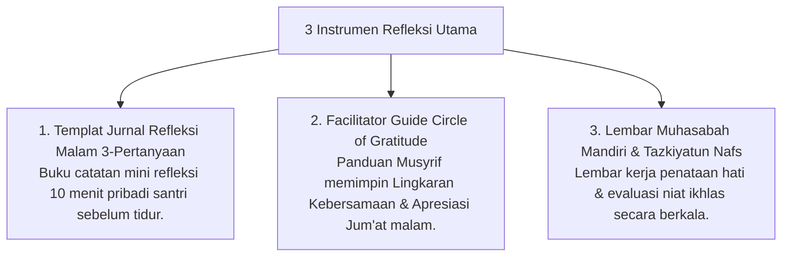

# P11-03: Instrumen Refleksi Santri

## Status Dokumen
* **Status**: 🌟 **A+ (Tervalidasi & Siap Diimplementasikan)**
* **Sub-Domain**: `11 Tools / 03 Reflection Tools`
* **Penanggung Jawab Keilmuan**: Dewan Keilmuan TUMBUH (*Pakar Epistemologi Turats & Pakar Bimbingan Konseling*)

---

## 1. Konseptualisasi Reflection Tools Pesantren

Instrumen Refleksi (*Reflection Tools*) menyediakan templat kerja mandiri & kelompok bagi santri untuk melatih muhasabah an-nafs dan metakognisi karakter:

---

## 2. Jaminan Kerahasiaan Sesi Refleksi

Tingkat privasi jurnal refleksi dijaga ketat agar santri jujur tulus mengekspresikan dinamika batinnya.
