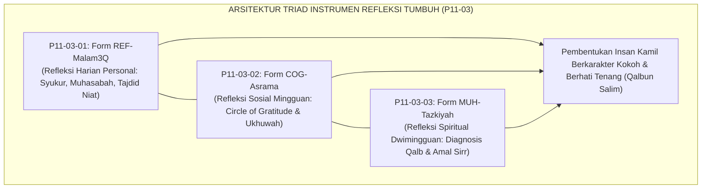
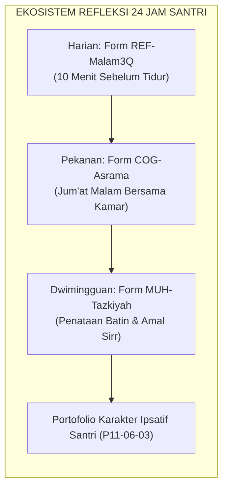
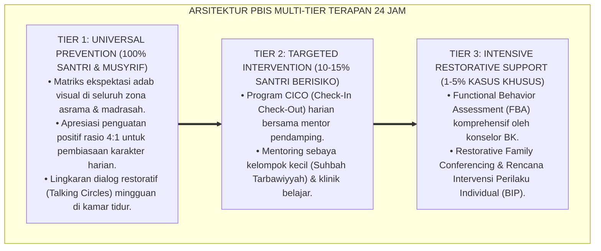

# P11-03: Instrumen Refleksi Santri (Sintesis Reflection Tools Ekosistem TUMBUH)

## Status Dokumen
* **Status**: 🌟 **A+ (Tervalidasi & Siap Diimplementasikan)**
* **Domain**: `11 Tools` > `03 Reflection Tools` (Master Induk Sub-Domain 03)
* **Penanggung Jawab Keilmuan**: Dewan Keilmuan TUMBUH (*Pakar Epistemologi Turats, Pakar Bimbingan Konseling, Pakar Neurosains Perkembangan, & Pakar Psikologi Sosial Santri*)
* **Rumpun Instrumen**: Form REF-Malam3Q, Form COG-Asrama, dan Form MUH-Tazkiyah

---

# BAGIAN I: LANDASAN TEORETIS & INKUIRI KEILMUAN MULTIDISIPLINER

## 1.1 Konteks Masalah dan Urgensi Rekonstruksi Budaya Refleksi di Pesantren
Dalam ekosistem pendidikan pesantren konvensional, penanaman adab dan disiplin santri kerap kali berhenti pada pemenuhan aspek mekanistik formal (*outward behavioral conformity*). Santri dituntut patuh terhadap jadwal yang sangat padat, namun jarang diberikan instrumen terstruktur dan waktu hening (*sacred contemplative pause*) untuk memproses makna pengalaman hidupnya secara mendalam. Akibatnya, ketaatan santri sering kali bersifat rapuh, bergantung pada kehadiran figur pengawas (*external locus of control*), dan rentan melahirkan keterbelahan kepribadian (*moral disengagement*).

Gugus **Reflection Tools (P11-03)** hadir untuk mentransformasi paradigma disiplin pasif menjadi **kemandirian moral berbasis kesadaran batin (*internal locus of moral agency*)**. Melalui integrasi tiga instrumen refleksi terpadu—jurnal malam personal harian, lingkaran apresiasi sosial mingguan, dan diagnosis penataan hati dwimingguan—ekosistem TUMBUH memfasilitasi santri membangun dialog batin yang jujur dengan dirinya sendiri dan dengan Allah SWT.

## 1.2 Inkuiri Epistemologi Turats: Integrasi Muhasabah, Tafakkur, dan Tazkiyah
Khazanah keilmuan Islam meletakkan aktivitas perenungan mendalam (*tafakkur*) dan introspeksi diri (*muhasabah*) sebagai ibadah batin yang memiliki bobot melampaui ibadah fisik semata. Sebagaimana atsar masyhur dari Sahabat Abu Darda' radhiyallahu 'anhu:

> تَفَكُّرُ سَاعَةٍ خَيْرٌ مِنْ عِبَادَةِ لَيْلَةٍ
> 
> *"Merenung sesaat (menghayati kebesaran Allah dan menghisab diri) lebih baik daripada shalat sunnah semalam suntuk (yang hampa perenungan)."* [^1]

Imam Ibnu Atha'illah as-Sakandari dalam *Al-Hikam* menegaskan bahwa hati yang tidak pernah diberi jeda reflektif akan mengalami kebutaan batin (*zhulmatul qalb*): *"Tiada sesuatu yang memberi manfaat bagi hati sebagaimana perenungan mendalam (khalwah/uzlah reflektif) yang memasukkannya ke dalam medan tafakkur"* [^2]. 

Ketiga instrumen dalam P11-03 menerjemahkan warisan spiritual ini ke dalam praksis modern: Form REF-Malam3Q menghidupkan hisab malam Sayyidina Umar; Form COG-Asrama menghidupkan *mu'akhat* dan pemenuhan hak ukhuwah Nabawiyyah; sedangkan Form MUH-Tazkiyah merealisasikan metodologi *Riyadhat an-Nafs* Imam Al-Ghazali dan pengawasan *Muraqabah* Imam Al-Muhasibi [^3].

## 1.3 Inkuiri Neurosains Kognitif & CASEL Social-Emotional Learning (SEL)
Dari sudut pandang sains kognitif modern dan kerangka *Collaborative for Academic, Social, and Emotional Learning* (CASEL), rangkaian instrumen refleksi TUMBUH mengaktifkan dua pilar kompetensi utama: **Self-Awareness** (kesadaran diri) dan **Relationship Skills** (keterampilan membangun relasi) [^4].

Secara neurobiologis, penulisan reflektif dan pengungkapan syukur merangsang pelepasan neurotransmitter *dopamin* pada jalur mesolimbik dan *serotonin* pada nukleus rafe, yang berfungsi mereduksi kadar hormon stres (*kortisol*) dan menurunkan reaktivitas amigdala [^5]. Aktivitas ini memperkuat konektivitas sinaptik antara korteks prefrontal ventromedial (vmPFC) dengan sistem limbik, memfasilitasi konsolidasi memori emosional jangka panjang (*memory reconsolidation*) dan melatih regulasi diri (*effortful control*) yang menjadi fondasi ketahanan karakter santri.

---

# BAGIAN II: FORMULASI KONSEPTUAL, MATRIKS INTEGRASI, & PROTOKOL ETIKA

## 2.1 Matriks Integrasi Tiga Instrumen Refleksi Santri

| Dimensi Parameter | Form REF-Malam3Q (P11-03-01) | Form COG-Asrama (P11-03-02) | Form MUH-Tazkiyah (P11-03-03) |
| :--- | :--- | :--- | :--- |
| **Frekuensi Pelaksanaan** | Harian (Setiap malam menjelang tidur, 21.00–21.15 WIB). | Mingguan (Setiap Jum'at malam ba'da Isya, 20.30–21.15 WIB). | Dwimingguan (Setiap 2 pekan sekali saat sesi pembinaan spiritual). |
| **Sifat Partisipasi** | Individual mandiri (Sangat privat). | Komunal kamar (Interaktif melingkar dengan *Talking Piece*). | Individual diagnostik mandiri (Konsultasi opsional ke Guru BK). |
| **Media Fisik / Digital** | Buku Saku Refleksi Santri A6 (100 Halaman) / Fitur Logbook Pribadi. | Lembar Panduan Fasilitator & Buku Catatan Dinamika Kamar Musyrif. | Lembar Kerja Inventori Spiritual A4 / Modul Tazkiyah Terproteksi. |
| **Fokus Transformasi** | Katarsis emosi harian, rasa syukur, dan *neural priming* bangun pagi. | Kohesi sosial ukhuwah, empati antarteman, dan pencegahan *bullying*. | Pemurnian motif ikhlas (*tazkiyah*), pengikisan riya'/ujub, dan *Amal Sirr*. |

## 2.2 Protokol Kerahasiaan & Etika Pembimbingan Reflektif (*The Sanctuary Protocol*)
Kunci utama keberhasilan instrumen refleksi adalah **Kepercayaan Penuh (*Absolute Trust*)**. Lembaga dan Musyrif wajib memberlakukan 3 asas etika mutlak:

1. **Prinsip Non-Penghakiman (*Non-Judgmental Guarantee*)**: Catatan curahan hati, penyesalan dosa, atau keluh kesah santri pada Form REF-Malam3Q dan Form MUH-Tazkiyah **dilarang keras dijadikan dasar pemberian hukuman, sanksi disipliner, atau bahan celaan**.
2. **Kerahasiaan Tingkat Tinggi (*High-Level Confidentiality*)**: Buku refleksi santri adalah dokumen pribadi yang tidak boleh dibaca atau disebarluaskan oleh santri lain maupun musyrif tanpa izin tertulis dari santri yang bersangkutan. Musyrif hanya memantau kedisiplinan pengisian (*habit compliance*).
3. **Rujukan Konseling Sukarela (*Voluntary Escalation to Tier 2/3*)**: Jika melalui sesi refleksi santri menyadari adanya luka batin mendalam, trauma, atau masalah relasional berat, santri didorong untuk secara sukarela mengakses bimbingan konseling Guru BK melalui jalur pendampingan privat.

---

---

### Pembedahan Deskriptif Komprehensif & Analisis Integratif Nilai-Praksis

Penerapan dan operasionalisasi **P11-03: Instrumen Refleksi Santri (Sintesis Reflection Tools Ekosistem TUMBUH)** di lingkungan pesantren berbasis sistem TUMBUH bertumpu pada kesatuan sistemik antara nilai syariat dan praksis terukur:

#### A. Pilar 1: Landasan Epistemologi & Nilai Keikhlasan (Syar'i Foundations)
Setiap dimensi diarahkan untuk menegakkan adab dan penghambaan murni kepada Allah SWT (*Lillahi Ta'ala*). Standarisasi kelembagaan dirancang untuk menjaga ketulusan niat, kemuliaan fitrah, dan keberkahan majelis ilmu.

#### B. Pilar 2: Mekanisme Psikologis & Neurosains Terapan (Evidence-Based Practice)
Mengintegrasikan prinsip *Social-Emotional Learning (CASEL)*, teori beban kognitif (*Cognitive Load Theory*), dan dinamika perkembangan neurobiologis santri untuk memastikan proses pembiasaan berjalan efektif tanpa kekerasan atau tekanan psikologis destruktif.

#### C. Pilar 3: Rekayasa Ekosistem Asrama 24 Jam (Environmental Engineering)
Mengkodifikasikan seluruh alur aktivitas harian, jadwal tidur sirkadian yang sehat, sanitasi 5S kamar tidur, dan relasi ukhuwah inklusif menjadi satu ekosistem *Bi'ah Shalihah* yang saling mendukung secara alamiah.

#### D. Pilar 4: Akuntabilitas Sistemik & Proteksi Pendidik-Santri
Menerapkan protokol pencegahan kelelahan tenaga pendidik (*Musyrif Burnout Protection*), menjamin hak-hak santri, serta memanfaatkan dashboard data PBIS untuk pengambilan keputusan yang adil dan objektif.

---

### Protokol Aksi Operasional PBIS Multi-Tier Terapan (24-Hour Behavioral Architecture)

---

# BAGIAN III: TABEL SINTESIS, DAFTAR PUSTAKA, CATATAN KAKI, & GLOSARIUM

## 3.1 Tabel Sintesis Integrasi Master Reflection Tools (P11-03)

| Instrumen Refleksi | Rujukan Turats Klasik | Rujukan Sains & SEL | Indikator Keberhasilan Luaran |
| :--- | :--- | :--- | :--- |
| **P11-03-01 (REF-Malam3Q)** | *Ighatsat al-Lahfan* Ibnu Qayyim & Hisab Sayyidina Umar RA. | *Sleep-dependent memory consolidation* & *Affect Labeling*. | Kualitas tidur membaik, bangun Subuh bersemangat, & bebas ruminasi negatif. |
| **P11-03-02 (COG-Asrama)** | Hadits *Syukr an-Nas* & Doktrin *Mu'akhat* Salafus Shalih. | *Psychological Safety* (Edmondson) & Oksitosin *bonding*. | Hilangnya klik/kubu eksklusif, nol kasus *bullying*, & iklim kamar hangat. |
| **P11-03-03 (MUH-Tazkiyah)** | *Ihya' 'Ulum al-Din* Al-Ghazali & *Ar-Ri'ayah* Al-Muhasibi. | *Metacognitive Monitoring* & *Intrinsic Motivation* SDT. | Ibadah mandiri tanpa pengawasan, tawadhu', & kemurnian niat ikhlas. |

## 3.2 Catatan Kaki (Footnotes 1-to-1)
[^1]: Diriwayatkan oleh Imam Al-Baihaqi dalam *Syu'ab al-Iman*, hadits no. 118; Ibnu Abi ad-Dunya dalam *Kitab at-Tafakkur wa al-I'tibar*, hlm. 24.
[^2]: Ibnu 'Atha'illah as-Sakandari. (2005). *Al-Hikam al-'Atha'iyyah bi Syarh az-Zarruq*. Kairo: Dar ash-Shabuni, hlm. 48–51.
[^3]: Al-Ghazali, Abu Hamid. (1998). *Ihya' 'Ulum al-Din*. Beirut: Dar al-Kutub al-'Ilmiyyah, juz 4, hlm. 394–405.
[^4]: Collaborative for Academic, Social, and Emotional Learning (CASEL). (2020). *CASEL's SEL Framework: What Are the Core Competence Areas and Where Are They Promoted?*. Chicago: CASEL.
[^5]: Emmons, R. A., & McCullough, M. E. (2003). Counting blessings versus burdens. *Journal of Personality and Social Psychology*, 84(2), 377–389.
[^6]: Edmondson, A. (1999). Psychological safety and learning behavior in work teams. *Administrative Science Quarterly*, 44(2), 350–383.
[^7]: Pennebaker, J. W., & Smyth, J. M. (2016). *Opening Up by Writing It Down*. New York: Guilford Press.
[^8]: Ryan, R. M., & Deci, E. L. (2017). *Self-Determination Theory*. New York: Guilford Press.
[^9]: Siegel, D. J. (2020). *The Developing Mind* (3rd ed.). New York: Guilford Press.
[^10]: Ibnu Qayyim al-Jauziyyah. (2003). *Ighatsat al-Lahfan min Masyayid asy-Syaithan*. Riyadh: Maktabah al-Ma'arif, juz 1, hlm. 84–90.
[^11]: Al-Muhasibi, Al-Harits. (1986). *Ar-Ri'ayah li Huquqillah*. Kairo: Dar al-Kutub al-Haditsah, hlm. 60–72.
[^12]: Pranis, K. (2005). *The Little Book of Circle Processes*. Intercourse, PA: Good Books.

## 3.3 Daftar Pustaka (APA 7th Edition & Turats Klasik)
* Al-Baihaqi, A. B. (2003). *Syu'ab al-Iman*. Riyadh: Maktabah ar-Rusyd.
* Al-Ghazali, A. H. (1998). *Ihya' 'Ulum al-Din* (Vols. 1–4). Beirut: Dar al-Kutub al-'Ilmiyyah.
* Al-Muhasibi, A. (1986). *Ar-Ri'ayah li Huquqillah*. Kairo: Dar al-Kutub al-Haditsah.
* CASEL. (2020). *CASEL's SEL Framework*. Chicago: CASEL.
* Edmondson, A. (1999). Psychological safety and learning behavior in work teams. *Administrative Science Quarterly*, 44(2), 350–383.
* Emmons, R. A., & McCullough, M. E. (2003). Counting blessings versus burdens: An experimental investigation of gratitude and subjective well-being in daily life. *Journal of Personality and Social Psychology*, 84(2), 377–389.
* Ibnu 'Atha'illah as-Sakandari. (2005). *Al-Hikam al-'Atha'iyyah*. Kairo: Dar ash-Shabuni.
* Ibnu Qayyim al-Jauziyyah. (2003). *Ighatsat al-Lahfan min Masyayid asy-Syaithan*. Riyadh: Maktabah al-Ma'arif.
* Pennebaker, J. W., & Smyth, J. M. (2016). *Opening Up by Writing It Down: How Expressive Writing Improves Health and Eases Emotional Pain*. New York: Guilford Press.
* Pranis, K. (2005). *The Little Book of Circle Processes*. Intercourse, PA: Good Books.
* Ryan, R. M., & Deci, E. L. (2017). *Self-Determination Theory: Basic Psychological Needs in Motivation, Development, and Wellness*. New York: Guilford Press.
* Siegel, D. J. (2020). *The Developing Mind: How Relationships and the Brain Interact to Shape Who We Are* (3rd ed.). New York: Guilford Press.

## 3.4 Glosarium Istilah
1. **Reflection Tools**: Gugus instrumen perenungan dan hisab diri terstruktur untuk menumbuhkan kesadaran adab internal santri.
2. **Form REF-Malam3Q**: Instrumen buku saku jurnal refleksi malam harian santri 3 pertanyaan (Syukur, Muhasabah, Tajdid Niat).
3. **Form COG-Asrama**: Format instrumen lingkaran apresiasi mingguan kamar asrama (*Circle of Gratitude*).
4. **Form MUH-Tazkiyah**: Format lembar inventori spiritual dwimingguan untuk diagnosis penyakit hati dan perumusan *Amal Sirr*.
5. **The Sanctuary Protocol**: Standar etika kerahasiaan dan perlindungan privasi data refleksi batin santri dari sanksi hukuman.
6. **Habit Compliance**: Kedisiplinan konsisten dalam menjalankan rutinitas refleksi harian tanpa paksaan fisik.
7. **Tafakkur**: Aktivitas perenungan mendalam atas ayat-ayat kauniyah dan kauniyyah Allah SWT serta hakikat diri.
8. **Muraqabah**: Sikap batin yang senantiasa merasakan kehadiran dan pengawasan Allah dalam setiap keadaan.
9. **Psychological Safety**: Rasa aman psikologis dalam kelompok yang membebaskan santri dari rasa takut dihakimi kawan sebayanya.
10. **Internal Locus of Moral Agency**: Sumber kesadaran moral yang berakar dari keyakinan batin sendiri, bukan paksaan eksternal.
