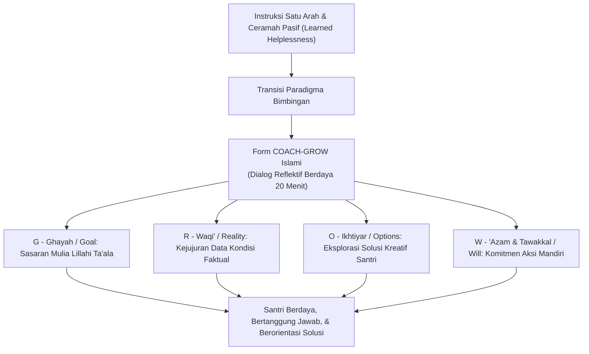
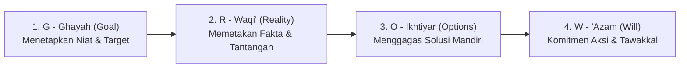

# P11-04-01: Templat Lembar Kerja GROW Model Islami (Form COACH-GROW)

## Status Dokumen
* **Status**: 🌟 **A+ (Tervalidasi & Siap Diimplementasikan)**
* **Sub-Domain**: `11 Tools / 04 Coaching Tools`
* **Penanggung Jawab Keilmuan**: Dewan Keilmuan TUMBUH (*Pakar Pedagogi Master Guru, Pakar Tata Kelola Qudwah, & Pakar Bimbingan Konseling*)
* **Bentuk Instrumen**: Form COACH-GROW (Lembar Kerja Dialog Coaching Berdaya, Panduan Pertanyaan Berdaya / *Powerful Questions*, & Lembar Komitmen 'Azam Santri)

---

# BAGIAN I: LANDASAN TEORETIS & INKUIRI KEILMUAN MULTIDISIPLINER

## 1.1 Konteks Masalah: Jebakan Komunikasi Menggurui dan Ketergantungan Eksternal
Pola komunikasi bimbingan yang dominan di lingkungan pesantren tradisional kerap kali bertumpu pada instruksi satu arah (*one-way didactic lecturing*), penghakiman cepat (*premature judgment*), dan pemberian solusi instan secara sepihak dari guru kepada santri. Ketika seorang santri mengalami penurunan hafalan Al-Qur'an, kelesuan ibadah, atau kesulitan adaptasi sosial, respons pendidik yang umum adalah menceramahi atau memarahi.

Pendekatan direktif yang berlebihan ini mereduksi otonomi berpikir santri, melahirkan ketergantungan psikologis (*learned helplessness*), dan mematikan daya pemecahan masalah mandiri (*problem-solving agency*). Santri menjadi terbiasa disuruh tanpa pernah diajak berpikir kritis untuk mengenali akar masalahnya sendiri. Form COACH-GROW hadir sebagai instrumen dialog percakapan berdaya (*empowering conversational framework*) yang mengintegrasikan model GROW klasik dengan nilai-nilai syura dan tawakkal Islam, menempatkan santri sebagai pemilik sah dari ikhtiar perubahannya.



## 1.2 Inkuiri Epistemologi Turats: Tradisi Hiwar Nabawi dan Seni Syura
Metode *coaching* bukanlah konsep asing dalam peradaban Islam; ia berakar kokoh pada tradisi dialog interaktif kenabian (*Al-Hiwar an-Nabawi*). Rasulullah SAW tidak pernah mendiktekan solusi saat mendidik para sahabat muda, melainkan sering melontarkan pertanyaan reflektif yang menggugah nalar dan menyentuh nurani (*Powerful Socratic Questions*).

Contoh agung terekam dalam hadits Sayyidina Mu'adz bin Jabal radhiyallahu 'anhu saat diutus ke Yaman:

> كَيْفَ تَقْضِي إِذَا عَرَضَ لَكَ قَضَاءٌ؟ قَالَ: أَقْضِي بِكِتَابِ اللَّهِ. قَالَ: فَإِنْ لَمْ تَجِدْ فِي كِتَابِ اللَّهِ؟ قَالَ: فَبِسُنَّةِ رَسُولِ اللَّهِ صَلَّى اللَّهُ عَلَيْهِ وَسَلَّمَ. قَالَ: فَإِنْ لَمْ تَجِدْ فِي سُنَّةِ رَسُولِ اللَّهِ؟ قَالَ: أَجْتَهِدُ رَأْيِي وَلَا آلُو. فَضَرَبَ رَسُولُ اللَّهِ صَلَّى اللَّهُ عَلَيْهِ وَسَلَّمَ صَدْرَهُ وَقَالَ: الْحَمْدُ لِلَّهِ الَّذِي وَفَّقَ رَسُولَ رَسُولِ اللَّهِ لِمَا يُرْضِي رَسُولَ اللَّهِ
> 
> *"'Bagaimana engkau akan memutuskan perkara jika diajukan kepadamu suatu masalah hukum?' Mu'adz menjawab: 'Aku akan memutuskan berdasarkan Kitabullah.' Nabi bertanya lagi: 'Jika engkau tidak mendapatkannya dalam Kitabullah?' Mu'adz menjawab: 'Berdasarkan Sunnah Rasulullah SAW.' Nabi bertanya lagi: 'Jika engkau tidak mendapatkannya dalam Sunnah Rasulullah?' Mu'adz menjawab: 'Aku akan berijtihad dengan segenap penalaranku tanpa ragu.' Maka Rasulullah SAW menepuk dadanya seraya bersabda: 'Segala puji bagi Allah yang telah memberikan taufik kepada utusan Rasulullah menuju apa yang diridhai oleh Rasulullah.'"* [^1]

Dalam hadits ini, Rasulullah SAW memvalidasi kapasitas berpikir mandiri (*ijtihad*) Mu'adz melalui pertanyaan bertingkat tanpa mendikte. Form COACH-GROW mengadaptasi struktur *Hiwar Nabawi* ini menjadi 4 tahapan sistematis: *Al-Ghayah* (Goal), *Al-Waqi'* (Reality), *Al-Ikhtiyar* (Options), dan *Al-'Azam ma'at Tawakkal* (Will/Action).

## 1.3 Inkuiri Sains Kognitif: Self-Determination Theory, Agency, dan Solution-Focused Coaching
Dalam ranah psikologi kognitif dan teori motivasi kontemporer (*Self-Determination Theory* oleh Deci & Ryan, 2000), motivasi berkelanjutan hanya tercipta apabila tiga kebutuhan dasar psikologis terpenuhi: **Autonomy** (rasa memiliki kendali), **Competence** (rasa mampu mengatasi tantangan), dan **Relatedness** (keterhubungan empatik) [^2].

Model GROW yang digagas Sir John Whitmore (1992) membuktikan secara neurosains bahwa ketika seorang individu menemukan solusi melalui proses penalarannya sendiri (*insight generation*), korteks prefrontal anterior dan lobus parietal kanan melepaskan gelombang gamma yang mempercepat pembentukan jalur sinaptik baru (*neuroplastic wiring*) [^3]. Sebaliknya, nasihat yang dipaksakan dari luar mengaktifkan respons penolakan amigdala (*threat response*). Form COACH-GROW mengoptimalkan pemikiran berorientasi solusi (*Solution-Focused Brief Coaching*) dalam bingkai keteladanan qudwah musyrif.

---

# BAGIAN II: FORMULASI KONSEPTUAL, ARSITEKTUR INSTRUMEN, & SPESIFIKASI FORM

## 2.1 Arsitektur 4 Pilar Form COACH-GROW Islami
Sesi dialog *coaching* dilaksanakan secara privat (15–25 menit) antara Musyrif/Guru Coach dengan Santri (Coachee) menggunakan panduan alur 4 pilar:

1. **G - GHAYAH / GOAL (Sasaran & Niat Mulia)**: Menetapkan target spesifik, terukur, dan bermakna ukhrawi. Coach bertanya: *"Target hafalan atau adab apa yang ingin antum raih 2 pekan ke depan demi mendekatkan diri kepada Allah?"*
2. **R - WAQI' / REALITY (Kejujuran Realitas Faktual)**: Membedah kondisi objektif tanpa mencari kambing hitam. Coach bertanya: *"Di mana posisi hafalan antum saat ini, dan tantangan apa yang paling sering menghambat di kamar/kelas?"*
3. **O - IKHTIYAR / OPTIONS (Eksplorasi Opsi Mandiri)**: Memancing gagasan kreatif alternatif pemecahan masalah dari santri. Coach bertanya: *"Jika antum memiliki kebebasan penuh, langkah apa saja yang bisa antum coba untuk mengatasi kantuk/kesulitan itu?"*
4. **W - 'AZAM & TAWAKKAL / WILL (Komitmen Aksi & Doa)**: Memilih aksi konkret, menentukan tenggat waktu, dan memilih rekan pendamping (*accountability partner*). Coach bertanya: *"Dari opsi tadi, langkah konkret apa yang akan antum mulai bangun Subuh besok? Siapa kawan yang antum minta tolong untuk mengingatkan?"*



## 2.2 Format Instrumen Form COACH-GROW (Lembar Kerja Siap Pakai)

```markdown
================================================================================
           LEMBAR KERJA COACHING KARAKTER & AKADEMIK (FORM COACH-GROW)
================================================================================
Nama Santri (Coachee) : [____________________]   Kelas/Kamar : [___________]
Nama Musyrif (Coach)  : [____________________]   Tanggal/Wkt : [___-___-2026]
Sesi Pertemuan Ke-    : [___] (Durasi: 20 Menit) Fokus Isu   : [Adab/Tahfizh/Akademik]
--------------------------------------------------------------------------------

[FASE 1: G - GHAYAH / GOAL (TARGET SPESIFIK & NIAT MULIA)]
* Pertanyaan Pemandu: "Apa capaian nyata yang ingin antum wujudkan 2 pekan ke depan?"
Target Spesifik Santri:
________________________________________________________________________________
Alasan Mulia / Makna Spiritual:
________________________________________________________________________________

[FASE 2: R - WAQI' / REALITY (KONDISI FAKTUAL & TANTANGAN SAAT INI)]
* Pertanyaan Pemandu: "Bagaimana kondisi riil saat ini? Apa yang sudah berjalan baik dan apa kendalanya?"
Kondisi Faktual Saat Ini:
________________________________________________________________________________
Kendala / Godaan Terbesar:
________________________________________________________________________________

[FASE 3: O - IKHTIYAR / OPTIONS (EKSPLORASI GAGASAN SOLUSI SANTRI)]
* Pertanyaan Pemandu: "Apa saja ide atau cara yang bisa antum lakukan untuk mengatasi kendala tersebut?"
Gagasan Opsi 1: ________________________________________________________________
Gagasan Opsi 2: ________________________________________________________________
Gagasan Opsi 3: ________________________________________________________________

[FASE 4: W - 'AZAM & TAWAKKAL / WILL (KOMITMEN AKSI KONKRET)]
* Pertanyaan Pemandu: "Langkah mana yang akan antum eksekusi mulai esok hari?"
1. Aksi Konkret Pertama : ______________________________________________________
2. Waktu & Tempat Aksi  : Mulai tanggal [___-___-2026] saat waktu [___________]
3. Sahabat Pendukung    : Akhi [____________________] (Kawan se-kamar/halaqah)
4. Doa/Tawakkal Khusus  : Memohon istiqamah dalam doa ba'da shalat fardhu.

--------------------------------------------------------------------------------
Tanda Tangan Santri (Pelaksana 'Azam)          Tanda Tangan Musyrif (Coach Pendamping)


(___________________________________)          (_____________________________________)
================================================================================
```

## 2.3 Rubrik Evaluasi Keterampilan Dialog Musyrif Coach
Lembaga menggunakan rubrik ini untuk menguji kemahiran musyrif dalam memfasilitasi sesi dialog berbasis pemberdayaan:

| Keterampilan Dialog | Level 1: Direktif/Instruktif (Belum Sesuai) | Level 2: Interogatif/Menghakimi | Level 3: Coaching Berdaya (Standar TUMBUH) |
| :--- | :--- | :--- | :--- |
| **Karakter Pertanyaan** | Mendominasi percakapan, langsung memberi perintah (*"Kamu harus begini..."*). | Banyak bertanya *"Kenapa kamu malas?"* yang memicu santri defensif dan beralasan. | Mengajukan pertanyaan terbuka berawalan *"Apa"* dan *"Bagaimana"* yang memicu nalar solusi. |
| **Porsi Waktu Bicara** | Musyrif berbicara $80\%$, santri hanya mendengarkan pasif $20\%$. | Musyrif memotong pembicaraan santri di tengah kalimat untuk mengoreksi. | Santri berbicara $70\%$, Musyrif menyimak aktif $30\%$ seraya memvalidasi emosi. |
| **Kepemilikan Solusi** | Solusi didiktekan sepenuhnya oleh musyrif; santri tinggal menandatangani. | Solusi diarahkan secara manipulatif agar sesuai kehendak musyrif. | Solusi digagas dan dipilih sendiri secara otonom oleh santri dengan bangga. |

---

# BAGIAN III: TABEL SINTESIS, DAFTAR PUSTAKA, CATATAN KAKI, & GLOSARIUM

## 3.1 Tabel Sintesis Integrasi GROW Model Islami

| Elemen Form COACH-GROW | Landasan Turats & Fiqh | Landasan Neurosains & Coaching | Target Transformasi Karakter |
| :--- | :--- | :--- | :--- |
| **G - Ghayah (Goal)** | Niat ikhlas & doktrin *Hifzhul Maqashid*. | *Goal-setting theory* (Locke & Latham) & PFC priming. | Membangun visi ibadah yang terarah dan bermakna. |
| **R - Waqi' (Reality)** | Asas *Tabayyun* & kejujuran hisab diri (*Sidq*). | *Objective self-assessment* & kalibrasi metakognitif. | Menghilangkan sikap defensif dan penyangkalan (*denial*). |
| **O - Ikhtiyar (Options)** | Prinsip *Ijtihad* & musyawarah mufakat (*Syura*). | *Insight generation* & aktivasi gelombang gamma otak. | Melatih kemandirian berpikir dan kreativitas ikhtiar. |
| **W - 'Azam (Will)** | Doktrin *Fa idza 'azamta fatawakkal 'alallah* (QS. Ali 'Imran: 159). | *Implementation intentions* (Gollwitzer) & komitmen sosial. | Mengembangkan ketekunan (*grit*), kedisiplinan, dan tanggung jawab. |

## 3.2 Catatan Kaki (Footnotes 1-to-1)
[^1]: Diriwayatkan oleh Imam Abu Dawud dalam *Sunan Abi Dawud*, kitab *al-Aqdhiyah*, hadits no. 3592; Imam at-Tirmidzi dalam *Sunan at-Tirmidzi*, no. 1327 (Hadits Masyhur/Hasan).
[^2]: Ryan, R. M., & Deci, E. L. (2000). Self-determination theory and the facilitation of intrinsic motivation, social development, and well-being. *American Psychologist*, 55(1), 68–78.
[^3]: Whitmore, J. (1992). *Coaching for Performance: GROWing Human Potential and Purpose*. London: Nicholas Brealey Publishing.
[^4]: Locke, E. A., & Latham, G. P. (2002). Building a practically useful theory of goal setting and task motivation: A 35-year odyssey. *American Psychologist*, 57(9), 705–717.
[^5]: Gollwitzer, P. M. (1999). Implementation intentions: Strong effects of simple plans. *American Psychologist*, 54(7), 493–503.
[^6]: Al-Ghazali, Abu Hamid. (1998). *Ihya' 'Ulum al-Din: Kitab Adab ash-Shuhbah wa al-Mu'asyarah*. Beirut: Dar al-Kutub al-'Ilmiyyah, juz 2, hlm. 180–192.
[^7]: Grant, A. M. (2003). The impact of life coaching on goal attainment, metacognition and mental health. *Social Behavior and Personality*, 31(3), 253–263.
[^8]: Ibnu Qayyim al-Jauziyyah. (2004). *Madarij as-Salikin: Manzilat al-Iradah wa al-'Azm*. Kairo: Dar al-Hadits, juz 1, hlm. 310–318.
[^9]: Rock, D. (2006). *Quiet Leadership: Six Steps to Transforming Performance at Work*. New York: Collins.
[^10]: An-Nawawi, Yahya bin Syaraf. (1994). *Syarh Shahih Muslim*. Beirut: Dar al-Khair, juz 12, hlm. 14–22.
[^11]: Seligman, M. E. P. (1975). *Helplessness: On Depression, Development, and Death*. San Francisco: W. H. Freeman.
[^12]: Al-Mawardi, Ali bin Muhammad. (1986). *Adab ad-Dunya wa ad-Din*. Beirut: Dar Iqra', hlm. 115–124.

## 3.3 Daftar Pustaka (APA 7th Edition & Turats Klasik)
* Al-Ghazali, A. H. (1998). *Ihya' 'Ulum al-Din* (Vol. 2). Beirut: Dar al-Kutub al-'Ilmiyyah.
* Al-Mawardi, A. M. (1986). *Adab ad-Dunya wa ad-Din*. Beirut: Dar Iqra'.
* An-Nawawi, Y. S. (1994). *Syarh Shahih Muslim* (Vol. 12). Beirut: Dar al-Khair.
* Deci, E. L., & Ryan, R. M. (2000). The "what" and "why" of goal pursuits: Human needs and the self-determination of behavior. *Psychological Inquiry*, 11(4), 227–268.
* Gollwitzer, P. M. (1999). Implementation intentions: Strong effects of simple plans. *American Psychologist*, 54(7), 493–503.
* Grant, A. M. (2003). The impact of life coaching on goal attainment, metacognition and mental health. *Social Behavior and Personality*, 31(3), 253–263.
* Ibnu Qayyim al-Jauziyyah. (2004). *Madarij as-Salikin* (Vol. 1). Kairo: Dar al-Hadits.
* Locke, E. A., & Latham, G. P. (2002). Building a practically useful theory of goal setting and task motivation. *American Psychologist*, 57(9), 705–717.
* Rock, D. (2006). *Quiet Leadership: Six Steps to Transforming Performance at Work*. New York: Collins.
* Seligman, M. E. P. (1975). *Helplessness: On Depression, Development, and Death*. San Francisco: W. H. Freeman.
* Whitmore, J. (1992). *Coaching for Performance: GROWing Human Potential and Purpose*. London: Nicholas Brealey Publishing.

## 3.4 Glosarium Istilah
1. **Form COACH-GROW**: Format instrumen lembar kerja dialog *coaching* karakter santri berbasis adaptasi 4 pilar GROW Islami (Ghayah, Waqi', Ikhtiyar, 'Azam).
2. **Hiwar Nabawi**: Metode pedagogi dialog interaktif Rasulullah SAW yang membimbing mitra bicara menemukan kebenaran melalui pertanyaan terarah.
3. **Powerful Questions**: Pertanyaan reflektif berdaya yang membuka cakrawala berpikir baru dan menumbuhkan rasa kepemilikan solusi.
4. **Learned Helplessness**: Sikap pasif dan tidak berdaya yang terbentuk akibat terlalu sering didikte tanpa diberi ruang mengambil keputusan.
5. **Autonomy Support**: Pendekatan pendidik yang menghormati kemandirian anak dan memberikan ruang otonomi dalam batas batasan syariat yang jelas.
6. **Implementation Intentions**: Strategi perencanaan spesifik yang menghubungkan sinyal situasi (*kapan & di mana*) dengan tindakan konkret (*apa yang dilakukan*).
7. **'Azam**: Tekad batin yang bulat dan kuat untuk merealisasikan suatu kebaikan tanpa keraguan, diiringi tawakkal kepada Allah.
8. **Solution-Focused Coaching**: Model bimbingan percakapan yang berorientasi langsung pada eksplorasi solusi masa depan daripada mengungkit kesalahan masa lalu.
9. **Accountability Partner**: Sahabat atau mentor pendamping yang disepakati untuk saling memantau keterlaksanaan komitmen aksi secara berkala.
10. **Tabayyun**: Proses klarifikasi dan verifikasi data faktual secara objektif sebelum menetapkan kesimpulan atau keputusan bimbingan.
