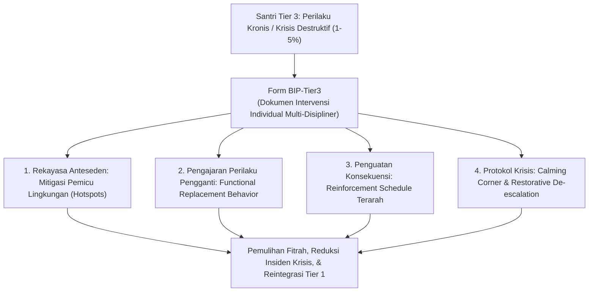
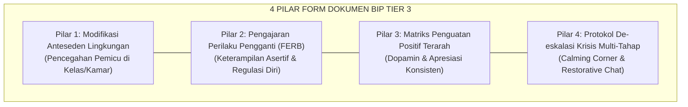

# P11-04-03: Form Dokumen Behavior Intervention Plan BIP Tier 3 (Form BIP-Tier3)

## Status Dokumen
* **Status**: 🌟 **A+ (Tervalidasi & Siap Diimplementasikan)**
* **Sub-Domain**: `11 Tools / 04 Coaching Tools`
* **Penanggung Jawab Keilmuan**: Dewan Keilmuan TUMBUH (*Pakar Bimbingan Konseling, Pakar PBIS, & Pakar Perlindungan Anak*)
* **Bentuk Instrumen**: Form BIP-Tier3 (Dokumen Rencana Intervensi Perilaku Individual, Matriks Strategi FBA-to-BIP, & Protokol De-eskalasi Krisis Santri)

---

# BAGIAN I: LANDASAN TEORETIS & INKUIRI KEILMUAN MULTIDISIPLINER

## 1.1 Konteks Masalah: Penanganan Kasus Kronis Tanpa Siklus Pengusiran (Zero Drop-Out)
Dalam piramida intervensi perilaku *School-Wide PBIS*, sekitar $1\%–5\%$ santri memerlukan dukungan intensif dan individual **Tier 3 (Dukungan Intensif Khusus)**. Santri pada tingkat ini kerap menunjukkan pola perilaku destruktif yang kompleks: agresi fisik berulang, pembangkangan kronis terhadap otoritas (*chronic defiance*), krisis kecemasan berat, kecenderungan melukai diri (*self-harm*), atau desersi/kabur dari pesantren (*elopement*).

Pendekatan institusional konvensional yang mengandalkan sanksi pengusiran langsung (*expulsion/drop-out*) atau isolasi punitive sering kali memperparah trauma psikologis anak, memutus masa depan pendidikannya, dan memindahkan masalah ke masyarakat luar.

TUMBUH mengadopsi prinsip **Nol Pengusiran Dini (*Zero Premature Drop-Out Policy*)** melalui penyusunan **Behavior Intervention Plan (Form BIP-Tier3)**. Dokumen ini adalah rancangan intervensi klinis-pedagogis komprehensif berbasis data *Functional Behavior Assessment* (FBA) yang dirancang oleh Tim Pendamping Khusus (*Wraparound Team*) untuk merekayasa lingkungan, mengajarkan perilaku pengganti adaptif (*functional replacement behavior*), dan memulihkan kesehatan mental santri.



## 1.2 Inkuiri Epistemologi Turats: Doktrin Ishlah al-Fasad dan Tathbib an-Nufus
Tradisi fiqih dakwah dan tasawuf memandang santri yang mengalami penyimpangan perilaku berat laksana orang sakit yang membutuhkan dokter jiwa (*thabib an-nufus*), bukan pesakitan yang harus dihukum buang. Rasulullah SAW bersabda menegaskan kewajiban melindungi dan memperbaiki saudara yang tergelincir:

> انْصُرْ أَخَاكَ ظَالِمًا أَوْ مَظْلُومًا. فَقَالَ رَجُلٌ: يَا رَسُولَ اللَّهِ، أَنْصُرُهُ إِذَا كَانَ مَظْلُومًا، أَفَرَأَيْتَ إِذَا كَانَ ظَالِمًا كَيْفَ أَنْصُرُهُ؟ قَالَ: تَحْجُزُهُ أَوْ تَمْنَعُهُ مِنَ الظُّلْمِ فَإِنَّ ذَلِكَ نَصْرُهُ
> 
> *"Tolonglah saudaramu yang berbuat zhalim atau yang dizhalimi.' Seorang sahabat bertanya: 'Wahai Rasulullah, aku menolongnya jika ia dizhalimi, namun bagaimana aku menolongnya jika ia yang berbuat zhalim?' Beliau bersabda: 'Engkau cegah atau halangi dia dari berbuat zhalim, maka itulah bentuk pertolonganmu kepadanya.'"* [^1]

Imam Ibnu Hazm Al-Andalusi dalam *Al-Akhlaq wa as-Siyar* menguraikan bahwa watak manusia yang rusak (*fasad al-khuluq*) tidak dapat disembuhkan dengan amarah dan kekerasan yang setara, melainkan dengan strategi pentahapan (*at-tadarruj*) dan pemutusan stimulus pemicu syahwat amarah [^2]. Form BIP-Tier3 mewujudkan konsep *tahjiz 'anizh-zhulm* ini dalam bentuk rekayasa anteseden dan perlindungan santri dari dorongan destruktifnya sendiri.

## 1.3 Inkuiri Sains PBIS & Terapi Perilaku Kognitif: FBA-to-BIP Translation
Dalam metodologi *Applied Behavior Analysis* (ABA) dan *Cognitive Behavioral Interventions* (CBI), keberhasilan BIP bergantung mutlak pada kesesuaian antara fungsi perilaku (*Behavioral Function*) dengan perilaku pengganti yang diajarkan (*Functionally Equivalent Replacement Behavior / FERB*) [^3].

Jika santri mengamuk untuk menghindari tugas hafalan berat (*Escape Function*), maka perilaku pengganti yang diajarkan bukan sekadar disuruh diam, melainkan diajarkan cara meminta jeda istirahat 5 menit secara santun (*Break Request Protocol*). Horner dan Sugai (2015) menegaskan bahwa BIP yang berbasis fungsi perilaku memiliki tingkat efikasi 3,5 kali lipat lebih tinggi dalam mereduksi perilaku destruktif dibandingkan intervensi umum tanpa analisis fungsi [^4].

---

# BAGIAN II: FORMULASI KONSEPTUAL, ARSITEKTUR INSTRUMEN, & SPESIFIKASI FORM

## 2.1 Arsitektur 4 Komponen Inti Form BIP-Tier3
Dokumen BIP Tier 3 dirumuskan oleh Tim Kasus Khusus (Guru BK, Musyrif Kamar, Kepala Pengasuhan, dan Orang Tua) mencakup 4 pilar intervensi:

1. **Strategi Anteseden (*Antecedent Environmental Modifications*)**: Mengubah stimulus pemicu di lingkungan fisik/sosial (misal: memindahkan posisi ranjang jauh dari santri yang memicu konflik, mengurangi beban target hafalan harian menjadi $50\%$ pada 2 pekan pertama).
2. **Pengajaran Perilaku Pengganti (*Teaching Replacement Behaviors*)**: Melatih keterampilan alternatif yang setara secara fungsi (misal: menggunakan kartu sinyal *"Time-Out Santun"* saat emosi mulai naik di kelas).
3. **Konsekuensi & Penguatan (*Reinforcement & Consequence Matrix*)**: Memberikan penguatan positif intensif saat santri berhasil menggunakan perilaku pengganti, serta meniadakan penguatan tak sengaja (*extinction*) saat perilaku destruktif muncul.
4. **Protokol De-eskalasi Krisis (*Crisis De-escalation & Safety Plan*)**: Panduan langkah demi langkah saat santri mengalami luapan amarah/disregulasi emosi akut guna menjamin keselamatan fisik seluruh penghuni asrama tanpa kekerasan.



## 2.2 Format Instrumen Dokumen BIP Tier 3 (Form BIP-Tier3 Master)

```markdown
================================================================================
         BEHAVIOR INTERVENTION PLAN (FORM BIP-TIER3) — DOKUMEN RAHASIA
                   Gugus Bimbingan Konseling & PBIS TUMBUH
================================================================================
ID Kasus      : BIP-2026-[____]          Tanggal Perumusan : [___-___-2026]
Nama Santri   : [____________________]   Kelas / Kamar     : [___________]
Konselor BK   : [____________________]   Musyrif Asrama    : [___________]
Tim BIP Hadir : 1. Guru BK [_________]  2. Musyrif [_________]  3. Wali [_________]
--------------------------------------------------------------------------------

[BAGIAN 1: RINGKASAN DATA FBA & HIPOTESIS FUNGSI PERILAKU]
* Perilaku Sasaran (Target Behavior) : Agresi verbal & melempar mushaf/buku saat halaqah.
* Frekuensi / Intensitas             : 4-5 kali per pekan / Level Tinggi (Mengganggu KBM).
* Pemicu Utama (Trigger/Antecedent)  : Ditunjuk membaca mendadak saat belum lancar tajwid.
* Hipotesis Fungsi Perilaku          : [X] ESCAPE (Menghindari rasa malu di depan kawan)
                                       [ ] ATTENTION (Mencari perhatian ustadz)
                                       [ ] TANGIBLE (Mendapatkan barang tertentu)

[BAGIAN 2: STRATEGI ANTESEDEN (MODIFIKASI LINGKUNGAN)]
1. Ustadz halaqah tidak menunjuk santri secara mendadak; memberikan aba-aba privat 5 menit sebelumnya.
2. Memberikan pendampingan talaqqi 1-on-1 privat oleh santri senior T4 sebelum sesi halaqah umum.
3. Mengatur posisi duduk santri di dekat ustadz untuk memudahkan kontak mata penenang.

[BAGIAN 3: PENGJARAN PERILAKU PENGGANTI (REPLACEMENT BEHAVIOR)]
1. Santri diajarkan mengangkat "Kartu Tanda Istighfar" saat merasa panik/marah untuk meminta jeda 3 menit.
2. Melatih teknik pernapasan 4-7-8 dan minum air putih saat amarah mulai memuncak.

[BAGIAN 4: JADWAL PENGUATAN POSITIF (REINFORCEMENT SCHEDULE)]
* Penguatan Harian : Jika santri mampu mengikuti halaqah tanpa insiden agresi, santri mendapat 
  waktu membaca buku literatur pilihan di perpustakaan selama 20 menit ba'da Ashar.
* Penguatan Pekanan: Sesi apresiasi privat bersama Kepala Pengasuhan dan video-call orang tua.

[BAGIAN 5: PROTOKOL DE-ESKALASI KRISIS 3 TAHAP (CRISIS PROTOCOL)]
1. TAHAP 1 (Gelisah/Agitasi) : Ustadz merendahkan nada suara, memberi ruang pribadi (jarak 2 meter).
2. TAHAP 2 (Ledakan Emosi)  : Ajak santri ke "Calming Corner" di ruang BK (Dilarang memegang/memiting).
3. TAHAP 3 (Pemulihan/Post) : Berikan air wudhu; lakukan Restorative Chat setelah emosi tenang stabil.

--------------------------------------------------------------------------------
Persetujuan Tim BIP:
Konselor BK                     Musyrif Asrama                  Wali Santri


(______________________)        (______________________)        (______________________)
================================================================================
```

## 2.3 Rubrik Pemantauan Efektivitas BIP Mingguan
Tim BIP melakukan evaluasi efektivitas intervensi setiap hari Kamis sore berdasarkan data logbook insiden:

| Status Intervensi | Indikator Data Insiden | Tindakan Tim Kasus Khusus |
| :--- | :--- | :--- |
| **1. Respons Positif (Sukses)** | Terjadi penurunan frekuensi perilaku destruktif $\ge 50\%$ dalam 3 pekan berturut-turut. | Mempertahankan rencana; memulai proses penurunan intensitas (*fading*) secara bertahap. |
| **2. Respons Parsial (Fluktuatif)**| Frekuensi menurun $10\%–49\%$; santri mulai menggunakan perilaku pengganti walau belum konsisten. | Melakukan modifikasi pada strategi anteseden dan memperkuat intensitas *reinforcement*. |
| **3. Non-Responsif (Stagnan/Eskalasi)**| Tidak ada penurunan frekuensi insiden atau terjadi eskalasi bahaya fisik bagi santri lain. | Melakukan re-asesmen FBA ulang; melibatkan psikolog klinis mitra dan psikiater rujukan. |

---

# BAGIAN III: TABEL SINTESIS, DAFTAR PUSTAKA, CATATAN KAKI, & GLOSARIUM

## 3.1 Tabel Sintesis Integrasi Dokumen BIP Tier 3

| Pilar Form BIP-Tier3 | Landasan Turats & Fiqh | Landasan Sains & Psikologi Klinis | Target Transformasi Perilaku |
| :--- | :--- | :--- | :--- |
| **Modifikasi Anteseden** | Kaidah *Sadd adz-Dzari'ah* & pencegahan fitnah. | *Stimulus Control* & rekayasa lingkungan pemicu. | Menghilangkan pemicu stres lingkungan asrama/kelas. |
| **Replacement Behavior** | Hadits *Al-Ladzina Yaghdhibun* & berwudhu saat marah. | *Functionally Equivalent Replacement Behavior (FERB)*. | Santri mampu mengekspresikan emosi secara asertif. |
| **De-eskalasi Krisis** | Prinsip *Ar-Rifq* & larangan memukul (HR. Muslim). | *Trauma-Informed Crisis De-escalation* (SAMHSA). | Mengembalikan regulasi sistem saraf tanpa trauma fisik. |

## 3.2 Catatan Kaki (Footnotes 1-to-1)
[^1]: Diriwayatkan oleh Imam Al-Bukhari dalam *Shahih al-Bukhari*, kitab *al-Mazhalim*, hadits no. 2444; Imam Ahmad dalam *Musnad Ahmad*, hadits no. 11993.
[^2]: Ibnu Hazm Al-Andalusi. (1983). *Al-Akhlaq wa as-Siyar fi Mudawat an-Nufus*. Beirut: Dar al-Afaq al-Jadidah, hlm. 65–74.
[^3]: O'Neill, R. E., Albin, R. W., Storey, K., Horner, R. H., & Sprague, J. R. (2015). *Functional Assessment and Program Development for Problem Behavior: A Practical Handbook* (3rd ed.). Boston: Cengage Learning.
[^4]: Horner, R. H., & Sugai, G. (2015). School-wide PBIS: An example of applied behavior analysis implemented at a scale of social importance. *Behavior Analysis in Practice*, 8(1), 80–85.
[^5]: SAMHSA. (2014). *SAMHSA's Concept of Trauma and Guidance for a Trauma-Informed Approach*. HHS Publication No. (SMA) 14-4884. Rockville, MD: SAMHSA.
[^6]: Al-Ghazali, Abu Hamid. (1998). *Ihya' 'Ulum al-Din: Kitab Kasyr asy-Syahwatain*. Beirut: Dar al-Kutub al-'Ilmiyyah, juz 3, hlm. 88–98.
[^7]: Linehan, M. M. (1993). *Cognitive-Behavioral Treatment of Borderline Personality Disorder*. New York: Guilford Press.
[^8]: An-Nawawi, Yahya bin Syaraf. (1994). *Syarh Shahih Muslim: Kitab al-Birr wa ash-Shilah*. Beirut: Dar al-Khair, juz 16, hlm. 140–148.
[^9]: Sugai, G., & Horner, R. H. (2009). Responsiveness-to-intervention and school-wide positive behavior supports: Integration of multi-tiered system of supports. *Exceptionality*, 17(4), 223–237.
[^10]: Ibnu Qayyim al-Jauziyyah. (2003). *Ad-Da' wa ad-Dawa' (Al-Jawab al-Kafi)*. Kairo: Dar al-Hadits, hlm. 112–120.
[^11]: Eber, L., Hyde, K., & Suter, J. C. (2011). Integrating mental health and PBIS: The wraparound approach. In *Handbook of School Mental Health* (pp. 303–318). Boston: Springer.
[^12]: Asy-Syathibi, Abu Ishaq. (2004). *Al-Muwafaqat fi Ushul asy-Syari'ah*. Kairo: Dar al-Ghad al-Jadid, juz 2, hlm. 312–320.

## 3.3 Daftar Pustaka (APA 7th Edition & Turats Klasik)
* Al-Bukhari, M. I. (2002). *Shahih al-Bukhari*. Riyadh: Bait al-Afkar ad-Dauliyyah.
* Al-Ghazali, A. H. (1998). *Ihya' 'Ulum al-Din* (Vol. 3). Beirut: Dar al-Kutub al-'Ilmiyyah.
* An-Nawawi, Y. S. (1994). *Syarh Shahih Muslim* (Vol. 16). Beirut: Dar al-Khair.
* Asy-Syathibi, A. I. (2004). *Al-Muwafaqat fi Ushul asy-Syari'ah*. Kairo: Dar al-Ghad al-Jadid.
* Eber, L., Hyde, K., & Suter, J. C. (2011). Integrating mental health and PBIS: The wraparound approach. In *Handbook of School Mental Health* (pp. 303–318). Boston: Springer.
* Horner, R. H., & Sugai, G. (2015). School-wide PBIS: An example of applied behavior analysis implemented at a scale of social importance. *Behavior Analysis in Practice*, 8(1), 80–85.
* Ibnu Hazm Al-Andalusi. (1983). *Al-Akhlaq wa as-Siyar fi Mudawat an-Nufus*. Beirut: Dar al-Afaq al-Jadidah.
* Ibnu Qayyim al-Jauziyyah. (2003). *Ad-Da' wa ad-Dawa'*. Kairo: Dar al-Hadits.
* Linehan, M. M. (1993). *Cognitive-Behavioral Treatment of Borderline Personality Disorder*. New York: Guilford Press.
* O'Neill, R. E., Albin, R. W., Storey, K., Horner, R. H., & Sprague, J. R. (2015). *Functional Assessment and Program Development for Problem Behavior: A Practical Handbook* (3rd ed.). Boston: Cengage Learning.
* SAMHSA. (2014). *SAMHSA's Concept of Trauma and Guidance for a Trauma-Informed Approach*. Rockville, MD: SAMHSA.
* Sugai, G., & Horner, R. H. (2009). Responsiveness-to-intervention and school-wide positive behavior supports. *Exceptionality*, 17(4), 223–237.

## 3.4 Glosarium Istilah
1. **Form BIP-Tier3**: Dokumen formal rencana intervensi perilaku individual intensif bagi santri yang memerlukan dukungan Tier 3 PBIS.
2. **Behavior Intervention Plan (BIP)**: Rencana aksi terstruktur berbasis bukti untuk mengurangi perilaku destruktif dan mengajarkan perilaku pengganti adaptif.
3. **Functionally Equivalent Replacement Behavior (FERB)**: Keterampilan perilaku baru yang diajarkan kepada santri yang memiliki fungsi pemenuhan kebutuhan yang sama dengan perilaku bermasalah namun dengan cara yang beradab dan aman.
4. **Crisis De-escalation Protocol**: Prosedur penanganan bertahap untuk meredakan ketegangan dan luapan amarah santri tanpa menggunakan kekerasan fisik.
5. **Antecedent Strategy**: Modifikasi lingkungan atau rutinitas untuk mencegah munculnya stimulus pemicu perilaku bermasalah.
6. **Ishlah al-Fasad**: Upaya sistematis memperbaiki kerusakan moral dan perilaku melalui pendekatan bimbingan yang penuh hikmah dan keadilan.
7. **Wraparound Team**: Tim pendukung multidisipliner yang terdiri dari konselor BK, musyrif, pimpinan asrama, dan keluarga yang bekerja bersama mendampingi santri.
8. **Calming Corner**: Area ruang tenang yang aman dan minim distraksi untuk memfasilitasi santri meregulasi sistem sarafnya saat mengalami disregulasi emosi.
9. **Zero Premature Drop-Out**: Kebijakan institusional yang menolak pengeluaran santri secara reaktif dan mengutamakan rehabilitasi adab serta kesehatan mental.
10. **Extinction**: Prosedur psikologis menghentikan penguatan tak disengaja yang selama ini mempertahankan perilaku bermasalah santri.
