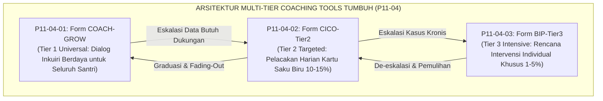
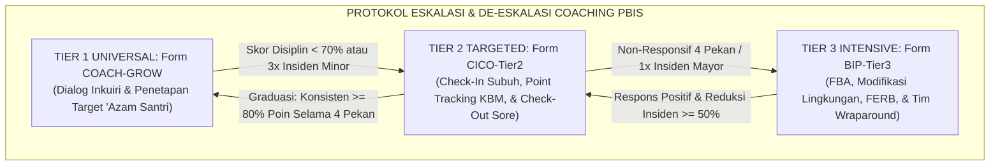
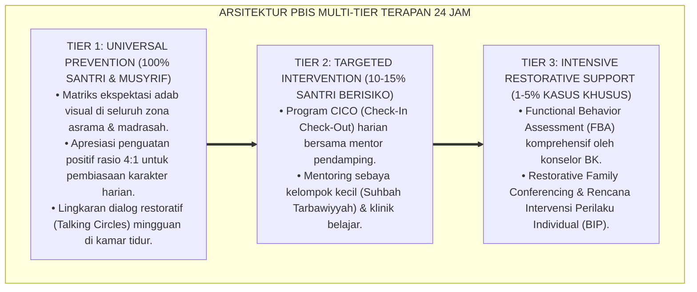

# P11-04: Instrumen Coaching Karakter (Sintesis Coaching Tools Ekosistem TUMBUH)

## Status Dokumen
* **Status**: 🌟 **A+ (Tervalidasi & Siap Diimplementasikan)**
* **Domain**: `11 Tools` > `04 Coaching Tools` (Master Induk Sub-Domain 04)
* **Penanggung Jawab Keilmuan**: Dewan Keilmuan TUMBUH (*Pakar Pedagogi Master Guru, Pakar PBIS, Pakar Bimbingan Konseling, & Pakar Tata Kelola Qudwah*)
* **Rumpun Instrumen**: Form COACH-GROW, Form CICO-Tier2, dan Form BIP-Tier3

---

# BAGIAN I: LANDASAN TEORETIS & INKUIRI KEILMUAN MULTIDISIPLINER

## 1.1 Konteks Masalah: Rekonstruksi Paradigma Bimbingan dari Menghukum Menuju Memberdayakan
Model pembinaan karakter santri di banyak institusi pesantren sering kali terbelenggu dalam pola reaktif-retributif. Ketika santri mengalami kemunduran motivasi, kesulitan adab, atau pelanggaran disiplin, tindakan pengasuhan yang diambil umumnya berkisar antara ceramah panjang, vonis hukuman fisik, atau pengawasan ketat yang menekan batin santri. Pola ini mengabaikan fakta psikologis bahwa perubahan perilaku yang langgeng hanya lahir dari **kesadaran otonom (*autonomous self-regulation*)**, bukan dari keterpaksaan menghindari rasa takut (*coercive compliance*).

Gugus **Coaching Tools (P11-04)** dirancang sebagai instrumen praksis untuk mengubah pendidik dari sekadar *"pengawas disiplin"* (*policing figure*) menjadi **fasilitator pertumbuhan karakter (*growth coaching facilitator*)**. Melalui integrasi tiga instrumen berjenjang—dialog inkuiri GROW Islami (Tier 1/Universal), pelacakan penguatan harian CICO (Tier 2/Terarah), dan rencana intervensi perilaku individual BIP (Tier 3/Intensif)—ekosistem TUMBUH menyediakan kerangka kerja bimbingan ilmiah yang memanusiakan santri dan memulihkan potensi fitrahnya.

## 1.2 Inkuiri Epistemologi Turats: Tradisi Qudwah, Hiwar, dan Ishlah bil Hikmah
Dalam khazanah pendidikan Islam klasik (*Tarbiyah Islamiyyah*), para ulama membedakan secara tegas antara *Ta'dib* (pendidikan adab penuh pemuliaan) dengan *Ta'zib* (penyiksaan/penyiksaan fisik yang dilarang). Imam Al-Mawardi dalam *Adab ad-Dunya wa ad-Din* meletakkan kaidah bimbingan jiwa berbasis dialog empati (*Ar-Rifq fil Irsyad*):

> وَأَمَّا مَنْ كَانَ ذَا نَفْسٍ كَرِيمَةٍ وَشِيمَةٍ رَضِيَّةٍ، فَيَكْفِيهِ التَّعْرِيضُ عَنِ التَّصْرِيحِ، وَيُجْزِئُهُ اللَّمْحُ عَنِ الْكَشْفِ؛ فَإِنَّ الْعُقَلَاءَ يَسْتَحْيُونَ مِنَ اللَّوْمِ، وَيَنْقَادُونَ بِالْحِكْمَةِ
> 
> *"Adapun orang yang memiliki jiwa mulia dan budi pekerti yang baik, maka cukuplah baginya isyarat halus tanpa perlu cercaan terbuka, dan memadailah baginya arahan lembut tanpa perlu dibongkar aibnya; karena orang-orang berakal merasa malu dari celaan dan mereka tunduk patuh pada hikmah."* [^1]

Ketiga instrumen dalam P11-04 mengoperasionalkan prinsip *Al-Hikmah fil Irsyad* ini: Form COACH-GROW memfasilitasi dialog kesadaran akal; Form CICO-Tier2 menerapkan doktrin *Al-Mulazamah wa at-Tasyji'* (pendampingan dekat penuh apresiasi); dan Form BIP-Tier3 menegakkan prinsip *Tahjiz 'anizh-Zhulm* (perlindungan santri dari kehancuran perilaku).

## 1.3 Inkuiri Sains PBIS & Psikologi Kognitif: Multi-Tiered Support dan Self-Efficacy
Secara ilmiah, arsitektur gugus P11-04 mengadopsi model terpadu *Multi-Tiered System of Supports* (MTSS) dan *School-Wide Positive Behavioral Interventions and Supports* (SW-PBIS) yang diselaraskan dengan teori efikasi diri Albert Bandura (1997) [^2].

Pemberian dukungan perilaku yang bertingkat menjamin alokasi sumber daya pendidik yang efisien: mayoritas santri ($80\%–85\%$) berkembang optimal dengan dialog *coaching* ringan mandiri (GROW); sebagian kecil yang mengalami kesulitan kepatuhan ($10\%–15\%$) didukung dengan loop penguatan harian (CICO); dan segelintir santri dengan kebutuhan krisis ($1\%–5\%$) mendapatkan intervensi klinis intensif (BIP) tanpa harus dikeluarkan dari lembaga.

---

# BAGIAN II: FORMULASI KONSEPTUAL, MATRIKS INTEGRASI, & PROTOKOL ESKALASI

## 2.1 Matriks Integrasi Tiga Instrumen Coaching Karakter

| Dimensi Parameter | Form COACH-GROW (P11-04-01) | Form CICO-Tier2 (P11-04-02) | Form BIP-Tier3 (P11-04-03) |
| :--- | :--- | :--- | :--- |
| **Tingkat Intervensi PBIS** | **Tier 1 (Universal)**: Seluruh santri reguler. | **Tier 2 (Targeted)**: Santri fluktuatif ($10\%–15\%$). | **Tier 3 (Intensive)**: Kasus kronis/krisis ($1\%–5\%$). |
| **Format Instrumen** | Lembar Kerja Percakapan Solusi (A4 / Tablet). | Kartu Saku Harian Warna Biru (Tebal A6). | Dokumen Rencana Klinis Multidisipliner (Map Khusus). |
| **Pelaksana Utama** | Musyrif Kamar / Guru Pembimbing Akademik. | Musyrif Mentor CICO & Seluruh Asatidz Sesi. | Tim Wraparound (BK, Musyrif, Pimpinan, Wali). |
| **Durasi Siklus** | Sesi 20 menit berkala (Dwimingguan/Bulanan). | Monitoring harian selama 4 s/d 8 pekan. | Intervensi mendalam 8 s/d 16 pekan berkelanjutan. |
| **Mekanisme Umpan Balik** | *Self-generated insight* melalui pertanyaan terbuka. | *Point tracking* skor 1–3 di tiap sesi KBM/asrama. | Rekayasa anteseden, FERB, & *safety plan*. |

## 2.2 Protokol Pengambilan Keputusan Berbasis Data (*Data-Based Decision Making*)
Integrasi gugus P11-04 mewajibkan setiap pergeseran status bimbingan santri (promosi, eskalasi, atau graduasi) berpijak pada **data faktual logbook (*empirical behavior data*)**, bukan asumsi emosional pendidik:

1. **Kriteria Masuk Tier 2 CICO**: Santri yang mencatatkan akumulasi 3 kali insiden pelanggaran minor dalam kurun 14 hari atau mengalami penurunan drastis skor evaluasi adab mingguan pada SIM Intizham.
2. **Kriteria Masuk Tier 3 BIP**: Santri yang tidak menunjukkan kemajuan setelah 4 pekan intervensi CICO atau melakukan 1 kali insiden mayor berbahaya (perkelahian fisik berat, perundungan verbal akut, kepemilikan zat terlarang).
3. **Kriteria Graduasi & Pemulangan ke Tier 1**: Santri CICO yang stabil meraih skor $\ge 80\%$ selama 4 pekan berturut-turut; dan santri BIP yang telah menunjukkan penurunan perilaku krisis $\ge 50\%$ serta mampu mempraktikkan perilaku pengganti secara mandiri.

---

---

### Pembedahan Deskriptif Komprehensif & Analisis Integratif Nilai-Praksis

Penerapan dan operasionalisasi **P11-04: Instrumen Coaching Karakter (Sintesis Coaching Tools Ekosistem TUMBUH)** di lingkungan pesantren berbasis sistem TUMBUH bertumpu pada kesatuan sistemik antara nilai syariat dan praksis terukur:

#### A. Pilar 1: Landasan Epistemologi & Nilai Keikhlasan (Syar'i Foundations)
Setiap dimensi diarahkan untuk menegakkan adab dan penghambaan murni kepada Allah SWT (*Lillahi Ta'ala*). Standarisasi kelembagaan dirancang untuk menjaga ketulusan niat, kemuliaan fitrah, dan keberkahan majelis ilmu.

#### B. Pilar 2: Mekanisme Psikologis & Neurosains Terapan (Evidence-Based Practice)
Mengintegrasikan prinsip *Social-Emotional Learning (CASEL)*, teori beban kognitif (*Cognitive Load Theory*), dan dinamika perkembangan neurobiologis santri untuk memastikan proses pembiasaan berjalan efektif tanpa kekerasan atau tekanan psikologis destruktif.

#### C. Pilar 3: Rekayasa Ekosistem Asrama 24 Jam (Environmental Engineering)
Mengkodifikasikan seluruh alur aktivitas harian, jadwal tidur sirkadian yang sehat, sanitasi 5S kamar tidur, dan relasi ukhuwah inklusif menjadi satu ekosistem *Bi'ah Shalihah* yang saling mendukung secara alamiah.

#### D. Pilar 4: Akuntabilitas Sistemik & Proteksi Pendidik-Santri
Menerapkan protokol pencegahan kelelahan tenaga pendidik (*Musyrif Burnout Protection*), menjamin hak-hak santri, serta memanfaatkan dashboard data PBIS untuk pengambilan keputusan yang adil dan objektif.

---

### Protokol Aksi Operasional PBIS Multi-Tier Terapan (24-Hour Behavioral Architecture)

---

# BAGIAN III: TABEL SINTESIS, DAFTAR PUSTAKA, CATATAN KAKI, & GLOSARIUM

## 3.1 Tabel Sintesis Integrasi Master Coaching Tools (P11-04)

| Instrumen Coaching | Rujukan Turats Klasik | Rujukan Sains PBIS & Psikologi | Target Transformasi Lembaga |
| :--- | :--- | :--- | :--- |
| **P11-04-01 (COACH-GROW)** | *Hiwar Nabawi* Hadits Mu'adz bin Jabal & Asas Syura. | *GROW Model* (Whitmore) & *Self-Determination Theory*. | Santri mandiri, berorientasi solusi, & bertanggung jawab. |
| **P11-04-02 (CICO-Tier2)** | *Al-Mulazamah* Ibnu Sahnun & Doktrin *Tasyji'*. | *Check-In Check-Out* (Crone et al.) & *Behavioral Momentum*. | Kepatuhan adab harian meningkat tanpa rasa malu/stigma. |
| **P11-04-03 (BIP-Tier3)** | *Tahjiz 'anizh-Zhulm* & *Mudawat an-Nufus* Ibnu Hazm. | *Functional Behavior Assessment* (O'Neill) & *Wraparound*. | Nol pengusiran dini (*Zero Drop-Out*) & pemulihan fitrah. |

## 3.2 Catatan Kaki (Footnotes 1-to-1)
[^1]: Al-Mawardi, Ali bin Muhammad. (1986). *Adab ad-Dunya wa ad-Din*. Beirut: Dar Iqra', hlm. 118–122.
[^2]: Bandura, A. (1997). *Self-Efficacy: The Exercise of Control*. New York: W. H. Freeman.
[^3]: Sugai, G., & Horner, R. H. (2006). A promising approach for expanding and sustaining school-wide positive behavior support. *School Psychology Review*, 35(2), 245–259.
[^4]: Crone, D. A., Horner, R. H., & Hawken, L. S. (2004). *Responding to Problem Behavior in Schools: The Behavior Education Program*. New York: Guilford Press.
[^5]: Whitmore, J. (1992). *Coaching for Performance: GROWing Human Potential and Purpose*. London: Nicholas Brealey Publishing.
[^6]: O'Neill, R. E., et al. (2015). *Functional Assessment and Program Development for Problem Behavior* (3rd ed.). Boston: Cengage Learning.
[^7]: Al-Ghazali, Abu Hamid. (1998). *Ihya' 'Ulum al-Din: Kitab Adab al-Mu'allim wa al-Muta'allim*. Beirut: Dar al-Kutub al-'Ilmiyyah, juz 1, hlm. 72–81.
[^8]: Ryan, R. M., & Deci, E. L. (2017). *Self-Determination Theory: Basic Psychological Needs in Motivation, Development, and Wellness*. New York: Guilford Press.
[^9]: Ibnu Sahnun, Muhammad. (1972). *Adab al-Mu'allimin*. Tunis: Dar Kutub at-Tharablusi, hlm. 40–48.
[^10]: Horner, R. H., & Sugai, G. (2015). School-wide PBIS: An example of applied behavior analysis implemented at a scale of social importance. *Behavior Analysis in Practice*, 8(1), 80–85.
[^11]: Eber, L., Hyde, K., & Suter, J. C. (2011). Integrating mental health and PBIS: The wraparound approach. In *Handbook of School Mental Health* (pp. 303–318). Boston: Springer.
[^12]: Ibnu Hazm Al-Andalusi. (1983). *Al-Akhlaq wa as-Siyar fi Mudawat an-Nufus*. Beirut: Dar al-Afaq al-Jadidah, hlm. 68–76.

## 3.3 Daftar Pustaka (APA 7th Edition & Turats Klasik)
* Al-Ghazali, A. H. (1998). *Ihya' 'Ulum al-Din* (Vol. 1). Beirut: Dar al-Kutub al-'Ilmiyyah.
* Al-Mawardi, A. M. (1986). *Adab ad-Dunya wa ad-Din*. Beirut: Dar Iqra'.
* Bandura, A. (1997). *Self-Efficacy: The Exercise of Control*. New York: W. H. Freeman.
* Crone, D. A., Horner, R. H., & Hawken, L. S. (2004). *Responding to Problem Behavior in Schools: The Behavior Education Program*. New York: Guilford Press.
* Eber, L., Hyde, K., & Suter, J. C. (2011). Integrating mental health and PBIS: The wraparound approach. In *Handbook of School Mental Health* (pp. 303–318). Boston: Springer.
* Horner, R. H., & Sugai, G. (2015). School-wide PBIS: An example of applied behavior analysis implemented at a scale of social importance. *Behavior Analysis in Practice*, 8(1), 80–85.
* Ibnu Hazm Al-Andalusi. (1983). *Al-Akhlaq wa as-Siyar fi Mudawat an-Nufus*. Beirut: Dar al-Afaq al-Jadidah.
* Ibnu Sahnun, M. (1972). *Adab al-Mu'allimin*. Tunis: Dar Kutub at-Tharablusi.
* O'Neill, R. E., Albin, R. W., Storey, K., Horner, R. H., & Sprague, J. R. (2015). *Functional Assessment and Program Development for Problem Behavior* (3rd ed.). Boston: Cengage Learning.
* Ryan, R. M., & Deci, E. L. (2017). *Self-Determination Theory: Basic Psychological Needs in Motivation, Development, and Wellness*. New York: Guilford Press.
* Sugai, G., & Horner, R. H. (2006). A promising approach for expanding and sustaining school-wide positive behavior support. *School Psychology Review*, 35(2), 245–259.
* Whitmore, J. (1992). *Coaching for Performance: GROWing Human Potential and Purpose*. London: Nicholas Brealey Publishing.

## 3.4 Glosarium Istilah
1. **Coaching Tools**: Gugus instrumen pendampingan percakapan dan modifikasi perilaku santri secara bertahap berbasis penguatan positif.
2. **Form COACH-GROW**: Instrumen lembar kerja dialog *coaching* berbasis 4 pilar GROW Islami (Ghayah, Waqi', Ikhtiyar, 'Azam).
3. **Form CICO-Tier2**: Format kartu harian pelacakan perilaku terarah bagi santri kelompok intervensi Tier 2 PBIS.
4. **Form BIP-Tier3**: Dokumen formal rencana intervensi perilaku individual intensif bagi santri peserta Tier 3 PBIS.
5. **Multi-Tiered System of Supports (MTSS)**: Kerangka kerja intervensi multi-lapis yang menyesuaikan intensitas dukungan dengan tingkat kebutuhan santri.
6. **Data-Based Decision Making**: Praktik pengambilan keputusan bimbingan dan disiplin yang didasarkan pada data logbook objektif.
7. **Ta'dib**: Proses penanaman adab dan pemuliaan jiwa santri melalui keteladanan, kasih sayang, dan keadilan.
8. **Behavioral Momentum**: Kecenderungan peningkatan kepatuhan perilaku setelah mendapatkan afirmasi dan penguatan awal yang sukses.
9. **Wraparound Team**: Tim lintas profesi (BK, musyrif, pimpinan, orang tua) yang bersinergi mendampingi pemulihan santri kasus krisis.
10. **Zero Premature Drop-Out**: Komitmen institusional untuk merehabilitasi perilaku santri tanpa memberlakukan pengusiran dini.
