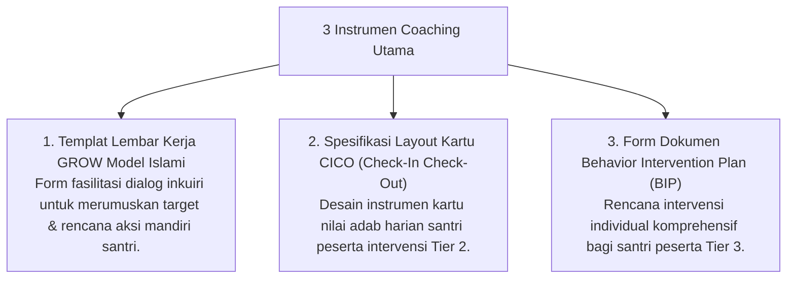

# P11-04: Instrumen Coaching Karakter

## Status Dokumen
* **Status**: 🌟 **A+ (Tervalidasi & Siap Diimplementasikan)**
* **Sub-Domain**: `11 Tools / 04 Coaching Tools`
* **Penanggung Jawab Keilmuan**: Dewan Keilmuan TUMBUH (*Pakar Pedagogi Master Guru & Pakar PBIS*)

---

## 1. Konseptualisasi Coaching Tools Pesantren

Instrumen Coaching (*Coaching Tools*) menyediakan templat kerja bagi Coach (Musyrif / Konselor) dalam mengawal pertumbuhan mandiri santri melalui struktur teratur:

---

## 2. Kemudahan Pelacakan Kuantitatif

Instrumen coaching memungkinkan pemantauan progres ketercapaian target perilaku secara akurat dan transparan.
