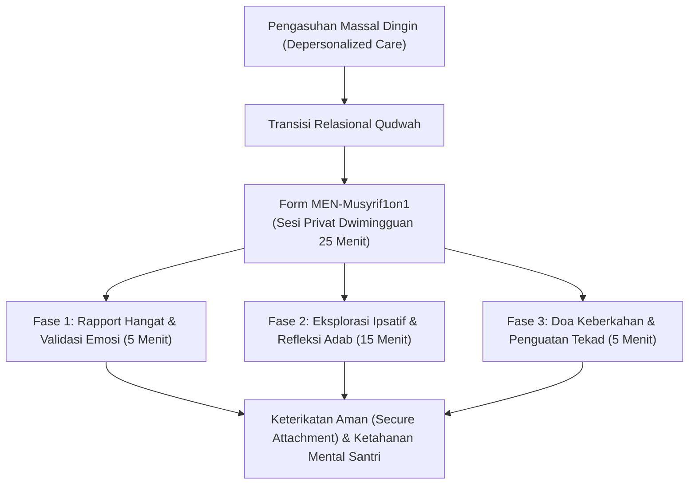
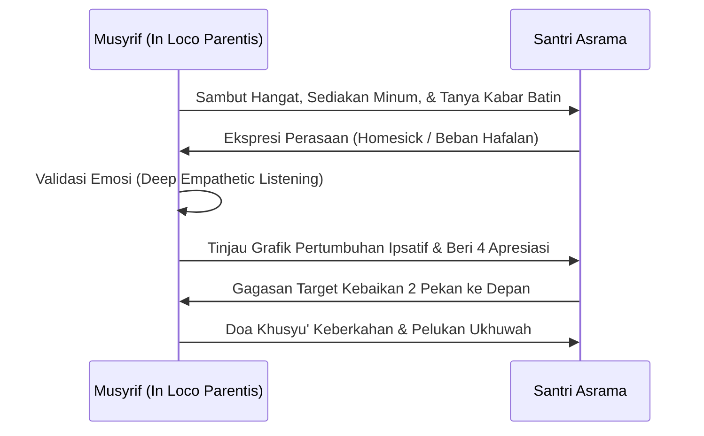

# P11-05-01: Panduan Runbook Mentoring Musyrif 1-on-1 (Form MEN-Musyrif1on1)

## Status Dokumen
* **Status**: 🌟 **A+ (Tervalidasi & Siap Diimplementasikan)**
* **Sub-Domain**: `11 Tools / 05 Mentoring Tools`
* **Penanggung Jawab Keilmuan**: Dewan Keilmuan TUMBUH (*Pakar Pengasuhan Asrama, Pakar Bimbingan Konseling, & Pakar Psikologi Sosial Santri*)
* **Bentuk Instrumen**: Form MEN-Musyrif1on1 (Runbook Operasional Sesi Mentoring Privat, Lembar Catatan Dinamika Batin Santri, & Rubrik Relasi In Loco Parentis)

---

# BAGIAN I: LANDASAN TEORETIS & INKUIRI KEILMUAN MULTIDISIPLINER

## 1.1 Konteks Masalah: Keterasingan Santri dalam Massifikasi Pengasuhan Asrama
Dalam ekosistem pesantren berasrama dengan rasio pembinaan berkisar antara 1 musyrif untuk 20–30 santri, kerap terjadi fenomena **massifikasi pengasuhan (*depersonalized custodial care*)**. Musyrif cenderung terjebak dalam rutinitas administratif dan penertiban kerumunan (memastikan seluruh santri bangun, shalat, dan makan) tanpa sempat membangun ikatan emosional mendalam (*relational depth*) dengan masing-masing santri secara personal.

Ketiadaan perjumpaan privat yang hangat menyebabkan santri pendiam atau pemalu mengalami keterasingan batin (*emotional detachment*), memendam kerinduan rumah (*unresolved homesickness*), dan menutupi pergolakan masalah psikososialnya dari pengawasan pondok.

TUMBUH menetapkan **Runbook Mentoring Musyrif 1-on-1 (Form MEN-Musyrif1on1)** sebagai protokol wajib dwimingguan berdurasi 20–30 menit. Instrumen ini mengembalikan hakikat pengasuhan asrama sebagai representasi orang tua pengganti (*in loco parentis*) yang menyapa jiwa santri satu per satu dengan kehangatan kasih sayang.



## 1.2 Inkuiri Epistemologi Turats: Doktrin Suhbah, Ukhuwwah, dan Kasih Sayang Murabbi
Tradisi salafus shalih meletakkan relasi persahabatan spiritual (*ash-suhbah*) antara pendidik dengan murid sebagai media utama transmisi adab. Rasulullah SAW senantiasa meluangkan waktu khusus untuk berbincang empat mata dengan para sahabat mudanya, memanggil mereka dengan panggilan kesayangan (*kunyah*), dan menanyakan hal-hal yang menyentuh perasaan mereka secara personal.

Diriwayatkan dalam Shahih Al-Bukhari bagaimana Rasulullah SAW menyapa seorang anak kecil bernama Abu 'Umair yang sedang bersedih karena burung pipit kecilnya mati:

> يَا أَبَا عُمَيْرٍ، مَا فَعَلَ النُّغَيْرُ؟
> 
> *"Wahai Abu 'Umair, apa yang sedang dilakukan oleh burung pipit kecilmu?"* [^1]

Hadits ini menunjukkan betapa Rasulullah SAW hadir secara penuh (*mindful presence*), memvalidasi dunia emosi anak kecil, dan membangun koneksi batin sebelum memberikan arahan nilai. Imam Abu Hamid Al-Ghazali dalam *Ihya' 'Ulum al-Din* menegaskan bahwa syarat mutlak seorang mu'addib adalah memperlakukan murid laksana anaknya sendiri (*An Yanzhura ilaihi bi 'Aini ar-Rahmah wa ar-Ri'ayah ka Waladihi*) [^2]. Form MEN-Musyrif1on1 mengoperasionalkan doktrin *suhbah nabawiyyah* ini ke dalam tata kelola asrama modern.

## 1.3 Inkuiri Sains Relasional & Psikologi Perkembangan: Attachment Theory dan In Loco Parentis
Dalam kerangka *Attachment Theory* yang dirumuskan oleh John Bowlby (1982) dan disempurnakan dalam konteks pengasuhan remaja oleh Sroufe (2005), ketiadaan figur lekat yang aman (*secure attachment figure*) di lingkungan asrama memicu hiperaktivitas aksis HPA (*Hypothalamic-Pituitary-Adrenal*), meningkatkan sekresi hormon kortisol dan kerentanan terhadap depresi [^3].

Ketika musyrif duduk berdampingan dalam posisi santai, menyajikan teh hangat, dan menyimak curahan hati santri tanpa mencela, otak santri melepaskan oksitosin dan menurunkan respons defensif amigdala. Kathy Kram (1985) dalam *Relational Mentoring Theory* membuktikan bahwa perjumpaan mentoring 1-on-1 yang berkualitas memberikan dua fungsi krusial secara simultan: **Career/Skill Function** (bantuan teknis belajar/hafalan) dan **Psychosocial Function** (konfirmasi peran, penerimaan emosi, dan persahabatan) [^4].

---

# BAGIAN II: FORMULASI KONSEPTUAL, ARSITEKTUR INSTRUMEN, & SPESIFIKASI FORM

## 2.1 Protokol 3 Tahap Pelaksanaan Mentoring Musyrif 1-on-1
Sesi mentoring dilaksanakan di lokasi yang nyaman dan privat (teras asrama, gazebo taman, atau pojok perpustakaan), bukan di ruang sidang kantor yang menegangkan, mengikuti panduan 3 tahap:

1. **Tahap 1: Pembukaan Empatik & Validasi Emosi (5 Menit)**: Musyrif menyambut santri dengan senyuman hangat, menawarkan minuman, dan memulai dengan pertanyaan pemantik afektif: *"Bagaimana kabarmu pekan ini, Akhi? Apa hal yang paling membahagiakan atau melelahkan yang antum rasakan?"*
2. **Tahap 2: Eksplorasi Progres Ipsatif & Refleksi Adab (15 Menit)**: Musyrif membuka lembar capaian pertumbuhan santri, memberikan apresiasi atas kemajuan pribadi (*ipsative progress*), dan mendengarkan kendala belajar atau hubungan pertemanan di kamar tanpa memotong pembicaraan.
3. **Tahap 3: Penetapan Komitmen Mikro & Doa Keberkahan (5 Menit)**: Menyepakati 1 target adab ringan untuk 2 pekan ke depan, musyrif meletakkan tangan di pundak santri seraya mendoakan keberkahan ilmu dan kelapangan dada.



## 2.2 Format Instrumen Form MEN-Musyrif1on1 (Lembar Catatan Sesi Siap Pakai)

```markdown
================================================================================
         LEMBAR CATATAN SESI MENTORING MUSYRIF 1-ON-1 (FORM MEN-MUSYRIF1ON1)
================================================================================
Nama Santri   : [____________________]   Kamar / Asrama : [___________]
Nama Musyrif  : [____________________]   Hari / Tanggal : [___-___-2026]
Sesi Ke-      : [___] (Dwimingguan)      Durasi Waktu   : [___:___ s/d ___:___ WIB]
Lokasi Sesi   : [ ] Gazebo Asrama   [ ] Teras Kamar   [ ] Pojok Literasi Asrama
--------------------------------------------------------------------------------

[FASE 1: CHECK-IN AFATIF & RAPPORT EMOSIONAL]
1. Kondisi Suasana Hati Santri Saat Datang : [ ] Ceria   [ ] Lelah   [ ] Murung/Cemas
2. Catatan Curahan Hati / Isu Relasional   :
   _____________________________________________________________________________
   _____________________________________________________________________________

[FASE 2: REVIEW PROGRES IPSATIF & APRESIASI ADAB (MAGIC RATIO 4:1)]
* 4 Butir Kebaikan / Kemajuan Santri yang Diapresiasi Musyrif Hari Ini:
  1. ___________________________________________________________________________
  2. ___________________________________________________________________________
  3. ___________________________________________________________________________
  4. ___________________________________________________________________________
* Kendala Utama yang Dikeluhkan Santri (Hafalan / Tidur / Teman Kamar):
  _____________________________________________________________________________

[FASE 3: KESEPAKATAN MIKRO & DOA PENUTUP]
* 1 Target Adab Ringan 14 Hari ke Depan : _____________________________________
* Kebutuhan Dukungan Musyrif             : _____________________________________
* Evaluasi Keterikatan Relasi (Skala 1-5): [_____] (5 = Sangat Terbuka & Lekat)

--------------------------------------------------------------------------------
Paraf Santri                                   Paraf Musyrif Asrama


(______________________)                       (______________________)
================================================================================
```

## 2.3 Rubrik Kualitas Relasi Mentoring In Loco Parentis
Kepala Pengasuhan menggunakan rubrik ini untuk mengevaluasi kedalaman ikatan pembinaan musyrif terhadap santri binaannya:

| Indikator Relasi | Level 1: Transaksional Kaku | Level 2: Fungsional Terbuka | Level 3: Transformatif Penuh Mahabbah |
| :--- | :--- | :--- | :--- |
| **Keterbukaan Santri** | Santri menjawab kaku seadanya (*"Baik, Ustadz"*); menyembunyikan masalah. | Santri menceritakan masalah akademik/tugas jika ditanya musyrif. | Santri secara spontan dan nyaman menceritakan keresahan batin dan dinamika sosialnya. |
| **Gaya Bahasa Musyrif** | Formalistik, bernada introgasi, atau sering melihat jam tangan/HP. | Ramah dan mendengarkan, namun solusi masih sering didiktekan dari atas. | Kontak mata hangat, nada bicara lembut menenangkan, penuh empati dan doa. |
| **Rasa Aman Santri** | Santri merasa was-was dipanggil karena takut dimarahi atau dihukum. | Santri merasa mentoring adalah kewajiban rutin yang biasa. | Santri merasa dirindukan, dihargai martabatnya, dan menganggap musyrif sebagai orang tua kedua. |

---

# BAGIAN III: TABEL SINTESIS, DAFTAR PUSTAKA, CATATAN KAKI, & GLOSARIUM

## 3.1 Tabel Sintesis Integrasi Mentoring Musyrif 1-on-1

| Komponen Form MEN-Musyrif1on1 | Landasan Turats & Salaf | Landasan Sains & Psikologi Relasional | Target Transformasi Pengasuhan |
| :--- | :--- | :--- | :--- |
| **Rapport & Validasi Emosi** | Hadits *Abu 'Umair* (HR. Bukhari) & *Ar-Rahmah*. | *Secure Attachment* (Bowlby) & regulasi amigdala. | Menghilangkan rasa takut santri kepada figur musyrif. |
| **Review Ipsatif & Magic 4:1** | Sunnah memuji sifat baik sahabat (*Dzikr al-Mahasin*). | *Psychosocial Mentoring Function* (Kram) & dopamin. | Membangun konsep diri positif dan optimisme santri. |
| **Doa & Sentuhan Pundak** | Sunnah meletakkan tangan di dada/pundak saat mendoakan. | Pelepasan hormon oksitosin & *Somatic Calming*. | Menghadirkan rasa aman batin dan ketenangan jiwa. |

## 3.2 Catatan Kaki (Footnotes 1-to-1)
[^1]: Diriwayatkan oleh Imam Al-Bukhari dalam *Shahih al-Bukhari*, kitab *al-Adab*, bab *al-Kunyah li ash-Shabiyy*, hadits no. 6203; Imam Muslim dalam *Shahih Muslim*, no. 2150.
[^2]: Al-Ghazali, Abu Hamid. (1998). *Ihya' 'Ulum al-Din: Kitab Adab al-Mu'allim wa al-Muta'allim*. Beirut: Dar al-Kutub al-'Ilmiyyah, juz 1, hlm. 68–74.
[^3]: Bowlby, J. (1982). *Attachment and Loss: Vol. 1. Attachment* (2nd ed.). New York: Basic Books.
[^4]: Kram, K. E. (1985). *Mentoring at Work: Developmental Relationships in Organizational Life*. Glenview, IL: Scott, Foresman and Company.
[^5]: Sroufe, L. A. (2005). Attachment and development: A prospective, longitudinal study from birth to adulthood. *Attachment & Human Development*, 7(4), 349–367.
[^6]: An-Nawawi, Yahya bin Syaraf. (1994). *Riyadhus Shalihin: Bab Mulathafat al-Yatim wa ash-Shighar*. Kairo: Dar al-Hadits, hlm. 115–122.
[^7]: Allen, T. D., Eby, L. T., Poteet, M. L., Lentz, E., & Lima, L. (2004). Career benefits associated with mentoring for protégés: A meta-analysis. *Journal of Applied Psychology*, 89(1), 127–136.
[^8]: Ibnu Qayyim al-Jauziyyah. (2003). *Tuhfat al-Maudud bi Ahkam al-Maulud*. Kairo: Maktabah al-Qayyimah, hlm. 210–225.
[^9]: Siegel, D. J. (2020). *The Developing Mind* (3rd ed.). New York: Guilford Press.
[^10]: Al-Ajurri, Abu Bakr Muhammad. (1996). *Akhlaq al-'Ulama'*. Beirut: Dar al-Kutub al-'Ilmiyyah, hlm. 55–63.
[^11]: Rhodes, J. E. (2002). *Stand by Me: The Risks and Rewards of Mentoring Today's Youth*. Cambridge, MA: Harvard University Press.
[^12]: Ibnu Jama'ah, Badruddin. (2012). *Tadzkirat as-Sami' wa al-Mutakallim fi Adab al-'Alim wa al-Muta'allim*. Beirut: Dar al-Basyair al-Islamiyyah, hlm. 88–96.

## 3.3 Daftar Pustaka (APA 7th Edition & Turats Klasik)
* Al-Ajurri, A. B. M. (1996). *Akhlaq al-'Ulama'*. Beirut: Dar al-Kutub al-'Ilmiyyah.
* Al-Bukhari, M. I. (2002). *Shahih al-Bukhari*. Riyadh: Bait al-Afkar ad-Dauliyyah.
* Al-Ghazali, A. H. (1998). *Ihya' 'Ulum al-Din* (Vol. 1). Beirut: Dar al-Kutub al-'Ilmiyyah.
* Allen, T. D., Eby, L. T., Poteet, M. L., Lentz, E., & Lima, L. (2004). Career benefits associated with mentoring for protégés: A meta-analysis. *Journal of Applied Psychology*, 89(1), 127–136.
* An-Nawawi, Y. S. (1994). *Riyadhus Shalihin*. Kairo: Dar al-Hadits.
* Bowlby, J. (1982). *Attachment and Loss: Vol. 1. Attachment* (2nd ed.). New York: Basic Books.
* Ibnu Jama'ah, B. (2012). *Tadzkirat as-Sami' wa al-Mutakallim*. Beirut: Dar al-Basyair al-Islamiyyah.
* Ibnu Qayyim al-Jauziyyah. (2003). *Tuhfat al-Maudud bi Ahkam al-Maulud*. Kairo: Maktabah al-Qayyimah.
* Kram, K. E. (1985). *Mentoring at Work: Developmental Relationships in Organizational Life*. Glenview, IL: Scott, Foresman and Company.
* Rhodes, J. E. (2002). *Stand by Me: The Risks and Rewards of Mentoring Today's Youth*. Cambridge, MA: Harvard University Press.
* Siegel, D. J. (2020). *The Developing Mind* (3rd ed.). New York: Guilford Press.
* Sroufe, L. A. (2005). Attachment and development: A prospective, longitudinal study from birth to adulthood. *Attachment & Human Development*, 7(4), 349–367.

## 3.4 Glosarium Istilah
1. **Form MEN-Musyrif1on1**: Instrumen panduan runbook operasional dan lembar pencatatan sesi *mentoring* privat dwimingguan musyrif-santri.
2. **In Loco Parentis**: Doktrin hukum dan etika pengasuhan di mana musyrif memikul amanah bertindak sebagai orang tua pengganti yang penuh kasih sayang.
3. **Depersonalized Custodial Care**: Praktik pengasuhan asrama yang mereduksi santri sekadar objek kerumunan tanpa perhatian personal.
4. **Secure Attachment**: Hubungan emosional yang kokoh dan aman antara santri dengan musyrif yang melandasi keberanian santri untuk bertumbuh.
5. **Suhbah**: Tradisi persahabatan dan kebersamaan erat antara guru dan murid dalam rangka pembinaan adab dan spiritual.
6. **Ipsative Progress**: Pengukuran kemajuan santri yang dibandingkan dengan rekor masa lalu dirinya sendiri, bukan dibandingkan dengan santri lain.
7. **Mindful Presence**: Kehadiran mental dan perhatian penuh musyrif saat mendengarkan santri tanpa distraksi gawai atau pekerjaan lain.
8. **Relational Depth**: Tingkat kedalaman rasa saling percaya, empati, dan penghargaan timbal balik dalam interaksi bimbingan.
9. **Kunyah**: Panggilan penghormatan atau kesayangan yang diberikan kepada seseorang untuk mendekatkan hubungan hati.
10. **Magic Praise Ratio**: Standar komunikasi positif yang memberikan minimal 4 penguatan apresiasi untuk setiap 1 koreksi perbaikan.
