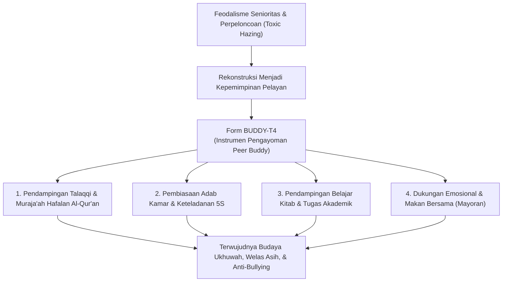
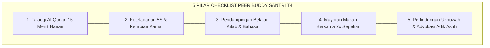

# P11-05-02: Checklist Pendampingan Peer Buddy Santri T4 (Form BUDDY-T4)

## Status Dokumen
* **Status**: 🌟 **A+ (Tervalidasi & Siap Diimplementasikan)**
* **Sub-Domain**: `11 Tools / 05 Mentoring Tools`
* **Penanggung Jawab Keilmuan**: Dewan Keilmuan TUMBUH (*Pakar Tata Kelola Qudwah, Pakar Psikologi Sosial Santri, & Pakar Desain Kurikulum Adab*)
* **Bentuk Instrumen**: Form BUDDY-T4 (Checklist Pengayoman Kakak Asuh Santri Tahap 4 / Penggerak, Logbook Mentoring Sebaya, & Rubrik Kepemimpinan Pelayan)

---

# BAGIAN I: LANDASAN TEORETIS & INKUIRI KEILMUAN MULTIDISIPLINER

## 1.1 Konteks Masalah: Menghapus Feodalisme Senioritas Melalui Servant Leadership
Kultur interaksi antargenerasi santri di banyak pesantren kerap dinodai oleh fenomena **feodalisme senioritas (*toxic hierarchical seniority*)**. Santri kelas atas (senior) sering kali menuntut penghormatan buta, melimpahkan tugas fisik (seperti mencuci atau membersihkan kamar) kepada adik kelas (junior), dan melegitimasi tradisi perpeloncoan (*hazing/bullying*) atas nama penegakan disiplin semu.

Model relasi hierarkis opresif ini merusak iklim ukhuwah, menumbuhkan dendam laten, dan melanggengkan siklus kekerasan antargenerasi (*intergenerational abuse cycle*).

TUMBUH merombak total paradigma senioritas melalui peluncuran sistem **Peer Buddy Santri T4 (Form BUDDY-T4)**. Santri Tahap 4 (Kelas 11–12 / Penggerak) tidak diposisikan sebagai *"mandor penghukum"*, melainkan dilantik sebagai **Kakak Asuh Pengayom (*Servant Leaders / Peer Buddies*)** yang bertugas melayani, melindungi, dan mendampingi adik kelas baru (Tahap 1–2) dalam menapaki adaptasi kehidupan pesantren secara bermartabat.



## 1.2 Inkuiri Epistemologi Turats: Doktrin Kasih Sayang Antargenerasi dan Al-Itsar
Tradisi Islam meletakkan hubungan antargenerasi santri di atas fondasi kasih sayang timbal balik (*ar-rahmah wal waqar*). Rasulullah SAW bersabda dalam hadits shahih:

> لَيْسَ مِنَّا مَنْ لَمْ يَرْحَمْ صَغِيرَنَا، وَيُوَقِّرْ كَبِيرَنَا
> 
> *"Bukanlah termasuk golongan kami orang yang tidak menyayangi yang lebih muda di antara kami, dan tidak menghormati yang lebih tua di antara kami."* [^1]

Imam Ibnu Hajar Al-'Asqalani dalam *Fath al-Bari* menjelaskan bahwa hakikat penghormatan adik kelas kepada kakak kelas (*tauqir*) tidak akan pernah terwujud secara tulus kecuali jika didahului oleh kasih sayang, pengayoman, dan perlindungan nyata dari pihak yang lebih tua (*rahmah ash-shaghir*) [^2]. 

Selanjutnya, doktrin **Al-Itsar** (mendahulukan kepentingan saudara seiman) dan konsep *Kafalah at-Ta'awun* yang diajarkan oleh Imam Al-Ghazali mewajibkan santri yang lebih berilmu untuk membimbing saudaranya yang masih lemah dengan kelemahlembutan tanpa sedikit pun rasa angkuh (*ghairu mutakabbir*) [^3]. Form BUDDY-T4 menyusun kewajiban ukhuwah ini menjadi tindakan konkret harian di asrama.

## 1.3 Inkuiri Sains Sosiologis & Psikologi Belajar: Cross-Age Tutoring & Prosocial Modeling
Dalam literatur psikologi pendidikan dan intervensi sebaya (*Peer-Mediated Intervention / PMI*), model *Cross-Age Peer Tutoring* yang diteliti oleh Topping (2005) membuktikan terjadinya keuntungan ganda (*symbiotic learning benefit*) [^4]. Bagi santri yunior (tutee), kehadiran mentor sebaya yang ramah mereduksi kecemasan sosial dan mempercepat penguasaan keterampilan hafalan Al-Qur'an. Bagi santri senior (tutor), peran membimbing memperkuat retensi kognitif mereka sendiri serta mengasah kecerdasan emosional dan tanggung jawab sosial (*prosocial maturity*).

Secara neurobiologis dan teori pemodelan sosial (*Social Learning Theory* Albert Bandura, 1977), perilaku adik kelas sangat dipengaruhi oleh model nyata yang mereka lihat setiap hari (*observational modeling*) [^5]. Ketika santri T4 mencontohkan adab merapikan kasur dan datang awal ke masjid, neuron cermin (*mirror neurons*) adik kelas menginternalisasi kebiasaan tersebut secara alami tanpa perlu bentakan kata-kata.

---

# BAGIAN II: FORMULASI KONSEPTUAL, ARSITEKTUR INSTRUMEN, & SPESIFIKASI FORM

## 2.1 Struktur 5 Area Tugas Pendampingan Form BUDDY-T4
Setiap santri T4 (Kakak Asuh) dipasangkan secara resmi dengan 1–2 santri yunior (Adik Asuh) selama 1 semester dengan menjalankan 5 area checklist pengayoman:

1. **Area 1: Pendampingan Spiritual & Hafalan (Talaqqi 15 Menit/Hari)**: Menyimak setoran hafalan Al-Qur'an adik asuh ba'da Maghrib/Subuh dengan sabar dan mengoreksi makhraj secara lembut.
2. **Area 2: Keteladanan Adab Kamar & Kerapian (5S Standar Asrama)**: Membimbing adik asuh merapikan lemari dan melipat selimut di pagi hari melalui contoh nyata (*lisanul hal*).
3. **Area 3: Pendampingan Akademik Diniyyah (Study Buddy)**: Membantu menjelaskan materi nahwu-sharaf atau bahasa Arab yang belum dipahami adik asuh saat jam belajar mandiri malam.
4. **Area 4: Kehangatan Sosial & Makan Bersama (Mayoran Sepekan 2x)**: Mengajak adik asuh makan bersama dalam 1 nampan (*mayoran*) untuk mencairkan suasana dan mendengarkan keluh kesahnya.
5. **Area 5: Perlindungan Advokasi (Anti-Bullying Shield)**: Menjadi pelindung utama adik asuh dari potensi gangguan kawan sebaya dan segera melaporkan ke musyrif jika ada tanda-tanda kecemasan atau sakit fisik.



## 2.2 Format Instrumen Form BUDDY-T4 (Lembar Checklist Kakak Asuh Siap Pakai)

```markdown
================================================================================
          CHECKLIST PENGAYOMAN PEER BUDDY SANTRI T4 (FORM BUDDY-T4)
================================================================================
Nama Kakak Asuh (T4) : [____________________]   Kelas/Kamar : [___________]
Nama Adik Asuh (T1/2): [____________________]   Pekan Ke-   : [___] (Bulan: _____)
Nama Musyrif Kamar   : [____________________]   Tahun Ajaran: [2026/2027]
--------------------------------------------------------------------------------
PETUNJUK KAKAK ASUH:
Berikan tanda ceklis [X] pada hari pelaksanaan. Niatkan semata-mata berkhidmat
kepada sesama penuntut ilmu demi meraih ridha Allah Ta'ala.
--------------------------------------------------------------------------------

+-----------------------------------------+---+---+---+---+---+---+---+---------+
| AKTIVITAS PENGAYOMAN PEKANAN            | S | S | R | K | J | S | M | TOTAL   |
+-----------------------------------------+---+---+---+---+---+---+---+---------+
| 1. Menyimak Talaqqi Al-Qur'an (15 Mnt)  |   |   |   |   |   |   |   | [ ]/7   |
| 2. Merapikan Lemari/Kasur Bersama (5S)  |   |   |   |   |   |   |   | [ ]/7   |
| 3. Shalat Berjamaah Berdampingan di Shaf|   |   |   |   |   |   |   | [ ]/7   |
| 4. Menjelaskan Materi Kitab/Pelajaran   |   |   |   |   |   |   |   | [ ]/3   |
| 5. Makan Bersama 1 Nampan (Mayoran)     |   |   |   |   |   |   |   | [ ]/2   |
| 6. Ngobrol Santai & Cek Kondisi Batin   |   |   |   |   |   |   |   | [ ]/4   |
+-----------------------------------------+---+---+---+---+---+---+---+---------+

[CATATAN PERKEMBANGAN ADIK ASUH OLEH KAKAK ASUH]
* Kemajuan Paling Membanggakan dari Adik Asuh Pekan Ini:
  _____________________________________________________________________________
* Kesulitan / Keluhan yang Sedang Dihadapi Adik Asuh:
  _____________________________________________________________________________
* Bantuan yang Dibutuhkan dari Musyrif Asrama:
  _____________________________________________________________________________

--------------------------------------------------------------------------------
Tanda Tangan Kakak Asuh T4                     Tanda Tangan Musyrif Kamar


(______________________________)               (______________________________)
================================================================================
```

## 2.3 Rubrik Evaluasi Kepemimpinan Pelayan Santri T4
Musyrif asrama mengevaluasi peran kepemimpinan santri T4 setiap akhir bulan guna menentukan kelayakan predikat *"Santri Teladan Qudwah"*:

| Kriteria Evaluasi | Skor 1 (Otoriter / Pasif) | Skor 2 (Fungsional Cukup) | Skor 3 (Khidmat Paripurna / Qudwah) |
| :--- | :--- | :--- | :--- |
| **Gaya Interaksi** | Memerintah dengan nada tinggi; menyuruh adik asuh melayani keperluannya sendiri. | Membantu jika diminta adik asuh; interaksi sebatas formalitas checklist. | Proaktif menyapa, ramah, melayani dengan ketulusan, dan mendahulukan adik asuh. |
| **Kualitas Keteladanan** | Sering terlambat shalat atau kamarnya berantakan; tidak mencerminkan contoh baik. | Disiplin untuk diri sendiri, namun kurang mengajak dan membimbing adik asuh. | Menjadi model teladan terdepan dalam ibadah, kebersihan, dan kesantunan lisan. |
| **Kepedulian Emosional**| Tidak peduli saat adik asuh tampak sedih, menangis, atau sakit di kamar. | Melaporkan ke musyrif jika adik asuh sakit tanpa mendampingi secara langsung. | Menghibur saat adik asuh sedih/homesick, menemani saat sakit, dan mendoakannya. |

---

# BAGIAN III: TABEL SINTESIS, DAFTAR PUSTAKA, CATATAN KAKI, & GLOSARIUM

## 3.1 Tabel Sintesis Integrasi Sistem Peer Buddy Santri T4

| Komponen Form BUDDY-T4 | Landasan Turats & Fiqh | Landasan Sains & Psikologi Sosial | Target Transformasi Budaya |
| :--- | :--- | :--- | :--- |
| **Talaqqi Sebaya** | Tradisi sanad hafalan & firman Allah tentang *Ta'awun*. | *Cross-Age Peer Tutoring* (Topping) & ZPD Vygotsky. | Retensi hafalan meningkat pesat di kedua belah pihak. |
| **Mayoran Makan Bareng** | Sunnah makan berjamaah dalam 1 bejana (HR. Abu Dawud). | Penguatan *Social Cohesion* & pelepasan hormon oksitosin. | Menghapus sekat senior-junior dan membangun ukhuwah. |
| **Khidmat Melayani** | Kaidah *Sayyidul Qaumi Khadimuhum* (Pemimpin adalah pelayan). | *Servant Leadership Model* (Greenleaf) & *Prosociality*. | Melahirkan generasi pemimpin santri yang rendah hati. |

## 3.2 Catatan Kaki (Footnotes 1-to-1)
[^1]: Diriwayatkan oleh Imam At-Tirmidzi dalam *Sunan at-Tirmidzi*, kitab *al-Birr wa ash-Shilah*, hadits no. 1919; Imam Abu Dawud dalam *Sunan Abi Dawud*, no. 4943 (Hadits Shahih).
[^2]: Ibnu Hajar Al-'Asqalani. (2001). *Fath al-Bari bi Syarh Shahih al-Bukhari*. Beirut: Dar al-Ma'rifah, juz 10, hlm. 438–442.
[^3]: Al-Ghazali, Abu Hamid. (1998). *Ihya' 'Ulum al-Din: Kitab Adab al-Ulfah wa al-Ukhuwwah*. Beirut: Dar al-Kutub al-'Ilmiyyah, juz 2, hlm. 165–175.
[^4]: Topping, K. J. (2005). Trends in peer learning. *Educational Psychology*, 25(6), 631–645.
[^5]: Bandura, A. (1977). *Social Learning Theory*. Englewood Cliffs, NJ: Prentice-Hall.
[^6]: Greenleaf, R. K. (1977). *Servant Leadership: A Journey into the Nature of Legitimate Power and Greatness*. New York: Paulist Press.
[^7]: Vygotsky, L. S. (1978). *Mind in Society: The Development of Higher Psychological Processes*. Cambridge, MA: Harvard University Press.
[^8]: An-Nawawi, Yahya bin Syaraf. (1994). *Riyadhus Shalihin: Bab Ikram ash-Dhaif wa Husnul Khuluq*. Kairo: Dar al-Hadits, hlm. 140–148.
[^9]: Wentzel, K. R. (2017). Peer relationships and motivation in school. In *Handbook of Competence and Motivation* (pp. 531–548). New York: Guilford Press.
[^10]: Ibnu Jama'ah, Badruddin. (2012). *Tadzkirat as-Sami' wa al-Mutakallim*. Beirut: Dar al-Basyair al-Islamiyyah, hlm. 95–104.
[^11]: Eisenberg, N., Fabes, R. A., & Spinrad, T. L. (2006). Prosocial development. In *Handbook of Child Psychology* (Vol. 3, pp. 646–718). Hoboken, NJ: Wiley.
[^12]: As-Suyuthi, Jalaluddin. (2004). *Al-Jami' ash-Shaghir fi Ahadits al-Basyir an-Nadzir*. Beirut: Dar al-Kutub al-'Ilmiyyah, juz 2, hlm. 82.

## 3.3 Daftar Pustaka (APA 7th Edition & Turats Klasik)
* Al-Ghazali, A. H. (1998). *Ihya' 'Ulum al-Din* (Vol. 2). Beirut: Dar al-Kutub al-'Ilmiyyah.
* An-Nawawi, Y. S. (1994). *Riyadhus Shalihin*. Kairo: Dar al-Hadits.
* As-Suyuthi, J. (2004). *Al-Jami' ash-Shaghir*. Beirut: Dar al-Kutub al-'Ilmiyyah.
* Bandura, A. (1977). *Social Learning Theory*. Englewood Cliffs, NJ: Prentice-Hall.
* Eisenberg, N., Fabes, R. A., & Spinrad, T. L. (2006). Prosocial development. In *Handbook of Child Psychology* (Vol. 3, pp. 646–718). Hoboken, NJ: Wiley.
* Greenleaf, R. K. (1977). *Servant Leadership: A Journey into the Nature of Legitimate Power and Greatness*. New York: Paulist Press.
* Ibnu Hajar Al-'Asqalani. (2001). *Fath al-Bari* (Vol. 10). Beirut: Dar al-Ma'rifah.
* Ibnu Jama'ah, B. (2012). *Tadzkirat as-Sami' wa al-Mutakallim*. Beirut: Dar al-Basyair al-Islamiyyah.
* Topping, K. J. (2005). Trends in peer learning. *Educational Psychology*, 25(6), 631–645.
* Vygotsky, L. S. (1978). *Mind in Society: The Development of Higher Psychological Processes*. Cambridge, MA: Harvard University Press.
* Wentzel, K. R. (2017). Peer relationships and motivation in school. In *Handbook of Competence and Motivation* (pp. 531–548). New York: Guilford Press.

## 3.4 Glosarium Istilah
1. **Form BUDDY-T4**: Instrumen lembar checklist pendampingan berkala yang dipegang santri Tahap 4 (Penggerak) dalam mengayomi adik kelas asuh.
2. **Peer Buddy**: Sistem persaudaraan asuh sebaya terstruktur antara santri senior dengan santri junior untuk menjamin adaptasi yang aman dan penuh kasih sayang.
3. **Servant Leadership**: Paradigma kepemimpinan yang berfokus utama pada pelayanan, pengorbanan, dan pemberdayaan orang lain di atas kepentingan pribadi.
4. **Mayoran**: Tradisi makan bersama dalam satu wadah/nampan besar khas pesantren yang menumbuhkan rasa persaudaraan dan kesederhanaan.
5. **Cross-Age Peer Tutoring**: Metode pembelajaran di mana pembelajar yang lebih tua mengajarkan materi kepada pembelajar yang lebih muda.
6. **Al-Itsar**: Sikap mulia mengutamakan kepentingan saudara seiman melebihi kepentingan diri sendiri dalam hal kebaikan duniawi.
7. **Lisanul Hal**: Bahasa tindakan dan keteladanan perilaku nyata yang memiliki daya pengaruh jauh lebih kuat daripada ucapan lisan semata.
8. **Sayyidul Qaumi Khadimuhum**: Kaidah kepemimpinan Islam bahwa pemimpin sejati suatu kaum adalah orang yang paling banyak melayani mereka.
9. **Peer-Mediated Intervention (PMI)**: Strategi intervensi perilaku dan sosial yang memanfaatkan teman sebaya sebagai agen perubahan utama.
10. **Anti-Bullying Shield**: Fungsi protektif yang dijalankan oleh kakak asuh untuk mencegah dan menghentikan perundungan di lingkungan asrama.
