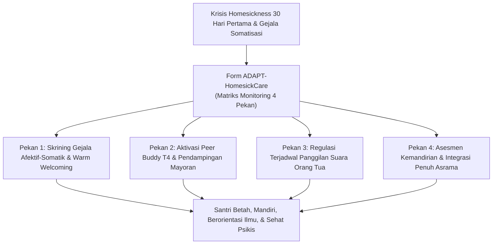
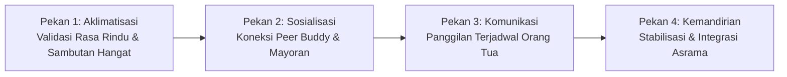
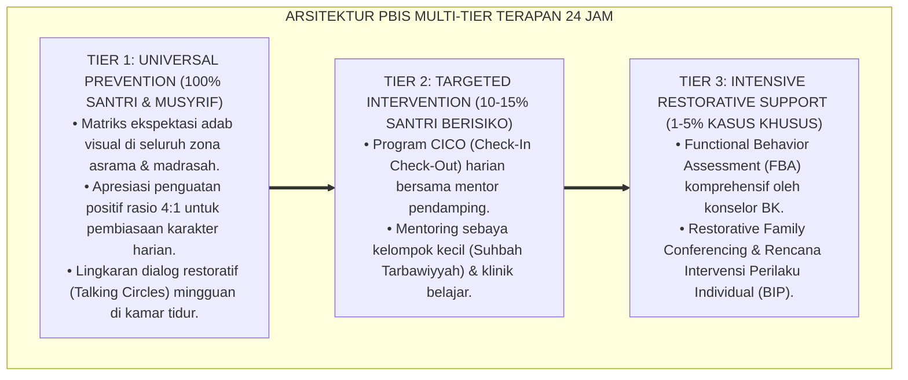

# P11-05-03: Form Monitoring Adaptasi Homesickness Care (Form ADAPT-HomesickCare)

## Status Dokumen
* **Status**: 🌟 **A+ (Tervalidasi & Siap Diimplementasikan)**
* **Sub-Domain**: `11 Tools / 05 Mentoring Tools`
* **Penanggung Jawab Keilmuan**: Dewan Keilmuan TUMBUH (*Pakar Bimbingan Konseling, Pakar Pengasuhan Asrama, & Pakar Neurosains Perkembangan*)
* **Bentuk Instrumen**: Form ADAPT-HomesickCare (Instrumen Skrining Gejala Kerinduan Rumah, Matriks Monitoring 30 Hari Pertama, & Protokol Peredaan Kecemasan Perpisahan)

---

# BAGIAN I: LANDASAN TEORETIS & INKUIRI KEILMUAN MULTIDISIPLINER

## 1.1 Konteks Masalah: Krisis Transisi 30 Hari Pertama dan Somatisasi Psikis
Fase awal perpindahan santri baru dari pelukan keluarga ke kehidupan asrama 24 jam merupakan periode krisis psikologis paling rentan dalam siklus pendidikan pesantren. Sekitar $60\%–80\%$ santri baru mengalami derajat **kerinduan rumah akut (*acute homesickness*)** dalam **30 hari pertama**. Apabila tidak dimitigasi secara terstruktur, kecemasan perpisahan (*separation anxiety*) ini bermanifestasi dalam bentuk **gangguan somatisasi (*psychogenic illness*)**: demam tanpa infeksi medis, sakit perut/maag mendadak, insomnia, mogok makan, hingga percobaan melarikan diri (*elopement*) dan desakan orang tua untuk mencabut berkas pendaftaran (*early withdrawal*).

Pendekatan konvensional yang menyikapi santri menangis dengan hardikan (*"Jangan cengeng, harus mandiri!"*) atau pemutusan kontak orang tua secara ekstrem terbukti memicu trauma psikologis dan merusak kesehatan mental santri.

TUMBUH menghadirkan **Form Monitoring Adaptasi Homesickness Care (Form ADAPT-HomesickCare)** sebagai instrumen skrining dan pendampingan terpadu yang memadukan validasi emosi, keterlibatan aktif *Peer Buddy*, dan regulasi komunikasi orang tua yang proporsional.



## 1.2 Inkuiri Epistemologi Turats: Doktrin Ghurbah fi Thalabil 'Ilmi dan Ketabahan Rihlah
Khazanah peradaban Islam memuliakan keterasingan dan keterpisahan dari kampung halaman demi menuntut ilmu (*Al-Ghurbah fi Thalabil 'Ilmi*) sebagai jihad fi sabilillah yang berpahala agung. Rasulullah SAW bersabda:

> مَنْ سَلَكَ طَرِيقًا يَلْتَمِسُ فِيهِ عِلْمًا سَهَّلَ اللَّهُ لَهُ بِهِ طَرِيقًا إِلَى الْجَنَّةِ
> 
> *"Barangsiapa menempuh suatu jalan untuk mencari ilmu, niscaya Allah akan memudahkan baginya jalan menuju surga."* [^1]

Imam Asy-Syafi'i rahimahullah dalam syair monumentalnya tentang keutamaan merantau menegaskan bahwa kemuliaan dan kedewasaan hanya diraih dengan meninggalkan zona nyaman keluarga: *"Berangkatlah merantau demi mencari kemuliaan, karena dalam perjalanan merantau itu terdapat lima faedah: melenyapkan kesedihan, mencari penghidupan, memperoleh ilmu, mempelajari adab, dan berteman dengan orang-orang mulia"* [^2]. 

Para ulama salafus shalih senantiasa mendampingi murid baru yang merasa terasing dengan kehangatan luar biasa (*Husnul Istiqbal*), menjamu mereka, dan memperlakukannya sebagai tamu Allah. Form ADAPT-HomesickCare mentransformasi doktrin *ghurbah* ini dari pengalaman menyiksa menjadi perjalanan spiritual yang memberdayakan.

## 1.3 Inkuiri Neurosains Afektif: Separation Anxiety dan Regulasi Neurobiologis
Dalam literatur psikologi klinis anak dan remaja, Christopher Thurber dan Edward Walton (2012) mendefinisikan *homesickness* sebagai distres afektif-kognitif yang dipicu oleh keterpisahan aktual atau yang diantisipasi dari rumah dan figur lekat utama [^3].

Secara neurobiologis, perpisahan mendadak memicu penurunan drastis sekresi endorfin dan oksitosin, diiringi lonjakan aktivitas amigdala dan aksis HPA yang melepaskan kortisol ke seluruh peredaran darah [^4]. Kondisi ini menyebabkan disregulasi saraf otonom parasimpatis, memicu mual, kram usus, dan sakit kepala psikogenik. Hadirnya sentuhan hangat musyrif, makanan hangat, dan teman bicara sebaya merangsang kembali sistem saraf vagal ventral (*polyvagal theory* oleh Porges, 2011), mengembalikan kondisi santri ke mode aman (*safe and social state*).

---

# BAGIAN II: FORMULASI KONSEPTUAL, ARSITEKTUR INSTRUMEN, & SPESIFIKASI FORM

## 2.1 Protokol 4 Pekan Monitoring Adaptasi Santri Baru
Selama 30 hari pertama, Musyrif Asrama dan Konselor BK memantau santri menggunakan 4 tahapan protokol adaptasi Form ADAPT-HomesickCare:

1. **Pekan 1 (Fase Aklimatisasi & Validasi Emosi)**: Fokus pada kenyamanan fisik, pengenalan lingkungan, dan validasi batin. Musyrif mendampingi santri saat jam-jam rawan kerinduan (menjelang Maghrib dan sebelum tidur malam).
2. **Pekan 2 (Fase Sosialisasi & Integrasi Peer Buddy)**: Kakak Asuh T4 mengajak santri makan bersama, berkeliling pondok, dan memperkenalkan rutinitas halaqah santai tanpa tuntutan target hafalan berat.
3. **Pekan 3 (Fase Komunikasi Keluarga Terjadwal)**: Pelaksanaan sesi *Video Call / Voice Call* terjadwal bersama orang tua (durasi 15 menit) dengan penguatan afirmasi kemandirian sebelum dan sesudah panggilan.
4. **Pekan 4 (Fase Kemandirian Penuh & Evaluasi Adaptasi)**: Santri mulai mengelola cucian, jadwal belajar, dan ibadah secara mandiri. Penilaian kelulusan fase adaptasi santri baru.



## 2.2 Format Instrumen Form ADAPT-HomesickCare (Lembar Monitoring 30 Hari Siap Pakai)

```markdown
================================================================================
         LEMBAR MONITORING ADAPTASI HOMESICKNESS CARE (FORM ADAPT-HOMESICKCARE)
================================================================================
Nama Santri Baru : [____________________]   Kamar/Asrama  : [___________]
Asal Daerah      : [____________________]   Tanggal Masuk : [___-___-2026]
Nama Musyrif     : [____________________]   Nama Buddy T4 : [___________]
--------------------------------------------------------------------------------

[BAGIAN 1: SKRINING GEJALA MINGGUAN (PEKAN 1 S/D 4)]
Beri tanda ceklis [X] pada gejala yang teramati dalam sepekan:

+-------------------------------------------+---------+---------+---------+---------+
| INDIKATOR GEJALA ADAPTASI                 | PEKAN 1 | PEKAN 2 | PEKAN 3 | PEKAN 4 |
+-------------------------------------------+---------+---------+---------+---------+
| 1. Menangis saat menjelang malam/tidur    | [ ]     | [ ]     | [ ]     | [ ]     |
| 2. Mengeluh sakit perut/mual tanpa demam  | [ ]     | [ ]     | [ ]     | [ ]     |
| 3. Menyendiri & enggan berbaur di kamar   | [ ]     | [ ]     | [ ]     | [ ]     |
| 4. Nafsu makan menurun drastis            | [ ]     | [ ]     | [ ]     | [ ]     |
| 5. Meminta pulang / menelepon orang tua   | [ ]     | [ ]     | [ ]     | [ ]     |
| 6. Tersenyum & bercanda bersama kawan     | [ ]     | [ ]     | [ ]     | [ ]     |
| 7. Mengikuti halaqah/KBM dengan ceria     | [ ]     | [ ]     | [ ]     | [ ]     |
+-------------------------------------------+---------+---------+---------+---------+

[BAGIAN 2: LOGBOOK INTERVENSI PENDAMPINGAN KHUSUS]
* Sesi Konseling Privat BK    : Tanggal [___-___-2026] -> Hasil: _____________________
* Sesi Panggilan Terjadwal    : Tanggal [___-___-2026] -> Durasi: [___] Menit.
* Evaluasi Respons Telepon    : [ ] Menjadi Lebih Tenang   [ ] Kembali Menangis Histeris
* Catatan Rekomendasi Musyrif : _______________________________________________________

[BAGIAN 3: KESIMPULAN STATUS ADAPTASI (AKHIR HARI KE-30)]
[ ] TINGKAT 1 (ADAPTASI SEMPURNA): Mandiri, ceria, dan aktif mengikuti ritme pondok.
[ ] TINGKAT 2 (ADAPTASI RINGAN)  : Masih teringat rumah sesekali namun mampu regulasi diri.
[ ] TINGKAT 3 (HOMESICK AKUT)    : Butuh rujukan intensif konseling BK & pendampingan Tier 3.

--------------------------------------------------------------------------------
Tanda Tangan Musyrif Asrama                    Tanda Tangan Konselor BK Asrama


(______________________________)               (______________________________)
================================================================================
```

## 2.3 Rubrik Triase Level Keparahan Homesickness
Konselor BK menggunakan matriks triase ini untuk menentukan intervensi yang tepat bagi santri baru:

| Derajat Keparahan | Tanda Klinis & Perilaku | Protokol Tindakan Intervensi |
| :--- | :--- | :--- |
| **Level 1: Ringan (Normal Transisi)** | Menangis sebentar sebelum tidur; nafsu makan normal; ceria saat siang hari. | Ditemani mengobrol oleh Kakak Asuh T4; diajak minum susu hangat sebelum tidur. |
| **Level 2: Sedang (Perlu Perhatian)** | Menolak makan 1–2 kali; mengurung diri di ranjang; sering melamun saat KBM. | Musyrif memanggil untuk sesi curhat privat 1-on-1; fasilitasi panggilan suara keluarga. |
| **Level 3: Akut (Krisis Somatik)** | Menangis histeris berkepanjangan; muntah-muntah psikogenik; mengancam kabur. | Rujukan darurat ke Ruang BK; konsultasi psikolog mitra; pendampingan 24 jam melekat. |

---

---

### Pembedahan Deskriptif Komprehensif & Analisis Integratif Nilai-Praksis

Penerapan dan operasionalisasi **P11-05-03: Form Monitoring Adaptasi Homesickness Care (Form ADAPT-HomesickCare)** di lingkungan pesantren berbasis sistem TUMBUH bertumpu pada kesatuan sistemik antara nilai syariat dan praksis terukur:

#### A. Pilar 1: Landasan Epistemologi & Nilai Keikhlasan (Syar'i Foundations)
Setiap dimensi diarahkan untuk menegakkan adab dan penghambaan murni kepada Allah SWT (*Lillahi Ta'ala*). Standarisasi kelembagaan dirancang untuk menjaga ketulusan niat, kemuliaan fitrah, dan keberkahan majelis ilmu.

#### B. Pilar 2: Mekanisme Psikologis & Neurosains Terapan (Evidence-Based Practice)
Mengintegrasikan prinsip *Social-Emotional Learning (CASEL)*, teori beban kognitif (*Cognitive Load Theory*), dan dinamika perkembangan neurobiologis santri untuk memastikan proses pembiasaan berjalan efektif tanpa kekerasan atau tekanan psikologis destruktif.

#### C. Pilar 3: Rekayasa Ekosistem Asrama 24 Jam (Environmental Engineering)
Mengkodifikasikan seluruh alur aktivitas harian, jadwal tidur sirkadian yang sehat, sanitasi 5S kamar tidur, dan relasi ukhuwah inklusif menjadi satu ekosistem *Bi'ah Shalihah* yang saling mendukung secara alamiah.

#### D. Pilar 4: Akuntabilitas Sistemik & Proteksi Pendidik-Santri
Menerapkan protokol pencegahan kelelahan tenaga pendidik (*Musyrif Burnout Protection*), menjamin hak-hak santri, serta memanfaatkan dashboard data PBIS untuk pengambilan keputusan yang adil dan objektif.

---

### Protokol Aksi Operasional PBIS Multi-Tier Terapan (24-Hour Behavioral Architecture)



---

# BAGIAN III: TABEL SINTESIS, DAFTAR PUSTAKA, CATATAN KAKI, & GLOSARIUM

## 3.1 Tabel Sintesis Integrasi Homesickness Care 30 Hari

| Komponen Form ADAPT-HomesickCare | Landasan Turats & Fiqh | Landasan Neurosains & Klinis | Target Transformasi Santri |
| :--- | :--- | :--- | :--- |
| **Skrining Gejala Afektif** | Tradisi *Husnul Istiqbal* & perhatian pada musafir ilmu. | Deteksi dini *Separation Anxiety* & somatisasi. | Mencegah trauma perpisahan dan komplikasi psikis. |
| **Integrasi Peer Buddy** | Doktrin *Al-Mu'akhat* kaum Muhajirin dan Anshar. | *Social buffering effect* & aktivasi vagal ventral. | Menghadirkan rasa aman dan rumah kedua di asrama. |
| **Panggilan Terjadwal** | Menjaga silaturahim keluarga & birrul walidain. | *Cognitive closure* & kepastian hubungan lekat. | Mengikis kecemasan santri dan menenangkan orang tua. |

## 3.2 Catatan Kaki (Footnotes 1-to-1)
[^1]: Diriwayatkan oleh Imam Muslim dalam *Shahih Muslim*, kitab *adz-Dzikr wa ad-Du'a' wa at-Taubah*, hadits no. 2699.
[^2]: Asy-Syafi'i, Muhammad bin Idris. (1993). *Diwan al-Imam asy-Syafi'i*. Ditahqiq oleh Muhammad Ibrahim Salim. Kairo: Maktabah Ibn Sina, hlm. 45–48.
[^3]: Thurber, C. A., & Walton, E. A. (2012). Homesickness and adjustment in university students. *Journal of American College Health*, 60(5), 415–419.
[^4]: Porges, S. W. (2011). *The Polyvagal Theory: Neurophysiological Foundations of Emotions, Attachment, Communication, and Self-regulation*. New York: W. W. Norton & Company.
[^5]: Bowlby, J. (1973). *Attachment and Loss: Vol. 2. Separation: Anxiety and Anger*. New York: Basic Books.
[^6]: Al-Ghazali, Abu Hamid. (1998). *Ihya' 'Ulum al-Din: Kitab Adab as-Safar*. Beirut: Dar al-Kutub al-'Ilmiyyah, juz 2, hlm. 240–252.
[^7]: Stroebe, M., Schut, H., & Nauta, M. H. (2015). Is homesickness a miniature version of bereavement? *Clinical Psychological Science*, 4(5), 898–909.
[^8]: Ibnu 'Abdil Barr. (1994). *Jami' Bayan al-'Ilmi wa Fadhlih*. Riyadh: Dar Ibn al-Jauzi, juz 1, hlm. 110–118.
[^9]: Kerns, K. A., & Brumariu, L. E. (2014). Is insecure parent-child attachment a risk factor for the development of anxiety in childhood or adolescence? *Child Development Perspectives*, 8(1), 12–17.
[^10]: Al-Khatib Al-Baghdadi. (1998). *Ar-Rihlah fi Thalab al-Hadits*. Beirut: Dar al-Kutub al-'Ilmiyyah, hlm. 35–42.
[^11]: Cozolino, L. (2014). *The Neuroscience of Human Relationships: Attachment and the Developing Social Brain* (2nd ed.). New York: W. W. Norton & Company.
[^12]: An-Nawawi, Yahya bin Syaraf. (1994). *Riyadhus Shalihin: Bab Birr al-Walidain wa Shilat ar-Rahim*. Kairo: Dar al-Hadits, hlm. 128–135.

## 3.3 Daftar Pustaka (APA 7th Edition & Turats Klasik)
* Al-Ghazali, A. H. (1998). *Ihya' 'Ulum al-Din* (Vol. 2). Beirut: Dar al-Kutub al-'Ilmiyyah.
* Al-Khatib Al-Baghdadi. (1998). *Ar-Rihlah fi Thalab al-Hadits*. Beirut: Dar al-Kutub al-'Ilmiyyah.
* An-Nawawi, Y. S. (1994). *Riyadhus Shalihin*. Kairo: Dar al-Hadits.
* Asy-Syafi'i, M. I. (1993). *Diwan al-Imam asy-Syafi'i*. Kairo: Maktabah Ibn Sina.
* Bowlby, J. (1973). *Attachment and Loss: Vol. 2. Separation: Anxiety and Anger*. New York: Basic Books.
* Cozolino, L. (2014). *The Neuroscience of Human Relationships: Attachment and the Developing Social Brain* (2nd ed.). New York: W. W. Norton & Company.
* Ibnu 'Abdil Barr. (1994). *Jami' Bayan al-'Ilmi wa Fadhlih*. Riyadh: Dar Ibn al-Jauzi.
* Kerns, K. A., & Brumariu, L. E. (2014). Is insecure parent-child attachment a risk factor for the development of anxiety in childhood or adolescence? *Child Development Perspectives*, 8(1), 12–17.
* Porges, S. W. (2011). *The Polyvagal Theory: Neurophysiological Foundations of Emotions, Attachment, Communication, and Self-regulation*. New York: W. W. Norton & Company.
* Stroebe, M., Schut, H., & Nauta, M. H. (2015). Is homesickness a miniature version of bereavement? *Clinical Psychological Science*, 4(5), 898–909.
* Thurber, C. A., & Walton, E. A. (2012). Homesickness and adjustment in university students. *Journal of American College Health*, 60(5), 415–419.

## 3.4 Glosarium Istilah
1. **Form ADAPT-HomesickCare**: Instrumen terpadu pemantauan dan intervensi adaptasi 30 hari pertama bagi santri baru yang mengalami *homesickness*.
2. **Acute Homesickness**: Reaksi distres emosional dan psikososial yang kuat akibat keterpisahan pertama kali dari lingkungan rumah dan orang tua.
3. **Psychogenic Illness**: Keluhan fisik (seperti demam atau sakit perut) yang timbul murni akibat tekanan psikologis tanpa adanya infeksi medis biologis.
4. **Ghurbah**: Keadaan terasing dan merantau jauh dari tanah kelahiran demi menuntut ilmu syar'i dan menempa kedewasaan.
5. **Polyvagal Theory**: Teori neurobiologi tentang peran saraf vagus dalam meregulasi respons stres sosial dan memicu rasa tenang saat merasa aman.
6. **Social Buffering Effect**: Efek perlindungan biologis di mana kehadiran sahabat atau figur mentor yang ramah dapat menurunkan lonjakan hormon stres kortisol.
7. **Husnul Istiqbal**: Tradisi penyambutan tamu atau santri baru dengan penuh kehangatan, keramahan, dan penghormatan dalam Islam.
8. **Cognitive Closure**: Kepastian kognitif dan emosional yang diperoleh santri setelah mendapatkan kejelasan jadwal komunikasi dengan keluarga.
9. **Elopement Risk**: Risiko santri meninggalkan area pesantren secara diam-diam tanpa izin akibat rasa rindu rumah yang tidak tertahankan.
10. **Early Withdrawal**: Keputusan sepihak orang tua untuk menarik anaknya keluar dari pesantren pada bulan pertama akibat panik melihat tangisan anak.
