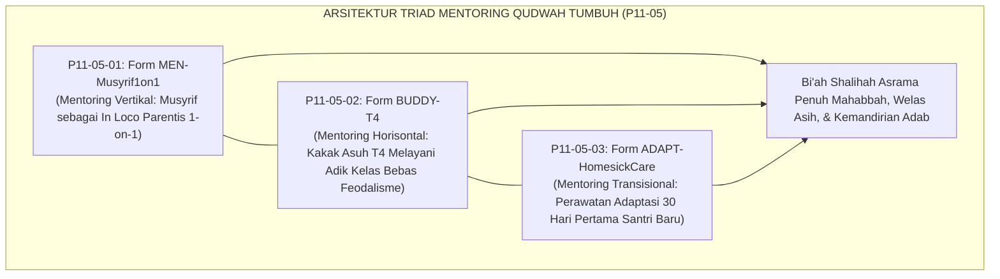
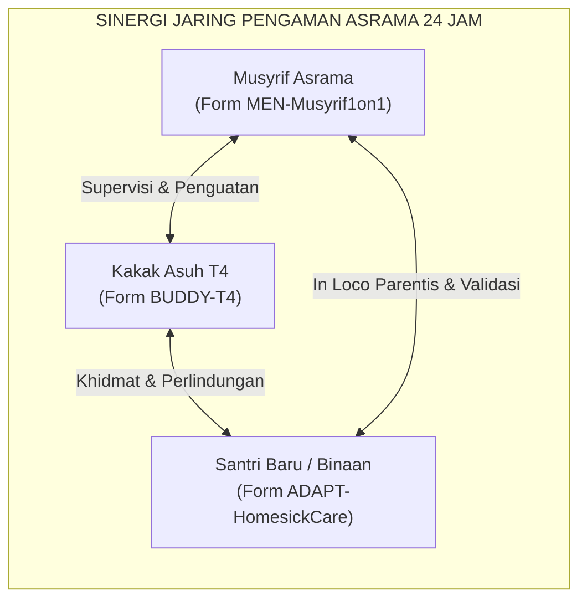
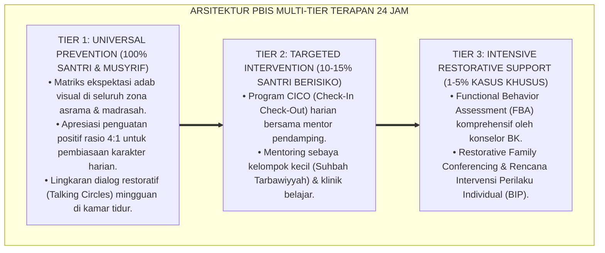

# P11-05: Instrumen Mentoring Qudwah (Sintesis Mentoring Tools Ekosistem TUMBUH)

## Status Dokumen
* **Status**: 🌟 **A+ (Tervalidasi & Siap Diimplementasikan)**
* **Domain**: `11 Tools` > `05 Mentoring Tools` (Master Induk Sub-Domain 05)
* **Penanggung Jawab Keilmuan**: Dewan Keilmuan TUMBUH (*Pakar Pengasuhan Asrama, Pakar Tata Kelola Qudwah, Pakar Psikologi Sosial Santri, & Pakar Bimbingan Konseling*)
* **Rumpun Instrumen**: Form MEN-Musyrif1on1, Form BUDDY-T4, dan Form ADAPT-HomesickCare

---

# BAGIAN I: LANDASAN TEORETIS & INKUIRI KEILMUAN MULTIDISIPLINER

## 1.1 Konteks Masalah: Menghadirkan Ekosistem Pengasuhan Berbasis Keteladanan dan Kasih Sayang
Tantangan terbesar dalam tata kelola asrama pesantren modern adalah bagaimana menjaga agar proses pembinaan karakter tidak tereduksi menjadi penegakan aturan mekanistik yang kaku dan dingin. Ketika asrama hanya dikelola dengan instruksi massal, pengumuman mikrofon, dan hukuman pelanggaran, santri kehilangan figur teladan (*role model*) yang dapat dijadikan tempat bersandar saat menghadapi krisis emosional dan spiritual.

Gugus **Mentoring Tools (P11-05)** dirancang untuk merekayasa iklim pengasuhan 24 jam menjadi **ekosistem persaudaraan yang sarat dengan keteladanan nyata (*Qudwah Hasanah*) dan perlindungan batin**. Melalui integrasi tiga instrumen terpadu—runbook mentoring privat musyrif 1-on-1, sistem persaudaraan asuh sebaya (*Peer Buddy* T4 bebas feodalisme), dan instrumen perawatan adaptasi santri baru (*Homesickness Care*)—TUMBUH membangun jaring pengaman sosial yang memastikan tidak ada satu pun santri yang merasa sendirian atau terasing di asrama.

## 1.2 Inkuiri Epistemologi Turats: Doktrin Qudwah Hasanah, Suhbah, dan Mu'akhat
Dalam khazanah pendidikan Islam, metode paling efektif dalam menanamkan adab bukanlah ceramah teoritis (*lisan al-maqal*), melainkan keteladanan hidup (*lisan al-hal*). Allah SWT berfirman: *"Sungguh telah ada pada diri Rasulullah itu suri teladan yang baik bagi kalian"* (*Laqad Kāna Lakum fī Rasūlillāhi Uswatun Hasanah* — QS. Al-Ahzab: 21).

Imam Ibnu Jama'ah dalam *Tadzkirat as-Sami' wa al-Mutakallim* meletakkan syarat utama seorang pendidik bahwa perilakunya harus mendahului perkataannya: *"Pendidik sejati adalah orang yang perilakunya membenarkan ucapannya; jika ia memerintahkan suatu adab, dialah orang pertama yang mengamalkannya; dan jika ia melarang suatu keburukan, dialah orang paling jauh darinya"* [^1].

Ketiga instrumen dalam gugus P11-05 menerjemahkan doktrin turats ini secara terstruktur: Form MEN-Musyrif1on1 menghidupkan kasih sayang kenabian dalam dialog empat mata; Form BUDDY-T4 merealisasikan doktrin *Al-Mu'akhat* kaum Anshar dan Muhajirin dalam bentuk pelayanan kakak asuh; dan Form ADAPT-HomesickCare mewujudkan *Husnul Istiqbal* bagi para penuntut ilmu yang terasing [^2].

## 1.3 Inkuiri Sains Relasional & Psikologi Sosial: Secure Base dan Prosocial Culture
Secara neurobiologis dan sosiologis, gugus P11-05 berpijak pada integrasi *Attachment Theory* John Bowlby dan teori kepemimpinan pelayan (*Servant Leadership*) Robert Greenleaf [^3].

Dalam kehidupan asrama, musyrif dan kakak asuh T4 berfungsi sebagai **pangkalan rasa aman (*secure base and safe haven*)**. Ketika santri memiliki figur lekat yang dapat dipercaya, amigdala tidak terus-menerus berada dalam mode waspada (*chronic social threat*). Hal ini membebaskan energi kognitif korteks prefrontal untuk fokus pada proses belajar, menghafal Al-Qur'an, dan membangun persahabatan yang sehat. Intervensi berbasis *buddy* juga meluruhkan polarisasi senior-junior, menciptakan kultur prososial yang bebas dari perundungan (*zero-bullying ecosystem*).

---

# BAGIAN II: FORMULASI KONSEPTUAL, MATRIKS INTEGRASI, & PROTOKOL SINERGI

## 2.1 Matriks Integrasi Tiga Instrumen Mentoring Qudwah

| Dimensi Parameter | Form MEN-Musyrif1on1 (P11-05-01) | Form BUDDY-T4 (P11-05-02) | Form ADAPT-HomesickCare (P11-05-03) |
| :--- | :--- | :--- | :--- |
| **Arah Relasi** | **Vertikal (In Loco Parentis)**: Musyrif ke Santri Binaan. | **Horisontal-Transisional**: Santri Senior T4 ke Adik Asuh T1/T2. | **Transisi Krisis**: Tim Terpadu (Musyrif, BK, Buddy) ke Santri Baru. |
| **Frekuensi Sesi** | Dwimingguan (20–30 Menit per Santri). | Harian & Pekanan (Talaqqi 15 Menit & Mayoran 2x/pekan). | Harian intensif selama 30 hari pertama (4 pekan evaluasi). |
| **Fokus Transformasi** | Keterikatan aman, kedalaman batin, dan review progres ipsatif. | Khidmat melayani, penghapusan senioritas, dan pendampingan adab 5S. | Reduksi kecemasan perpisahan, somatisasi psikis, dan kemandirian. |
| **Media Instrumen** | Lembar Runbook Musyrif A4 / Modul SIM Intizham. | Buku Checklist Saku Kakak Asuh / Lembar Monitoring Kamar. | Lembar Skrining Klinis Afektif-Somatik & Rekap Triase BK. |

## 2.2 Protokol Perlindungan & Standar Etika Mentoring (*Mentoring Safeguarding Standards*)
Pelaksanaan seluruh instrumen mentoring wajib mematuhi 3 asas etika perlindungan santri (*Child Safeguarding Protocols*):

1. **Prinsip Transparansi Spasial (*Open-Door & Visible Space*)**: Sesi mentoring 1-on-1 musyrif wajib dilakukan di ruang yang terbuka dan terlihat pandangan publik (teras kamar, gazebo, atau ruang tamu asrama yang berpintu kaca bening), dilarang keras mengunci pintu atau melakukan sesi di ruang gelap tertutup.
2. **Larangan Eksploitasi & Hierarki Fisik (*Zero Service Abuse*)**: Santri T4 dilarang keras menyuruh adik asuh mencuci pakaian, membelikan makanan, atau memijat; hubungan *peer buddy* murni bersifat pelayanan kakak asuh kepada adik asuh (*Servant Leadership*).
3. **Deteksi Dini & Kewajiban Melapor (*Mandatory Escalation Protocol*)**: Jika dalam sesi mentoring ditemukan indikasi depresi berat, luka fisik mencurigakan, atau curahan hati terkait pelecehan/kekerasan, musyrif dan kakak asuh wajib melaporkan dalam tempo $1 \times 24$ jam kepada Satgas Perlindungan Anak Pesantren.

---

---

### Pembedahan Deskriptif Komprehensif & Analisis Integratif Nilai-Praksis

Penerapan dan operasionalisasi **P11-05: Instrumen Mentoring Qudwah (Sintesis Mentoring Tools Ekosistem TUMBUH)** di lingkungan pesantren berbasis sistem TUMBUH bertumpu pada kesatuan sistemik antara nilai syariat dan praksis terukur:

#### A. Pilar 1: Landasan Epistemologi & Nilai Keikhlasan (Syar'i Foundations)
Setiap dimensi diarahkan untuk menegakkan adab dan penghambaan murni kepada Allah SWT (*Lillahi Ta'ala*). Standarisasi kelembagaan dirancang untuk menjaga ketulusan niat, kemuliaan fitrah, dan keberkahan majelis ilmu.

#### B. Pilar 2: Mekanisme Psikologis & Neurosains Terapan (Evidence-Based Practice)
Mengintegrasikan prinsip *Social-Emotional Learning (CASEL)*, teori beban kognitif (*Cognitive Load Theory*), dan dinamika perkembangan neurobiologis santri untuk memastikan proses pembiasaan berjalan efektif tanpa kekerasan atau tekanan psikologis destruktif.

#### C. Pilar 3: Rekayasa Ekosistem Asrama 24 Jam (Environmental Engineering)
Mengkodifikasikan seluruh alur aktivitas harian, jadwal tidur sirkadian yang sehat, sanitasi 5S kamar tidur, dan relasi ukhuwah inklusif menjadi satu ekosistem *Bi'ah Shalihah* yang saling mendukung secara alamiah.

#### D. Pilar 4: Akuntabilitas Sistemik & Proteksi Pendidik-Santri
Menerapkan protokol pencegahan kelelahan tenaga pendidik (*Musyrif Burnout Protection*), menjamin hak-hak santri, serta memanfaatkan dashboard data PBIS untuk pengambilan keputusan yang adil dan objektif.

---

### Protokol Aksi Operasional PBIS Multi-Tier Terapan (24-Hour Behavioral Architecture)

---

# BAGIAN III: TABEL SINTESIS, DAFTAR PUSTAKA, CATATAN KAKI, & GLOSARIUM

## 3.1 Tabel Sintesis Integrasi Master Mentoring Tools (P11-05)

| Instrumen Mentoring | Rujukan Turats Klasik | Rujukan Sains & Psikologi Relasional | Target Transformasi Asrama |
| :--- | :--- | :--- | :--- |
| **P11-05-01 (MEN-Musyrif1on1)** | *Ihya'* Al-Ghazali & Hadits *Abu 'Umair* (HR. Bukhari). | *Attachment Theory* (Bowlby) & *Relational Mentoring* (Kram). | Terwujudnya figur orang tua kedua yang hangat di asrama. |
| **P11-05-02 (BUDDY-T4)** | Hadits *Rahmah ash-Shaghir* & Doktrin *Al-Itsar*. | *Cross-Age Peer Tutoring* (Topping) & *Servant Leadership*. | Hilangnya feodalisme senioritas dan terciptanya budaya khidmat. |
| **P11-05-03 (ADAPT-HomesickCare)**| Doktrin *Ghurbah fi Thalabil 'Ilmi* Asy-Syafi'i. | *Homesickness Intervention* (Thurber) & *Polyvagal Theory*. | Nol angka putus pondok dini (*Zero Early Drop-Out*). |

## 3.2 Catatan Kaki (Footnotes 1-to-1)
[^1]: Ibnu Jama'ah, Badruddin. (2012). *Tadzkirat as-Sami' wa al-Mutakallim fi Adab al-'Alim wa al-Muta'allim*. Beirut: Dar al-Basyair al-Islamiyyah, hlm. 50–58.
[^2]: Al-Ghazali, Abu Hamid. (1998). *Ihya' 'Ulum al-Din: Kitab Adab al-Mu'allim wa al-Muta'allim*. Beirut: Dar al-Kutub al-'Ilmiyyah, juz 1, hlm. 65–75.
[^3]: Bowlby, J. (1982). *Attachment and Loss: Vol. 1. Attachment* (2nd ed.). New York: Basic Books.
[^4]: Greenleaf, R. K. (1977). *Servant Leadership: A Journey into the Nature of Legitimate Power and Greatness*. New York: Paulist Press.
[^5]: Kram, K. E. (1985). *Mentoring at Work: Developmental Relationships in Organizational Life*. Glenview, IL: Scott, Foresman and Company.
[^6]: Topping, K. J. (2005). Trends in peer learning. *Educational Psychology*, 25(6), 631–645.
[^7]: Thurber, C. A., & Walton, E. A. (2012). Homesickness and adjustment in university students. *Journal of American College Health*, 60(5), 415–419.
[^8]: Porges, S. W. (2011). *The Polyvagal Theory*. New York: W. W. Norton & Company.
[^9]: An-Nawawi, Yahya bin Syaraf. (1994). *Riyadhus Shalihin: Bab ash-Shidq wa al-Ukhuwwah*. Kairo: Dar al-Hadits, hlm. 102–110.
[^10]: Ibnu Hajar Al-'Asqalani. (2001). *Fath al-Bari bi Syarh Shahih al-Bukhari*. Beirut: Dar al-Ma'rifah, juz 10, hlm. 435–445.
[^11]: Rhodes, J. E. (2002). *Stand by Me: The Risks and Rewards of Mentoring Today's Youth*. Cambridge, MA: Harvard University Press.
[^12]: Bandura, A. (1977). *Social Learning Theory*. Englewood Cliffs, NJ: Prentice-Hall.

## 3.3 Daftar Pustaka (APA 7th Edition & Turats Klasik)
* Al-Ghazali, A. H. (1998). *Ihya' 'Ulum al-Din* (Vol. 1). Beirut: Dar al-Kutub al-'Ilmiyyah.
* An-Nawawi, Y. S. (1994). *Riyadhus Shalihin*. Kairo: Dar al-Hadits.
* Bandura, A. (1977). *Social Learning Theory*. Englewood Cliffs, NJ: Prentice-Hall.
* Bowlby, J. (1982). *Attachment and Loss: Vol. 1. Attachment* (2nd ed.). New York: Basic Books.
* Greenleaf, R. K. (1977). *Servant Leadership: A Journey into the Nature of Legitimate Power and Greatness*. New York: Paulist Press.
* Ibnu Hajar Al-'Asqalani. (2001). *Fath al-Bari* (Vol. 10). Beirut: Dar al-Ma'rifah.
* Ibnu Jama'ah, B. (2012). *Tadzkirat as-Sami' wa al-Mutakallim*. Beirut: Dar al-Basyair al-Islamiyyah.
* Kram, K. E. (1985). *Mentoring at Work: Developmental Relationships in Organizational Life*. Glenview, IL: Scott, Foresman and Company.
* Porges, S. W. (2011). *The Polyvagal Theory*. New York: W. W. Norton & Company.
* Rhodes, J. E. (2002). *Stand by Me: The Risks and Rewards of Mentoring Today's Youth*. Cambridge, MA: Harvard University Press.
* Thurber, C. A., & Walton, E. A. (2012). Homesickness and adjustment in university students. *Journal of American College Health*, 60(5), 415–419.
* Topping, K. J. (2005). Trends in peer learning. *Educational Psychology*, 25(6), 631–645.

## 3.4 Glosarium Istilah
1. **Mentoring Tools**: Gugus instrumen pendampingan relasional interpersonal antara musyrif, santri senior, dan santri yunior untuk menjamin iklim asrama yang aman dan penuh kasih sayang.
2. **Form MEN-Musyrif1on1**: Format runbook operasional sesi *mentoring* privat dwimingguan musyrif-santri.
3. **Form BUDDY-T4**: Instrumen checklist pendampingan persaudaraan asuh sebaya oleh santri Tahap 4 (Penggerak).
4. **Form ADAPT-HomesickCare**: Format lembar skrining dan monitoring 30 hari adaptasi santri baru yang mengalami *homesickness*.
5. **Qudwah Hasanah**: Keteladanan moral dan adab nyata yang dipraktikkan langsung oleh pendidik sebelum mengajak orang lain.
6. **Lisan al-Hal**: Dakwah dan bimbingan melalui keteladanan tindakan yang melampaui ribuan kata-kata lisan.
7. **Secure Base**: Sosok figur lekat terpercaya yang memberikan rasa aman sehingga seseorang berani mengeksplorasi lingkungan belajarnya.
8. **Servant Leadership**: Paradigma kepemimpinan santri senior yang mengutamakan pelayanan dan pengayoman kepada adik kelas.
9. **Zero-Bullying Ecosystem**: Lingkungan sosial pesantren yang dirancang secara struktural dan kultural bebas dari segala bentuk perundungan.
10. **Safeguarding Standards**: Standar etika dan hukum yang menjamin perlindungan fisik dan emosional santri dari segala bentuk eksploitasi dan kekerasan.
