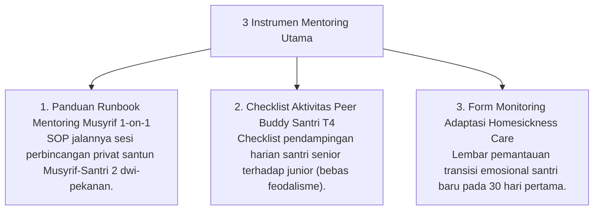

# P11-05: Instrumen Mentoring Qudwah

## Status Dokumen
* **Status**: 🌟 **A+ (Tervalidasi & Siap Diimplementasikan)**
* **Sub-Domain**: `11 Tools / 05 Mentoring Tools`
* **Penanggung Jawab Keilmuan**: Dewan Keilmuan TUMBUH (*Pakar Pengasuhan Asrama & Pakar Tata Kelola Qudwah*)

---

## 1. Konseptualisasi Mentoring Tools Pesantren

Instrumen Mentoring (*Mentoring Tools*) menyediakan panduan teknis langkah-demi-langkah bagi Musyrif dan Santri Senior T4 dalam melaksanakan pendampingan hubungan interpersonal yang hangat:

---

## 2. Keteraturan Pelaksanaan Field-Friendly

Seluruh instrumen dirancang ringkas sehingga mudah dieksekusi di sela-sela rutinitas asrama.
