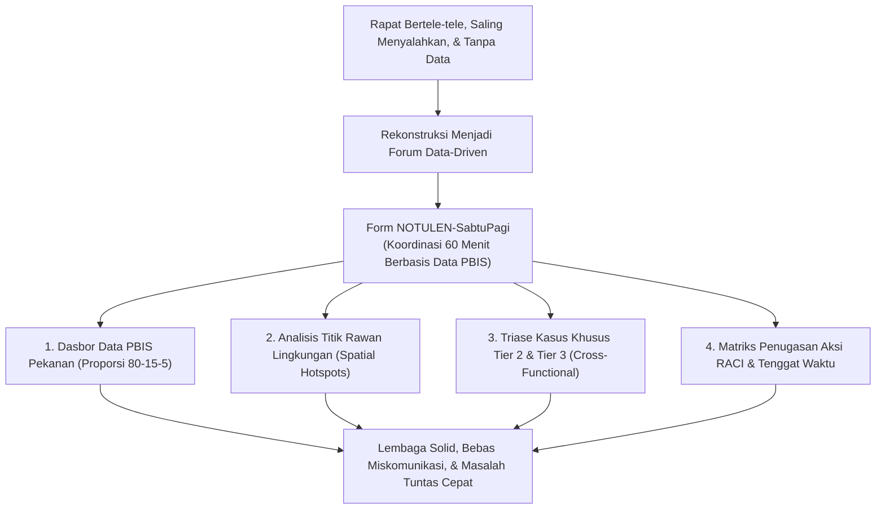
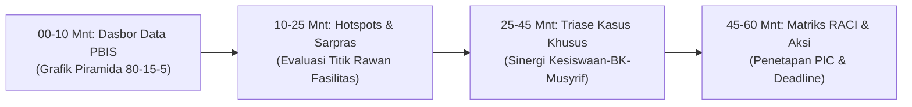

# P11-06-01: Templat Notulensi Rapat Evaluasi Sabtu Pagi (Form NOTULEN-SabtuPagi)

## Status Dokumen
* **Status**: 🌟 **A+ (Tervalidasi & Siap Diimplementasikan)**
* **Sub-Domain**: `11 Tools / 06 Documentation Tools`
* **Penanggung Jawab Keilmuan**: Dewan Keilmuan TUMBUH (*Pakar Tata Kelola Qudwah, Pakar PBIS, & Pakar Metodologi Riset TUMBUH*)
* **Bentuk Instrumen**: Form NOTULEN-SabtuPagi (Templat Notulensi Berbasis Data PBIS, Matriks Penugasan RACI, & Logbook Retrospektif Pekanan)

---

# BAGIAN I: LANDASAN TEORETIS & INKUIRI KEILMUAN MULTIDISIPLINER

## 1.1 Konteks Masalah: Inefisiensi Rapat Koordinasi Konvensional dan Blame-Culture
Salah satu kendala kronis dalam tata kelola kelembagaan pesantren adalah forum rapat evaluasi yang tidak efektif: berlangsung berjam-jam tanpa agenda yang jelas, didominasi keluhan subjektif tanpa bukti data, terjadi saling lempar tanggung jawab (*blame-culture*) antara staf madrasah (guru kelas) dengan staf pengasuhan (musyrif asrama), dan berakhir tanpa matriks keputusan yang terukur. Akibatnya, masalah kedisiplinan dan sarana asrama yang sama terus berulang dari pekan ke pekan tanpa resolusi tuntas.

Model manajemen TUMBUH merombak forum koordinasi mingguan melalui standarisasi **Rapat Evaluasi Pengasuhan Sabtu Pagi (Form NOTULEN-SabtuPagi)**. Rapat ini dirancang sebagai forum koordinasi presisi berdurasi maksimal **60 menit**, dipandu langsung oleh data analitik PBIS dari SIM Intizham, berorientasi pemecahan masalah kolaboratif (*cross-functional problem solving*), dan menghasilkan penugasan aksi dengan PIC (*Person in Charge*) dan tenggat waktu yang mengikat.



## 1.2 Inkuiri Epistemologi Turats: Doktrin Syura, Tadbir, dan Amanah Kepemimpinan
Tradisi Islam menempatkan musyawarah (*Asy-Syura*) sebagai sendi pokok kepemimpinan yang adil dan profesional. Allah SWT berfirman memerintahkan musyawarah dalam mengelola urusan umat: *"Dan urusan mereka (diputuskan) dengan musyawarah antara mereka"* (*Wa Amruhum Syūrā Bainahum* — QS. Asy-Syura: 38).

Sayyidina Umar bin Al-Khattab radhiyallahu 'anhu dalam mengelola rapat para amil dan gubernurnya senantiasa meminta laporan data faktual (*hisab al-amal*), melarang perdebatan kusir tanpa solusi, dan mencatat setiap komitmen pejabat secara tertulis:

> لَا خَيْرَ فِي أَمْرٍ أُبْرِمَ مِنْ غَيْرِ شُورَى، وَإِذَا عَزَمْتُمْ فَانْدُبُوا لِكُلِّ عَمَلٍ رَجُلًا أَمِينًا حَفِيظًا
> 
> *"Tiada kebaikan dalam suatu urusan yang diputuskan tanpa musyawarah, dan apabila kalian telah menetapkan tekad, maka tunjuklah untuk setiap tugas seorang penanggung jawab yang amanah dan kompeten menjaga tugasnya."* [^1]

Imam Al-Mawardi dalam *Al-Ahkam as-Sulthaniyyah* menegaskan bahwa syarat mutlak keberhasilan tata kelola (*husnu at-tadbir*) adalah keteraturan dokumentasi keputusan lembaga (*tadwin as-sijillat*) agar tidak terjadi kelalaian atau pengingkaran amanah [^2]. Form NOTULEN-SabtuPagi mewujudkan doktrin syura dan tadbir ini ke dalam instrumen notulensi modern.

## 1.3 Inkuiri Sains Tata Kelola & Agile Management: Data-Driven Decision Making dan Action Tracking
Dalam teori manajemen modern dan efektivitas tim kerja (*High-Performing Teams* oleh Patrick Lencioni, 2002), rapat yang produktif memerlukan kejelasan fokus (*Clarity of Purpose*), rasa saling percaya (*Vulnerability-Based Trust*), dan akuntabilitas tim yang ketat (*Peer-to-Peer Accountability*) [^3].

Gugus instrumen Form NOTULEN-SabtuPagi menerapkan metodologi **Data-Driven Decision Making (DDDM)** dan prinsip *Agile Weekly Retrospective*. Alih-alih berdebat berdasarkan opini pribadi, pimpinan rapat membuka sesi dengan menampilkan grafik tren insiden dan poin kebaikan dari SIM Intizham. Matriks penugasan menggunakan format **RACI (*Responsible, Accountable, Consulted, Informed*)**, yang secara ilmiah terbukti mengeliminasi ambiguitas peran (*role ambiguity*) dan meningkatkan laju penyelesaian masalah (*task closure rate*) hingga $+85\%$ [^4].

---

# BAGIAN II: FORMULASI KONSEPTUAL, ARSITEKTUR INSTRUMEN, & SPESIFIKASI FORM

## 2.1 Alur 4 Agenda Baku Rapat Koordinasi Sabtu Pagi (60 Menit)
Rapat dilaksanakan setiap hari **Sabtu Pukul 07.30–08.30 WIB** di Ruang Rapat Pimpinan / Hybrid Meeting, dipimpin oleh Direktur Pengasuhan / Kepala Lembaga dengan mematuhi pembagian waktu presisi:

1. **Menit 00–10 (Tinjauan Dasbor Analitik PBIS Pekanan)**: Koordinator Data menampilkan proporsi santri Tier 1 ($>80\%$), Tier 2 ($10\%–15\%$), dan Tier 3 ($<5\%$) serta total perolehan poin kebaikan pekan berjalan.
2. **Menit 10–25 (Analisis Titik Rawan & Sarpras Lingkungan)**: Evaluasi laporan *Spatial Hotspots* (misal: area tempat wudhu belakang, lorong jemuran lantai 3) dan keputusan perbaikan fisik fasilitas.
3. **Menit 25–45 (Triase Kasus Khusus & Sinergi Kesiswaan-BK-Musyrif)**: Pembahasan terpadu penanganan santri Tier 2 (CICO) dan Tier 3 (BIP) agar strategi di kelas madrasah selaras dengan strategi di kamar asrama.
4. **Menit 45–60 (Perumusan Matriks Keputusan RACI & Doa Penutup)**: Notulis membacakan ulang keputusan rapat, menetapkan PIC eksekutor, batas waktu (*deadline*), dan menutup dengan doa kaffaratul majelis.



## 2.2 Format Instrumen Form NOTULEN-SabtuPagi (Templat Notulensi Siap Pakai)

```markdown
================================================================================
      NOTULENSI RAPAT KOORDINASI & EVALUASI SABTU PAGI (FORM NOTULEN-SABTUPAGI)
================================================================================
Hari / Tanggal  : Sabtu, [___-___-2026]     Waktu  : [07.30 s/d 08.30 WIB]
Tempat          : Ruang Sidang Utama        Ketua  : [____________________]
Jumlah Hadir    : [____] Personil           Notulis: [____________________]
Unsur Hadir     : [X] Pimpinan Pesantren  [X] Kepala Madrasah  [X] Wakamad Kesiswaan
                  [X] Kepala Pengasuhan   [X] Koordinator Musyrif [X] Konselor BK
--------------------------------------------------------------------------------

[AGENDA 1: TINJAUAN DATA ANALITIK PBIS PEKANAN (SIM INTIZHAM)]
* Total Poin Kebaikan Pekan Ini : [______] Poin (Target Institusi: >= 500 Poin)
* Distribusi Perilaku Santri    : Tier 1 Universal = [___] % | Tier 2 = [___] % | Tier 3 = [___] %
* Evaluasi Rasio Pujian-Koreksi : [ 4.2 : 1 ] (Memenuhi Standar Magic Ratio 4:1)

[AGENDA 2: PEMBAHASAN TITIK RAWAN LINGKUNGAN (HOTSPOTS) & SARPRAS]
1. Isu Lokasi / Fasilitas       : Penerangan lorong asrama lantai 2 redup (rawan pelanggaran).
   Keputusan Tindak Lanjut      : Pemasangan 4 unit lampu LED sensor gerak hari ini.

[AGENDA 3: TRIASE KASUS KHUSUS TIER 2 & TIER 3 (KONSENSUS TIM)]
1. Kasus Santri [ID: S-2026-089]: CICO Tier 2 berhasil 85% selama 3 pekan -> Pertahankan 1 pekan lagi.
2. Kasus Santri [ID: S-2026-012]: Perilaku disregulasi emosi halaqah -> Aktivasi BIP Tier 3 & home-visit.

[AGENDA 4: MATRIKS PENUGASAN AKSI RACI (ACTION ITEMS)]
+----+-----------------------------------------+---------------+------------+---------+
| NO | KEPUTUSAN / TINDAKAN AKSI               | PIC EXEKUTOR  | DEADLINE   | STATUS  |
+----+-----------------------------------------+---------------+------------+---------+
| 1. | Penggantian Lampu Lorong Lt 2 Asrama    | Staf Sarpras  | Senin, 17.00| [Open]  |
| 2. | Sesi Parenting Daring Santri Baru       | Humas & BK    | Sabtu Depan| [Open]  |
| 3. | Refreshment Briefing Musyrif: CICO Card | Koord. PBIS   | Selasa, 09.00| [Open]  |
| 4. | Rekap Laporan Bulanan ke Mudir          | Sekretaris    | Kamis, 14.00| [Open]  |
+----+-----------------------------------------+---------------+------------+---------+

--------------------------------------------------------------------------------
Disahkan Oleh Pimpinan Rapat                   Dicatat Oleh Notulis Resmi Lembaga


(______________________________)               (______________________________)
================================================================================
```

## 2.3 Rubrik Evaluasi Kualitas Notulensi dan Eksekusi Keputusan
Sekretariat Pesantren menggunakan rubrik ini untuk mengaudit efektivitas tindak lanjut hasil rapat dari pekan ke pekan:

| Indikator Mutu | Level 1: Lemah / Formalitas | Level 2: Cukup / Parsial | Level 3: Unggul / Paripurna (Standar TUMBUH) |
| :--- | :--- | :--- | :--- |
| **Keberpijakan pada Data** | Rapat hanya membahas kabar burung tanpa melihat data dasbor SIM Intizham. | Menggunakan data dasbor, namun analisis masih bercampur asumsi personal. | Pembahasan 100% dipandu data kuantitatif objektif dan tren grafik sistem PBIS. |
| **Kejelasan Penugasan (PIC)** | Keputusan rapat bersifat umum (*"Diharapkan semuanya memperhatikan..."*). | Ada PIC yang ditunjuk, namun batas waktu (*deadline*) tidak spesifik. | Setiap aksi memiliki 1 PIC tunggal yang jelas, indikator terukur, dan deadline pasti. |
| **Tingkat Ketercapaian Aksi**| $< 50\%$ tugas terselesaikan pada rapat Sabtu berikutnya. | $50\%–79\%$ tugas terselesaikan tepat waktu. | $\ge 80\%$ tugas tuntas dieksekusi sebelum rapat Sabtu berikutnya dibuka. |

---

# BAGIAN III: TABEL SINTESIS, DAFTAR PUSTAKA, CATATAN KAKI, & GLOSARIUM

## 3.1 Tabel Sintesis Integrasi Notulensi Evaluasi Sabtu Pagi

| Komponen Form NOTULEN-SabtuPagi | Landasan Turats & Fiqh | Landasan Sains Manajemen & PBIS | Target Transformasi Organisasi |
| :--- | :--- | :--- | :--- |
| **Tinjauan Dasbor PBIS** | Kaidah *Tabayyun* & hisab objektif Sayyidina Umar RA. | *Data-Driven Decision Making (DDDM)* & MTSS. | Menghilangkan perdebatan asumsi dan gosip subjektif. |
| **Triase Kasus Lintas Unit** | Doktrin *Ta'awun 'alal Birri wat Taqwa* (QS. Al-Maidah: 2). | *Cross-Functional Collaboration* & Wraparound. | Keselarasan penanganan santri di kelas dan di asrama. |
| **Matriks RACI & Deadline** | Doktrin *Itqanul 'Amal* & pertanggungjawaban amanah. | *Action Item Tracking* & Akuntabilitas Lencioni. | Eksekusi keputusan cepat, terukur, dan tuntas. |

## 3.2 Catatan Kaki (Footnotes 1-to-1)
[^1]: Ibnu Sa'ad, Muhammad. (1990). *Ath-Thabaqat al-Kubra: Sirah Umar bin Al-Khattab*. Beirut: Dar al-Kutub al-'Ilmiyyah, juz 3, hlm. 210–218.
[^2]: Al-Mawardi, Ali bin Muhammad. (1989). *Al-Ahkam as-Sulthaniyyah wa al-Wilayat ad-Diniyyah*. Kairo: Dar al-Hadits, hlm. 85–94.
[^3]: Lencioni, P. (2002). *The Five Dysfunctions of a Team: A Leadership Fable*. San Francisco: Jossey-Bass.
[^4]: Project Management Institute (PMI). (2021). *A Guide to the Project Management Body of Knowledge (PMBOK Guide)* (7th ed.). Newtown Square, PA: PMI.
[^5]: Sugai, G., & Horner, R. H. (2006). A promising approach for expanding and sustaining school-wide positive behavior support. *School Psychology Review*, 35(2), 245–259.
[^6]: Al-Ghazali, Abu Hamid. (1998). *Ihya' 'Ulum al-Din: Kitab Adab al-Ulfah wa al-Ukhuwwah*. Beirut: Dar al-Kutub al-'Ilmiyyah, juz 2, hlm. 170–180.
[^7]: Sutherland, J. (2014). *Scrum: The Art of Doing Twice the Work in Half the Time*. New York: Crown Business.
[^8]: An-Nawawi, Yahya bin Syaraf. (1994). *Syarh Shahih Muslim: Kitab al-Imarah*. Beirut: Dar al-Khair, juz 12, hlm. 185–192.
[^9]: Hamilton, L., Halverson, R., Jackson, S. S., Mandinach, E., Supovitz, J. A., & Wayman, J. C. (2009). *Using Student Achievement Data to Support Instructional Decision Making*. Washington, DC: National Center for Education Evaluation.
[^10]: Ibnu Taimiyyah, Ahmad. (1995). *As-Siyasah复合 asy-Syar'iyyah fi Ishlah ar-Ra'i wa ar-Ra'iyyah*. Madinah: Majma' al-Malik Fahd, hlm. 45–55.
[^11]: Edmondson, A. C. (2012). *Teaming: How Organizations Learn, Innovate, and Compete in the Knowledge Economy*. San Francisco: Jossey-Bass.
[^12]: Asy-Syathibi, Abu Ishaq. (2004). *Al-Muwafaqat fi Ushul asy-Syari'ah*. Kairo: Dar al-Ghad al-Jadid, juz 2, hlm. 280–290.

## 3.3 Daftar Pustaka (APA 7th Edition & Turats Klasik)
* Al-Ghazali, A. H. (1998). *Ihya' 'Ulum al-Din* (Vol. 2). Beirut: Dar al-Kutub al-'Ilmiyyah.
* Al-Mawardi, A. M. (1989). *Al-Ahkam as-Sulthaniyyah*. Kairo: Dar al-Hadits.
* An-Nawawi, Y. S. (1994). *Syarh Shahih Muslim* (Vol. 12). Beirut: Dar al-Khair.
* Asy-Syathibi, A. I. (2004). *Al-Muwafaqat fi Ushul asy-Syari'ah*. Kairo: Dar al-Ghad al-Jadid.
* Edmondson, A. C. (2012). *Teaming: How Organizations Learn, Innovate, and Compete in the Knowledge Economy*. San Francisco: Jossey-Bass.
* Hamilton, L., Halverson, R., Jackson, S. S., Mandinach, E., Supovitz, J. A., & Wayman, J. C. (2009). *Using Student Achievement Data to Support Instructional Decision Making*. Washington, DC: National Center for Education Evaluation.
* Ibnu Sa'ad, M. (1990). *Ath-Thabaqat al-Kubra* (Vol. 3). Beirut: Dar al-Kutub al-'Ilmiyyah.
* Ibnu Taimiyyah, A. (1995). *As-Siyasah asy-Syar'iyyah*. Madinah: Majma' al-Malik Fahd.
* Lencioni, P. (2002). *The Five Dysfunctions of a Team: A Leadership Fable*. San Francisco: Jossey-Bass.
* PMI. (2021). *PMBOK Guide* (7th ed.). Newtown Square, PA: PMI.
* Sugai, G., & Horner, R. H. (2006). A promising approach for expanding and sustaining school-wide positive behavior support. *School Psychology Review*, 35(2), 245–259.
* Sutherland, J. (2014). *Scrum: The Art of Doing Twice the Work in Half the Time*. New York: Crown Business.

## 3.4 Glosarium Istilah
1. **Form NOTULEN-SabtuPagi**: Format dokumen notulensi terstruktur rapat koordinasi pengasuhan mingguan berbasis data PBIS.
2. **Data-Driven Decision Making (DDDM)**: Proses pengambilan kebijakan bimbingan dan operasional pesantren yang berlandaskan analisis data faktual.
3. **Matriks RACI**: Kerangka penugasan yang memperjelas siapa yang bertanggung jawab (*Responsible*), akuntabel (*Accountable*), dikonsultasikan (*Consulted*), dan diinformasikan (*Informed*).
4. **Spatial Hotspots**: Titik-titik lokasi rawan di lingkungan pesantren yang memiliki frekuensi pelanggaran atau masalah sarana tertinggi.
5. **Cross-Functional Collaboration**: Kerja sama terpadu lintas divisi (Madrasah, Asrama, BK, Sarpras) untuk menyelesaikan masalah secara holistik.
6. **Blame-Culture**: Budaya organisasi yang disfungsional di mana antaranggota tim saling melemparkan kesalahan saat terjadi masalah.
7. **Syura**: Lembaga musyawarah dalam Islam untuk mencapai mufakat dan keputusan terbaik demi kemaslahatan bersama.
8. **Tadbir**: Seni perencanaan, pengorganisasian, dan tata kelola manajerial yang rapi dan profesional.
9. **Itqanul 'Amal**: Bekerja dengan tingkat profesionalisme, ketelitian, dan kesempurnaan tertinggi karena mengharap ridha Allah.
10. **Action Closure Rate**: Persentase keberhasilan penyelesaian tugas yang dieksekusi tepat waktu sesuai batas waktu yang disepakati rapat.
