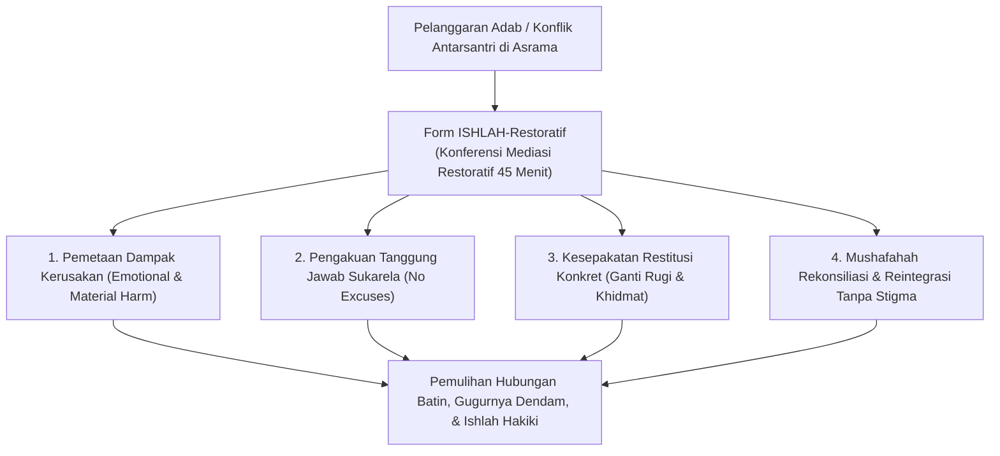
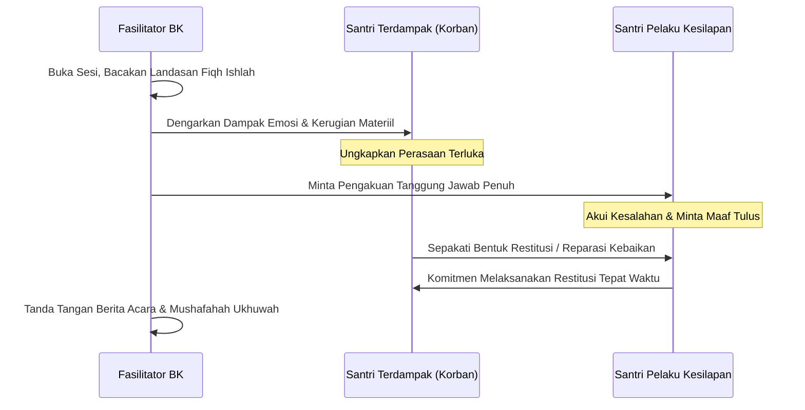
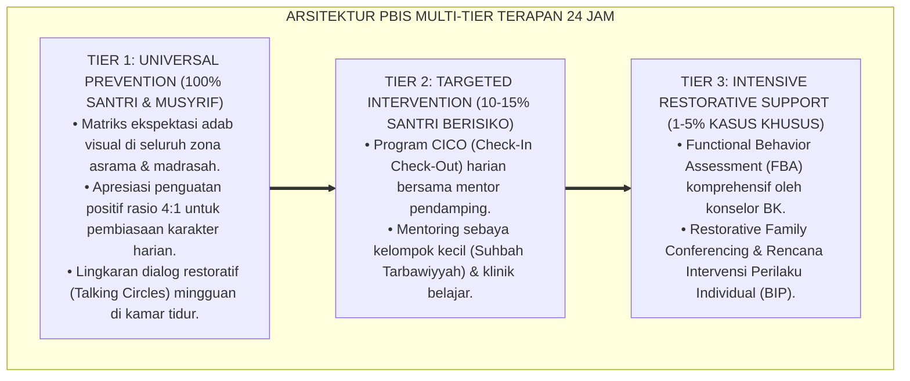

# P11-06-02: Form Kesepakatan Restoratif dan Ishlah al-Bain (Form ISHLAH-Restoratif)

## Status Dokumen
* **Status**: 🌟 **A+ (Tervalidasi & Siap Diimplementasikan)**
* **Sub-Domain**: `11 Tools / 06 Documentation Tools`
* **Penanggung Jawab Keilmuan**: Dewan Keilmuan TUMBUH (*Pakar Kuratif Restoratif, Pakar Bimbingan Konseling, & Pakar Disiplin Positif*)
* **Bentuk Instrumen**: Form ISHLAH-Restoratif (Berita Acara Mediasi Restoratif, Rencana Aksi Restitusi / Reparasi Kerusakan, & Pakta Rekonsiliasi Ukhuwah)

---

# BAGIAN I: LANDASAN TEORETIS & INKUIRI KEILMUAN MULTIDISIPLINER

## 1.1 Konteks Masalah: Kegagalan Sistem Retributif dalam Menyembuhkan Luka Konflik
Ketika terjadi perselisihan antarsantri (seperti perkelahian fisik, pencurian barang, atau pencemaran nama baik di kamar), mekanisme disiplin konvensional pesantren kerap kali hanya menerapkan **paradigma retributif murni (*punitive-retributive justice*)**. Penegak disiplin memfokuskan seluruh energi pada vonis kesalahan dan penjatuhan hukuman fisik/skorsing kepada pelaku (*punishing the offender*).

Sistem ini gagal menyelesaikan akar masalah: korban (*victim*) tetap merasa terluka, takut, dan diabaikan hak pemulihannya; sementara pelaku (*offender*) merasa dipermalukan, mendendam, dan tidak belajar bertanggung jawab atas dampak tindakannya terhadap orang lain.

TUMBUH menginstitusionalkan **Form Kesepakatan Restoratif dan Ishlah al-Bain (Form ISHLAH-Restoratif)**. Instrumen hukum restoratif ini mengalihkan fokus dari sekadar *"hukum apa yang dilanggar dan apa sanksinya"* menjadi **"siapa yang tersakiti, kebutuhan apa yang belum terpenuhi, dan bagaimana kewajiban pelaku untuk memulihkan keadaan (*repairing the harm*)"** melalui musyawarah perdamaian yang bermartabat.



## 1.2 Inkuiri Epistemologi Turats: Doktrin Ishlah Dzat al-Bain dan Pengembalian Hak Mazhalim
Dalam syariat Islam, mendamaikan perselisihan antarsesama muslim (*Ishlah Dzat al-Bain*) memiliki kedudukan yang lebih utama daripada ibadah-ibadah sunnah nawafil. Rasulullah SAW bersabda dalam hadits agung:

> أَلَا أُخْبِرُكُمْ بِأَفْضَلَ مِنْ دَرَجَةِ الصِّيَامِ وَالصَّلَاةِ وَالصَّدَقَةِ؟ قَالُوا: بَلَى. قَالَ: إِصْلَاحُ ذَاتِ الْبَيْنِ، فَإِنَّ فَسَادَ ذَاتِ الْبَيْنِ هِيَ الْحَالِقَةُ، لَا أَقُولُ تَحْلِقُ الشَّعَرَ وَلَكِنْ تَحْلِقُ الدِّينَ
> 
> *"'Maukah kalian aku kabarkan tentang suatu amalan yang derajatnya lebih utama daripada derajat puasa, shalat, dan sedekah (sunnah)?' Para sahabat menjawab: 'Tentu, wahai Rasulullah.' Beliau bersabda: 'Mendamaikan perselisihan antarsesama (Ishlah Dzat al-Bain), karena sesungguhnya rusaknya hubungan antarsesama adalah pemangkas; aku tidak mengatakan memangkas rambut, melainkan memangkas agama!'"* [^1]

Imam Ibnu Qayyim al-Jauziyyah dalam *I'lam al-Muwaqqi'in* menegaskan bahwa penyelesaian perkara melalui jalur perdamaian sukarela (*Ash-Shulh*) jauh lebih dicintai Allah daripada putusan hakim yang memaksakan kehendak, karena putusan sepihak menyisakan bara kedengkian di dalam dada, sedangkan perdamaian melahirkan kerelaan batin (*ar-ridha*) [^2]. 

Syariat juga mewajibkan *Radd al-Mazhalim* (mengembalikan hak yang dizhalimi kepada pemiliknya secara sempurna) sebagai syarat sah taubat nasuha [^3]. Form ISHLAH-Restoratif menyatukan pilar *Ash-Shulh* dan *Radd al-Mazhalim* ke dalam format formal institusional.

## 1.3 Inkuiri Sains Keadilan Restoratif: Repair of Harm dan Reintegrative Shaming
Dalam sains psikologi hukum dan kriminologi restoratif kontemporer (*Restorative Justice in Education* oleh Howard Zehr, 2002), esensi keadilan restoratif adalah dialog inklusif antara pelaku, korban, dan komunitas untuk merumuskan **3R: Responsibility (Tanggung Jawab), Reparation (Perbaikan/Restitusi), dan Reconciliation (Rekonsiliasi)** [^4].

John Braithwaite (1989) dalam *Reintegrative Shaming Theory* membuktikan bahwa mempermalukan pelaku di depan umum (*stigmatizing shaming*) justru meningkatkan angka residivisme kenakalan remaja. Sebaliknya, proses restoratif yang mengutuk perbuatannya namun tetap merangkul martabat manusianya (*reintegrative shaming*) memicu penyesalan moral internal (*moral remorse*) dan mempercepat integrasi kembali pelaku ke dalam komunitas tanpa dendam [^5].

---

# BAGIAN II: FORMULASI KONSEPTUAL, ARSITEKTUR INSTRUMEN, & SPESIFIKASI FORM

## 2.1 Alur 4 Tahap Pelaksanaan Konferensi Mediasi Restoratif
Sesi konferensi restoratif difasilitasi oleh Guru BK / Musyrif Senior di Ruang Mediasi Khusus yang tenang, mematuhi 4 tahapan:

1. **Tahap 1: Pembukaan & Penjelasan Asas Kesetaraan (5 Menit)**: Fasilitator membuka sesi dengan ta'awwudz, menegaskan bahwa tujuan pertemuan bukan menghukum melainkan mencari solusi pemulihan bersama (*collaborative healing*).
2. **Tahap 2: Pengungkapan Cerita & Dampak Emosional (15 Menit)**: Korban diberi hak pertama menceritakan fakta dan perasaan tersakitinya. Pelaku menyimak tanpa menyela, kemudian mengakui fakta tindakannya tanpa mencari pembenaran (*zero rationalization*).
3. **Tahap 3: Perumusan Rencana Aksi Restitusi (15 Menit)**: Korban dan pelaku bersama fasilitator merumuskan bentuk ganti rugi nyata (misal: mengganti barang rusak, membantu membersihkan lemari korban selama 1 pekan, atau memberikan talaqqi qira'ah).
4. **Tahap 4: Penandatanganan Pakta & Mushafahah (10 Menit)**: Menandatangani Form ISHLAH-Restoratif, saling memaafkan dengan berjabat tangan (*mushafahah*), dan mendoakan kebaikan bersama.



## 2.2 Format Instrumen Form ISHLAH-Restoratif (Berita Acara Mediasi Siap Pakai)

```markdown
================================================================================
     BERITA ACARA MEDIASI RESTORATIF & ISHLAH AL-BAIN (FORM ISHLAH-RESTORATIF)
                 Lembaga Bimbingan Konseling & PBIS TUMBUH
================================================================================
Nomor Registrasi : ISH-2026-[_______]       Hari / Tanggal : [___-___-2026]
Tempat Sesi      : Ruang Mediasi BK         Durasi Sesi    : [45 Menit]
Fasilitator BK   : [____________________]   Musyrif Kamar  : [___________]
--------------------------------------------------------------------------------

[BAGIAN 1: IDENTIFIKASI PARA PIHAK]
* Pihak 1 (Santri Terlibat / Pelaku)  : [____________________]  Kelas/Kmr: [_____]
* Pihak 2 (Santri Terdampak / Korban) : [____________________]  Kelas/Kmr: [_____]

[BAGIAN 2: DESKRIPSI DAMPAK KESILAPAN ADAB (THE HARM)]
Bentuk Kesilapan: Pengambilan makanan ringan tanpa izin & berkata kasar saat ditegur.
Dampak yang Dialami Korban: Merasa sedih, kehilangan hak, dan merasa tidak aman di kamar.

[BAGIAN 3: PENGAKUAN TANGGUNG JAWAB & PERMOHONAN MAAF]
"Saya (Pihak 1) mengakui secara sadar bahwa tindakan saya salah, melanggar adab syariat,
dan menyakiti hati kawan saya. Saya memohon maaf dengan tulus lillahi ta'ala."
Pernyataan Pihak 2: "Saya memaafkan Pihak 1 dengan tulus dan tidak menyimpan dendam."

[BAGIAN 4: RENCANA AKSI RESTITUSI / REPARASI KEBAIKAN (ACTION PLAN)]
Pihak 1 berkomitmen menunaikan aksi pemulihan konkret berikut:
1. Mengganti makanan ringan yang diambil dalam tempo 2 hari (Maksimal: [___-___-2026]).
2. Membantu Pihak 2 merapikan area jemuran bersama selama 3 hari berturut-turut.
3. Menjaga lisan dan senantiasa bersikap santun kepada Pihak 2 di hadapan teman sekamar.

[BAGIAN 5: JAMINAN REINTEGRASI & PERLINDUNGAN TANPA STIGMA]
Lembaga dan seluruh saksi menjamin bahwa setelah kesepakatan ini ditandatangani dan 
restitusi tuntas, status Pihak 1 bersih penuh dari stigma dan catatan pelanggaran ditutup.

--------------------------------------------------------------------------------
Pihak 1 (Pelaku Kesilapan)    Pihak 2 (Pihak Terdampak)    Fasilitator BK Resmi


(________________________)    (________________________)   (_____________________)
================================================================================
```

## 2.3 Rubrik Pemantauan Ketuntasan Ishlah (Monitoring 14 Hari)
Musyrif kamar memantau hubungan kedua santri selama 14 hari pasca-penandatanganan untuk memastikan perdamaian berjalan hakiki:

| Aspek Monitoring | Indikator Berhasil (Ishlah Paripurna) | Indikator Perlu Penguatan | Indikator Pelanggaran Komitmen |
| :--- | :--- | :--- | :--- |
| **Penyelesaian Restitusi** | Aksi pemulihan selesai $100\%$ tepat waktu dengan ikhlas. | Restitusi selesai namun terlambat 1–2 hari karena lupa. | Pelaku mengabaikan restitusi atau menolak menunaikannya. |
| **Interaksi Sosial Kamar** | Saling menyapa dengan senyuman, shalat berdampingan, dan bercanda wajar. | Bersikap netral, tidak bermusuhan namun masih sedikit canggung. | Masih saling menyindir, mendiamkan, atau membentuk kubu perlawanan. |
| **Ketulusan Korban** | Korban merasa aman, damai, dan tidak pernah mengungkit masalah lama. | Korban merasa lega walau sesekali masih sedikit cemas. | Korban kembali mengadu karena diancam oleh pelaku di luar ruang BK. |

---

---

### Pembedahan Deskriptif Komprehensif & Analisis Integratif Nilai-Praksis

Penerapan dan operasionalisasi **P11-06-02: Form Kesepakatan Restoratif dan Ishlah al-Bain (Form ISHLAH-Restoratif)** di lingkungan pesantren berbasis sistem TUMBUH bertumpu pada kesatuan sistemik antara nilai syariat dan praksis terukur:

#### A. Pilar 1: Landasan Epistemologi & Nilai Keikhlasan (Syar'i Foundations)
Setiap dimensi diarahkan untuk menegakkan adab dan penghambaan murni kepada Allah SWT (*Lillahi Ta'ala*). Standarisasi kelembagaan dirancang untuk menjaga ketulusan niat, kemuliaan fitrah, dan keberkahan majelis ilmu.

#### B. Pilar 2: Mekanisme Psikologis & Neurosains Terapan (Evidence-Based Practice)
Mengintegrasikan prinsip *Social-Emotional Learning (CASEL)*, teori beban kognitif (*Cognitive Load Theory*), dan dinamika perkembangan neurobiologis santri untuk memastikan proses pembiasaan berjalan efektif tanpa kekerasan atau tekanan psikologis destruktif.

#### C. Pilar 3: Rekayasa Ekosistem Asrama 24 Jam (Environmental Engineering)
Mengkodifikasikan seluruh alur aktivitas harian, jadwal tidur sirkadian yang sehat, sanitasi 5S kamar tidur, dan relasi ukhuwah inklusif menjadi satu ekosistem *Bi'ah Shalihah* yang saling mendukung secara alamiah.

#### D. Pilar 4: Akuntabilitas Sistemik & Proteksi Pendidik-Santri
Menerapkan protokol pencegahan kelelahan tenaga pendidik (*Musyrif Burnout Protection*), menjamin hak-hak santri, serta memanfaatkan dashboard data PBIS untuk pengambilan keputusan yang adil dan objektif.

---

### Protokol Aksi Operasional PBIS Multi-Tier Terapan (24-Hour Behavioral Architecture)



---

# BAGIAN III: TABEL SINTESIS, DAFTAR PUSTAKA, CATATAN KAKI, & GLOSARIUM

## 3.1 Tabel Sintesis Integrasi Form ISHLAH-Restoratif

| Komponen Form ISHLAH-Restoratif | Landasan Turats & Fiqh | Landasan Sains Keadilan Restoratif | Target Transformasi Adab |
| :--- | :--- | :--- | :--- |
| **Mediasi Perjumpaan** | Doktrin *Ash-Shulh* & Hadits Keutamaan Ishlah (HR. Tirmidzi). | *Restorative Conferencing* & Empati Afektif. | Mengikis ego, kesombongan, dan meluruhkan dendam batin. |
| **Aksi Restitusi Konkret** | Fiqh *Radd al-Mazhalim* & ganti rugi adil. | *Reparation of Harm* (Gossen & Zehr). | Mengajarkan pertanggungjawaban nyata atas perbuatan. |
| **Reintegrasi Tanpa Stigma** | Konsep *At-Taubah an-Nasuha* (Gugurnya dosa). | *Reintegrative Shaming* (Braithwaite). | Memulihkan kehormatan santri dan mencegah residivisme. |

## 3.2 Catatan Kaki (Footnotes 1-to-1)
[^1]: Diriwayatkan oleh Imam At-Tirmidzi dalam *Sunan at-Tirmidzi*, kitab *Shifat al-Qiyamah*, hadits no. 2509; Imam Abu Dawud dalam *Sunan Abi Dawud*, no. 4919 (Hadits Shahih).
[^2]: Ibnu Qayyim al-Jauziyyah. (2002). *I'lam al-Muwaqqi'in 'an Rabbil 'Alamin*. Ditahqiq oleh Masyhur Hasan Salman. Riyadh: Dar Ibn al-Jauzi, juz 2, hlm. 145–158.
[^3]: An-Nawawi, Yahya bin Syaraf. (1994). *Riyadhus Shalihin: Bab at-Taubah wa Radd al-Mazhalim*. Kairo: Dar al-Hadits, hlm. 28–35.
[^4]: Zehr, H. (2002). *The Little Book of Restorative Justice*. Intercourse, PA: Good Books.
[^5]: Braithwaite, J. (1989). *Crime, Shame and Reintegration*. Cambridge: Cambridge University Press.
[^6]: Gossen, D. C. (1996). *Restitution: Restructuring School Discipline*. Chapel Hill, NC: New View Publications.
[^7]: Al-Kasani, 'Ala'uddin. (2003). *Bada'i' ash-Sana'i' fi Tartib asy-Syara'i': Kitab ash-Shulh*. Beirut: Dar al-Kutub al-'Ilmiyyah, juz 6, hlm. 38–48.
[^8]: Morrison, B. (2007). *Restoring Safe School Communities: A Whole School Approach to Bullying, Violence and Alienation*. Sydney: Federation Press.
[^9]: Ibnu Hazm Al-Andalusi. (1983). *Al-Muhalla bil Atsar: Kitab ash-Shulh*. Kairo: Dar at-Turats, juz 8, hlm. 112–120.
[^10]: Wachtel, T. (2016). *Defining Restorative*. Bethlehem, PA: International Institute for Restorative Practices (IIRP).
[^11]: Al-Qurthubi, Abu Abdillah. (2006). *Al-Jami' li Ahkam al-Qur'an: Tafsir Surah Al-Hujurat*. Kairo: Dar al-Kutub al-Mishriyyah, juz 16, hlm. 315–326.
[^12]: Hopkins, B. (2004). *Just Schools: A Whole School Approach to Restorative Justice*. London: Jessica Kingsley Publishers.

## 3.3 Daftar Pustaka (APA 7th Edition & Turats Klasik)
* Al-Kasani, 'A. (2003). *Bada'i' ash-Sana'i'* (Vol. 6). Beirut: Dar al-Kutub al-'Ilmiyyah.
* Al-Qurthubi, A. A. (2006). *Al-Jami' li Ahkam al-Qur'an* (Vol. 16). Kairo: Dar al-Kutub al-Mishriyyah.
* An-Nawawi, Y. S. (1994). *Riyadhus Shalihin*. Kairo: Dar al-Hadits.
* Braithwaite, J. (1989). *Crime, Shame and Reintegration*. Cambridge: Cambridge University Press.
* Gossen, D. C. (1996). *Restitution: Restructuring School Discipline*. Chapel Hill, NC: New View Publications.
* Hopkins, B. (2004). *Just Schools: A Whole School Approach to Restorative Justice*. London: Jessica Kingsley Publishers.
* Ibnu Hazm Al-Andalusi. (1983). *Al-Muhalla bil Atsar* (Vol. 8). Kairo: Dar at-Turats.
* Ibnu Qayyim al-Jauziyyah. (2002). *I'lam al-Muwaqqi'in* (Vol. 2). Riyadh: Dar Ibn al-Jauzi.
* Morrison, B. (2007). *Restoring Safe School Communities*. Sydney: Federation Press.
* Wachtel, T. (2016). *Defining Restorative*. Bethlehem, PA: IIRP.
* Zehr, H. (2002). *The Little Book of Restorative Justice*. Intercourse, PA: Good Books.

## 3.4 Glosarium Istilah
1. **Form ISHLAH-Restoratif**: Instrumen berita acara formal proses mediasi perdamaian restoratif dan komitmen pemulihan antarsantri yang berselisih.
2. **Ishlah al-Bain**: Upaya mendamaikan dua pihak yang berselisih demi memulihkan keharmonisan ukhuwah islamiyyah.
3. **Restorative Justice**: Paradigma keadilan yang berorientasi pada pemulihan kerugian korban dan pertanggungjawaban mendidik bagi pelaku.
4. **Restitution (Restorasi/Reparasi)**: Tindakan konkret yang dilakukan pelaku untuk memperbaiki kerusakan materiil maupun emosional yang ditimbulkan.
5. **Radd al-Mazhalim**: Kewajiban syariat untuk mengembalikan hak-hak orang yang dizhalimi sebelum memohon ampunan kepada Allah SWT.
6. **Reintegrative Shaming**: Pendekatan moral yang mengecam kesalahan tindakan namun tetap menghormati dan merangkul pelaku kembali ke komunitas.
7. **Mushafahah**: Ritual berjabat tangan penuh keikhlasan yang menggugurkan dosa antardua orang muslim yang saling memaafkan.
8. **Restorative Conference**: Pertemuan mediasi terstruktur yang difasilitasi penengah netral untuk mendiskusikan resolusi konflik secara damai.
9. **Zero Rationalization**: Sikap mental menolak membuat alasan pembelaan diri atas kesilapan adab yang telah nyata merugikan orang lain.
10. **Sanctuary of Peace**: Status perlindungan bagi santri yang telah menuntaskan kesepakatan ishlah agar tidak lagi diungkit atau dilabeli masa lalunya.
