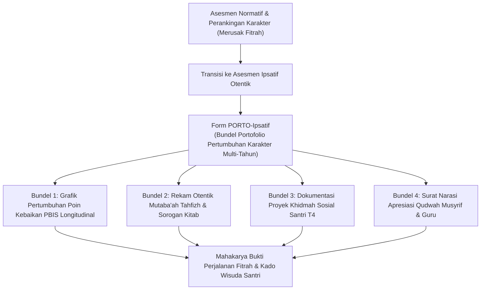
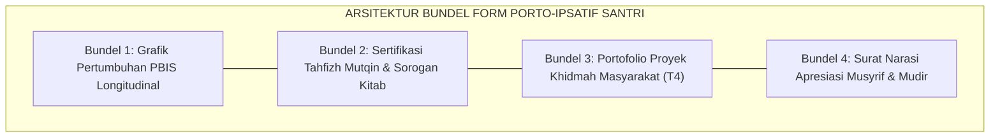

# P11-06-03: Dokumen Portofolio Karakter Ipsatif Santri (Form PORTO-Ipsatif)

## Status Dokumen
* **Status**: 🌟 **A+ (Tervalidasi & Siap Diimplementasikan)**
* **Sub-Domain**: `11 Tools / 06 Documentation Tools`
* **Penanggung Jawab Keilmuan**: Dewan Keilmuan TUMBUH (*Pakar Metodologi Riset TUMBUH, Pakar Desain Kurikulum Adab, & Pakar Psikometri*)
* **Bentuk Instrumen**: Form PORTO-Ipsatif (Bundel Portofolio Pertumbuhan Longitudinal, Rekam Jejak Otentik Adab & Tahfizh, & Buku Kenang-Kenangan Kelulusan Santri)

---

# BAGIAN I: LANDASAN TEORETIS & INKUIRI KEILMUAN MULTIDISIPLINER

## 1.1 Konteks Masalah: Jebakan Asesmen Normatif dan Perankingan Karakter
Praktik evaluasi karakter santri di institusi pendidikan Islam kerap terjebak dalam paradigma **asesmen normatif-komparatif (*norm-referenced assessment*)**. Karakter santri dinilai dengan angka kuantitatif kaku (misal: Nilai Akhlak: 85 atau predikat A/B/C) dan diperbandingkan dengan santri lain dalam sistem perankingan kelas (*class ranking*).

Pola evaluasi komparatif ini merusak psikologis santri: santri yang lambat berkembang merasa divonis sebagai *"produk gagal"* (*inferiority complex*), sedangkan santri yang cepat merasa jumawa (*arrogance*). Terlebih lagi, angka rapor konvensional tidak mampu merekam dinamika perjuangan batin, jatuh-bangun pembiasaan adab, dan proyek khidmah nyata santri.

TUMBUH mengadopsi **Dokumen Portofolio Karakter Ipsatif (Form PORTO-Ipsatif)**. Asesmen ipsatif mengukur kemajuan santri bukan dengan membandingkannya terhadap kawan sebayanya, melainkan **membandingkan performa santri hari ini dengan rekam jejak dirinya di masa lalu (*self-referenced growth trajectory*)**, menyajikan bukti otentik perkembangan fitrah santri selama menempuh pendidikan di pesantren.



## 1.2 Inkuiri Epistemologi Turats: Doktrin Hisab Diri Berkelanjutan dan Kitabun Marqum
Islam meletakkan tolok ukur kesuksesan seorang hamba pada peningkatan kualitas amalnya dari hari ke hari, bukan pada perbandingan status sosial dengan orang lain. Sebagaimana atsar masyhur yang diriwayatkan dari para salaf:

> مَنْ كَانَ يَوْمُهُ خَيْرًا مِنْ أَمْسِهِ فَهُوَ رَابِحٌ، وَمَنْ كَانَ يَوْمُهُ مِثْلَ أَمْسِهِ فَهُوَ مَغْبُونٌ، وَمَنْ كَانَ يَوْمُهُ شَرًّا مِنْ أَمْسِهِ فَهُوَ مَلْعُونٌ
> 
> *"Barangsiapa yang hari ini lebih baik dari hari kemarin, maka ia adalah orang yang beruntung; barangsiapa yang hari ini sama dengan hari kemarin, maka ia adalah orang yang merugi; dan barangsiapa yang hari ini lebih buruk dari hari kemarin, maka ia adalah orang yang celaka/terkutuk."* [^1]

Al-Qur'an menggambarkan bahwa di akhirat kelak setiap manusia akan menerima buku catatan amalnya yang tercatat secara detail dan adil (*Kitābun Marqūm* — QS. Al-Muthaffifin: 9). Imam Al-Ghazali dalam *Ihya' 'Ulum al-Din* menjelaskan bahwa seorang penuntut ilmu wajib memiliki lembaran catatan amal (*Daftar al-A'mal*) untuk menghitung kemajuan ibadahnya secara bertahap (*at-tadarruj fil maqamat*) [^2]. Form PORTO-Ipsatif menerjemahkan tradisi hisab diri longitudinal ini ke dalam portofolio pembinaan modern.

## 1.3 Inkuiri Sains Asesmen Pendidikan: Ipsative Assessment dan Growth Mindset
Dalam sains evaluasi pendidikan kontemporer, Gwyneth Hughes (2014) membuktikan bahwa **Ipsative Assessment** (penilaian berbasis kemajuan diri) secara signifikan melipatgandakan motivasi belajar intrinsik dan ketahanan mental pembelajar (*academic resilience*) [^3].

Diselaraskan dengan teori *Growth Mindset* Carol Dweck (2006), portofolio ipsatif membiasakan santri memaknai kegagalan dan kesilapan masa lalu sebagai anak tangga pembelajaran, bukan vonis mati karakter [^4]. Grant Wiggins (1998) dalam *Authentic Assessment* menegaskan bahwa portofolio komprehensif yang memuat artefak nyata (rekaman hafalan, tulisan refleksi, foto proyek sosial) memiliki validitas ekologis (*ecological validity*) yang jauh lebih tinggi daripada tes pilihan ganda atau skor numerik rapor [^5].

---

# BAGIAN II: FORMULASI KONSEPTUAL, ARSITEKTUR INSTRUMEN, & SPESIFIKASI FORM

## 2.1 Struktur 4 Bundel Berkas Form PORTO-Ipsatif
Portofolio Karakter Ipsatif dikompilasi secara longitudinal selama 3 s/d 6 tahun masa belajar santri, mencakup 4 bundel dokumen utama:

1. **Bundel 1: Laporan Analitik Pertumbuhan PBIS (*Longitudinal Behavior Growth*)**: Grafik visual tren perolehan poin kebaikan, catatan graduasi CICO (jika pernah mengikuti), dan rekapitulasi kehadiran halaqah shalat berjamaah.
2. **Bundel 2: Rekam Otentik Capaian Turats & Qur'an (*Turats & Tahfizh Mastery*)**: Lembar mutaba'ah mutqin Al-Qur'an 30 Juz, sanad bacaan tajwid, dan sertifikat khatam kitab kuning (sorogan/bandongan).
3. **Bundel 3: Dokumentasi Karya Khidmah & Kepemimpinan (*Servant Leadership Artifacts*)**: Laporan proyek bakti sosial santri T4 (seperti pengajaran TPA desa binaan, riset lingkungan hidup pesantren, atau kepanitiaan bakti santri).
4. **Bundel 4: Surat Narasi Keteladanan Qudwah (*Narrative Testimonial Letters*)**: Surat apresiasi deskriptif yang ditulis secara personal dan menyentuh hati oleh Musyrif Kamar, Wali Kelas, dan Mudir Pesantren.



## 2.2 Format Tata Letak Dokumen Portofolio (Hardcover Eksklusif & E-Portfolio)

```markdown
================================================================================
           DOKUMEN PORTOFOLIO KARAKTER IPSATIF SANTRI (FORM PORTO-IPSATIF)
                 Pesantren Ekosistem TUMBUH — Edisi Kelulusan
================================================================================
Nama Lengkap Santri : [________________________________________]
Nomor Induk Santri  : [____________________]   Tahun Masuk/Lulus: [2020 / 2026]
Jenjang Pendidikan  : [ ] MTs / Wustha         [ ] MA / Ulya
Kamar / Asrama Akhir: [____________________]   Musyrif Pembina  : [___________]
--------------------------------------------------------------------------------

[HALAMAN 1: KURVA PERTUMBUHAN IPSATIF SANTRI (6 SEMESTER TERAKHIR)]
Grafik Poin Kebaikan PBIS:
Sem 1: [=======             ] 52 Poin (Fase Adaptasi Awal)
Sem 2: [==========          ] 68 Poin (Peningkatan Regulasi Diri)
Sem 3: [==============      ] 84 Poin (Aktif dalam Halaqah)
Sem 4: [=================   ] 92 Poin (Menjadi Teladan Kamar)
Sem 5: [====================] 105 Poin (Kakak Asuh Peer Buddy T4)
Sem 6: [====================] 110 Poin (Insan Penggerak Mandiri)
Kesimpulan Analitik : Pertumbuhan Karakter Positif Konsisten (+111.5% Kemajuan).

[HALAMAN 2: BUKTI OTENTIK HAFALAN AL-QUR'AN & TURATS]
* Total Hafalan Mutqin  : [ 30 ] Juz (Lulus Ujian Tasmi' Sekali Duduk).
* Kitab Turats Terkhatam: 1. Matan Al-Ajurrumiyyah (Nahwu) -> Nilai Mumtaz
                          2. Matan Taqrib (Fiqh Syafi'i)  -> Nilai Mumtaz
                          3. Riyadhus Shalihin (Hadits)   -> Nilai Mumtaz

[HALAMAN 3: PROYEK KHIDMAH SOSIAL & KEPEMIMPINAN T4]
* Judul Proyek Khidmah : "Pemberdayaan Literasi & Sanitasi Santri Cilik Desa Sukamaju"
* Peran Santri         : Koordinator Tim Pengajar & Fasilitator Lingkungan.
* Dampak Sosial        : Melatih 45 anak desa mampu membaca Al-Qur'an metode Tilawati.

[HALAMAN 4: SURAT NARASI REFLEKSI QUDWAH OLEH MUSYRIF ASRAMA]
"Ananda [Nama Santri] datang ke asrama ini 6 tahun lalu sebagai anak pemalu yang kerap 
menangis merindukan rumah. Hari ini, kami melepasnya sebagai seorang pemuda yang kokoh 
keimanannya, fasih lisannya dengan Al-Qur'an, dan memiliki hati yang senantiasa tergerak 
untuk melayani sesama penuntut ilmu. Sungguh ananda adalah penyejuk mata (Qurrata A'yun)."

Disahkan Pada Wisuda Kelulusan:
Mudir Pesantren TUMBUH                         Kepala Pengasuhan & Musyrif


(______________________________)               (______________________________)
================================================================================
```

## 2.3 Rubrik Validasi Kelayakan Portofolio Kelulusan Santri
Tim Kurikulum Adab memverifikasi kelengkapan portofolio sebelum wisuda santri dengan kriteria mutu berikut:

| Kriteria Validasi | Standar Minimum (Lulus Standar) | Standar Unggul (Cum Laude Adabi) |
| :--- | :--- | :--- |
| **Kelengkapan Artefak** | Memuat minimal $80\%$ berkas rekam jejak dari seluruh semester. | Memuat $100\%$ berkas lengkap disertai rekaman video tasmi' & karya tulis. |
| **Pertumbuhan Ipsatif** | Menunjukkan tren kemajuan adab positif tanpa pelanggaran berat di T4. | Menunjukkan lompatan karakter luar biasa dan aktif menjadi mentor *Peer Buddy*. |
| **Proyek Khidmah** | Berpartisipasi aktif dalam proyek sosial kelompok angkatan. | Memimpin gagasan proyek sosial independen yang berdampak luas bagi umat. |

---

# BAGIAN III: TABEL SINTESIS, DAFTAR PUSTAKA, CATATAN KAKI, & GLOSARIUM

## 3.1 Tabel Sintesis Integrasi Form PORTO-Ipsatif

| Komponen Form PORTO-Ipsatif | Landasan Turats & Salaf | Landasan Sains Asesmen & Psikologi | Target Transformasi Wisudawan |
| :--- | :--- | :--- | :--- |
| **Kurva Pertumbuhan Ipsatif** | Atsar *Man kana yawmuhu khairan* & *at-tadarruj*. | *Ipsative Assessment* (Hughes) & *Growth Mindset*. | Santri memiliki kebanggaan atas progres diri tanpa kesombongan. |
| **Sertifikasi Otentik** | Tradisi Sanad & Ijazah Kitab Ulama Klasik. | *Authentic Assessment* (Wiggins) & Portfolio Theory. | Menjamin mutu keilmuan dan hafalan yang mutqin terverifikasi. |
| **Dokumentasi Khidmah** | Fiqh *Naf'ul 'Ibad* (Sebaik-baik manusia yang bermanfaat). | *Service-Learning* & *Prosocial Leadership*. | Membentuk profil lulusan yang berjiwa pelayan masyarakat. |

## 3.2 Catatan Kaki (Footnotes 1-to-1)
[^1]: Diriwayatkan secara makna dalam berbagai kitab tasawuf dan tarbiyah, antara lain oleh Imam Al-Ghazali dalam *Ihya' 'Ulum al-Din*, juz 4, hlm. 380; Al-Mawardi dalam *Adab ad-Dunya wa ad-Din*, hlm. 125.
[^2]: Al-Ghazali, Abu Hamid. (1998). *Ihya' 'Ulum al-Din: Kitab al-Muraqabah wa al-Muhasabah*. Beirut: Dar al-Kutub al-'Ilmiyyah, juz 4, hlm. 390–402.
[^3]: Hughes, G. (2014). *Ipsative Assessment: Motivation through Marking Progress*. London: Palgrave Macmillan.
[^4]: Dweck, C. S. (2006). *Mindset: The New Psychology of Success*. New York: Random House.
[^5]: Wiggins, G. (1998). *Educative Assessment: Designing Assessments to Inform and Improve Student Performance*. San Francisco: Jossey-Bass.
[^6]: Arter, J. A., & Spandel, V. (1992). Using portfolios of student work in instruction and assessment. *Educational Measurement: Issues and Practice*, 11(1), 36–44.
[^7]: Ibnu Jama'ah, Badruddin. (2012). *Tadzkirat as-Sami' wa al-Mutakallim*. Beirut: Dar al-Basyair al-Islamiyyah, hlm. 110–120.
[^8]: Black, P., & Wiliam, D. (1998). Assessment and classroom learning. *Assessment in Education: Principles, Policy & Practice*, 5(1), 7–74.
[^9]: An-Nawawi, Yahya bin Syaraf. (2002). *At-Tibyan fi Adab Hamalat al-Qur'an*. Beirut: Dar Ibn Hazm, hlm. 85–92.
[^10]: Bandura, A. (1997). *Self-Efficacy: The Exercise of Control*. New York: W. H. Freeman.
[^11]: Al-Qabisi, Ali bin Muhammad. (1986). *Ar-Risalah al-Mufashshalah li Ahwal al-Muta'allimin wa Ahkam al-Mu'allimin*. Ditahqiq oleh Ahmad Khalid Kabsy. Tunis: Syarikah Tunisiyyah, hlm. 65–74.
[^12]: Furman, G. (2012). Social justice leadership in education: Developing a transformative framework. *Educational Administration Quarterly*, 48(2), 191–229.

## 3.3 Daftar Pustaka (APA 7th Edition & Turats Klasik)
* Al-Ghazali, A. H. (1998). *Ihya' 'Ulum al-Din* (Vol. 4). Beirut: Dar al-Kutub al-'Ilmiyyah.
* Al-Mawardi, A. M. (1986). *Adab ad-Dunya wa ad-Din*. Beirut: Dar Iqra'.
* Al-Qabisi, A. M. (1986). *Ar-Risalah al-Mufashshalah*. Tunis: Syarikah Tunisiyyah.
* An-Nawawi, Y. S. (2002). *At-Tibyan fi Adab Hamalat al-Qur'an*. Beirut: Dar Ibn Hazm.
* Arter, J. A., & Spandel, V. (1992). Using portfolios of student work in instruction and assessment. *Educational Measurement: Issues and Practice*, 11(1), 36–44.
* Bandura, A. (1997). *Self-Efficacy: The Exercise of Control*. New York: W. H. Freeman.
* Black, P., & Wiliam, D. (1998). Assessment and classroom learning. *Assessment in Education: Principles, Policy & Practice*, 5(1), 7–74.
* Dweck, C. S. (2006). *Mindset: The New Psychology of Success*. New York: Random House.
* Hughes, G. (2014). *Ipsative Assessment: Motivation through Marking Progress*. London: Palgrave Macmillan.
* Ibnu Jama'ah, B. (2012). *Tadzkirat as-Sami' wa al-Mutakallim*. Beirut: Dar al-Basyair al-Islamiyyah.
* Wiggins, G. (1998). *Educative Assessment: Designing Assessments to Inform and Improve Student Performance*. San Francisco: Jossey-Bass.

## 3.4 Glosarium Istilah
1. **Form PORTO-Ipsatif**: Format bundel portofolio rekam jejak pertumbuhan adab, tahfizh, dan khidmah santri berbasis asesmen ipsatif.
2. **Ipsative Assessment**: Model penilaian yang membandingkan capaian terkini santri dengan performa dirinya di masa lampau untuk melihat laju pertumbuhan personal.
3. **Growth Mindset**: Keyakinan bahwa karakter, adab, dan kecerdasan dapat terus bertumbuh melalui ikhtiar, latihan, dan ketekunan.
4. **Authentic Assessment**: Evaluasi capaian belajar melalui unjuk kerja nyata dalam konteks dunia nyata, bukan sekadar tes tertulis hafalan.
5. **Kitabun Marqum**: Konsep buku catatan amal yang tercatat rapi dan menjadi saksi otentik perjalanan perbuatan manusia.
6. **Mutqin**: Derajat kualitas hafalan Al-Qur'an yang sangat kuat, lancar, dan melekat tanpa keraguan.
7. **Sorogan**: Metode pembelajaran turats klasik di mana santri membaca matan kitab kata-demi-kata di hadapan ustadz secara individual.
8. **Ecological Validity**: Derajat kesesuaian instrumen asesmen dengan kondisi lingkungan dan perilaku faktual santri sehari-hari.
9. **Qurrata A'yun**: Penyejuk mata hati dan kebanggaan spiritual bagi orang tua dan pendidik atas kesalehan generasi muda.
10. **Service-Learning**: Model pembelajaran yang memadukan capaian akademik/keilmuan dengan proyek pengabdian masyarakat secara bermakna.
