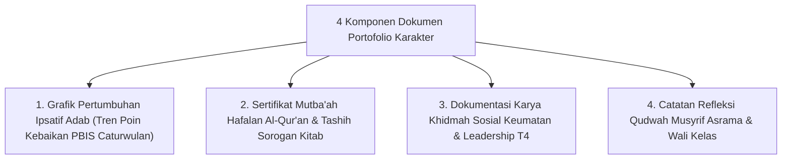

# P11-06-03: Dokumen Portofolio Karakter Ipsatif Santri

## Status Dokumen
* **Status**: 🌟 **A+ (Tervalidasi & Siap Diimplementasikan)**
* **Sub-Domain**: `11 Tools / 06 Documentation Tools`
* **Penanggung Jawab Keilmuan**: Dewan Keilmuan TUMBUH (*Pakar Metodologi Riset & Pakar Desain Kurikulum Adab*)

---

## 1. Operasionalisasi Dokumen Portofolio Karakter Ipsatif Santri

Portofolio Karakter merupakan bundel rekam jejak pertumbuhan adab, capaian hafalan Al-Qur'an, karya ilmiah, dan pengabdian khidmah santri selama menuntut ilmu di pesantren:

---

## 2. Kenang-kenangan Masa Pengasuhan

Portofolio diserahkan kepada Santri dan Orang Tua saat wisuda kelulusan sebagai bukti nyata perjalanan bertumbuhnya karakter fitrah santri.
