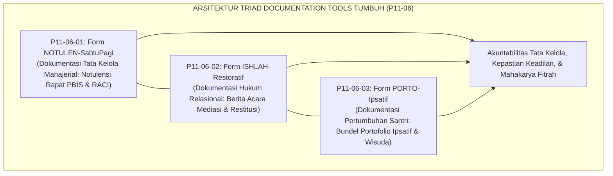
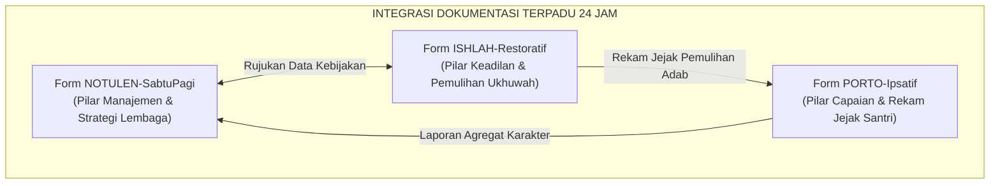
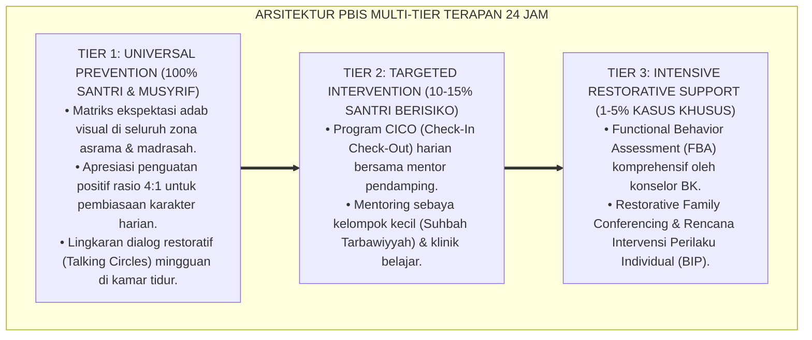

# P11-06: Instrumen Dokumentasi Lembaga (Sintesis Documentation Tools Ekosistem TUMBUH)

## Status Dokumen
* **Status**: 🌟 **A+ (Tervalidasi & Siap Diimplementasikan)**
* **Domain**: `11 Tools` > `06 Documentation Tools` (Master Induk Sub-Domain 06)
* **Penanggung Jawab Keilmuan**: Dewan Keilmuan TUMBUH (*Pakar Tata Kelola Qudwah, Pakar Kuratif Restoratif, Pakar Metodologi Riset TUMBUH, & Pakar Perlindungan Anak*)
* **Rumpun Instrumen**: Form NOTULEN-SabtuPagi, Form ISHLAH-Restoratif, dan Form PORTO-Ipsatif

---

# BAGIAN I: LANDASAN TEORETIS & INKUIRI KEILMUAN MULTIDISIPLINER

## 1.1 Konteks Masalah: Rekonstruksi Budaya Dokumentasi dan Akuntabilitas Kelembagaan
Kelemahan mendasar dalam manajemen operasional pesantren tradisional sering kali terletak pada minimnya tradisi **pencatatan dan dokumentasi formal (*institutional documentation amnesia*)**. Keputusan penting rapat pimpinan kerap hanya diingat secara lisan, penyelesaian konflik santri diselesaikan tanpa berita acara yang mengikat secara adil, dan rekam jejak pertumbuhan adab santri lenyap tanpa jejak tertulis yang sahih.

Ketiadaan standarisasi dokumentasi ini membuka celah sengketa hukum, inkonsistensi penegakan aturan, perlakuan diskriminatif, dan hilangnya modalitas pembelajaran institusional (*loss of institutional memory*).

Gugus **Documentation Tools (P11-06)** hadir untuk meletakkan fondasi tata kelola pesantren yang profesional, akuntabel, dan berkeadilan. Melalui sinergi tiga instrumen dokumentasi—notulensi evaluasi mingguan berbasis data PBIS (Level Lembaga), berita acara mediasi ishlah restoratif (Level Relasi Interpersonal), dan portofolio karakter ipsatif longitudinal (Level Pertumbuhan Santri)—TUMBUH mengabadikan setiap proses tarbiyah menjadi jejak kebaikan yang terverifikasi dan berkekuatan hukum syar'i maupun positif.

## 1.2 Inkuiri Epistemologi Turats: Doktrin Tadwin, Kitabatul 'Uqud, dan Hifzhul Huquq
Peradaban Islam adalah peradaban literasi dan dokumentasi (*Hadharah at-Tadwin*). Allah SWT menurunkan ayat terpanjang dalam Al-Qur'an secara khusus memerintahkan pencatatan transaksi dan kesepakatan secara tertulis demi menjaga keadilan: *"Wahai orang-orang yang beriman, apabila kalian bermu'amalah tidak secara tunai untuk waktu yang ditentukan, hendaklah kalian menuliskannya"* (*Yā Ayyuhalladzīna Āmanū Idzā Tadāyantum bi Dainin ilā Ajalin Musamman Faktubūh* — QS. Al-Baqarah: 282).

Imam Al-Qasthalani dalam *Irsyad as-Sari* menegaskan bahwa pembukuan keputusan (*Kitabat as-Sijillat*) dan perjanjian perdamaian (*Kitab ash-Shulh*) merupakan sunnah khulafaur rasyidin untuk mencegah kezaliman dan menghilangkan prasangka dusta [^1]. 

Ketiga instrumen dalam P11-06 menegakkan pilar *Hifzhul Huquq* (penjagaan hak-hak) ini: Form NOTULEN-SabtuPagi menjaga amanah manajerial; Form ISHLAH-Restoratif mengikat janji suci perdamaian antarsaudara seiman; dan Form PORTO-Ipsatif mendokumentasikan riwayat amal kebajikan santri secara jujur (*Shidq*).

## 1.3 Inkuiri Sains Tata Kelola & Teori Keadilan Organisasi: Institutional Memory and Procedural Justice
Secara teoritis, gugus P11-06 mengadopsi prinsip **Organizational Memory Systems** (Walsh & Ungson, 1991) dan **Procedural Justice Theory** (Lind & Tyler, 1988) [^2].

Dokumentasi yang terstruktur menjamin bahwa proses pengambilan keputusan di pesantren berjalan secara adil (*fair procedures*), transparan, dan dapat ditinjau ulang (*reviewable*). Ketika sebuah insiden atau kesepakatan didokumentasikan dalam format standar, santri merasa diperlakukan dengan penuh martabat (*voice and dignity*), wali santri merasa tenang karena adanya bukti faktual otentik, dan institusi terlindungi dari risiko tuntutan hukum eksternal (*legal risk mitigation*).

---

# BAGIAN II: FORMULASI KONSEPTUAL, MATRIKS INTEGRASI, & ARSIP PROTOKOL

## 2.1 Matriks Integrasi Tiga Instrumen Dokumentasi Lembaga

| Dimensi Parameter | Form NOTULEN-SabtuPagi (P11-06-01) | Form ISHLAH-Restoratif (P11-06-02) | Form PORTO-Ipsatif (P11-06-03) |
| :--- | :--- | :--- | :--- |
| **Level Sasaran** | **Level Makro / Organisasi**: Pimpinan & Seluruh Staf. | **Level Meso / Relasional**: Santri Berselisih & Korban. | **Level Mikro / Individual**: Santri & Wali Santri. |
| **Fungsi Utama** | Akuntabilitas keputusan rapat PBIS & pelacakan aksi RACI. | Berita acara hukum mediasi perdamaian & komitmen restitusi. | Bukti otentik longitudinal pertumbuhan adab & tahfizh. |
| **Penyimpanan Berkas** | Arsip Digital SIM Intizham & Buku Induk Notulensi Pesantren. | Berkas Rahasia Ruang Mediasi BK & Map Kasus Khusus. | Bundel Hardcover Wisuda & E-Portfolio Akun Pribadi. |
| **Kekuatan Dokumen** | Mandat operasional mingguan seluruh unit kerja pondok. | Perjanjian damai syar'i yang mengikat dan menghapus sanksi. | Kredensial karakter resmi pendamping Ijazah Kelulusan. |

## 2.2 Protokol Tata Kelola Berkas & Kerahasiaan Dokumen (*Document Governance Protocols*)
Seluruh instrumen dokumentasi dalam gugus P11-06 wajib mematuhi 3 standar tata kelola kearsipan:

1. **Prinsip Validitas Bertanda Tangan (*Signed Authenticity*)**: Setiap dokumen fisik wajib dibubuhi tanda tangan basah/digital oleh pihak-pihak terkait beserta saksi resmi (Pimpinan/Musyrif/Konselor) untuk menjamin keabsahan data.
2. **Standardisasi Akses & Hak Privasi (*Access Hierarchy & Data Privacy*)**: Berita Acara Ishlah disimpan dalam brankas/folder terproteksi dengan hak akses terbatas hanya untuk Mudir dan Konselor BK; sedangkan Portofolio Karakter merupakan hak milik santri dan keluarganya.
3. **Penyimpanan Ganda Hibrida (*Hybrid Dual-Storage*)**: Setiap lembar fisik dipindai (*scan*) beresolusi tinggi dan diunggah ke *secure cloud repository* SIM Intizham dengan enkripsi AES-256 guna mencegah kehilangan akibat bencana fisik.

---

---

### Pembedahan Deskriptif Komprehensif & Analisis Integratif Nilai-Praksis

Penerapan dan operasionalisasi **P11-06: Instrumen Dokumentasi Lembaga (Sintesis Documentation Tools Ekosistem TUMBUH)** di lingkungan pesantren TUMBUH bertumpu pada kesatuan sistemik antara nilai syariat dan praksis terukur:

#### A. Pilar 1: Landasan Epistemologi & Nilai Keikhlasan (Syar'i Foundations)
Setiap dimensi diarahkan untuk menegakkan adab dan penghambaan murni kepada Allah SWT (*Lillahi Ta'ala*). Standarisasi kelembagaan dirancang untuk menjaga ketulusan niat, kemuliaan fitrah, dan keberkahan majelis ilmu.

#### B. Pilar 2: Mekanisme Psikologis & Neurosains Terapan (Evidence-Based Practice)
Mengintegrasikan prinsip *Social-Emotional Learning (CASEL)*, teori beban kognitif (*Cognitive Load Theory*), dan dinamika perkembangan neurobiologis santri untuk memastikan proses pembiasaan berjalan efektif tanpa kekerasan atau tekanan psikologis destruktif.

#### C. Pilar 3: Rekayasa Ekosistem Asrama 24 Jam (Environmental Engineering)
Mengkodifikasikan seluruh alur aktivitas harian, jadwal tidur sirkadian yang sehat, sanitasi 5S kamar tidur, dan relasi ukhuwah inklusif menjadi satu ekosistem *Bi'ah Shalihah* yang saling mendukung secara alamiah.

#### D. Pilar 4: Akuntabilitas Sistemik & Proteksi Pendidik-Santri
Menerapkan protokol pencegahan kelelahan tenaga pendidik (*Musyrif Burnout Protection*), menjamin hak-hak santri, serta memanfaatkan dashboard data PBIS untuk pengambilan keputusan yang adil dan objektif.

---

### Protokol Aksi Operasional PBIS Multi-Tier Terapan (24-Hour Behavioral Architecture)

---

# BAGIAN III: TABEL SINTESIS, DAFTAR PUSTAKA, CATATAN KAKI, & GLOSARIUM

## 3.1 Tabel Sintesis Integrasi Master Documentation Tools (P11-06)

| Instrumen Dokumentasi | Rujukan Turats Klasik | Rujukan Sains Manajemen & Hukum | Target Transformasi Lembaga |
| :--- | :--- | :--- | :--- |
| **P11-06-01 (NOTULEN-SabtuPagi)**| Ayat *Tadāyantum* & Tradisi *Tadwīn* Sayyidina Umar RA. | *Data-Driven Decision Making* & Matriks RACI. | Koordinasi mingguan cepat, presisi, dan tuntas. |
| **P11-06-02 (ISHLAH-Restoratif)**| Fiqh *Ash-Shulh* & Hadits Keutamaan Ishlah (HR. Tirmidzi). | *Restorative Justice* (Zehr) & *Procedural Justice*. | Perdamaian sejati tanpa dendam dan tanpa stigma. |
| **P11-06-03 (PORTO-Ipsatif)** | Doktrin *Kitābun Marqūm* & *Daftar al-A'māl* Al-Ghazali. | *Ipsative Assessment* (Hughes) & *Growth Mindset*. | Santri bangga atas progres diri & memiliki rekam otentik. |

## 3.2 Catatan Kaki (Footnotes 1-to-1)
[^1]: Al-Qasthalani, Ahmad bin Muhammad. (1996). *Irsyad as-Sari li Syarh Shahih al-Bukhari: Kitab ash-Shulh*. Beirut: Dar al-Kutub al-'Ilmiyyah, juz 5, hlm. 48–56.
[^2]: Lind, E. A., & Tyler, T. R. (1988). *The Social Psychology of Procedural Justice*. New York: Plenum Press.
[^3]: Walsh, J. P., & Ungson, G. R. (1991). Organizational memory. *Academy of Management Review*, 16(1), 57–91.
[^4]: Zehr, H. (2002). *The Little Book of Restorative Justice*. Intercourse, PA: Good Books.
[^5]: Hughes, G. (2014). *Ipsative Assessment: Motivation through Marking Progress*. London: Palgrave Macmillan.
[^6]: Lencioni, P. (2002). *The Five Dysfunctions of a Team*. San Francisco: Jossey-Bass.
[^7]: Al-Mawardi, Ali bin Muhammad. (1989). *Al-Ahkam as-Sulthaniyyah*. Kairo: Dar al-Hadits, hlm. 90–98.
[^8]: Ibnu Qayyim al-Jauziyyah. (2002). *I'lam al-Muwaqqi'in 'an Rabbil 'Alamin*. Riyadh: Dar Ibn al-Jauzi, juz 2, hlm. 150–162.
[^9]: Dweck, C. S. (2006). *Mindset: The New Psychology of Success*. New York: Random House.
[^10]: Wiggins, G. (1998). *Educative Assessment*. San Francisco: Jossey-Bass.
[^11]: An-Nawawi, Yahya bin Syaraf. (1994). *Riyadhus Shalihin: Bab at-Taubah*. Kairo: Dar al-Hadits, hlm. 30–38.
[^12]: PMI. (2021). *A Guide to the Project Management Body of Knowledge (PMBOK Guide)* (7th ed.). Newtown Square, PA: PMI.

## 3.3 Daftar Pustaka (APA 7th Edition & Turats Klasik)
* Al-Mawardi, A. M. (1989). *Al-Ahkam as-Sulthaniyyah*. Kairo: Dar al-Hadits.
* Al-Qasthalani, A. M. (1996). *Irsyad as-Sari li Syarh Shahih al-Bukhari* (Vol. 5). Beirut: Dar al-Kutub al-'Ilmiyyah.
* An-Nawawi, Y. S. (1994). *Riyadhus Shalihin*. Kairo: Dar al-Hadits.
* Dweck, C. S. (2006). *Mindset: The New Psychology of Success*. New York: Random House.
* Hughes, G. (2014). *Ipsative Assessment: Motivation through Marking Progress*. London: Palgrave Macmillan.
* Ibnu Qayyim al-Jauziyyah. (2002). *I'lam al-Muwaqqi'in* (Vol. 2). Riyadh: Dar Ibn al-Jauzi.
* Lencioni, P. (2002). *The Five Dysfunctions of a Team*. San Francisco: Jossey-Bass.
* Lind, E. A., & Tyler, T. R. (1988). *The Social Psychology of Procedural Justice*. New York: Plenum Press.
* PMI. (2021). *PMBOK Guide* (7th ed.). Newtown Square, PA: PMI.
* Walsh, J. P., & Ungson, G. R. (1991). Organizational memory. *Academy of Management Review*, 16(1), 57–91.
* Wiggins, G. (1998). *Educative Assessment*. San Francisco: Jossey-Bass.
* Zehr, H. (2002). *The Little Book of Restorative Justice*. Intercourse, PA: Good Books.

## 3.4 Glosarium Istilah
1. **Documentation Tools**: Gugus instrumen pencatatan, pembukuan keputusan manajerial, berita acara perdamaian, dan portofolio karakter kelembagaan.
2. **Form NOTULEN-SabtuPagi**: Format dokumen notulensi rapat koordinasi pengasuhan mingguan berbasis data PBIS.
3. **Form ISHLAH-Restoratif**: Format berita acara resmi penyelesaian perselisihan melalui mediasi restoratif dan rencana aksi restitusi.
4. **Form PORTO-Ipsatif**: Format dokumen bundel rekam jejak pertumbuhan karakter, tahfizh, dan khidmah santri berbasis asesmen ipsatif.
5. **Hadharah at-Tadwin**: Tradisi agung peradaban Islam dalam mencatat, mengkodifikasi, dan mendokumentasikan ilmu, hadits, dan hukum secara rapi.
6. **Hifzhul Huquq**: Prinsip syariat dalam melindungi dan menjamin terpenuhinya hak-hak setiap individu secara adil tanpa kezaliman.
7. **Procedural Justice**: Keadilan prosedural yang dirasakan para pihak karena proses penyelesaian masalah berjalan transparan, netral, dan terhormat.
8. **Organizational Memory**: Pengetahuan, data historis, dan rekam jejak keputusan yang tersimpan rapi dalam sistem lembaga untuk pembelajaran masa depan.
9. **Hybrid Dual-Storage**: Sistem pengarsipan ganda yang memadukan penyimpanan dokumen fisik bertanda tangan dengan penyimpanan digital terenkripsi.
10. **Legal Risk Mitigation**: Upaya terencana meminimalkan risiko sengketa hukum atau tuduhan sepihak melalui kepemilikan dokumen autentik yang sah.
