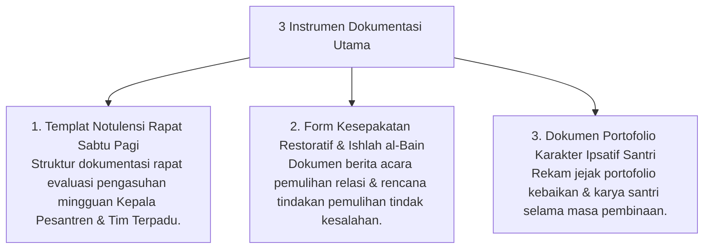

# P11-06: Instrumen Dokumentasi Lembaga

## Status Dokumen
* **Status**: 🌟 **A+ (Tervalidasi & Siap Diimplementasikan)**
* **Sub-Domain**: `11 Tools / 06 Documentation Tools`
* **Penanggung Jawab Keilmuan**: Dewan Keilmuan TUMBUH (*Pakar Tata Kelola Qudwah & Pakar Kuratif Restoratif*)

---

## 1. Konseptualisasi Documentation Tools Pesantren

Instrumen Dokumentasi (*Documentation Tools*) mengamankan rekam jejak keputusan rapat, kesepakatan pemulihan relasi (*Ishlah*), dan portofolio kebaikan santri secara tertata & sah:

---

## 2. Jaminan Keselarasan Hukum & Syariat

Formulir kesepakatan restoratif disahihkan oleh pihak-pihak terkait dan disaksikan oleh Musyrif/Konselor BK sebagai janji pemulihan *Ishlah al-Bain*.
