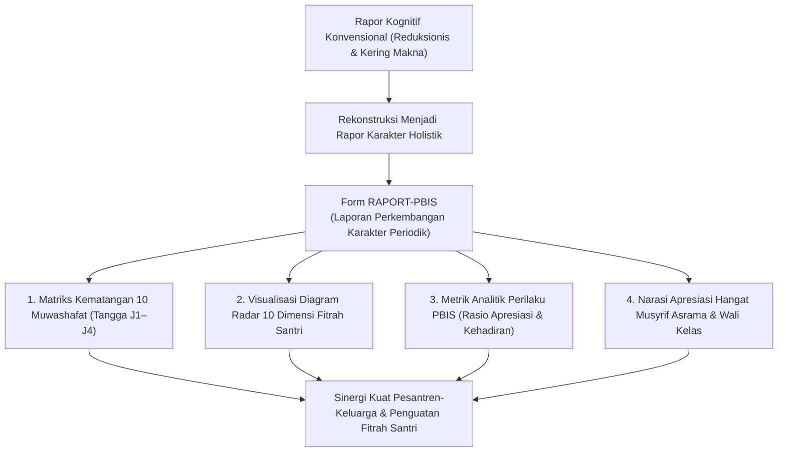
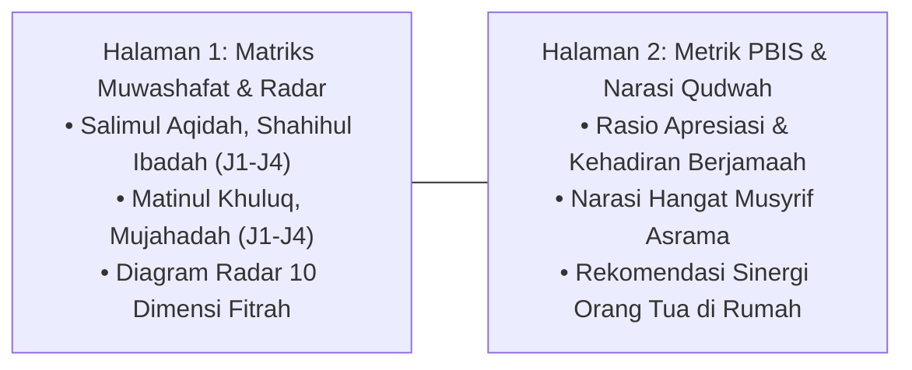

# P11-07-01: Spesifikasi Raport Karakter Periodik PBIS (Form RAPORT-PBIS)

## Status Dokumen
* **Status**: 🌟 **A+ (Tervalidasi & Siap Diimplementasikan)**
* **Sub-Domain**: `11 Tools / 07 Reporting Tools`
* **Penanggung Jawab Keilmuan**: Dewan Keilmuan TUMBUH (*Pakar Metodologi Riset TUMBUH, Pakar Desain Kurikulum Adab, & Pakar PBIS*)
* **Bentuk Instrumen**: Form RAPORT-PBIS (Spesifikasi Buku Laporan Perkembangan Karakter Periodik Caturwulan/Semester, Diagram Radar 10 Dimensi Fitrah, & Narasi Apresiatif Musyrif)

---

# BAGIAN I: LANDASAN TEORETIS & INKUIRI KEILMUAN MULTIDISIPLINER

## 1.1 Konteks Masalah: Keterbatasan Rapor Kognitif Konvensional dalam Menggambarkan Karakter
Laporan kemajuan belajar santri (*school report card*) di sebagian besar institusi pesantren masih sangat terfokus pada angka-angka kognitif ujian mata pelajaran (seperti nilai Matematika, Fiqh, atau Bahasa Arab). Ranah adab, ketahanan emosional, kedisiplinan shalat berjamaah, dan kehidupan sosial di asrama 24 jam kerap hanya diringkas dalam satu baris nilai abjad yang kabur (misal: "Kelakuan: A, Kerajinan: B").

Format pelaporan reduksionis ini menyembunyikan gambaran utuh tentang perkembangan manusia (*whole-child development*). Orang tua tidak memperoleh umpan balik deskriptif tentang bagaimana akhlak anaknya bertumbuh, apa tantangan regulasi diri yang sedang dihadapi, dan bagaimana potensi fitrah anak dapat didukung bersama di rumah.

TUMBUH merancang **Spesifikasi Raport Karakter Periodik PBIS (Form RAPORT-PBIS)**. Rapor ini menyajikan visualisasi data komprehensif perkembangan 10 Muwashafat Karakter santri berbasis tangga kemandirian (J1–J4), metrik perilaku PBIS faktual, dan narasi apresiatif hangat dari musyrif asrama serta konselor bimbingan konseling.



## 1.2 Inkuiri Epistemologi Turats: Doktrin Tabligh, Amanah, dan Kejujuran Laporan
Dalam epistemologi Islam, penyampaian laporan perkembangan murid kepada orang tuanya merupakan bagian dari penunaian amanah pendidikan (*Ada'ul Amanah*) dan pemberian kabar gembira yang menentramkan (*Al-Bisyarah*). Rasulullah SAW bersabda:

> كُلُّكُمْ رَاعٍ وَكُلُّكُمْ مَسْئُولٌ عَنْ رَعِيَّتِهِ
> 
> *"Setiap kalian adalah pemimpin (pengemban amanah), dan setiap kalian akan dimintai pertanggungjawaban atas apa yang dipimpinnya."* [^1]

Imam Ibnu Jama'ah dalam *Tadzkirat as-Sami'* menegaskan bahwa seorang guru wajib mengabarkan kemajuan adab murid kepada orang tuanya dengan tutur kata yang santun, menonjolkan kebajikan-kebajikan (*Dzikr al-Mahasin*), dan memberikan nasihat lembut terkait kekurangan yang perlu disempurnakan bersama (*At-Tawaashi bil Haqqi wa ash-Shabr*) [^2]. Form RAPORT-PBIS menghidupkan prinsip kejujuran (*Shidq*) dan amanah pelaporan ini ke dalam format komunikasi formal yang memuliakan martabat santri dan keluarganya.

## 1.3 Inkuiri Sains Pelaporan Pendidikan: Standards-Based Reporting & Feedback Narrative
Dalam riset evaluasi pendidikan kontemporer (*Standards-Based Reporting* oleh Thomas Guskey, 2001), pemisahan antara pelaporan capaian akademik dengan pelaporan perilaku/karakter terbukti meningkatkan validitas dan kebermaknaan informasi bagi orang tua [^3].

John Hattie dan Helen Timperley (2007) dalam studi meta-analisis tentang *The Power of Feedback* membuktikan bahwa umpan balik naratif deskriptif yang berfokus pada proses ikhtiar dan strategi regulasi diri (*Self-Regulation Feedback*) memiliki dampak positif empat kali lebih besar terhadap perubahan perilaku anak dibandingkan nilai angka atau vonis pujian kosong semata [^4]. Form RAPORT-PBIS memadukan visualisasi diagram radar kuantitatif dengan paragraf naratif kualitatif yang menginspirasi.

---

# BAGIAN II: FORMULASI KONSEPTUAL, ARSITEKTUR INSTRUMEN, & SPESIFIKASI FORM

## 2.1 Struktur 4 Pilar Konten Form RAPORT-PBIS
Raport Karakter PBIS diterbitkan setiap akhir semester (atau caturwulan) dengan tata letak 2 halaman eksklusif:

1. **Halaman 1: Matriks Capaian 10 Muwashafat & Diagram Radar Fitrah**: Pemetaan tingkat kematangan santri pada 10 profil karakter berdasarkan 4 jenjang kemandirian TUMBUH:
   - **J1 (Eksplorasi/Adaptasi Awal)**: Mengenal nilai adab dengan bimbingan penuh.
   - **J2 (Habituasi/Pembiasaan)**: Menjalankan rutinitas ibadah dan 5S secara teratur.
   - **J3 (Kemandirian/Internalisasi)**: Mengamalkan adab atas kesadaran batin tanpa diawasi.
   - **J4 (Kepemimpinan/Penggerak)**: Menjadi teladan qudwah dan mengayomi orang lain (*Peer Buddy*).
2. **Halaman 2: Metrik Perilaku PBIS & Catatan Naratif Musyrif**: Rekapitulasi kehadiran shalat fardhu berjamaah ($>95\%$), total poin kebaikan PBIS, dan surat narasi perkembangan kepribadian santri dari Musyrif Kamar serta Konselor BK.



## 2.2 Format Spesifikasi Layout Form RAPORT-PBIS (Cetak Resmi A4 2 Halaman)

```markdown
================================================================================
             RAPORT PERKEMBANGAN KARAKTER SANTRI (FORM RAPORT-PBIS)
                    Ekosistem Pendidikan Pesantren TUMBUH
================================================================================
Nama Santri : [________________________________________]   NIS : [___________]
Kelas / Fase: [ Kelas 8 / Jenjang Wustha ]                 Semester: [ Ganjil ]
Kamar / Asr : [ Kamar Salman Al-Farisi / Asrama B ]        T.A : [ 2026/2027 ]
Musyrif Kamar: [ Ust. Wildan Robbani, S.Pd. ]              Wali: [ Ust. Ahmad ]
--------------------------------------------------------------------------------

[BAGIAN 1: MATRIKS TINGKAT KEMATANGAN 10 MUWASHAFAT KARAKTER (TANGGA J1–J4)]

+----+----------------------------------+----+----+----+----+-------------------+
| NO | 10 MUWASHAFAT KARAKTER TUMBUH    | J1 | J2 | J3 | J4 | STATUS KEMATANGAN |
+----+----------------------------------+----+----+----+----+-------------------+
| 1. | Salimul 'Aqidah (Akidah Bersih)  |    |    | [X]|    | Kemandirian Batin |
| 2. | Shahihul 'Ibadah (Ibadah Tertib) |    |    | [X]|    | Khusyu' & Shalat  |
| 3. | Matinul Khuluq (Akhlak Kokoh)    |    |    |    | [X]| Teladan Qudwah T4 |
| 4. | Qawiyyul Jism (Fisik Tangguh)    |    | [X]|    |    | Habituasi Olahraga|
| 5. | Mutsaqqaful Fikr (Nalar Kritis)  |    |    | [X]|    | Literasi Turats   |
| 6. | Mujahadatun Linafsih (Regulasi)  |    |    | [X]|    | Kendali Emosi Baik|
| 7. | Harishun 'ala Waqtihi (Waktu)    |    |    | [X]|    | Disiplin Jadwal   |
| 8. | Munazhzhamun fi Syu'unihi (5S)   |    |    |    | [X]| Kerapian Kamar A+ |
| 9. | Qadirun 'alal Kasbi (Mandiri)    |    | [X]|    |    | Kelola Logistik   |
| 10.| Nafi'un li Ghairihi (Khidmah)    |    |    |    | [X]| Aktif Peer Buddy  |
+----+----------------------------------+----+----+----+----+-------------------+

[BAGIAN 2: RINGKASAN DATA ANALITIK PBIS SEMESTER INI]
* Kehadiran Shalat Fardhu Berjamaah : [ 98.4 % ] (Sangat Istiqamah di Shaf Awal)
* Total Poin Kebaikan PBIS Diperoleh: [ 245 Poin ] (Kategori Santri Berprestasi Adab)
* Status Intervensi Perilaku        : [ Tier 1 Universal ] (Bebas Catatan Pelanggaran)

[BAGIAN 3: SURAT NARASI REFLEKSI APRESIASI MUSYRIF ASRAMA]
"Ananda [Nama Santri] menunjukkan perkembangan adab yang sangat membahagiakan selama 
semester ini. Ananda sangat ringan tangan membantu kawan sekamar yang sedang sakit, 
istiqamah merapikan sandal di teras kamar, dan menjadi rujukan kawan-kawannya saat muraja'ah 
hafalan Al-Qur'an. Kehadiran ananda membawa ketenangan dan kedamaian di kamar kami."

[BAGIAN 4: REKOMENDASI PENGUATAN DI RUMAH (UNTUK WALI SANTRI)]
"Saat liburan semester di rumah, kami menyarankan orang tua untuk memberikan ruang 
kepercayaan kepada ananda memimpin shalat berjamaah keluarga dan mengapresiasi kemandirian 
ananda dalam merapikan kamar pribadinya."

--------------------------------------------------------------------------------
Wali Santri                    Musyrif Asrama Kamar           Mudir Pesantren TUMBUH


(_____________________)        (_____________________)        (______________________)
================================================================================
```

## 2.3 Rubrik Standarisasi Penulisan Narasi Musyrif
Lembaga memberlakukan pedoman baku bagi musyrif dalam merumuskan kalimat narasi rapor agar bebas dari pelabelan negatif:

| Dimensi Penulisan | Format Terlarang (Stigmatisasi) | Format Standar Baku TUMBUH (Growth-Oriented) |
| :--- | :--- | :--- |
| **Penyebutan Kesulitan** | *"Santri ini pemalas bangun pagi dan susah diatur saat disuruh piket kamar."* | *"Ananda sedang melatih konsistensi bangun fajar dan membutuhkan penguatan dalam mengelola jadwal piket."* |
| **Fokus Orientasi** | Fokus pada rekapitulasi kesalahan dan kelemahan santri di masa lalu. | Fokus pada kemajuan usaha (*effort*), potensi fitrah, dan harapan perbaikan ke depan. |
| **Nada Komunikasi** | Kering, dingin, bernada menghakimi, dan membuat orang tua merasa cemas/malu. | Hangat, penuh kasih sayang (*mahabbah*), membesarkan hati, dan memicu optimisme. |

---

# BAGIAN III: TABEL SINTESIS, DAFTAR PUSTAKA, CATATAN KAKI, & GLOSARIUM

## 3.1 Tabel Sintesis Integrasi Form RAPORT-PBIS

| Komponen Form RAPORT-PBIS | Landasan Turats & Fiqh | Landasan Sains Evaluasi Pendidikan | Target Transformasi Komunikasi |
| :--- | :--- | :--- | :--- |
| **Matriks 10 Muwashafat J1-J4** | Konsep *Maratib at-Tarbiyah* & Pentahapan Fitrah. | *Standards-Based Reporting* (Guskey). | Orang tua memahami posisi kematangan anak secara jelas. |
| **Metrik PBIS Objektif** | Asas *Tabayyun* & keadilan hisab data syar'i. | *Behavioral Analytics* & *Multi-Tier Monitoring*. | Transparansi perkembangan adab tanpa bias penilaian guru. |
| **Narasi Apresiasi Hangat** | Doktrin *Al-Bisyarah* & *Dzikr al-Mahasin* Salaf. | *Process Feedback* (Hattie & Timperley). | Mempererat kemitraan penuh kasih antara pondok dan orang tua. |

## 3.2 Catatan Kaki (Footnotes 1-to-1)
[^1]: Diriwayatkan oleh Imam Al-Bukhari dalam *Shahih al-Bukhari*, kitab *al-Ahkam*, hadits no. 7138; Imam Muslim dalam *Shahih Muslim*, no. 1829.
[^2]: Ibnu Jama'ah, Badruddin. (2012). *Tadzkirat as-Sami' wa al-Mutakallim fi Adab al-'Alim wa al-Muta'allim*. Beirut: Dar al-Basyair al-Islamiyyah, hlm. 72–80.
[^3]: Guskey, T. R. (2001). *Developing Grading and Reporting Systems for Student Learning*. Thousand Oaks, CA: Corwin Press.
[^4]: Hattie, J., & Timperley, H. (2007). The power of feedback. *Review of Educational Research*, 77(1), 81–112.
[^5]: Sugai, G., & Horner, R. H. (2006). A promising approach for expanding and sustaining school-wide positive behavior support. *School Psychology Review*, 35(2), 245–259.
[^6]: Al-Ghazali, Abu Hamid. (1998). *Ihya' 'Ulum al-Din: Kitab Riyadhat an-Nafs*. Beirut: Dar al-Kutub al-'Ilmiyyah, juz 3, hlm. 60–70.
[^7]: Brookhart, S. M. (2008). *How to Give Effective Feedback to Your Students*. Alexandria, VA: ASCD.
[^8]: An-Nawawi, Yahya bin Syaraf. (1994). *Riyadhus Shalihin: Bab an-Nashihah*. Kairo: Dar al-Hadits, hlm. 82–88.
[^9]: Dweck, C. S. (2006). *Mindset: The New Psychology of Success*. New York: Random House.
[^10]: Al-Ajurri, Abu Bakr Muhammad. (1996). *Akhlaq al-'Ulama'*. Beirut: Dar al-Kutub al-'Ilmiyyah, hlm. 68–76.
[^11]: Epstein, J. L. (2018). *School, Family, and Community Partnerships: Preparing Educators and Improving Schools* (2nd ed.). New York: Routledge.
[^12]: Ibnu Sahnun, Muhammad. (1972). *Adab al-Mu'allimin*. Tunis: Dar Kutub at-Tharablusi, hlm. 50–58.

## 3.3 Daftar Pustaka (APA 7th Edition & Turats Klasik)
* Al-Ajurri, A. B. M. (1996). *Akhlaq al-'Ulama'*. Beirut: Dar al-Kutub al-'Ilmiyyah.
* Al-Bukhari, M. I. (2002). *Shahih al-Bukhari*. Riyadh: Bait al-Afkar ad-Dauliyyah.
* Al-Ghazali, A. H. (1998). *Ihya' 'Ulum al-Din* (Vol. 3). Beirut: Dar al-Kutub al-'Ilmiyyah.
* An-Nawawi, Y. S. (1994). *Riyadhus Shalihin*. Kairo: Dar al-Hadits.
* Brookhart, S. M. (2008). *How to Give Effective Feedback to Your Students*. Alexandria, VA: ASCD.
* Dweck, C. S. (2006). *Mindset: The New Psychology of Success*. New York: Random House.
* Epstein, J. L. (2018). *School, Family, and Community Partnerships: Preparing Educators and Improving Schools* (2nd ed.). New York: Routledge.
* Guskey, T. R. (2001). *Developing Grading and Reporting Systems for Student Learning*. Thousand Oaks, CA: Corwin Press.
* Hattie, J., & Timperley, H. (2007). The power of feedback. *Review of Educational Research*, 77(1), 81–112.
* Ibnu Jama'ah, B. (2012). *Tadzkirat as-Sami' wa al-Mutakallim*. Beirut: Dar al-Basyair al-Islamiyyah.
* Ibnu Sahnun, M. (1972). *Adab al-Mu'allimin*. Tunis: Dar Kutub at-Tharablusi.
* Sugai, G., & Horner, R. H. (2006). A promising approach for expanding and sustaining school-wide positive behavior support. *School Psychology Review*, 35(2), 245–259.

## 3.4 Glosarium Istilah
1. **Form RAPORT-PBIS**: Format instrumen laporan perkembangan karakter periodik santri yang menyajikan capaian 10 Muwashafat dan metrik PBIS.
2. **Standards-Based Reporting**: Sistem pelaporan hasil belajar yang didasarkan pada penguasaan indikator standar kompetensi yang jelas, bukan perankingan.
3. **Muwashafat Karakter**: Sepuluh profil karakter fitrah santri unggul yang menjadi capaian pembinaan kurikulum TUMBUH.
4. **Tangga Kematangan J1–J4**: Tahapan progresi kemandirian adab santri mulai dari Adaptasi (J1), Habituasi (J2), Internalisasi (J3), hingga Penggerak (J4).
5. **Diagram Radar Fitrah**: Visualisasi grafik jaring laba-laba yang menampilkan keseimbangan capaian 10 dimensi karakter santri.
6. **Process Feedback**: Umpan balik yang mengapresiasi proses perjuangan, ketekunan, dan strategi perbaikan santri.
7. **Dzikr al-Mahasin**: Tradisi menyebutkan dan menonjolkan sifat-sifat baik seseorang untuk memotivasi kemuliaan akhlaknya.
8. **Ada'ul Amanah**: Penunaian kewajiban pertanggungjawaban secara sempurna dan jujur kepada pihak yang berhak.
9. **Whole-Child Development**: Pendekatan pendidikan yang memandang perkembangan anak secara holistik mencakup ranah kognitif, afektif, spiritual, dan fisik.
10. **Growth-Oriented Narrative**: Gaya penulisan narasi rapor yang berorientasi pada masa depan, membangkitkan optimisme, dan bebas dari pelabelan negatif.
