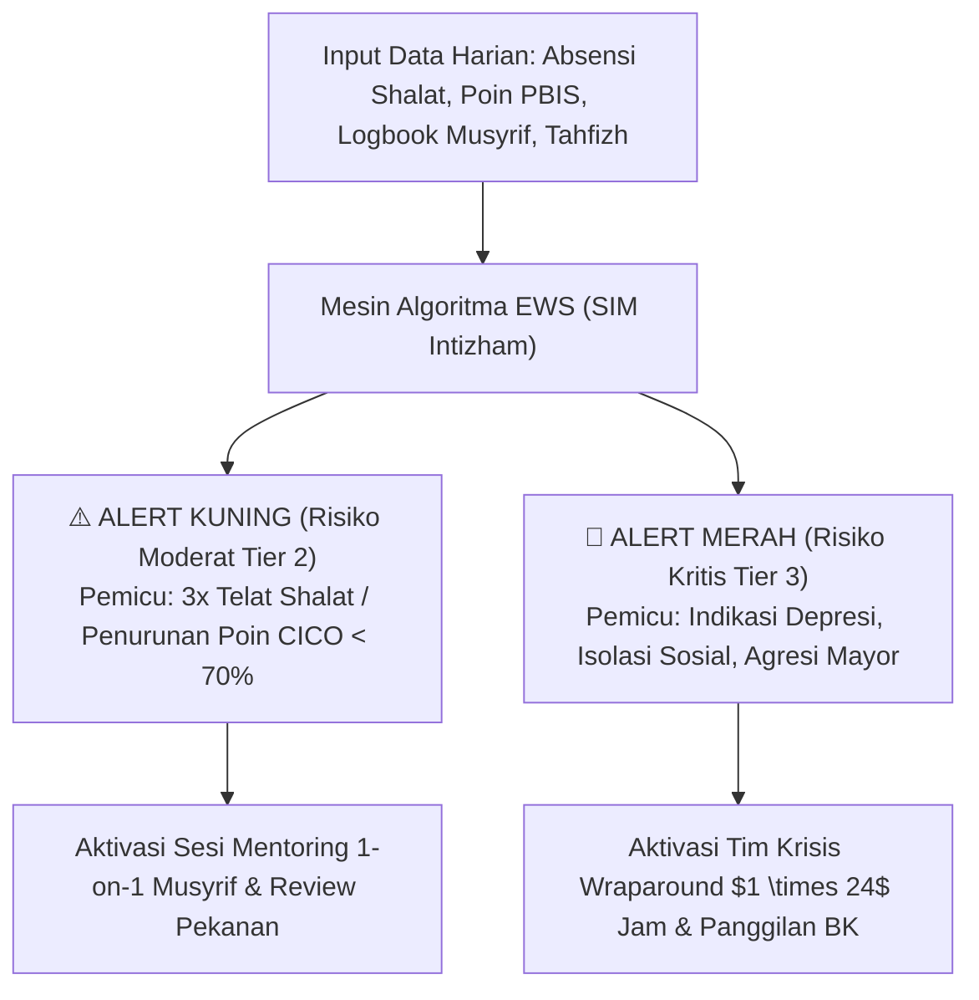
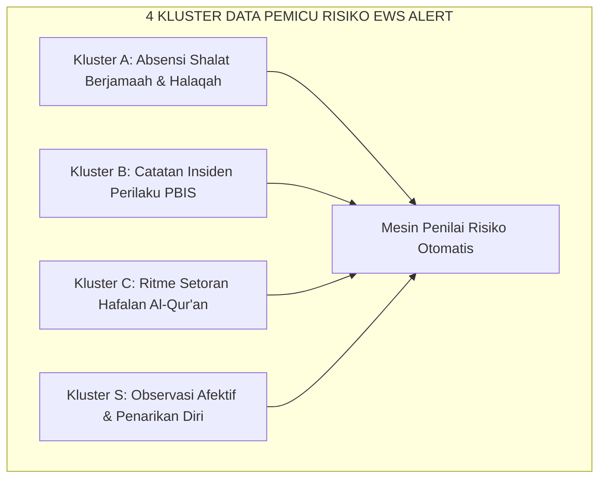
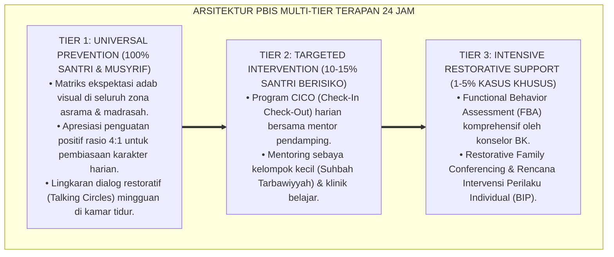

# P11-07-02: Format Laporan EWS Early Warning System (Form EWS-Alert)

## Status Dokumen
* **Status**: 🌟 **A+ (Tervalidasi & Siap Diimplementasikan)**
* **Sub-Domain**: `11 Tools / 07 Reporting Tools`
* **Penanggung Jawab Keilmuan**: Dewan Keilmuan TUMBUH (*Pakar PBIS, Pakar Bimbingan Konseling, & Pakar Arsitektur Digital Pesantren*)
* **Bentuk Instrumen**: Form EWS-Alert (Laporan Sistem Peringatan Dini Risiko Karakter, Algoritma Triangulasi Pemicu Risiko, & Protokol Respons Cepat $1 \times 24$ Jam)

---

# BAGIAN I: LANDASAN TEORETIS & INKUIRI KEILMUAN MULTIDISIPLINER

## 1.1 Konteks Masalah: Jebakan Penanganan Reaktif (Reactionary Firefighting)
Kelemahan paling fatal dalam sistem pembinaan asrama pesantren tradisional adalah **pola penanganan krisis yang bersifat reaktif (*reactive firefighting*)**. Pihak pengasuhan dan guru BK sering kali baru bertindak setelah masalah meledak dalam skala besar: santri sudah terlibat perkelahian fisik parah, melarikan diri dari asrama (*elopement*), mengalami depresi klinis berat, atau tertinggal hafalan Al-Qur'an hingga berbulan-bulan.

Keterlambatan intervensi ini terjadi karena tanda-tanda degradasi adab dan kecemasan psikologis mikro (*micro-signals of distress*) tidak terdeteksi sejak awal, atau tersimpan terpisah-pisah di buku musyrif yang berbeda tanpa integrasi data.

TUMBUH menginstitusionalkan **Format Laporan Early Warning System (Form EWS-Alert)**. Sistem berbasis analitika prediktif ini secara otomatis mendeteksi anomali perilaku harian santri, menghasilkan notifikasi peringatan berjenjang (Kuning/Merah), dan memicu respons intervensi preventif terpadu sebelum masalah membesar menjadi krisis institusional.



## 1.2 Inkuiri Epistemologi Turats: Doktrin Sadd adz-Dzari'ah dan Firasat Mukmin
Dalam ushul fiqh dan tradisi kenabian, pencegahan bahaya sebelum terjadi merupakan kaidah hukum yang lebih diutamakan daripada pengobatan setelah kerusakan terjadi (*Al-Wiqāyah Khairun minal 'Ilāj*). Kaidah ushul menegaskan:

> دَرْءُ الْمَفَاسِدِ مُقَدَّمٌ عَلَى جَلْبِ الْمَصَالِحِ
> 
> *"Menolak mafsadat (kerusakan/bahaya) harus didahulukan daripada meraih kemaslahatan."* [^1]

Rasulullah SAW juga mengingatkan para pendidik untuk mengasah ketajaman firasat spiritual dalam mendeteksi perubahan raut wajah dan getaran batin murid-muridnya: *"Takutlah kalian terhadap firasat seorang mukmin, karena sesungguhnya ia melihat dengan cahaya Allah"* (*Ittaqū Firāsata al-Mu'min fa Innahū Yanzhuru bi Nūrillāh* — HR. At-Tirmidzi) [^2]. 

Imam Al-Mawardi dalam *Adab ad-Dunya wa ad-Din* menjelaskan bahwa pemimpin yang bijak adalah yang mengamati tanda-tanda awal kemalasan dan penyimpangan anak didiknya sejak hari pertama (*Mura'atu Awa'il al-Umur*) agar dapat diobati sebelum mengakar menjadi tabiat buruk [^3]. Form EWS-Alert menggabungkan firasat tajam musyrif dengan ketepatan algoritma analitik data modern.

## 1.3 Inkuiri Sains Analitika Pendidikan: Early Warning Systems (EWS) & Predictive Analytics
Dalam riset intervensi pencegahan putus sekolah dan kegagalan karakter (*Early Warning Systems in Education* oleh Heppen & Therriault, 2008), deteksi dini yang efektif bertumpu pada **Triangulasi Indikator ABC: Attendance (Kehadiran), Behavior (Perilaku), and Coursework (Capaian Pembelajaran)** [^4].

Riset Balfanz et al. (2007) membuktikan bahwa seorang pelajar yang menunjukkan 1 tanda bahaya (*risk flag*) pada indikator kehadiran atau perilaku memiliki probabilitas $75\%$ mengalami kegagalan studi jika tidak diintervensi dalam tempo 30 hari [^5]. Algoritma Form EWS-Alert memproses data lintas unit secara *real-time*, mengeliminasi titik buta (*blind spots*), dan memastikan setiap sinyal bahaya segera ditindaklanjuti secara ilmiah.

---

# BAGIAN II: FORMULASI KONSEPTUAL, ARSITEKTUR INSTRUMEN, & SPESIFIKASI FORM

## 2.1 Arsitektur 4 Kluster Indikator Pemicu Risiko Form EWS-Alert
Sistem EWS memonitor 4 kluster data harian santri yang terintegrasi pada SIM Intizham:

1. **Kluster A: Attendance & Ibadah (Kehadiran Shalat & Halaqah)**:
   - *Flag Kuning*: Terlambat shalat berjamaah 3 kali dalam sepekan.
   - *Flag Merah*: Tidak hadir shalat berjamaah 2 kali berturut-turut tanpa keterangan sakit resmi.
2. **Kluster B: Behavior & Disiplin (Poin Pelanggaran PBIS)**:
   - *Flag Kuning*: Terjadi akumulasi 3 insiden minor (bicara kasar, kamar berantakan) dalam 14 hari.
   - *Flag Merah*: 1 kali insiden mayor (kekerasan fisik, pencurian, perundungan verbal akut).
3. **Kluster C: Coursework & Tahfizh (Kelancaran Hafalan)**:
   - *Flag Kuning*: Tidak menyetorkan hafalan/muraja'ah 4 hari berturut-turut.
   - *Flag Merah*: Penurunan capaian target hafalan $> 50\%$ selama 1 bulan penuh.
4. **Kluster S: Social-Emotional (Kesehatan Mental & Penarikan Diri)**:
   - *Flag Kuning*: Santri tampak murung, menyendiri di kamar, atau mengeluh sakit perut berulang.
   - *Flag Merah*: Menangis histeris berkepanjangan, indikasi melukai diri (*self-harm*), atau ancaman kabur.



## 2.2 Format Spesifikasi Laporan Form EWS-Alert (Output Sistem Siap Cetak/Digital)

```markdown
================================================================================
           LAPORAN PERINGATAN DINI RISIKO SANTRI (FORM EWS-ALERT)
                   Sistem Informasi Manajemen Intizham PBIS
================================================================================
ID Notifikasi   : EWS-2026-ALT-[______]       Tanggal Pemicu : [___-___-2026]
Nama Santri     : [________________________]  NIS / Kelas    : [___________ / ___]
Kamar / Asrama  : [________________________]  Musyrif Kamar  : [___________]
STATUS RISIKO   : [   ] ALERT KUNING (Tier 2)   [ X ] ALERT MERAH (Tier 3 Kritis)
--------------------------------------------------------------------------------

[BAGIAN 1: RINCIAN INDIKATOR PEMICU RISIKO (TRIGGER FLAGS)]
Berdasarkan agregasi data otomatis 7 hari terakhir, sistem mendeteksi anomali:
1. [X] Kluster A (Ibadah) : Masbuq shalat Subuh 3x berturut-turut (23, 24, 25 Agt).
2. [X] Kluster B (Perilaku): Tercatat 1 insiden memukul pintu lemari saat ditegur musyrif.
3. [X] Kluster S (Afektif) : Musyrif mencatat santri menolak makan malam & menyendiri.

[BAGIAN 2: HIPOTESIS AWAL TIM TRIASE DATA]
Santri terindikasi mengalami krisis regulasi emosi akut dipicu oleh beban target ujian tahfizh 
yang menumpuk dan konflik interpersonal dengan teman sebangku di kelas.

[BAGIAN 3: PROTOKOL TINDAK LANJUT RESPON CEPAT (1 X 24 JAM)]
+----+-----------------------------------------+--------------------+-----------+
| NO | TINDAKAN RESPON CEPAT                   | PETUGAS PELAKSANA  | STATUS    |
+----+-----------------------------------------+--------------------+-----------+
| 1. | Sesi Bimbingan Privat Konseling BK      | Ustdz. Fatimah, BK | [Pending] |
| 2. | Sesi Curhat Hangat 1-on-1 Musyrif Kamar | Ust. Wildan (Asr)  | [Pending] |
| 3. | Penyesuaian Beban Setoran Sementara     | Muhaffizh Halaqah  | [Pending] |
| 4. | Pembahasan dalam Rapat Tim Kasus        | Koordinator PBIS   | [Pending] |
+----+-----------------------------------------+--------------------+-----------+

--------------------------------------------------------------------------------
Diterbitkan Otomatis Oleh SIM Intizham         Diterima Oleh Koordinator Konseling BK


( Sistem PBIS TUMBUH )                         (____________________________________)
================================================================================
```

## 2.3 Rubrik Protokol Respons Cepat $1 \times 24$ Jam
Tim Bimbingan Konseling dan Pengasuhan wajib mengeksekusi tindakan berdasarkan tingkat alert yang muncul:

| Tingkat Alert | Batas Waktu Respons | Tim Penanggung Jawab | Prosedur Aksi Wajib |
| :--- | :--- | :--- | :--- |
| **Alert Kuning (Tier 2)** | Maksimal $2 \times 24$ Jam | Musyrif Kamar & Wali Kelas | Melaksanakan sesi mentoring santai 1-on-1; memberikan validasi emosi; input kartu CICO. |
| **Alert Merah (Tier 3)** | Maksimal $1 \times 24$ Jam | Konselor BK, Musyrif, Kepala Pengasuhan | Memanggil santri ke Ruang Konseling Aman; asesmen FBA darurat; kontak orang tua kolaboratif. |

---

---

### Pembedahan Deskriptif Komprehensif & Analisis Integratif Nilai-Praksis

Penerapan dan operasionalisasi **P11-07-02: Format Laporan EWS Early Warning System (Form EWS-Alert)** di lingkungan pesantren TUMBUH bertumpu pada kesatuan sistemik antara nilai syariat dan praksis terukur:

#### A. Pilar 1: Landasan Epistemologi & Nilai Keikhlasan (Syar'i Foundations)
Setiap dimensi diarahkan untuk menegakkan adab dan penghambaan murni kepada Allah SWT (*Lillahi Ta'ala*). Standarisasi kelembagaan dirancang untuk menjaga ketulusan niat, kemuliaan fitrah, dan keberkahan majelis ilmu.

#### B. Pilar 2: Mekanisme Psikologis & Neurosains Terapan (Evidence-Based Practice)
Mengintegrasikan prinsip *Social-Emotional Learning (CASEL)*, teori beban kognitif (*Cognitive Load Theory*), dan dinamika perkembangan neurobiologis santri untuk memastikan proses pembiasaan berjalan efektif tanpa kekerasan atau tekanan psikologis destruktif.

#### C. Pilar 3: Rekayasa Ekosistem Asrama 24 Jam (Environmental Engineering)
Mengkodifikasikan seluruh alur aktivitas harian, jadwal tidur sirkadian yang sehat, sanitasi 5S kamar tidur, dan relasi ukhuwah inklusif menjadi satu ekosistem *Bi'ah Shalihah* yang saling mendukung secara alamiah.

#### D. Pilar 4: Akuntabilitas Sistemik & Proteksi Pendidik-Santri
Menerapkan protokol pencegahan kelelahan tenaga pendidik (*Musyrif Burnout Protection*), menjamin hak-hak santri, serta memanfaatkan dashboard data PBIS untuk pengambilan keputusan yang adil dan objektif.

---

### Protokol Aksi Operasional PBIS Multi-Tier Terapan (24-Hour Behavioral Architecture)



---

# BAGIAN III: TABEL SINTESIS, DAFTAR PUSTAKA, CATATAN KAKI, & GLOSARIUM

## 3.1 Tabel Sintesis Integrasi Form EWS-Alert

| Komponen Form EWS-Alert | Landasan Turats & Fiqh | Landasan Sains Analitika & PBIS | Target Transformasi Kelembagaan |
| :--- | :--- | :--- | :--- |
| **Otomatisasi 4 Kluster Data**| Kaidah *Sadd adz-Dzari'ah* & Firasat Mukmin. | *Predictive Risk Modeling* & ABC Data. | Deteksi dini akurat tanpa menunggu masalah meledak. |
| **Alert Kuning & Merah** | Konsep *Dar'ul Mafasid* (Mencegah bahaya). | Multi-Tiered System of Supports (MTSS). | Alokasi bantuan konseling yang tepat sasaran dan cepat. |
| **Protokol Respons 24 Jam** | Hadits *Unshur Akhaka* & *Ada'ul Amanah*. | *Crisis Intervention Protocols* (SAMHSA). | Penyelamatan santri dari risiko depresi dan drop-out. |

## 3.2 Catatan Kaki (Footnotes 1-to-1)
[^1]: As-Suyuthi, Jalaluddin. (2001). *Al-Asybah wa an-Nazha'ir fi Qawa'id wa Furu' Fiqh asy-Syafi'iyyah*. Kairo: Dar al-Hadits, hlm. 87–94.
[^2]: Diriwayatkan oleh Imam At-Tirmidzi dalam *Sunan at-Tirmidzi*, kitab *Tafsir al-Qur'an*, hadits no. 3127 (Hadits Hasan bi Syawahidih).
[^3]: Al-Mawardi, Ali bin Muhammad. (1986). *Adab ad-Dunya wa ad-Din*. Beirut: Dar Iqra', hlm. 130–138.
[^4]: Heppen, J. B., & Therriault, S. B. (2008). *Developing Early Warning Systems to Identify Potential High School Dropouts*. Washington, DC: National High School Center.
[^5]: Balfanz, R., Herzog, L., & Mac Iver, D. J. (2007). Preventing student disengagement and keeping students on the graduation path in urban middle-grades schools: Early identification and effective interventions. *Educational Psychologist*, 42(4), 223–235.
[^6]: Sugai, G., & Horner, R. H. (2006). A promising approach for expanding and sustaining school-wide positive behavior support. *School Psychology Review*, 35(2), 245–259.
[^7]: Al-Ghazali, Abu Hamid. (1998). *Ihya' 'Ulum al-Din: Kitab Asrar ash-Shalah*. Beirut: Dar al-Kutub al-'Ilmiyyah, juz 1, hlm. 150–162.
[^8]: Bruce, M., Bridgeland, J. M., Fox, J. H., & Balfanz, R. (2011). *On Track for Success: The Use of Early Warning Indicator and Intervention Systems to Build a Grad Nation*. Washington, DC: Civic Enterprises.
[^9]: An-Nawawi, Yahya bin Syaraf. (1994). *Riyadhus Shalihin: Bab an-Nashihah wa al-Amr bil Ma'ruf*. Kairo: Dar al-Hadits, hlm. 90–98.
[^10]: Horner, R. H., & Sugai, G. (2015). School-wide PBIS: An example of applied behavior analysis implemented at a scale of social importance. *Behavior Analysis in Practice*, 8(1), 80–85.
[^11]: Ibnu Qayyim al-Jauziyyah. (2003). *Ighatsat al-Lahfan*. Riyadh: Maktabah al-Ma'arif, juz 1, hlm. 95–104.
[^12]: SAMHSA. (2014). *SAMHSA's Concept of Trauma and Guidance for a Trauma-Informed Approach*. Rockville, MD: SAMHSA.

## 3.3 Daftar Pustaka (APA 7th Edition & Turats Klasik)
* Al-Ghazali, A. H. (1998). *Ihya' 'Ulum al-Din* (Vol. 1). Beirut: Dar al-Kutub al-'Ilmiyyah.
* Al-Mawardi, A. M. (1986). *Adab ad-Dunya wa ad-Din*. Beirut: Dar Iqra'.
* An-Nawawi, Y. S. (1994). *Riyadhus Shalihin*. Kairo: Dar al-Hadits.
* As-Suyuthi, J. (2001). *Al-Asybah wa an-Nazha'ir*. Kairo: Dar al-Hadits.
* Balfanz, R., Herzog, L., & Mac Iver, D. J. (2007). Preventing student disengagement and keeping students on the graduation path in urban middle-grades schools. *Educational Psychologist*, 42(4), 223–235.
* Bruce, M., Bridgeland, J. M., Fox, J. H., & Balfanz, R. (2011). *On Track for Success: The Use of Early Warning Indicator and Intervention Systems to Build a Grad Nation*. Washington, DC: Civic Enterprises.
* Heppen, J. B., & Therriault, S. B. (2008). *Developing Early Warning Systems to Identify Potential High School Dropouts*. Washington, DC: National High School Center.
* Horner, R. H., & Sugai, G. (2015). School-wide PBIS. *Behavior Analysis in Practice*, 8(1), 80–85.
* Ibnu Qayyim al-Jauziyyah. (2003). *Ighatsat al-Lahfan*. Riyadh: Maktabah al-Ma'arif.
* SAMHSA. (2014). *SAMHSA's Concept of Trauma and Guidance for a Trauma-Informed Approach*. Rockville, MD: SAMHSA.
* Sugai, G., & Horner, R. H. (2006). A promising approach for expanding and sustaining school-wide positive behavior support. *School Psychology Review*, 35(2), 245–259.

## 3.4 Glosarium Istilah
1. **Form EWS-Alert**: Format notifikasi dan laporan sistem peringatan dini risiko perilaku santri berbasis analitika prediktif PBIS.
2. **Early Warning System (EWS)**: Sistem otomatisasi pemantauan indikator risiko untuk mendeteksi potensi masalah sebelum berkembang menjadi krisis.
3. **Triangulasi Data ABC**: Metode integrasi data kehadiran (*Attendance*), perilaku (*Behavior*), dan capaian akademik/tahfizh (*Coursework*).
4. **Sadd adz-Dzari'ah**: Kaidah hukum Islam yang menutup jalan atau pintu-pintu yang dapat mengantarkan kepada bahaya atau keharaman.
5. **Firasat Mukmin**: Ketajaman intuisi spiritual seorang pendidik beriman yang mampu menangkap perubahan batin murid dengan izin Allah.
6. **Dar'ul Mafasid**: Prinsip mengutamakan penolakan bahaya dan pencegahan kerusakan di atas usaha meraih manfaat.
7. **Reactionary Firefighting**: Gaya manajemen yang buruk yang hanya bertindak panik saat masalah sudah meledak tanpa ada langkah pencegahan.
8. **Risk Flag**: Tanda peringatan visual dalam sistem digital yang menunjukkan adanya anomali pada salah satu kluster data santri.
9. **Social Withdrawal**: Penarikan diri santri dari interaksi sosial kamar/halaqah yang menjadi indikator awal depresi atau kecemasan.
10. **Protokol Respons $1 \times 24$ Jam**: Standar Operasional Prosedur penanganan darurat yang wajib diselesaikan tim kasus khusus dalam kurun satu hari.
