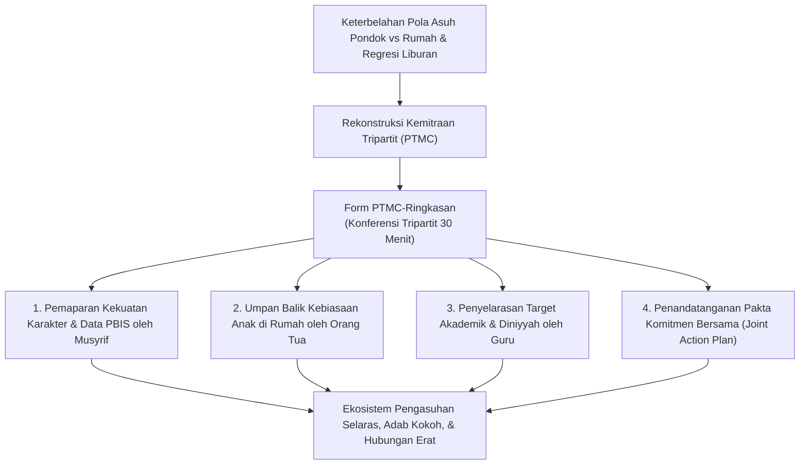
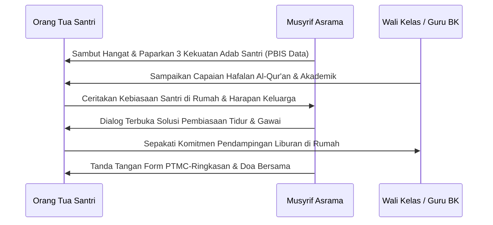

# P11-07-03: Lembar Ringkasan Parent Teacher Musyrif Conference (Form PTMC-Ringkasan)

## Status Dokumen
* **Status**: 🌟 **A+ (Tervalidasi & Siap Diimplementasikan)**
* **Sub-Domain**: `11 Tools / 07 Reporting Tools`
* **Penanggung Jawab Keilmuan**: Dewan Keilmuan TUMBUH (*Pakar Pengasuhan Asrama, Pakar Bimbingan Konseling, & Pakar Psikologi Sosial Santri*)
* **Bentuk Instrumen**: Form PTMC-Ringkasan (Lembar Notulensi Konferensi Tripartit Orang Tua-Guru-Musyrif, Pakta Keselarasan Pola Asuh Rumah-Pondok, & Joint Action Plan)

---

# BAGIAN I: LANDASAN TEORETIS & INKUIRI KEILMUAN MULTIDISIPLINER

## 1.1 Konteks Masalah: Kesenjangan Pola Asuh dan Fenomena Regresi Liburan
Salah satu tantangan terbesar dalam pembentukan karakter santri pesantren adalah terjadinya **keterbelahan ekosistem pengasuhan (*parenting split*)**. Di pondok, santri dibiasakan bangun fajar, shalat berjamaah, merapikan ranjang mandiri, dan bebas dari distraksi gawai (*gadget*). Namun, saat santri pulang ke rumah pada masa liburan semester, lingkungan rumah kerap tidak memiliki aturan yang selaras: orang tua memanjakan anak, membiarkan begadang, dan memberikan akses gawai tanpa batas.

Fenomena ini memicu **regresi karakter liburan (*holiday adab regression*)**, di mana kemandirian dan adab yang dibangun berbulan-bulan di pesantren seketika luntur dalam hitungan pekan.

TUMBUH menginstitusionalkan **Parent-Teacher-Musyrif Conference (Form PTMC-Ringkasan)**. Forum dialog tripartit berdurasi 30 menit ini menyatukan Orang Tua, Musyrif Asrama, dan Wali Kelas/Guru BK dalam satu meja kesepakatan (*Joint Action Plan*), memastikan adanya kesinambungan nilai (*continuity of values*) antara kehidupan asrama dan kehidupan di rumah.



## 1.2 Inkuiri Epistemologi Turats: Doktrin Ta'awun, Sinergi Tarbiyatul Aulad, dan Amanah Hadhanah
Dalam syariat Islam, orang tua memikul tanggung jawab fitrah primer (*al-hadhanah wa at-tarbiyah al-asasiyyah*), sedangkan lembaga pesantren dan para asatidz memikul amanah perwakilan (*wakalah at-ta'lim*). Allah SWT memerintahkan kerja sama dalam kebajikan dan ketakwaan: *"Dan tolong-menolonglah kalian dalam (mengerjakan) kebajikan dan takwa, dan jangan tolong-menolong dalam berbuat dosa dan permusuhan"* (*Wa Ta'āwanū 'alal Birri wat Taqwā* — QS. Al-Maidah: 2).

Imam Abu Hamid Al-Ghazali dalam *Ihya' 'Ulum al-Din* (Kitab *Riyadhat an-Nafs*) menegaskan bahwa keberhasilan mendidik anak mustahil terwujud jika apa yang dibangun oleh guru di sekolah diruntuhkan oleh orang tua di rumah (*Inna al-Bina'a Yahtadju ila Muwazanatin baina al-Mu'allim wa al-Abawain*) [^1]. 

Orang tua tidak boleh bersikap *"lepas tangan"* atau menyerahkan anak seolah-olah melempar barang ke bengkel. Form PTMC-Ringkasan memfasilitasi musyawarah saling menasihati dalam kebenaran dan kesabaran (*At-Tawaashi bil Haqqi wa ash-Shabr*) antara murabbi pondok dan orang tua kandung.

## 1.3 Inkuiri Sains Sosiologis & Psikologi Keluarga: Epstein's Framework dan Relational Trust
Dalam literatur sains sosiologi pendidikan kontemporer, Joyce Epstein (2018) merumuskan kerangka kerja kemitraan sekolah-keluarga (*Epstein's Six Types of Family-School Involvement*), di mana komunikasi dua arah yang setara (*two-way reciprocal communication*) menjadi faktor penentu tertinggi keberhasilan karakter anak [^2].

Bryk dan Schneider (2002) dalam penelitian longitudinal tentang *Trust in Schools* membuktikan bahwa sekolah yang memiliki tingkat **kepercayaan relasional (*relational trust*)** yang tinggi dengan orang tua memiliki peluang $3,5$ kali lebih besar untuk mempertahankan ketertiban disiplin siswa [^3]. Konferensi tiga pihak (PTMC) menghapus kecurigaan dan saling menyalahkan, mengubah relasi formal transaksional menjadi aliansi persahabatan sejati (*co-parenting alliance*).

---

# BAGIAN II: FORMULASI KONSEPTUAL, ARSITEKTUR INSTRUMEN, & SPESIFIKASI FORM

## 2.1 Alur 4 Sesi Dialog Baku Konferensi Tripartit PTMC (30 Menit)
Konferensi dilaksanakan secara berkala pada momen pembagian rapor periodik atau secara daring via telekonferensi bagi orang tua luar kota, mengikuti 4 fase alur:

1. **Fase 1: Pembukaan Apresiatif & Paparan Data PBIS (7 Menit)**: Musyrif dan Wali Kelas membuka sesi dengan memaparkan 3 kekuatan adab utama santri berdasarkan rekapitulasi data SIM Intizham.
2. **Fase 2: Pendengaran Suara Orang Tua (7 Menit)**: Orang tua memaparkan dinamika interaksi anak saat di rumah, riwayat kesehatan, atau perubahan sikap yang dirasakan keluarga.
3. **Fase 3: Dialog Solusi & Penyelarasan Target (10 Menit)**: Ketiga pihak mendiskusikan tantangan hafalan atau kebiasaan tidur santri dan merumuskan langkah konvergen yang disepakati bersama.
4. **Fase 4: Penguncian Pakta Aksi Bersama / Joint Action Plan (6 Menit)**: Menuliskan komitmen konkret pondok dan komitmen konkret rumah, ditutup dengan doa bersama untuk kesalehan santri.



## 2.2 Format Instrumen Form PTMC-Ringkasan (Lembar Kesepakatan Siap Pakai)

```markdown
================================================================================
    LEMBAR RINGKASAN PARENT-TEACHER-MUSYRIF CONFERENCE (FORM PTMC-RINGKASAN)
================================================================================
Hari / Tanggal  : [___-___-2026]            Waktu Sesi  : [___:___ s/d ___:___ WIB]
Nama Santri     : [______________________]  Kelas/Kamar : [___________ / _________]
Wali Santri     : [______________________]  Hubungan    : [ Ayah / Ibu / Wali ]
Musyrif Asrama  : [______________________]  Wali Kelas  : [____________________]
--------------------------------------------------------------------------------

[BAGIAN 1: RINGKASAN KEKUATAN & KEMAJUAN ADAB SANTRI (DARI PONDOK)]
* 3 Capaian Karakter Paling Menonjol Semester Ini:
  1. Istiqamah shalat fardhu di shaf pertama dan menjaga adab wudhu.
  2. Kerapian lemari pakaian dan tempat tidur selalu meraih predikat A (5S).
  3. Aktif membantu kawan kamar dalam muraja'ah Al-Qur'an (Jiwa Ukhuwah).

[BAGIAN 2: CATATAN OBSERVASI ORANG TUA (DARI RUMAH)]
* Kebiasaan Positif di Rumah : Mandiri merapikan kamar tidur sendiri saat libur.
* Kendala Utama di Rumah     : Masih sering terpaku bermain game gawai $> 3$ jam/hari.

[BAGIAN 3: PAKTA RENCANA AKSI BERSAMA (JOINT ACTION PLAN)]
1. KOMITMEN RUMAH (ORANG TUA):
   - Memberlakukan aturan "Bebas Gawai Ba'da Maghrib" selama masa liburan.
   - Mengajak ananda shalat Subuh berjamaah di masjid lingkungan rumah.
   - Menyiapkan waktu 15 menit/hari untuk menyimak tilawah Al-Qur'an ananda.

2. KOMITMEN PESANTREN (GURU & MUSYRIF):
   - Memberikan bimbingan talaqqi ekstra 2x sepekan untuk kelancaran Juz 29.
   - Melibatkan ananda dalam kepanitiaan bakti santri guna mengasah kepemimpinan.

--------------------------------------------------------------------------------
Tanda Tangan Orang Tua        Tanda Tangan Musyrif Asrama     Tanda Tangan Wali Kelas


(______________________)      (_________________________)     (_____________________)
================================================================================
```

## 2.3 Rubrik Evaluasi Keselarasan Sinergi Rumah-Pondok
Konselor BK mengevaluasi tingkat keberhasilan sinergi pasca-pertemuan PTMC:

| Dimensi Sinergi | Level 1: Disfungsional | Level 2: Kooperatif Moderat | Level 3: Aliansi Sinergis Paripurna |
| :--- | :--- | :--- | :--- |
| **Keterbukaan Orang Tua** | Defensif, menolak data pondok, atau menyalahkan sistem asrama. | Mendengarkan masukan pondok, namun belum konsisten menerapkan di rumah. | Sangat terbuka, mengapresiasi musyrif, dan berkomitmen penuh menjaga adab di rumah. |
| **Konsistensi Tindak Lanjut**| Tidak ada komitmen rumah yang dijalankan selama liburan. | Sebagian aturan dijalankan (shalat jalan, gawai masih jebol). | $100\%$ butir *Joint Action Plan* dieksekusi dengan disiplin dan penuh kehangatan. |
| **Dampak pada Santri** | Santri bingung (*cognitive dissonance*) karena standar nilai bertolak belakang. | Santri berusaha menyesuaikan diri walau sempat kaget saat kembali ke pondok. | Santri memiliki karakter yang utuh (*integrated personality*) di pondok maupun di rumah. |

---

# BAGIAN III: TABEL SINTESIS, DAFTAR PUSTAKA, CATATAN KAKI, & GLOSARIUM

## 3.1 Tabel Sintesis Integrasi Form PTMC-Ringkasan

| Komponen Form PTMC-Ringkasan | Landasan Turats & Fiqh | Landasan Sains Kemitraan Keluarga | Target Transformasi Pengasuhan |
| :--- | :--- | :--- | :--- |
| **Paparan Data Tripartit** | Kaidah *At-Tawaashi bil Haqq* & Fiqh Amanah. | *Two-Way Reciprocal Communication* (Epstein). | Menghilangkan miskomunikasi dan saling curiga. |
| **Dialog Keselarasan Adab** | Doktrin Penyatuan Tarbiyah Rumah-Pondok. | *Relational Trust* (Bryk & Schneider). | Membangun ko-parenting yang solid antara pondok & rumah. |
| **Joint Action Plan** | Doktrin *Kitabatul 'Uqud* & Janji Setia Ta'awun. | *Shared Accountability Protocols*. | Menghentikan regresi adab santri saat liburan semester. |

## 3.2 Catatan Kaki (Footnotes 1-to-1)
[^1]: Al-Ghazali, Abu Hamid. (1998). *Ihya' 'Ulum al-Din: Kitab Riyadhat an-Nafs wa Tahdzib al-Akhlaq*. Beirut: Dar al-Kutub al-'Ilmiyyah, juz 3, hlm. 72–82.
[^2]: Epstein, J. L. (2018). *School, Family, and Community Partnerships: Preparing Educators and Improving Schools* (2nd ed.). New York: Routledge.
[^3]: Bryk, A. S., & Schneider, B. (2002). *Trust in Schools: A Core Resource for Improvement*. New York: Russell Sage Foundation.
[^4]: Mapp, K. L., & Bergman, E. (2019). *Dual Capacity-Building Framework for Family-School Partnerships (Version 2)*. Boston: Dual Capacity.
[^5]: Ibnu Jama'ah, Badruddin. (2012). *Tadzkirat as-Sami' wa al-Mutakallim*. Beirut: Dar al-Basyair al-Islamiyyah, hlm. 82–90.
[^6]: Henderson, A. T., & Mapp, K. L. (2002). *A New Wave of Evidence: The Impact of School, Family, and Community Connections on Student Achievement*. Austin, TX: SEDL.
[^7]: An-Nawawi, Yahya bin Syaraf. (1994). *Riyadhus Shalihin: Bab Huquq al-Jar wa Birr al-Walidain*. Kairo: Dar al-Hadits, hlm. 120–128.
[^8]: Hoover-Dempsey, K. V., & Sandler, H. M. (1997). Why do parents become involved in their children's education? *Review of Educational Research*, 67(1), 3–42.
[^9]: Ibnu Qayyim al-Jauziyyah. (2003). *Tuhfat al-Maudud bi Ahkam al-Maulud*. Kairo: Maktabah al-Qayyimah, hlm. 230–242.
[^10]: Jeynes, W. H. (2012). A meta-analysis of the efficacy of different types of parental involvement programs for urban students. *Urban Education*, 47(4), 706–742.
[^11]: Al-Ajurri, Abu Bakr Muhammad. (1996). *Akhlaq al-'Ulama'*. Beirut: Dar al-Kutub al-'Ilmiyyah, hlm. 75–84.
[^12]: Fan, X., & Chen, M. (2001). Parental involvement and students' academic achievement: A meta-analysis. *Educational Psychology Review*, 13(1), 1–22.

## 3.3 Daftar Pustaka (APA 7th Edition & Turats Klasik)
* Al-Ajurri, A. B. M. (1996). *Akhlaq al-'Ulama'*. Beirut: Dar al-Kutub al-'Ilmiyyah.
* Al-Ghazali, A. H. (1998). *Ihya' 'Ulum al-Din* (Vol. 3). Beirut: Dar al-Kutub al-'Ilmiyyah.
* An-Nawawi, Y. S. (1994). *Riyadhus Shalihin*. Kairo: Dar al-Hadits.
* Bryk, A. S., & Schneider, B. (2002). *Trust in Schools: A Core Resource for Improvement*. New York: Russell Sage Foundation.
* Epstein, J. L. (2018). *School, Family, and Community Partnerships: Preparing Educators and Improving Schools* (2nd ed.). New York: Routledge.
* Fan, X., & Chen, M. (2001). Parental involvement and students' academic achievement: A meta-analysis. *Educational Psychology Review*, 13(1), 1–22.
* Henderson, A. T., & Mapp, K. L. (2002). *A New Wave of Evidence*. Austin, TX: SEDL.
* Hoover-Dempsey, K. V., & Sandler, H. M. (1997). Why do parents become involved in their children's education? *Review of Educational Research*, 67(1), 3–42.
* Ibnu Jama'ah, B. (2012). *Tadzkirat as-Sami' wa al-Mutakallim*. Beirut: Dar al-Basyair al-Islamiyyah.
* Ibnu Qayyim al-Jauziyyah. (2003). *Tuhfat al-Maudud bi Ahkam al-Maulud*. Kairo: Maktabah al-Qayyimah.
* Jeynes, W. H. (2012). A meta-analysis of the efficacy of different types of parental involvement programs for urban students. *Urban Education*, 47(4), 706–742.
* Mapp, K. L., & Bergman, E. (2019). *Dual Capacity-Building Framework for Family-School Partnerships (Version 2)*. Boston: Dual Capacity.

## 3.4 Glosarium Istilah
1. **Form PTMC-Ringkasan**: Format lembar ringkasan notulensi dan kesepakatan konferensi tripartit antara Orang Tua, Guru, dan Musyrif Asrama.
2. **Parent-Teacher-Musyrif Conference (PTMC)**: Forum musyawarah berkala tiga pihak untuk menyelaraskan pola asuh dan target perkembangan santri.
3. **Holiday Adab Regression**: Fenomena penurunan atau kemunduran kualitas adab dan kedisiplinan santri saat berada di rumah selama liburan semester.
4. **Joint Action Plan**: Rencana aksi kolaboratif yang membagi tanggung jawab konkret antara pihak keluarga dan pihak pesantren.
5. **Wakalah at-Ta'lim**: Akad perwakilan di mana orang tua mewakilkan proses pengajaran dan pembinaan adab anaknya kepada para asatidz pesantren.
6. **Co-Parenting Alliance**: Kemitraan sejajar antara pendidik pondok dan orang tua kandung dalam membesarkan anak dengan visi yang sama.
7. **Relational Trust**: Rasa saling percaya yang tulus antara orang tua dan pihak pesantren yang dilandasi integritas, kompetensi, dan rasa hormat.
8. **Parenting Split**: Kondisi keterbelahan pola asuh akibat perbedaan nilai dan aturan yang tajam antara lingkungan rumah dengan lingkungan pesantren.
9. **Two-Way Reciprocal Communication**: Pola komunikasi timbal balik di mana kedua belah pihak saling mendengar dan menghargai masukan.
10. **Continuity of Values**: Kesinambungan pengamalan nilai-nilai adab dan ibadah tanpa terputus antara masa di asrama dan masa di rumah.
