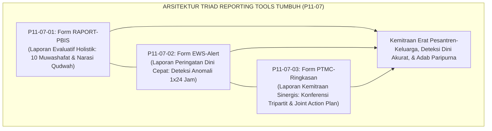
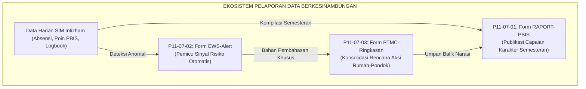
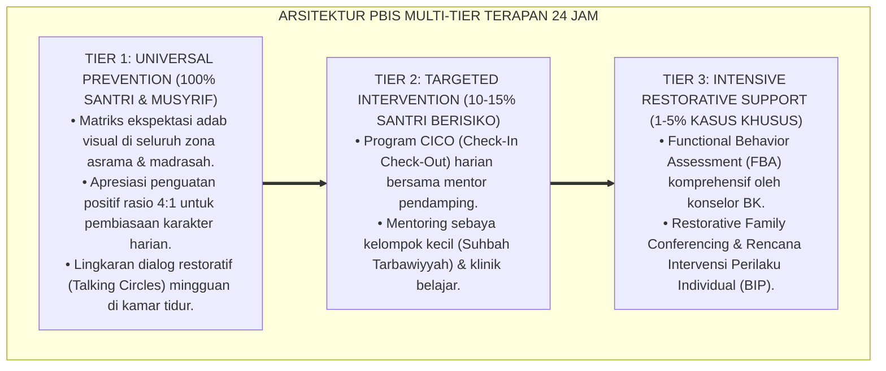

# P11-07: Instrumen Pelaporan Periodik (Sintesis Reporting Tools Ekosistem TUMBUH)

## Status Dokumen
* **Status**: 🌟 **A+ (Tervalidasi & Siap Diimplementasikan)**
* **Domain**: `11 Tools` > `07 Reporting Tools` (Master Induk Sub-Domain 07)
* **Penanggung Jawab Keilmuan**: Dewan Keilmuan TUMBUH (*Pakar Metodologi Riset TUMBUH, Pakar Arsitektur Digital Pesantren, Pakar PBIS, & Pakar Bimbingan Konseling*)
* **Rumpun Instrumen**: Form RAPORT-PBIS, Form EWS-Alert, dan Form PTMC-Ringkasan

---

# BAGIAN I: LANDASAN TEORETIS & INKUIRI KEILMUAN MULTIDISIPLINER

## 1.1 Konteks Masalah: Menghubungkan Data Internal dengan Komunikasi Eksternal
Keberhasilan sistem pembinaan karakter berbasis *Positive Behavioral Interventions and Supports* (PBIS) di lingkungan pesantren sangat ditentukan oleh bagaimana data perilaku internal dikomunikasikan secara bermakna kepada seluruh pemangku kepentingan (*stakeholders*). Ketika data hanya berhenti di lemari arsip musyrif tanpa laporan periodik yang mudah dipahami orang tua, atau ketika sinyal bahaya tidak segera dilaporkan kepada tim konseling, ekosistem pembinaan kehilangan daya responsifnya.

Gugus **Reporting Tools (P11-07)** dirancang untuk menjembatani aliran informasi dari data mentah asrama 24 jam menuju **tindakan kolaboratif yang terarah (*actionable insights*)**. Melalui integrasi tiga instrumen pelaporan terpadu—rapor karakter periodik berbasis 10 Muwashafat (Laporan Holistik), format notifikasi sistem peringatan dini EWS (Laporan Preventif Cepat), dan lembar ringkasan konferensi tripartit PTMC (Laporan Keselarasan Sinergi)—ekosistem TUMBUH menjamin transparansi, akuntabilitas, dan kesinambungan pendidikan adab antara pondok dan keluarga.

## 1.2 Inkuiri Epistemologi Turats: Doktrin Al-Bayan, Nashihah, dan Tarbiyah Simbiotik
Dalam epistemologi pendidikan Islam, pelaporan perkembangan anak merupakan manifestasi dari kewajiban *Al-Bayan* (penjelasan yang terang dan transparan) dan *An-Nashihah* (ketulusan menghendaki kebaikan bagi sesama). Rasulullah SAW bersabda:

> الدِّينُ النَّصِيحَةُ. قُلْنَا: لِمَنْ؟ قَالَ: لِلَّهِ وَلِكِتَابِهِ وَلِرَسُولِهِ وَلِأَئِمَّةِ الْمُسْلِمِينَ وَعَامَّتِهِمْ
> 
> *"Agama itu adalah ketulusan nasihat.' Kami bertanya: 'Bagi siapa wahai Rasulullah?' Beliau bersabda: 'Bagi Allah, Kitab-Nya, Rasul-Nya, para pemimpin kaum muslimin, dan segenap kaum muslimin pada umumnya.'"* [^1]

Imam An-Nawawi dalam *Syarh Shahih Muslim* menjelaskan bahwa hakikat nasihat bagi sesama muslim dalam konteks pendidikan adalah menyampaikan kondisi hakiki mereka dengan cara yang paling membawa maslahat, menutup aib yang tidak perlu diumbar, namun bersikap tegas dan jujur dalam mengabarkan hal-hal yang membahayakan masa depan agama dan adab mereka [^2]. 

Ketiga instrumen dalam gugus P11-07 menerjemahkan hakikat *nashihah* ini: Form RAPORT-PBIS menyajikan kabar gembira atas kemajuan fitrah (*at-tabsyir*); Form EWS-Alert memberikan peringatan dini atas potensi bahaya (*at-tandzir*); dan Form PTMC-Ringkasan mengokohkan tolong-menolong dalam kebajikan (*at-ta'awun*).

## 1.3 Inkuiri Sains Pelaporan Pendidikan & Komunikasi Empatis
Secara ilmiah, gugus P11-07 mengintegrasikan teori pelaporan berbasis standar (*Standards-Based Reporting* oleh Thomas Guskey), model deteksi risiko prediktif (*Predictive Dropout Analytics* oleh Balfanz & Byrnes), dan kerangka kemitraan keluarga (*Family-School Partnership* oleh Joyce Epstein) [^3].

Integrasi ini memastikan bahwa bahasa pelaporan yang digunakan senantiasa mematuhi **prinsip komunikasi berbasis pertumbuhan (*Growth-Mindset & Asset-Based Language*)**. Laporan karakter TUMBUH tidak mendefinisikan santri berdasarkan kesilapannya, melainkan memotret santri sebagai insan yang sedang berproses meniti tangga kemandirian fitrah.

---

# BAGIAN II: FORMULASI KONSEPTUAL, MATRIKS INTEGRASI, & PROTOKOL KOMUNIKASI

## 2.1 Matriks Integrasi Tiga Instrumen Pelaporan Periodik

| Dimensi Parameter | Form RAPORT-PBIS (P11-07-01) | Form EWS-Alert (P11-07-02) | Form PTMC-Ringkasan (P11-07-03) |
| :--- | :--- | :--- | :--- |
| **Karakter Laporan** | **Periodik Komprehensif**: Akhir semester / caturwulan. | **Real-Time Peringatan Dini**: Muncul seketika saat anomali terdeteksi. | **Kolaboratif Sinkron**: Sesi tatap muka/daring terjadwal. |
| **Audiens Utama** | Orang Tua Santri, Pimpinan Pondok, & Santri. | Tim Bimbingan Konseling, Musyrif, & Kepala Asrama. | Orang Tua, Musyrif Kamar, & Wali Kelas/Guru BK. |
| **Basis Data Utama** | Agregasi data 10 Muwashafat (J1–J4) & Poin PBIS. | Triangulasi anomali absensi shalat, insiden, & tahfizh. | Dialog triangulasi temuan pondok dan observasi rumah. |
| **Luaran / Output** | Buku Rapor Cetak Eksklusif 2 Halaman & E-Rapor. | Laporan Alert Digital & Tindak Lanjut Respon $1\times 24$ Jam. | Pakta Kesepakatan Tertulis Rencana Aksi Bersama (*Joint Plan*). |

## 2.2 Protokol Komunikasi & Etika Pelaporan Wali Santri
Lembaga memberlakukan 3 asas etika pelaporan kepada orang tua santri:

1. **Prinsip Kejujuran Penuh Kasih (*Honesty with Compassion*)**: Data kelemahan santri disampaikan secara transparan dan jujur, namun dibingkai dalam nada optimisme ikhtiar perbaikan bersama.
2. **Ketiadaan Perbandingan Antarsantri (*Zero Inter-Student Comparison*)**: Rapor dan laporan dilarang keras mencantumkan peringkat kelas (*ranking*) atau membandingkan santri dengan saudara/temannya.
3. **Aksesibilitas Digital Ramah Wali (*Parent-Friendly Interface*)**: Seluruh laporan periodik dapat diakses dengan mudah melalui aplikasi *Parent Portal* dengan notifikasi WhatsApp terverifikasi.

---

---

### Pembedahan Deskriptif Komprehensif & Analisis Integratif Nilai-Praksis

Penerapan dan operasionalisasi **P11-07: Instrumen Pelaporan Periodik (Sintesis Reporting Tools Ekosistem TUMBUH)** di lingkungan pesantren TUMBUH bertumpu pada kesatuan sistemik antara nilai syariat dan praksis terukur:

#### A. Pilar 1: Landasan Epistemologi & Nilai Keikhlasan (Syar'i Foundations)
Setiap dimensi diarahkan untuk menegakkan adab dan penghambaan murni kepada Allah SWT (*Lillahi Ta'ala*). Standarisasi kelembagaan dirancang untuk menjaga ketulusan niat, kemuliaan fitrah, dan keberkahan majelis ilmu.

#### B. Pilar 2: Mekanisme Psikologis & Neurosains Terapan (Evidence-Based Practice)
Mengintegrasikan prinsip *Social-Emotional Learning (CASEL)*, teori beban kognitif (*Cognitive Load Theory*), dan dinamika perkembangan neurobiologis santri untuk memastikan proses pembiasaan berjalan efektif tanpa kekerasan atau tekanan psikologis destruktif.

#### C. Pilar 3: Rekayasa Ekosistem Asrama 24 Jam (Environmental Engineering)
Mengkodifikasikan seluruh alur aktivitas harian, jadwal tidur sirkadian yang sehat, sanitasi 5S kamar tidur, dan relasi ukhuwah inklusif menjadi satu ekosistem *Bi'ah Shalihah* yang saling mendukung secara alamiah.

#### D. Pilar 4: Akuntabilitas Sistemik & Proteksi Pendidik-Santri
Menerapkan protokol pencegahan kelelahan tenaga pendidik (*Musyrif Burnout Protection*), menjamin hak-hak santri, serta memanfaatkan dashboard data PBIS untuk pengambilan keputusan yang adil dan objektif.

---

### Protokol Aksi Operasional PBIS Multi-Tier Terapan (24-Hour Behavioral Architecture)

---

# BAGIAN III: TABEL SINTESIS, DAFTAR PUSTAKA, CATATAN KAKI, & GLOSARIUM

## 3.1 Tabel Sintesis Integrasi Master Reporting Tools (P11-07)

| Instrumen Pelaporan | Rujukan Turats Klasik | Rujukan Sains Pendidikan & Komunikasi | Target Transformasi Ekosistem |
| :--- | :--- | :--- | :--- |
| **P11-07-01 (RAPORT-PBIS)** | Doktrin *Al-Bisyarah* & *Ada'ul Amanah* (HR. Bukhari). | *Standards-Based Reporting* (Guskey) & *Feedback* (Hattie). | Transparansi holistik capaian 10 profil karakter santri. |
| **P11-07-02 (EWS-Alert)** | Kaidah *Sadd adz-Dzari'ah* & Firasat Mukmin (HR. Tirmidzi). | *Early Warning Systems* (Heppen) & *ABC Risk Triangulation*. | Penyelamatan santri tercepat sebelum krisis meledak. |
| **P11-07-03 (PTMC-Ringkasan)**| Doktrin *At-Tawaashi bil Haqq* & Fiqh Sinergi Hadhanah. | *Family-School Partnerships* (Epstein) & *Relational Trust*. | Keselarasan total pola asuh asrama dan rumah orang tua. |

## 3.2 Catatan Kaki (Footnotes 1-to-1)
[^1]: Diriwayatkan oleh Imam Muslim dalam *Shahih Muslim*, kitab *al-Iman*, hadits no. 55.
[^2]: An-Nawawi, Yahya bin Syaraf. (1994). *Syarh Shahih Muslim: Kitab al-Iman*. Beirut: Dar al-Khair, juz 2, hlm. 95–104.
[^3]: Guskey, T. R. (2001). *Developing Grading and Reporting Systems for Student Learning*. Thousand Oaks, CA: Corwin Press.
[^4]: Hattie, J., & Timperley, H. (2007). The power of feedback. *Review of Educational Research*, 77(1), 81–112.
[^5]: Heppen, J. B., & Therriault, S. B. (2008). *Developing Early Warning Systems to Identify Potential High School Dropouts*. Washington, DC: National High School Center.
[^6]: Epstein, J. L. (2018). *School, Family, and Community Partnerships: Preparing Educators and Improving Schools* (2nd ed.). New York: Routledge.
[^7]: Bryk, A. S., & Schneider, B. (2002). *Trust in Schools: A Core Resource for Improvement*. New York: Russell Sage Foundation.
[^8]: Balfanz, R., & Byrnes, V. (2012). *The Importance of Being in School: A Report on Absenteeism in the Nation's Public Schools*. Baltimore, MD: Johns Hopkins University Center for Social Organization of Schools.
[^9]: Al-Ghazali, Abu Hamid. (1998). *Ihya' 'Ulum al-Din: Kitab Riyadhat an-Nafs*. Beirut: Dar al-Kutub al-'Ilmiyyah, juz 3, hlm. 70–80.
[^10]: Ibnu Jama'ah, Badruddin. (2012). *Tadzkirat as-Sami' wa al-Mutakallim*. Beirut: Dar al-Basyair al-Islamiyyah, hlm. 75–85.
[^11]: Dweck, C. S. (2006). *Mindset: The New Psychology of Success*. New York: Random House.
[^12]: Sugai, G., & Horner, R. H. (2006). A promising approach for expanding and sustaining school-wide positive behavior support. *School Psychology Review*, 35(2), 245–259.

## 3.3 Daftar Pustaka (APA 7th Edition & Turats Klasik)
* Al-Ghazali, A. H. (1998). *Ihya' 'Ulum al-Din* (Vol. 3). Beirut: Dar al-Kutub al-'Ilmiyyah.
* An-Nawawi, Y. S. (1994). *Syarh Shahih Muslim* (Vol. 2). Beirut: Dar al-Khair.
* Balfanz, R., & Byrnes, V. (2012). *The Importance of Being in School*. Baltimore, MD: Johns Hopkins University.
* Bryk, A. S., & Schneider, B. (2002). *Trust in Schools: A Core Resource for Improvement*. New York: Russell Sage Foundation.
* Dweck, C. S. (2006). *Mindset: The New Psychology of Success*. New York: Random House.
* Epstein, J. L. (2018). *School, Family, and Community Partnerships: Preparing Educators and Improving Schools* (2nd ed.). New York: Routledge.
* Guskey, T. R. (2001). *Developing Grading and Reporting Systems for Student Learning*. Thousand Oaks, CA: Corwin Press.
* Hattie, J., & Timperley, H. (2007). The power of feedback. *Review of Educational Research*, 77(1), 81–112.
* Heppen, J. B., & Therriault, S. B. (2008). *Developing Early Warning Systems to Identify Potential High School Dropouts*. Washington, DC: National High School Center.
* Ibnu Jama'ah, B. (2012). *Tadzkirat as-Sami' wa al-Mutakallim*. Beirut: Dar al-Basyair al-Islamiyyah.
* Sugai, G., & Horner, R. H. (2006). A promising approach for expanding and sustaining school-wide positive behavior support. *School Psychology Review*, 35(2), 245–259.

## 3.4 Glosarium Istilah
1. **Reporting Tools**: Gugus instrumen pelaporan berkala, sistem peringatan dini risiko, dan risalah konferensi tripartit untuk komunikasi para pemangku kepentingan.
2. **Form RAPORT-PBIS**: Format instrumen buku laporan perkembangan karakter periodik santri berbasis tangga kemandirian J1–J4.
3. **Form EWS-Alert**: Format notifikasi dan laporan sistem peringatan dini risiko perilaku santri berbasis triangulasi data otomatis.
4. **Form PTMC-Ringkasan**: Format lembar ringkasan notulensi dan kesepakatan konferensi tripartit Orang Tua, Guru, dan Musyrif Asrama.
5. **Al-Bayan**: Prinsip penyampaian informasi yang terang, jelas, dan transparan dalam kerangka amanah pendidikan Islam.
6. **An-Nashihah**: Ketulusan niat dan tindakan dalam menghendaki kebaikan bagi orang lain demi mencari ridha Allah SWT.
7. **Actionable Insights**: Informasi analitik yang memberikan arahan konkret bagi pendidik dan orang tua untuk melakukan tindakan perbaikan.
8. **Asset-Based Language**: Gaya bahasa komunikasi yang berfokus pada kekuatan potensi fitrah dan peluang pertumbuhan santri.
9. **Parent-Friendly Interface**: Tampilan antarmuka digital yang dirancang intuitif dan mudah dipahami oleh orang tua santri dari berbagai latar belakang.
10. **Early Intervention**: Tindakan pencegahan cepat yang dilakukan pada fase awal kemunculan anomali perilaku sebelum membesar menjadi krisis.
