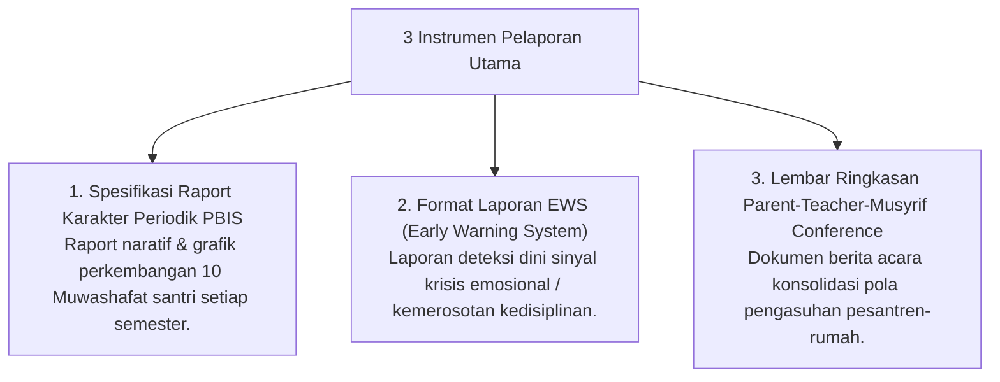

# P11-07: Instrumen Pelaporan Periodik

## Status Dokumen
* **Status**: 🌟 **A+ (Tervalidasi & Siap Diimplementasikan)**
* **Sub-Domain**: `11 Tools / 07 Reporting Tools`
* **Penanggung Jawab Keilmuan**: Dewan Keilmuan TUMBUH (*Pakar Metodologi Riset & Pakar Arsitektur Digital Pesantren*)

---

## 1. Konseptualisasi Reporting Tools Pesantren

Instrumen Pelaporan (*Reporting Tools*) menyajikan rangkuman perkembangan karakter & akademik santri secara berkala bagi Wali Santri, Pimpinan, dan Tim Pengasuh:

---

## 2. Penyampaian Berorientasi Penguatan

Pelaporan disusun dengan narasi penguatan (*Growth-Mindset Language*), menghargai setiap kemajuan kecil yang dicapai santri.
