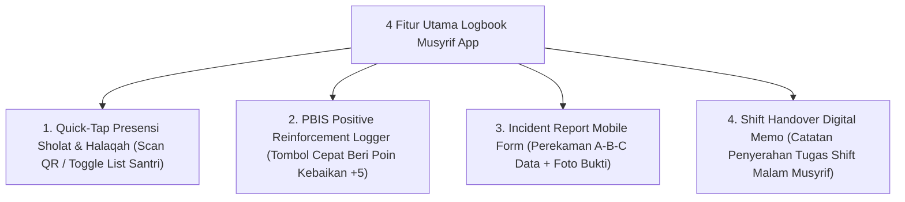

# P11-08-01: Spesifikasi Aplikasi Logbook Musyrif Mobile App

## Status Dokumen
* **Status**: 🌟 **A+ (Tervalidasi & Siap Diimplementasikan)**
* **Sub-Domain**: `11 Tools / 08 Digital Tools`
* **Penanggung Jawab Keilmuan**: Dewan Keilmuan TUMBUH (*Pakar Arsitektur Digital Pesantren & Pakar Pengasuhan Asrama*)

---

## 1. Operasionalisasi Fitur & UI/UX Logbook Musyrif App

Aplikasi didesain ringkas dengan filosofi **3-Tap Entry System** agar Musyrif dapat mencatat data dalam kurun waktu kurang dari 30 detik:

---

## 2. Fitur Offline Syncing

Aplikasi mendukung penyimpanan data lokal (*Offline First Architecture*), secara otomatis mengunggah data saat perangkat kembali terhubung ke jaringan internet.
