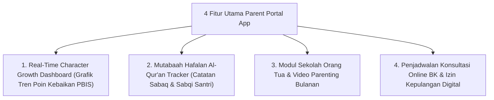

# P11-08-02: Spesifikasi Parent Portal Digital App

## Status Dokumen
* **Status**: 🌟 **A+ (Tervalidasi & Siap Diimplementasikan)**
* **Sub-Domain**: `11 Tools / 08 Digital Tools`
* **Penanggung Jawab Keilmuan**: Dewan Keilmuan TUMBUH (*Pakar Arsitektur Digital Pesantren & Pakar Bimbingan Konseling*)

---

## 1. Operasionalisasi Fitur Parent Portal Digital App

Parent Portal menjembatani hubungan informasi pengasuhan secara transparan antara Pesantren dan Rumah:

---

## 2. Kemudahan Transparansi Positif

Orang tua menerima notifikasi ponsel berbasis pesan apresiasi (*Positive Push Notifications*) ketika santri memperoleh pengakuan poin kebaikan dari Musyrif.
