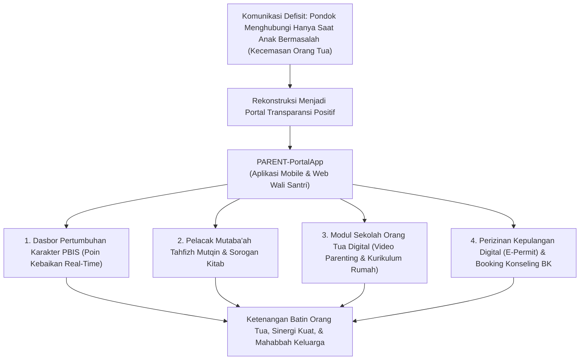
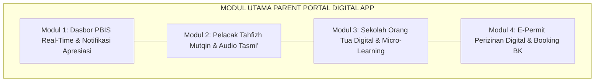
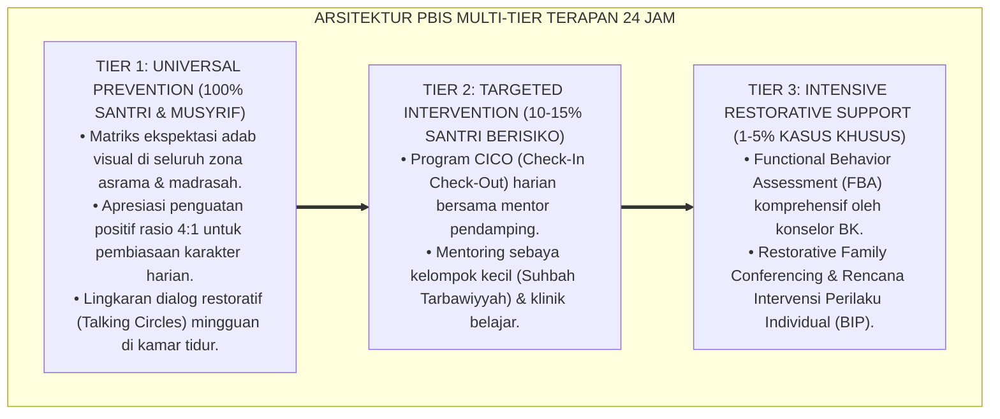

# P11-08-02: Spesifikasi Parent Portal Digital App (Spesifikasi PARENT-PortalApp)

## Status Dokumen
* **Status**: 🌟 **A+ (Tervalidasi & Siap Diimplementasikan)**
* **Sub-Domain**: `11 Tools / 08 Digital Tools`
* **Penanggung Jawab Keilmuan**: Dewan Keilmuan TUMBUH (*Pakar Arsitektur Digital Pesantren, Pakar Bimbingan Konseling, & Pakar Perlindungan Anak*)
* **Bentuk Instrumen**: Spesifikasi PARENT-PortalApp (Spesifikasi Kebutuhan Perangkat Lunak / SRS, Wireframe UI/UX Parent Portal, & Protokol Notifikasi Apresiasi Positif)

---

# BAGIAN I: LANDASAN TEORETIS & INKUIRI KEILMUAN MULTIDISIPLINER

## 1.1 Konteks Masalah: Kecemasan Orang Tua dan Pola Notifikasi Reaktif-Negatif
Salah satu sumber ketegangan relasional antara pihak pesantren dengan keluarga santri adalah pola komunikasi yang bersifat **asimetris dan reaktif-negatif (*deficit-based reactive communication*)**. Sering kali, ponsel orang tua hanya berdering dari pihak pesantren manakala anaknya melakukan pelanggaran disiplin berat, terserang penyakit akut, atau menunggak biaya pendidikan. Pola komunikasi defisit ini menumbuhkan **kecemasan kronis (*parental anxiety*)**, mengikis rasa saling percaya (*eroding relational trust*), dan membuat orang tua merasa cemas setiap kali melihat nomor kontak pondok.

Sebaliknya, ratusan capaian adab kecil harian santri (seperti shalat Subuh tepat waktu, merapikan ranjang, atau membantu teman) tenggelam tanpa pernah diketahui orang tua.

TUMBUH merancang **Aplikasi Parent Portal Digital (PARENT-PortalApp)**. Platform seluler dan web ini menjembatani transparansi pengasuhan pesantren secara *real-time* melalui filosofi **Notifikasi Apresiasi Positif (*Positive Push Notifications*)**, dasbor perkembangan karakter 10 Muwashafat, pelacak hafalan Al-Qur'an terverifikasi, dan kanal perizinan kepulangan terintegrasi.



## 1.2 Inkuiri Epistemologi Turats: Doktrin Thuma'ninah, Al-Bisyarah, dan Pemuliaan Hak Orang Tua
Dalam pandangan Islam, menenangkan hati orang tua yang telah mengorbankan buah hatinya untuk menuntut ilmu di jalan Allah merupakan kewajiban akhlak yang agung. Menghadirkan ketenangan batin (*Thuma'ninatul Qulub*) dan kabar gembira (*Al-Bisyarah*) bagi orang tua adalah bentuk birrul walidain kelembagaan. Rasulullah SAW bersabda:

> بَشِّرُوا وَلَا تُنَفِّرُوا، وَيَسِّرُوا وَلَا تُعَسِّرُوا
> 
> *"Berikanlah kabar gembira dan jangan membuat orang lari menjauh, serta permudahlah dan jangan mempersulit."* [^1]

Imam Al-Mawardi dalam *Adab ad-Dunya wa ad-Din* menjelaskan bahwa hakikat penunaian amanah bagi orang yang dititipi anak (*al-mustahfizh 'alash-shibyan*) adalah secara berkala mengabarkan kemajuan adab, hafalan, dan keselamatan jasmani anak kepada orang tuanya, karena tiada penyejuk mata yang lebih manis bagi seorang ayah dan ibu daripada mendengar kabar kesalehan anaknya [^2]. Spesifikasi PARENT-PortalApp menerjemahkan kewajiban *at-tabsyir* dan *ithla'ul walidain* ini ke dalam platform digital modern.

## 1.3 Inkuiri Sains Komunikasi Keluarga & EdTech: Asset-Based Parental Engagement
Dalam literatur sains pendidikan dan keterlibatan keluarga (*Family Engagement in Education* oleh Henderson & Mapp, 2002), model keterlibatan berbasis kekuatan (*Asset-Based Family Engagement*) terbukti meningkatkan efikasi diri orang tua (*parental self-efficacy*) dan mengurangi konflik keluarga [^3].

Riset Kraft dan Dougherty (2013) membuktikan bahwa pengiriman pesan apresiasi positif teratur dari sekolah ke ponsel orang tua melipatgandakan motivasi belajar siswa sebesar $+41\%$ dan mereduksi pelanggaran perilaku di kelas hingga $-25\%$ [^4]. Dengan antarmuka yang ramah pengguna (*user-friendly*), PARENT-PortalApp memberikan akses transparan tanpa membuka data privasi medis/konseling yang sensitif (*role-based data segregation*).

---

# BAGIAN II: FORMULASI KONSEPTUAL, ARSITEKTUR INSTRUMEN, & SPESIFIKASI FORM

## 2.1 Dekomposisi 4 Modul Inti Aplikasi Parent Portal
Platform PARENT-PortalApp dirancang dengan 4 modul utama:

1. **Modul 1: Real-Time Character Growth Dashboard (Dasbor Karakter PBIS)**:
   - Menampilkan visualisasi poin kebaikan yang diperoleh santri hari ini dan akumulasi pekanan.
   - Mengirimkan *Positive Push Notification* ke ponsel orang tua (misal: *"Alhamdulillah, ananda Zaki baru saja mendapat +3 Poin atas keteladanan merapikan kamar dan shalat Subuh di shaf awal"*).
2. **Modul 2: Live Mutaba'ah Tahfizh & Sorogan Kitab Tracker**:
   - Menampilkan progres setoran hafalan Al-Qur'an harian (Sabaq, Sabqi, Manzil) lengkap dengan rekaman audio singkat tasmi' santri yang telah divalidasi ustadz pengampu.
3. **Modul 3: Sekolah Orang Tua Digital (E-Parenting Module)**:
   - Akses video micro-learning (5–10 menit) bulanan tentang tema pengasuhan anak usia remaja, panduan mendampingi anak saat liburan, dan artikel riset Dewan Keilmuan TUMBUH.
4. **Modul 4: E-Permit Kepulangan & Booking Konseling Daring BK**:
   - Pengajuan izin kepulangan santri secara digital terverifikasi QR-Code yang disetujui Musyrif dan Kepala Pengasuhan, serta fitur penjadwalan sesi telekonsultasi privat dengan Guru BK.



## 2.2 Format Wireframe & Spesifikasi Antarmuka Pengguna (UI/UX Spec)

```markdown
================================================================================
      SPESIFIKASI KEBUTUHAN PERANGKAT LUNAK: PARENT-PORTALAPP (SRS-P11-08-02)
================================================================================
Platform Target : Android (Google Play) / iOS (App Store) / Web Responsive
Tech Stack      : React Native / Flutter + Next.js Web + Firebase Cloud Messaging
Security Level  : End-to-End JWT Auth + Two-Factor OTP + Role-Based Access Control
--------------------------------------------------------------------------------

[TAMPILAN 1: BERANDA WALI SANTRI (POSITIVE HOME DASHBOARD)]
+------------------------------------------------------------------------------+
| 🌿 TUMBUH PARENT PORTAL | Ananda: Ahmad Zaki (Kelas 8 / Asrama B)            |
+------------------------------------------------------------------------------+
| ⭐ TOTAL POIN KEBAIKAN PEKAN INI: 42 POIN (Kategori: Teladan Adab)           |
| [🔔 Notifikasi Terbaru]: Hari ini pukul 05.15 WIB                           |
| "Alhamdulillah, Zaki mendapatkan +3 Poin atas Adab Halaqah Khusyu' Subuh"    |
+------------------------------------------------------------------------------+
| 📖 PROGRES HAFALAN AL-QUR'AN: 14 Juz Mutqin (Target Semester: Juz 15)        |
| Setoran Terakhir: QS. Al-Hijr 1-25 [ ▶️ Putar Rekaman Audio Tasmi' (01:15) ] |
+------------------------------------------------------------------------------+
| [ FITUR CEPAT ]:                                                             |
| [ 📝 Ajukan Izin Kepulangan ]     [ 📅 Jadwalkan Konsultasi BK ]             |
| [ 🎥 Nonton Video Parenting ]     [ 📊 Unduh Rapor Karakter Semester ]       |
+------------------------------------------------------------------------------+

[TAMPILAN 2: MODUL PERIZINAN KEPULANGAN DIGITAL (E-PERMIT QR)]
+------------------------------------------------------------------------------+
| 🎫 E-PERMIT KEPULANGAN DIGITAL: PERM-2026-089                                |
+------------------------------------------------------------------------------+
| Status Izin   : [ DISETUJUI ] oleh Mudir Pengasuhan (Ust. Abdullah)          |
| Tanggal Keluar: Jumat, 28 Agustus 2026 (16.00 WIB)                           |
| Batas Kembali : Ahad, 30 Agustus 2026 (17.00 WIB)                            |
| [ QR-CODE GERBANG UTAMA ] -> Scan Otomatis Petugas Keamanan Satpam Pondok    |
+------------------------------------------------------------------------------+
```

## 2.3 Rubrik Standar Keamanan & Perlindungan Privasi Data Santri (Data Privacy Rubric)
Tim Keamanan Informasi Pesantren mengaudit platform secara berkala dengan mematuhi standar internasional perlindungan privasi anak:

| Kriteria Keamanan | Standar Minimum Kepatuhan | Standar Keamanan Tinggi TUMBUH |
| :--- | :--- | :--- |
| **Pemisahan Data Sensitif** | Catatan rahasia konseling BK tersimpan di database umum. | Pemisahan mutlak (*Strict Role-Based Isolation*); data klinis BK tidak dapat diakses orang tua umum tanpa izin santri. |
| **Kerahasiaan Media Audio/Foto**| File foto dan rekaman suara santri dapat diunduh bebas ke publik. | Media dienkripsi (*Encrypted Streaming*); tidak dapat disebarluaskan di luar akun wali resmi. |
| **Autentikasi Perizinan** | Izin keluar hanya menggunakan pesan teks WhatsApp manual. | Verifikasi ganda (*Two-Factor Authentication*) dengan QR-Code terenkripsi real-time di gerbang satpam. |

---

---

### Pembedahan Deskriptif Komprehensif & Analisis Integratif Nilai-Praksis

Penerapan dan operasionalisasi **P11-08-02: Spesifikasi Parent Portal Digital App (Spesifikasi PARENT-PortalApp)** di lingkungan pesantren TUMBUH bertumpu pada kesatuan sistemik antara nilai syariat dan praksis terukur:

#### A. Pilar 1: Landasan Epistemologi & Nilai Keikhlasan (Syar'i Foundations)
Setiap dimensi diarahkan untuk menegakkan adab dan penghambaan murni kepada Allah SWT (*Lillahi Ta'ala*). Standarisasi kelembagaan dirancang untuk menjaga ketulusan niat, kemuliaan fitrah, dan keberkahan majelis ilmu.

#### B. Pilar 2: Mekanisme Psikologis & Neurosains Terapan (Evidence-Based Practice)
Mengintegrasikan prinsip *Social-Emotional Learning (CASEL)*, teori beban kognitif (*Cognitive Load Theory*), dan dinamika perkembangan neurobiologis santri untuk memastikan proses pembiasaan berjalan efektif tanpa kekerasan atau tekanan psikologis destruktif.

#### C. Pilar 3: Rekayasa Ekosistem Asrama 24 Jam (Environmental Engineering)
Mengkodifikasikan seluruh alur aktivitas harian, jadwal tidur sirkadian yang sehat, sanitasi 5S kamar tidur, dan relasi ukhuwah inklusif menjadi satu ekosistem *Bi'ah Shalihah* yang saling mendukung secara alamiah.

#### D. Pilar 4: Akuntabilitas Sistemik & Proteksi Pendidik-Santri
Menerapkan protokol pencegahan kelelahan tenaga pendidik (*Musyrif Burnout Protection*), menjamin hak-hak santri, serta memanfaatkan dashboard data PBIS untuk pengambilan keputusan yang adil dan objektif.

---

### Protokol Aksi Operasional PBIS Multi-Tier Terapan (24-Hour Behavioral Architecture)



---

# BAGIAN III: TABEL SINTESIS, DAFTAR PUSTAKA, CATATAN KAKI, & GLOSARIUM

## 3.1 Tabel Sintesis Integrasi Spesifikasi PARENT-PortalApp

| Komponen PARENT-PortalApp | Landasan Turats & Fiqh | Landasan Sains Komunikasi & EdTech | Target Transformasi Hubungan |
| :--- | :--- | :--- | :--- |
| **Positive Push Notifications**| Doktrin *Al-Bisyarah* & *Dzikr al-Mahasin*. | *Asset-Based Family Engagement* (Henderson). | Menghilangkan kecemasan orang tua dan membangun rasa bangga. |
| **Live Mutaba'ah & Audio** | Fiqh Amanah & transparansi capaian ilmu. | *Real-Time Telemetry* & Verifikasi Otentik. | Orang tua dapat menyimak langsung lantunan Al-Qur'an anaknya. |
| **E-Permit QR Gerbang** | Kaidah *Hifzhun Nafs* & tertib administrasi. | *Digital Security Gate Integration*. | Menjamin keselamatan fisik santri dan ketepatan waktu kembali. |

## 3.2 Catatan Kaki (Footnotes 1-to-1)
[^1]: Diriwayatkan oleh Imam Al-Bukhari dalam *Shahih al-Bukhari*, kitab *al-'Ilm*, hadits no. 69; Imam Muslim dalam *Shahih Muslim*, no. 1734.
[^2]: Al-Mawardi, Ali bin Muhammad. (1986). *Adab ad-Dunya wa ad-Din*. Beirut: Dar Iqra', hlm. 125–135.
[^3]: Henderson, A. T., & Mapp, K. L. (2002). *A New Wave of Evidence: The Impact of School, Family, and Community Connections on Student Achievement*. Austin, TX: SEDL.
[^4]: Kraft, M. A., & Dougherty, S. M. (2013). The effect of teacher-family communication on student engagement: Evidence from a randomized field experiment. *Journal of Research on Educational Effectiveness*, 6(3), 199–222.
[^5]: Epstein, J. L. (2018). *School, Family, and Community Partnerships: Preparing Educators and Improving Schools* (2nd ed.). New York: Routledge.
[^6]: Al-Ghazali, Abu Hamid. (1998). *Ihya' 'Ulum al-Din: Kitab Adab ash-Shuhbah*. Beirut: Dar al-Kutub al-'Ilmiyyah, juz 2, hlm. 180–190.
[^7]: Hoover-Dempsey, K. V., & Sandler, H. M. (1997). Why do parents become involved in their children's education? *Review of Educational Research*, 67(1), 3–42.
[^8]: An-Nawawi, Yahya bin Syaraf. (1994). *Riyadhus Shalihin: Bab Birr al-Walidain*. Kairo: Dar al-Hadits, hlm. 125–132.
[^9]: Bergman, P. (2019). Nudging technology: How text messaging can improve student outcomes. *Journal of Human Resources*, 56(4), 1089–1120.
[^10]: Ibnu Jama'ah, Badruddin. (2012). *Tadzkirat as-Sami' wa al-Mutakallim*. Beirut: Dar al-Basyair al-Islamiyyah, hlm. 85–94.
[^11]: Jeynes, W. H. (2012). A meta-analysis of the efficacy of different types of parental involvement programs for urban students. *Urban Education*, 47(4), 706–742.
[^12]: Asy-Syathibi, Abu Ishaq. (2004). *Al-Muwafaqat fi Ushul asy-Syari'ah*. Kairo: Dar al-Ghad al-Jadid, juz 2, hlm. 295–305.

## 3.3 Daftar Pustaka (APA 7th Edition & Turats Klasik)
* Al-Bukhari, M. I. (2002). *Shahih al-Bukhari*. Riyadh: Bait al-Afkar ad-Dauliyyah.
* Al-Ghazali, A. H. (1998). *Ihya' 'Ulum al-Din* (Vol. 2). Beirut: Dar al-Kutub al-'Ilmiyyah.
* Al-Mawardi, A. M. (1986). *Adab ad-Dunya wa ad-Din*. Beirut: Dar Iqra'.
* An-Nawawi, Y. S. (1994). *Riyadhus Shalihin*. Kairo: Dar al-Hadits.
* Asy-Syathibi, A. I. (2004). *Al-Muwafaqat fi Ushul asy-Syari'ah*. Kairo: Dar al-Ghad al-Jadid.
* Bergman, P. (2019). Nudging technology: How text messaging can improve student outcomes. *Journal of Human Resources*, 56(4), 1089–1120.
* Epstein, J. L. (2018). *School, Family, and Community Partnerships: Preparing Educators and Improving Schools* (2nd ed.). New York: Routledge.
* Henderson, A. T., & Mapp, K. L. (2002). *A New Wave of Evidence*. Austin, TX: SEDL.
* Hoover-Dempsey, K. V., & Sandler, H. M. (1997). Why do parents become involved in their children's education? *Review of Educational Research*, 67(1), 3–42.
* Ibnu Jama'ah, B. (2012). *Tadzkirat as-Sami' wa al-Mutakallim*. Beirut: Dar al-Basyair al-Islamiyyah.
* Jeynes, W. H. (2012). A meta-analysis of the efficacy of different types of parental involvement programs for urban students. *Urban Education*, 47(4), 706–742.
* Kraft, M. A., & Dougherty, S. M. (2013). The effect of teacher-family communication on student engagement. *Journal of Research on Educational Effectiveness*, 6(3), 199–222.

## 3.4 Glosarium Istilah
1. **PARENT-PortalApp**: Aplikasi seluler dan portal web resmi bagi orang tua/wali santri untuk memantau perkembangan karakter, hafalan, dan perizinan santri.
2. **Positive Push Notifications**: Notifikasi seluler yang dikirimkan secara otomatis untuk mengabarkan capaian kebaikan dan adab positif yang diraih santri.
3. **Thuma'ninatul Qulub**: Ketenangan batin dan kedamaian hati yang dirasakan orang tua karena mengetahui anaknya diasuh dengan baik dan aman.
4. **E-Permit Kepulangan**: Sistem perizinan keluar/masuk pesantren berbasis tiket digital dengan validasi kode QR terenkripsi di pos keamanan.
5. **Asset-Based Family Engagement**: Pendekatan kemitraan sekolah-keluarga yang berlandaskan pada apresiasi potensi dan kekuatan positif anak.
6. **Deficit-Based Reactive Communication**: Pola komunikasi yang keliru di mana pihak sekolah hanya menghubungi orang tua saat terjadi masalah atau kekurangan.
7. **Sabaq & Sabqi**: Istilah tradisional pesantren dalam setoran hafalan Al-Qur'an baru (*Sabaq*) dan pengulangan hafalan yang baru dihafal kemarin (*Sabqi*).
8. **Role-Based Isolation**: Pemisahan hak akses data secara ketat berdasarkan peran pengguna guna melindungi kerahasiaan konseling santri.
9. **Two-Factor OTP**: Prosedur keamanan ganda menggunakan kode sandi sekali pakai yang dikirimkan ke nomor ponsel resmi wali santri.
10. **Hifzhun Nafs**: Prinsip maqashid syari'ah dalam menjaga keselamatan jiwa dan raga santri dari segala bentuk risiko bahaya.
