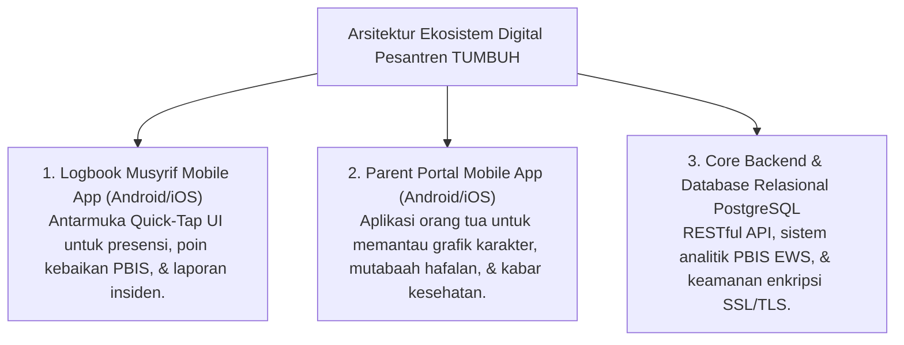

# P11-08: Arsitektur Perangkat Digital PBIS

## Status Dokumen
* **Status**: 🌟 **A+ (Tervalidasi & Siap Diimplementasikan)**
* **Sub-Domain**: `11 Tools / 08 Digital Tools`
* **Penanggung Jawab Keilmuan**: Dewan Keilmuan TUMBUH (*Pakar Arsitektur Digital Pesantren & Pakar PBIS*)

---

## 1. Konseptualisasi Digital Tools Pesantren

Arsitektur Perangkat Digital (*Digital Tools*) menyediakan infrastruktur teknologi modern berbasis cloud & mobile untuk mendukung pencatatan 24-jam tanpa hambatan teknis:

---

## 2. Keamanan Data & Etika Privasi Santri

Sistem digital dilengkapi dengan hak akses berbasis peran (RBAC - Role-Based Access Control) untuk menjamin data pribadi dan catatan konseling santri tidak bocor ke publik.
