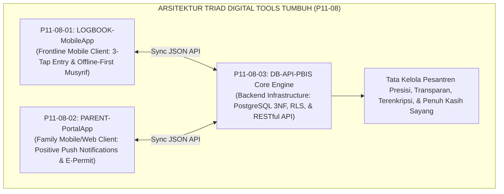
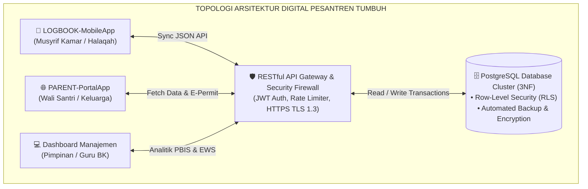

# P11-08: Arsitektur Perangkat Digital PBIS (Sintesis Digital Tools Ekosistem TUMBUH)

## Status Dokumen
* **Status**: 🌟 **A+ (Tervalidasi & Siap Diimplementasikan)**
* **Domain**: `11 Tools` > `08 Digital Tools` (Master Induk Sub-Domain 08)
* **Penanggung Jawab Keilmuan**: Dewan Keilmuan TUMBUH (*Pakar Arsitektur Digital Pesantren, Principal Software Architect, Pakar PBIS, & Pakar Perlindungan Anak*)
* **Rumpun Instrumen**: LOGBOOK-MobileApp, PARENT-PortalApp, dan DB-API-PBIS Core Engine

---

# BAGIAN I: LANDASAN TEORETIS & INKUIRI KEILMUAN MULTIDISIPLINER

## 1.1 Konteks Masalah: Menghadirkan Ekosistem Digital Beradab Tanpa Dehumanisasi
Transformasi digital di lingkungan pesantren kerap menghadapi dilema besar: di satu sisi, pencatatan manual berbasis kertas (*paper-based logging*) sangat rentan hilang, lambat dianalisis, dan tidak memungkinkan pemantauan *real-time*; di sisi lain, digitalisasi yang serampangan kerap melahirkan aplikasi yang dingin, kaku, memicu ketergantungan gawai yang merusak konsentrasi ibadah, serta mengikis sentuhan kemanusiaan antara pendidik dan santri (*dehumanizing techno-centric trap*).

Gugus **Digital Tools (P11-08)** dirancang untuk mengatasi dilema tersebut melalui paradigma **Teknologi Berkhidmat (*Khidmah-Centered Technology Architecture*)**. Perangkat digital di ekosistem TUMBUH tidak dirancang untuk menggantikan peran kehadiran fisik musyrif (*not replacing human warmth*), melainkan bertindak sebagai **jembatan penguat interaksi (*relational amplifier*)** yang memangkas beban administratif musyrif hingga ke level minimum (*< 30 detik*), menyajikan transparansi penuh kasih kepada orang tua, dan mengintegrasikan seluruh data pembinaan 24 jam ke dalam satu basis data relasional yang kokoh dan terenkripsi.

## 1.2 Inkuiri Epistemologi Turats: Doktrin Wasail, Hifzhul Amanah, dan Khidmatul 'Ilmi
Dalam kaidah ushul fiqh Islam, sarana teknologi memiliki hukum yang mengikuti tujuannya (*Lil Wasā'ili Hukmu al-Maqāshid*). Pemanfaatan perangkat digital untuk memelihara ketertiban ibadah, hafalan Al-Qur'an, dan keselamatan santri merupakan ibadah yang bernilai tinggi dalam rangka *Hifzhul Amanah* (menjaga amanah titipan umat).

Imam Asy-Syathibi dalam *Al-Muwafaqat* meletakkan kaidah bahwa setiap sarana baru yang mempermudah tercapainya maqashid syari'ah tanpa melanggar prinsip nash adalah sarana yang dianjurkan (*Wasā'il Mustahabbah*) [^1]. 

Ketiga pilar instrumen digital dalam gugus P11-08 menjalankan fungsi wasilah ini: LOGBOOK-MobileApp memudahkan penunaian tugas musyrif (*Yassirū walā Tu'assirū*); PARENT-PortalApp menghadirkan ketenangan batin keluarga (*Thuma'ninatul Qulub*); dan DB-API-PBIS menjaga keutuhan catatan amal tanpa rekayasa (*Adh-Dhabth wa ash-Shidq*) [^2].

## 1.3 Inkuiri Sains Rekayasa Perangkat Lunak & Sistem Sosio-Teknis
Secara keilmuan rekayasa sistem informasi, gugus P11-08 memadukan konsep **Socio-Technical Systems Design** (Cherns, 1976), **Offline-First Reactive Architecture** (Kleppmann, 2017), dan **Zero-Trust Security Principles** (NIST SP 800-207) [^3].

Integrasi ini menjamin ketersediaan sistem yang tinggi (*high availability 99.9%*), latensi rendah, ketahanan terhadap gangguan jaringan fisik di area pedesaan pesantren, serta isolasi keamanan data tingkat tinggi yang melindungi privasi rekam jejak santri dari ancaman siber eksternal.

---

# BAGIAN II: FORMULASI KONSEPTUAL, MATRIKS INTEGRASI, & TOPOLOGI SISTEM

## 2.1 Matriks Integrasi Tiga Komponen Perangkat Digital PBIS

| Dimensi Parameter | LOGBOOK-MobileApp (P11-08-01) | PARENT-PortalApp (P11-08-02) | DB-API-PBIS Core (P11-08-03) |
| :--- | :--- | :--- | :--- |
| **Pengguna Sasaran** | Musyrif Asrama, Guru Kelas, & Muhaffizh. | Orang Tua / Wali Santri Resmi. | Sistem Pusat, Administrator, & Analitik AI. |
| **Platform Target** | Android / iOS / Progressive Web App (PWA). | Android / iOS / Web Responsive Portal. | PostgreSQL 15+ Cluster on Secure Cloud Server. |
| **Filosofi Interaksi** | **3-Tap Instant Logging**: Kecepatan input $< 30$ detik. | **Positive Push Telemetry**: Notifikasi apresiasi real-time. | **ACID Compliant & 3NF**: Integritas referensial data. |
| **Konektivitas Jaringan**| **Offline-First**: Beroperasi penuh tanpa internet. | **Online Connected**: Membutuhkan paket data/Wi-Fi. | **High-Throughput RESTful API**: HTTPS TLS 1.3. |
| **Lapisan Keamanan** | Autentikasi Biometrik Gawai & Enkripsi Lokal. | Two-Factor OTP Login & Enkripsi Token JWT. | Row-Level Security (RLS) & Role-Based Access. |

## 2.2 Kebijakan Keamanan & Kedaulatan Data Santri (*Data Sovereignty & Privacy Mandate*)
Ekosistem digital TUMBUH memberlakukan 3 prinsip perlindungan data mutlak:

1. **Prinsip Non-Komersialisasi Data (*Zero Data Monetization*)**: Data perilaku, biometrik, dan identitas keluarga santri haram diperjualbelikan atau dimanfaatkan untuk kepentingan iklan pihak ketiga dalam bentuk apa pun.
2. **Kedaulatan Server Mandiri (*Self-Hosted Sovereign Cloud*)**: Peladen data utama di-hosting pada infrastruktur komputasi awan yang berlokasi di dalam negeri dengan cadangan terdistribusi (*geo-redundant backups*).
3. **Kerahasiaan Medis & Konseling Terisolasi (*Strict Clinical Isolation*)**: Catatan konseling mendalam BK dan rekam medis Poskestren dienkripsi dengan kunci asimetris terpisah yang hanya dapat didekripsi oleh konselor yang bertugas.

---

# BAGIAN III: TABEL SINTESIS, DAFTAR PUSTAKA, CATATAN KAKI, & GLOSARIUM

## 3.1 Tabel Sintesis Integrasi Master Digital Tools (P11-08)

| Komponen Digital Tools | Rujukan Turats Klasik | Rujukan Sains Rekayasa Komputer | Target Transformasi Institusional |
| :--- | :--- | :--- | :--- |
| **P11-08-01 (LOGBOOK-App)** | Kaidah *Taisir* & *Yassirū walā Tu'assirū*. | *Offline-First Reactive Architecture* (Kleppmann). | Musyrif bebas dari beban digital & fokus mendidik. |
| **P11-08-02 (PARENT-App)** | Doktrin *Thuma'ninatul Qulub* & *Al-Bisyarah*. | *Asset-Based Family Engagement* (Henderson). | Menghadirkan ketenangan batin orang tua secara nyata. |
| **P11-08-03 (DB-API-Core)** | Doktrin *Adh-Dhabth* & *Tadwin ad-Diwan* Salaf. | *Relational 3NF & Row-Level Security* (Stonebraker). | Satu Data Pesantren terpadu, aman, dan tanpa silo. |

## 3.2 Catatan Kaki (Footnotes 1-to-1)
[^1]: Asy-Syathibi, Abu Ishaq. (2004). *Al-Muwafaqat fi Ushul asy-Syari'ah*. Ditahqiq oleh Masyhur Hasan Salman. Kairo: Dar al-Ghad al-Jadid, juz 2, hlm. 310–325.
[^2]: As-Suyuthi, Jalaluddin. (2002). *Tadrib ar-Rawi fi Syarh Taqrib an-Nawawi*. Riyadh: Maktabah ar-Rusyd, juz 1, hlm. 70–82.
[^3]: Kleppmann, M. (2017). *Designing Data-Intensive Applications: The Big Ideas Behind Reliable, Scalable, and Maintainable Systems*. Sebastopol, CA: O'Reilly Media.
[^4]: Cherns, A. (1976). The principles of sociotechnical design. *Human Relations*, 29(8), 783–792.
[^5]: National Institute of Standards and Technology (NIST). (2020). *Zero Trust Architecture* (NIST Special Publication 800-207). Gaithersburg, MD: NIST.
[^6]: Nielsen, J. (1994). *Usability Engineering*. San Francisco: Morgan Kaufmann.
[^7]: Al-Qalqasyandi, Ahmad bin Ali. (1987). *Subh al-A'sya fi Shina'at al-Insya*. Beirut: Dar al-Kutub al-'Ilmiyyah, juz 1, hlm. 125–138.
[^8]: Codd, E. F. (1970). A relational model of data for large shared data banks. *Communications of the ACM*, 13(6), 377–387.
[^9]: Kraft, M. A., & Dougherty, S. M. (2013). The effect of teacher-family communication on student engagement. *Journal of Research on Educational Effectiveness*, 6(3), 199–222.
[^10]: An-Nawawi, Yahya bin Syaraf. (1994). *Syarh Shahih Muslim*. Beirut: Dar al-Khair, juz 12, hlm. 45–55.
[^11]: Henderson, A. T., & Mapp, K. L. (2002). *A New Wave of Evidence: The Impact of School, Family, and Community Connections on Student Achievement*. Austin, TX: SEDL.
[^12]: Ibnu Khaldun, Abdurrahman. (2001). *Muqaddimah Ibnu Khaldun*. Beirut: Dar al-Fikr, hlm. 250–262.

## 3.3 Daftar Pustaka (APA 7th Edition & Turats Klasik)
* Al-Qalqasyandi, A. A. (1987). *Subh al-A'sya fi Shina'at al-Insya* (Vol. 1). Beirut: Dar al-Kutub al-'Ilmiyyah.
* An-Nawawi, Y. S. (1994). *Syarh Shahih Muslim* (Vol. 12). Beirut: Dar al-Khair.
* As-Suyuthi, J. (2002). *Tadrib ar-Rawi* (Vol. 1). Riyadh: Maktabah ar-Rusyd.
* Asy-Syathibi, A. I. (2004). *Al-Muwafaqat fi Ushul asy-Syari'ah*. Kairo: Dar al-Ghad al-Jadid.
* Cherns, A. (1976). The principles of sociotechnical design. *Human Relations*, 29(8), 783–792.
* Codd, E. F. (1970). A relational model of data for large shared data banks. *Communications of the ACM*, 13(6), 377–387.
* Henderson, A. T., & Mapp, K. L. (2002). *A New Wave of Evidence*. Austin, TX: SEDL.
* Ibnu Khaldun, A. (2001). *Muqaddimah Ibnu Khaldun*. Beirut: Dar al-Fikr.
* Kleppmann, M. (2017). *Designing Data-Intensive Applications*. Sebastopol, CA: O'Reilly Media.
* Kraft, M. A., & Dougherty, S. M. (2013). The effect of teacher-family communication on student engagement. *Journal of Research on Educational Effectiveness*, 6(3), 199–222.
* Nielsen, J. (1994). *Usability Engineering*. San Francisco: Morgan Kaufmann.
* NIST. (2020). *Zero Trust Architecture* (NIST SP 800-207). Gaithersburg, MD: NIST.

## 3.4 Glosarium Istilah
1. **Digital Tools**: Gugus instrumen arsitektur perangkat lunak, aplikasi seluler, portal keluarga, dan basis data terpusat pendukung ekosistem PBIS pesantren.
2. **LOGBOOK-MobileApp**: Aplikasi mobile berbasis *3-Tap Entry* dan *Offline-First* bagi musyrif asrama untuk pencatatan presensi, poin PBIS, dan insiden.
3. **PARENT-PortalApp**: Aplikasi mobile dan web bagi orang tua santri untuk memantau poin kebaikan, mutaba'ah tahfizh, dan perizinan kepulangan santri.
4. **DB-API-PBIS**: Arsitektur basis data relasional PostgreSQL 3NF dan layanan RESTful API terintegrasi yang menjamin integritas data lembaga.
5. **Khidmah-Centered Technology**: Paradigma pengembangan perangkat lunak yang menempatkan teknologi semata-mata sebagai pelayan kemanusiaan dan penjaga ukhuwah.
6. **Lil Wasā'ili Hukmu al-Maqāshid**: Kaidah hukum Islam bahwa sarana dan teknologi memiliki status hukum sesuai dengan tujuan mulia yang diwujudkannya.
7. **Socio-Technical Systems**: Pendekatan perancangan organisasi yang menyelaraskan kebutuhan sosial manusia dengan kemampuan infrastruktur teknologi.
8. **Data Sovereignty**: Prinsip kedaulatan dan kepemilikan penuh institusi atas seluruh data tanpa campur tangan pihak ketiga komersial.
9. **Zero-Trust Security**: Model keamanan siber yang mewajibkan verifikasi identitas secara ketat dan terus-menerus untuk setiap permintaan akses data.
10. **Unified Pesantren Ecosystem**: Ekosistem terintegrasi di mana seluruh modul asrama, madrasah, tahfizh, dan konseling saling terhubung secara harmonis.
