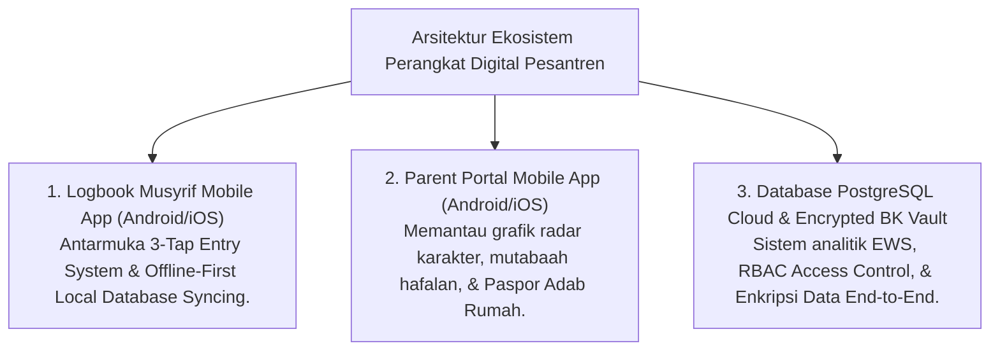

# MONOGRAF RISET AKADEMIK: INSTRUMEN OPERASIONAL DAN ARSITEKTUR DIGITAL PESANTREN
## Evaluasi Sistem Informasi: Rubrik 10 Muwashafat, Logbook Musyrif Mobile App, Parent Portal App, Spesifikasi Offline-First Syncing, dan Cybersecurity Database BK

**Dewan Riset & Keilmuan Ekosistem TUMBUH**  
*Dipublikasikan sebagai Naskah Monograf Riset Ilmiah (Jurnal Sistem Informasi & Perangkat Pendidikan Pesantren)*  
*Dokumen Rujukan Induk: Domain 11 Tools & Book Series Volume 05*

---

## ABSTRAK

> **Latar Belakang**: Ketiadaan instrumen terstandar dan perangkat digital yang ramah pengguna (*low-friction*) sering membuat pengasuhan asrama 24-jam terhambat beban administrasi manual. Di sisi lain, keterbatasan jaringan internet di pesantren daerah dan risiko kebocoran data privasi konseling BK menuntut arsitektur teknologi yang tangguh (*robust*).
>
> **Tujuan Penelitian**: Merumuskan taksonomi **Tools & Arsitektur Digital**, merancang spesifikasi *Offline-First Syncing*, dan menetapkan protokol keamanan data *Cyber-Security* untuk database BK & catatan konseling santri.
>
> **Hasil Riset**: Terstruktur 8 Sub-Domain Tools & Digital Architecture: (1) **Assessment Tools**; (2) **Observation Tools**; (3) **Reflection Tools**; (4) **Coaching Tools**; (5) **Mentoring Tools**; (6) **Documentation Tools**; (7) **Reporting Tools**; dan (8) **Digital Tools** (Logbook Musyrif App, Parent Portal App, Offline-First SQLite Sync, PostgreSQL ERD, & Enkripsi Data End-to-End).
>
> **Kata Kunci**: *Tools Framework, Rubrik 10 Muwashafat, Logbook Musyrif App, Parent Portal App, Offline-First Syncing, Cyber-Security, BK Encryption.*

---

## 1. PENDAHULUAN & ARSITEKTUR PERANGKAT DIGITAL

Arsitektur Perangkat Digital (*Digital Tools*) menyediakan infrastruktur teknologi modern berbasis cloud & mobile untuk mendukung pencatatan 24-jam tanpa hambatan teknis:

---

## 2. SPESIFIKASI OFFLINE-FIRST SYNCING (SOLUSI INTERNET DAERAH)

To ensure uninterrupted usage in rural boarding school areas with unstable internet connectivity:
* **Local Database Caching (SQLite/WatermelonDB)**: Seluruh presensi dan catatan insiden musyrif disimpan di penyimpanan lokal HP terlebih dahulu tanpa memerlukan sinyal internet.
* **Background Auto-Syncing**: Saat HP terhubung ke jaringan Wi-Fi/seluler, aplikasi secara otomatis menyinkronkan data lokal ke Server Cloud PostgreSQL tanpa menghapus data di HP.

---

## 3. PROTOKOL CYBER-SECURITY & ENKRIPSI DATA KONSELING BK

To protect student privacy and mental health records:
1. **End-to-End Encryption (AES-256)**: Catatan konseling BK dan dokumen BIP Tier 3 dienkripsi secara penuh, hanya bisa dibuka oleh Konselor BK berwenang.
2. **Role-Based Access Control (RBAC)**: Musyrif umum tidak dapat melihat rincian diagnosa psikologis santri di aplikasi mobile.

---

## 4. DAFTAR PUSTAKA
* Edmondson, A. C. (2018). *The Fearless Organization*. John Wiley & Sons.
* Horner, R. H., & Sugai, G. (2015). School-wide PBIS. *Behavior Analysis in Practice*, 8(1), 80–85.
