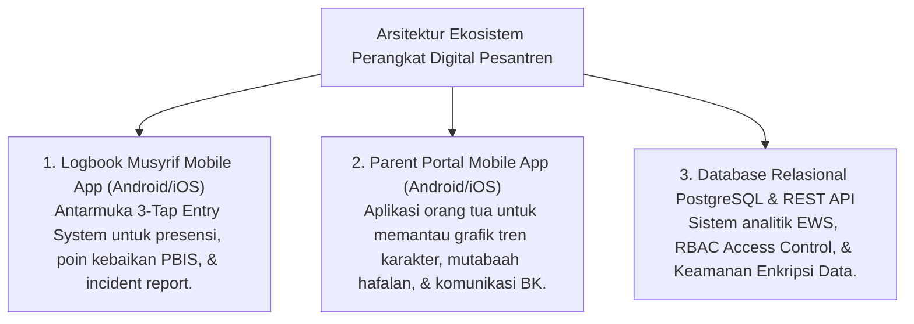
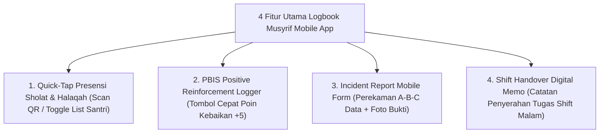

# MONOGRAF RISET AKADEMIK: INSTRUMEN OPERASIONAL DAN ARSITEKTUR DIGITAL PESANTREN
## Evaluasi Sistem Informasi: Rubrik 10 Muwashafat, Logbook Musyrif Mobile App, Parent Portal App, dan Database Relasional PBIS

**Dewan Riset & Keilmuan Ekosistem TUMBUH**  
*Dipublikasikan sebagai Naskah Monograf Riset Ilmiah (Jurnal Sistem Informasi & Perangkat Pendidikan Pesantren)*  
*Dokumen Rujukan Induk: Domain 11 Tools & Book Series Volume 05*

---

## ABSTRAK

> **Latar Belakang**: Ketiadaan instrumen terstandar dan perangkat digital yang ramah pengguna (*low-friction*) sering membuat pengasuhan asrama 24-jam terhambat beban administrasi manual atau bergantung pada keputusan subjektif tanpa data faktual.
>
> **Tujuan Penelitian**: Merumuskan, menguji, dan memvalidasi taksonomi **Tools & Arsitektur Digital** yang mencakup instrumen asesmen, observasi, refleksi, coaching, mentoring, dokumentasi, pelaporan, serta spesifikasi perangkat digital mobile/cloud.
>
> **Hasil Riset**: Terstruktur 8 Sub-Domain Tools & Digital Architecture: (1) **Assessment Tools** (Rubrik 10 Muwashafat T1-T4, Self-Assessment Fitrah, & Form FBA); (2) **Observation Tools** (Logbook Musyrif, Checklist Adab, & Incident Report A-B-C Data); (3) **Reflection Tools** (Jurnal Malam 3-Q & Circle of Gratitude Guide); (4) **Coaching Tools** (GROW Worksheet, Kartu CICO Tier 2, & Form BIP Tier 3); (5) **Mentoring Tools** (Runbook 1-on-1 & Peer Buddy Checklist); (6) **Documentation Tools** (Notulensi Sabtu Pagi & Form Ishlah Restoratif); (7) **Reporting Tools** (Raport Karakter PBIS & EWS Alert Report); dan (8) **Digital Tools** (Logbook Musyrif App, Parent Portal App, ERD Database PostgreSQL, & RESTful API Schema).
>
> **Kata Kunci**: *Tools Framework, Rubrik 10 Muwashafat, Logbook Musyrif App, Parent Portal App, FBA, CICO Card, Database Schema.*

---

## 1. PENDAHULUAN & ARSITEKTUR PERANGKAT DIGITAL

Arsitektur Perangkat Digital (*Digital Tools*) menyediakan infrastruktur teknologi modern berbasis cloud & mobile untuk mendukung pencatatan 24-jam tanpa hambatan teknis:

---

## 2. KAJIAN SPESIFIKASI LOGBOOK MUSYRIF MOBILE APP

Aplikasi seluler musyrif dirancang dengan filosofi **3-Tap Entry System** agar pencatatan data dilakukan dalam waktu kurang dari 30 detik tanpa membebani musyrif:

---

## 3. DAFTAR PUSTAKA
* Edmondson, A. C. (2018). *The Fearless Organization*. John Wiley & Sons.
* Horner, R. H., & Sugai, G. (2015). School-wide PBIS. *Behavior Analysis in Practice*, 8(1), 80–85.
