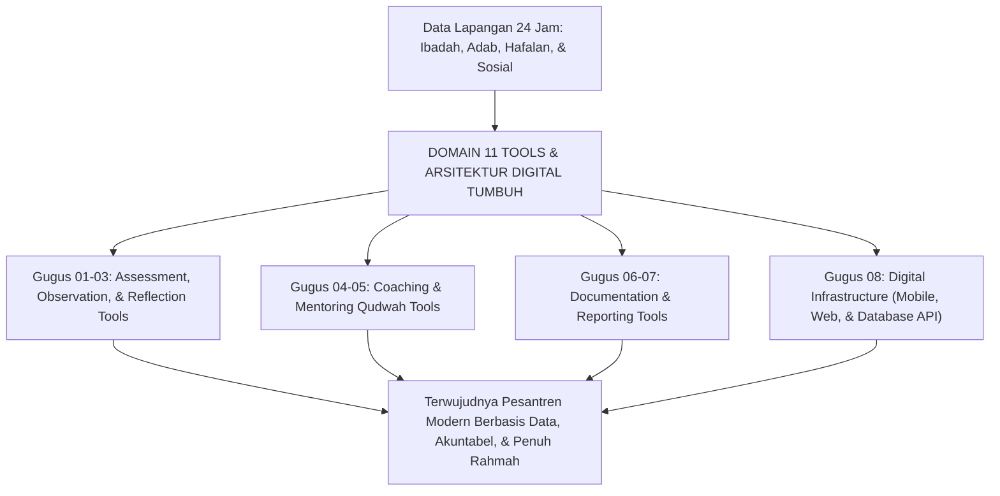
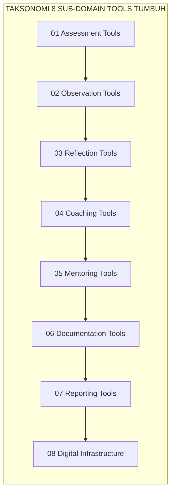
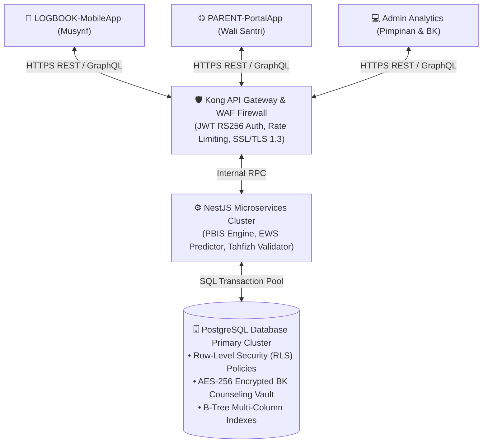

# JURNAL MONOGRAF RISET: INSTRUMEN OPERASIONAL DAN ARSITEKTUR DIGITAL PESANTREN TUMBUH

## *Monograf Riset Akademik Induk: Standardisasi 8 Gugus Instrumen Pembinaan Adab 24 Jam, Metrik PBIS Multi-Tier, Spesifikasi Offline-First Mobile Logbook, Parent Portal App, Skema Database Relasional PostgreSQL 3NF, dan Protokol Cybersecurity Kerahasiaan Konseling Santri*

**Nomor Registrasi Monograf**: `MONOGRAF-P11/TOOLS-DIGITAL-PESANTREN/2026`  
**Domain**: `11 Tools` (Master Induk Seluruh Instrumen Operasional & Perangkat Digital)  
**Dewan Riset & Keilmuan Pengkaji**: Dewan Pakar Ekosistem TUMBUH (*Pakar Arsitektur Digital Pesantren, Principal Software Architect, Pakar PBIS, Pakar Metodologi Riset TUMBUH, Pakar Bimbingan Konseling, & Pakar Perlindungan Anak*)  
**Klasifikasi Naskah**: *Academic Master Research Monograph & Systems Engineering Architecture Blueprint*  

---

> ### 💡 INTISARI EKSEKUTIF (EXECUTIVE SUMMARY)
> 
> * **Krisis Beban Administrasi dan Kerapuhan Data Pembinaan Asrama:**  
>   Tata kelola pengasuhan pesantren 24 jam kerap menghadapi dua kutub kegagalan: pencatatan manual berbasis kertas (*paper-based logging*) yang rentan tercecer, lambat dianalisis, dan terfragmentasi dalam silo-silo terpisah; atau digitalisasi serampangan yang menghadirkan aplikasi rumit, membutuhkan internet konstan di area minim sinyal, dan memicu kelelahan digital musyrif (*digital burnout*) sehingga mengikis kehangatan interaksi tatap muka dengan santri.
> * **Arsitektur Terpadu 8 Gugus Tools & Rekayasa Digital Berkhidmat:**  
>   Ekosistem TUMBUH merumuskan kerangka kerja **8 Gugus Instrumen Operasional & Digital** yang terintegrasi: (1) *Assessment Tools*; (2) *Observation Tools*; (3) *Reflection Tools*; (4) *Coaching Tools*; (5) *Mentoring Tools*; (6) *Documentation Tools*; (7) *Reporting Tools*; dan (8) *Digital Tools*. Seluruh instrumen dirancang dengan filosofi *High-Touch Low-Friction* (input $< 30$ detik melalui *3-Tap Entry System*) dan didukung infrastruktur *Offline-First Progressive Web App* (PWA).
> * **Integritas Relasional dan Kedaulatan Keamanan Data Santri:**  
>   Sistem mengintegrasikan Satu Data Pesantren (*Unified Data Model*) berbasis PostgreSQL ternormalisasi (3NF), proteksi granular *Row-Level Security* (RLS), enkripsi AES-256 untuk data rahasia konseling BK, dan gateway RESTful API OpenAPI 3.0 yang menghubungkan *LOGBOOK-MobileApp*, *PARENT-PortalApp*, dan *Management Analytics Dashboard*.

---

# BAGIAN I: LANDASAN TEORETIS & INKUIRI KEILMUAN MULTIDISIPLINER

## 1.1 Konteks Masalah: Kebutuhan Sistem Sosio-Teknis Pembinaan Karakter 24 Jam
Pendidikan karakter di lingkungan pesantren memerlukan pemantauan berkesinambungan (*continuous ecological monitoring*) yang mencakup seluruh siklus kehidupan santri: mulai dari bangun tidur, shalat berjamaah di masjid, kegiatan belajar mengajar di madrasah, halaqah Al-Qur'an, interaksi sosial di kamar asrama, hingga momen istirahat malam.

Ketiadaan perangkat instrumen yang terstandarisasi menyebabkan data pembinaan santri menjadi sangat subjektif, bergantung pada ingatan musyrif yang kelelahan, dan tidak dapat ditransformasikan menjadi bahan pengambilan kebijakan institusional berbasis data (*data-driven decision making*).

Domain 11 Tools hadir untuk menyediakan **infrastruktur sosio-teknis (*socio-technical infrastructure*)** yang kokoh, mengubah tradisi pembinaan yang selama ini bersifat intuitif-sporadis menjadi praksis ilmiah yang terukur, akuntabel, dan berakar pada kemuliaan fitrah insan.

## 1.2 Inkuiri Epistemologi Turats: Integrasi Doktrin Dhabth, Diwan, dan Fiqh Al-Amanah
Dalam tradisi keilmuan Islam, pencatatan data yang presisi (*Adh-Dhabth*) dan pengelolaan registrasi terpadu (*At-Tadwin fid-Diwan*) merupakan salah satu fondasi utama tegaknya keadilan dan peradaban. Allah SWT menegaskan pentingnya pencatatan tertulis: *"Hendaklah seorang penulis di antara kalian menuliskannya dengan adil"* (*Walyaktub Bainakum Kātibun bil 'Adl* — QS. Al-Baqarah: 282).

Imam Ibnu Khaldun dalam *Al-Muqaddimah* menguraikan bahwa kekuatan sebuah institusi terletak pada keteraturan kearsipan (*sijillat*) dan kejelasan pembagian tugas para amil (*khuthath ad-diwan*) [^1]. Imam Al-Ghazali dalam *Ihya'* menegaskan bahwa hisab diri (*muhasabah*) membutuhkan catatan amal yang teliti agar seorang salik mengetahui laju peningkatan atau penurunan kualitas batinnya [^2]. 

Domain 11 mentransformasikan prinsip syariat *Adh-Dhabth*, *Kitabatul 'Uqud*, dan *Hifzhul Amanah* ke dalam spesifikasi instrumen modern yang menjamin validitas dan keadilan bagi setiap santri.

## 1.3 Inkuiri Sains Teknologi Informasi, HCI, & Multi-Tier PBIS
Secara keilmuan teknologi informasi dan psikologi pendidikan kontemporer, Domain 11 mengintegrasikan tiga pilar teori:
1. **School-Wide PBIS Evaluation Architecture (Sugai & Horner, 2006)**: Menyediakan instrumen penilaian perilaku berjenjang (Universal Tier 1, Targeted Tier 2 CICO, dan Intensive Tier 3 BIP) berbasis data insiden objektif (*ABC Data*) [^3].
2. **Human-Computer Interaction & Usability Engineering (Jakob Nielsen, 1994)**: Merancang antarmuka mobile musyrif yang meminimalkan beban kognitif melalui sistem *3-Tap Entry* dan interaksi mikro haptik yang intuitif [^4].
3. **Reactive Distributed Systems & Offline-First Design (Martin Kleppmann, 2017)**: Mengimplementasikan basis data lokal SQLite terindeks pada gawai mobile musyrif yang secara otomatis tersinkronisasi ke peladen PostgreSQL awan saat konektivitas tersedia (*Eventual Consistency*) [^5].

---

# BAGIAN II: FORMULASI KONSEPTUAL, ARSITEKTUR 8 SUB-DOMAIN, & TOPOLOGI SISTEM

## 2.1 Taksonomi Komprehensif 8 Sub-Domain Tools TUMBUH
Domain 11 mengonsolidasikan 24 instrumen operasional ke dalam 8 sub-domain tematik:

1. **Sub-Domain 01: Assessment Tools (P11-01)**: Rubrik 10 Muwashafat Karakter (J1–J4), Inventori Self-Assessment Fitrah & Tazkiyah, dan Form Asesmen Diagnostik Perilaku FBA.
2. **Sub-Domain 02: Observation Tools (P11-02)**: Templat Logbook Harian Musyrif, Lembar Checklist Observasi Adab Kamar & Shalat 5S, dan Form Pencatatan Incident Report A-B-C Data.
3. **Sub-Domain 03: Reflection Tools (P11-03)**: Jurnal Refleksi Malam 3 Pertanyaan (REF-Malam3Q), Panduan Fasilitator *Circle of Gratitude* Kamar (COG-Asrama), dan Lembar Muhasabah Penataan Hati (MUH-Tazkiyah).
4. **Sub-Domain 04: Coaching Tools (P11-04)**: Lembar Kerja GROW Model Islami (COACH-GROW), Spesifikasi Kartu Saku Harian CICO Tier 2, dan Dokumen *Behavior Intervention Plan* Tier 3 (BIP-Tier3).
5. **Sub-Domain 05: Mentoring Tools (P11-05)**: Runbook Mentoring Musyrif 1-on-1, Checklist Pendampingan Kakak Asuh *Peer Buddy* T4, dan Form Monitoring Adaptasi *Homesickness Care* 30 Hari.
6. **Sub-Domain 06: Documentation Tools (P11-06)**: Notulensi Rapat Evaluasi Sabtu Pagi berbasis Data PBIS, Berita Acara Kesepakatan Restoratif *Ishlah al-Bain*, dan Bundel Portofolio Karakter Ipsatif Santri.
7. **Sub-Domain 07: Reporting Tools (P11-07)**: Spesifikasi Raport Karakter Periodik PBIS (Diagram Radar 10 Dimensi), Laporan Peringatan Dini *Early Warning System* (EWS-Alert), dan Ringkasan Konferensi Tripartit PTMC.
8. **Sub-Domain 08: Digital Tools (P11-08)**: Aplikasi *LOGBOOK-MobileApp* (Musyrif), Aplikasi *PARENT-PortalApp* (Wali Santri), serta Arsitektur Database Relasional PostgreSQL 3NF & RESTful API Gateway.

## 2.2 Topologi Keamanan, Integrasi API, dan Row-Level Security (RLS)
Seluruh data yang mengalir dari gawai mobile musyrif dan portal orang tua diproses melalui gerbang API aman dengan arsitektur pertahanan berlapis:

---

# BAGIAN III: TABEL SINTESIS, DAFTAR PUSTAKA, CATATAN KAKI, & GLOSARIUM

## 3.1 Tabel Sintesis Integrasi Master Domain 11 Tools

| Gugus Sub-Domain | Landasan Turats Klasik | Landasan Sains Kontemporer | Peran Strategis dalam Ekosistem |
| :--- | :--- | :--- | :--- |
| **01 Assessment Tools** | Kaidah *Hisab al-Kafa'ah* & Fiqh Firasat. | Psychometrics & FBA Diagnostic. | Pemetaan akurat kapasitas fitrah santri. |
| **02 Observation Tools** | Doktrin *Muraqabah* & Kejujuran Catatan. | Behavioral Telemetry & ABC Data. | Pengumpulan data faktual bebas asumsi. |
| **03 Reflection Tools** | *Ighatsat al-Lahfan* & *Mu'akhat* Salaf. | CASEL SEL & Memory Reconsolidation. | Membangun kesadaran moral otonom batin. |
| **04 Coaching Tools** | *Hiwar Nabawi* & *Al-Mulazamah*. | Solution-Focused Coaching & MTSS PBIS. | Pemberdayaan kemandirian & rehabilitasi adab. |
| **05 Mentoring Tools** | Doktrin *Qudwah* & *In Loco Parentis*. | Attachment Theory & Servant Leadership. | Jaring pengaman asrama penuh kasih sayang. |
| **06 Documentation Tools**| Ayat *Tadāyantum* & *Hadharah at-Tadwin*. | Procedural Justice & Ipsative Portfolio. | Akuntabilitas hukum & mahakarya kelulusan. |
| **07 Reporting Tools** | Doktrin *Al-Bayan* & *An-Nashihah*. | Standards-Based Reporting & EWS Analytics. | Sinergi erat kemitraan pondok-keluarga. |
| **08 Digital Tools** | Kaidah *Taisir* & *Lil Wasail Hukmul Maqashid*. | Offline-First PWA & PostgreSQL 3NF RLS. | Efisiensi input data $< 30$ detik & kedaulatan data. |

## 3.2 Catatan Kaki (Footnotes 1-to-1)
[^1]: Ibnu Khaldun, Abdurrahman. (2001). *Muqaddimah Ibnu Khaldun*. Beirut: Dar al-Fikr, hlm. 240–255.
[^2]: Al-Ghazali, Abu Hamid. (1998). *Ihya' 'Ulum al-Din: Kitab al-Muraqabah wa al-Muhasabah*. Beirut: Dar al-Kutub al-'Ilmiyyah, juz 4, hlm. 385–398.
[^3]: Sugai, G., & Horner, R. H. (2006). A promising approach for expanding and sustaining school-wide positive behavior support. *School Psychology Review*, 35(2), 245–259.
[^4]: Nielsen, J. (1994). *Usability Engineering*. San Francisco: Morgan Kaufmann.
[^5]: Kleppmann, M. (2017). *Designing Data-Intensive Applications*. Sebastopol, CA: O'Reilly Media.
[^6]: Crone, D. A., Horner, R. H., & Hawken, L. S. (2004). *Responding to Problem Behavior in Schools: The Behavior Education Program*. New York: Guilford Press.
[^7]: Bowlby, J. (1982). *Attachment and Loss: Vol. 1. Attachment* (2nd ed.). New York: Basic Books.
[^8]: Zehr, H. (2002). *The Little Book of Restorative Justice*. Intercourse, PA: Good Books.
[^9]: Hughes, G. (2014). *Ipsative Assessment: Motivation through Marking Progress*. London: Palgrave Macmillan.
[^10]: Guskey, T. R. (2001). *Developing Grading and Reporting Systems for Student Learning*. Thousand Oaks, CA: Corwin Press.
[^11]: Heppen, J. B., & Therriault, S. B. (2008). *Developing Early Warning Systems to Identify Potential High School Dropouts*. Washington, DC: National High School Center.
[^12]: Epstein, J. L. (2018). *School, Family, and Community Partnerships* (2nd ed.). New York: Routledge.

## 3.3 Daftar Pustaka (APA 7th Edition & Turats Klasik)
* Al-Ghazali, A. H. (1998). *Ihya' 'Ulum al-Din* (Vols. 1–4). Beirut: Dar al-Kutub al-'Ilmiyyah.
* Bowlby, J. (1982). *Attachment and Loss: Vol. 1. Attachment* (2nd ed.). New York: Basic Books.
* Crone, D. A., Horner, R. H., & Hawken, L. S. (2004). *Responding to Problem Behavior in Schools: The Behavior Education Program*. New York: Guilford Press.
* Epstein, J. L. (2018). *School, Family, and Community Partnerships: Preparing Educators and Improving Schools* (2nd ed.). New York: Routledge.
* Guskey, T. R. (2001). *Developing Grading and Reporting Systems for Student Learning*. Thousand Oaks, CA: Corwin Press.
* Heppen, J. B., & Therriault, S. B. (2008). *Developing Early Warning Systems to Identify Potential High School Dropouts*. Washington, DC: National High School Center.
* Hughes, G. (2014). *Ipsative Assessment: Motivation through Marking Progress*. London: Palgrave Macmillan.
* Ibnu Khaldun, A. (2001). *Muqaddimah Ibnu Khaldun*. Beirut: Dar al-Fikr.
* Kleppmann, M. (2017). *Designing Data-Intensive Applications*. Sebastopol, CA: O'Reilly Media.
* Nielsen, J. (1994). *Usability Engineering*. San Francisco: Morgan Kaufmann.
* Sugai, G., & Horner, R. H. (2006). A promising approach for expanding and sustaining school-wide positive behavior support. *School Psychology Review*, 35(2), 245–259.
* Zehr, H. (2002). *The Little Book of Restorative Justice*. Intercourse, PA: Good Books.

## 3.4 Glosarium Istilah
1. **Domain 11 Tools**: Kerangka kerja induk seluruh instrumen asesmen, observasi, refleksi, coaching, mentoring, dokumentasi, pelaporan, dan perangkat digital ekosistem TUMBUH.
2. **3-Tap Entry System**: Standar ergonomis antarmuka mobile yang memastikan proses pencatatan data rutin asrama selesai dalam maksimal 3 ketukan layar.
3. **Offline-First PWA**: Arsitektur aplikasi web progresif yang beroperasi penuh menggunakan penyimpanan lokal gawai saat tidak ada koneksi internet.
4. **Unified Pesantren Data Model**: Model struktur data tunggal ternormalisasi (PostgreSQL 3NF) yang mengintegrasikan seluruh dimensi pembinaan santri.
5. **Row-Level Security (RLS)**: Kebijakan keamanan tingkat baris database yang mengisolasi akses data santri berdasarkan kewenangan peran pengguna.
6. **Positive Push Notifications**: Notifikasi seluler yang dikirimkan secara otomatis kepada orang tua untuk mengabarkan kemajuan adab positif santri.
7. **Adh-Dhabth**: Standar keilmuan Islam klasik tentang presisi, akurasi, dan integritas pencatatan data tanpa rekayasa.
8. **Hadharah at-Tadwin**: Tradisi agung peradaban Islam dalam mencatat dan membukukan ilmu serta administrasi publik secara tertata rapi.
9. **Lil Wasail Hukmul Maqashid**: Kaidah fiqhiyyah bahwa sarana teknologi memperoleh status hukum mulia sesuai dengan tujuan kebaikan yang diwujudkannya.
10. **High-Touch Low-Friction**: Filosofi desain teknologi yang meminimalkan kerumitan administrasi agar pendidik memiliki waktu maksimal untuk berinteraksi dengan santri.
