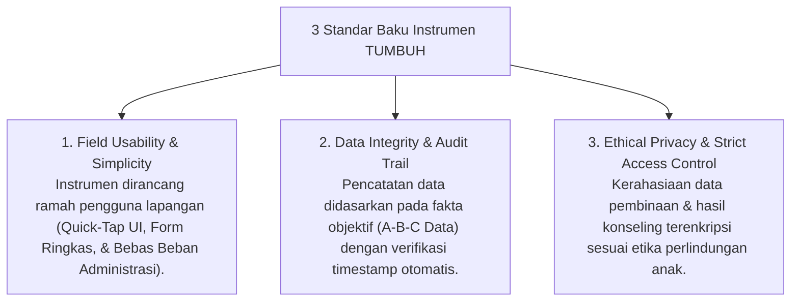
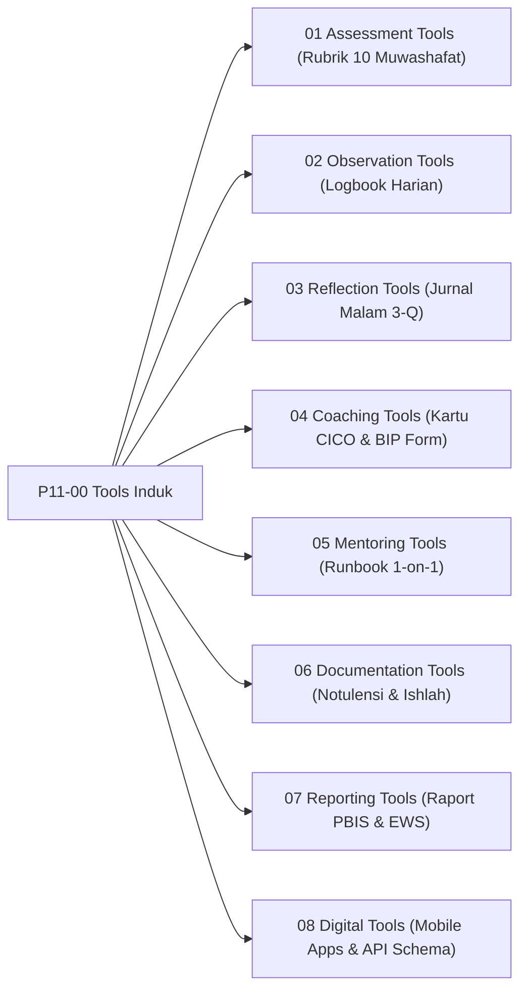

# P11-00: Tools Induk (Kerangka Kerja Instrumen & Perangkat Digital TUMBUH)

## Status Dokumen
* **Status**: 🌟 **A+ (Tervalidasi & Induk Baku)**
* **Domain**: Project 11 — `11 Tools`
* **Penanggung Jawab Keilmuan**: Dewan Keilmuan TUMBUH (*Pakar Arsitektur Digital Pesantren, Pakar Metodologi Riset, & Pakar PBIS*)

---

## 1. Pendahuluan & Standarisasi Instrumen Pembinaan

Sesuai Dokumen Induk `AGENTS.md`, seluruh instrumen operasional dan perangkat digital di ekosistem **TUMBUH** dirancang untuk memudahkan kerja pengasuhan di lapangan, menjamin akurasi data faktual, dan melindungi kehormatan serta kerahasiaan data santri.

---

## 2. Model Triad Pertumbuhan Simbiotik dalam Perangkat Pembinaan

- **Santri Tumbuh**: Mendapatkan umpan balik pertumbuhan yang transparan, apresiatif, dan terlindungi dari stigmatisasi buruk.
- **Guru & Musyrif Tumbuh**: Memiliki templat kerja (Runbook) yang praktis, mempercepat input data harian, & didukung analitik digital.
- **Sistem Lembaga Tumbuh**: Memiliki infrastruktur data PBIS yang solid, integrasi API terpadu, & kesiapan audit mutu berkelanjutan.

---

## 3. Peta Hubungan Sub-Domain Instrumen & Digital

---

## 4. Rujukan Keilmuan Multidisiplin

1. **Turats Islam**: *Fiqhu al-Khitab wa al-Khitabah* (Prinsip Komunikasi Beradab), *Hifzhu al-Aswar* (Kerahasiaan Aib & Kerahasiaan Konseling).
2. **Sains Kontemporer**: *SW-PBIS Evaluation Tools* (Sugai et al.), *CICO Implementation Blueprint*, *User Experience (UX) Design for Education*, *Relational Database Architecture (PostgreSQL/MySQL)*.
