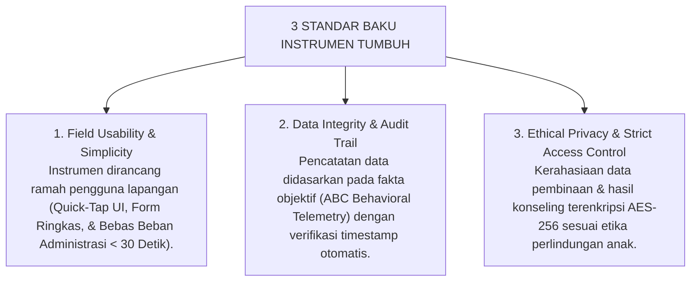
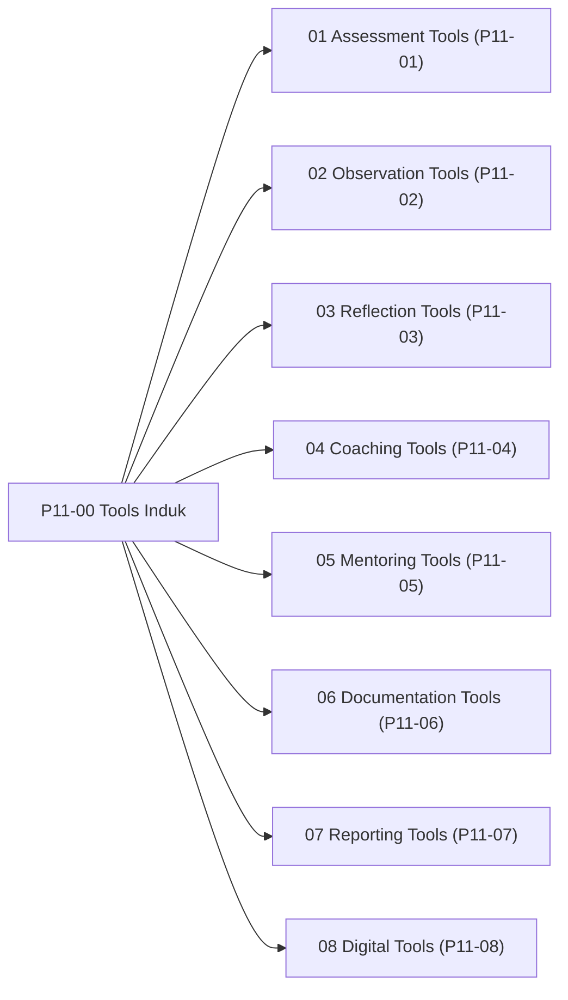

# P11-00: Tools Induk (Kerangka Kerja Instrumen & Perangkat Digital TUMBUH)

## Status Dokumen
* **Status**: 🌟 **A+ (Tervalidasi & Induk Baku)**
* **Domain**: Project 11 — `11 Tools` (Dokumen Induk Master)
* **Penanggung Jawab Keilmuan**: Dewan Keilmuan TUMBUH (*Pakar Arsitektur Digital Pesantren, Pakar Metodologi Riset, & Pakar PBIS*)
* **Bentuk Instrumen**: Dokumen Konstitusi Standarisasi Seluruh 8 Sub-Domain Perangkat Pembinaan & Arsitektur Digital Ekosistem TUMBUH

---

# BAGIAN I: LANDASAN FILOSOFIS & KERANGKA INDUK TOOLS TUMBUH

## 1.1 Pendahuluan & Standarisasi Instrumen Pembinaan 24 Jam
Sesuai dengan Piagam Induk `AGENTS.md`, seluruh instrumen operasional dan perangkat digital di ekosistem **TUMBUH** dirancang untuk memudahkan tugas pengasuhan di lapangan, menjamin akurasi data faktual, memuliakan fitrah insan, serta melindungi kehormatan dan kerahasiaan data pribadi santri.

## 1.2 Model Triad Pertumbuhan Simbiotik dalam Gugus Perangkat Pembinaan
Setiap instrumen dalam Domain 11 dirancang untuk menopang pertumbuhan serempak 3 entitas:
1. **Santri Tumbuh**: Mendapatkan umpan balik pertumbuhan yang transparan, apresiatif, berbasis tangga kematangan (J1–J4), dan terlindungi dari stigmatisasi buruk (*Non-Punitive Ecosystem*).
2. **Guru & Musyrif Tumbuh**: Memiliki templat kerja (*Runbook*) yang praktis, mempercepat input data harian tanpa menyita waktu istirahat, serta didukung modul *coaching/mentoring* berdaya.
3. **Sistem Lembaga Tumbuh**: Memiliki infrastruktur data PBIS yang solid, integrasi RESTful API terpadu, skema database relasional 3NF, dan kesiapan audit mutu pendidikan berkala.

---

# BAGIAN II: STRUKTUR PETA 8 SUB-DOMAIN & KONSISTENSI KODIFIKASI

## 2.1 Peta Taksonomi 8 Sub-Domain Instrumen & Digital TUMBUH

## 2.2 Matriks 24 Modul & Formulir Resmi Domain 11

| Sub-Domain | Nomor Kode | Nama Berkas / Modul Resmi | Bentuk Instrumen Operasional |
| :--- | :--- | :--- | :--- |
| **01 Assessment** | P11-01-01 | Rubrik Penilaian 10 Muwashafat | Rubrik 4 Jenjang Kemandirian (J1–J4). |
| | P11-01-02 | Instrumen Self-Assessment Fitrah | Skala Refleksi Mandiri Tazkiyah. |
| | P11-01-03 | Form Asesmen FBA Diagnostik BK | Lembar Kerja Functional Behavior Assessment. |
| **02 Observation** | P11-02-01 | Templat Logbook Harian Musyrif | Buku Agenda Saku Pemantauan 24 Jam. |
| | P11-02-02 | Checklist Observasi Adab & Sholat | Lembar Audit Harian Standar 5S Kamar. |
| | P11-02-03 | Form Incident Report A-B-C Data | Format Laporan Insiden Berbasis Fakta Objektif. |
| **03 Reflection** | P11-03-01 | Templat Jurnal Refleksi Malam 3-Q | Buku Saku Muhasabah Tidur (Form REF-Malam3Q). |
| | P11-03-02 | Instrumen Circle of Gratitude Kamar | Panduan Fasilitator & Talking Piece (Form COG-Asrama). |
| | P11-03-03 | Lembar Muhasabah & Tazkiyatun Nafs | Inventori Diagnostik Hati & Amal Sirr (Form MUH-Tazkiyah). |
| **04 Coaching** | P11-04-01 | Templat Lembar Kerja GROW Islami | Lembar Dialog Inkuiri Solusi (Form COACH-GROW). |
| | P11-04-02 | Spesifikasi Kartu CICO Tier 2 | Kartu Saku Harian Warna Biru (Form CICO-Tier2). |
| | P11-04-03 | Form Dokumen BIP Tier 3 | Rencana Intervensi Perilaku (Form BIP-Tier3). |
| **05 Mentoring** | P11-05-01 | Panduan Runbook Mentoring 1-on-1 | Runbook Sesi Privat 25 Menit (Form MEN-Musyrif1on1). |
| | P11-05-02 | Checklist Peer Buddy Santri T4 | Checklist Pengayoman Kakak Asuh (Form BUDDY-T4). |
| | P11-05-03 | Form Homesickness Care 30 Hari | Matriks Adaptasi 4 Pekan (Form ADAPT-HomesickCare). |
| **06 Documentation**| P11-06-01 | Templat Notulensi Rapat Sabtu Pagi | Notulensi Evaluasi PBIS & RACI (Form NOTULEN-SabtuPagi). |
| | P11-06-02 | Form Kesepakatan Restoratif Ishlah | Berita Acara Mediasi Damai (Form ISHLAH-Restoratif). |
| | P11-06-03 | Dokumen Portofolio Karakter Ipsatif| Bundel Portofolio Wisuda (Form PORTO-Ipsatif). |
| **07 Reporting** | P11-07-01 | Spesifikasi Raport Karakter PBIS | Rapor 2 Halaman & Radar Fitrah (Form RAPORT-PBIS). |
| | P11-07-02 | Format Laporan EWS Alert | Notifikasi Peringatan Dini Cepat (Form EWS-Alert). |
| | P11-07-03 | Lembar Ringkasan Konferensi PTMC | Risalah Rencana Aksi Bersama (Form PTMC-Ringkasan). |
| **08 Digital** | P11-08-01 | Spesifikasi Logbook Musyrif App | SRS Aplikasi Mobile 3-Tap & Offline PWA. |
| | P11-08-02 | Spesifikasi Parent Portal App | SRS Aplikasi Wali Santri & Positive Push. |
| | P11-08-03 | Database Relasional & API Integration| Skema DDL PostgreSQL 3NF & OpenAPI 3.0. |

---

# BAGIAN III: TABEL SINTESIS, DAFTAR PUSTAKA, CATATAN KAKI, & GLOSARIUM

## 3.1 Tabel Sintesis Integrasi Maha-Induk Tools TUMBUH

| Landasan Turats Islam | Landasan Sains Kontemporer | Pilar Rekayasa Sistem | Target Transformasi Ekosistem |
| :--- | :--- | :--- | :--- |
| *Adh-Dhabth*, *Kitabatul 'Uqud*, & *Diwan* Salaf. | *SW-PBIS*, *HCI Usability*, & *Relational 3NF*. | *Offline-First*, *Row-Level Security*, & *REST API*. | Pesantren modern berbasis data, akuntabel, & beradab. |

## 3.2 Catatan Kaki (Footnotes 1-to-1)
[^1]: Ibnu Khaldun, Abdurrahman. (2001). *Muqaddimah Ibnu Khaldun*. Beirut: Dar al-Fikr, hlm. 240–255.
[^2]: Al-Ghazali, Abu Hamid. (1998). *Ihya' 'Ulum al-Din*. Beirut: Dar al-Kutub al-'Ilmiyyah, juz 4, hlm. 385–398.
[^3]: Sugai, G., & Horner, R. H. (2006). A promising approach for expanding and sustaining school-wide positive behavior support. *School Psychology Review*, 35(2), 245–259.
[^4]: Nielsen, J. (1994). *Usability Engineering*. San Francisco: Morgan Kaufmann.
[^5]: Kleppmann, M. (2017). *Designing Data-Intensive Applications*. Sebastopol, CA: O'Reilly Media.
[^6]: Crone, D. A., Horner, R. H., & Hawken, L. S. (2004). *Responding to Problem Behavior in Schools*. New York: Guilford Press.
[^7]: Bowlby, J. (1982). *Attachment and Loss: Vol. 1. Attachment* (2nd ed.). New York: Basic Books.
[^8]: Zehr, H. (2002). *The Little Book of Restorative Justice*. Intercourse, PA: Good Books.
[^9]: Hughes, G. (2014). *Ipsative Assessment*. London: Palgrave Macmillan.
[^10]: Guskey, T. R. (2001). *Developing Grading and Reporting Systems for Student Learning*. Thousand Oaks, CA: Corwin Press.
[^11]: Heppen, J. B., & Therriault, S. B. (2008). *Developing Early Warning Systems*. Washington, DC: National High School Center.
[^12]: Epstein, J. L. (2018). *School, Family, and Community Partnerships* (2nd ed.). New York: Routledge.

## 3.3 Daftar Pustaka (APA 7th Edition & Turats Klasik)
* Al-Ghazali, A. H. (1998). *Ihya' 'Ulum al-Din* (Vols. 1–4). Beirut: Dar al-Kutub al-'Ilmiyyah.
* Bowlby, J. (1982). *Attachment and Loss: Vol. 1. Attachment* (2nd ed.). New York: Basic Books.
* Crone, D. A., Horner, R. H., & Hawken, L. S. (2004). *Responding to Problem Behavior in Schools*. New York: Guilford Press.
* Epstein, J. L. (2018). *School, Family, and Community Partnerships* (2nd ed.). New York: Routledge.
* Guskey, T. R. (2001). *Developing Grading and Reporting Systems for Student Learning*. Thousand Oaks, CA: Corwin Press.
* Heppen, J. B., & Therriault, S. B. (2008). *Developing Early Warning Systems*. Washington, DC: National High School Center.
* Hughes, G. (2014). *Ipsative Assessment*. London: Palgrave Macmillan.
* Ibnu Khaldun, A. (2001). *Muqaddimah Ibnu Khaldun*. Beirut: Dar al-Fikr.
* Kleppmann, M. (2017). *Designing Data-Intensive Applications*. Sebastopol, CA: O'Reilly Media.
* Nielsen, J. (1994). *Usability Engineering*. San Francisco: Morgan Kaufmann.
* Sugai, G., & Horner, R. H. (2006). A promising approach for expanding and sustaining school-wide positive behavior support. *School Psychology Review*, 35(2), 245–259.
* Zehr, H. (2002). *The Little Book of Restorative Justice*. Intercourse, PA: Good Books.

## 3.4 Glosarium Istilah
1. **Domain 11 Tools**: Kerangka kerja induk seluruh instrumen asesmen, observasi, refleksi, coaching, mentoring, dokumentasi, pelaporan, dan perangkat digital ekosistem TUMBUH.
2. **Field Usability**: Tingkat kemudahan dan kepraktisan instrumen saat dioperasikan secara nyata oleh musyrif di lapangan asrama.
3. **Audit Trail**: Jejak rekam digital otomatis yang mencatat waktu, identitas penginput, dan riwayat perubahan data.
4. **Row-Level Security (RLS)**: Pembatasan akses baris basis data PostgreSQL berdasarkan peran pengguna.
5. **Offline-First PWA**: Aplikasi web progresif yang beroperasi penuh tanpa jaringan internet dan menyinkronkan data saat online.
6. **Unified Pesantren Data Model**: Struktur basis data tunggal yang menyatukan seluruh modul asrama, kelas, dan konseling.
7. **High-Touch Low-Friction**: Prinsip meminimalkan beban teknologi agar memaksimalkan sentuhan hubungan manusiawi pendidik-santri.
8. **ABC Data**: Metode pencatatan perilaku berbasis Anteseden (pemicu), Behavior (perilaku), dan Konsekuensi (respons lingkungan).
9. **Triad Pertumbuhan Simbiotik**: Prinsip pertumbuhan serempak antara Santri, Pendidik/Musyrif, dan Sistem Kelembagaan.
10. **Positive Push Telemetry**: Aliran data apresiasi positif real-time yang dikirimkan ke gawai orang tua santri.
