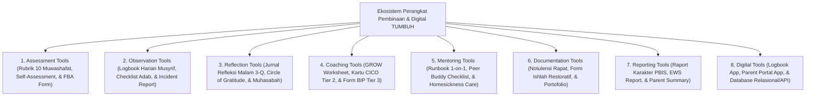

# Domain 11: Tools (Kerangka Kerja Instrumen & Perangkat Digital Ekosistem Pesantren Berbasis TUMBUH)

Domain ini memuat instrumen asesmen, rubrik penilaian, templat runbook operasional, serta spesifikasi arsitektur perangkat digital di ekosistem **TUMBUH** yang terbagi dalam **8 Sub-Domain Utama**: Assessment Tools, Observation Tools, Reflection Tools, Coaching Tools, Mentoring Tools, Documentation Tools, Reporting Tools, dan Digital Tools.

---

## Indeks Dokumen Induk & Jurnal Riset Monograf Utuh

* 📄 **[Jurnal-Monograf-Riset-Instrumen-dan-Arsitektur-Digital-TUMBUH.md](./Jurnal-Monograf-Riset-Instrumen-dan-Arsitektur-Digital-TUMBUH.md)**: **Monograf Riset Ilmiah Utuh & Terkonsolidasi** (Mencakup Rubrik 10 Muwashafat, Logbook Musyrif Mobile App, Parent Portal App, Offline-First SQLite Syncing, & Cybersecurity AES-256 Data BK).
* 📄 **[P11-00-Tools-Induk.md](./P11-00-Tools-Induk.md)**: Dokumen Maha-Induk Instrumen & Spesifikasi Arsitektur Digital TUMBUH.

---

## Arsitektur Ekosistem Perangkat Pembinaan & Digital

---

## 8 Sub-Domain Modul Perangkat & Digital

1. 📂 **[01 Assessment Tools](./01%20Assessment%20Tools/)**: Rubrik Penilaian 10 Muwashafat, Self-Assessment Fitrah, & Form FBA Diagnostik.
2. 📂 **[02 Observation Tools](./02%20Observation%20Tools/)**: Templat Logbook Harian Musyrif, Checklist Adab Kamar/Sholat, & Incident Report A-B-C.
3. 📂 **[03 Reflection Tools](./03%20Reflection%20Tools/)**: Jurnal Refleksi Malam 3-Q, Circle of Gratitude, & Lembar Muhasabah.
4. 📂 **[04 Coaching Tools](./04%20Coaching%20Tools/)**: Lembar Kerja GROW Model Islami, Kartu CICO Tier 2, & Form BIP Tier 3.
5. 📂 **[05 Mentoring Tools](./05%20Mentoring%20Tools/)**: Runbook Mentoring 1-on-1 Musyrif, Peer Buddy Checklist T4, & Form Homesickness Care.
6. 📂 **[06 Documentation Tools](./06%20Documentation%20Tools/)**: Notulensi Evaluasi Sabtu Pagi, Form Kesepakatan Restoratif, & Portofolio Ipsatif.
7. 📂 **[07 Reporting Tools](./07%20Reporting%20Tools/)**: Spesifikasi Raport Karakter PBIS, Laporan EWS, & Parent Conference Summary.
8. 📂 **[08 Digital Tools](./08%20Digital%20Tools/)**: Logbook Musyrif App, Parent Portal App, Offline-First SQLite Syncing, & PostgreSQL ERD.
