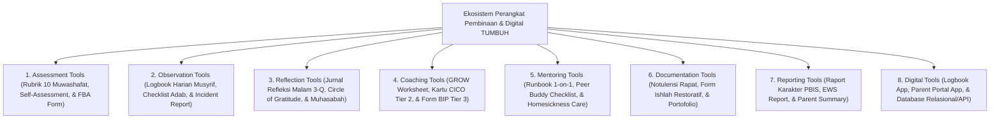

# 11 Tools (Kerangka Kerja Instrumen & Perangkat Digital Pesantren TUMBUH)

Domain ini memuat instrumen asesmen, rubrik penilaian, templat runbook operasional, serta spesifikasi arsitektur perangkat digital di ekosistem **TUMBUH** yang terbagi dalam **8 Sub-Domain Utama**: Assessment Tools, Observation Tools, Reflection Tools, Coaching Tools, Mentoring Tools, Documentation Tools, Reporting Tools, dan Digital Tools.

---

## Arsitektur Ekosistem Perangkat Pembinaan & Digital

---

## Indeks Dokumen Induk & 8 Sub-Domain Modul

* 📄 **[P11-00-Tools-Induk.md](./P11-00-Tools-Induk.md)**: Dokumen Maha-Induk Instrumen & Spesifikasi Arsitektur Digital TUMBUH.

### Sub-Domain 01: Assessment Tools
* 📁 **[01 Assessment Tools](./01%20Assessment%20Tools/)**:
  * 📄 [P11-01-Instrumen-Asesmen-Karakter.md](./01%20Assessment%20Tools/P11-01-Instrumen-Asesmen-Karakter.md)
  * 📄 [P11-01-01-Rubrik-Penilaian-10-Muwashafat-Karakter-Santri.md](./01%20Assessment%20Tools/P11-01-01-Rubrik-Penilaian-10-Muwashafat-Karakter-Santri.md)
  * 📄 [P11-01-02-Instrumen-Self-Assessment-Fitrah-dan-Tazkiyah.md](./01%20Assessment%20Tools/P11-01-02-Instrumen-Self-Assessment-Fitrah-dan-Tazkiyah.md)
  * 📄 [P11-01-03-Form-Asesmen-FBA-Diagnostik-Perilaku-BK.md](./01%20Assessment%20Tools/P11-01-03-Form-Asesmen-FBA-Diagnostik-Perilaku-BK.md)

### Sub-Domain 02: Observation Tools
* 📁 **[02 Observation Tools](./02%20Observation%20Tools/)**:
  * 📄 [P11-02-Instrumen-Observasi-Musyrif.md](./02%20Observation%20Tools/P11-02-Instrumen-Observasi-Musyrif.md)
  * 📄 [P11-02-01-Templat-Logbook-Harian-Musyrif-Asrama.md](./02%20Observation%20Tools/P11-02-01-Templat-Logbook-Harian-Musyrif-Asrama.md)
  * 📄 [P11-02-02-Checklist-Observasi-Adab-Kamar-dan-Sholat.md](./02%20Observation%20Tools/P11-02-02-Checklist-Observasi-Adab-Kamar-dan-Sholat.md)
  * 📄 [P11-02-03-Form-Pencatatan-Incident-Report-A-B-C-Data.md](./02%20Observation%20Tools/P11-02-03-Form-Pencatatan-Incident-Report-A-B-C-Data.md)

### Sub-Domain 03: Reflection Tools
* 📁 **[03 Reflection Tools](./03%20Reflection%20Tools/)**:
  * 📄 [P11-03-Instrumen-Refleksi-Santri.md](./03%20Reflection%20Tools/P11-03-Instrumen-Refleksi-Santri.md)
  * 📄 [P11-03-01-Templat-Jurnal-Refleksi-Malam-3-Pertanyaan.md](./03%20Reflection%20Tools/P11-03-01-Templat-Jurnal-Refleksi-Malam-3-Pertanyaan.md)
  * 📄 [P11-03-02-Instrumen-Circle-of-Gratitude-Kamar-Asrama.md](./03%20Reflection%20Tools/P11-03-02-Instrumen-Circle-of-Gratitude-Kamar-Asrama.md)
  * 📄 [P11-03-03-Lembar-Muhasabah-Mandiri-dan-Tazkiyatun-Nafs.md](./03%20Reflection%20Tools/P11-03-03-Lembar-Muhasabah-Mandiri-dan-Tazkiyatun-Nafs.md)

### Sub-Domain 04: Coaching Tools
* 📁 **[04 Coaching Tools](./04%20Coaching%20Tools/)**:
  * 📄 [P11-04-Instrumen-Coaching-Karakter.md](./04%20Coaching%20Tools/P11-04-Instrumen-Coaching-Karakter.md)
  * 📄 [P11-04-01-Templat-Lembar-Kerja-GROW-Model-Islami.md](./04%20Coaching%20Tools/P11-04-01-Templat-Lembar-Kerja-GROW-Model-Islami.md)
  * 📄 [P11-04-02-Spesifikasi-Kartu-CICO-Check-In-Check-Out-Tier-2.md](./04%20Coaching%20Tools/P11-04-02-Spesifikasi-Kartu-CICO-Check-In-Check-Out-Tier-2.md)
  * 📄 [P11-04-03-Form-Dokumen-Behavior-Intervention-Plan-BIP-Tier-3.md](./04%20Coaching%20Tools/P11-04-03-Form-Dokumen-Behavior-Intervention-Plan-BIP-Tier-3.md)

### Sub-Domain 05: Mentoring Tools
* 📁 **[05 Mentoring Tools](./05%20Mentoring%20Tools/)**:
  * 📄 [P11-05-Instrumen-Mentoring-Qudwah.md](./05%20Mentoring%20Tools/P11-05-Instrumen-Mentoring-Qudwah.md)
  * 📄 [P11-05-01-Panduan-Runbook-Mentoring-Musyrif-1-on-1.md](./05%20Mentoring%20Tools/P11-05-01-Panduan-Runbook-Mentoring-Musyrif-1-on-1.md)
  * 📄 [P11-05-02-Checklist-Pendampingan-Peer-Buddy-Santri-T4.md](./05%20Mentoring%20Tools/P11-05-02-Checklist-Pendampingan-Peer-Buddy-Santri-T4.md)
  * 📄 [P11-05-03-Form-Monitoring-Adaptasi-Homesickness-Care.md](./05%20Mentoring%20Tools/P11-05-03-Form-Monitoring-Adaptasi-Homesickness-Care.md)

### Sub-Domain 06: Documentation Tools
* 📁 **[06 Documentation Tools](./06%20Documentation%20Tools/)**:
  * 📄 [P11-06-Instrumen-Dokumentasi-Lembaga.md](./06%20Documentation%20Tools/P11-06-Instrumen-Dokumentasi-Lembaga.md)
  * 📄 [P11-06-01-Templat-Notulensi-Rapat-Evaluasi-Sabtu-Pagi.md](./06%20Documentation%20Tools/P11-06-01-Templat-Notulensi-Rapat-Evaluasi-Sabtu-Pagi.md)
  * 📄 [P11-06-02-Form-Kesepakatan-Restoratif-dan-Ishlah-al-Bain.md](./06%20Documentation%20Tools/P11-06-02-Form-Kesepakatan-Restoratif-dan-Ishlah-al-Bain.md)
  * 📄 [P11-06-03-Dokumen-Portofolio-Karakter-Ipsatif-Santri.md](./06%20Documentation%20Tools/P11-06-03-Dokumen-Portofolio-Karakter-Ipsatif-Santri.md)

### Sub-Domain 07: Reporting Tools
* 📁 **[07 Reporting Tools](./07%20Reporting%20Tools/)**:
  * 📄 [P11-07-Instrumen-Pelaporan-Periodik.md](./07%20Reporting%20Tools/P11-07-Instrumen-Pelaporan-Periodik.md)
  * 📄 [P11-07-01-Spesifikasi-Raport-Karakter-Periodik-PBIS.md](./07%20Reporting%20Tools/P11-07-01-Spesifikasi-Raport-Karakter-Periodik-PBIS.md)
  * 📄 [P11-07-02-Format-Laporan-EWS-Early-Warning-System.md](./07%20Reporting%20Tools/P11-07-02-Format-Laporan-EWS-Early-Warning-System.md)
  * 📄 [P11-07-03-Lembar-Ringkasan-Parent-Teacher-Musyrif-Conference.md](./07%20Reporting%20Tools/P11-07-03-Lembar-Ringkasan-Parent-Teacher-Musyrif-Conference.md)

### Sub-Domain 08: Digital Tools
* 📁 **[08 Digital Tools](./08%20Digital%20Tools/)**:
  * 📄 [P11-08-Arsitektur-Perangkat-Digital-PBIS.md](./08%20Digital%20Tools/P11-08-Arsitektur-Perangkat-Digital-PBIS.md)
  * 📄 [P11-08-01-Spesifikasi-Aplikasi-Logbook-Musyrif-Mobile-App.md](./08%20Digital%20Tools/P11-08-01-Spesifikasi-Aplikasi-Logbook-Musyrif-Mobile-App.md)
  * 📄 [P11-08-02-Spesifikasi-Parent-Portal-Digital-App.md](./08%20Digital%20Tools/P11-08-02-Spesifikasi-Parent-Portal-Digital-App.md)
  * 📄 [P11-08-03-Arsitektur-Database-Relasional-dan-API-Integration.md](./08%20Digital%20Tools/P11-08-03-Arsitektur-Database-Relasional-dan-API-Integration.md)
