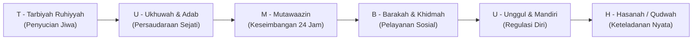

# Sub-Bab 6.2: Dari Tarbiyah Ruhiyyah Hingga Qudwah Hasanah

Kyai Hasyim mempersilakan Ustadz Salman untuk melangkah ke depan mimbar dan memaparkan dekomposisi enam pilar filosofis TUMBUH di hadapan seluruh dewan guru dan musyrif.

Salman melangkah dengan langkah mantap dan tatapan mata yang jernih. Di tangannya tidak ada lagi rotan kuning; yang ada hanyalah lembaran kertas kerja dan niat tulus untuk memimpin pembaruan.

"Para asatidz yang dirahmati Allah," ujar Salman dengan suara yang tegas dan menggetarkan dada para pendengar, "inilah enam tiang pancang yang akan menopang seluruh napas kehidupan di asrama putra Pesantren Darul Adab:

Salman menguraikan keenam pilar tersebut satu per satu:

1. **Pilar 1: T - Tarbiyah Ruhiyyah (Penyucian Jiwa & Hubungan dengan Khaliq)**:
   * Fondasi dari segala pendidikan karakter adalah keterhubungan hati dengan Allah SWT (*Tazkiyatun Nafs*).
   * Menanamkan rasa diawasi oleh Allah (*Muraqabatullah*), sehingga santri berbuat jujur dan tertib bukan karena takut pada mata musyrif, melainkan karena cinta dan takzim kepada Sang Pencipta.

2. **Pilar 2: U - Ukhuwah & Adab (Persaudaraan Sejati & Pemuliaan Martabat)**:
   * Mengikis habis budaya perpeloncoan, feodalisme, dan perundungan (*bullying*) di seluruh kamar asrama.
   * Menggantikannya dengan semangat *Ta'akhi* (saling bersaudara), di mana santri senior menjadi kakak asuh pelindung bagi adik-adik kelasnya.

3. **Pilar 3: M - Mutawaazin (Keseimbangan Holistik Jasmani, Akal, & Ruhani)**:
   * Menolak pola pengasuhan ekstrem yang mengabaikan kebutuhan biologis santri dan musyrif.
   * Menjamin hak tidur berkualitas tujuh jam, asupan gizi seimbang, dan ruang rekreasi olahraga yang sehat demi menjaga stabilitas sistem saraf.

4. **Pilar 4: B - Barakah & Khidmah (Keberkahan Melalui Pelayanan Umat)**:
   * Mengajarkan bahwa kemuliaan seorang penuntut ilmu terletak pada seberapa luas manfaat dirinya bagi orang lain (*Nafi'un Lighairihi*).
   * Menghidupkan budaya khidmah: membersihkan fasilitas umum, membantu santri yang sakit, dan melayani masyarakat dhuafa.

5. **Pilar 5: U - Unggul & Mandiri (Kematangan Karakter & Regulasi Diri)**:
   * Membimbing santri menaiki tangga kemandirian bertahap dari Jenjang J1 hingga J4.
   * Mengubah motivasi kepatuhan dari dorongan ekstrinsik (takut dihukum) menjadi motivasi intrinsik (kesadaran nilai diri).

6. **Pilar 6: H - Hasanah / Qudwah Hasanah (Keteladanan Nyata Pendidik)**:
   * Pendidik adalah kurikulum hidup (*Living Curriculum*).
   * Musyrif dan guru memimpin bukan dengan teriakan atau ancaman, melainkan dengan keteladanan akhlak, tutur kata yang santun, dan kasih sayang yang tulus.

Salman mengakhiri pemaparannya dengan sebuah kalimat yang disambut tepuk tangan dan gema takbir haru dari seluruh asatidz:

*"Kita tidak lagi membangun asrama ini di atas puing-puing ketakutan; kita membangun asrama ini di atas enam pilar cinta, keadilan, dan keteladanan qudwah hasanah!"*
