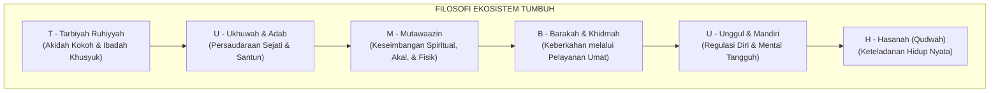
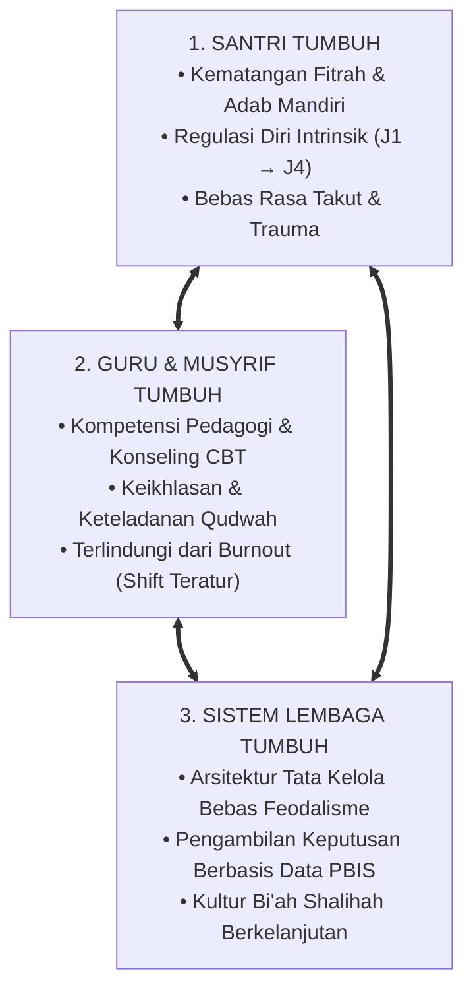

# BUKU 01: APA ITU TUMBUH?
## *Akar Filosofis, Ontologi Fitrah, dan Arsitektur Ekosistem Pembinaan Karakter Pesantren Terpadu 24 Jam*

---

**Nomor Buku**: `BOOK-SERIES-1/VOL-01/2026`  
**Sasaran Pembaca**: Pimpinan Pondok Pesantren, Badan Wakaf/Yayasan, Pengasuh, Kepala Madrasah, Asatidz, Musyrif, dan Peneliti Pendidikan Islam  
**Dewan Pakar Pengkaji**: Pakar Filosofi TUMBUH, Epistemologi Turats, Neurosains Perkembangan, dan Tata Kelola Qudwah  

---

# BAGIAN I: HAKIKAT, LATAR BELAKANG, & KRITIK PARADIGMA PENDIDIKAN PESANTREN

## 1.1 Titik Tolak Krisis: Mengapa Sistem TUMBUH Harus Lahir?

Dunia pesantren adalah benteng moral dan penjaga khazanah keilmuan Islam (*Harasatul Islam*) yang telah membuktikan ketangguhannya melintasi abad. Namun, di tengah perubahan zaman yang bergerak dengan kecepatan eksponensial, institusi pesantren menghadapi anomali kultural dan pedagogis yang menuntut evaluasi mendalam. 

Di banyak lingkungan pesantren tradisional maupun modern, sering kali terlihat pemandangan yang paradoks: santri yang menunjukkan kepatuhan luar biasa (*feigned compliance*) ketika berhadapan langsung dengan kiai atau guru, namun secara drastis mengalami kemunduran adab dan kepalsuan perilaku ketika berada di luar jangkauan pengawasan. Fenomena "kepatuhan semu karena takut hukuman" ini melahirkan generasi santri yang terbelah jiwanya: taat di permukaan, tetapi memendam pemberontakan batin dan kehilangan regulasi diri intrinsik saat kembali ke tengah masyarakat.

Di sisi lain, praktik pendisiplinan kerap terdistorsi ke arah tindakan punitif koersif. Hukuman fisik, bentakan kasar, pencukuran rambut paksa di depan umum, hingga razia malam buta yang memicu teror psikologis masih sering dianggap sebagai metode ampuh penegakan disiplin atas nama "penempaan mental". Sementara itu, para pembina asrama (*musyrif*) berjuang di garis depan tanpa sistem kerja yang terstruktur, mengalami kelelahan mental (*burnout*) parah akibat beban jaga 24 jam nonstop tanpa pembagian giliran kerja (*shift*) yang manusiawi.

Kondisi kritis inilah yang melahirkan **Sistem TUMBUH**. Sistem ini hadir bukan untuk membongkar ruh luhur kepesantrenan, melainkan untuk **memurnikan kembali tarbiyah nabawiyyah** dari endapan feodalisme, kekerasan fisik, dan pemaksaan mekanis. Sistem TUMBUH merestorasi fitrah pendidikan Islam dengan menyintesiskan keluhuran Turats klasik dan konsensus sains perkembangan mutakhir.

---

## 1.2 Hakikat & Definisi Sistem TUMBUH

**Sistem TUMBUH** adalah sebuah **arsitektur ekosistem pendidikan dan pengasuhan karakter 24 jam berbasis fitrah, adab, dan data ilmiah** yang dirancang untuk mewujudkan integrasi utuh antara madrasah/sekolah dan kehidupan asrama tanpa dikotomi. 

Sistem ini bertumpu pada keyakinan fundamental bahwa pendidikan karakter bukanlah proses pemaksaan bentuk (*molding*) dari luar melalui represi, melainkan proses penyemaian, penumbuhan, dan pematangan potensi kebaikan primordial (*fitrah*) yang telah dianugerahkan Allah SWT ke dalam jiwa setiap insan.

### Makna Filosofis 6 Pilar TUMBUH:
1. **Tarbiyah Ruhiyyah (تَرْبِيَةٌ رُوْحِيَّةٌ)**: Fondasi penanaman tauhid murni dan pembiasaan ibadah mahdhah yang berakar pada kesadaran muraqabatullah, bukan karena takut hukuman asrama.
2. **Ukhuwah & Adab (أُخُوَّةٌ وَأَدَبٌ)**: Kultur pergaulan santri yang memuliakan martabat sesama, merobohkan hegemoni senioritas feodal, dan menumbuhkan empati afektif.
3. **Mutawaazin (مُتَوَازِنٌ)**: Keseimbangan hidup yang selaras dengan ritme sirkadian biologis; memadukan waktu belajar mendalam, zikir khusyuk, asupan gizi sehat, serta pemenuhan hak tidur berkualitas (6.5–7 jam).
4. **Barakah & Khidmah (بَرَكَةٌ وَخِدْمَةٌ)**: Penanaman jiwa kerelawanan sejati yang diarahkan untuk memberdayakan masyarakat dan umat dhuafa, bukan pembantu feodal bagi senior.
5. **Unggul & Mandiri (تَفَوُّقٌ وَاسْتِقْلَالٌ)**: Pengembangan metakognisi, kapasitas pemecahan masalah mandiri, dan kematangan emosional santri.
6. **Hasanah / Qudwah (قُدْوَةٌ حَسَنَةٌ)**: Prinsip bahwa kurikulum terpenting dalam pendidikan karakter adalah keteladanan hidup para kiai, asatidz, dan musyrif (*Living Curriculum*).

---

## 1.3 Ontologi Fitrah & Dekonstruksi Behavioral Coercion

Dalam tinjauan ontologi Islam, manusia tidak dilahirkan sebagai kertas kosong yang pasif (*tabula rasa* ala John Locke) atau makhluk liar yang harus dijinakkan dengan cambuk kekerasan. Allah SWT berfirman:

$$\text{فَأَقِمْ وَجْهَكَ لِلدِّينِ حَنِيفًا ۚ فِطْرَتَ اللَّهِ الَّتِي فَطَرَ النَّاسَ عَلَيْهَا ۚ لَا تَبْدِيلَ لِخَلْقِ اللَّهِ ۚ ذَٰلِكَ الدِّينُ الْقَيِّمُ}$$

> *"Maka hadapkanlah wajahmu dengan lurus kepada agama (Islam); (sesuai) fitrah Allah disebabkan Dia telah menciptakan manusia menurut (fitrah) itu. Tidak ada perubahan pada ciptaan Allah. (Itulah) agama yang lurus..."* (QS. Ar-Rum [30]: 30).[^1]

Imam Ibnu Katsir dan Imam Al-Ghazali menjelaskan bahwa fitrah mencakup kapasitas inheren manusia untuk mengenali kebenaran (*Al-Haqq*), mencintai kebaikan, dan merindukan kesucian batin (*Tazkiyah*).[^2] 

Ketika lembaga pendidikan menggunakan **hukuman fisik dan intimidasi verbal**, secara neurobiologis hal tersebut memicu aktivasi berlebih pada sumbu *Hypothalamic-Pituitary-Adrenal (HPA)* dan *amigdala*. Otak santri terkunci dalam mode bertahan hidup (*Fight, Flight, Freeze*), memblokir fungsi *Prefrontal Cortex (PFC)* yang bertanggung jawab atas penalaran moral, refleksi diri, dan pembentukan memori jangka panjang hafalan Al-Qur'an.[^3] Akibatnya, santri tidak mengalami proses *Ta'dib* (internalisasi nilai), melainkan sekadar kepatuhan mekanis yang rapuh.

---

# BAGIAN II: ARSITEKTUR EKOSISTEM TUMBUH & INTEGRASI MULTIDISIPLIN

## 2.1 Sintesis Turats dan Konsensus Sains Modern

Kekuatan utama ekosistem TUMBUH terletak pada kemampuannya mengawinkan warisan emas khazanah keilmuan Islam (*Turats*) dengan penemuan sains mutakhir yang teruji secara empiris:

```mermaid
flowchart LR
    subgraph KhazanahIslam["KHAZANAH TURATS ISLAM"]
        T1["Konsep Ta'dib<br/>(Al-Attas & Al-Ghazali)"]
        T2["Tazkiyatun Nafs & Muraqabah<br/>(Ibnu Qayyim)"]
        T3["Kaidah Al-Qudwah Qabla Ad-Da'wah<br/>(Sunnah Nabawiyyah)"]
        T4["Prinsip Ash-Shulh & Ishlah<br/>(Fiqh Peradilan Damai)"]
    end

    subgraph SainsModern["KONSENSUS SAINS MODERN"]
        S1["SW-PBIS Multi-Tier<br/>(Sugai & Horner)"]
        S2["Neurosains Kognitif & Remaja<br/>(Siegel & Dahl)"]
        S3["Social-Emotional Learning CASEL<br/>(Weissberg & Durlak)"]
        S4["Restorative Justice 3R<br/>(Zehr & Braithwaite)"]
    end

    KhazanahIslam === Integrasi["SINTESIS PARADIGMA TUMBUH"] === SainsModern
```

1. **Ta'dib & Positive Behavioral Interventions and Supports (SW-PBIS)**:
   * **Konvergensi**: Penanaman adab terstruktur melalui rekayasa lingkungan positif, penetapan ekspektasi perilaku yang jelas dan visual, serta rasio apresiasi emas 4:1 (4 penguatan kebaikan berbanding 1 koreksi).
2. **Tazkiyatun Nafs & CASEL Social-Emotional Learning**:
   * **Konvergensi**: Integrasi penyucian hati (*Mujahadah*) dengan 5 pilar kecerdasan emosi (Kesadaran Diri, Regulasi Emosi, Empati Sosial, Keterampilan Relasi, dan Pengambilan Keputusan Bertanggung Jawab).
3. **Ishlah al-Bain & Restorative Justice 3R**:
   * **Konvergensi**: Transformasi penanganan pelanggaran dari pemberian denda/hukuman fisik menjadi proses perdamaian tuntas (*Ishlah*), ganti rugi logis (*Restitution*), penyelesaian akar masalah (*Resolution*), dan pemulihan ukhuwah tanpa stigma permanen (*Reconciliation*).

---

## 2.2 Triad Pertumbuhan Simbiotik Pesantren

Sistem TUMBUH menetapkan bahwa keberhasilan pendidikan karakter tidak dapat diukur hanya dari kepatuhan santri semata. Ekosistem pembinaan harus memastikan bahwa **tiga entitas utama bertumbuh secara serempak dan simbiotik**:

* **Jika hanya santri yang dituntut bertumbuh**: Lembaga akan berubah menjadi penjara moral yang menindas.
* **Jika musyrif tidak bertumbuh**: Terjadi *turnover* tinggi, musyrif bersikap kasar karena lelah, dan pengasuhan kehilangan ruh kasih sayang.
* **Jika sistem lembaga tidak bertumbuh**: Inovasi adab akan layu karena terbentur birokrasi kaku dan kepemimpinan feodal.

---

## 2.3 Perbandingan Komparatif: Paradigma Konvensional vs Paradigma TUMBUH

| Dimensi Pengasuhan | Paradigma Pesantren Konvensional Punitif | Paradigma Ekosistem TUMBUH |
| :--- | :--- | :--- |
| **Pandangan terhadap Santri** | Objek yang harus ditundukkan dan diisi aturan. | Subjek fitrah mulia yang disemai potensi kebaikannya. |
| **Metode Disiplin** | Hukuman fisik, bentakan, rasa malu publik (*Public Shaming*). | Disiplin Positif (*Firm & Kind*), konsekuensi logis, dan dialog restoratif 3R. |
| **Pola Pengawasan** | Pengawasan dingin polisional (hadir hanya saat salah). | *Warm Presence* (kehadiran hangat, menyapa, menguatkan, membimbing). |
| **Rasio Interaksi** | Dominasi teguran, denda, dan pencatatan dosa. | *Magic Ratio 4:1* (4 apresiasi kebaikan faktual untuk 1 intervensi korektif). |
| **Sistem Asesmen** | Penilaian kesan subjektif dan perankingan adab. | Asesmen Ipsatif 360° (membandingkan santri dengan capaian dirinya terdahulu). |
| **Kondisi Kerja Musyrif** | Jaga 24 jam nonstop, tanpa shift, rawan kelelahan mental. | Shift kerja manusiawi (4 shift/hari), rasio 1:15–20, supervisi rutin anti-burnout. |
| **Struktur Kelembagaan** | Sekat terpisah antara Madrasah dan Asrama. | *Dual-Pillar Caretaking* terpadu di bawah satu komando Kepala Pesantren. |

---

# BAGIAN III: TABEL SINTESIS, CATATAN KAKI, & DAFTAR PUSTAKA

## 3.1 Tabel Sintesis Integrasi Dimensi Filosofis TUMBUH

| Pilar Filosofis | Landasan Turats Klasik | Landasan Sains Kontemporer | Praksis Lapangan 24 Jam |
| :--- | :--- | :--- | :--- |
| **Ontologi Insan** | QS. Ar-Rum: 30 & *Kitab al-Fithrah* Al-Ghazali. | Teori Perkembangan Anak & Neuroplastisitas. | Menghapus hukuman fisik dan merawat fitrah santri. |
| **Metodologi Adab** | *Ta'lim al-Muta'allim* (Az-Zarnuji) & *Tadzkirah as-Sami'* (Ibnu Jama'ah). | *Self-Determination Theory* & Pembentukan Kebiasaan (Clear). | Peta ekspektasi adab visual di kamar, masjid, dan kelas. |
| **Manajemen Kasus** | *Ishlah Dzat al-Bain* & *Adab al-Qadhi* Fiqh. | *Whole-School Restorative Conferencing*. | Majelis Ishlah 5 pertanyaan reflektif tanpa pemberian label negatif. |
| **Kesejahteraan Pembina** | *Huquq al-Ujara'* & Sunnah Menyayangi Pengasuh. | *Occupational Health Psychology & Anti-Burnout Systems*. | Shift 8 jam kerja, ruang rekreasi musyrif, dan konseling pendamping. |

---

## 3.2 Catatan Kaki (*Footnotes 1-to-1*)

[^1]: Al-Qur'an al-Karim, Terjemahan Kementerian Agama Republik Indonesia, Surat Ar-Rum ayat 30.
[^2]: Al-Ghazali, Abu Hamid. (2005). *Ihya' 'Ulum ad-Din: Kitab Syarh 'Aja'ib al-Qalb*. Beirut: Dar Ibn Hazm, juz 3, hlm. 12–28; Ibnu Katsir, 'Imaduddin. (1999). *Tafsir al-Qur'an al-'Azhim*. Riyadh: Dar Thayyibah, juz 6, hlm. 305–309.
[^3]: Siegel, D. J. (2012). *The Developing Mind: How Relationships and the Brain Interact to Shape Who We Are*. New York: Guilford Press; Dahl, R. E. (2004). Adolescent brain development: A period of vulnerabilities and opportunities. *Annals of the New York Academy of Sciences*, 1021(1), 1-22.
[^4]: Al-Attas, Syed Muhammad Naquib. (1980). *The Concept of Education in Islam: A Framework for an Islamic Philosophy of Education*. Kuala Lumpur: ISTAC.
[^5]: Sugai, G., & Horner, R. H. (2006). A promising approach for expanding and sustaining school-wide positive behavior support. *School Psychology Review*, 35(2), 245-259.
[^6]: Zehr, H. (2002). *The Little Book of Restorative Justice*. Intercourse, PA: Good Books.
[^7]: Durlak, J. A., Weissberg, R. P., et al. (2011). The impact of enhancing students' social and emotional learning: A meta-analysis of school-based universal interventions. *Child Development*, 82(1), 405-432.
[^8]: Deci, E. L., & Ryan, R. M. (2000). The" what" and" why" of goal pursuits: Human needs and the self-determination of behavior. *Psychological Inquiry*, 11(4), 227-268.

---

## 3.3 Daftar Pustaka Standar APA 7th & Turats

* Al-Attas, S. M. N. (1980). *The Concept of Education in Islam: A Framework for an Islamic Philosophy of Education*. Kuala Lumpur: International Institute of Islamic Thought and Civilization (ISTAC).
* Al-Ghazali, A. H. (2005). *Ihya' 'Ulum ad-Din* (4 Jilid). Beirut: Dar Ibn Hazm.
* Az-Zarnuji, B. (2008). *Ta'lim al-Muta'allim Thariq at-Ta'allum*. Ditahqiq oleh Musthafa 'Asyur. Kairo: Maktabah al-Qur'an.
* Dahl, R. E. (2004). Adolescent brain development: A period of vulnerabilities and opportunities. *Annals of the New York Academy of Sciences*, 1021(1), 1-22.
* Deci, E. L., & Ryan, R. M. (2000). The "what" and "why" of goal pursuits: Human needs and the self-determination of behavior. *Psychological Inquiry*, 11(4), 227-268.
* Durlak, J. A., Weissberg, R. P., Dymnicki, A. B., Taylor, R. D., & Schellinger, K. B. (2011). The impact of enhancing students' social and emotional learning: A meta-analysis of school-based universal interventions. *Child Development*, 82(1), 405-432.
* Ibnu Jama'ah, B. (2012). *Tadzkirah as-Sami' wal Mutakallim fi Adab al-'Alim wal Muta'allim*. Beirut: Dar al-Basyair al-Islamiyyah.
* Ibnu Qayyim al-Jauziyyah. (2003). *Tuhfat al-Maudud bi Ahkam al-Maulud*. Ditahqiq oleh 'Abdul Qadir al-Arnauth. Damaskus: Dar al-Bayan.
* Siegel, D. J. (2012). *The Developing Mind: How Relationships and the Brain Interact to Shape Who We Are*. New York: Guilford Press.
* Sugai, G., & Horner, R. H. (2006). A promising approach for expanding and sustaining school-wide positive behavior support. *School Psychology Review*, 35(2), 245-259.
* Zehr, H. (2002). *The Little Book of Restorative Justice*. Intercourse, PA: Good Books.
