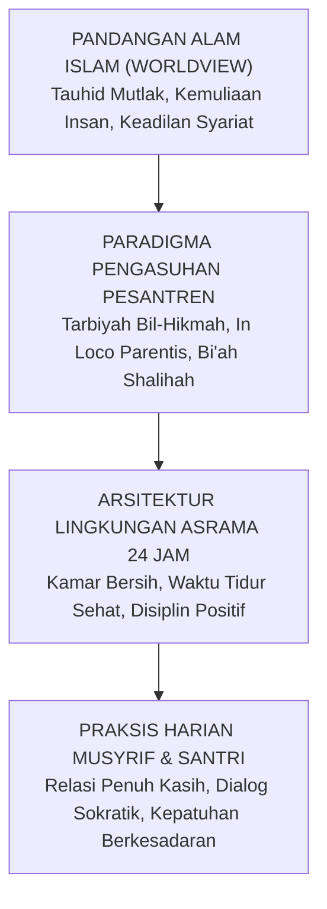
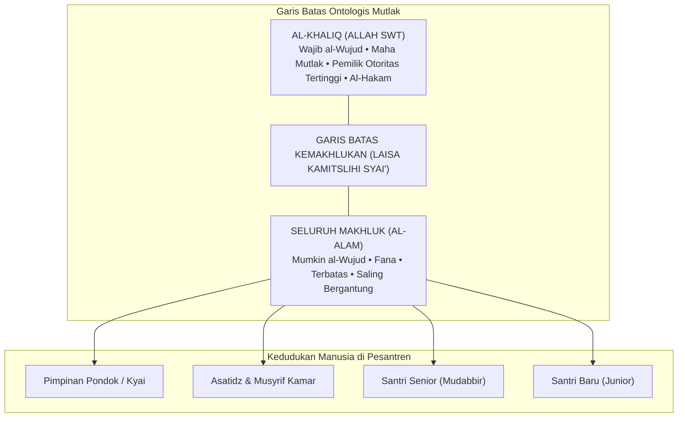
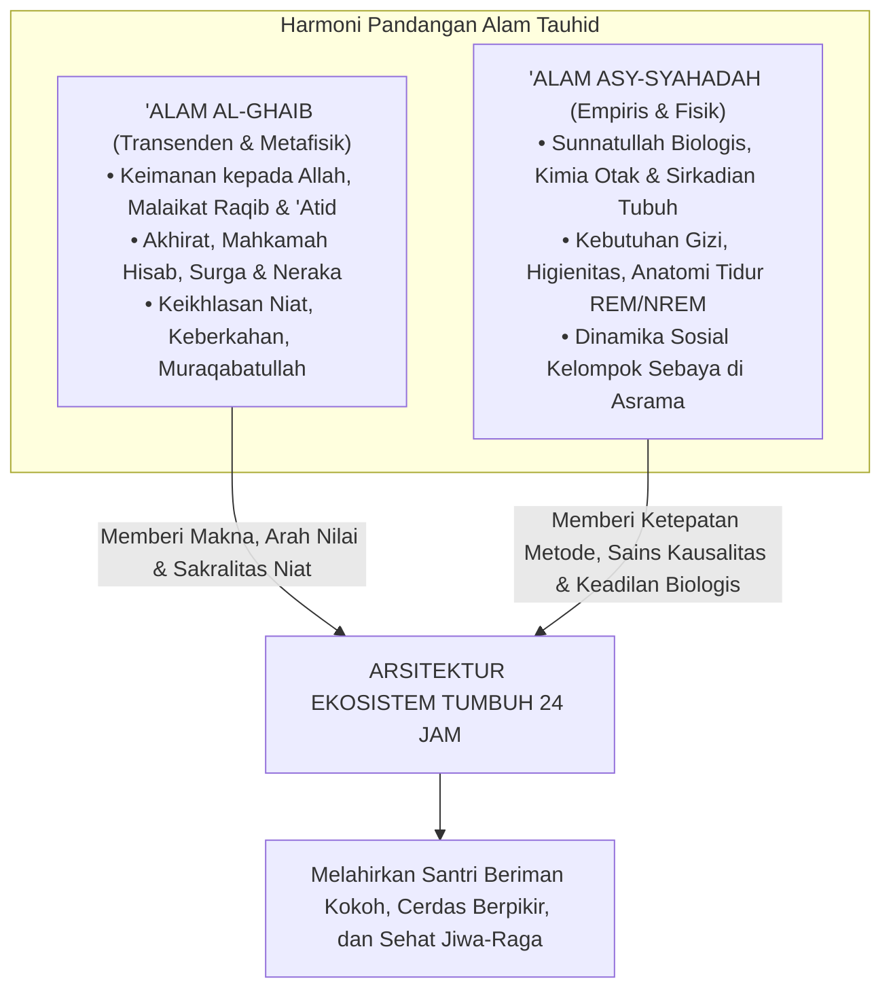
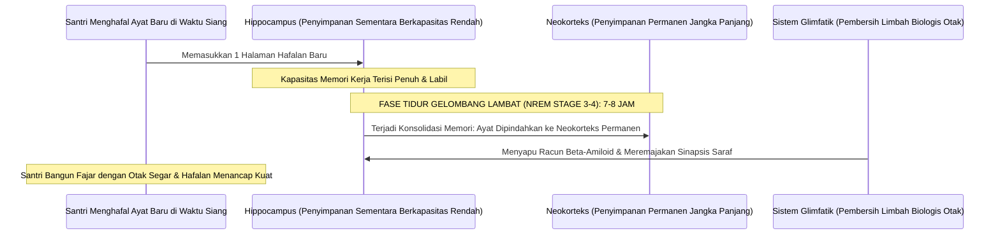
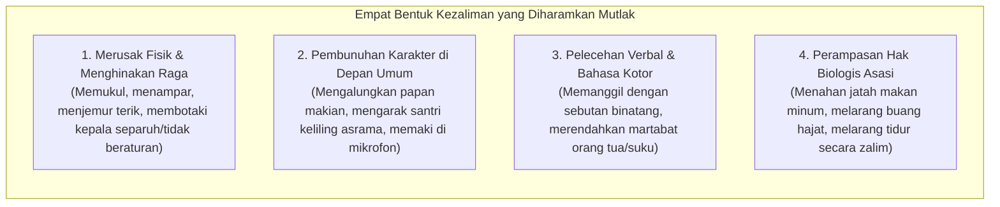
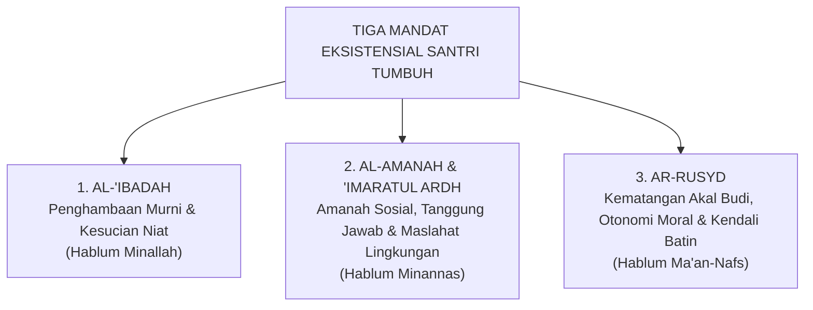
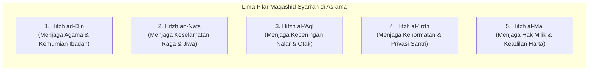

# BAB 2: PANDANGAN ALAM ISLAM SEBAGAI POROS PENDIDIKAN
## *The Islamic Worldview* dan Implikasinya bagi Ekosistem Pesantren 24 Jam

> *"Pendidikan dalam Islam bukanlah sekadar proses pengajaran informasi atau pelatihan keterampilan teknis, melainkan penanaman adab ke dalam diri manusia (Ta'dib), agar ia mengenali dan mengakui kedudukan dirinya yang tepat dalam tata susunan wujud ciptaan Allah, sehingga melahirkan amal perbuatan yang adil dan benar. Ketiadaan adab (loss of adab) adalah pangkal keruntuhan peradaban umat, dan adab tidak mungkin ditegakkan tanpa pandangan alam (worldview) yang lurus tentang hakikat wujud."*  
> — **Prof. Dr. Syed Muhammad Naquib al-Attas**, *The Concept of Education in Islam*[^1]

---

### 2.1 Ketika Filsafat Bertemu Lantai Asrama: Mengapa Worldview Bukan Sekadar Teori?

Di banyak ruang seminar perguruan tinggi, perbincangan mengenai **Pandangan Alam (*The Islamic Worldview / Ru'yatul Islam lil-Wujud*)** kerap diletakkan di menara gading yang jauh dari denyut kehidupan praktis. Konsep ini sering dianggap sebagai konsumsi para filosof dan teolog yang asyik memperdebatkan metafisika di balik meja perpustakaan. Akibatnya, para pengasuh pondok pesantren, kepala kepengasuhan, dan musyrif yang sehari-hari berkeringat di lorong asrama kerap memandang konsep ini dengan tatapan skeptis: *"Kami di sini berhadapan dengan santri yang berkelahi berebut gayung mandi, santri yang merokok di balik plafon jemuran, dan santri yang menangis rindu orang tuanya. Apa relevansinya membicarakan ontologi, kosmologi, dan epistemologi tauhid bagi tugas harian kami?"*

Ketahuilah wahai para pendidik: **Pandangan Alam (*Worldview*) sesungguhnya bekerja di setiap tarikan napas, setiap keputusan disiplin, dan setiap gerakan tangan kita di lantai asrama.**

Pendidikan tidak pernah bersifat netral nilai (*value-neutral*). Tidak ada satu pun tata tertib kamar, jadwal kegiatan harian, atau metode penanganan santri yang lahir dari ruang hampa. Di balik setiap tindakan pengasuh, selalu ada asumsi-asumsi filosofis tak terucap yang mendasarinya:

#### Kasus Penendangan Kasur vs Dialog Bangun Subuh
Perhatikan tindakan seorang musyrif yang menyiramkan air cucian atau menendang kasur seorang santri yang sulit bangun subuh. Tindakan tersebut bukan sekadar manifestasi dari rasa jengkel sesaat; tindakan itu adalah cerminan dari **worldview mekanistik-materialistik** yang bersarang di kepalanya. Musyrif tersebut, secara sadar atau tidak, memandang santri laksana benda mati atau hewan ternak yang hanya bisa digerakkan melalui sengatan rasa sakit fisik. Ia tidak memandang santri sebagai makhluk mulia pemilik akal budi yang sedang bergulat dengan kelelahan biologis dan kebutuhan bimbingan kesadaran.

Sebaliknya, perhatikan seorang musyrif yang mendekati pembaruan santri dengan tenang, duduk bersimpuh di sampingnya, meletakkan tangannya yang hangat di pundak sang anak, lalu membisikkan ayat suci atau doa dengan nada suara yang penuh getaran kasih sayang kebapaan: *"Bangunlah duhai anakku, Rabb-mu Yang Maha Pengasih sedang membentangkan rahmat-Nya di sepertiga malam terakhir ini..."* Tindakan ini lahir dari **worldview tauhid yang hidup**: musyrif tersebut meyakini bahwa di dalam raga anak yang sedang tertidur itu bersemayam fitrah ruhaniyah yang merindukan Tuhannya, dan tugas pendidik adalah membangunkan kerinduan tersebut dengan sentuhan kasih sayang Ilahi.

#### Dekonstruksi Mitos Asrama Kumuh: "Biar Prihatin dan Barakah"
Contoh lain yang sangat mencolok di sebagian pesantren adalah pembiaran fasilitas asrama yang kumuh, lemari-lemari yang reyot, kamar mandi yang berbau pesing dan penuh jentik nyamuk, serta sanitasi air yang keruh berbau karat. Ketika dikritik oleh wali santri atau tenaga medis, sebagian pengurus dengan enteng berdalih: *"Santri itu memang harus tirakat prihatin! Jangan manja dengan fasilitas mewah. Dulu para ulama salaf juga hidup susah, justru dari keprihatinan itulah keberkahan ilmu lahir!"*

Ini adalah contoh nyata bagaimana **kekeliruan pandangan alam (*worldview distortion*) melahirkan kezaliman sistemik**. 

Argumen tersebut mencampuradukkan secara sesat antara **zuhud syar'i** (melepaskan keterikatan hati dari gemerlap duniawi) dengan **kotor dan jorok yang bertentangan dengan fitrah**. Pandangan alam Islam yang shahih tidak pernah memuliakan kekumuhan. Rasulullah ﷺ bersabda dengan sangat tegas:

$$\text{الطُّهُورُ شَطْرُ الْإِيمَانِ}$$

> *"Kesucian dan kebersihan itu adalah separuh dari keimanan."*  
> (HR. Muslim no. 223)[^2]

Ketika pengelola pondok membiarkan santri hidup di tengah lingkungan yang tidak higienis hingga mereka terserang penyakit kulit (*scabies*) massal dan tipes, pengelola tersebut sesungguhnya sedang melanggar amanah syariat dalam menjaga jiwa dan raga (*hifzh an-nafs*). Mengatasnamakan keberkahan untuk menutupi kelalaian manajemen sanitasi adalah sebuah kejahatan intelektual dan moral.

Worldview adalah akar pohon; arsitektur sistem adalah batangnya; dan praksis harian musyrif di kamar asrama adalah buahnya. Jika akarnya beracun atau terdistorsi, mustahil pohon tersebut menghasilkan buah karakter yang manis dan menyejukkan umat.

---

### 2.2 Kosmologi Tauhid: Meruntuhkan Sindrom "Firaun Mini" di Asrama

Aksioma ontologis paling agung dan mutlak dalam pandangan alam Islam adalah **Tauhidullah**—pengesaan Allah dalam rububiyyah, uluhiyyah, dan asma' wa shifat-Nya:

$$\text{قُلْ هُوَ اللَّهُ أَحَدٌ ۝ اللَّهُ الصَّمَدُ ۝ لَمْ يَلِدْ وَلَمْ يُولَدْ ۝ وَلَمْ يَكُن لَّهُ كُفُوًا أَحَدٌ}$$

> *"Katakanlah: Dialah Allah, Yang Maha Esa. Allah adalah Dzat yang bergantung kepada-Nya segala sesuatu. Dia tiada beranak dan tidak pula diperanakkan, dan tidak ada seorang pun yang setara dengan Dia."*  
> (QS. Al-Ikhlas [112]: 1–4)[^3]

Dalam kosmologi tauhid, garis demarkasi ontologis antara **Al-Khaliq** dan **Al-Makhluk** bersifat abadi, mutlak, dan tidak akan pernah kabur:

Allah ﷻ adalah satu-satunya *Rabb*—Sang Pencipta, Pemilik, Pemelihara, dan Pendidik Hakiki seluruh alam semesta. Sementara seluruh manusia di lingkungan pesantren—mulai dari kyai pendiri pondok, direktur pengasuhan, musyrif senior, hingga santri cilik yang baru tiba kemarin sore—semuanya berada pada derajat ontologis yang sama: **mereka semua adalah hamba sahaya Allah (*'ibadullah*)**.

Prinsip tauhid murni ini membawa implikasi dekonstruktif yang sangat fundamental: **Meruntuhkan Budaya Feodalisme dan Menghancurkan Sindrom "Firaun Mini" di Pesantren**.

#### Anatomi Penyakit Feodalisme Asrama
Di sebagian institusi asrama tradisional, sering kali tumbuh subur sebuah kultur feodal yang membajak konsep adab dan ketakziman:
1. **Otoritas Tanpa Akuntabilitas**: Para pembina asrama atau pengurus santri senior merasa memiliki kekuasaan mutlak yang tidak boleh dipertanyakan. Mereka memposisikan diri laksana dewa-dewa kecil yang bebas menjatuhkan vonis, menciptakan aturan sepihak di luar syariat, dan memperlakukan junior laksana budak belian.
2. **Kriminalisasi Nalar Kritis**: Santri yang mencoba menanyakan hikmah sebuah kebijakan, atau yang mencoba mengklarifikasi tuduhan saat ia dituduh melanggar, seketika dicap sebagai anak pemberontak yang "kurang ajar (*su'ul adab*)", lalu diancam dengan kutukan mistis: *"Hati-hati, ilmumu tidak akan barakah dan hidupmu akan celaka jika membantah pengurus!"*
3. **Penyalahgunaan Konsep Ketaatan**: Konsep ketaatan kepada ulama (*sami'na wa atha'na*) yang semestinya diletakkan dalam koridor kebenaran syariat dibelokkan menjadi kepatuhan buta pada hawa nafsu dan arogansi senior.

Ini adalah perusakan epistemik yang sangat berbahaya! Tradisi keilmuan Islam yang luhur dibangun di atas argumentasi dalil, dialog keilmuan, dan keadilan moral. Rasulullah ﷺ menggariskan batas ketaatan makhluk dengan kalimat yang menjadi piagam emansipasi kemanusiaan:

$$\text{لَا طَاعَةَ لِمَخْلُوقٍ فِي مَعْصِيَةِ الْخَالِقِ}$$

> *"Tidak ada ketaatan kepada makhluk mana pun dalam perkara yang bermaksiat kepada Sang Khaliq."*  
> (HR. Ahmad no. 1095 dan At-Thabarani no. 381, dari Ali bin Abi Thalib رضي الله عنه, sanad shahih)[^4]

Bahkan sahabat termulia, Amirul Mukminin Abu Bakar Ash-Shiddiq رضي الله عنه, dalam pidato kepemimpinannya setelah wafatnya Rasulullah ﷺ, dengan lantang mendeklarasikan di hadapan seluruh umat:

$$\text{أَطِيعُونِي مَا أَطَعْتُ اللَّهَ وَرَسُولَهُ، فَإِذَا عَصَيْتُ اللَّهَ وَرَسُولَهُ فَلَا طَاعَةَ لِي عَلَيْكُمْ}$$

> *"Taatilah aku selama aku menaati Allah dan Rasul-Nya dalam memimpin kalian. Namun apabila aku bermaksiat kepada Allah dan Rasul-Nya, maka gugurlah kewajiban kalian untuk taat kepadaku!"*[^5]

Jika seorang pemimpin agung dan sahabat termulia seperti Abu Bakar Ash-Shiddiq menyatakan bahwa ketaatan rakyat kepadanya bersyarat pada kepatuhannya kepada Allah dan Rasul-Nya, lalu atas hak apa seorang musyrif kamar atau santri senior menuntut kepatuhan buta dari adik kelasnya saat ia memerintahkan hal-hal yang zalim dan merendahkan martabat manusia?

Dalam ekosistem **TUMBUH**, kepemimpinan para asatidz dan musyrif dibangun di atas prinsip **Khadimul Ummah (Pelayan Santri)** dan **Qudwah Hasanah (Keteladanan Nyata)**. Otoritas seorang pendidik bukan terpancar dari rotan di tangannya, bukan pula dari ancaman su'ul adab yang menakut-nakuti, melainkan terpancar dari keluhuran akhlaknya, keadilan sikapnya, dan ketulusan doanya bagi keselamatan jiwa santri-santrinya.

---

### 2.3 Harmoni Dua Dimensi: Integrasi 'Alam al-Ghaib dan 'Alam asy-Syahadah

Salah satu kesalahan metodologis paling fatal dalam dunia pendidikan pesantren adalah terjadinya **pemisahan artifisial (dikotomi sesat)** antara urusan spiritualitas ruhaniyah dengan hukum kausalitas biologis-empiris.

Pandangan alam Islam memandang bahwa realitas ciptaan Allah merentang dalam dua dimensi agung yang saling berkelindan secara harmonis:

1. **'Alam al-Ghaib (Realitas Gaib/Transenden)**: Merupakan ranah metafisika yang diwahyukan: keberadaan Allah, malaikat yang mencatat setiap amal kebajikan dan keburukan, pertanggungjawaban di padang mahsyar, serta balasan surga dan neraka. Realitas gaib memberikan **makna tertinggi (*ultimate meaning*)** dan **kendali moral internal (*muraqabatullah*)**: santri beradab bukan karena takut cctv pengawas, melainkan karena yakin bahwa Allah senantiasa mengawasi gerak-gerik batinnya.
2. **'Alam asy-Syahadah (Realitas Teramati/Empiris)**: Merupakan ranah hukum-hukum alam (*sunnatullah fi al-khalq*) yang dapat diobservasi, diteliti, dan diukur: biokimia tubuh, kebutuhan neurobiologis, irama sirkadian, serta hukum-hukum psikologi perkembangan manusia.

Kedua realitas ini diciptakan oleh Tuhan yang sama: Allah ﷻ. Oleh karena itu, **ayat-ayat kauniyyah (hukum alam ciptaan Allah) tidak akan pernah bertentangan dengan ayat-ayat qauliyyah (syariat firman Allah)**. 

Mengabaikan hukum kausalitas empiris dalam mengelola santri dengan dalih spiritualitas adalah sebuah kebodohan yang nyata.

#### Bedah Sains: Mengapa Menyunat Jam Tidur Santri Adalah Sabotase Hafalan Al-Qur'an?
Mari kita bedah secara ilmiah salah satu praktik keliru yang paling sering terjadi di pesantren: **pemotongan jam tidur santri secara ekstrem atas nama tirakat**.

Di banyak asrama tahfizh, santri dipaksa menjalani jadwal yang tidak masuk akal:
* Pengajian kitab malam berakhir pukul 23.00. Santri baru bisa tidur pukul 23.30.
* Pukul 03.00 dini hari, bel berbunyi nyaring dan santri dipaksa bangun untuk qiyamul lail dan setoran hafalan subuh.
* Akumulasi waktu tidur santri hanya 3,5 hingga 4 jam per malam.

Ketika santri-santri tersebut di siang hari tampak loyo, tertidur saat guru menjelaskan, mengalami penurunan daya ingat secara drastis, atau mudah histeris dan depresi, sebagian pengurus dengan enteng menghakimi: *"Itu bukti bahwa hatinya masih kotor! Kurang ikhlas menghafalnya, makanya otaknya tumpul dan diganggu jin!"*

Mari kita tatap kebenaran ilmiah berdasarkan **Neurosains Kognitif dan Anatomi Tidur**:

Penelitian neurobiologi mutakhir oleh Prof. Matthew Walker dari University of California, Berkeley, dan tim peneliti tidur dunia membuktikan sunnatullah biologis yang sangat menakjubkan[^6]:

1. **Fungsi Hipokampus Sebagai Kotak Surat Sementara**:  
   Saat santri menghafal Al-Qur'an di siang hari, ayat-ayat tersebut disimpan di **Hipokampus**—organ penyimpanan sementara yang kapasitasnya sangat terbatas. Jika santri terus dipaksa menghafal tanpa tidur yang cukup, hipokampus mengalami kejenuhan (*saturation*); informasi baru tidak bisa masuk, dan informasi yang baru masuk akan langsung terhapus.
2. **Konsolidasi Memori Hanya Terjadi pada Fase NREM Gelombang Lambat**:  
   Agar hafalan Al-Qur'an berpindah dari hipokampus menuju **Neokorteks** (arsip memori jangka panjang yang permanen), otak **mutlak membutuhkan fase tidur nyenyak gelombang lambat (*Slow-Wave Sleep / NREM Tahap 3 dan 4*)**. Fase ini hanya bisa dicapai secara optimal jika seseorang tidur dalam siklus penuh minimal 7 hingga 8 jam per malam bagi usia remaja.
3. **Aktivasi Sistem Glimfatik (Pembersih Sampah Otak)**:  
   Ketika manusia tidur lelap, sel-sel glia di otak menyusut hingga 60%, memungkinkan cairan serebrospinal mengalir deras menyapu protein-protein racun neurotoksik (seperti beta-amiloid dan tau) yang menumpuk akibat aktivitas berpikir seharian. Sistem pembersihan limbah ini **TIDAK AKAN BEKERJA** saat manusia terjaga.

Jika seorang santri tidur hanya 4 jam per hari secara kronis:
* Transfer memori dari hipokampus ke neokorteks **gagal total**. Hafalan yang disetorkan kemarin sore akan menguap hilang keesokan harinya.
* Terjadi **Atrofi Saraf dan Pengerutan Volume Otak**: Cabang-cabang dendrit di hipokampusnya mengalami kerusakan permanen. Santri secara biologis menjadi pelupa, tumpul daya nalarnya, dan lambat berpikir.
* Terjadi **Ketidakstabilan Emosional Akut**: Amigdalanya menjadi 60% lebih hiperaktif karena koneksi penghambat dari PFC terputus akibat kelelahan. Santri menjadi mudah marah, cengeng, agresif terhadap temannya, atau tenggelam dalam kecemasan mendalam.

TUMBUH mendeklarasikan dengan tegas: **Menjamin santri tidur nyenyak selama minimal 7 jam per hari adalah bagian dari ibadah dan ketaatan kepada syariat Allah!** Menyunat jam tidur santri secara ugal-ugalan bukanlah tirakat yang terpuji; itu adalah perusakan organ tubuh biologis ciptaan Allah yang diamanahkan kepada kita untuk dijaga.

---

### 2.4 Antropologi Insan: Martabat Asasi (*Karamah*) dan Hak-Hak Santri

Siapakah sesungguhnya santri yang kita bimbing di pesantren? Apakah mereka sekadar deretan nomor induk santri? Apakah mereka sekadar objek pembinaan yang bebas kita bentak dan hukum sesuka hati demi melampiaskan kejengkelan kita?

Al-Qur'an al-Karim menetapkan kedudukan ontologis manusia dengan bahasa yang sangat agung dan memuliakan:

$$\text{وَلَقَدْ كَرَّمْنَا بَنِي آدَمَ وَحَمَلْنَاهُمْ فِي الْبَرِّ وَالْبَحْرِ وَرَزَقْنَاهُم مِّنَ الطَّيِّبَاتِ وَفَضَّلْنَاهُمْ عَلَىٰ كَثِيرٍ مِّمَّنْ خَلَقْنَا تَفْضِيلًا}$$

> *"Dan sesungguhnya telah Kami muliakan anak-anak keturunan Adam; Kami angkut mereka di daratan dan di lautan, Kami anugerahkan kepada mereka rezeki dari yang baik-baik, dan Kami lebihkan mereka di atas kebanyakan makhluk yang telah Kami ciptakan dengan kelebihan yang sempurna."*  
> (QS. Al-Isra' [17]: 70)[^7]

Perhatikan penegasan ayat ini: **وَلَقَدْ كَرَّمْنَا بَنِي آدَمَ** (*Dan sungguh Kami telah memuliakan anak-cucu Adam*).  
Imam Fakhruddin Ar-Razi dalam tafsir monumentalnya *Mafatih al-Ghaib* menjelaskan bahwa kemuliaan (*al-karamah*) yang dianugerahkan Allah kepada manusia mencakup seluruh dimensinya: rupa fisiknya yang indah dan tegak lurus, akal budinya yang mampu menyingkap rahasia alam, kemampuannya memilih dengan sadar (*al-ikhtiyar*), serta kelayakannya menerima khitab syariat dan mengemban amanah memakmurkan bumi (*'imaratul ardh*)[^8].

Kemuliaan ini adalah **kemuliaan asasi (*inherent ontological dignity*)**. Kemuliaan ini melekat pada diri seorang santri semata-mata karena ia adalah manusia ciptaan Allah yang ditiupkan ruh ke dalam raganya.

Kemuliaan ini **TIDAK PERNAH HILANG ATAU GUGUR** hanya karena:
* Seorang santri terlambat bangun salat subuh;
* Seorang santri belum mampu menguasai kaidah nahwu;
* Seorang santri melakukan pelanggaran tata tertib asrama.

Oleh karena itu, dalam ekosistem **TUMBUH**, seluruh metode pendisiplinan yang bertujuan **menghancurkan harga diri dan meremukkan martabat santri (*mortification of dignity*) diharamkan secara mutlak**:

Santri yang melakukan kesalahan tetap berhak diperlakukan sebagai hamba Allah yang mulia. Ia berhak mendapatkan pembelaan yang adil melalui asas syariat yang universal: **Al-Ashlu Bara'atudz-Dzimmah (Asas Praduga Tak Bersalah)**. Seorang santri tidak boleh divonis bersalah hanya berdasarkan desas-desus atau praduga sepihak tanpa adanya proses *tabayyun* (klarifikasi) yang objektif dan transparan.

---

### 2.5 Tiga Mandat Eksistensial: Menumbuhkan Insan Menuju Derajat Rusyd

Pendidikan Islam dalam ekosistem TUMBUH bukanlah proses mencetak "robot penurut yang pasif". Tujuan agung tarbiyah adalah menuntun santri agar mampu menyatukan tiga mandat eksistensial kehidupannya secara seimbang:

#### 1. Mandat Al-'Ibadah: Menegakkan Penghambaan Total
Santri dibimbing untuk menyadari bahwa tujuan penciptaannya di muka bumi adalah beribadah kepada Allah semata (QS. Adz-Dzariyat [51]: 56). Namun ibadah di sini tidak dipahami secara kerdil hanya sebatas ritual mekanis di atas sajadah. Ibadah dalam ekosistem TUMBUH meluas ke seluruh lorong asrama: menjaga kebersihan tempat tidur adalah ibadah, menyapa saudara sekamar dengan senyuman adalah ibadah sedekah, mematikan kran air yang bocor adalah ibadah menjaga amanah bumi, dan belajar sungguh-sungguh adalah ibadah jihad fi sabilillah.

#### 2. Mandat Amanah Sosial dan 'Imaratul Ardh: Memakmurkan Bumi
Santri dididik untuk tidak menjadi manusia yang egois (*individualistic piety*). Kamar asrama adalah laboratorium miniatur peradaban. Di sanalah santri belajar seni bermasyarakat: bagaimana meredam ego pribadi saat berhadapan dengan perbedaan karakter teman, bagaimana berinisiatif menolong kawan yang sakit tanpa diminta, dan bagaimana merawat fasilitas bersama agar tidak rusak. Santri dilatih menjadi insan yang bermanfaat bagi sesamanya (*khairun nasi anfa'uhum lin-nas*).

#### 3. Mandat Ar-Rusyd: Kemandirian Batin Berkesadaran Penuh
Inilah puncak pencapaian kepribadian dalam arsitektur perkembangan TUMBUH. Istilah **Ar-Rusyd** adalah konsep Al-Qur'an yang menggambarkan tingkat kematangan tertinggi ketika seseorang telah memiliki kecerdasan intelektual, kemandirian emosional, dan integritas moral yang kokoh (QS. An-Nisa' [4]: 6)[^9].

Insan yang telah mencapai derajat *rusyd* adalah pribadi yang:
* Tidak lagi memerlukan rotan musyrif untuk melangkah salat subuh, karena nuraninya sendiri yang membangunkannya bermunajat kepada Allah.
* Tidak lagi memerlukan ancaman sanksi untuk menahan tangannya dari barang milik orang lain, karena rasa malunya kepada Allah telah menjadi benteng pelindung dirinya.
* Mampu mengambil keputusan moral yang tepat dan bertanggung jawab di tengah godaan zaman yang membingungkan.

Inilah muara akhir dari seluruh tangga progresi kemandirian TUMBUH (J1 hingga J4): bukan sekadar membuat santri patuh selama berada di balik gerbang pondok, melainkan melahirkan kader-kader peradaban yang telah mandiri secara adab, kokoh memegang prinsip, dan siap memimpin umat di mana pun mereka berada.

---

### 2.6 Maqashid Syari'ah: Perlindungan Lima Hak Asasi di Kehidupan Asrama 24 Jam

Bagaimana memastikan bahwa tata tertib, sistem perizinan, dan pola pembinaan di pesantren kita benar-benar berdiri di atas syariat Allah dan bukan di atas hawa nafsu pengurus?

Ukuran pengujinya adalah **Maqashid Syari'ah (Tujuan-Tujuan Asasi Syariat)** sebagaimana dirumuskan oleh Imam Al-Ghazali dalam *Al-Mustashfa* dan Imam Asy-Syathibi dalam *Al-Muwafaqat*[^10]. Seluruh syariat Islam diturunkan untuk memelihara lima hak asasi eksistensial manusia (*Ad-Dharuriyyat al-Khamsah*).

Mari kita bedah secara mendalam bagaimana kelima pilar Maqashid Syari'ah ini wajib diterjemahkan ke dalam tata kelola asrama pesantren 24 jam:

#### 1. Hifzh ad-Din (Perlindungan Terhadap Kemurnian Agama)
* **Pelanggaran Laten**: Menjadikan ayat-ayat suci Al-Qur'an atau ibadah salat sebagai sarana hukuman fisik (misalnya: santri yang melanggar disuruh membaca surah Yasin sambil berdiri dengan satu kaki di hadapan umum, atau disuruh salat taubat ratusan rakaat sebagai bentuk takzir memalukan). Praktik ini secara psikologis menanamkan kebencian batin santri terhadap ibadah dan kalamullah.
* **Standar TUMBUH**: Ibadah dikembalikan pada kesuciannya sebagai tempat bersimpuh dan mencari ketenangan (*thuma'ninah*). Penegakan adab dilakukan melalui pemulihan tanggung jawab moral (*restitusi*) dan dialog nurani. Ibadah sunnah dihidupkan lewat daya pikat keteladanan musyrif, bukan lewat paksaan tongkat pemukul.

#### 2. Hifzh an-Nafs (Perlindungan Terhadap Jiwa dan Keselamatan Fisik)
* **Pelanggaran Laten**: Kekerasan fisik yang disamarkan sebagai pembinaan, hukuman lari keliling lapangan di siang terik hingga santri dehidrasi dan pingsan, pembiaran air asrama yang berlumut dan penuh bakteri, serta pemotongan jatah tidur santri hingga di bawah batas kesehatan neurobiologis.
* **Standar TUMBUH**: **Toleransi Nol (*Zero Tolerance*) terhadap Segala Bentuk Kekerasan Fisik**. Seluruh sarana fisik asrama wajib lolos audit kelayakan sanitasi, ventilasi udara, dan kecukupan gizi makanan. Jam tidur santri minimal 7 jam per malam dijamin secara ketat sebagai hak perlindungan jiwa dan raga ciptaan Allah.

#### 3. Hifzh al-'Aql (Perlindungan Terhadap Akal Pikiran dan Kebeningan Nalar)
* **Pelanggaran Laten**: Pembodohan nalar santri melalui doktrinasi kepatuhan buta, pelarangan bertanya dan berdiskusi, serta peracunan otak santri oleh hormon stres kronis (kortisol) akibat atmosfer asrama yang penuh ancaman dan ketakutan.
* **Standar TUMBUH**: Membangun iklim asrama yang aman secara psikologis (*psychological safety*). Menghidupkan tradisi dialog sokratik, melatih santri memecahkan masalah (*problem-solving skills*), serta merawat kesehatan organ otak santri agar mampu menyerap hafalan Al-Qur'an dan ilmu syar'i secara optimal.

#### 4. Hifzh an-Nasl wa al-'Irdh (Perlindungan Terhadap Kehormatan dan Privasi)
* **Pelanggaran Laten**: Penggeledahan lemari santri yang dilakukan secara kasar dan merusak barang-barang pribadi, pemotongan rambut secara asal-asalan demi mempermalukan anak, pengumuman aib pelanggaran santri melalui pengeras suara masjid, serta pembiaran budaya perundungan (*bullying*) oleh senior.
* **Standar TUMBUH**: Perlindungan total terhadap privasi dan kehormatan diri santri. Pemeriksaan kamar dilakukan secara beradab dan didampingi santri pemilik kamar. Penanganan kasus pelanggaran adab dilakukan secara tertutup dan rahasia di ruang konseling BK, tanpa mempermalukan santri di depan publik.

#### 5. Hifzh al-Mal (Perlindungan Terhadap Hak Milik Kebendaan)
* **Pelanggaran Laten**: Normalisasi budaya *ghashab* (mengambil barang teman tanpa izin) yang dianggap sebagai "kebiasaan lumrah anak pondok", perusakan fasilitas umum asrama tanpa ada yang bertanggung jawab, serta pemotongan uang saku santri secara sepihak untuk sanksi denda tanpa transparansi.
* **Standar TUMBUH**: Eliminasi mutlak budaya ghashab dari lingkungan pondok. Edukasi adab kepemilikan pribadi ditegakkan dengan ketat. Setiap kerusakan fasilitas atau kehilangan barang diwajibkan menjalani proses **restitusi nyata (ganti rugi yang bermartabat)** oleh pihak yang bersalah, sehingga santri terlatih memiliki tanggung jawab amanah kebendaan.

Ketika kelima pilar Maqashid Syari'ah ini tegak berdiri di seluruh ruang asrama, pesantren akan menjelma menjadi **Bi'ah Shalihah (Ekosistem Peradaban yang Suci)**—tempat di mana setiap anak manusia merasa aman, dimuliakan martabatnya, dan dituntun menuju derajat ketaqwaan yang hakiki.

Dengan tuntasnya peletakan fondasi pandangan alam ini, kita kini memiliki kompas normatif yang kokoh. Namun, bagaimana cara kita memperoleh pengetahuan yang valid dan terpercaya mengenai dinamika jiwa santri? Bagaimana cara kita memadukan khazanah kitab-kitab turats salaf dengan temuan-temuan sains perilaku dan psikologi modern? 

Inilah penjelajahan agung yang akan kita bedah bersama dalam **Bagian II: Epistemologi Pendidikan dan Hakikat Jiwa Insan**.

---

### Catatan Kaki & Rujukan Akademik

[^1]: Syed Muhammad Naquib al-Attas, *The Concept of Education in Islam: A Framework for an Islamic Philosophy of Education* (Kuala Lumpur: International Institute of Islamic Thought and Civilization [ISTAC], 1980), hlm. 15–28; Syed Muhammad Naquib al-Attas, *Islam and Secularism* (Kuala Lumpur: Muslim Youth Movement of Malaysia [ABIM], 1978), hlm. 133–150.
[^2]: Muslim bin al-Hajjaj an-Naisaburi, *Shahih Muslim*, Kitab ath-Thaharah, Bab Fadhl al-Wudhu', hadits no. 223.
[^3]: Al-Qur'an al-Karim, Surah Al-Ikhlas [112]: 1–4.
[^4]: Ahmad bin Muhammad bin Hanbal, *Al-Musnad*, Tahqiq: Syu'aib al-Arna'uth dkk. (Beirut: Mu'assasah ar-Risalah, 2001), Jilid II, hlm. 333, hadits no. 1095; Sulaiman bin Ahmad Ath-Thabarani, *Al-Mu'jam al-Kabir* (Kairo: Maktabah Ibn Taimiyyah, 1994), Jilid XVIII, hlm. 170.
[^5]: Abu Ja'far Muhammad bin Jarir Ath-Thabari, *Tarikh ar-Rusul wa al-Muluk* (Tarikh Ath-Thabari) (Kairo: Dar al-Ma'arif, 1967), Jilid III, hlm. 224; Ibnu Katsir, *Al-Bidayah wa an-Nihayah* (Giza: Dar Hijr, 1997), Jilid VI, hlm. 305–306.
[^6]: Matthew Walker, *Why We Sleep: Unlocking the Power of Sleep and Dreams* (New York: Scribner, 2017), hlm. 105–142; Robert Stickgold, "Sleep-dependent memory consolidation", *Nature*, Vol. 437 (2005), hlm. 1272–1278; Lulu Xie dkk., "Sleep Drives Metabolite Clearance from the Adult Brain", *Science*, Vol. 342, No. 6156 (2013), hlm. 373–377.
[^7]: Al-Qur'an al-Karim, Surah Al-Isra' [17]: 70.
[^8]: Fakhruddin Muhammad bin Umar Ar-Razi, *Mafatih al-Ghaib* (At-Tafsir al-Kabir) (Beirut: Dar al-Fikr, 1981), Jilid XXI, hlm. 13–18.
[^9]: Abu Abdillah Muhammad bin Ahmad Al-Qurthubi, *Al-Jami' li Ahkam al-Qur'an* (Tafsir Al-Qurthubi), Tahqiq: Dr. Abdullah bin Abdul Muhsin At-Turki (Beirut: Mu'assasah ar-Risalah, 2006), Jilid VI, hlm. 43–48.
[^10]: Abu Hamid Muhammad bin Muhammad Al-Ghazali, *Al-Mustashfa min 'Ilm al-Ushul*, Tahqiq: Dr. Muhammad Sulaiman al-Asyqar (Beirut: Mu'assasah ar-Risalah, 1997), Jilid I, hlm. 416–420; Abu Ishaq Ibrahim bin Musa Asy-Syathibi, *Al-Muwafaqat fi Ushul asy-Syari'ah*, Tahqiq: Masyhur bin Hasan Al Salman (Kobar: Dar Ibn 'Affan, 1997), Jilid II, hlm. 17–32.
