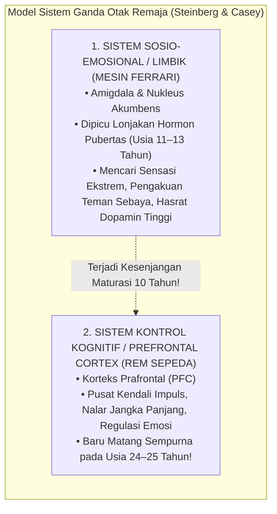
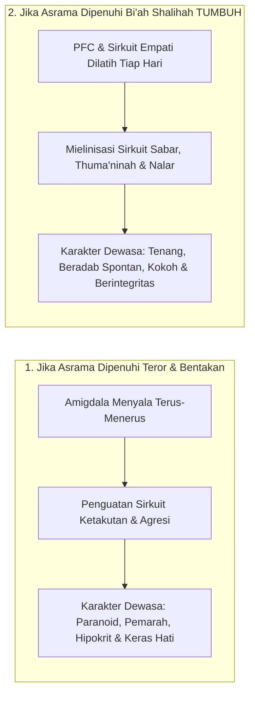
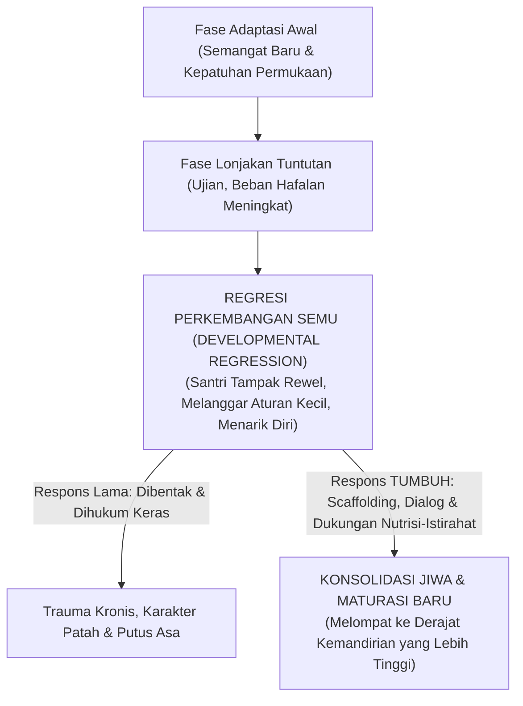
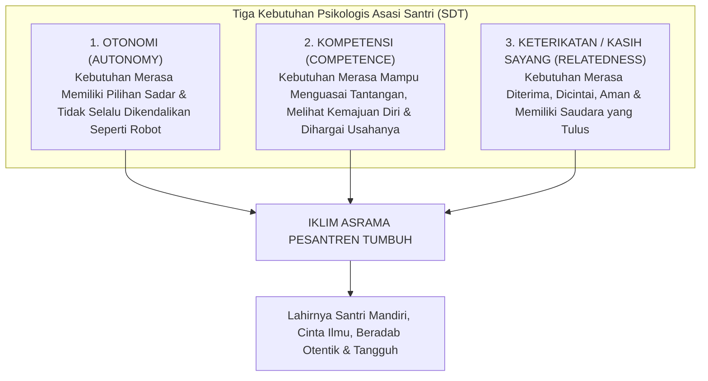
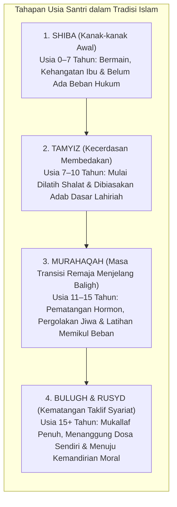

# BAB 5: DINAMIKA PERKEMBANGAN JIWA DAN NEUROSAINS REMAJA
## Memahami Gejolak Maturasi Prefrontal Cortex, Sistem Limbik, dan Plastisitas Adab Santri

> *"Ketahuilah bahwa masa muda (as-syabab) adalah salah satu cabang dari kegilaan (syu'batun min al-junun), karena darah kemudaan yang mendidih mendorong jiwa untuk menerjang hawa nafsu tanpa memedulikan akibatnya, kecuali bagi mereka yang dianugerahi pemeliharaan dan taufik oleh Allah Ta'ala."*  
> — **Al-Imam Ibnu Qayyim al-Jauziyyah**, *Raudhatul Muhibbin wa Nuzhatul Musytaqin*[^1]

---

### 5.1 Paradoks Remaja Asrama: Mesin Balap Ferrari dengan Rem Sepeda

Setiap tahun ajaran baru tiba di pesantren, ribuan anak berusia antara dua belas hingga lima belas tahun melangkahkan kaki melewati pintu gerbang asrama. Di hadapan para asatidz, berdirilah sosok-sosok santri yang secara fisik tampak telah beranjak dewasa: suara mereka mulai memberat, kumis tipis mulai tumbuh di atas bibir mereka, dan tinggi badan mereka bahkan kerap melampaui tinggi tubuh para pembina mereka.

Namun, di balik perawakan fisik yang tampak gagah tersebut, sebuah misteri perilaku harian kerap membuat para musyrif mengurut dada karena kehabisan kesabaran:
* Mengapa seorang santri yang secara fasih mampu menghafal bab *Jinayat* di kelas syariat, pada sore harinya dengan santai melompat dari lantai dua asrama ke atas tumpukan kasur hanya demi membuat kawan-kawannya tertawa?
* Mengapa santri yang begitu sopan saat berbicara berdua dengan guru, seketika berubah menjadi sosok yang bising, nekat, dan melanggar jam malam saat berada di tengah kelompok teman sebayanya?
* Mengapa teguran yang diucapkan berulang kali seolah-olah "masuk telinga kanan dan keluar telinga kiri" tanpa membekas menjadi tindakan nyata?

Kekecewaan para pembina asrama kerap meledak dalam kalimat makian yang menyudutkan: *"Kamu ini badannya saja yang sudah sebesar raksasa, kumis sudah tumbuh, tapi kelakuan dan otakmu masih seperti anak balita!"*

Kemarahan semacam ini lahir dari **kebutaan biologis terhadap hakikat perkembangan saraf remaja (*adolescent brain development*)**.

Para ilmuwan neurosains kognitif terkemuka dunia, seperti Prof. Laurence Steinberg dan Dr. B.J. Casey, merumuskan sebuah analogi yang sangat presisi untuk menggambarkan kondisi biologis otak remaja usia santri: **Remaja adalah sebuah mobil balap berkecepatan tinggi dengan mesin Ferrari bertenaga monster, namun rem yang terpasang pada rodanya hanyalah rem sepeda ontel yang rapuh (*a car with a Ferrari engine but bicycle brakes*)**[^2].

Secara sunnatullah penciptaan biologis:
1. **Mesin Penggerak Emosi (Sistem Limbik)** yang memicu pencarian sensasi (*novelty seeking*), dorongan keberanian mengambil risiko (*risk-taking behavior*), dan kebutuhan mendesak untuk diakui oleh kelompok teman sebaya (*peer approval*) melonjak sangat cepat begitu santri memasuki masa pubertas (usia 11–13 tahun).
2. Sebaliknya, **Sistem Pengereman Moral (Prefrontal Cortex / PFC)** yang bertugas mengendalikan hawa nafsu, menahan amarah, dan memikirkan konsekuensi jangka panjang dari sebuah perbuatan berjalan dengan sangat lambat. PFC adalah organ terakhir dalam tubuh manusia yang mengalami pematangan biologis sempurna, yakni baru tuntas pada usia **dua puluh empat hingga dua puluh lima tahun**[^3].

Kesenjangan biologis (*developmental mismatch*) selama hampir satu dekade inilah yang menjelaskan mengapa santri remaja sangat rentan tergelincir melakukan tindakan ceroboh. Mereka melompat dari balkon bukan karena mereka berwatak kriminal atau berniat jahat; mereka melompat karena amigdala dan nukleus akumbens mereka sedang dibanjiri hormon dopamin yang menuntut sensasi kegembiraan instan, sementara rem PFC mereka belum cukup kuat untuk membisikkan: *"Jangan lakukan itu, tulang kakimu bisa patah!"*

Dalam ekosistem **TUMBUH**, para asatidz dan musyrif disadarkan akan peran sakral mereka: **Para pendidik adalah Prefrontal Cortex Eksternal (*External PFC*) bagi santri-santrinya**. Karena rem biologis di dalam kepala santri belum terpasang sempurna, maka kehadiran musyriflah yang berfungsi sebagai rem pengaman: menuntun dengan ketegasan yang tenang, memasang batas-batas lingkungan yang aman, dan mendampingi proses latihan pengendalian diri santri dengan penuh kesabaran hikmah.

---

### 5.2 Plastisitas Saraf dan Jendela Emas Usia Pesantren: Mengukir di Atas Batu

Rasulullah ﷺ menyampaikan sebuah perumpamaan agung yang telah berusia empat belas abad, namun maknanya semakin berkilau di bawah sorotan mikroskop sains modern:

$$\text{مَثَلُ الَّذِي يَتَعَلَّمُ فِي صِغَرِهِ كَالنَّقْشِ عَلَى الْحَجَرِ، وَمَثَلُ الَّذِي يَتَعَلَّمُ فِي كِبَرِهِ كَالَّذِي يَكْتُبُ عَلَى الْمَاءِ}$$

> *"Perumpamaan orang yang belajar di masa mudanya adalah laksana mengukir di atas batu karang, sedangkan perumpamaan orang yang belajar di masa tuanya adalah laksana menulis di atas air."*  
> (HR. At-Thabarani dalam *Al-Mu'jam al-Kabir* dan Al-Baihaqi dalam *Syu'abul Iman*)[^4]

Mengapa pembelajaran di masa muda santri diibaratkan laksana **mengukir di atas batu (*an-naqsyi 'ala al-hajar*)**?

Jawabannya terletak pada fenomena biologis yang disebut **Neuroplastisitas Remaja (*Adolescent Neuroplasticity*)** dan **Pemangkasan Sinapsis (*Synaptic Pruning*)**.

Di masa pubertas dan remaja, otak santri sedang mengalami rekonstruksi arsitektural terdahsyat kedua sepanjang hidupnya (setelah masa balita). Otak memproduksi miliaran cabang sinapsis baru, lalu melakukan seleksi alamiah berdasarkan hukum biologi saraf:

$$\text{“Neurons that fire together, wire together; neurons that don't, are pruned away.”}$$

> *"Jaringan sel saraf yang menyala bersama-sama secara berulang akan tersambung secara permanen menjadi sirkuit watak; sementara jaringan sel saraf yang tidak pernah diaktifkan akan dipangkas dan dimatikan oleh otak."*[^5]

Masa santri tinggal di asrama (usia 12 hingga 18 tahun) adalah **Jendela Plastisitas Kritis (*Critical Window of Opportunity*)**:
* Apabila selama enam tahun di asrama, sirkuit saraf yang setiap hari diaktifkan oleh pengasuh adalah **sirkuit amigdala (ketakutan, kecurigaan, dendam, dan kemunafikan akibat bentakan dan hukuman fisik)**, maka otak santri akan mempertebal jalur saraf tersebut dengan selubung lemak mielin (*myelination*). Anak itu kelak akan tumbuh dewasa menjadi pribadi yang paranoid, mudah panik, pemarah, dan memperlakukan anak-buahnya dengan kekejaman yang sama saat ia memimpin kelak.
* Sebaliknya, apabila selama enam tahun di asrama, santri dilatih meregulasi emosinya saat marah, dibimbing menyelesaikan konflik dengan dialog restoratif, diajak bangun malam dengan kehangatan cinta, dan dibiasakan memikirkan maslahat umat, maka otak santri sedang **mengukir sirkuit sabar, empati, dan muraqabatullah di atas batu neokorteksnya**. Sirkuit adab itulah yang akan menjadi watak permanen (*malakah*) yang tidak akan pernah luntur hingga akhir hayatnya.

Maka bergetarlah wahai para pendidik! Setiap perkataan yang kita ucapkan dan setiap perlakuan yang kita berikan kepada santri di lorong asrama bukanlah peristiwa yang hilang ditelan angin; setiap perlakuan itu secara fisik sedang **memahat arsitektur biologis otak generasi penerus umat**.

---

### 5.3 Karakteristik Perkembangan Non-Linier: Fenomena Regresi Perkembangan Semu

Banyak pengurus pesantren dan musyrif kamar memiliki ekspektasi yang keliru terhadap dinamika pertumbuhan karakter santri. Mereka membayangkan bahwa perkembangan adab santri akan bergerak laksana **garis lurus menanjak tanpa jeda (*linear progression*)**: bulan pertama santri paham wudhu, bulan kedua tertib bangun subuh, bulan ketiga rajin puasa daud, dan seterusnya tanpa pernah mundur ke belakang.

Ketika pada bulan keempat santri yang awalnya tampak sangat tertib tiba-tiba mengalami kemerosotan—ia mulai terlambat masuk kelas, malas merapikan kasurnya, atau menangis ingin pulang—para pembina kerap merasa frustrasi dan putus asa: *"Percuma dididik! Santri ini ternyata tidak ada perubahan, makin lama di pondok kelakuannya malah makin rusak!"*

Penilaian tersebut adalah kekeliruan besar. Dalam psikologi perkembangan (*Developmental Psychology*), pertumbuhan manusia diakui secara universal **TIDAK PERNAH BERJALAN LINIER**[^6]. 

Pertumbuhan jiwa santri bergerak laksana gelombang spiral yang dinamis: maju dua langkah, tertahan sejenak, terkadang mundur satu langkah untuk menghimpun kekuatan, lalu melompat maju tiga langkah ke depan:

Fenomena ini dikenal dalam sains perkembangan sebagai **Regresi Perkembangan Semu (*Developmental Regression in Service of the Ego*)**. 

Ketika seorang santri sedang bersiap melangkah ke tingkat kematangan kognitif atau sosial yang lebih kompleks—misalnya ia baru saja dipindahkan ke jenjang kemandirian yang lebih tinggi, atau baru menghadapi beban hafalan matan yang sangat berat—sistem saraf otaknya mengalami kelebihan beban sementara (*temporary cognitive and emotional overload*). Dalam kondisi tersebut, tubuh biologisnya secara alami mencari rasa aman dengan memunculkan kembali perilaku-perilaku kekanak-kanakan masa lalu: mengompol kembali, menangis rindu ibu, atau bersikap manja dan mencari perhatian musyrif secara berlebihan.

Jika musyrif merespons fase regresi ini dengan amarah dan sanksi fisik, santri akan merasa ditolak dan mengalami luka batin yang dalam. 

Namun jika musyrif memahami antropologi perkembangan TUMBUH, musyrif akan menyikapi fase regresi ini dengan senyuman ketenangan: *"Ini bukan tanda kegagalan; ini adalah tanda bahwa jiwa anak ini sedang bertarung menata struktur kapasitas barunya. Yang ia butuhkan saat ini bukanlah hukuman, melainkan sandaran pelukan ketenangan (*scaffolding*) agar sistem sarafnya kembali stabil."*

---

### 5.4 Tiga Kebutuhan Psikologis Dasar Santri Remaja (Self-Determination Theory)

Mengapa banyak santri di asrama kehilangan gairah belajar (*demotivated*), apatis terhadap program pondok, atau memberontak secara diam-diam?

Prof. Richard Ryan dan Edward Deci dalam teori motivasi paling berpengaruh di dunia, **Self-Determination Theory (SDT)**, membuktikan bahwa jiwa manusia remaja hanya akan bertumbuh secara sehat dan termotivasi dari dalam (*intrinsically motivated*) jika **Tiga Kebutuhan Psikologis Dasar (*Basic Psychological Needs*)** terpenuhi oleh lingkungannya[^7]:

Mari kita bedah bagaimana ketiga kebutuhan ini wajib dihidupkan di lingkungan pesantren 24 jam:

#### 1. Kebutuhan Otonomi (*Autonomy*)
Otonomi **bukanlah** kebebasan liar tanpa batas (*unbridled freedom*). Otonomi bermakna **dorongan batin untuk bertindak atas dasar kemauan sadar, bukan karena pemaksaan dari luar**. Santri remaja memiliki kebutuhan biologis untuk merasakan bahwa suaranya didengar dan pilihannya dihargai.

Pesantren yang mematikan otonomi memperlakukan santri laksana pion catur: santri tidak pernah diberi ruang memilih, tidak pernah diajak bermusyawarah, dan seluruh jadwalnya diatur hingga menit demi menit tanpa ada ruang bernapas. Akibatnya, santri merasa hidupnya dijajah, melahirkan sikap pasif-agresif atau pemberontakan liar saat pengawas lengah.

Dalam ekosistem TUMBUH, otonomi santri dilatih secara bertahap:
* Santri dilibatkan dalam menentukan pembagian tugas kebersihan kamar bersama teman-temannya.
* Santri diberi ruang memilih target capaian hafalan hariannya dalam rentang yang proporsional.
* Santri diajak berdialog mengenai hikmah di balik aturan, sehingga ia menaati aturan tersebut bukan karena terpaksa, melainkan karena ia **memilih untuk sepakat** bahwa aturan itu baik bagi keselamatannya.

#### 2. Kebutuhan Kompetensi (*Competence*)
Setiap santri haus akan rasa pencapaian: *"Aku mampu! Usahaku ada hasilnya!"*

Tragedi di sebagian pesantren adalah digunakannya kurikulum yang menerapkan satu ukuran seragam (*one size fits all*). Santri yang memiliki bakat linguistik dipuji setinggi langit, sementara santri yang lambat dalam nahwu namun sangat terampil dalam kepemimpinan sosial dan seni kaligrafi dicap sebagai "santri bodoh tak berguna". Santri yang merasa dirinya selalu gagal (*learned helplessness*) akan segera mematikan usahanya dan melampiaskan rasa rendah dirinya melalui kenakalan asrama.

TUMBUH merancang sistem penjenjangan yang mengakui keberagaman fitrah (*multiple intelligences*). Kemajuan santri tidak dibandingkan secara kejam dengan santri lain (*norm-referenced comparison*), melainkan dibandingkan dengan rekam jejak dirinya sendiri di masa lalu (*ipsative progress*). Sekecil apa pun kemajuan adab yang ditunjukkan oleh seorang santri diapresiasi secara tulus oleh pembina, memantik hormon dopamin alami yang mendorongnya untuk terus belajar.

#### 3. Kebutuhan Keterikatan dan Kasih Sayang (*Relatedness / Belonging*)
Inilah kebutuhan yang paling menentukan bagi kelangsungan jiwa santri di asrama. Santri remaja rela melakukan apa saja—bahkan hal-hal yang berbahaya sekalipun—demi merasa **diterima dan tidak dikucilkan oleh kelompok teman sebayanya**.

Jika ekosistem pesantren dingin, sarat dengan kecurigaan antar-kamar, dan para musyrifnya bersikap menjaga jarak laksana komandan militer, santri akan mengalami kelaparan emosional (*emotional starvation*). Kelaparan emosional inilah yang menjadi akar subur merebaknya geng-geng asrama liar, solidaritas sempit senioritas, hingga hubungan pertemanan menyimpang (*toxic attachment*).

TUMBUH merancang arsitektur asrama sebagai sebuah **Keluarga Besar Ruhaniyah (*Bi'ah Ukhuwwah*)**:
* Musyrif hadir sebagai sosok pengganti ayah (*in loco parentis*) yang hangat dan dapat didekati kapan saja.
* Tradisi makan bersama dalam satu nampan (*talam halaqah*), lingkaran muhasabah saling mendoakan sebelum tidur, serta kultur saling memaafkan dihidupkan sebagai ritual harian yang mengikat hati mereka dalam ukhuwah imaniyah yang kokoh.

---

### 5.5 Integrasi Turats: Tahapan Tamyiz, Murahaqah, dan Baligh dalam Fiqh Tarbiyah

Bagaimanakah khazanah keilmuan Islam memetakan perjalanan usia remaja ini? Jauh sebelum psikologi Barat merumuskan teori perkembangan, para fukaha dan pakar adab Islam telah membagi perjalanan hidup manusia ke dalam tahapan-tahapan yang sangat runtut[^8]:

Para ulama menaruh perhatian yang teramat mendalam pada masa **Al-Murahaqah** (kata yang berakar dari *ra-ha-qa* yang bermakna mendekat, terburu-buru, atau tertutup). Di fase transisi inilah syariat menetapkan sebuah metode pembinaan yang luar biasa proporsional:

Rasulullah ﷺ bersabda dalam hadits pedoman pengasuhan yang sangat populer:

$$\text{مُرُوا أَوْلَادَكُمْ بِالصَّلَاةِ وَهُمْ أَبْنَاءُ سَبْعِ سِنِينَ، وَاضْرِبُوهُمْ عَلَيْهَا وَهُمْ أَبْنَاءُ عَشْرِ سِنِينَ، وَفَرِّقُوا بَيْنَهُمْ فِي الْمَضَاجِعِ}$$

> *"Perintahkanlah anak-anakmu mendirikan salat ketika mereka berusia tujuh tahun; dan berikan ketegasan (evaluasi tegas) atas kelalaian mereka saat berusia sepuluh tahun; serta pisahkanlah tempat-tempat tidur mereka."*  
> (HR. Abu Dawud no. 495 dan Ahmad no. 6689, sanad hasan)[^9]

Perhatikan hikmah pedagogis tingkat tinggi di balik hadits ini!
1. **Masa Latihan Tiga Tahun Penuh (Usia 7 hingga 10 Tahun)**:  
   Antara usia tujuh hingga sepuluh tahun terdapat rentang waktu **tiga tahun penuh (lebih dari 1.000 hari dan 5.000 kali salat fardhu)**! Dalam kurun waktu tiga tahun tersebut, perintah salat dilakukan dengan **kelemahlembutan, pengulangan yang sabar, pujian, dan pembiasaan tanpa kekerasan**. Anak dilatih membiasakan raga biologisnya terbiasa dengan ritme wudhu dan sujud.
2. **Makna Ketegasan pada Usia Sepuluh Tahun**:  
   Ketika anak telah berusia sepuluh tahun dan telah dilatih selama 5.000 kali salat namun masih malas, barulah syariat mengizinkan adanya ketegasan. Namun para fukaha—seperti Imam Asy-Syafi'i dan Imam An-Nawawi—menegaskan dengan sangat ketat batas-batas ketegasan tersebut: *dharbun ghairu mubarrih* (bukan pukulan yang melukai fisik, bukan pukulan di wajah, tidak boleh meninggalkan bekas memar, tidak boleh mematahkan tulang, dan semata-mata bersifat teguran simbolik untuk menyadarkan keseriusan taklif, bukan pelampiasan nafsu amarah)*[^10].
3. **Pemisahan Tempat Tidur (*Farriquu Bainahum fil-Madhaaji'*)**:  
   Ini adalah ketetapan preventif (*environmental safeguarding*) yang sangat agung. Pada usia sepuluh tahun, syariat memerintahkan pemisahan tempat tidur untuk menjaga kesucian pandangan, privasi tubuh, serta mencegah timbulnya gejolak seksual prematur di antara anak-anak asrama.

Pemahaman turats ini menegaskan bahwa: **Islam tidak pernah membenarkan metode "kekerasan instan"**. Sebelum sebuah sanksi tegas dijatuhkan, syariat menuntut adanya proses pengajaran yang berulang, pendampingan yang sabar, dan penataan lingkungan yang aman.

Memahami dinamika biologis dan ruhaniyah remaja ini menjadi pijakan kokoh bagi kita untuk melangkah ke bab berikutnya: bagaimanakah konsep Tarbiyah, Ta'dib, dan Ta'lim dirajut menjadi sebuah ekosistem keteladanan yang hidup (*Qudwah Hasanah*) di asrama 24 jam? 

Inilah yang akan kita jelajahi dalam **Bab 6: Falsafah Tarbiyah, Ta'dib, dan Ekosistem Keteladanan**.

---

### Catatan Kaki & Rujukan Akademik

[^1]: Ibnu Qayyim al-Jauziyyah, *Raudhatul Muhibbin wa Nuzhatul Musytaqin*, diedit oleh Sabir al-Kasyf (Kairo: Dar al-Hadits, 2003), hlm. 182–186.
[^2]: Laurence Steinberg, *Age of Opportunity: Lessons from the New Science of Adolescence* (Boston: Mariner Books, 2015), hlm. 45–72; B.J. Casey, "Beyond Simple Models of Self-Control to Circuit-Based Accounts of Adolescent Behavior", *Annual Review of Psychology*, Vol. 66 (2015), hlm. 295–319.
[^3]: Jay N. Giedd dkk., "Brain Development During Childhood and Adolescence: A Longitudinal MRI Study", *Nature Neuroscience*, Vol. 2, No. 10 (1999), hlm. 861–863; Nitin Gogtay dkk., "Dynamic Mapping of Human Cortical Development during Childhood through Early Adulthood", *Proceedings of the National Academy of Sciences (PNAS)*, Vol. 101, No. 21 (2004), hlm. 8174–8179.
[^4]: Sulaiman bin Ahmad Ath-Thabarani, *Al-Mu'jam al-Kabir* (Kairo: Maktabah Ibn Taimiyyah, 1994), hadits no. 8645; Abu Bakr Ahmad bin Husain Al-Baihaqi, *Syu'abul Iman* (Riyadh: Maktabah ar-Rusyd, 2003), hadits no. 1658 dari Abu Hurairah dan Hasan Al-Bashri secara mursal shahih lighairihi.
[^5]: Carla J. Shatz, "Impulse Activity and the Patterning of Connections during CNS Development", *Neuron*, Vol. 5, No. 6 (1990), hlm. 745–756; Donald O. Hebb, *The Organization of Behavior: A Neuropsychological Theory* (New York: John Wiley & Sons, 1949).
[^6]: Robert B. Cairns & Beverley D. Cairns, *Lifelines and Risks: Pathways of Youth in Our Time* (Cambridge: Cambridge University Press, 1994), hlm. 88–115; Esther Thelen & Linda B. Smith, *A Dynamic Systems Approach to the Development of Cognition and Action* (Cambridge: MIT Press, 1994).
[^7]: Richard M. Ryan & Edward L. Deci, *Self-Determination Theory: Basic Psychological Needs in Motivation, Development, and Wellness* (New York: The Guilford Press, 2017), hlm. 80–125; Edward L. Deci & Richard M. Ryan, "The 'What' and 'Why' of Goal Pursuits: Human Needs and the Self-Determination of Behavior", *Psychological Inquiry*, Vol. 11, No. 4 (2000), hlm. 227–268.
[^8]: Abu Hamid Muhammad bin Muhammad Al-Ghazali, *Ihya' 'Ulum ad-Din*, Jilid III, *Kitab Riyadhat an-Nafs wa Tahdzib al-Akhlaq* (Kairo: Dar al-Hadits, 2004), hlm. 62–75; Ibnu Jama'ah, *Tadzkirat as-Sami' wa al-Mutakallim fi Adab al-'Alim wa al-Muta'allim* (Beirut: Dar al-Basyair al-Islamiyyah, 2012), hlm. 48–65.
[^9]: Abu Dawud Sulaiman bin al-Asy'ats as-Sijistani, *Sunan Abi Dawud*, Kitab ash-Shalah, Bab Mata Yu'maru al-Ghulam bi ash-Shalah, hadits no. 495; Ahmad bin Hanbal, *Al-Musnad*, hadits no. 6689, disahihkan oleh Al-Albani dalam *Shahih Abi Dawud*.
[^10]: Abu Zakariya Muhyiddin Yahya bin Syaraf An-Nawawi, *Al-Majmu' Syarh al-Muhadzdzab* (Kairo: Idarah ath-Thiba'ah al-Muniriyyah, 1344 H), Jilid III, hlm. 11–14; Syamsuddin Muhammad bin Abi al-Abbas Ar-Ramli, *Nihayat al-Muhtaj ila Syarh al-Minhaj* (Beirut: Dar al-Fikr, 1984), Jilid I, hlm. 385–388.
