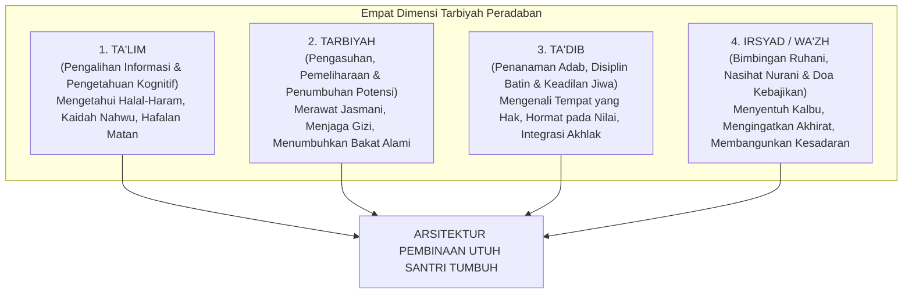
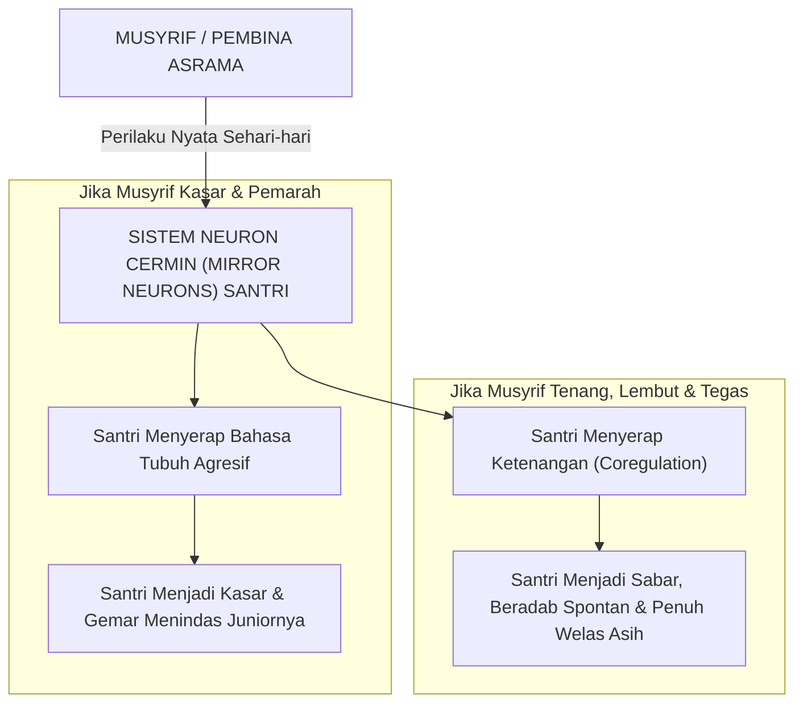
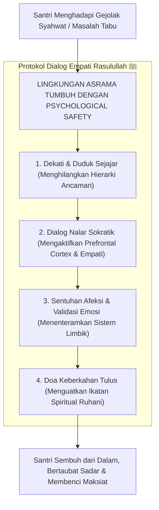
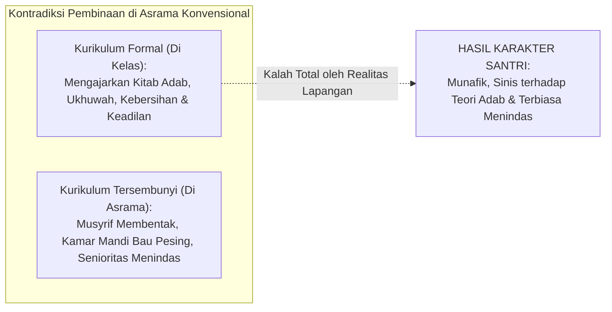
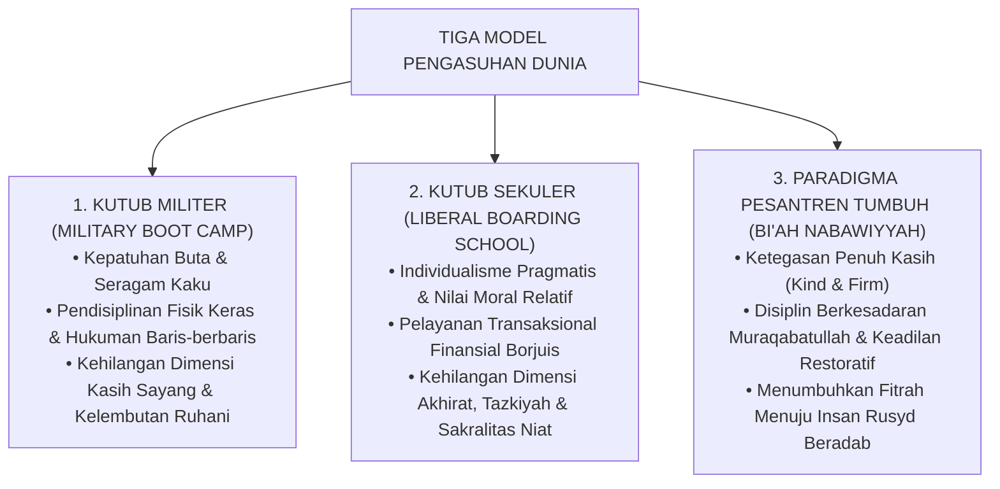

# BAB 6: FALSAFAH TARBIYAH, TA'DIB, DAN EKOSISTEM KETELADANAN
## Menghidupkan Sunnah Qudwah Hasanah dan Mentransformasi Budaya Pengasuhan Pesantren 24 Jam

> لَقَدْ كَانَ لَكُمْ فِي رَسُولِ اللَّهِ أُسْوَةٌ حَسَنَةٌ لِمَنْ كَانَ يَرْجُو اللَّهَ وَالْيَوْمَ الْآخِرَ وَذَكَرَ اللَّهَ كَثِيرًا
>
> *"Sungguh telah ada pada diri Rasulullah itu suri teladan yang mulia (qudwah hasanah) bagimu, yaitu bagi orang yang mengharap rahmat Allah dan kedatangan hari kiamat serta banyak mengingat Allah."*  
> — **Al-Qur'an al-Karim**, Surah Al-Ahzab [33]: 21[^1]

---

### 6.1 Dekonstruksi Konseptual: Membedah Ta'lim, Tarbiyah, Ta'dib, dan Irsyad

Di sebagian besar lingkungan pesantren kontemporer, kata "pendidikan" kerap disederhanakan menjadi sekadar jadwal masuk kelas dan penyelesaian kurikulum kitab kuning. Seorang kyai atau direktur pengasuhan merasa tugas pendidikannya telah tuntas apabila seluruh jadwal pengajian telah terisi guru, para santri telah membeli kitab matan, dan bel masuk telah berbunyi tepat waktu.

Namun, dalam khazanah intelektual peradaban Islam, istilah pendidikan memiliki kekayaan dimensi semantik yang sangat dalam. Ketiadaan ketepatan pemahaman terhadap istilah-istilah ini melahirkan kekacauan praksis di asrama.

Prof. Dr. Syed Muhammad Naquib al-Attas dan para pakar pendidikan Islam membedah empat pilar peristilahan utama yang mendasari proses pembinaan manusia[^2]:

#### 1. At-Ta'lim (Pengajaran Kognitif)
Berasal dari akar kata *'a-li-ma* (mengetahui). Ta'lim adalah proses transfer informasi intelektual, data keilmuan, dan keterampilan metodologis dari seorang guru kepada murid. Santri yang menjalani proses *ta'lim* menjadi tahu apa yang sebelumnya tidak ia ketahui: ia hafal bait *Jurumiyyah*, menguasai arti kosa kata bahasa Arab, dan memahami hukum-hukum fikih bersuci. 

Namun, **Ta'lim semata-mata baru menyentuh wilayah kepala (*kognitif*)**. Betapa banyak orang yang memiliki keluasan ilmu (*'alim*), hafal dalil-dalil adab, namun perilakunya kasar, culas, sombong, dan gemar menzalimi sesamanya. Kognisi tanpa adab adalah racun peradaban.

#### 2. At-Tarbiyah (Pengasuhan dan Penumbuhan Potensi)
Berasal dari akar kata *ra-ba-ya-rbu* (bertambah, berkembang) atau *rabba-yarubbu* (mengasuh, memelihara). Tarbiyah bermakna merawat, memberi makan, melindungi, dan menumbuhkan potensi fisik serta bakat alami anak secara bertahap hingga mencapai kematangannya. 

Tarbiyah adalah tugas pemeliharaan ekosistem: memastikan santri makan makanan halal bergizi, kamarnya bersih berventilasi, pakaiannya rapi, dan fisiknya terlindungi dari ancaman bahaya. Namun, jika pendidikan hanya berhenti pada *tarbiyah* fisik-biologis tanpa penanaman nilai rohani, proses tersebut tidak berbeda dengan peternakan yang memelihara tubuh materi semata.

#### 3. At-Ta'dib (Inti Sejati Pendidikan Islam)
Inilah istilah yang ditegaskan oleh Prof. Naquib al-Attas sebagai **definisi paling tepat dan komprehensif bagi pendidikan Islam**. Kata *Ta'dib* berakar dari kata **Adab**. 

Sebagaimana disabdakan oleh baginda Nabi ﷺ:

$$\text{أَدَّبَنِي رَبِّي فَأَحْسَنَ تَأْدِيبِي}$$

> *"Rabb-ku telah mendidik adab kepadaku (addabani), maka Dia telah memperbagus pendidikanku."*  
> (HR. As-Sam'ani dan Ibnu Sam'un, makna hadits disepakati keshahihan kandungannya oleh para ulama)[^3]

Adab dalam pandangan alam Islam bukanlah sekadar etiket basa-basi lahiriah (*superficial etiquette*). Adab adalah: **Kondisi jiwa yang mengenali dan mengakui letak, kedudukan, dan martabat segala sesuatu dalam tata aturan ciptaan Allah, sehingga menghasilkan tindakan yang adil dan benar**[^4].
* Beradab kepada Allah bermakna meletakkan Allah sebagai satu-satunya sesembahan yang ditaati mutlak.
* Beradab kepada Rasulullah ﷺ bermakna menempatkan sunnah beliau di atas segala hawa nafsu dan tradisi manusia.
* Beradab kepada ilmu bermakna menghargai proses belajarnya dan mengamalkannya dengan ikhlas.
* Beradab kepada sesama santri bermakna memuliakan martabat kemanusiaannya (*karamah*), tidak menghinanya, dan menjaga hak-haknya.

Tujuan puncak ekosistem TUMBUH adalah **Ta'dib**: menanamkan keadilan batin ini ke dalam relung kalbu santri sehingga adab tersebut memancar secara spontan dalam kehidupan asrama sehari-hari.

#### 4. Al-Irsyad dan Al-Wa'zh (Bimbingan Ruhani dan Sentuhan Kalbu)
Berasal dari akar kata *ra-sya-da* (kematangan batin) dan *wa-'a-zha* (nasihat yang melembutkan hati). Ini adalah seni menyentuh lubuk jiwa santri melalui dialog empati, nasihat dari hati ke hati di keheningan malam, dan doa-doa tulus yang dipanjatkan musyrif di saat sujud tahajud. Irsyad inilah yang mencairkan kebekuan amigdala santri dan membuka gerbang kesadaran fitrahnya.

---

### 6.2 Kepemimpinan Qudwah Hasanah: Dari Feodalisme Menuju Servant Leadership

Tragedi terbesar dalam krisis keteladanan di asrama pesantren adalah apa yang disebut dalam sains komunikasi sebagai **Disparitas Verbal-Perilaku (*Say-Do Incongruence*)**:
* Musyrif berceramah selama dua jam di masjid tentang keutamaan sabar dan larangan marah, namun lima belas menit kemudian di lorong asrama ia berteriak membentak santri dengan urat leher menegang.
* Pembina mengajarkan kitab adab tentang haramnya mencaci sesama muslim, namun dalam kesehariannya kata-kata kasar dan julukan binatang meluncur dengan enteng dari bibirnya saat menegur santri yang terlambat.

Anak remaja adalah mesin pendeteksi kemunafikan paling peka di dunia (*adolescents have hyper-sensitive hypocrisy detectors*). 

Secara neurobiologis, otak manusia dikaruniai sistem sel saraf khusus yang disebut **Neuron Cermin (*Mirror Neurons*)**[^5]. Sistem neuron cermin ini bekerja secara otomatis merekam, memetakan, dan meniru getaran emosi, ekspresi wajah, intonasi suara, serta bahasa tubuh orang dewasa yang berada di sekitarnya:

Santri tidak belajar dari apa yang kita **katakan** di atas podium; santri belajar dari bagaimana cara kita **memperlakukan mereka** saat kita sedang marah dan lelah.

Imam Ibnu Jama'ah dalam kitab monumentalnya *Tadzkirat as-Sami' wa al-Mutakallim fi Adab al-'Alim wa al-Muta'allim* meletakkan syarat utama seorang pendidik:

$$\text{أَنْ يَتَمَثَّلَ الْعَالِمُ بِمَا يَدْعُو إِلَيْهِ، فَإِنَّ النَّاسَ يَقْتَدُونَ بِأَفْعَالِهِ أَكْثَرَ مِمَّا يَقْتَدُونَ بِأَقْوَالِهِ}$$

> *"Hendaklah seorang pendidik menjadi perwujudan nyata dari apa yang ia serukan kepada murid-muridnya; karena sesungguhnya manusia itu meneladani perbuatan lahiriah seorang guru jauh lebih banyak daripada mereka meneladani perkataan lisannya!"*[^6]

#### Dekonstruksi Feodalisme Menuju Servant Leadership Pengasuhan
TUMBUH meruntuhkan kultur feodalisme kepengasuhan dan menegakkan paradigma **Khadimul Ummah (Servant Leadership)** yang diwariskan oleh baginda Rasulullah ﷺ:

$$\text{سَيِّدُ الْقَوْمِ خَادِمُهُمْ}$$

> *"Pemimpin sejati suatu kaum adalah pelayan bagi kaum tersebut!"*  
> (HR. Ibnu Majah dan Abu Nu'aim dalam *Hilyatul Auliya'*)[^7]

Perhatikan pergeseran radikal paradigma kepemimpinan ini:

| Dimensi Kepemimpinan | Paradigma Feodal Konvensional | Paradigma Khadimul Ummah TUMBUH |
| :--- | :--- | :--- |
| **Sumber Otoritas** | Jabatan struktural, ancaman tongkat rotan, dan doktrinasi ketakutan su'ul adab. | Keluhuran integritas moral, kedalaman empati, dan wibawa keteladanan (*qudwah hasanah*). |
| **Arah Pelayanan** | Santri junior dan asatidz muda melayani kenyamanan dan privilese senior. | Musyrif dan pimpinan melayani kebutuhan pertumbuhan jiwa, kesehatan, dan keselamatan santri. |
| **Sikap terhadap Kesalahan** | Menghakimi, mempermalukan di depan umum, dan memuaskan nafsu kemarahan pembina. | Mendiagnosis akar masalah secara ilmiah, membimbing perbaikan diri (*restitusi*), dan merangkul. |
| **Kultur Komunikasi** | Instruksi satu arah dari atas ke bawah; santri dilarang bertanya atau membantah. | Dialog dua arah, mendengarkan aktif (*active listening*), dan menciptakan rasa aman psikologis. |

Seorang musyrif TUMBUH tidak merasa gengsi untuk memungut sampah yang tercecer di lantai asrama di hadapan santrinya. Musyrif TUMBUH tidak segan menyingsingkan lengan bajunya membersihkan saluran air bersama anak-anak kamarnya. Dalam tindakan pelayanan itulah wibawa kepemimpinan sejati bersemi, melahirkan rasa cinta dan takzim yang tulus dari dalam kalbu santri.

---

### 6.3 Budaya Dialogis dan Keamanan Psikologis (Psychological Safety)

Salah satu sunnah pedagogis Rasulullah ﷺ yang paling sering diabaikan dalam dunia pesantren modern adalah **Tradisi Dialog Sokratik-Profetik (*Prophetic Dialogue*)**.

Rasulullah ﷺ tidak pernah mendidik para sahabat muda beliau dengan monolog doktriner yang membungkam nalar. Beliau senantiasa mengajak mereka berdialog, mengajukan pertanyaan-pertanyaan yang memantik nalar, mendengarkan argumentasi mereka, bahkan memberi ruang bagi mereka untuk mengekspresikan keraguan batinnya tanpa takut dimarahi.

Renungkanlah peristiwa agung seorang pemuda yang mendatangi Rasulullah ﷺ dengan membawa pergulatan syahwat yang sangat tabu:
Seorang pemuda belia datang ke majelis Nabi ﷺ lalu berkata dengan lancang di hadapan para sahabat: *"Wahai Rasulullah, izinkanlah aku untuk berzina!"* 

Mendengar permintaan yang sangat tidak senonoh tersebut, para sahabat yang berada di sekitar beliau seketika marah besar dan menghardik pemuda itu: *"Diam kamu! Betapa lancangnya mulutmu di hadapan Nabi!"*

Namun perhatikan bagaimana respons Sang Pendidik Agung Kemanusiaan, baginda Nabi Muhammad ﷺ:
Beliau tidak melotot, tidak membentak, tidak memanggil petugas keamanan untuk mencambuknya. Beliau dengan penuh kelembutan bersabda: *"Mendekatlah kemari, wahai anak muda!"*

Pemuda itu mendekat dan duduk tepat di hadapan beliau. Rasulullah ﷺ kemudian memulai **Dialog Nalar Empatik (*Reflective Socratic Questioning*)**:
* *"Apakah engkau rela perbuatan zina itu menimpa ibumu?"*  
  Pemuda itu menjawab: *"Demi Allah, tidak wahai Rasulullah! Semoga Allah menjadikanku tebusan bagimu."*  
  Nabi bersabda: *"Begitu pula orang lain, mereka tidak rela perbuatan itu menimpa ibu-ibu mereka."*
* *"Apakah engkau rela perbuatan itu menimpa anak perempuanmu?"*  
  Pemuda itu menjawab: *"Demi Allah, tidak wahai Rasulullah!"*  
  Nabi bersabda: *"Begitu pula orang lain, tidak rela menimpa anak perempuan mereka."*

Nabi ﷺ terus mengalirkan pertanyaan nalar tersebut hingga menyebut saudara perempuan, bibi dari jalur ayah, dan bibi dari jalur ibunya. Setelah akal dan nurani pemuda itu tersadarkan secara tuntas, Rasulullah ﷺ meletakkan telapak tangan beliau yang mulia dan penuh berkah ke atas dada pemuda itu seraya berdoa:

$$\text{اللَّهُمَّ اغْفِرْ ذَنْبَهُ، وَطَهِّرْ قَلْبَهُ، وَحَصِّنْ فَرْجَهُ}$$

> *"Ya Allah! Ampunilah dosanya, sucikanlah kalbunya, dan bentengilah kemaluannya!"*  
> Perawi hadits mencatat: Setelah peristiwa dialog tersebut, tidak ada satu pun kemaksiatan yang lebih dibenci oleh pemuda itu selain perbuatan zina!  
> (HR. Ahmad no. 22211, sanad shahih)[^8]

Prof. Amy Edmondson dari Harvard Business School membuktikan dalam penelitiannya mengenai **Keamanan Psikologis (*Psychological Safety*)**: bahwa sebuah institusi pendidikan atau organisasi hanya akan melahirkan keunggulan dan integritas jika anggotanya merasa aman untuk berbicara jujur, berani mengakui kesalahan, dan berani bertanya tanpa takut dipermalukan atau dihukum secara zalim[^9].

Jika asrama pesantren tidak memiliki *psychological safety*:
* Santri yang mengalami keraguan iman (*syubuhat*) akan menyembunyikan keraguannya hingga akhirnya murtad diam-diam.
* Santri yang menjadi korban pelecehan seksual atau perundungan akan membungkam mulutnya karena takut disalahkan oleh pembina.
* Santri yang tergelincir melakukan pelanggaran akan berbohong mati-matian demi menyelamatkan kulitnya dari cambukan rotan.

TUMBUH mewajibkan seluruh musyrif menghidupkan majelis dialog mingguan di kamar asrama: sebuah lingkaran keterbukaan (*Circle of Trust*) tempat santri bebas mencurahkan keluh kesahnya, mengakui kelemahannya, dan saling menopang dalam naungan cinta imaniyah tanpa takut dihakimi.

---

### 6.4 Kurikulum Tersembunyi: Rekayasa Lingkungan 24 Jam (The Hidden Curriculum of Bi'ah)

Para pakar sosiologi pendidikan mengingatkan kita akan keberadaan dua lapis kurikulum di setiap sekolah:
1. **Kurikulum Formal (*The Overt Curriculum*)**: Buku teks pelajaran yang tertulis di silabus, silabus matan hadits, jadwal ujian, dan angka rapor.
2. **Kurikulum Tersembunyi (*The Hidden Curriculum*)**: Nilai-nilai, norma-norma tak tertulis, dan pesan-pesan tersirat yang diserap santri dari **budaya lingkungan fisik dan interaksi sosial harian di asrama**[^10].

Penelitian membuktikan bahwa: **Dalam jangka panjang, Kurikulum Tersembunyi (Hidden Curriculum) SELALU MENANG mengalahkan Kurikulum Formal!**

Perhatikan kontradiksi tragis ini:
* Di ruang kelas madrasah pada pukul 08.00 pagi, ustadz mengajarkan bahwa seorang muslim wajib menyayangi saudaranya seperti menyayangi dirinya sendiri.
* Namun pada pukul 21.00 malam di lorong asrama, santri menyaksikan musyrifnya menampar pipi seorang santri junior yang mengantuk, dan santri senior bebas memeras adik kelasnya.

Pesan apa yang sesungguhnya terekam di dalam otak dan kalbu santri?  
Otak santri menyimpulkan: *"Ajaran adab di kitab kuning itu hanyalah omong kosong ujian hafalan! Di dunia nyata yang berkuasa adalah otot dan kekerasan!"*

Maka ekosistem **TUMBUH** melakukan rekayasa menyeluruh terhadap **Bi'ah Shalihah 24 Jam**:
1. **Rekayasa Tata Ruang Fisik Asrama (*Environmental Engineering*)**:  
   Menghilangkan titik-titik rawan gelap (*blind spots*) yang kerap menjadi sarang perundungan. Penataan pencahayaan yang terang, ventilasi udara yang sejuk menenteramkan saraf, dan kebersihan sanitasi air yang berstandar tinggi.
2. **Harmonisasi Irama Kehidupan**:  
   Sinkronisasi antara waktu halaqah, waktu muthala'ah, waktu makan, waktu riadah olahraga, dan waktu tidur biologis 7 jam yang tak boleh diganggu gugat.
3. **Penyelarasan Nilai Seluruh Civitas**:  
   Satpam di gerbang pondok, petugas dapur di ruang makan, musyrif di asrama, hingga guru di madrasah memegang teguh piagam adab yang sama: dilarang membentak, dilarang mempermalukan, dan senantiasa menyapa dengan senyuman *qudwah*.

---

### 6.5 Menegakkan Identitas Luhur: Mengapa Pesantren Bukan Militer dan Bukan Pula Sekolah Sekuler?

Dalam merancang tata kelola pengasuhan, banyak pengelola pesantren kontemporer mengalami krisis identitas (*identity crisis*), terjebak di antara dua kutub ekstrim:

#### 1. Kutub Ekstrim Militer (*Military Boot Camp*)
Sebagian pondok mengundang pelatih baris-berbaris militer untuk mendisiplinkan santri dengan gaya komando: membentak dengan suara lantang, hukuman push-up di aspal panas, dan pemotongan rambut botak tentara.  
Pendekatan ini keliru besar! Militer dirancang untuk melatih prajurit tempur dewasa agar siap mematuhi komando membunuh musuh di medan perang. Sementara santri adalah anak-anak belia yang sedang belajar menghafal firman Allah Yang Maha Pengasih! Memasukkan doktrin militerisme buta ke asrama pesantren hanya akan mencabut kelembutan kalbu (*riqqatul qalb*) dan mematikan mata air cinta ilmu dari jiwa santri.

#### 2. Kutub Ekstrim Sekolah Asrama Sekuler (*Liberal Boarding School*)
Sebagian pesantren modern lainnya mengadopsi gaya sekolah asrama Barat yang serba permisif: membiarkan santri bebas tanpa kontrol adab, memanjakan mereka dengan fasilitas serba mewah tanpa penempaan kemandirian, dan memandang pendidikan sekadar bisnis jasa perhotelan santri.  
Pendekatan ini mencabut ruh pesantren: santri tumbuh menjadi pribadi yang manja, rapuh (*fragile generation*), egois, dan kehilangan sensitivitas spiritual terhadap perjuangan umat.

#### 3. Paradigma TUMBUH: Bi'ah Nabawiyyah 24 Jam
TUMBUH mengembalikan identitas pesantren ke pangkuan tradisi aslinya yang murni: **Miniatur Madinah Nabawiyyah**.
* Kita memadukan **Ketegasan Aturan (*Firmness*)** yang menjaga batas-batas syariat secara adil, dengan **Kelembutan Kasih Sayang (*Kindness*)** yang merengkuh kemanusiaan santri.
* Kita melatih kemandirian santri mencuci piring dan pakaiannya sendiri bukan sebagai azab perbudakan, melainkan sebagai sarana melatih kerendahan hati (*tawadhu'*).
* Kita membangun kedisiplinan bukan berlandaskan ketakutan pada rotan manusia, melainkan berlandaskan kerinduan meraih rida Allah ﷻ.

Dari landasan filosofis falsafah tarbiyah dan kepemimpinan qudwah yang agung ini, kita kini siap melangkah ke ranah yang lebih operasional: *Bagaimanakah mekanisme psikologis dan dinamika sistemik dalam mengubah perilaku santri secara bertahap dan berkelanjutan? Mengapa perubahan perilaku membutuhkan waktu dan bagaimana peta jalannya?*

Inilah yang akan kita jelajahi secara mendalam dalam **Bab 7: Teori Perubahan Perilaku Berkelanjutan (*Theory of Change*)**.

---

### Catatan Kaki & Rujukan Akademik

[^1]: Al-Qur'an al-Karim, Surah Al-Ahzab [33]: 21.
[^2]: Syed Muhammad Naquib al-Attas, *The Concept of Education in Islam: A Framework for an Islamic Philosophy of Education* (Kuala Lumpur: International Institute of Islamic Thought and Civilization [ISTAC], 1980), hlm. 21–36; Wan Mohd Nor Wan Daud, *The Educational Philosophy and Practice of Syed Muhammad Naquib al-Attas* (Kuala Lumpur: ISTAC, 1998), hlm. 135–172.
[^3]: Diriwayatkan oleh As-Sam'ani dalam *Adab al-Imla' wa al-Istimla'*, hlm. 1; Ibnu Sam'un dalam *Al-Amali*; dishahihkan maknanya oleh Al-Munawi dalam *Faidh al-Qadir* dan Ibnu Taimiyyah dalam *Majmu' al-Fatawa*, Jilid XVIII, hlm. 375 bahwa maknanya shahih sekalipun sanadnya mursal/dhaif secara periwayatan hadits formal.
[^4]: Syed Muhammad Naquib al-Attas, *Islam and Secularism* (Kuala Lumpur: Muslim Youth Movement of Malaysia [ABIM], 1978), hlm. 140–145; Syed Muhammad Naquib al-Attas, *Risalah untuk Kaum Muslimin* (Kuala Lumpur: ISTAC, 2001).
[^5]: Giacomo Rizzolatti & Laila Craighero, "The Mirror-Neuron System", *Annual Review of Neuroscience*, Vol. 27 (2004), hlm. 169–192; Marco Iacoboni, *Mirroring People: The Science of Empathy and How We Connect with Others* (New York: Farrar, Straus and Giroux, 2008).
[^6]: Badruddin Muhammad bin Ibrahim Ibnu Jama'ah, *Tadzkirat as-Sami' wa al-Mutakallim fi Adab al-'Alim wa al-Muta'allim*, Tahqiq: Dr. Muhammad bin Mahdi al-Ajmi (Beirut: Dar al-Basyair al-Islamiyyah, 2012), hlm. 45–52.
[^7]: Diriwayatkan oleh Ibnu Majah secara ringkas; Abu Nu'aim Al-Ashbahani dalam *Hilyatul Auliya' wa Thabaqat al-Ashfiya'*, Jilid II, hlm. 55; Al-Khatib Al-Baghdadi dalam *Tarikh Baghdad*, Jilid XI, hlm. 331; sanad hadits memiliki beberapa jalan penguat yang menjadikannya hasan lighairihi.
[^8]: Ahmad bin Muhammad bin Hanbal, *Al-Musnad*, Tahqiq: Syu'aib al-Arna'uth dkk. (Beirut: Mu'assasah ar-Risalah, 2001), Jilid XXXVI, hlm. 545–546, hadits no. 22211, sanadnya dinilai shahih sesuai syarat Al-Bukhari dan Muslim.
[^9]: Amy C. Edmondson, *The Fearless Organization: Creating Psychological Safety in the Workplace for Learning, Innovation, and Growth* (Hoboken: John Wiley & Sons, 2018), hlm. 15–42; Amy C. Edmondson, "Psychological Safety and Learning Behavior in Work Teams", *Administrative Science Quarterly*, Vol. 44, No. 2 (1999), hlm. 350–383.
[^10]: Philip W. Jackson, *Life in Classrooms* (New York: Holt, Rinehart & Winston, 1968), hlm. 33–55 mengenai konsep orisinil *The Hidden Curriculum*; Michael W. Apple, *Ideology and Curriculum* (New York: Routledge, 2004).
