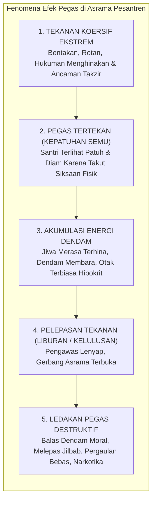
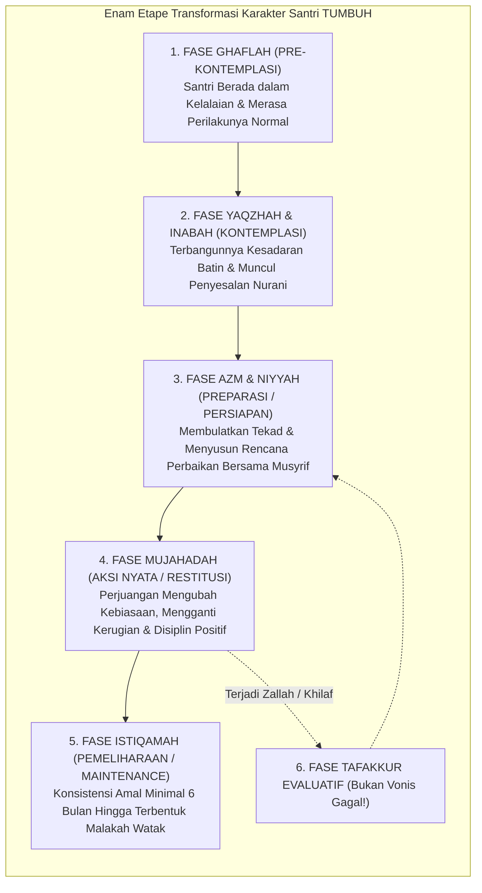
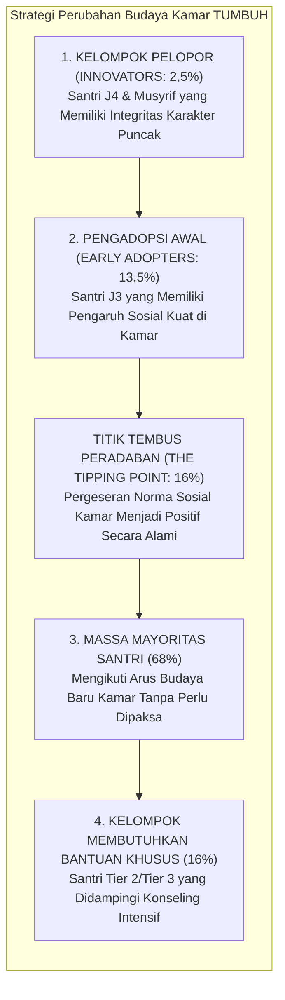

# BAB 7: TEORI PERUBAHAN PERILAKU BERKELANJUTAN
## Menembus Efek Pegas: Dari Kepatuhan Semu Menuju Transformasi Jiwa Berkelanjutan

> إِنَّ اللَّهَ لَا يُغَيِّرُ مَا بِقَوْمٍ حَتَّىٰ يُغَيِّرُوا مَا بِأَنْفُسِهِمْ ۗ وَإِذَا أَرَادَ اللَّهُ بِقَوْمٍ سُوءًا فَلَا مَرَدَّ لَهُ ۚ وَمَا لَهُمْ مِنْ دُونِهِ مِنْ وَالٍ
>
> *"Sesungguhnya Allah tidak akan mengubah keadaan suatu kaum hingga mereka mengubah apa yang ada pada diri mereka sendiri. Dan apabila Allah menghendaki keburukan terhadap suatu kaum, maka tak ada yang dapat menolaknya; dan sekali-kali tak ada pelindung bagi mereka selain Dia."*  
> — **Al-Qur'an al-Karim**, Surah Ar-Ra'd [13]: 11[^1]

---

### 7.1 Ilusi Perubahan Cepat: Menelanjangi "Efek Pegas" dalam Disiplin Asrama

Salah satu godaan paling berbahaya bagi para pengelola pesantren, asatidz, dan musyrif lapangan adalah **obsesi terhadap hasil instan (*the illusion of instant behavioral change*)**. 

Bayangkan sebuah peristiwa yang begitu sering berulang di ruang kantor pengasuhan:
Seorang santri kelas sembilan bernama Fikri tertangkap tangan membawa telepon genggam selundupan ke dalam asrama. Musyrif yang memergokinya seketika diliputi amarah. Fikri diseret ke tengah lapangan saat apel malam, telepon genggamnya dihancurkan dengan palu di hadapan seluruh santri, rambutnya dicukur botak tidak beraturan, dan ia dipaksa berdiri memegang papan bertuliskan *"Saya Penyelundup HP"* selama dua jam di bawah tatapan mencemooh dari kawan-kawannya.

Malam itu, di hadapan musyrif, Fikri menangis tersedu-sedu, mencium tangan sang pembina, dan bersumpah dengan nada penuh penyesalan: *"Saya kapok, Ustadz! Demi Allah saya janji tidak akan pernah mengulanginya lagi!"*

Pada detik itu, sang pembina merasa telah memenangkan pertempuran pedagogis: *"Lihat! Cara tegas dan keras seperti inilah yang berhasil. Sekali diberi pelajaran keras, anak langsung jera dan berubah!"*

Ketahuilah wahai para pendidik: **itu sama sekali bukanlah perubahan karakter; itu adalah ilusi fisik yang mematikan yang disebut sebagai "Efek Pegas" (*The Compressed Spring Effect*)**.

#### Fisika Jiwa: Mengapa Tekanan Melahirkan Daya Hancur Balasan?
Perhatikan bagaimana hukum mekanika pegas bekerja di alam materi:
Ketika Anda meletakkan sebuah pegas baja di atas lantai lalu menekannya ke bawah dengan telapak tangan Anda sekuat tenaga, pegas itu akan memendek dan merapat. Selama telapak tangan Anda terus menekan ke bawah tanpa henti, pegas itu tampak tunduk, diam, dan pasrah. 

Namun di balik ketundukan lahiriah itu, pegas tersebut sesungguhnya sedang **menyimpan energi potensial elastis (*potential elastic energy*) yang semakin membesar seiring dalamnya tekanan**. Semakin keras dan semakin kejam Anda menekannya ke bawah, semakin dahsyat akumulasi energi pemberontakan yang terkunci di dalam setiap lilitan spiral bajanya.

Lalu apa yang niscaya terjadi pada detik saat telapak tangan Anda terangkat atau melonggarkan tekanannya?  
Pegas itu akan **melompat melenting ke udara dengan kecepatan tinggi dan daya lenting yang mampu memecahkan kaca di sekitarnya!**

Inilah tragedi kemanusiaan yang menimpa Fikri dan ribuan alumni pesantren yang dididik dengan pola kekerasan:
Selama berada di dalam asrama, Fikri tampak sangat patuh karena ada tangan musyrif yang menekannya secara brutal. Namun rasa malu yang mendalam karena dipermalukan di depan kawan-kawannya tidak pernah hilang; rasa malu itu mengkristal menjadi racun dendam di alam bawah sadarnya. 

Dua tahun kemudian, ketika Fikri lulus dari pesantren dan menjadi mahasiswa di sebuah kota besar, **tangan penekan itu lenyap seketika**. Pegas jiwanya meledak tanpa kendali! Fikri seketika membuang seluruh simbol kesalehannya: ia menjadi pecandu pornografi daring, menenggak minuman keras bersama kawan-kawan barunya, dan berbicara dengan nada sinis penuh kebencian setiap kali mendengar nama almamater pesantrennya.

Kepatuhan yang lahir dari ketakutan fisik (*external coercive fear*) tidak pernah mentransformasi jiwa; kepatuhan itu hanya mendidik anak-anak kita menjadi **aktor kepalsuan (*feigned obedience*) yang mahir menipu orang dewasa demi keselamatan raganya**.

---

### 7.2 Tahapan Transformasi Jiwa: Integrasi Sains Perilaku dan Maqamat Tasawuf

Jika pemaksaan instan terbukti membawa malapetaka jangka panjang, bagaimanakah sesungguhnya hakikat perubahan perilaku manusia berlangsung secara alami dan berkelanjutan?

Al-Qur'an al-Karim menetapkan kaidah perubahan yang sangat presisi:

$$\text{إِنَّ اللَّهَ لَا يُغَيِّرُ مَا بِقَوْمٍ حَتَّىٰ يُغَيِّرُوا مَا بِأَنفُسِهِمْ}$$

> *"Sesungguhnya Allah tidak akan mengubah keadaan suatu kaum hingga mereka mengubah apa yang ada pada diri mereka sendiri."*  
> (QS. Ar-Ra'd [13]: 11)[^2]

Perhatikan firman Allah: **مَا بِأَنْفُسِهِمْ (apa yang ada di dalam jiwa batin mereka)**. Ayat ini menegaskan bahwa perilaku lahiriah hanyalah buah dari pohon batin; perubahan yang sejati dan abadi harus diawali oleh transformasi persepsi, kesadaran nilai, dan keputusan kehendak dari dalam kalbu (*internal locus of control*).

Dalam sains psikologi perilaku modern, James Prochaska dan Carlo DiClemente merumuskan **Model Transteoretikal Perubahan Perilaku (*The Transtheoretical Model of Behavior Change / Stages of Change*)**[^3]. Yang sangat menakjubkan bagi kita, tahapan ilmiah modern ini memiliki keselarasan yang sempurna dengan tahapan perjalanan taubat dan pembersihan jiwa (*maqamat at-taubah wa at-tazkiyah*) yang dirumuskan oleh Hujjatul Islam Al-Ghazali dalam *Ihya' Ulumiddin* dan Ibnu Qayyim al-Jauziyyah dalam *Madarij as-Salikin*[^4]:

Mari kita bedah secara mendalam keenam etape perubahan jiwa ini beserta protokol pendampingan musyrif di asrama:

#### 1. Etape Pertama: Al-Ghaflah (Fase Pra-Kontemplasi)
* **Kondisi Psiko-Spiritual Santri**: Santri berada dalam kabut kelalaian (*al-ghaflah*). Ia belum menyadari bahwa perilakunya keliru atau merugikan orang lain. Sebagai contoh: seorang santri yang terbiasa menyerobot antrean mandi di asrama merasa perbuatannya adalah hal yang lumrah dan cerdik (*"siapa cepat dia dapat"*).
* **Kekeliruan Fatal Pembina**: Langsung menghardik dan menghukum santri. Karena santri belum memahami letak kesalahannya, hukuman tersebut hanya akan memicu rasa ketidakadilan dan kemarahan batin.
* **Protokol Pedagogis TUMBUH**: **Membangunkan Nalar (*At-Tadzkir wal-Iqazh*)**. Musyrif tidak menjatuhkan sanksi, melainkan mengajak santri berdialog empatik: *"Duhai Salman, bayangkan jika antum sudah berdiri antre selama 20 menit dalam keadaan kedinginan, lalu tiba-tiba ada orang yang menyerobot tepat di depan antum, bagaimana rasa di dalam dada antum?"* Musyrif bertugas menyalakan sistem empati di neokorteksnya.

#### 2. Etape Kedua: Al-Yaqzhah dan Al-Inabah (Fase Kontemplasi)
* **Kondisi Psiko-Spiritual Santri**: Titik balik kesadaran (*al-yaqzhah*) mulai merekah. Hati nurani santri (*nafs lawwamah*) mulai bergetar mencela perbuatannya. Namun di dalam jiwanya terjadi pergulatan dahsyat: ada kerinduan untuk menjadi santri yang baik, namun ada tarikan kemalasan, godaan kenyamanan, dan rasa takut akan ditertawakan oleh kawan-kawannya.
* **Protokol Pedagogis TUMBUH**: **Memvalidasi Niat Baik dan Memberikan Harapan (*At-Targhib wal-Umid*)**. Musyrif merangkul pundak santri, mendengarkan kegundahannya tanpa menghakimi, dan menanamkan keyakinan bahwa ia mampu berubah: *"Ustadz melihat ada kebaikan yang sangat besar di dalam hatimu, Nak. Rasa bersalah yang kau rasakan saat ini adalah tanda bahwa Allah mencintaimu dan fitrahmu masih sangat hidup."*

#### 3. Etape Ketiga: Al-'Azm wa An-Niyyah (Fase Preparasi)
* **Kondisi Psiko-Spiritual Santri**: Santri telah melewati keraguan dan membulatkan tekad batin (*al-'azm*) untuk berubah secara sadar. Ia siap menata perilakunya.
* **Protokol Pedagogis TUMBUH**: **Penyusunan Kontrak Perubahan (*Action Planning & Scaffolding*)**. Niat baik harus segera diwadahi ke dalam rencana operasional konkret agar tidak menguap. Musyrif duduk bersama santri menyusun strategi nyata: *"Mari kita rencanakan bersama: apa langkah konkretmu agar esok hari tidak terlambat bangun subuh? Jam berapa lampu kamar harus dipadamkan? Kawan mana yang kamu tunjuk untuk saling membangunkan dengan santun?"*

#### 4. Etape Keempat: Al-Mujahadah (Fase Aksi Nyata)
* **Kondisi Psiko-Spiritual Santri**: Santri sedang berada di medan pertempuran menundukkan hawa nafsunya (*jihad an-nafs*). Ini adalah fase yang sangat berat secara biologis dan mental. Tubuhnya lelah menahan kantuk, egonya tersiksa saat harus meminta maaf kepada kawan yang pernah disakitinya, dan ia harus berjuang melawan godaan kebiasaan lama.
* **Protokol Pedagogis TUMBUH**: **Penguatan Positif Konsisten (*Positive Reinforcement*)**. Musyrif memantau dari dekat dengan tatapan penuh kasih, memberikan senyuman penguat, dan memberikan umpan balik formatif yang spesifik: *"Masya Allah, Salman, Ustadz melihat perjuanganmu pagi ini bangun tepat waktu saat azan pertama berkumandang. Sungguh itu membutuhkan tekad yang luar biasa. Teruslah melangkah!"*

#### 5. Etape Kelima: Al-Istiqamah (Fase Pemeliharaan / Maintenance)
* **Kondisi Psiko-Spiritual Santri**: Kebiasaan adab baru telah berjalan secara konsisten melampaui masa adaptasi kritis (antara 90 hingga 180 hari). Di dalam otak santri, mielinisasi sirkuit saraf telah mengunci perilaku tersebut menjadi **Al-Malakah (Watak Karakter Spontan)**. Santri melangkah salat, merapikan ranjang, dan bertutur kata santun secara otomatis tanpa perlu diawasi atau diingatkan lagi.
* **Protokol Pedagogis TUMBUH**: **Pemberian Mandat Kepemimpinan (*Empowerment*)**. Santri dinaikkan statusnya ke jenjang kemandirian yang lebih tinggi (J3 Mandiri Berkesadaran atau J4 Teladan Penggerak). Ia diberi amanah menjadi mentor pendamping bagi adik-adik kelasnya yang baru masuk asrama.

#### 6. Etape Penyelamat: Menyikapi Kekhilafan Sementara (Az-Zallah)
Dalam sunnatullah perkembangan manusia, **kekambuhan perilaku sementara (*relapse / az-zallah*) adalah peristiwa yang sangat wajar terjadi**. Terkadang seorang santri yang telah menunjukkan ketertiban luar biasa selama dua bulan, pada suatu hari karena kelelahan fisik akibat pekan ujian, kembali melakukan kekhilafan lama.

Pembina yang berpikiran sempit akan menghancurkan seluruh proses ini dengan vonis kemarahan: *"Percuma! Dasar memang tabiat aslimu pemalas, tidak bisa diubah!"*  
Hentakan verbal semacam ini meruntuhkan efikasi diri santri (*self-efficacy*) dan menjerumuskannya ke dalam keputusasaan total (*learned helplessness*).

Pendidik TUMBUH menyikapi kekhilafan sementara dengan kearifan seorang dokter spesialis:
> *"Salman, antum telah membuktikan mampu istiqamah menjaga adab selama enam puluh hari penuh. Kekhilafan pagi ini sama sekali tidak menghapus kemuliaan perjuangan antum. Mari kita duduk bersama dan memeriksa: apa pemicu yang membuat antum kelelahan semalam? Bagaimana cara kita menutup celah tersebut agar esok hari antum bangkit kembali dengan lebih tangguh?"*

---

### 7.3 Dinamika Sistemik: Dari Perubahan Individu Menuju Kebiasaan Kolektif

Perubahan karakter seorang santri tidak akan pernah mampu bertahan lama jika ia hidup terisolasi di tengah lingkungan kamar asrama yang sarat dengan racun budaya (*toxic culture*). 

Bayangkan seorang santri yang telah bertekad kuat untuk menjaga pandangan matanya dan bertutur kata santun, namun sebelas kawan sekamarnya setiap malam mengobrolkan hal-hal jorok, saling mencaci dengan nama orang tua, dan menertawakan santri yang rajin ke masjid. Dalam waktu kurang dari satu bulan, santri yang berniat baik tersebut niscaya akan menyerah dan terseret kembali ke dalam lumpur kebiasaan mayoritas akibat tekanan konformitas kelompok sebaya (**Peer Conformity Pressure**)[^5].

Oleh karena itu, teori perubahan TUMBUH tidak berhenti pada pembinaan individu per individu, melainkan mengadopsi **Pendekatan Sistemik Dinamis (*Dynamic Systems Thinking*)** dan **Teori Difusi Inovasi Kebudayaan (*Diffusion of Innovations*)** yang dirumuskan oleh sosiolog Everett Rogers[^6]:

#### Studi Kasus Lapangan: Mengubah Kultur Kamar Asrama yang Rusak
Bagaimanakah seorang musyrif TUMBUH mengubah sebuah kamar asrama yang berpenghuni dua belas santri, yang awalnya terkenal paling kotor, paling sering melanggar jam malam, dan sarat perundungan verbal?

* **Langkah Salah (Cara Lama)**: Musyrif masuk kamar, membanting pintu, memarahi seluruh santri sekaligus, lalu menghukum mereka semua push-up 100 kali.  
  * *Hasil*: Seluruh santri bersatu membangun solidaritas bawah tanah melawan musyrif (*subculture of resistance*). Begitu musyrif keluar kamar, makian mereka kepada sang musyrif justru semakin kasar.
* **Langkah Strategis Berbasis Sistem TUMBUH (*The Tipping Point Strategy*)**:
  1. **Pemetaan Sosiometri Kamar**: Musyrif mengamati diam-diam dinamika kamar selama tiga hari untuk menemukan **siapa santri yang menjadi tokoh sentral informal (*opinion leaders*)** di kamar tersebut. Ditemukanlah dua santri (santri A dan santri B) yang perkataannya selalu didengar dan ditiru oleh kawan-kawannya.
  2. **Intervensi Khusus 16% Penggerak Inti**: Musyrif mendekati santri A dan B secara personal. Mengajak mereka makan malam bersama di luar asrama, mendengarkan isi hati mereka, memuliakan martabat mereka, dan memberikan mereka tantangan kepemimpinan: *"Kalian berdua memiliki wibawa luar biasa di kamar ini. Ustadz ingin mempercayakan kepemimpinan kamar ini ke tangan kalian. Maukah kalian bersama Ustadz mengubah kamar kita menjadi kamar paling terhormat di pondok ini?"*
  3. **Pengikatan Komitmen Sahabat**: Santri A dan B merasa dihargai kemanusiaannya. Mereka beralih dari perusuh menjadi sekutu utama musyrif (*allies of change*).
  4. **Pergeseran Norma Sosial Kamar (*Tipping Point*)**: Begitu santri A dan B mulai merapikan kasurnya, menegur kawan yang berkata kotor, dan mengajak teman-temannya ke masjid, **iklim budaya kamar seketika bergeser 180 derajat**. Sembilan santri lainnya (massa mayoritas pengikut) secara otomatis mengikuti standar baru tersebut karena tidak ingin dikucilkan oleh tokoh sentralnya.

Perubahan budaya asrama berhasil dicapai tanpa ada satu tetes pun caci maki atau ayunan tongkat pemukul! Inilah keanggunan metode tarbiyah berbasis sains sistemik dan hikmah profetik.

---

### 7.4 Jembatan Menuju Bagian IV: Integritas Sistem dan Batasan Non-Negotiables

Kita telah menuntaskan penjelajahan filosofis, neurobiologis, dan metodologis yang teramat luas dan mendalam dalam **Bagian III**:
* Kita telah membedah bagaimana otak santri remaja bergolak laksana mobil balap Ferrari dengan rem sepeda ontel, serta bagaimana peran musyrif sebagai rem pengaman eksternal yang penuh welas asih (Bab 5);
* Kita telah mendekonstruksi konsep Ta'lim menuju Ta'dib sejati, meruntuhkan feodalisme kepengasuhan menuju *Servant Leadership*, serta merekayasa kurikulum tersembunyi asrama 24 jam (Bab 6);
* Kita telah membongkar kepalsuan efek pegas dari hukuman fisik keras dan memetakan enam etape transformasi perilaku berkelanjutan berbasis tahapan taubat dan sains kebiasaan (Bab 7).

Namun, renungkanlah sebuah kenyataan sejarah yang sangat penting:
Sebaik apa pun teori filosofis yang kita miliki, seluas apa pun wawasan neurosains yang kita kuasai, dan seindah apa pun kurikulum yang kita susun di atas kertas, **seluruh bangunan agung ini akan runtuh seketika di lapangan apabila para pengasuh dan pembinanya tidak memiliki Garis Merah yang Mengikat (*Institutional Safeguards*)**.

Ketika seorang musyrif sedang kelelahan di pukul dua dini hari, ketika emosinya tersulut oleh kenakalan santri, jika tidak ada sumpah integritas kelembagaan yang memagari tangannya—maka setan akan sangat mudah membisikkan pembenaran untuk kembali mengayunkan pukulan rotan dan melontarkan caci maki keji.

Oleh karena itu, sebelum kita melangkah lebih jauh merancang arsitektur model dan rubrik asesmen, kita wajib menegakkan sebuah benteng pertahanan moral tertinggi di gerbang pesantren kita: **Sumpah Integritas Pendidikan TUMBUH dan Prinsip-Prinsip yang Tidak Boleh Ditawar-tawar (*The Non-Negotiables*)**.

Inilah benteng suci yang akan kita pancangkan bersama dalam **BAGIAN IV: PRINSIP-PRINSIP INTI & INTEGRITAS SISTEM**.

---

### Catatan Kaki & Rujukan Akademik

[^1]: Al-Qur'an al-Karim, Surah Ar-Ra'd [13]: 11.
[^2]: Abu Ja'far Muhammad bin Jarir Ath-Thabari, *Jami' al-Bayan 'an Ta'wil Ayi al-Qur'an* (Tafsir Ath-Thabari), Tahqiq: Dr. Abdullah bin Abdul Muhsin At-Turki (Kairo: Dar Hijr, 2001), Jilid XIII, hlm. 118–125.
[^3]: James O. Prochaska & Carlo C. DiClemente, *The Transtheoretical Approach: Crossing Traditional Boundaries of Therapy* (Homewood: Dow Jones-Irwin, 1984); James O. Prochaska, Wayne F. Velicer, dkk., "The Transtheoretical Model of Health Behavior Change", *American Journal of Health Promotion*, Vol. 12, No. 1 (1997), hlm. 38–48.
[^4]: Abu Hamid Muhammad bin Muhammad Al-Ghazali, *Ihya' 'Ulum ad-Din*, Jilid IV, *Kitab at-Taubah* (Kairo: Dar al-Hadits, 2004), hlm. 3–55 mengenai rukun taubat: ilmu, hal (penyesalan batin), dan amal (meninggalkan dosa serta mengganti kerugian); Ibnu Qayyim al-Jauziyyah, *Madarij as-Salikin bayna Manazil Iyyaka Na'budu wa Iyyaka Nasta'in*, Tahqiq: Muhammad al-Mu'tashim Billah al-Baghdadi (Beirut: Dar al-Kitab al-'Arabi, 1996), Jilid I, hlm. 178–215 mengenai manzilah Al-Yaqzhah, Al-Inabah, dan At-Taubah.
[^5]: Solomon E. Asch, "Opinions and Social Pressure", *Scientific American*, Vol. 193, No. 5 (1955), hlm. 31–35; Muzafer Sherif, *The Psychology of Social Norms* (New York: Harper & Row, 1936).
[^6]: Everett M. Rogers, *Diffusion of Innovations*, Edisi ke-5 (New York: Free Press, 2003), hlm. 219–266 mengenai kurva adopsi inovasi; Malcolm Gladwell, *The Tipping Point: How Little Things Can Make a Big Difference* (Boston: Little, Brown and Company, 2000).
