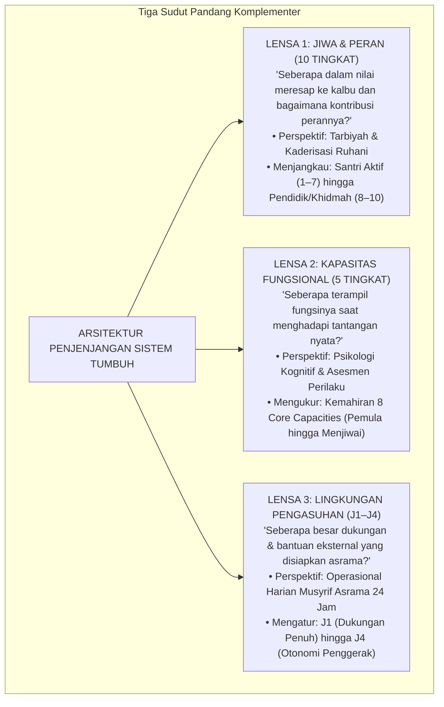
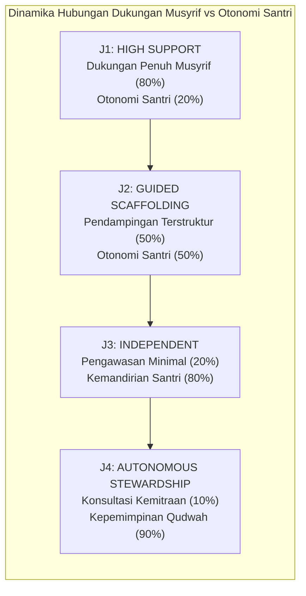
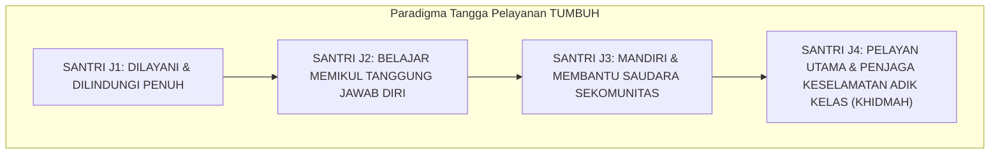

# BAB 12: PARADIGMA PROGRESI KARAKTER
## Dari Bimbingan Intensif Menuju Penggerak Peradaban: Harmonisasi Tiga Lensa Arsitektur

> لَتَرْكَبُنَّ طَبَقًا عَنْ طَبَقٍ
>
> *"Sungguh, kamu benar-benar akan menapaki tingkatan demi tingkatan (tahap demi tahap dalam kehidupan dan kedewasaan jiwa)."*  
> — **Al-Qur'an al-Karim**, Surah Al-Insyiqaq [84]: 19[^1]

---

### 12.1 Tragedi Penyeragaman Kaku: Mengapa Satu Ukuran Menghancurkan Jiwa?

Di banyak pondok pesantren konvensional, terdapat sebuah kekeliruan sistemik yang telah berlangsung turun-temurun: **Penyamaan Tuntutan Tanpa Memandang Tahapan Kematangan Jiwa (*One-Size-Fits-All Fallacy*)**.

Bayangkan sebuah pemandangan harian di lapangan asrama:
Seorang santri kelas tujuh yang baru berusia dua belas tahun—yang baru dua pekan berpisah dari dekapan hangat ibunya di rumah—dijatuhi sanksi takzir yang sama persis beratnya dengan santri kelas dua belas yang telah berusia delapan belas tahun. Keduanya sama-sama terlambat dua menit masuk masjid saat maghrib, dan keduanya sama-sama disuruh berdiri di depan saf jamaah di bawah tatapan mencemooh dari ratusan pasang mata.

Sang pembina berdalih dengan penuh kebanggaan: *"Hukum di pondok kami tidak pandang bulu! Mau santri baru, mau santri lama, semua diperlakukan sama rata tanpa kecuali!"*

Perhatikan kekeliruan fatal di balik ucapan tersebut! Menyamaratakan perlakuan antara dua manusia yang memiliki tingkat kematangan biologis, kognitif, dan adaptasi sosial yang berbeda jauh **bukanlah keadilan; itu adalah hakikat kezaliman yang nyata!**

Keadilan dalam epistemologi Islam, sebagaimana ditegaskan oleh para ulama ushul dan filosof adab, adalah:

$$\text{وَضْعُ الشَّيْءِ فِي مَوْضِعِهِ اللَّائِقِ بِهِ}$$

> *"Meletakkan segala sesuatu pada tempat dan porsinya yang tepat dan layak."*[^2]

Meletakkan beban ekspektasi kemandirian santri senior ke atas pundak anak kecil yang baru beradaptasi adalah bentuk ketidakadilan yang meremukkan saraf. Sebaliknya, terus-menerus memperlakukan santri senior kelas dua belas laksana anak balita yang harus diatur hingga detail terkecil dan diteriaki dengan peluit setiap pagi adalah pelecehan terhadap kedewasaan akalnya yang memicu apatisme dan pemberontakan.

Pertumbuhan karakter manusia adalah sebuah **proses perkembangan (*developmental progression*)**. Al-Qur'an al-Karim menegaskan sunnatullah ini dalam firman-Nya: **لَتَرْكَبُنَّ طَبَقًا عَنْ طَبَقٍ** (*Sungguh kamu akan menapaki tahap demi tahap*). Karakter tidak melonjak secara instan dari kelalaian langsung menuju kemakrifatan; jiwa santri mendaki tangga demi tangga kebaikan melalui pendampingan yang proporsional.

---

### 12.2 Penyelarasan Tiga Lensa Arsitektur TUMBUH

Salah satu keunikan dan keunggulan arsitektural ekosistem TUMBUH adalah kemampuannya menyelaraskan berbagai instrumen pembinaan yang selama ini kerap membingungkan para praktisi lapangan. Sering kali para asatidz bertanya: *Mengapa ada 10 tingkat penjenjangan adab? Mengapa ada 5 tingkat kapasitas fungsional? Dan bagaimana hubungannya dengan 4 Jenjang Kemandirian (J1–J4) di asrama? Apakah ketiganya bertentangan?*

Dokumen Fundamental TUMBUH menegaskan: **Ketiganya sama sekali tidak bertentangan, melainkan bekerja sebagai Tiga Lensa Saling Melengkapi (*The Three Architectural Lenses*)**[^3]:

Mari kita bedah secara mendalam bagaimana ketiga lensa ini saling berpadu:

#### 1. Lensa 1: 10 Tingkat Internalisasi Adab dan Peran Kader
Lensa ini memandang perjalanan santri dari sudut kedalaman spiritualitas kalbu dan peran amalnya bagi umat:
* **Etape 1: Fondasi Pembentukan Pribadi (Santri Aktif di Asrama: Tingkat 1–7)**:
  1. *Tahu*: Mengetahui informasi dalil adab secara kognitif.
  2. *Paham*: Memahami alasan, hikmah, dan maslahat di balik aturan adab.
  3. *Sadar*: Timbul getaran nurani batin (*yaqzhah*) untuk mengamalkannya.
  4. *Pembiasaan*: Mempraktikkan adab dalam pengulangan terstruktur di asrama.
  5. *Istiqamah*: Konsisten menjaga adab melampaui masa adaptasi kritis.
  6. *Teladan*: Perilaku adabnya memancarkan daya tarik yang ditiru kawan sekamarnya.
  7. *Penggerak*: Mampu memelopori inisiatif kebaikan dan membimbing adik kelas.
* **Etape 2: Pengabdian dan Peradaban (Di Luar J4 / Pasca-Kelulusan: Tingkat 8–10)**:
  8. *Pelaksana*: Menjalani masa khidmah pengabdian 1 tahun pasca-kelulusan.
  9. *Pembina*: Menjadi asatidz/musyrif yang membina generasi santri baru.
  10. *Pembangun*: Menjadi pimpinan kelembagaan yang merancang ekosistem peradaban umat.

> **Batas Krusial Arsitektur TUMBUH**:  
> Jenjang pengasuhan santri aktif di asrama **J1–J4 BERPUNCAK PADA TINGKAT 7 (PENGGERAK)**. Tingkat 8 (Pelaksana), 9 (Pembina), dan 10 (Pembangun) berada di luar batas J4, yakni merupakan ranah Pengabdian Alumni (*Khidmah Track*) dan Jalur Pendidik Profesional (*Educator Track*).

#### 2. Lensa 2: 5 Tingkat Perkembangan Kapasitas Fungsional
Lensa ini memandu para evaluator dan guru BK untuk mengukur kemahiran Delapan Kapasitas Inti (8 CC):
* *Tingkat 1 (Pemula)*: Menunjukkan perilaku hanya jika diarahkan langsung langkah demi langkah.
* *Tingkat 2 (Terbimbing)*: Mampu menjalankan adab dengan pengingat (*prompting*) minimal.
* *Tingkat 3 (Mandiri Rutin)*: Menjalankan kebiasaan baik secara konsisten dalam situasi normal tanpa disuruh.
* *Tingkat 4 (Tangguh/Adaptif)*: Mampu mempertahankan adab dan meregulasi diri saat berada di bawah tekanan stres, konflik, atau godaan lingkungan.
* *Tingkat 5 (Menjiwai/Mastery)*: Kapasitas telah menyatu mendarah daging (*malakah*), mampu memecahkan masalah kompleks dan menginspirasi lingkungan sekitarnya.

#### 3. Lensa 3: 4 Jenjang Dukungan Lingkungan Pengasuhan (J1–J4)
Inilah bahasa kerja harian para musyrif di asrama. Lensa ini tidak melabeli "kasta manusia", melainkan mengatur **Berapa banyak bantuan dan pengawalan yang wajib disiapkan oleh musyrif bagi santri**:

---

### 12.3 Taksonomi Empat Jenjang Kemandirian (J1–J4)

Mari kita bedah karakteristik, tantangan perkembangan, dan fokus pembinaan pada masing-masing jenjang J1 hingga J4:

#### Jenjang J1: Kemandirian Pemula / Adaptif (High Support Environment)
* **Karakteristik Santri**: Biasanya merupakan santri tahun pertama (fase transisi dari rumah ke pondok). Santri sedang mengalami disorientasi ruang, gegar budaya (*culture shock*), kerinduan rumah (*homesickness*), dan belum terbiasa dengan jadwal asrama yang padat.
* **Tantangan Utama**: Ketidakmampuan mengelola barang pribadi (sandal sering hilang, pakaian kotor menumpuk), kelelahan fisik bangun subuh, serta kecemasan sosial di kamar baru.
* **Peran Musyrif Asrama**: **Hadir Sebagai Orang Tua Pengganti (*In Loco Parentis*)**. Musyrif memberikan pendampingan fisik intensif: mengajari cara merapikan lemari, mencontohkan cara mencuci baju, merangkul saat santri menangis rindu keluarga, dan membangunkan subuh dengan usapan kasih sayang.
* **Target Capaian**: Santri merasa aman (*psychological safety*), kerasan tinggal di pondok, dan hafal alur rutinitas harian asrama.

#### Jenjang J2: Kemandirian Terbimbing / Responsif (Guided Scaffolding)
* **Karakteristik Santri**: Santri telah melewati masa adaptasi awal (biasanya santri tahun kedua). Fisik dan mentalnya telah terbiasa dengan ritme pondok, namun ia mulai memasuki fase pubertas awal yang sarat dengan pencarian jati diri dan dorongan impulsif.
* **Tantangan Utama**: Mulai muncul gesekan antarteman sekamar, godaan melanggar aturan secara sembunyi-sembunyi, serta kebosanan terhadap rutinitas asrama.
* **Peran Musyrif Asrama**: **Pemandu Perilaku Positif (*Coaching and Scaffolding*)**. Musyrif tidak lagi mengawasi setiap detik, melainkan memberikan kerangka pendampingan: memandu rapat kamar, melatih regulasi emosi saat bertengkar, dan mendiskusikan hikmah di balik aturan adab.
* **Target Capaian**: Santri konsisten menjalankan ibadah wajib dan piket kamar dengan pengingat minimal, serta mampu menyelesaikan konflik kecil di kamar secara damai.

#### Jenjang J3: Kemandirian Mandiri / Berkesadaran (Independent Functioning)
* **Karakteristik Santri**: Santri telah memiliki kendali moral internal (*Internal Locus of Control*). Ibadah dan adab harian telah menjadi kebutuhan jiwanya sendiri, bukan lagi karena takut teguran musyrif.
* **Tantangan Utama**: Mempertahankan istiqamah di tengah beban muthala'ah kitab yang semakin berat dan dinamika kelompok sebaya yang semakin kompleks.
* **Peran Musyrif Asrama**: **Konselor dan Sahabat Diskusi (*Advising and Mentoring*)**. Musyrif memberikan ruang otonomi yang luas: santri dipercaya mengelola waktu belajarnya sendiri dan diberi tanggung jawab mengoordinasikan kegiatan asrama.
* **Target Capaian**: Santri berdisiplin atas dasar *muraqabatullah* dalam kesendirian, menjaga integritas saat tidak diawasi, dan aktif berkontribusi bagi kebaikan komunitas asrama.

#### Jenjang J4: Kemandirian Teladan / Penggerak (Autonomous Stewardship)
* **Karakteristik Santri**: Puncak kematangan santri aktif di asrama. Santri tidak hanya mandiri untuk dirinya sendiri, melainkan telah menjadi **Pusat Gravitasi Kebaikan (*Center of Moral Gravity*)** bagi lingkungannya.
* **Tantangan Utama**: Menjaga keikhlasan niat dari penyakit kesombongan senioritas (*ujub dan kibr*), serta menjaga stamina keteladanan di tengah kesibukan persiapan kelulusan.
* **Peran Musyrif Asrama**: **Mitra Strategis Pengasuhan (*Collaborative Partner*)**. Musyrif mendelegasikan peran kepemimpinan nyata: santri J4 diangkat menjadi mentor bagi santri J1, memimpin lingkaran restoratif kamar, dan menjadi duta perdamaian asrama.
* **Target Capaian**: Terwujudnya karakter profil lulusan: santri yang berwawasan luas, mampu mengendalikan hawa nafsu, mandiri, dan menjadi pelopor maslahat bagi sesamanya (*Nafi'un Lighairihi*).

---

### 12.4 Menjaga Kemurnian Niat: Tangga Pelayanan (Khidmah), Bukan Tangga Feodalisme Kasta

Salah satu bahaya terbesar dalam merancang sistem penjenjangan di pesantren adalah timbulnya **Kasta Sosial Senioritas Beracun (*Toxic Caste System*)**:
Santri J4 merasa dirinya adalah "kasta ksatria" yang berhak dilayani, berhak memerintah, dan bebas dari aturan; sementara santri J1 dipandang sebagai "kasta budak" yang wajib menunduk dan mencuci seragam seniornya.

Jika ini yang terjadi, maka sistem penjenjangan telah gagal total dan berubah menjadi sarang kemaksiatan feodal!

Ekosistem TUMBUH menegakkan doktrin pensucian niat penjenjangan:

$$\text{كُلَّمَا ارْتَفَعَتْ دَرَجَتُكَ فِي النِّظَامِ، عَظُمَتْ مَسْئُولِيَّتُكَ فِي الْخِدْمَةِ}$$

> *"Semakin tinggi jenjang kemandirianmu dalam sistem TUMBUH, semakin besar kewajibanmu untuk merendahkan hati dan melayani sesama!"*

Di pesantren TUMBUH:
* Santri J4 yang melihat adik kelas J1 kesulitan membawa ember cucian tidak akan menyuruh-nyuruhnya, melainkan segera menghampirinya dan membantu mengangkatnya bersama-sama.
* Santri J4 menjadi benteng terdepan yang melindungi santri J1 dari segala bentuk perundungan.
* Kenaikan jenjang dari J1 ke J4 bukanlah perayaan kekuasaan atas orang lain; kenaikan jenjang adalah **sumpah pengabdian (*bai'at al-khidmah*)** untuk menjadi pelayan bagi dakwah dan umat.

Dengan paradigma yang jernih ini, tangga progresi kemandirian TUMBUH memancarkan cahaya tarbiyah yang murni. 

Bagaimanakah detail kurikulum pembiasaan, indikator harian, dan teknik pendampingan musyrif di Jenjang J1 dan Jenjang J2 diterapkan di kamar asrama?  
Inilah yang akan kita bedah secara tuntas dalam **Bab 13: Bedah Jenjang J1 & J2: Adaptasi, Pembiasaan, dan Regulasi Terbimbing**.

---

### Catatan Kaki & Rujukan Akademik

[^1]: Al-Qur'an al-Karim, Surah Al-Insyiqaq [84]: 19.
[^2]: Badruddin Muhammad bin Ibrahim Ibnu Jama'ah, *Tadzkirat as-Sami' wa al-Mutakallim fi Adab al-'Alim wa al-Muta'allim* (Beirut: Dar al-Basyair al-Islamiyyah, 2012), hlm. 55–62; Syed Muhammad Naquib al-Attas, *Islam and Secularism* (Kuala Lumpur: ABIM, 1978), hlm. 140–145.
[^3]: Repositori TUMBUH v2.0.0, Dokumen Fundamental: `01_FUNDAMENTAL/04_PROGRESSION/01 Growth Architecture/09-Developmental-Levels-Alignment.md` dan `01-Growth-Architecture.md`.
