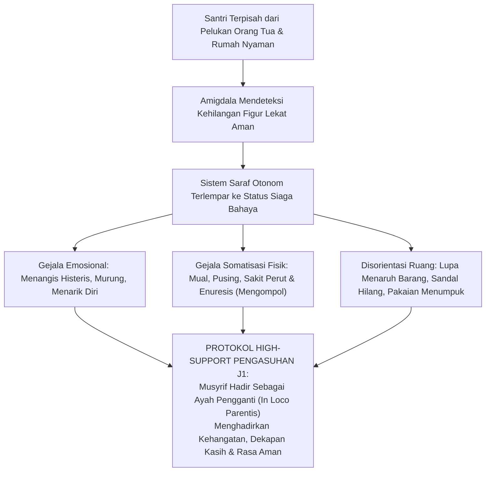
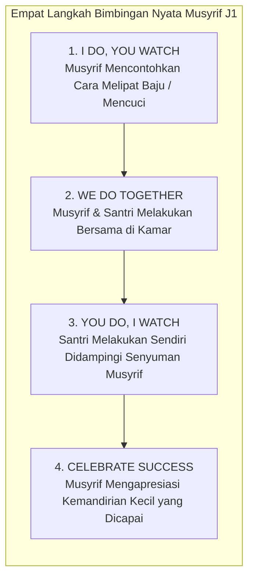
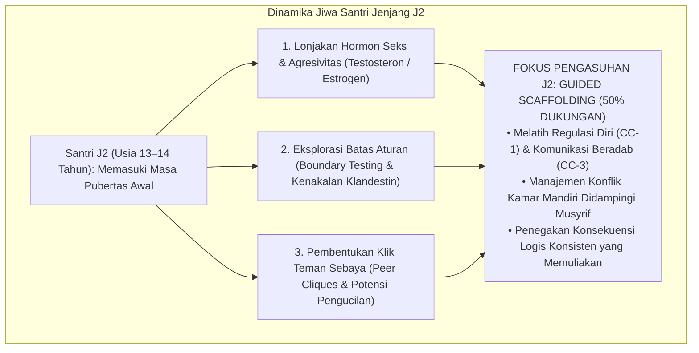

# BAB 13: BEDAH JENJANG J1 & J2: ADAPTASI, PEMBIASAAN, DAN REGULASI TERBIMBING
## Protokol Pendampingan 90 Hari Pertama, Mitigasi Homesickness, dan Peletakan Fondasi Adab Kamar

> يَا بُنَيَّ أَقِمِ الصَّلَاةَ وَأْمُرْ بِالْمَعْرُوفِ وَانْهَ عَنِ الْمُنْكَرِ وَاصْبِرْ عَلَىٰ مَا أَصَابَكَ ۖ إِنَّ ذَٰلِكَ مِنْ عَزْمِ الْأُمُورِ
>
> *"Wahai anakku! Laksanakanlah salat, suruhlah (manusia) berbuat yang makruf dan cegahlah (mereka) dari yang mungkar, serta bersabarlah terhadap apa yang menimpamu. Sesungguhnya yang demikian itu termasuk perkara-perkara yang diutamakan."*  
> — **Al-Qur'an al-Karim**, Surah Luqman [31]: 17[^1]

---

### 13.1 Fase Kritis 90 Hari Pertama: Anatomi Jiwa Santri Jenjang J1

Pukul 22.00 malam di pekan kedua tahun ajaran baru. Lampu kamar asrama telah dipadamkan, namun dari balik selimut bergambar kartun milik seorang santri kelas tujuh berusia dua belas tahun, terdengar isak tangis tertahan yang menyayat hati. Anak itu memeluk gulingnya erat-erat, meremas ujung bantalnya, dan berbisik lirih memanggil ibunya: *"Ibu... aku ingin pulang... aku tidak kuat di sini..."*

Di kamar mandi, santri J1 lainnya berdiri kebingungan di depan bak air: ember cucian pakaiannya telah menumpuk kotor selama empat hari, sabun mandinya hilang, dan ia tidak tahu bagaimana cara memeras seragam sekolahnya yang basah kuyup. Keesokan paginya saat jam sarapan tiba, seorang anak J1 mengeluh sakit perut melilit dan muntah-muntah, padahal dokter klinik asrama memastikan tidak ada infeksi bakteri apa pun pada pencernaannya.

Inilah potret nyata **Fase Kritis 90 Hari Pertama Santri Jenjang J1**.

Banyak pengasuh asrama konvensional tidak memahami fenomena ini, lalu melabeli anak-anak J1 sebagai "anak manja, cengeng, dan bermental tempe". Ketika anak menangis rindu orang tua (*homesick*), musyrif menghardiknya: *"Laki-laki tidak boleh menangis! Malu sama umur! Belajar ikhlas dan prihatin!"*

Sikap kasar semacam ini adalah bentuk ketidaktahuan medis dan psikologis yang membahayakan jiwa anak.

Secara psikosomatis dan neurobiologi keterikatan (*Attachment Theory* oleh John Bowlby), anak usia dua belas tahun yang tiba-tiba dipisahkan dari rumahnya sedang mengalami **Krisis Keterputusan Kelekatan (*Attachment Disruption Crisis*)**[^2]:

Sakit perut yang dialami santri J1 adalah **Somatisasi Saraf Asli (*Psychosomatic Pain*)**: kecemasan batin yang intens menstimulasi saraf vagus di saluran cerna (*the gut-brain axis*), memicu kram lambung nyata. Anak tersebut tidak sedang berpura-pura sakit untuk membolos! Tubuh biologisnya sedang menjerit membutuhkan rasa aman.

Oleh karena itu, arsitektur TUMBUH menetapkan: **Jenjang J1 (Kemandirian Pemula / Adaptif) adalah fase High Support (Dukungan Maksimal 80%)**. Tugas utama musyrif di jenjang J1 bukanlah menguji ketahanan mental anak dengan kekerasan, melainkan **menghadirkan rahim rasa aman kedua (*the secondary womb of safety*)** di asrama.

---

### 13.2 Protokol Pendampingan Musyrif Jenjang J1: Bimbingan Fisik Langsung

Di Jenjang J1, musyrif bertindak sebagai **In Loco Parentis (Orang Tua Pengganti yang Penuh Welas Asih)**. Pendampingan dilakukan melalui **Bimbingan Fisik Nyata (*Hands-On Scaffolding*)** langkah demi langkah:

Mari kita periksa bagaimana protokol ini diterapkan pada empat keterampilan dasar santri J1:

#### 1. Adab Thaharah dan Kebersihan Biologis
Banyak santri baru yang masuk pondok belum memahami fikih bersuci secara benar. Musyrif J1 tidak boleh berasumsi bahwa anak sudah bisa. Musyrif masuk ke kamar mandi bersama santri untuk mengajarkan secara visual: cara beristinja' yang sah dari najis kencing, cara menggosok gigi yang benar, cara mencuci pakaian dalam yang higienis, serta tata cara mandi wajib (*ghusl*) saat santri mengalami mimpi basah pertamanya. Penjelasan diberikan dengan bahasa ilmiah dan syar'i yang menjaga kehormatan anak tanpa rasa risih.

#### 2. Manajemen Lemari dan Kepemilikan Barang (Anti-Ghashab Sejak Dini)
Mengapa sandal dan pakaian santri sering hilang? Karena lemari santri J1 semrawut laksana kapal pecah! Musyrif J1 mendampingi santri menata lemarinya:
* Mengelompokkan seragam sekolah, pakaian salat, dan pakaian tidur pada rak yang berbeda.
* Memberi label nama permanen pada seluruh pakaian, handuk, sajadah, dan sandal santri.
* Mengajarkan aturan emas kamar: *"Barang siapa yang memakai sandal orang lain tanpa izin lisan pemiliknya, ia telah berbuat dosa ghashab yang diharamkan Allah."* Kebiasaan meminta izin ditegakkan secara ketat sejak hari pertama.

#### 3. Ritual Bangun Fajar Penuh Kelembutan
Musyrif J1 mengharamkan suara gedoran ember atau siraman air dingin. Musyrif berkeliling dari kasur ke kasur: menyentuh pundak santri, mengusap kepalanya, dan membisikkan salam: *"Bangunlah duhai anakku, waktu subuh telah tiba, mari kita bersuci menghadap Allah."* Jika ada anak yang sangat sulit membuka mata karena kelelahan adaptasi, musyrif membantunya duduk, memberinya segelas air putih hangat, dan menuntunnya melangkah ke tempat wudhu.

#### 4. Lingkaran Curhat Malam (*Bedtime Comfort Circle*)
Setiap malam pukul 21.00 sebelum lampu dipadamkan, musyrif duduk melingkar bersama seluruh anak kamarnya selama 15 menit. Ini adalah sesi katarsis emosi:
* Musyrif bertanya: *"Apa hal paling menyenangkan yang kalian alami hari ini? Dan siapa yang hari ini merasa sedih atau rindu rumah?"*
* Santri diberi ruang menangis dengan aman tanpa ditertawakan kawan-kawannya. Musyrif merangkul anak yang menangis, mendoakannya, dan membacakan kisah-kisah keteladanan para nabi dan sahabat yang menuntut ilmu di negeri yang jauh. Anak tidur dalam keadaan jiwa yang tenang (*peaceful closure*).

---

### 13.3 Bedah Jenjang J2: Kemandirian Terbimbing (Guided Scaffolding)

Setelah melewati masa krisis 90 hari pertama dan menyelesaikan tahun pertamanya di pondok, santri bertransformasi melangkah ke **Jenjang J2 (Kemandirian Terbimbing / Responsif)**.

Santri J2 telah kerasan tinggal di asrama, telah hafal seluk-beluk lorong pondok, dan tidak lagi menangis rindu orang tua. Namun, mereka memasuki medan pertempuran perkembangan baru yang tak kalah menantang: **Ledakan Pubertas Awal (Usia 13–14 Tahun)**.

#### Karakteristik dan Tantangan Utama Santri J2:
1. **Pengujian Batas Aturan (*Boundary Testing*)**:  
   Santri J2 mulai merasa dirinya "bukan anak kecil lagi". Mereka mulai berani menguji ketegasan musyrif: mencoba tidur lebih lambat dari jam malam, menyelundupkan makanan ke dalam kamar secara sembunyi-sembunyi, atau bergurau melewati batas adab kesopanan.
2. **Kerapuhan Relasi Antarteman Sekamar**:  
   Di jenjang J2, perselisihan antarteman sekamar meledak lebih sering: saling mengejek kekurangan fisik kawan (*body shaming*), perselisihan jadwal piket menyapu kamar, atau perebutan fasilitas ranjang.
3. **Pembentukan Klik Eksklusif (*In-Group vs Out-Group*)**:  
   Santri mulai berkumpul berdasarkan kesamaan daerah asal atau kesamaan hobi, dan kerap mengabaikan atau mengucilkan kawan sekamar yang berkarakter pendiam atau berbeda latar belakang.

---

### 13.4 Protokol Pengasuhan Jenjang J2: Memandu Tanggung Jawab Mandiri

Di Jenjang J2, peran musyrif bergeser dari "orang tua yang melayani fisik" menjadi **Pemandu Perilaku Beradab (*Coaching and Scaffolding*)**:

#### 1. Pendelegasian Tata Kelola Kamar Mandiri
Musyrif tidak lagi mengatur jadwal piket kamar secara sepihak. Musyrif memfasilitasi **Musyawarah Kamar Santri**:
* Santri J2 bermusyawarah menentukan struktur kamar mereka sendiri: siapa yang menjadi ketua kamar (*raisul ghurfah*), bagaimana pembagian jadwal piket membersihkan lantai, merapikan rak sandal, dan membuang sampah.
* Santri membuat kesepakatan norma kamar bersama (*Room Norms Agreement*): *"Di kamar kita, tidak boleh ada yang memanggil temannya dengan julukan yang ia benci; di kamar kita, waktu istirahat malam adalah waktu hening yang wajib dihormati."*
* Ketika santri merumuskan aturannya sendiri, rasa kepemilikan (*sense of ownership*) dan komitmen moral mereka untuk menaatinya melonjak drastis.

#### 2. Pelatihan Resolusi Konflik Tingkat Kamar
Ketika terjadi pertengkaran mulut atau perselisihan di antara santri J2, musyrif tidak langsung datang membagikan hukuman takzir. Musyrif mengaktifkan protokol **Lingkaran Restoratif Sederhana (*Peer Restorative Circle*)**:
* Musyrif mendudukkan kedua santri yang berselisih saling berhadapan.
* Musyrif memandu komunikasi: *"Rafi, katakan kepada Zaki apa yang membuatmu tersinggung dengan tenang tanpa membentak."*
* Zaki diminta mendengarkan tanpa memotong, lalu mengulangi apa yang ia pahami dari perkataan temannya (*active listening*).
* Musyrif bertanya kepada keduanya: *"Bagaimana solusi adil yang kalian sepakati agar perselisihan ini selesai dan persaudaraan kalian kembali pulih?"*
* Melalui latihan berulang ini, santri J2 belajar seni beradab mengelola konflik secara dewasa—sebuah keterampilan hidup (*life skill*) yang tak ternilai harganya bagi masa depan mereka.

---

### 13.5 Matriks Capaian Delapan Kapasitas Inti pada Jenjang J1 dan J2

Untuk memberikan panduan evaluasi formatif yang presisi bagi musyrif dan guru asrama, berikut adalah **Matriks Standar Capaian 8 Core Capacities pada Jenjang J1 dan J2**:

| Kapasitas Inti (8 CC) | Standar Capaian Jenjang J1 (Pemula / Adaptif) | Standar Capaian Jenjang J2 (Terbimbing / Responsif) |
| :--- | :--- | :--- |
| **CC-1: Regulasi Diri (*Self-Regulation*)** | Mampu bangun tidur saat dibangunkan musyrif tanpa merajuk; mampu menenangkan tangisan rindu rumah dengan bantuan pembina. | Mampu bangun fajar dengan alarm kamar; mampu menahan amarah fisik saat diejek teman dan memilih melapor kepada musyrif. |
| **CC-2: Nalar Kritis (*Critical Thinking*)** | Mampu memahami dan menghafal jadwal harian asrama serta aturan dasar thaharah dan ibadah. | Mampu menjelaskan alasan mengapa budaya *ghashab* dilarang syariat dan merugikan ukhuwah kamar. |
| **CC-3: Komunikasi Beradab (*Communication*)** | Mampu menyampaikan kebutuhan fisik dan keluhan sakitnya kepada musyrif secara jujur dan santun. | Mampu menggunakan kata *"tolong, maaf, dan terima kasih"*; menjauhi kata-kata kasar dan nama binatang saat bergurau. |
| **CC-4: Kerja Sama (*Collaboration*)** | Bersedia berbagi ruang ranjang dan tempat jemuran pakaian secara damai dengan teman sekamar. | Menjalankan piket kebersihan kamar tepat waktu sesuai jadwal musyawarah tanpa perlu disuruh berulang kali. |
| **CC-5: Keberfungsian Fisik (*Physical Functioning*)** | Terampil mencuci pakaian dasar, mandi bersih tepat waktu, dan makan makanan asrama dengan tertib adab makan. | Mampu merawat kerapian lemari sendiri, menjaga pakaian suci dari najis, dan berolahraga sore secara teratur. |
| **CC-6: Kepekaan Sosial (*Social Understanding*)** | Mengenal nama seluruh kawan sekamarnya dan menghormati barang milik orang lain. | Peka membantu kawan sekamar yang sedang sakit di klinik dan menolak ikut-ikutan menertawakan kawan yang tergelincir. |
| **CC-7: Agensi & Inisiatif (*Agency*)** | Mulai mengambil inisiatif mencuci piring makannya sendiri setelah selesai santap makan di dapur. | Memungut sampah yang tercecer di lantai kamar tanpa menunggu disuruh ketua kamar atau musyrif. |
| **CC-8: Pemecahan Masalah (*Problem Solving*)** | Jika barangnya hilang, segera melapor jujur kepada musyrif tanpa menuduh sembarangan kawan sekamar. | Mampu meminta maaf secara ksatria jika berbuat salah dan bersedia mengganti kerugian barang kawan yang ia rusakkan. |

Ketika fondasi adaptasi di Jenjang J1 tertanam kokoh dalam rasa aman cinta, dan pembiasaan adab di Jenjang J2 tertempa dalam disiplin terbimbing yang adil, santri telah memiliki akar yang sangat kuat untuk bertumbuh mekar.

Lalu, bagaimanakah lompatan transformasi menuju kemandirian penuh tanpa pengawasan (Jenjang J3) dan kepemimpinan teladan penggerak peradaban (Jenjang J4) dirancang dan dikawal?  
Inilah yang akan kita jelajahi secara mendalam dalam **Bab 14: Bedah Jenjang J3 & J4: Otonomi Karakter dan Kepemimpinan Qudwah**.

---

### Catatan Kaki & Rujukan Akademik

[^1]: Al-Qur'an al-Karim, Surah Luqman [31]: 17.
[^2]: John Bowlby, *Attachment and Loss: Vol. 1. Attachment* (New York: Basic Books, 1969); Mary D. Salter Ainsworth, *Patterns of Attachment: A Psychological Study of the Strange Situation* (Hillsdale: Lawrence Erlbaum Associates, 1978).
