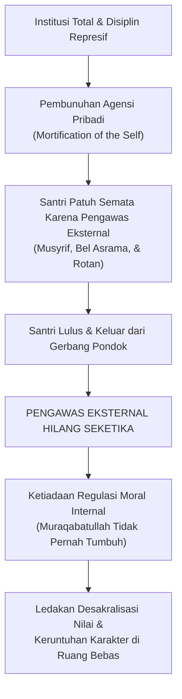
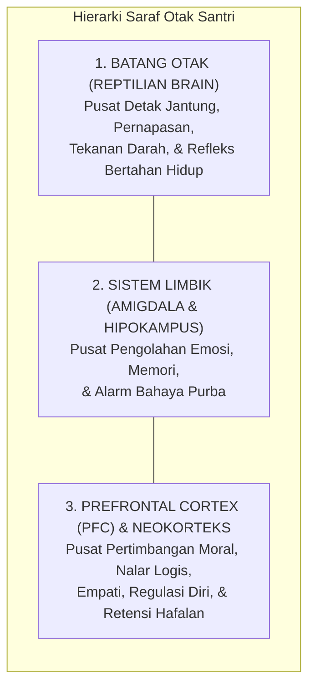
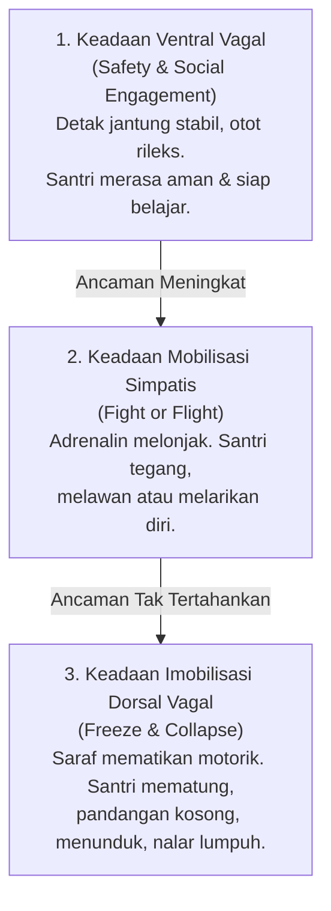
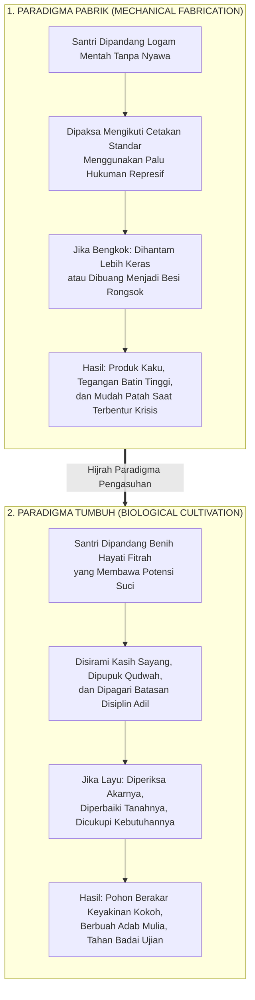
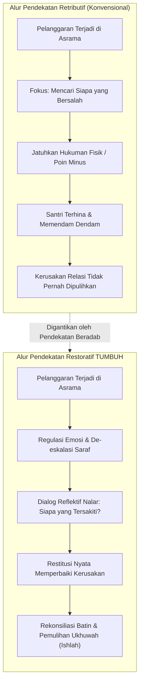

# BAB 1: MENATAP KRISIS, MENEGAKKAN ORIENTASI
## Manifesto Transformasi Karakter Pesantren 24 Jam

> مَنْ كَانَ مَرْبَاهُ بِالْعَسْفِ وَالْقَهْرِ مِنَ الْمُتَعَلِّمِينَ أَوْ الْمَمَالِيكِ أَوْ الْخَدَمِ، سَطَا بِهِ الْقَهْرُ، وَضَيَّقَ عَلَى النَّفْسِ فِي انْبِسَاطِهَا، وَذَهَبَ بِنَشَاطِهَا، وَدَعَاهُ إِلَى الْكَسَلِ، وَحَمَلَهُ عَلَى الْكَذِبِ وَالْخُبْثِ، وَهُوَ التَّظَاهُرُ بِغَيْرِ مَا فِي ضَمِيرِهِ خَوْفًا مِنِ انْبِسَاطِ الْأَيْدِي بِالْقَهْرِ عَلَيْهِ، وَعَلَّمَهُ الْمَكْرَ وَالْخَدِيعَةَ لِذَلِكَ، وَصَارَتْ لَهُ هَذِهِ عَادَةً وَخُلُقًا، وَفَسَدَتْ مَعَانِي الْإِنْسَانِيَّةِ الَّتِي لَهُ مِنْ حَيْثُ الِاجْتِمَاعِ وَالتَّمَدُّنِ...
>
> *"Barangsiapa yang pola pendidikannya bertumpu pada kekerasan, pemaksaan, dan penindasan—baik terhadap murid, hamba sahaya, maupun pelayan—niscaya tindak penindasan itu akan mencengkeram jiwanya, menyempitkan kelapangan batinnya, melenyapkan gairah dan inisiatifnya, menjerumuskannya ke dalam kemalasan, serta mendorongnya melakukan dusta dan kepura-puraan (kemunafikan). Hal itu terjadi karena ia terpaksa menampakkan sikap yang berbeda dengan isi hatinya semata-mata demi menghindari kezaliman fisik yang mengancamnya. Pola ini mengajarkannya muslihat dan tipu daya hingga akhirnya menjadi kebiasaan dan karakter yang melekat, lalu rusaklah hakikat nilai-nilai kemanusiaannya yang menjadi sendi kehidupan bermasyarakat dan peradaban..."*  
> — **Al-Allamah Abdurrahman Ibnu Khaldun**, *Muqaddimah* (Bab VI, Fasal 39: *Fī anna asy-syiddah 'alā al-muta'allimīn mudhirrah bihim*)[^1]

---

### 1.1 Tragedi di Balik Gerbang: Retakan Jiwa di Balik Ketertiban Semu

Pukul 04.15 dini hari di sebuah kompleks asrama pondok pesantren. Kabut dingin masih menyelimuti atap-atap gedung, namun keheningan fajar itu seketika terkoyak oleh suara gedoran keras pada pintu seng kamar mandi, denting ember aluminium yang dipukulkan ke tiang besi, serta lengkingan suara seorang pembina: *"Bangun! Bangun semuanya! Yang lima menit lagi masih meringkuk di kasur, siap-siap disiram air got! Bawa sajadah ke masjid sekarang!"*

Di salah satu sudut kamar berukuran enam kali empat meter yang dihuni oleh dua belas orang santri, seorang anak berusia dua belas tahun tersentak dari lelapnya. Tubuhnya terperanjat, matanya nanar menatap kegelapan, dan dadanya berdegup kencang dengan denyut jantung melesat di atas 130 denyut per menit. Anak itu tidak terbangun oleh kesadaran fajar yang suci, bukan pula oleh rasa rindu yang merekah di dada untuk menghadap Dzat Yang Maha Pengasih. Ia tersentak oleh keterkejutan instingtual (*survival terror*). Tubuhnya bergerak cepat menyambar sarung dan kopiah secara mekanis, namun di balik gerakan tergesa itu, jiwanya membeku dalam kecemasan yang akut.

Di siang hari, pemandangan di pesantren tersebut tampak teramat memesona. Para wali santri yang berkunjung, para donatur yang melintas, serta tamu-tamu terhormat akan menyaksikan barisan santri yang berjalan dengan langkah tertib, menundukkan pandangan saat berpapasan dengan guru, dan mencium tangan para asatidz dengan kerendahan hati yang menyejukkan. Suara riuh rendah lantunan hafalan bait-bait *Alfiyyah Ibnu Malik* dan juz-juz Al-Qur'an bersahut-sahutan dari balik jendela kelas. Di atas kertas laporan pengasuhan, segala sesuatunya tampak sempurna: tata tertib terlaksana, jadwal terlaksana seratus persen, dan ketertiban umum terjaga rapat.

Namun, marilah kita berani menanggalkan tabir formalitas tersebut dan menatap dengan jujur apa yang sesungguhnya terjadi di ruang-ruang tak terawasi ketika mata para pembina terpejam dan gerbang asrama tertutup rapat.

#### Anatomi Sosiologis Ghashab Sistemik: Normalisasi Perampasan Hak
Di lorong-lorong asrama dan kamar mandi bersama, berlangsung sebuah fenomena harian yang telah berlangsung puluhan tahun dan dinormalisasi secara berbahaya: **budaya ghashab (mengambil barang milik orang lain tanpa izin)**. Sandal jepit, ember cuci, sabun mandi, pasta gigi, hingga pakaian santri junior berpindah tangan setiap jam. 

Fenomena ini bukan sekadar persoalan hilangnya sepasang alas kaki murah; ini adalah **luka pembusukan moral yang merusak sensitivitas nurani santri terhadap sakralitas hak milik orang lain (*hifzh al-mal*)**. 

Perhatikan bagaimana seorang santri baru yang lugu bermutasi menjadi pelaku ghashab yang dingin:
Pada bulan-bulan pertama kedatangannya dari rumah, santri baru tersebut menjaga barang-barangnya dengan teliti sesuai didikan orang tuanya. Namun, dalam hitungan minggu, sandal barunya raib saat ditinggal salat di masjid. Gayung mandinya diambil santri lain. Sabunnya hilang dari keranjang. Ketika ia mengadu kepada santri senior atau pembinanya, respons yang ia terima kerap bernada menyepelekan: *"Di pondok itu harus tahan banting, Dik. Jangan manja, belajar ikhlas!"*

Ketika sistem pengasuhan gagal melindungi hak asasi kebendaan santri yang paling mendasar, anak itu dipaksa masuk ke dalam mode bertahan hidup (*survival strategy*). Agar kakinya tidak melepuh menginjak aspal terik menuju madrasah, ia terpaksa mengambil sandal temannya yang tergeletak. Pada detik pertama ia melakukannya, nuraninya bergetar cemas. Namun ketika perbuatannya lolos tanpa konsekuensi dan lingkungan menertawakannya sebagai "tanda sahnya menjadi santri tulen", benteng integritasnya runtuh. Dalam waktu enam bulan, anak yang awalnya jujur itu telah bermutasi menjadi predator kebendaan yang mahir merampas milik saudaranya sendiri tanpa merasa berdosa sedikit pun.

#### Feodalisme Hierarkis dan Rantai Transmisi Kekerasan Antargenerasi
Retakan jiwa yang lebih parah terjadi pada relasi kuasa antara santri senior (*mudabbir*) dan santri junior. Atas nama "penempaan mental" dan tradisi senioritas, kamar-kamar asrama kerap berubah menjadi panggung feodalisme terselubung. 

Santri junior dipaksa mencuci tumpukan seragam kotor seniornya, memijat betis mereka hingga larut malam melampaui jam tidur, membersihkan sisa makanan, hingga membelikan pesanan di kantin di bawah ancaman kekerasan fisik dan pengucilan sosial (*social ostracism*). Jika seorang anak kelas tujuh berani menolak, ia akan diintimidasi secara sistematis: tempat tidurnya dibasahi, bukunya disembunyikan, atau ia "disidang" di sudut jemuran gelap pada pukul satu dini hari dengan makian yang meremukkan harga dirinya.

Mengapa kekejaman ini terus berulang dari dekade ke dekade?
Jawabannya terletak pada apa yang dalam psikologi sosial disebut sebagai **Transmisi Trauma Antargenerasi (*Intergenerational Transmission of Abuse*)**. Santri senior yang malam ini menindas adik kelasnya sesungguhnya adalah korban yang tertindas pada tiga tahun yang lalu. Ketika ia dahulu diperlakukan secara zalim oleh seniornya tanpa ada sistem pengasuhan yang membela martabatnya, rasa sakit dan terhina itu tidak lenyap; rasa sakit itu mengendap menjadi dendam purba di alam bawah sadarnya. Maka begitu ia naik tingkat menjadi senior, otak emosionalnya menuntut pelampiasan: *"Dulu aku disiksa dan disuruh-suruh, sekarang giliranku menikmati privilese ini!"*

Kekerasan pun bertransformasi menjadi tradisi warisan yang dianggap lumrah, sementara para pengasuh pondok sering kali menutup mata dengan dalih bahwa senioritas adalah cara melatih kepemimpinan (*leadership*). Padahal yang sedang tumbuh subur bukanlah kepemimpinan, melainkan **tirani perpeloncoan**.

#### Ledakan Desakralisasi Nilai Pasca-Kelulusan
Puncak dari kegagalan sistem kontrol represif ini terlihat saat santri melangkah keluar dari gerbang pondok menuju dunia kampus atau masyarakat luas. Fenomena ini begitu akrab di telinga kita: santri yang selama bertahun-tahun tampak sangat zuhud dan takzim di pesantren, seketika menanggalkan busana muslimahnya, meninggalkan salat lima waktu, terjerumus dalam narkotika, atau larut dalam pergaulan bebas begitu mereka menghirup udara kebebasan kota besar.

Para kyai dan asatidz kerap terkejut dan berduka: *"Bagaimana mungkin anak yang telah menghafal ribuan bait nadham, muthala'ah kitab-kitab adab, dan bertahun-tahun hidup di lingkungan suci bisa berubah begitu liar dalam sekejap?"*

Sosiolog Erving Goffman, dalam karya monumentalnya *Asylums*, memberikan jawaban ilmiah yang sangat gamblang. Pesantren yang dikelola secara otoriter-represif masuk ke dalam kategori **Institusi Total (*Total Institution*)**—sebuah lingkungan tertutup tempat seluruh aktivitas hidup (makan, tidur, ibadah, belajar) diatur secara seragam dan diawasi secara mutlak dari atas[^2].

Di dalam institusi total, manusia mengalami apa yang disebut Goffman sebagai **Pembunuhan Kepribadian (*Mortification of the Self*)**. Segala bentuk otonomi, inisiatif pribadi, dan kehendak bebas ditiadakan. Individu dipaksa menyerahkan kendali dirinya kepada pengawas eksternal. Agar bisa bertahan hidup di dalam lingkungan yang serba menekan, santri belajar mengembangkan **Penyesuaian Sekunder (*Secondary Adjustments*)**: mereka menciptakan kepribadian ganda. Di depan musyrif, mereka menampilkan kepatuhan mutlak (*feigned compliance*); di belakang musyrif, mereka menyembunyikan pelanggaran secara lihai.

Ketika seorang santri lulus dari pesantren semacam ini, **pengawas eksternal (musyrif, bel asrama, ancaman takzir) tiba-tiba lenyap sama sekali**. Karena selama bertahun-tahun di asrama ia tidak pernah dilatih membangun kendali moral internal (*Internal Locus of Control / Muraqabatullah*), jiwanya limbung tanpa arah. Nilai-nilai adab yang dihafalnya tidak pernah mengakar menjadi watak kepribadian sejati; nilai-nilai itu hanyalah seragam formalitas yang ia kenakan demi menghindari hukuman. Begitu seragam ancaman itu dilepas, runtuhlah seluruh bangunan moralitasnya.

---

### 1.2 Dekonstruksi Ilmiah: Mengapa Hukuman Fisik dan Bentakan Merusak Nalar Santri?

Banyak pengasuh dan pembina asrama berdalih dengan argumentasi yang terdengar sangat agung: *"Niat kami membentak dan memukul bukan karena benci, melainkan demi kebaikan santri itu sendiri. Agar mentalnya sekuat baja! Dari zaman dahulu, pesantren memang keras, dan terbukti melahirkan ulama-ulama besar!"*

Mari kita bedah mitos ini secara telanjang melalui sains mutakhir: **Neurosains Perkembangan (*Developmental Neuroscience*)** dan **Teori Polivagal (*Polyvagal Theory*)**.

Secara anatomis dan fungsional, otak manusia tersusun atas tiga tingkatan evolusioner (*The Triune Brain Model*) yang terintegrasi:

1. **Batang Otak (*Brainstem*)**: Lapisan paling dasar yang mengendalikan fungsi vital otonom tubuh: ritme napas, tekanan darah, dan refleks mempertahankan hidup.
2. **Sistem Limbik (terutama Amigdala dan Hipokampus)**: Pusat pemrosesan emosi primer, pembentukan keterikatan kasih sayang (*attachment*), dan deteksi sinyal ancaman bahaya.
3. **Korteks Prafrontal (*Prefrontal Cortex / PFC*)**: Mahkota luhur penciptaan manusia—area otak di balik kening yang bertanggung jawab atas **Fungsi Eksekutif (*Executive Functions*)**: kemampuan menalar sebab-akibat, membedakan hak dan batil, mengendalikan hawa nafsu, merasakan empati mendalam terhadap penderitaan sesama, serta memori kerja (*working memory*) yang mutlak dibutuhkan santri untuk menghafal ayat-ayat Al-Qur'an, hadits, dan kaidah ilmu.

PFC adalah organ otak yang paling lambat matang; pada usia santri remaja (12–18 tahun), PFC masih berada dalam fase konstruksi biologis yang sangat rapuh dan sensitif terhadap rangsangan lingkungan.

#### Kronologi Detik demi Detik Pembajakan Saraf (Neurobiological Hijacking)
Apa yang sesungguhnya terjadi di dalam tengkorak kepala seorang santri ketika seorang pembina melotot, menunjuk wajahnya, membentaknya dengan suara menggelegar, atau mengangkat tongkat rotan di hadapannya?

* **Milidetik ke-50 hingga ke-100**: Gelombang suara bentakan dan ekspresi wajah marah sang pembina ditangkap oleh indera santri dan langsung diteruskan ke talamus menuju **Amigdala**, tanpa melewati jalur nalar PFC. Amigdala membaca stimulus ini sebagai ancaman predator yang mematikan.
* **Milidetik ke-150 hingga ke-300**: Amigdala seketika menyalakan alarm darurat biologis melalui **Sumbu Hipotalamus-Pituitari-Adrenal (HPA Axis)**. Sinyal darurat ini memerintahkan kelenjar adrenal untuk membanjiri peredaran darah dengan hormon stres dosis tinggi: **Kortisol, Adrenalin, dan Noradrenalin**.
* **Detik ke-1**: Terjadi fenomena yang dinamakan **Vasokonstriksi Perifer dan Deaktivasi Kortikal**. Detak jantung memompa cepat, glukosa darah melonjak, dan aliran darah secara masif dialihkan dari otak luhur (PFC) menuju kelompok otot-otot besar di tangan dan kaki untuk mempersiapkan tubuh bertarung (*fight*) atau melarikan diri (*flight*).

Pada detik inilah terjadi bencana pedagogis: **Korteks Prafrontal (PFC) mengalami kelumpuhan fungsional (*Prefrontal Shutdown*)**[^3]. Sirkuit saraf penalaran moral santri terputus total.

Secara biologis murni, **seorang anak yang otaknya sedang dibanjiri hormon stres berada dalam ketidakmampuan fisik untuk mencerna nasihat moral, merenungkan kesalahannya, atau menghayati nilai-nilai kebaikan**. Otak purbanya hanya memiliki satu tujuan tunggal saat itu: bagaimana caranya agar tubuhnya selamat dari ancaman sang pembina.

#### Teori Polivagal: Menelanjangi Makna Sikap "Menunduk Diam" Santri
Dr. Stephen Porges, perumus **Teori Polivagal (*Polyvagal Theory*)**, menjelaskan bahwa sistem saraf otonom manusia merespons stres melalui tiga hierarki keadaan biologis:

Ketika seorang santri berdiri mematung di hadapan pembina yang membentaknya, tidak membantah sepatah kata pun, dan menundukkan kepalanya dalam-dalam, sebagian besar musyrif merasa puas: *"Lihat, anak ini langsung tunduk dan patuh!"*

Ketahuilah wahai para pendidik: **anak itu menunduk bukan karena takzim kepada nasihat Anda!**

Secara neurobiologis, anak tersebut telah terlempar ke dalam **Keadaan Imobilisasi Dorsal Vagal (*Dorsal Vagal Shutdown*)**[^4]. Ini adalah respons saraf paling purba ketika tubuh menyadari bahwa melawan (*fight*) mustahil menang dan melarikan diri (*flight*) tidak ada jalan keluar. Sistem saraf parasimpatisnya mematikan fungsi motorik agar tubuhnya mematung (*freeze/playing dead*), persis seperti seekor binatang mangsa kecil yang lumpuh di bawah cengkeraman taring singa.

Sikap menunduk itu adalah wujud **kelumpuhan biologis akibat teror mental**. Di balik ketundukan itu, tidak ada sebutir pun kesadaran moral yang tumbuh; yang tersisa di dalam hatinya hanyalah rasa terhina, dendam yang terpendam, serta keputusasaan yang merusak harga dirinya sebagai manusia.

#### Racun Neurotoksik Kortisol terhadap Pusat Memori Hafalan Al-Qur'an
Tragedi ini berlanjut pada dimensi intelektual dan spiritual santri. Mengapa santri yang hidup di bawah lingkungan asrama yang sarat bentakan dan kekerasan fisik justru sangat lambat menyerap hafalan Al-Qur'an dan sering lupa saat tasmi'?

Sains memberikan bukti tak terbantahkan: **Kortisol yang diproduksi secara kronis akibat rasa takut yang terus-menerus bersifat neurotoksik (meracuni sel-sel otak)**[^5].

Di samping amigdala, terdapat struktur berbentuk kuda laut yang bernama **Hipokampus (*Hippocampus*)**—organ vital yang bertugas memproses, mengonsolidasi, dan menyimpan memori jangka panjang. Hipokampus adalah organ yang bekerja keras setiap kali santri menghafal ayat Al-Qur'an atau memahami kaidah nahwu-sharaf.

Ketika santri mengalami stres kronis:
1. Reseptor glukokortikoid di hipokampus dibanjiri oleh kortisol secara terus-menerus.
2. Kelebihan hormon kortisol ini menyebabkan **Atrofi Dendritik (pengerutan dan pemutusan cabang-cabang sinapsis antar-sel saraf)** di hipokampus.
3. Produksi sel saraf baru (*neurogenesis*) di area hipokampus terhenti total.

> *Bagaimana mungkin seorang santri dapat menghafal kalamullah dengan bening dan menancapkannya ke dalam kalbunya, jika pada saat yang sama lingkungan asramanya meracuni otaknya setiap hari dengan hormon stres yang menghancurkan sel-sel memorinya?*

Mendidik santri dengan teror bentakan dan kekerasan fisik bukanlah metode syar'i; itu adalah kejahatan biologis yang menghancurkan potensi akal budi ciptaan Allah ﷻ.

---

### 1.3 Ilusi Tokenisme: Ketika Pahala Digantikan Poin Minus dan Birokrasi Skor

Ketika sebagian pesantren mulai menyadari bahwa kekerasan fisik telah melahirkan trauma dan kecaman masyarakat, mereka mencari alternatif pembinaan yang tampak modern, terukur, dan profesional. Pilihan mereka kerap jatuh pada **Sistem Poin Pelanggaran dan Token Ekonomi Mekanistik**.

Buku-buku tata tertib dicetak dengan daftar tarif pelanggaran yang sangat rinci:
* Terlambat salat berjamaah: minus 5 poin.
* Tidak mengikuti piket asrama: minus 10 poin.
* Sandal tidak diletakkan di rak: minus 2 poin.
* Berbicara dengan bahasa daerah: minus 5 poin.
* Mengantongi akumulasi minus 50: pembersihan kamar mandi umum.
* Mengantongi akumulasi minus 100: skorsing kepulangan satu pekan.

Sekilas pandang, sistem ini tampak sangat adil, objektif, dan bebas dari amarah pribadi pengasuh. Namun, dalam praksis pendidikan pesantren 24 jam, sistem birokrasi skor ini justru melahirkan bencana pedagogis baru yang tak kalah mematikan: **Komodifikasi Adab, Desakralisasi Niat, dan Matinya Rasa Berdosa**.

#### Korupsi Niat Ikhlas: Overjustification Effect
Dalam diskursus ilmu tasawuf dan tarbiyah ruhaniyah, niat ikhlas (*al-ikhlas*) adalah poros dari seluruh amal kebajikan. Seorang santri semestinya salat di saf pertama karena rindu bermunajat kepada Allah; ia semestinya menyapu lantai asrama karena mengamalkan nilai kebersihan sebagai cabang dari keimanan; ia semestinya menolong temannya karena dorongan cinta ukhuwah imaniyah.

Ketika seluruh amal kebajikan tersebut dikonversi menjadi perolehan "poin plus" dan setiap kesalahan dikonversi menjadi "poin minus", sistem ini sedang mendidik santri menjadi **pribadi yang transaksional dan materialistik**.

Prof. Edward Deci dan Richard Ryan dalam penelitian monumental mereka mengenai *Self-Determination Theory* (SDT) menemukan fenomena psikologis yang disebut **Efek Pembenaran Berlebih (*The Overjustification Effect*)**[^6]. Ketika sebuah perilaku mulia yang semestinya digerakkan oleh motivasi intrinsik (nilai moral, cinta kebenaran, kesenangan berbuat baik) dikaitkan secara kaku dengan imbalan atau hukuman ekstrinsik (poin, hadiah materi, kartu skor), maka motivasi intrinsik tersebut **mati secara perlahan**.

Santri tidak lagi menyapu masjid karena ingin membersihkan rumah Allah; ia menyapu masjid demi mengejar 10 poin pemutihan catatan hitamnya. Begitu sistem poin ditarik dari kehidupannya (misalnya saat liburan atau setelah lulus), lenyap pulalah seluruh dorongannya untuk berbuat kebajikan, karena ia tidak pernah dilatih mencintai kebajikan itu demi kebajikan itu sendiri.

#### Kalkulasi Dosa Tanpa Penyesalan Batin
Lebih berbahaya lagi, sistem poin mengubah persepsi santri tentang hakikat kemaksiatan dan pelanggaran adab. Pelanggaran tidak lagi dipandang sebagai dosa yang menodai hati (*ar-ran*) dan mencabik ukhuwah, melainkan dipandang sebagai **harga transaksi yang dapat dibayar**.

Dengarkan bagaimana percakapan santri di kamar asrama saat malam hari:
> *"Akhi, malam ini kita kabur ke warung kopi luar pondok yuk!"*  
> Temannya menjawab sambil membuka buku saku pelanggaran:  
> *"Berapa minusnya kalau ketahuan keluar pagar?"*  
> *"Minus 20 poin."*  
> *"Oh, poin aman saya masih ada 45. Masih sisa 25 poin lagi sebelum kena skorsing. Gas, berangkat!"*

Perhatikan logika moral di atas! Santri tidak lagi memikirkan apakah tindakannya membuat orang tuanya sedih, apakah tindakannya mengecewakan para asatidz, atau bagaimana pertanggungjawabannya di hadapan Allah. Ia semata-mata sedang melakukan **kalkulasi finansial-moral**: ia membeli kebebasan melanggar aturan dengan membayar sejumlah poin yang masih tersedia di saldonya. Sistem ini telah mencabut rasa malu (*al-haya'*) dan rasa takut (*al-khauf*) dari dalam kalbu santri.

#### Devolusi Peran Musyrif: Dari Ayah Ruhani Menjadi Sipir Tilang
Dampak paling tragis dari sistem birokrasi poin ini menimpa para pembina dan musyrif itu sendiri. Musyrif asrama semestinya berperan sebagai **abun rohim** (ayah yang penuh welas asih), tempat santri mengadu saat rindu kampung halaman, tempat santri mencurahkan kegundahan batinnya saat menghadapi kesulitan belajar, serta pembimbing yang menuntun dengan keteladanan hidup (*qudwah*).

Namun di bawah tirani birokrasi poin, peran luhur tersebut mengalami devolusi: musyrif terdegradasi menjadi **polisi lalu lintas yang sibuk menilang**. 

Musyrif tidak lagi memiliki waktu untuk duduk bersila di samping tempat tidur santri, menepuk pundaknya, dan bertanya dengan lembut: *"Nak, kenapa matamu sembab pagi ini? Apa yang sedang merisaukan hatimu?"* Musyrif terlalu sibuk memegang bolpoin dan papan jalan, mencatat siapa yang terlambat 2 menit masuk masjid, siapa yang pecinya miring, dan siapa yang sandalnya belum masuk rak. Relasi kasih sayang antara pendidik dan anak didik mati, digantikan oleh relasi birokrasi yang dingin dan penuh kecurigaan.

---

### 1.4 Manifesto TUMBUH: Tarbiyah Berbasis Pertumbuhan Fitrah

Menghadapi jalan buntu antara **represi feodal yang meremukkan saraf** di satu sisi dan **transaksionalisme poin yang mematikan keikhlasan** di sisi lain, ekosistem **TUMBUH** memancangkan panji pembaruan tarbiyah kepesantrenan.

Kata **TUMBUH** bukanlah jargon kosmetik, melainkan kristalisasi dari sebuah ikhtiar pemahaman tentang hakikat pendidikan Islam: **Pendidikan Karakter adalah Seni Menumbuhkan Benih Hayati, Bukan Proses Menempa Logam Mesin Pabrik**.

Perhatikan kontras yang sangat mendasar antara dua pandangan hidup ini:

Al-Qur'an al-Karim mengabadikan perumpamaan manusia beriman dan kalimat thayyibah bukan seperti benteng batu yang kaku, melainkan seperti **pohon yang hidup dan bertumbuh**:

$$\text{أَلَمْ تَرَ كَيْفَ ضَرَبَ اللَّهُ مَثَلًا كَلِمَةً طَيِّبَةً كَشَجَرَةٍ طَيِّبَةٍ أَصْلُهَا ثَابِتٌ وَفَرْعُهَا فِي السَّمَاءِ ۝ تُؤْتِي أُكُلَهَا كُلَّ حِينٍ بِإِذْنِ رَبِّهَا ۗ وَيَضْرِبُ اللَّهُ الْأَمْثَالَ لِلنَّاسِ لَعَلَّهُمْ يَتَذَكَّرُونَ}$$

> *"Tidakkah kamu memperhatikan bagaimana Allah telah membuat perumpamaan kalimat yang baik seperti pohon yang baik, akarnya teguh menghunjam ke dalam bumi dan cabangnya menjulang tinggi ke langit. Pohon itu menghasilkan buahnya pada setiap musim dengan izin Rabb-nya. Dan Allah membuat perumpamaan-perumpamaan itu untuk manusia agar mereka selalu ingat."*  
> (QS. Ibrahim [14]: 24–25)[^7]

Imam Abu Ja'far Ibnu Jarir Ath-Thabari dalam kitab tafsirnya meriwayatkan penafsiran dari sahabat Abdullah bin Abbas رضي الله عنهما mengenai ayat ini: bahwa *syajaratin thayyibah* (pohon yang baik) adalah perumpamaan kalbu dan jiwa seorang mukmin; akarnya yang kokoh menghunjam di bumi adalah keimanan tauhid (*La ilaha illallah*) yang menancap di batinnya, cabangnya yang menjulang ke langit adalah amal shalih dan akhlak mulianya yang diangkat ke haribaan Allah, serta buahnya adalah adab dan kebajikan yang dipetik setiap saat.[^7] 

Penafsiran ini diperkuat oleh Al-Hafizh Ibnu Katsir dalam *Tafsir al-Qur'an al-'Azhim*, yang menggarisbawahi bahwa sebagaimana sebatang pohon yang subur menuntut tanah yang bersih, siraman air yang cukup, serta perlindungan dari gulma parasit agar buahnya manis berkelanjutan, demikian pulalah jiwa seorang mukmin: fitrah tauhid di dalam jiwanya menuntut siraman ilmu yang bersih dan ekosistem tarbiyah yang sehat agar akarnya tidak layu dan buah adabnya tidak membusuk.[^8]

Renungkanlah perumpamaan agung ini!
Seorang petani yang memiliki akal sehat tidak akan pernah memarahi benih mangganya yang baru bersemi karena benih itu belum menghasilkan buah manis. Petani tidak akan memukul tunas pohonnya dengan kayu balok agar tunas itu tumbuh lebih cepat. Petani tidak akan mencabik-cabik kuncup bunga yang belum mekar karena merasa tidak sabar.

Jika seorang petani melihat daun tanamannya menguning dan layu:
* Ia tidak akan melabeli tanaman itu sebagai "tanaman pembangkang yang tidak tahu diri".
* Petani yang bijak akan segera memeriksa tanahnya: *Apakah tanahnya terlalu kering sehingga kekurangan air? Apakah saluran drainasenya tersumbat hingga membusukkan akarnya? Apakah sinar matahari terhalang oleh dedalu liar? Apakah ada ulat parasit yang menggerogoti batangnya di malam hari?*

Begitulah hakikat pendidik dalam arsitektur **TUMBUH**:
Ketika seorang santri melakukan pelanggaran adab—ia membolos salat subuh, berkata kotor kepada temannya, atau mencuri makanan di kantin—pendidik TUMBUH tidak memandangnya sebagai sampah masyarakat yang harus segera dihantam dengan rotan atau diusir keluar pondok. 

Pendidik TUMBUH akan membedah ekosistem kehidupannya:
* *Apa kebutuhan jiwa santri ini yang sedang terluka dan belum terpenuhi?*
* *Apakah ia mengalami stres adaptasi yang belum terselesaikan sejak terpisah dari orang tuanya?*
* *Apakah ia merasa terkucil dan tidak aman di kamarnya?*
* *Apakah jam belajarnya terlalu padat sehingga tubuh biologisnya mengalami kelelahan saraf yang akut?*
* *Keteladanan apa yang luput kami hadirkan di hadapannya selama ini?*

Santri tidak diciptakan sebagai kertas kosong tanpa nilai (*tabula rasa*), bukan pula terlahir membawa kutukan dosa asali. Santri lahir membawa **benih fitrah kesucian bertauhid** sebagaimana disabdakan oleh Rasulullah ﷺ:

$$\text{كُلُّ مَوْلُودٍ يُولَدُ عَلَى الْفِطْرَةِ، فَأَبَوَاهُ يُهَوِّدَانِهِ أَوْ يُنَصِّرَانِهِ أَوْ يُمَجِّسَانِهِ}$$

> *"Setiap anak dilahirkan di atas fitrah (kesucian bertauhid). Maka kedua orang tuanyalah (lingkungan pengasuhnya) yang menjadikannya Yahudi, Nasrani, atau Majusi."*  
> (HR. Al-Bukhari no. 1358 dan Muslim no. 2658)[^9]

Tugas kita sebagai pendidik bukanlah "memasukkan karakter dari luar dengan palu godam", melainkan **menghilangkan penghalang-penghalang biologis, emosional, dan sosial yang menutupi fitrah tersebut, lalu menyiraminya hingga mekar menjadi pohon adab yang kokoh**.

---

### 1.5 Pembedahan Praksis: Matriks Operasional Hukuman Retributif vs Disiplin Restoratif TUMBUH

Bagaimana revolusi paradigma ini bekerja dalam praksis kehidupan asrama sehari-hari? Mari kita sandingkan secara terperinci antara pendekatan retributif (lama) dengan pendekatan edukatif-restoratif TUMBUH dalam menangani dinamika nyata pelanggaran santri:

Untuk memberikan kejelasan mutlak tanpa ruang abu-abu bagi para asatidz dan musyrif, perhatikan komparasi lima kasus riil lapangan berikut:

#### Kasus 1: Santri Terlambat Bangun Salat Subuh
* **Pendekatan Lama (Retributif)**: Musyrif menyiram santri dengan air ember dingin, membentaknya di depan pintu kamar, lalu menyuruhnya berdiri dengan satu kaki di halaman masjid selama salat berjamaah berlangsung.
  * *Dampak*: Tubuh santri menggigil masuk angin, amigdalanya terkunci dalam kepanikan, rasa cintanya pada salat subuh berganti menjadi kebencian pada ritual tersebut, dan ia merasa harga dirinya diinjak-injak di hadapan kawan-kawannya.
* **Protokol Edukasi Restoratif TUMBUH**:
  1. **Regulasi Awal**: Musyrif membangunkan dengan sentuhan lembut di bahu sambil membaca doa bangun tidur atau melantunkan azan dengan nada yang menenteramkan kalbu.
  2. **Audit Kausalitas**: Di siang hari, musyrif duduk bersama santri tersebut untuk menelusuri akar masalahnya: *"Mengapa antum sangat sulit membuka mata subuh tadi? Pukul berapa antum tidur semalam? Apa yang antum lakukan setelah isya?"*
  3. **Tindakan Perbaikan (*Logical Consequence*)**: Jika santri begadang mengobrol dengan temannya, konsekuensi logisnya adalah penyesuaian jam malam kamar: malam itu ia wajib memadamkan lampu dan beristirahat lebih awal (pukul 21.30) dengan pendampingan musyrif untuk memulihkan ritme biologis otaknya. Santri memahami bahwa aturan tidur dibuat demi menjaga kesehatan otaknya sendiri.

#### Kasus 2: Santri Terlibat Perkelahian Fisik di Asrama
* **Pendekatan Lama (Retributif)**: Kedua santri yang berkelahi dipukul tangannya dengan rotan, dicukur gundul rambutnya, dan dipaksa saling meminta maaf secara dingin di depan forum rapat asrama.
  * *Dampak*: Permusuhan batin tidak pernah padam. Mereka pura-pura berdamai di depan musyrif, namun di belakang mereka merencanakan perkelahian lanjutan di luar pondok atau saling menjatuhkan nama baik melalui teman sebaya.
* **Protokol Edukasi Restoratif TUMBUH**:
  1. **Pemisahan & Penenangan (*Cooling Down*)**: Kedua santri dipisahkan ke ruangan yang berbeda. Musyrif memberikan waktu dan air minum hingga ritme napas dan detak jantung keduanya turun ke kondisi stabil (*down-regulated*). Dilarang menginterogasi anak yang amigdalanya masih menyala merah.
  2. **Eksplorasi Sudut Pandang (*Hearing Both Sides*)**: Masing-masing santri diajak mengekspresikan perasaannya secara jujur tanpa dihakimi: *"Apa yang membuatmu merasa sangat marah hingga melayangkan pukulan? Kebutuhan apa yang ingin kamu sampaikan tadi?"*
  3. **Fasilitasi Lingkaran Restoratif (*Restorative Circle*)**: Keduanya dipertemukan kembali dengan dipandu musyrif. Masing-masing mendengarkan dampak rasa sakit fisik dan batin yang dialami oleh lawannya.
  4. **Ishlah al-Bain Nyata**: Pelaku yang memulai pemukulan berkomitmen mengobati luka temannya (mengantarkannya ke klinik asrama dan merawatnya), serta keduanya menyepakati protokol komunikasi baru jika terjadi perbedaan pendapat di masa mendatang.

#### Kasus 3: Santri Kedapatan Merokok di Balik Kamar Mandi
* **Pendekatan Lama (Retributif)**: Rokok dimasukkan ke dalam mulut santri sekaligus lalu dipaksa mengunyahnya, atau santri dijemur di tengah lapangan terik matahari sambil mengalungkan bungkus rokok di lehernya.
  * *Dampak*: Kerusakan organ pencernaan santri akibat tembakau yang tertelan, trauma psikologis akut, dan lahirnya rasa dendam kesumat yang mendorong santri melampiaskan kenakalannya ke tingkat yang lebih ekstrem (narkoba atau kabur).
* **Protokol Edukasi Restoratif TUMBUH**:
  1. **Penyitaan Bermartabat**: Rokok disita tanpa mencaci-maki santri dengan kata-kata keji. Santri dipanggil ke ruang konseling secara tertutup demi menjaga kehormatan namanya (*hifzh al-'irdh*).
  2. **Functional Behavior Assessment (FBA)**: Tim BK atau musyrif senior menggali motif dasar perilaku merokok tersebut: *Apakah santri merokok karena tekanan kelompok sebaya (peer pressure)? Apakah sebagai pelarian dari rasa cemas dan depresi akibat target hafalan? Ataukah meniru perilaku orang dewasa di keluarganya?*
  3. **Edukasi Sains Adiksi**: Santri diajak mempelajari mekanisme kerja nikotin yang membajak dopamin otak, serta dampak asap rokok terhadap penurunan kapasitas paru-paru santri atletik.
  4. **Restitusi & Layanan Asrama**: Sebagai wujud tanggung jawab atas pencemaran udara asrama yang dilakukannya, santri mendapatkan tugas restoratif yang bernilai manfaat: membersihkan dan menanam tanaman hijau penyaring udara di taman asrama selama sepekan di bawah bimbingan guru lingkungan hidup.

#### Kasus 4: Ghashab Berulang dan Pencurian Uang Saku Kamar
* **Pendekatan Lama (Retributif)**: Santri yang terbukti mencuri uang atau sandal kawan diarak keliling asrama dengan papan bertuliskan *"SAYA PENCURI"*, dipukul telapak tangannya di depan apel santri, dan langsung diancam dikeluarkan dari pondok dalam tempo 24 jam.
  * *Dampak*: Hancurnya martabat sosial anak secara permanen. Cap (*labeling*) sebagai pencuri melekat hingga santri menjadi putus asa dari rahmat Allah, terlempar ke dalam asosiasi anak-anak nakal di luar, dan memendam kebencian abadi pada institusi agama.
* **Protokol Edukasi Restoratif TUMBUH**:
  1. **Penyelidikan Kausalitas Tertutup**: Musyrif dan konselor memanggil santri secara empat mata tanpa mempermalukannya di depan kamar. Tim mengurai motif tindakan: *Apakah anak tersebut kehabisan uang saku karena kiriman orang tua terlambat dan ia kelaparan biologis? Ataukah terjerat utang jajanan? Ataukah dorongan impulsif kleptomania akibat rasa terasing?*
  2. **Audit Sistem Lingkungan Kamar**: Mengidentifikasi celah keamanan kamar yang memicu anteseden pencurian: ketiadaan loker berkunci, kebiasaan menaruh dompet sembarangan, serta normalisasi ghashab sandal yang mengikis sensitivitas dosa.
  3. **Restitusi Tertutup Penuh Kehormatan**: Santri wajib mengembalikan sejumlah uang yang diambil secara utuh. Jika uang telah habis dibelanjakan dan santri tidak memiliki tabungan, santri diberikan pekerjaan berbayar yang bermanfaat di lingkungan pondok (seperti membantu penataan arsip perpustakaan atau pemilahan kompos pertanian) hingga upahnya mencukupi untuk melunasi hak saudaranya secara tertutup.
  4. **Pemulihan Relasi Personal**: Pelaku menyampaikan permohonan maaf secara pribadi kepada korban dengan disaksikan konselor tanpa mengumumkan aibnya kepada seluruh penghuni kamar, diikuti akad saling menjaga kehormatan.

#### Kasus 5: Penyelundupan Gawai (Smartphone) dan Konsumsi Konten Terlarang
* **Pendekatan Lama (Retributif)**: Gawai santri dibanting atau dihancurkan dengan palu di depan seluruh santri saat apel akbar, disusul ceramah makian publik mengenai "santri perusak moral asrama", lalu santri dicukur gundul dan dipajang di dekat pos gerbang utama.
  * *Dampak*: Dendam material karena kerugian harta bernilai jutaan rupiah (yang dibeli dengan jerih payah keringat orang tua), trauma penghinaan publik, serta makin lihainya jaringan santri lain dalam menyembunyikan gawai di tempat yang lebih ekstrem (menggali tanah atau di balik plafon masjid).
* **Protokol Edukasi Restoratif TUMBUH**:
  1. **Penyitaan Administratif Tertutup**: Gawai diamankan dengan tanda terima resmi bernomor inventaris, disimpan di brankas pengasuhan, dan hanya dapat diambil oleh orang tua kandung pada jadwal pertemuan khusus.
  2. **Literasi Neurosains Pembajakan Dopamin**: Santri tidak dicap bejat, melainkan diajak memahami bagaimana industri teknologi digital sengaja merancang algoritma kecanduan (*infinite scroll* dan pornografi) yang membajak *nucleus accumbens* otak remaja dan melumpuhkan reseptor dopamin alami.
  3. **Detoksifikasi Digital & Pendampingan Muraqabah**: Santri mengikuti program pemulihan konsentrasi batin melalui puasa sunnah, peningkatan zikir *al-Ma'tsurat*, pendampingan halaqah tadabbur Al-Qur'an, dan penyaluran energi fitrah melalui olahraga beladiri atau seni kaligrafi.
  4. **Kontrak Akuntabilitas Keluarga**: Pertemuan tripartit antara santri, wali santri, dan konselor pondok untuk menyusun kesepakatan penggunaan teknologi secara sehat dan terawasi saat masa liburan di rumah.

---

### 1.6 Tabel Komparasi Paradigma: Pendekatan Tradisional Coercive vs Ekosistem Progresif TUMBUH

Untuk melihat gambaran komprehensif perubahan lanskap kelembagaan yang ditawarkan oleh TUMBUH, perhatikan matriks komparasi delapan dimensi fundamental berikut:

| Dimensi Kelembagaan | Pendekatan Tradisional Coercive (Status Quo) | Paradigma Progresif Fitrah TUMBUH |
| :--- | :--- | :--- |
| **1. Pandangan tentang Hakikat Santri** | Dipandang sebagai bejana kosong yang berpotensi liar; harus ditundukkan dan dicetak paksa dari luar menggunakan instrumen rasa takut. | Dipandang sebagai makhluk mulia berfitrah tauhid yang membawa potensi adab; tugas pendidik adalah menumbuhkan benih dan menyingkirkan parasit. |
| **2. Sumber Motivasi Kepatuhan** | Motivasi Ekstrinsik Rendah: Takut rotan pembina, takut dipermalukan di depan umum, atau transaksional poin minus. | Motivasi Intrinsik Luhur: Kesadaran moral bertauhid (*muraqabatullah*), cinta adab, dan rasa tanggung jawab sosial. |
| **3. Peran Musyrif & Pendidik** | Pengawas keamanan (*warden*), penegak hukum yang dingin, pemburu kesalahan santri, dan hakim penghukum. | Ayah ruhani (*abun rohim*), teladan hidup (*qudwah hasanah*), fasilitator pemulihan, dan mitra tumbuh kembang jiwa. |
| **4. Cara Menangani Pelanggaran** | Retributif-Punitive: Hukuman fisik, caci maki verbal, cukur gundul, penjemuran di terik matahari, atau skorsing sepihak. | Edukatif-Restoratif: De-eskalasi emosi saraf, audit fungsional (FBA), restitusi nyata memperbaiki kerusakan, dan rekonsiliasi (*ishlah*). |
| **5. Iklim Sosial Asrama** | Diliputi kecemasan laten, budaya kepura-puraan (*feigned compliance*), feodalisme senior-junior, dan normalisasi ghashab. | Aman secara psikologis (*psychological safety*), transparan, penuh ukhuwah egaliter, dan penghormatan sakral pada hak milik orang lain. |
| **6. Metrik Keberhasilan Pembinaan** | Ketertiban semu di depan mata pembina, nol suara bising, dan formalitas tuntasnya jadwal harian. | Kematangan regulasi diri (*self-regulation*), integritas moral saat sendirian, dan kecakapan memecahkan masalah hidup. |
| **7. Ketahanan Karakter Pasca-Lulus** | Rapuh dan rentan meledak; banyak alumni mengalami gegap budaya (*culture shock*) dan menanggalkan nilai-nilai pondok. | Kokoh, adaptif, dan mandiri; nilai-nilai adab tetap menyala terang di tengah arus dinamika modernitas global. |
| **8. Penjagaan Martabat Kemanusiaan** | Martabat anak kerap dikorbankan demi efisiensi ketertiban lembaga dan wibawa semu figur pembina. | Perlindungan anak (*child safeguarding*) dan kehormatan jiwa santri merupakan pilar syar'i non-negosiabel (*hifzh an-nafs wa al-'irdh*). |

---

### 1.7 Piagam Janji Suci Pendidik TUMBUH (Mīthāq Tarbawī Bi'ah Amānah)

Transformasi peradaban tidak dapat dicapai hanya dengan menuliskan buku tebal; transformasi menuntut ikrar komitmen batin dari setiap jiwa yang memilih jalan mulia sebagai pendidik santri. Seluruh civitas akademika—mulai dari pimpinan pondok, kyai, asatidz, hingga musyrif asrama—mengikatkan jiwanya dalam **Tujuh Ikrar Suci Pendidik TUMBUH**:

1. **Memandang Santri dengan Pandangan Rahmah dan Takzim**: Kami bersumpah memandang setiap santri sebagai amanah suci titipan Allah ﷻ, bukan sebagai objek pelampiasan amarah atau kelelahan emosional pribadi kami.
2. **Mengharamkan Kekerasan Fisik dan Pelecehan Kehormatan**: Kami bersumpah menolak dan melarang segala bentuk tamparan, pukulan tongkat, tendangan, bentakan yang menghina harga diri, cukur botak pembalasan, serta penjemuran fisik yang merusak raga dan jiwa santri.
3. **Mendahulukan Hubungan Hati Sebelum Menuntut Kepatuhan (*Connect Before Correct*)**: Kami bersumpah tidak akan pernah menegur atau menghakimi santri dalam keadaan amarah membakar; kami akan meregulasi diri kami sendiri terlebih dahulu dan memulihkan rasa aman santri sebelum membimbing akal budinya.
4. **Membongkar Akar Masalah di Balik Gejala (*Focus on Needs, Not Just Behaviors*)**: Kami bersumpah tidak malas dalam mendiagnosis kenakalan santri; kami akan mencari akar luka batin, keletihan saraf, atau defisit keterampilan di balik setiap pelanggaran adab yang tampak.
5. **Menegakkan Keadilan Restoratif yang Menghidupkan Ukhuwah**: Kami bersumpah mengganti pembalasan dendam dengan restitusi nyata yang mendidik tanggung jawab, memulihkan korban yang tersakiti, dan merajut kembali tali persaudaraan (*ishlah al-bain*).
6. **Menjadi Teladan Hidup Sebelum Menjadi Pengkhotbah (*Qudwah Qabla Da'wah*)**: Kami bersumpah tidak akan menuntut santri jujur jika kami berbohong; kami tidak akan menuntut santri tepat waktu jika kami terlambat; dan kami tidak akan menuntut santri beradab jika lisan kami masih gemar memaki.
7. **Menjaga Kerahasiaan Aib Santri Sebagaimana Kami Menjaga Aib Diri Sendiri**: Kami bersumpah menjaga kehormatan nama baik santri dan keluarganya, tidak mengumbar kelemahan mereka di media sosial atau forum publik, serta menuntun mereka menuju pintu taubat dengan penuh kasih sayang.

---

### 1.8 Panggilan Nurani Pendidik: Jika Santri Itu Adalah Anak Kandung Kita

Wahai para guru yang kami muliakan, para asatidz yang ikhlas, para musyrif yang berpeluh keringat di lorong-lorong asrama, serta segenap pengemban amanah pendidikan Islam!

Sebelum kita melangkah lebih jauh membedah lembar demi lembar arsitektur fundamental ini, mari kita letakkan sejenak segala buku catatan kita, pejamkan mata, dan hadirkan sebuah perenungan mendalam ke dalam relung kalbu kita yang paling jujur:

> *Bayangkan anak kandung Anda sendiri—darah daging yang kelahirannya Anda sambut dengan linangan air mata haru, yang tangisannya di tengah malam Anda dekap dengan penuh kelembutan, yang tawanya menjadi penyejuk jiwa di saat Anda letih mencari nafkah—kini telah tumbuh menjadi remaja berusia dua belas tahun.*
>
> *Dengan penuh tawakal dan linangan air mata perpisahan, Anda melepaskannya masuk ke sebuah pondok pesantren. Anda mencium keningnya di depan gerbang, berdoa kepada Allah agar anak kesayangan Anda kelak menjadi alim yang beradab dan hafizh Al-Qur'an.*
>
> *Lalu bayangkan di suatu malam yang pekat dan dingin, anak kesayangan Anda itu melakukan sebuah kesalahan karena keluguannya atau kelelahan fisiknya. Di sudut lorong asrama itu, seorang pembina melotot di hadapannya dengan urat leher menegang, memakinya dengan sebutan binatang yang menghancurkan harga dirinya, lalu mencukur botak separuh rambutnya di hadapan ratusan kawan-kawannya hingga anak Anda menangis tersedu-sedu menahan malu yang tak terperi.*
>
> *Di malam hari saat lampu asrama dipadamkan, anak kesayangan Anda meringkuk di bawah selimut tipisnya yang lembap, menangis terisak menahan rasa sakit di pipinya dan rasa hancur di dadanya, merindukan dekapan tangan ayahnya yang hangat...*
>
> *Katakanlah dengan jujur demi Allah: Bagaimanakah rasa remuk redam di dalam dada Anda sebagai seorang ayah atau ibu? Relakah Anda buah hati Anda yang paling berharga diperlakukan laksana budak hina di sebuah lembaga yang mengatasnamakan agama Islam?*

Jika kita tidak rela anak kandung kita sendiri diperlakukan dengan cara yang zalim dan biadab semacam itu, maka **demi Allah yang jiwa kita berada di tangan-Nya, haram bagi kita memperlakukan anak-anak kaum muslimin yang dititipkan di pesantren kita dengan cara-cara tersebut!**

Santri-santri yang berada di hadapan kita bukanlah angka-angka statistik tanpa jiwa. Mereka adalah titipan suci dari jutaan keluarga muslim yang menaruh harapan besar di pundak kita. Setiap bentakan kasar yang kita lontarkan, setiap tamparan yang kita layangkan ke wajah mereka, dan setiap kehormatan mereka yang kita injak-injak demi memuaskan nafsu amarah kita, semuanya dicatat oleh malaikat Raqib dan 'Atid, dan akan ditagih pertanggungjawabannya di Mahkamah Keadilan Ilahi yang mutlak!

Rasulullah ﷺ yang menjadi teladan agung kita tidak pernah sekalipun memukul anak-anak atau menghardik pelayannya dengan kata-kata keji. Anas bin Malik رضي الله عنه, yang melayani Rasulullah ﷺ sejak usia sepuluh tahun, memberikan kesaksian abadi yang semestinya membuat setiap pendidik tertunduk malu:

$$\text{خَدَمْتُ رَسُولَ اللَّهِ صلى الله عليه وسلم عَشْرَ سِنِينَ، وَاللَّهِ مَا قَالَ لِي أُفًّا قَطُّ، وَلَا قَالَ لِي لِشَيْءٍ لِمَ فَعَلْتَ كَذَا؟ وَهَلَّا فَعَلْتَ كَذَا؟}$$

> *"Aku melayani Rasulullah ﷺ selama sepuluh tahun penuh. Demi Allah, beliau sama sekali tidak pernah berkata 'Ah!' kepadaku; beliau tidak pernah mencelaku atas apa yang telah kulakukan: 'Mengapa engkau berbuat demikian?', dan tidak pernah pula berkata atas apa yang tidak kulakukan: 'Mengapa tidak engkau lakukan begini?'"*  
> (HR. Al-Bukhari no. 6038 dan Muslim no. 2309)[^10]

Inilah standar agung tarbiyah nubuwah yang wajib kita hidupkan kembali. Kita menolak kekerasan bukan karena kita bersikap lembek atau permisif; kita menolak kekerasan karena kita tunduk pada teladan baginda Nabi Muhammad ﷺ dan menghormati kemuliaan fitrah ciptaan Allah ﷻ.

Mari kita bulatkan tekad untuk meruntuhkan dinding-dinding tirani lama di asrama kita. Mari kita tegakkan ekosistem pengasuhan yang berwibawa, penuh kehangatan cinta, ditegakkan oleh ketegasan yang adil, serta disinari oleh nalar keilmuan yang terang benderang.

Dari sinilah, babak baru kebangkitan adab pesantren kita mulai melangkah.

Namun, sebelum kita merombak tata kelola fisik dan keseharian asrama, sebuah pertanyaan yang jauh lebih mendasar menghadang nalar kita: *Di atas pandangan alam (worldview) seperti apa sesungguhnya peradaban pesantren ini dibangun? Dan mengapa ketika kacamata tauhid ini retak, seluruh praksis pendidikan kita ikut runtuh dan terseret arus sekularisme tanpa kita sadari?* Di Bab 2, kita akan membongkar poros metafisika terdalam yang menjadi jantung seluruh tarbiyah Islam.

---

### Catatan Kaki & Rujukan Akademik

[^1]: Abdurrahman Ibnu Khaldun, *Al-Muqaddimah*, Tahqiq: Dr. Abdullah Muhammad ad-Darwisy (Damaskus: Dar Ya'rub, 2004), Jilid II, hlm. 336–338.
[^2]: Erving Goffman, *Asylums: Essays on the Social Situation of Mental Patients and Other Inmates* (New York: Anchor Books, 1961), hlm. 1–124.
[^3]: Bruce D. Perry & Maia Szalavitz, *The Boy Who Was Raised as a Dog: And Other Stories from a Child Psychiatrist's Notebook* (New York: Basic Books, 2017), hlm. 45–68; Bessel van der Kolk, *The Body Keeps the Score: Brain, Mind, and Body in the Healing of Trauma* (New York: Penguin Books, 2014), hlm. 51–73.
[^4]: Stephen W. Porges, *The Polyvagal Theory: Neurophysiological Foundations of Emotions, Attachment, Communication, and Self-regulation* (New York: W.W. Norton & Company, 2011), hlm. 11–38; Deb Dana, *The Polyvagal Theory in Therapy: Engaging the Rhythm of Regulation* (New York: W.W. Norton & Company, 2018).
[^5]: Robert M. Sapolsky, *Why Zebras Don't Get Ulcers: The Acclaimed Guide to Stress, Stress-Related Diseases, and Coping* (New York: Henry Holt and Company, 2004), hlm. 210–235; Sonia J. Lupien dkk., "Effects of Stress Throughout the Lifespan on the Brain, Behaviour and Cognition", *Nature Reviews Neuroscience*, Vol. 10, No. 6 (2009), hlm. 434–445.
[^6]: Edward L. Deci & Richard M. Ryan, *Intrinsic Motivation and Self-Determination in Human Behavior* (New York: Plenum Press, 1985); Richard M. Ryan & Edward L. Deci, *Self-Determination Theory: Basic Psychological Needs in Motivation, Development, and Wellness* (New York: The Guilford Press, 2017), hlm. 120–145.
[^7]: Abu Ja'far Muhammad bin Jarir Ath-Thabari, *Jami' al-Bayan 'an Ta'wil Ayi al-Qur'an* (Tafsir Ath-Thabari), Tahqiq: Dr. Abdullah bin Abdul Muhsin At-Turki (Kairo: Dar Hijr, 2001), Jilid XIII, hlm. 680–688.
[^8]: Imaduddin Ismail bin Umar bin Katsir, *Tafsir al-Qur'an al-'Azhim* (Tafsir Ibnu Katsir), Tahqiq: Sami bin Muhammad as-Salamah (Riyadh: Dar Thayyibah, 1999), Jilid IV, hlm. 490–493.
[^9]: Abu Abdillah Muhammad bin Ismail Al-Bukhari, *Shahih al-Bukhari*, Kitab al-Jana'iz, Bab Idza Aslama ash-Shabiyyu fa Mata, hadits no. 1358; Muslim bin al-Hajjaj, *Shahih Muslim*, Kitab al-Qadar, hadits no. 2658.
[^10]: Abu Abdillah Muhammad bin Ismail Al-Bukhari, *Shahih al-Bukhari*, Kitab al-Adab, Bab Husn al-Khuluq wa al-Karam wa ma Yukrahu min al-Bukhl, hadits no. 6038; Muslim bin al-Hajjaj an-Naisaburi, *Shahih Muslim*, Kitab al-Fadhail, Bab Kana Rasulullah ﷺ Ahsana an-Nasi Khuluqan, hadits no. 2309.
