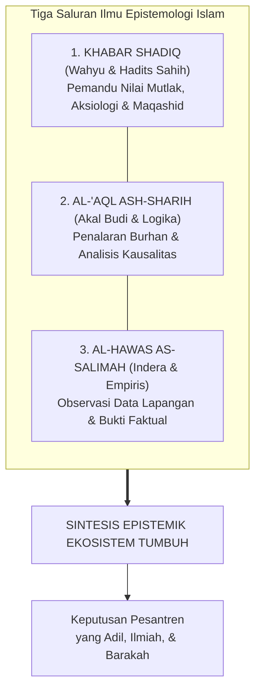
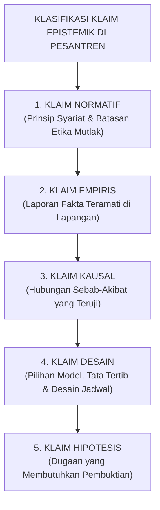
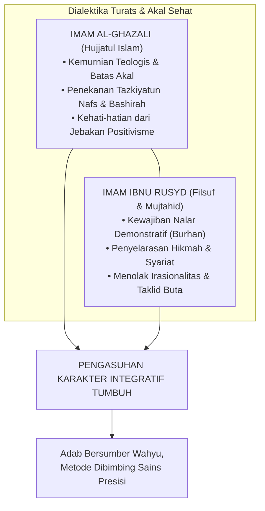
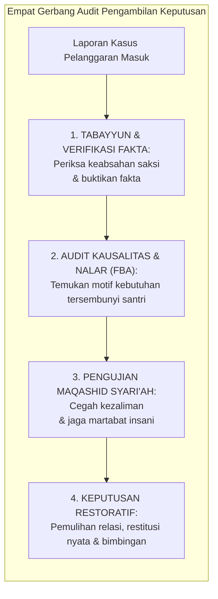
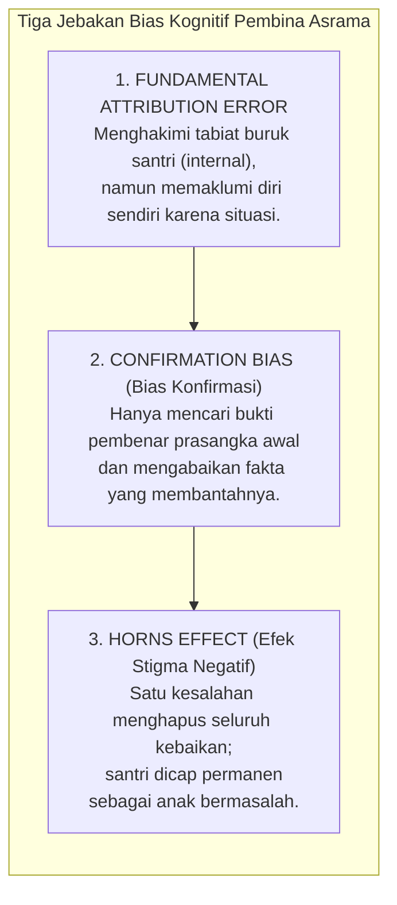

# BAB 3: EPISTEMOLOGI TERPADU: WAHYU, NALAR, DAN FAKTA EMPIRIS
## Menegakkan Keadilan Berpikir, Validitas Bukti, dan Adab Keilmuan di Pesantren 24 Jam

> يَا أَيُّهَا الَّذِينَ آمَنُوا إِنْ جَاءَكُمْ فَاسِقٌ بِنَبَإٍ فَتَبَيَّنُوا أَنْ تُصِيبُوا قَوْمًا بِجَهَالَةٍ فَتُصْبِحُوا عَلَىٰ مَا فَعَلْتُمْ نَادِمِينَ
>
> *"Wahai orang-orang yang beriman! Jika seseorang yang fasik datang kepadamu membawa suatu berita, maka bertabayunlah (telitilah kebenarannya secara seksama), agar kamu tidak mencelakakan suatu kaum karena kebodohan (kecerobohan tanpa bukti), yang akhirnya kamu menyesali perbuatanmu itu."*  
> — **Al-Qur'an al-Karim**, Surah Al-Hujurat [49]: 6[^1]

---

Imam Al-Hafizh Ibnu Katsir dalam *Tafsir al-Qur'an al-'Azhim* menegaskan bahwa ayat ini memerintahkan orang-orang beriman untuk melakukan *at-tatsabbut* (verifikasi cermat) terhadap berita yang dibawa oleh seseorang, agar tidak menjatuhkan hukuman atau keputusan yang menzalimi suatu kaum karena ketidaktahuan (*bi jahalah*), yang akhirnya membuahkan penyesalan abadi.[^1] 

Imam Al-Qurthubi dalam *Al-Jami' li Ahkam al-Qur'an* menambahkan bahwa ayat ini adalah dalil ushul paling agung mengenai haramnya berpegang pada persangkaan tanpa verifikasi (*tark al-amal bi azh-zhann al-mujarrad*) dalam urusan kehormatan manusia dan penetapan sanksi.[^2]

### 3.1 Tragedi Fitnah di Ruang Asrama: Mengapa Epistemologi Menentukan Nasib Santri?

Di sebuah asrama santri putra, jarum jam dinding menunjukkan pukul 21.45. Suasana yang semestinya tenang menjelang jam istirahat malam seketika pecah oleh kegaduhan di Kamar 3. Seorang santri kelas delapan menangis histeris mendapati uang saku bulanannya yang disimpan di dalam saku baju koko di lemari telah raib. Dalam hitungan menit, desas-desus merebak cepat ke seluruh lorong kamar. Beberapa santri senior berbisik bahwa mereka tadi sore melihat Santri R berjalan tergesa-gesa di dekat lemari korban. 

Tanpa melakukan penyelidikan yang tertib, musyrif kamar yang terpancing emosi segera menyeret Santri R ke ruang kantor pengasuhan. Di bawah sorot lampu neon yang dingin, tuduhan langsung dihujamkan: *"Santri-santri lain melihat kamu berkeliaran di dekat lemari korban sore tadi! Ngaku saja! Kalau kamu tidak mau jujur, malam ini kamu tidur di lantai pos satpam!"* Santri R gemetar ketakutan, menangis bersumpah demi Allah bahwa ia hanya sedang mengambil sajadahnya sendiri yang tertinggal di gantungan. Namun, musyrif tersebut bersikukuh pada praduganya: *"Firasat saya tidak pernah salah. Wajahmu tampak cemas, itu tanda orang berdosa!"*

Tiga hari kemudian, fakta sesungguhnya terungkap: uang saku tersebut ternyata terselip di bawah lipatan kasur pemiliknya sendiri yang lupa telah memindahkannya. 

Namun, kerusakan jiwa telah terlanjur terjadi. Santri R selama tiga hari telah menanggung aib yang tak terperikan, dicap sebagai "pencuri" oleh kawan-kawan sekamarnya, dikucilkan saat jam makan, dan mengalami trauma batin yang menghancurkan kepercayaan dirinya terhadap para pendidik.

Kisah memilukan di atas bukanlah anomali langka; ini adalah potret nyata dari **Krisis Epistemik (*Epistemic Injustice*)** yang kerap menimpa dunia pengasuhan pesantren.

Banyak pendidik dan pengurus pondok tidak menyadari bahwa **Epistemologi bukanlah teori filsafat yang mandul**. Epistemologi adalah ilmu tentang: *Bagaimana kita tahu apa yang kita tahu? Atas dasar apa kita mempercayai sebuah informasi? Dan seberapa sah sebuah bukti dijadikan dasar untuk mengambil keputusan yang menyangkut nasib dan kehormatan seorang manusia?*

Ketika seorang pengasuh mengambil keputusan hanya berdasarkan "kabar burung", "firasat subjektif", atau "pengakuan santri di bawah ancaman siksaan", pengasuh tersebut sesungguhnya sedang melakukan kezaliman epistemik yang diharamkan oleh syariat. Al-Qur'an mengecam keras orang-orang yang membangun vonis di atas persangkaan tanpa bukti:

> إِن يَتَّبِعُونَ إِلَّا الظَّنَّ وَمَا تَهْوَى الْأَنفُسُ ۖ وَلَقَدْ جَاءَهُم مِّن رَّبِّهِمُ الْهُدَىٰ
>
> *"Mereka tidak lain hanyalah mengikuti persangkaan belaka (zhann) dan apa yang diingini oleh hawa nafsu mereka, padahal sungguh telah datang petunjuk dari Rabb mereka."*  
> (QS. An-Najm [53]: 23)[^3]

Syaikh Abdurrahman bin Nashir As-Sa'di dalam *Taisir al-Karim ar-Rahman* menjelaskan bahwa ayat ini menelanjangi dua penyakit perusak kebenaran: pertama, mengikuti dugaan semu (*azh-zhann*) yang kosong dari bukti faktual; dan kedua, memperturutkan hawa nafsu (*hawa an-nafs*) yang condong pada kemarahan dan selera pribadi.[^4] Ketika dua penyakit ini menyusup ke dalam ruang pengasuhan, seorang pembina dapat dengan mudah meremukkan masa depan santri semata-mata atas nama firasat palsu.

Dalam ekosistem **TUMBUH**, keadilan berpikir (*epistemic justice*) dan kejujuran metodologis diletakkan sebagai pilar adab yang agung. Tidak boleh ada satu pun vonis disiplin, tidak boleh ada satu pun pelabelan karakter santri, dan tidak boleh ada satu pun program kurikulum baru yang diluncurkan tanpa melewati pertanggungjawaban epistemik yang shahih.

---

### 3.2 Tiga Saluran Ilmu dalam Tradisi Islam: Integrasi Wahyu, Nalar, dan Indera

Peradaban Barat modern terperangkap ke dalam dikotomi epistemik yang tajam: antara **Rasionalisme** yang mendewakan akal murni dan menolak realitas spiritual, serta **Empirisme/Positivisme** yang menolak segala bentuk kebenaran kecuali yang dapat ditimbang dan diukur di laboratorium materi. Di sisi lain, sebagian masyarakat tradisional terjatuh ke dalam **Mistisisme Irasional**: mempercayai mimpi, firasat liar, dan takhayul tanpa pernah mengujinya dengan akal sehat dan dalil syariat.

Epistemologi Islam yang diwariskan oleh para ulama mu'tabar—seperti Imam Abu Hamid Al-Ghazali, Imam Fakhruddin Ar-Razi, dan Prof. Syed Muhammad Naquib al-Attas—menolak seluruh bentuk kepincangan tersebut[^5]. 

Islam memandang bahwa manusia dikaruniai **tiga saluran ilmu yang saling menyempurnakan (*The Integrated Channels of Knowledge*)**:



#### 1. Al-Khabar ash-Shadiq (Wahyu Ilahi dan As-Sunnah yang Shahih)
Wahyu (*Tanzil*) adalah sumber kebenaran tertinggi yang bersifat mutlak, ma'shum, dan melampaui keterbatasan ruang dan waktu. Wahyu memberikan jawaban atas pertanyaan-pertanyaan yang tidak mampu dijangkau oleh akal dan laboratorium: *Untuk apa manusia diciptakan? Apa yang terjadi setelah kematian? Dan apa batas-batas moral yang tidak boleh dilanggar dalam memperlakukan sesama hamba Allah?*

Wahyu memberikan **kompas arah nilai (*normative direction*)** dan **pagar etika (*ethical boundaries*)**. Wahyu menetapkan bahwa memukul santri secara zalim adalah haram, mempermalukan anak di depan umum adalah dosa, dan menjaga kehormatan anak adalah wajib. Pagar etika wahyu ini bersifat mutlak; ia tidak boleh digusur dengan alasan "demi efisiensi administrasi" atau "kebiasaan masa lalu".

#### 2. Al-'Aql ash-Sharih (Akal Budi Lurus dan Nalar Demonstratif)
Akal adalah anugerah cahaya Ilahi (*nurul 'aql*) yang disematkan ke dalam jiwa manusia untuk menimbang argumen, memahami keteraturan alam, dan membedakan antara yang benar (*haqq*) dan yang batil. Para ulama ushul fiqh membedakan akal dari sekadar angan-angan nafsu. Akal yang lurus bekerja melalui kaidah-kaidah logika yang tertib (*burhan*) dan penalaran analogis (*qiyas*).

Akal bertugas menerjemahkan petunjuk wahyu yang bersifat universal ke dalam arsitektur sistem yang terstruktur: menyusun jenjang kurikulum, merancang indikator perkembangan, dan memetakan alur intervensi perilaku di asrama. Akal menguji apakah sebuah kebijakan pengasuhan memiliki koherensi logis atau justru mengandung kontradiksi internal yang membingungkan santri.

#### 3. Al-Hawas as-Salimah (Indera yang Sehat dan Pengamatan Empiris)
Indera lahiriah—penglihatan, pendengaran, perabaan—yang dipadukan dengan metode observasi ilmiah (*tajribah*) adalah instrumen manusia untuk membaca ayat-ayat kauniyyah Allah di alam semesta. Dari saluran inilah lahir sains kedokteran, neurobiologi perkembangan, psikologi perilaku, dan data statistik asrama.

Pengamatan empiris bertugas memberi tahu kita tentang **kenyataan faktual di lapangan (*reality on the ground*)**: Berapa rata-rata jam tidur santri di asrama? Jam berapa kasus perkelahian paling sering meledak? Makanan apa yang disajikan di dapur pondok dan bagaimana kandungan gizinya? Bagaimana pola pernapasan santri saat ia mengalami serangan panik?

#### Prinsip Integrasi Epistemik TUMBUH
Ketiga saluran ini tidak boleh dipertentangkan, melainkan harus bekerja secara harmonis:

> **Wahyu menetapkan ARAH dan BATASAN NILAI yang suci;  
> Akal merancang ARSITEKTUR dan STRUKTUR SISTEM yang runtut;  
> Fakta Empiris menguji EFEKTIVITAS dan KETEPATAN METODE di lapangan.**

Jika sebuah program pembinaan di pesantren dirancang dengan niat yang sangat mulia (sesuai arah wahyu), namun setelah dievaluasi secara empiris ternyata membuat santri sakit-sakitan atau membenci agamanya, maka yang salah bukanlah agamanya, melainkan desain metode penerapannya di lapangan. Pendidik TUMBUH tidak boleh keras kepala mempertahankan metode yang terbukti gagal secara empiris hanya dengan dalih "yang penting niatnya ikhlas".

---

### 3.3 Anatomi Bahasa: Membedah Lima Jenis Klaim di Lingkungan Pesantren

Salah satu sumber kerancuan terbesar dalam rapat-rapat pengasuhan dan perumusan kurikulum pesantren adalah **ketidakmampuan membedakan jenis klaim (*epistemic claim classification*)**. Ketika sebuah opini pribadi disamakan statusnya dengan ayat Al-Qur'an, atau ketika data awal yang masih rapuh langsung diyakini sebagai hukum kepastian, maka lahirlah kebijakan-kebijakan yang serampangan.

Dalam arsitektur TUMBUH, setiap kalimat yang terucap di asrama dan tercatat dalam buku panduan wajib diklasifikasikan ke dalam **Lima Derajat Klaim Epistemik**[^4]:



Mari kita bedah secara gamblang contoh konkret kelima jenis klaim ini di lingkungan asrama:

#### 1. Klaim Normatif (Normative Claim)
* **Bunyi Kalimat**: *"Setiap santri memiliki kemuliaan fitrah dan haram dipukul atau dipermalukan harga dirinya di depan umum."*
* **Status Epistemik**: Pernyataan nilai yang bersumber dari wahyu syariat dan prinsip dasar etika Islam.
* **Beban Pembuktian**: Pembuktiannya merujuk pada nash Al-Qur'an (QS. Al-Isra': 70), hadits larangan memukul wajah, serta prinsip Maqashid Syari'ah (*hifzh an-nafs* dan *hifzh al-'irdh*).
* **Konsekuensi**: Mengikat secara mutlak. Tidak dapat dibatalkan oleh suara mayoritas rapat atau alasan pragmatis kepraktisan pengurus.

#### 2. Klaim Empiris (Empirical Claim)
* **Bunyi Kalimat**: *"Di Gedung Asrama Abu Bakar, angka santri yang terlambat salat subuh menurun dari 18 orang menjadi 4 orang dalam tempo satu bulan terakhir."*
* **Status Epistemik**: Pelaporan data faktual yang terjadi di alam nyata.
* **Beban Pembuktian**: Verifikasi buku logbook absensi subuh musyrif, rekaman kehadiran fisik, dan memastikan tidak ada rekayasa pencatatan angka laporan. Klaim ini bisa benar atau salah secara faktual.

#### 3. Klaim Kausal (Causal Claim)
* **Bunyi Kalimat**: *"Penurunan angka keterlambatan santri subuh disebabkan secara langsung oleh dimajukannya jam padam lampu asrama menjadi pukul 21.30."*
* **Status Epistemik**: Menghubungkan dua peristiwa dalam relasi sebab-akibat (*causality*).
* **Beban Pembuktian**: Sangat berat. Pengasuh harus membuktikan secara metodologis bahwa penurunan keterlambatan itu benar-benar murni akibat jam tidur lebih awal, bukan karena adanya faktor perancu (*confounding variables*) lain—seperti pergantian musyrif baru yang lebih galak atau adanya ancaman sanksi tambahan.

#### 4. Klaim Desain (Design Claim)
* **Bunyi Kalimat**: *"TUMBUH menetapkan struktur pembinaan santri ke dalam 4 Jenjang Kemandirian (J1–J4) dengan sesi mentoring pekanan kelompok kecil berisi 8 santri."*
* **Status Epistemik**: Pilihan teknis arsitektur sistem buatan manusia untuk memfasilitasi pertumbuhan karakter.
* **Beban Pembuktian**: Uji kelayakan logika dan keselarasan dengan kapasitas perkembangan remaja. Klaim desain ini **bukan wahyu suci yang kaku**; angka 8 santri per kelompok dapat disesuaikan menjadi 6 atau 10 jika evaluasi lapangan menunjukkan perlunya modifikasi manajerial.

#### 5. Klaim Hipotesis (Hypothetical Claim)
* **Bunyi Kalimat**: *"Kami menduga bahwa santri yang sering menyendiri di sudut kantin saat jam istirahat mengalami gejala perundungan terselubung oleh teman sekamarnya."*
* **Status Epistemik**: Dugaan awal yang logis sebagai pintu pembuka bagi penyelidikan terencana.
* **Beban Pembuktian**: Menjadi landasan bagi guru BK atau musyrif untuk melakukan observasi terarah dan wawancara empati. Dilarang keras menjadikan klaim hipotesis sebagai dasar pemberian vonis atau pelabelan (*labeling*) santri sebelum pembuktian tuntas.

---

### 3.4 Kejujuran Menyatakan Derajat Kepastian: Menghancurkan Dogmatisme Mutlak

Salah satu ciri kemunduran peradaban ilmu adalah merebaknya **Dogmatisme Semu (False Absolutism)**—kebiasaan berbicara dengan nada serba mutlak, serba yakin seratus persen, padahal dasar pijakannya sangat rapuh. Di lingkungan pesantren, sering kita dengar kalimat gegabah semacam: *"Pasti anak ini yang mencuri!"*, *"Metode kami sudah terbukti seratus persen paling ampuh di seluruh dunia!"*, atau *"Santri yang tidak ikut metode ini pasti gagal!"*

TUMBUH mengharamkan kesombongan intelektual semacam itu. Para ulama salaf yang paling alim sekalipun selalu mengakhiri fatwanya dengan kalimat penuh tawadhu': *Allahu A'lam bish-Shawab* (Allah yang lebih mengetahui kebenaran yang sesungguhnya). Bahkan Imam Malik bin Anas, sang imam Darul Hijrah, dari empat puluh delapan pertanyaan yang diajukan kepadanya, menjawab tiga puluh dua di antaranya dengan kalimat: *"La Adri"* (Aku belum tahu)[^6].

Ketika seorang murid bertanya: *"Tidakkah engkau malu menjawab 'tidak tahu' padahal orang-orang datang dari jauh menemuimu?"* Imam Malik menjawab dengan tegas: *"Katakan kepada orang-orang di kampungmu bahwa Malik tidak tahu!"*

Mengakui keterbatasan data bukanlah tanda kelemahan; mengakui keterbatasan adalah puncak dari **Integritas Intelektual (*Al-Inshaf*)**.

Di dalam seluruh laporan resmi, jurnal pengasuhan, dan panduan operasional TUMBUH, dibakukan **Lima Diksi Penanda Derajat Kepastian (*Epistemic Certainty Indicators*)**:

| Derajat Kepastian | Diksi Resmi TUMBUH | Kapan Digunakan di Pesantren? |
| :--- | :--- | :--- |
| **Pasti / Aksiomatik** | **Ditetapkan (*Stipulated*)** | Digunakan khusus untuk ketetapan nash wahyu shahih yang *qath'i*, prinsip syariat mutlak, serta definisi aksioma arsitektur sistem yang telah disepakati bersama. |
| **Kuat / Meyakinkan** | **Didukung Kuat (*Strongly Supported*)** | Digunakan ketika sebuah temuan didukung oleh data triangulasi yang konsisten (misal: laporan observasi tiga musyrif berbeda, bukti fisik rekaman, dan pengakuan sadar tanpa paksaan). |
| **Cenderung / Indikatif** | **Mengindikasikan (*Indicates*)** | Digunakan ketika data awal menunjukkan arah tren tertentu, namun jumlah sampel santri masih terbatas dan masih membutuhkan audit lanjutan. |
| **Dugaan Logis** | **Diduga Sementara (*Hypothesized*)** | Digunakan untuk penjelasan logis awal atas sebuah fenomena perilaku santri yang secara sadar diakui masih dalam tahap verifikasi di lapangan. |
| **Belum Terbukti** | **Belum Cukup Diketahui (*Inconclusive / Unknown*)** | Digunakan secara ksatria ketika data dan bukti yang dihimpun belum memadai untuk menarik kesimpulan yang bertanggung jawab. |

Musyrif dan pimpinan yang menggunakan diksi-diksi ini menunjukkan kedewasaan berpikir tingkat tinggi. Mereka tidak mudah menghakimi anak orang lain, tidak tergesa-gesa menyebarkan praduga, dan senantiasa menjaga keadilan dalam berbicara.

---

### 3.5 Harmonisasi Turats dan Sains Perilaku: Belajar dari Dialektika Al-Ghazali dan Ibnu Rusyd

Salah satu jebakan terbesar yang membelah dunia pendidikan Islam kontemporer adalah perpecahan biner yang sempit:
* Di satu kubu, terdapat kalangan puritan-tekstualis yang alergi terhadap segala bentuk sains modern: menolak ilmu psikologi perkembangan, menolak konseling kesehatan mental, dan menolak manajemen organisasi modern karena dianggap "produk sekuler barat yang merusak akidah".
* Di kubu lain, terdapat kalangan modernis-kompleks rendah diri (*inferiority complex*) yang memandang kitab-kitab turats klasik telah usang, lalu menelan mentah-mentah seluruh teori psikologi Barat sekuler tanpa filter syariat, hingga melenyapkan dimensi ruh dan akhirat dari jiwa santri.

TUMBUH berdiri di atas jalan tengah peradaban yang mulia (*wasathiyyah tamadduniyyah*): **Menghubungkan Hikmah Turats dengan Presisi Sains Modern**.

Tradisi keilmuan ini memiliki akar sejarah yang panjang dan berbobot. Dua raksasa pemikir Islam terbesar, **Hujjatul Islam Abu Hamid Al-Ghazali** (w. 505 H) dan **Qadhi Abu al-Walid Ibnu Rusyd** (w. 595 H), terlibat dalam dialektika keilmuan yang paling monumental dalam sejarah filsafat peradaban manusia:



Dalam kitabnya *Tahafut al-Falasifah*, Imam Al-Ghazali membongkar kepongahan kaum filosof materialis yang mencoba mendefinisikan seluruh rahasia ketuhanan semata-mata dengan nalar spekulatif yang rapuh. Al-Ghazali menegaskan batas wilayah akal manusia dan membuka pintu bagi **penyucian jiwa (*tazkiyatun nafs*) dan kepekaan kalbu (*bashirah*)** sebagai saluran tertinggi untuk menangkap kebenaran sejati[^7].

Satu abad kemudian, Imam Ibnu Rusyd hadir dengan karyanya *Fashl al-Maqal fima bayna al-Hikmah wa asy-Syari'ah min al-Ittishal* dan *Tahafut at-Tahafut*. Beliau menegaskan bahwa penalaran rasional demonstratif (*al-burhan al-'aqli*) dan penelitian mendalam atas hukum alam (*sunnatullah*) bukanlah ancaman bagi syariat, melainkan sebuah **kewajiban keagamaan** yang diperintahkan langsung oleh Al-Qur'an (QS. Al-Hasyr [59]: 2: *"Fa'tabiruu yaa ulil abshaar"* — *Maka ambillah pelajaran, wahai orang-orang yang memiliki pandangan nalar!*)[^8]. Ibnu Rusyd membuktikan bahwa kebenaran wahyu yang shahih (*al-haqq*) tidak akan pernah bertentangan dengan kebenaran akal murni dan fakta alam yang terbukti (*al-haqq la yudhaddu al-haqq, bal yuwafiquhu wa yasyhadu lahu*).

Dari perjumpaan pemikiran kedua ulama ini, TUMBUH menarik kaidah operasional bagi pengasuhan pesantren:
1. **Mengambil Metode Terbaik Tanpa Kehilangan Arah Syariat**:  
   Kita tidak perlu ragu memanfaatkan instrumen psikologi modern—seperti *Functional Behavior Assessment* (FBA), *Polyvagal Theory*, atau *Positive Behavioral Interventions and Supports* (PBIS)—selama instrumen tersebut terbukti secara ilmiah membantu kita memahami mekanisme saraf santri dan tidak bertentangan dengan adab Islam. Sains perilaku modern adalah hikmah yang tercecer milik orang beriman; di mana pun ia menemukannya, ia berhak mengambilnya.
2. **Menolak Reduksionisme Teknokratis Angka**:  
   Sekalipun TUMBUH menggunakan dasbor digital, grafik perkembangan santri, dan analisis data, kita menolak keras anggapan bahwa manusia dapat diselesaikan hanya dengan angka-angka algoritma. Data angka dapat memberitahukan bahwa santri A mengalami penurunan skor konsentrasi 40%. Namun untuk menyembuhkan lukanya, tetap dibutuhkan seorang musyrif yang menatap matanya dengan penuh cinta, mendoakannya di sujud malam, dan menyentuh hatinya dengan kalimat hikmah Ilahiyah.

---

### 3.6 Tata Kelola Epistemik Sistem TUMBUH: Protokol Pengambilan Keputusan Anti-Kezaliman

Bagaimanakah seluruh prinsip epistemologi ini dioperasionalkan agar tidak menjadi teori hampa di atas kertas?

Arsitektur TUMBUH mengkodifikasikan prinsip-prinsip ini ke dalam **Rantai Akuntabilitas Keputusan (*The Epistemic Decision Chain*)**:



Setiap kali terjadi kasus pelanggaran berat di asrama yang menuntut tindakan tegas, pengurus dan musyrif wajib mengisi **Protokol Verifikasi Epistemik** sebelum mengetuk palu keputusan:

1. **Uji Sumber (*Source Verification*)**:  
   Siapa yang pertama kali menyampaikan informasi ini? Apakah saksi mata melihat langsung kejadian tersebut dengan mata kepalanya sendiri, ataukah sekadar mendengar dari desas-desus orang lain? Apakah saksi memiliki konflik kepentingan pribadi dengan santri yang dituduh?
2. **Uji Instrumen dan Metode (*Methodological Audit*)**:  
   Bagaimana bukti dihimpun? Apakah santri diinterogasi dalam keadaan ketakutan di bawah ancaman bentakan (yang secara neurobiologis membuat anak terpaksa mengaku bohong demi selamat), ataukah dalam suasana tenang yang memungkinkan nalar nuraninya berbicara jujur?
3. **Uji Kausalitas (*Causal Attribution*)**:  
   Apakah tindakan santri tersebut merupakan kesengajaan murni yang terencana (*'amd*), kekeliruan tanpa sengaja (*khatha'*), ataukah reaksi keterpaksaan di bawah intimidasi santri lain?
4. **Uji Maqashid Syari'ah (*Safeguarding Test*)**:  
   Apakah konsekuensi yang akan diberikan berpotensi melanggar hak perlindungan raga (*hifzh an-nafs*) atau meremukkan kehormatan nama baik santri (*hifzh al-'irdh*)? Jika ya, maka bentuk konsekuensi tersebut **wajib dibatalkan seketika dan diganti dengan restitusi yang mendidik**.

---

### 3.7 Bedah Bias Kognitif Pembina: Tiga Jebakan Pikiran yang Merusak Keadilan Asrama

Bahkan seorang musyrif atau ustadz yang paling saleh sekalipun dapat terjatuh ke dalam ketidakadilan epistemik jika tidak menyadari cara kerja otak manusia yang rentan terhadap **Bias Kognitif (*Cognitive Biases*)**.

Psikologi kognitif dan ilmu keperilakuan mengidentifikasi tiga bias utama yang paling sering melahirkan kezaliman di lingkungan pesantren 24 jam:



#### 1. Kesalahan Atribusi Mendasar (*Fundamental Attribution Error*)
Ketika seorang santri terlambat bangun salat subuh, pembina dengan cepat menyimpulkan: *"Anak ini pemalas, tidak punya disiplin, dan hatinya keras!"* Pembina mengaitkan kegagalan santri semata-mata dengan faktor watak internal (*dispositional attribution*). Namun ketika pembina itu sendiri suatu hari bangun kesiangan, ia membela dirinya: *"Semalam saya kelelahan karena harus merekap absensi hingga larut malam, ditambah alarm kamar saya mati."* Pembina mengaitkan kegagalan dirinya dengan faktor situasi lingkungan (*situational attribution*).

TUMBUH mewajibkan setiap pendidik untuk menerapkan kaidah husnuzhan epistemik: **Sebelum menghakimi watak internal santri, periksalah terlebih dahulu beban situasi dan lingkungan yang sedang menimpanya.**

#### 2. Bias Konfirmasi (*Confirmation Bias*)
Ketika seorang musyrif sudah terlanjur memiliki prasangka buruk kepada seorang santri (misalnya Santri Fikri), mata musyrif tersebut secara selektif hanya akan memperhatikan saat Fikri bercanda atau mengantuk di kelas, sembari berbisik: *"Tuh kan, memang Fikri tidak pernah niat belajar!"* Namun di saat yang sama, musyrif tersebut buta terhadap kenyataan bahwa Fikri tadi malam membantu merapikan seprai ranjang kawannya yang sakit. Otak pembina secara otomatis menyaring bukti-bukti yang tidak sesuai dengan prasangkanya.

#### 3. Efek Tanduk dan Pelabelan Permanen (*The Horns Effect & Labeling*)
Sekali seorang santri pernah melakukan pelanggaran berat (misalnya mencuri sandal atau merokok), cap "santri bermasalah" melekat laksana tato permanen di dahinya. Setiap kali ada sandal hilang atau ada bau asap rokok di kamar mandi, nama dialah yang pertama kali diseret dan diinterogasi. Pelabelan permanen ini secara neurobiologis membunuh harapan anak untuk berubah dan mendorongnya masuk ke dalam ramalan yang terwujud dengan sendirinya (*Self-Fulfilling Prophecy*): *"Toh semua ustadz menganggapku penjahat, jadi buat apa aku bersikap baik?"*

TUMBUH menetapkan aturan ketat: **Setiap hari adalah lembaran putih baru bagi fitrah santri**. Sanksi yang telah diselesaikan dengan restitusi nyata wajib menghapus seluruh catatan noda di mata sosial para pengasuh.

---

### 3.8 Logbook Epistemik Pembina: Standar Triangulasi Bukti Sebelum Putusan Disiplin

Untuk mengeliminasi bias personal dan memastikan setiap keputusan disiplin berdiri di atas landasan yang shahih, tim pengasuhan TUMBUH mengoperasionalkan **Format Logbook Epistemik Triangulasi**[^9]:

```text
               LEMBAR AUDIT VERIFIKASI EPISTEMIK KASUS SANTRI
┌───────────────────────────────────────────────────────────────────────────┐
│ NAMA SANTRI   : .......................   KAMAR/ASRAMA : ................ │
│ TANGGAL/WAKTU : .......................   MUSYRIF AUDITOR: .............. │
├───────────────────────────────────────────────────────────────────────────┤
│ 1. DESKRIPSI PERILAKU TERAMATI (FAKTUAL & OBJEKTIF - BUKAN LABEL MORAL):  │
│    [Tuliskan apa yang terlihat dan terdengar secara konkret tanpa asumsi] │
│    Contoh: "Santri melempar buku catatan ke lantai dan keluar kelas       │
│    pukul 09.15 WIB." (BUKAN: "Santri bersikap kurang ajar dan sombong")   │
├───────────────────────────────────────────────────────────────────────────┤
│ 2. TRIANGULASI SUMBER BUKTI (MINIMAL 3 TITIK PEMERIKSAAN):                │
│    [ ] Sumber 1: Kesaksian Pengamatan Langsung Pembina (Bukan desas-desus)│
│    [ ] Sumber 2: Rekaman Fakta Fisik / Log Absensi / Cek Lingkungan       │
│    [ ] Sumber 3: Konfirmasi Tertutup dari Santri yang Bersangkutan (Aman) │
├───────────────────────────────────────────────────────────────────────────┤
│ 3. UJI DERAJAT KEPASTIAN KLAIM:                                           │
│    [ ] Didukung Kuat (Strongly Supported) -> Dapat Diproses               │
│    [ ] Masih Dugaan Hipotesis (Hypothesized) -> WAJIB TABAYYUN LANJUTAN   │
├───────────────────────────────────────────────────────────────────────────┤
│ 4. AUDIT ANTESEDEN LINGKUNGAN (APA PEMICU SEBELUM INSIDEN?):              │
│    - Apakah santri tidur minimal 7 jam semalam? ......................... │
│    - Apakah ada provokasi / perundungan dari kawan sekamar? ............. │
│    - Apakah ada kabar duka dari keluarga kandung? ....................... │
├───────────────────────────────────────────────────────────────────────────┤
│ 5. REKOMENDASI EDUKATIF-RESTORATIF (RESTITUSI MEMPERBAIKI KERUSAKAN):     │
│    ...................................................................... │
└───────────────────────────────────────────────────────────────────────────┘
```

Dengan tata kelola epistemik yang ketat ini, pesantren terlindungi dari dosa kezaliman institusional. Tidak ada lagi santri yang menjadi korban fitnah asrama; tidak ada lagi air mata keputusasaan anak yang dihukum atas dosa yang tidak pernah ia lakukan.

Dari kebeningan epistemologi ini, kita kini memiliki alat berpikir yang adil dan tajam. Pertanyaan berikutnya menanti kita: *Siapakah sesungguhnya hakikat anak manusia yang sedang kita bimbing ini? Bagaimanakah susunan anatomi jiwa fitrahnya—antara Ruh, Qalb, 'Aql, dan Nafs—bergerak di dalam tubuh biologisnya?*

Inilah yang akan kita jelajahi secara mendalam dalam **Bab 4: Antropologi Jiwa Santri: Hakikat Fitrah dan Komponen Kejiwaan**.

---

### Catatan Kaki & Rujukan Akademik

[^1]: Al-Qur'an al-Karim, Surah Al-Hujurat [49]: 6; Ibnu Katsir, *Tafsir al-Qur'an al-'Azhim*, Jilid VII, hlm. 370–372.
[^2]: Abu Abdillah Muhammad bin Ahmad Al-Qurthubi, *Al-Jami' li Ahkam al-Qur'an*, Jilid XVI, hlm. 310–314.
[^3]: Al-Qur'an al-Karim, Surah An-Najm [53]: 23.
[^4]: Abdurrahman bin Nashir As-Sa'di, *Taisir al-Karim ar-Rahman fi Tafsir Kalam al-Mannan* (Beirut: Mu'assasah ar-Risalah, 2000), hlm. 819.
[^5]: Abu Hamid Muhammad bin Muhammad Al-Ghazali, *Al-Mustashfa min 'Ilm al-Ushul*, Tahqiq: Dr. Hamzah bin Zuhair Hafizh (Madinah: Syarikah al-Madinah al-Munawwarah, 1993), Jilid I, hlm. 35–48; Syed Muhammad Naquib al-Attas, *The Epistemology of Islam: A Definition and Framework* (Kuala Lumpur: ISTAC, 1990).
[^6]: Abu Umar Yusuf bin Abdil Barr An-Namari Al-Qurthubi, *Jami' Bayan al-'Ilm wa Fadhlihi*, Tahqiq: Abul Asybal Az-Zuhairi (Riyadh: Dar Ibn al-Jauzi, 1994), Jilid II, hlm. 838–842, riwayat no. 1582.
[^7]: Abu Hamid Muhammad bin Muhammad Al-Ghazali, *Tahafut al-Falasifah*, diedit oleh Sulaiman Dunya (Kairo: Dar al-Ma'arif, 1972), hlm. 72–89; Abu Hamid Al-Ghazali, *Al-Munqidz min adh-Dhalal*, diedit oleh Dr. Abdul Halim Mahmud (Kairo: Dar al-Kutub al-Haditsah, 1968), hlm. 45–60.
[^8]: Abu al-Walid Muhammad bin Ahmad bin Rusyd (Averroes), *Fashl al-Maqal fima bayna al-Hikmah wa asy-Syari'ah min al-Ittishal*, diedit oleh Dr. Muhammad 'Imarah (Kairo: Dar al-Ma'arif, 1983), hlm. 28–42; George F. Hourani, *Averroes on the Harmony of Religion and Philosophy* (London: Luzac & Co., 1961).
[^9]: Repositori TUMBUH v2.0.0, Dokumen Fundamental: `01_FUNDAMENTAL/01_PHILOSOPHY/02_EPISTEMOLOGY/05-Jenis-dan-Tingkat-Klaim.md` dan `08-Implikasi-Epistemology-bagi-TUMBUH.md`.
