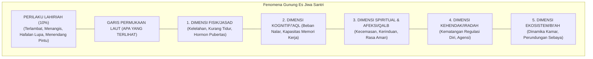
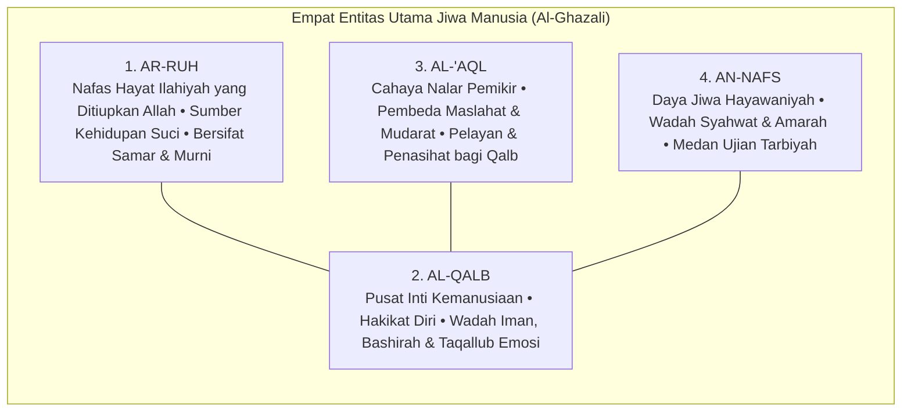
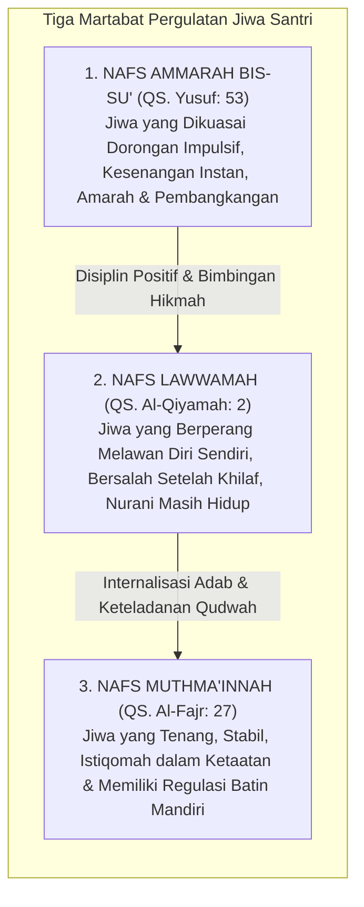
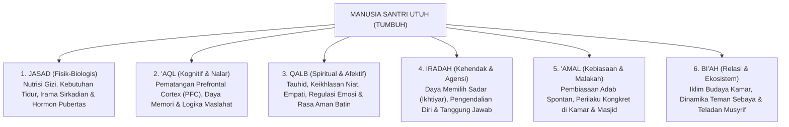
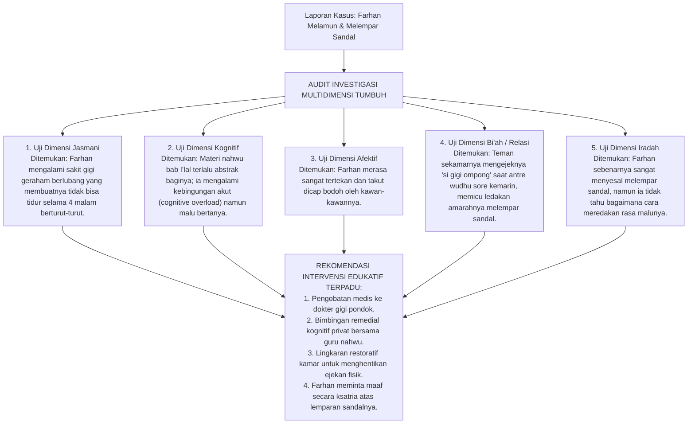
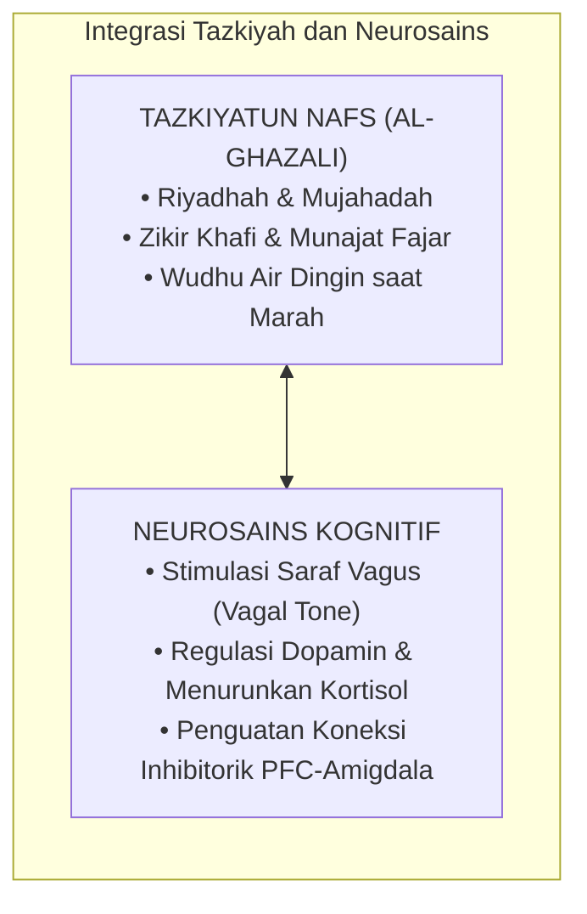

# BAB 4: ANTROPOLOGI JIWA SANTRI: HAKIKAT FITRAH DAN KOMPONEN KEJIWAAN
## Membedah Anatomi Ruh, Qalb, 'Aql, dan Nafs dalam Dinamika Remaja Pesantren 24 Jam

> أَلَا وَإِنَّ فِي الْجَسَدِ مُضْغَةً، إِذَا صَلَحَتْ صَلَحَ الْجَسَدُ كُلُّهُ، وَإِذَا فَسَدَتْ فَسَدَ الْجَسَدُ كُلُّهُ، أَلَا وَهِيَ الْقَلْبُ
>
> *"Ingatlah! Sesungguhnya di dalam tubuh manusia ada segumpal daging; apabila ia baik, maka baiklah seluruh tubuh itu, dan apabila ia rusak, maka rusaklah seluruh tubuh itu. Ingatlah, segumpal daging itu adalah Al-Qalb (Kalbu)!"*  
> — **Rasulullah ﷺ**, riwayat An-Nu'man bin Basyir رضي الله عنه[^1]

---

### 4.1 Menembus Pucuk Gunung Es: Bahaya Reduksionisme Perilaku di Asrama

Salah satu kekeliruan metodologis yang paling merusak dalam dunia pendidikan kepesantrenan adalah **Reduksionisme Perilaku (*Behavioral Reductionism*)**—yakni kecenderungan gegabah dari para pembina untuk menyamakan sepotong perilaku lahiriah yang tampak sesaat di permukaan mata dengan keseluruhan hakikat jati diri seorang anak manusia.

Mari kita tatap sebuah skenario yang terjadi hampir setiap hari di lorong asrama:
Seorang santri berusia lima belas tahun bernama Salman, pada hari Senin pagi, datang terlambat ke halaqah tahfizh. Ia duduk di saf belakang dengan seragam kusut, mata memerah, dan pandangan kosong. Ketika gilirannya tiba untuk menyetorkan hafalan surah yang telah ditugaskan sejak tiga hari lalu, Salman terdiam mematung. Ayat-ayat yang semestinya mengalir dari bibirnya menguap tak bersisa. Ia terbata-bata pada ayat kedua, lalu menundukkan kepalanya dalam-dalam.

Perhatikan bagaimana dua paradigma pengasuhan yang berbeda merespons Salman:

#### Pendekatan Reduksionis yang Menghakimi
Musyrif halaqah yang berpikiran sempit segera melontarkan vonis: *"Salman, kamu ini santri pemalas! Tiga hari kamu diberi waktu, tapi tidak ada satu halaman pun yang masuk ke otakmu! Dasar anak pembangkang, tidak menghargai lelah orang tuamu yang membayar SPP! Berdiri di samping tiang masjid sampai jam istirahat!"*

Musyrif tersebut hanya melihat **pucuk gunung es**: ia melihat hafalan yang belum lancar, lalu melompat pada kesimpulan moral bahwa Salman adalah anak yang jahat dan berhati kotor.

#### Pendekatan Antropologi Jiwa TUMBUH
Pendidik yang memiliki pemahaman utuh tentang hakikat manusia tidak akan pernah melompat pada penghakiman dangkal semacam itu. Ia memahami hukum semesta jiwa: **Perilaku lahiriah (*zhahir*) hanyalah sepuluh persen puncak gunung es yang menyembul di atas permukaan samudra. Sembilan puluh persen sisanya adalah struktur dimensi manusia yang saling bertaut di bawah permukaan:**

Ketika ditelusuri secara bijak oleh tim pengasuhan TUMBUH, fakta sesungguhnya di bawah permukaan Salman terungkap:
* Dua malam sebelumnya, ibu Salman dilarikan ke rumah sakit di kampung halamannya karena stroke mendadak. Kabar itu sampai ke telinga Salman lewat telepon singkat wali kelas pada hari Sabtu sore.
* Sepanjang malam Minggu dan malam Senin, hati Salman (*qalb*) dilanda badai kecemasan dan kesedihan yang mencekam. Ia menangis diam-diam di bawah selimutnya saat kawan-kawannya terlelap.
* Karena tidak bisa tidur nyenyak selama dua malam berturut-turut, fisik biologisnya (*jasad*) mengalami kelelahan saraf akut.
* Akibat badai kecemasan dan kekurangan tidur tersebut, hormon kortisol membanjiri otaknya, mematikan fungsi memori kerja (*'aql*) di hipokampusnya, sehingga hafalan yang sebenarnya sudah ia kuasai pada hari Jumat hilang seketika dari ingatannya.

Salman tidak sedang membangkang; jiwanya sedang menjerit meminta pertolongan!

Ketika seorang pembina menghukum anak seperti Salman dengan bentakan dan penghinaan di depan teman-temannya, pembina tersebut sesungguhnya sedang menaburkan garam ke atas luka jiwa anak yang sedang hancur. Ini adalah kezaliman pedagogis yang diakibatkan oleh kebutaan terhadap antropologi manusia.

---

### 4.2 Anatomi Jiwa dalam Khazanah Turats: Memahami Ruh, Qalb, 'Aql, dan Nafs

Di manakah letak keunggulan tradisi Islam dalam membedah jiwa manusia dibanding teori psikologi sekuler modern?

Psikologi Barat sekuler—yang berakar pada materialisme—mereduksi manusia semata-mata sebagai organisme biologis yang dikendalikan oleh impuls saraf dan kimiawi hormon. Jiwa dianggap tidak lebih dari sekadar aktivitas elektrokimiawi di dalam otak (*mind is merely brain*). Akibatnya, dimensi ketuhanan, sakralitas niat, dan kehidupan akhirat dihapuskan dari diskursus terapi kepribadian.

Sebaliknya, khazanah intelektual Islam yang diwariskan oleh **Hujjatul Islam Abu Hamid Al-Ghazali** dalam *Ihya' Ulumiddin* (khususnya *Kitab Syarh 'Aja'ib al-Qalb*) memberikan peta anatomi jiwa yang sangat komprehensif, presisi, dan berlapis-lapis[^2]:

Mari kita bedah hakikat dan fungsi masing-masing komponen ini dalam kaitannya dengan pembinaan santri:

#### 1. Ar-Ruh (Hembusan Hayat Ilahiyah)
Ruh adalah rahasia ketuhanan (*amrun min amri Rabbi*, QS. Al-Isra': 85) yang ditiupkan Allah ke dalam janin manusia. Ruh adalah sumber kehidupan hakiki yang menjadikan manusia makhluk berkesadaran spiritual. Ruh senantiasa merindukan kesucian, membenci kezaliman, dan condong kepada Dzat Yang Menciptakannya. Di dalam diri setiap santri—bahkan yang paling sering melanggar sekalipun—ruh suci ini tetap ada; ia tidak pernah mati, melainkan hanya tertutupi oleh kabut tebal hawa nafsu.

#### 2. Al-Qalb (Poros Pengendali Kemanusiaan)
Imam Al-Ghazali menegaskan bahwa lafal *Al-Qalb* memiliki dua makna:
* **Makna Fisik-Organik**: Segumpal daging berbentuk kerucut di rongga dada sebelah kiri yang memompa darah ke seluruh tubuh.
* **Makna Hakiki-Spiritual (*Lathifah Rabbaniyyah Ruhaniyyah*)**: Inti terdalam kemanusiaan (*the spiritual subtle organ*), tempat bersemayamnya keimanan, niat, keikhlasan, rasa cinta, empati, dan pandangan mata batin (*bashirah*). Qalb inilah yang sesungguhnya diajak bicara oleh wahyu, yang dituntut bertanggung jawab di akhirat, dan yang menjadi raja atas seluruh anggota tubuh manusia.

Al-Qalb dinamai demikian karena sifatnya yang dinamis dan mudah berbolak-balik (*taqallub*). Pagi hari seorang santri bisa merasa sangat bersemangat beribadah, namun sore hari hatinya bisa dirundung kesedihan atau tergelincir godaan kemalasan. Tugas pengasuhan asrama adalah menghadirkan lingkungan (*bi'ah*) yang menjaga kemantapan hati santri agar senantiasa condong kepada kebaikan (*tsabatul qalb*).

#### 3. Al-'Aql (Cahaya Nalar dan Penimbang Nilai)
Akal adalah anugerah cahaya kognitif yang memampukan santri memahami teks wahyu, merenungkan akibat jangka panjang dari tindakannya, dan menimbang maslahat serta mudarat. Akal adalah penasihat setia bagi kalbu. Jika akal santri dilatih berpikir kritis dan merenungi ayat-ayat Allah, akal akan menjadi panglima yang menuntun raga memilih jalan ketakwaan. Namun jika akal dibiarkan tumpul dan dipaksa tunduk pada doktrin kepatuhan buta, akal akan kehilangan fungsinya sebagai benteng moral.

#### 4. An-Nafs (Wadah Gejolak Hayawaniyah)
Dalam terminologi tasawuf, *An-Nafs* adalah komponen kejiwaan yang menghimpun daya syahwat (hasrat biologis pada makanan, tidur, perhiasan duniawi) dan daya amarah (*ghadhab*—dorongan agresivitas dan pertahanan diri). Nafs adalah kendaraan raga di bumi; nafs tidak diciptakan untuk dimatikan atau dibunuh, melainkan untuk **ditundukkan dan disucikan (*tazkiyah*)** di bawah bimbingan akal dan kalbu.

---

### 4.3 Tiga Martabat Jiwa Remaja dalam Al-Qur'an

Al-Qur'an al-Karim mengabarkan bahwa pergulatan antara kalbu, akal, dan nafs melahirkan **tiga tingkatan dinamika kejiwaan (*Ahwal an-Nafs*)** yang dialami oleh setiap manusia, khususnya para remaja santri di asrama[^3]:

#### 1. Nafs Ammarah bis-Su' (Dorongan Primitif dan Impulsif)
$$\text{وَمَا أُبَرِّئُ نَفْسِي ۚ إِنَّ النَّفْسَ لَأَمَّارَةٌ بِالسُّوءِ إِلَّا مَا رَحِمَ رَبِّي}$$
> *"Dan aku tidak menyatakan diriku bebas dari kesalahan, karena sesungguhnya nafsu itu selalu mendorong kepada kejahatan, kecuali nafsu yang diberi rahmat oleh Rabb-ku..."* (QS. Yusuf [12]: 53)[^4]

Ini adalah kondisi kejiwaan dasar ketika dorongan biologis purba dan hawa nafsu menguasai kendali diri. Pada santri remaja, *nafs ammarah* termanifestasi dalam perilaku impulsif: ingin menang sendiri saat antre mandi, menyembunyikan makanan teman, berbohong demi menghindari tugas piket, atau melampiaskan amarah dengan memukul. Jika santri berada pada tahap ini, menghujamnya dengan hukuman yang menghinakan justru akan mengobarkan api amarahnya dan membuatnya semakin membangkang.

#### 2. Nafs Lawwamah (Gejolak Nurani dan Penyesalan Suci)
$$\text{وَلَا أُقْسِمُ بِالنَّفْسِ اللَّوَّامَةِ}$$
> *"Dan Aku bersumpah demi jiwa yang selalu menyesali (mencela) dirinya sendiri!"* (QS. Al-Qiyamah [75]: 2)[^5]

Allah ﷻ bersumpah dengan agung atas kemuliaan *Nafs Lawwamah*! Ini adalah tingkatan jiwa yang sangat istimewa pada usia remaja. Santri pada tahap ini mungkin saja tergelincir melakukan kesalahan adab karena godaan sesaat; namun begitu perbuatan itu selesai, dadanya terasa sesak, nuraninya bergetar mencela dirinya sendiri, dan ia diliputi oleh rasa penyesalan mendalam: *"Mengapa tadi aku membentak temanku? Ya Allah, ampuni dosaku..."*

Para pengasuh pesantren wajib menyadari: **Hadirnya rasa bersalah dan penyesalan pada diri seorang santri adalah bukti tak terbantahkan bahwa fitrah kebaikannya masih menyala terang!** 

Tugas pendidik saat santri berada dalam fase *lawwamah* bukanlah mempermalukannya di depan umum, melainkan merangkulnya dengan penuh kasih sayang, mengarahkannya untuk bertaubat (*taubat nasuha*), dan membimbingnya melakukan **restitusi nyata (memperbaiki kesalahan)**.

#### 3. Nafs Muthma'innah (Puncak Kedamaian dan Keteguhan Adab)
$$\text{يَا أَيَّتُهَا النَّفْسُ الْمُطْمَئِنَّةُ ۝ ارْجِعِي إِلَىٰ رَبِّكِ رَاضِيَةً مَّرْضِيَّةً}$$
> *"Wahai jiwa yang tenang! Kembalilah kepada Rabb-mu dengan hati yang rida dan diridai-Nya..."* (QS. Al-Fajr [89]: 27–28)[^6]

Inilah derajat kematangan tertinggi (*ar-rusyd*): jiwa yang telah mencapai ketenteraman mendalam (*thuma'ninah*). Gejolak syahwat dan amarah telah berhasil dijinakkan oleh cahaya iman dan nalar akal budi. Santri yang telah mencapai derajat ini beribadah dengan penuh kenikmatan batin, beradab luhur secara spontan (*malakah*), dan tetap teguh memegang nilai-nilai kebaikan sekalipun berada sendirian tanpa ada pengawasan musyrif.

---

### 4.4 Enam Dimensi Keutuhan Manusia dalam Arsitektur TUMBUH

Menolak reduksionisme perilaku, sistem TUMBUH memandang santri melalui **Lensa Enam Dimensi Holistik (*The Six Dimensions of Human Wholeness*)**[^7]:

Mari kita urai keterkaitan dinamis keenam dimensi ini dalam kehidupan asrama 24 jam:

#### 1. Dimensi Jasmani (*Al-Jasad*)
Santri adalah makhluk berjasad fisik yang membutuhkan nutrisi halal dan bergizi seimbang, hidrasi air minum yang cukup, udara kamar yang bersih berventilasi, serta istirahat tidur yang cukup. Pada usia 12–18 tahun, tubuh remaja mengalami lonjakan hormon pertumbuhan (*growth spurt*) dan lonjakan hormon seks (testosteron dan estrogen) yang sangat masif. Mengabaikan keletihan fisik santri dan memaksakan beban hafalan di luar batas biologisnya adalah kezaliman terhadap hak tubuh (*Inna li jasidika 'alayka haqqan*).

#### 2. Dimensi Kognitif (*Al-'Aql*)
Pada fase remaja, bagian otak depan (*Prefrontal Cortex / PFC*) masih berada dalam fase konstruksi pematangan sinapsis (*pruning and myelination*). Neurosains membuktikan bahwa **sistem limbik (pusat dorongan emosi dan pencarian sensasi) matang jauh lebih awal dibandingkan PFC (pusat kendali rem impuls)**[^8]. Ketimpangan perkembangan ini menjelaskan mengapa santri remaja kerap bersikap nekat, berani mengambil risiko, dan mudah terhasut oleh teman sebaya. Santri bukan berniat jahat; rem biologis di otaknya memang belum sepenuhnya terpasang sempurna, sehingga ia mutlak membutuhkan bimbingan pendampingan eksternal (*scaffolding*) dari para pembina.

#### 3. Dimensi Spiritual dan Afektif (*Al-Qalb*)
Kebutuhan jiwa terdalam santri adalah **rasa aman (*psychological safety*)** dan **rasa diterima (*belonging*)**. Santri yang baru meninggalkan rumah orang tuanya kerap mengalami *homesickness* dan kecemasan terisolasi. Jika kebutuhan afektif ini diabaikan, kalbunya akan terkunci dalam mekanisme pertahanan diri, menjadikannya rentan memberontak atau depresi.

#### 4. Dimensi Kehendak dan Agensi (*Al-Iradah / Agency*)
Santri bukanlah robot yang perilakunya cukup dikendalikan oleh remote kontrol pengurus. Allah menciptakan manusia dengan daya memilih sadar (**Al-Ikhtiyar**). Disiplin sejati lahir ketika kehendak santri telah terlatih untuk memilih kebaikan atas dorongan tanggung jawab pribadi, bukan karena takut dipukul.

#### 5. Dimensi Amal dan Pembiasaan Karakter (*Al-'Amal wa Al-Malakah*)
Ibnu Miskawaih dalam *Tahdzib al-Akhlaq* dan Ibnu Khaldun dalam *Muqaddimah* menjelaskan bahwa karakter luhur (*al-khuluq al-hasan*) adalah **Al-Malakah**—yakni sifat kejiwaan yang tertanam kokoh sehingga perbuatan baik mengalir darinya secara spontan dan mudah tanpa perlu berpikir berat atau merasa terbebani[^9]. Malakah tidak lahir dari hafalan teori di kelas; malakah lahir dari amal kebajikan yang dipraktikkan secara konsisten berulang-ulang di asrama dalam atmosfer yang membahagiakan.

#### 6. Dimensi Relasi Sosial dan Lingkungan (*Al-Bi'ah*)
Santri tidak bertumbuh di ruang hampa. Iklim pergaulan di kamar asrama, kehangatan senyuman musyrif, serta budaya saling menghargai antarsantri (*Bi'ah Shalihah*) adalah rahim peradaban tempat karakter bersemi. Sehebat apa pun materi pengajian di kelas, jika kultur di lorong asrama sarat dengan caci maki dan perundungan, maka kultur asramalah yang akan memenangkan pembentukan karakter santri.

---

### 4.5 Studi Kasus Investigasi Multidimensi di Pesantren

Agar pemahaman antropologi ini menjadi panduan praktis bagi para pendidik, perhatikan bagaimana analisis multidimensi TUMBUH diterapkan pada kasus riil di bawah ini:

* **Laporan Masalah**: Santri Farhan (14 tahun, kelas 8) dilaporkan oleh musyrif kamar karena dalam sepekan terakhir sering melamun saat pengajian kitab kuning, tidak mengerjakan tugas terjemahan, dan kemarin sore melempar sandal ke arah teman sekamarnya hingga memicu pertengkaran.

Bandingkan hasil di atas dengan metode penghukuman konvensional!
Jika kasus Farhan ditangani dengan cara lama: Farhan akan diseret ke depan umum, dicaci sebagai santri malas dan pembuat onar, lalu dihukum push-up 50 kali di lapangan. 
* *Akibatnya*: Gigi Farhan tetap sakit dan infeksi, materi nahwunya tetap tidak paham, ejekan teman sekamarnya semakin menjadi-jadi, dan dendam batinnya meledak menjadi kebencian kepada pesantren.

Dengan pendekatan antropologi multidimensi TUMBUH: sakit fisik Farhan disembuhkan, kebingungan kognitifnya diatasi dengan pendampingan belajar, perundungan di kamarnya dihentikan secara restoratif, dan martabat dirinya sebagai santri diselamatkan.

---

### 4.6 Tazkiyatun Nafs Klasik dan Regulasi Sistem Saraf: Jembatan Turats dan Neurosains

Bagaimanakah tradisi tasawuf klasik para ulama mu'tabar memandang proses penyembuhan jiwa yang sedang terluka atau tergelincir syahwat?

Imam Al-Ghazali dalam *Ihya' 'Ulum ad-Din* meletakkan dua pilar utama penyucian jiwa:
1. **Al-Mujahadah**: Berperang melawan dorongan hawa nafsu destruktif dengan cara meninggalkan kebiasaan buruk secara sadar dan mematahkan pemicunya (*qath'u asbab asy-syahwat*).
2. **Ar-Riyadhah**: Pelatihan pembiasaan jiwa melalui pembebanan amal-amal kebajikan yang berlawanan (*'ilaj al-illati bi dhiddiha*), seperti melatih jiwa yang sombong dengan tugas membersihkan sandal jamaah masjid, atau melatih lisan yang kasar dengan memperbanyak zikir istighfar dan diam bertafakur.

Secara menakjubkan, apa yang dirumuskan Al-Ghazali sebagai *riyadhatun nafs* berkorespondensi satu-satu dengan temuan neurosains modern tentang **Regulasi Saraf Otonom (*Autonomic Nervous System Regulation*)** dan **Plastisitas Sinaptik**:

Ketika seorang santri diajarkan berwudhu dengan membasuh air dingin ke wajah saat dadanya mendidih oleh amarah, secara neurobiologis suhu dingin memicu **Mammalian Dive Reflex** yang seketika mengaktifkan saraf parasimpatis, menurunkan detak jantung (*down-regulation*), dan meredam lonjakan adrenalin di amigdala.

Demikian pula ketika santri diajak duduk tafakur melantunkan wirid zikir dengan tarikan napas panjang dan lambat: aktivitas tersebut meningkatkan variabilitas detak jantung (*Heart Rate Variability / HRV*), membanjiri otak dengan hormon oksitosin dan serotonin, serta memulihkan kapasitas neokorteks untuk berpikir jernih. Tazkiyatun nafs bukanlah mistisisme irasional; tazkiyatun nafs adalah sains penyelarasan fitrah ruhani dan biologi raga yang sempurna.

---

### 4.7 Protokol Deteksi Dini Kesehatan Jiwa dan Ruhani Santri Asrama

Dalam ekosistem asrama 24 jam, para musyrif dan wali asrama dilatih untuk memiliki radar kepekaan (*bashirah pengasuhan*) guna mendeteksi santri-santri yang jiwanya sedang mengalami krisis sebelum meledak menjadi pelanggaran terbuka:

| Kategori Tanda Bahaya | Gejala Teramati pada Santri (*Observable Indicators*) | Akar Kebutuhan Jiwa Tersembunyi | Tindakan Pertama Musyrif TUMBUH |
| :--- | :--- | :--- | :--- |
| **Penarikan Diri Ekstrem (*Social Withdrawal*)** | Santri mengurung diri di ranjang dengan tirai tertutup; tidak mau makan di ruang bersama; menolak berbicara saat disapa. | Mengalami *homesickness* berat, depresi terselubung, atau korban intimidasi geng sekamar. | Musyrif mendekati secara privat; menawarkan air hangat; mendengarkan tanpa menasihati; merujuk ke BK. |
| **Agresivitas Mendadak (*Sudden Aggression*)** | Santri yang biasanya pendiam tiba-tiba membanting pintu, berteriak saat ditegur, atau menendang lemari. | Sistem saraf mengalami *hyperarousal shutdown* akibat akumulasi beban tugas atau rasa terhina. | Berikan ruang tenang (*cooling-off*); jauhkan dari kerumunan; tunggu denyut jantung stabil sebelum dialog. |
| **Kemunduran Somatik (*Psychosomatic Complaints*)** | Sering mengeluh sakit perut, mual saat jam halaqah, pusing kepala menjelang ujian tanpa bukti medis infeksi. | Manifestasi fisik dari kecemasan akut (*severe performance anxiety*) terhadap target hafalan. | Audit target hafalan bersama guru tahfidz; pecah target menjadi porsi kecil (*chunking*); redakan kecemasan. |
| **Penurunan Higienitas Drastis (*Self-Neglect*)** | Berhari-hari tidak mengganti baju; tempat tidur sangat berantakan; tidak mandi berulang kali. | Kehilangan gairah hidup (*apathy*) dan kelelahan mental mendalam (*depressive symptoms*). | Dampingi merapikan tempat tidur bersama musyrif dengan penuh kasih sayang; evaluasi asupan gizi dan tidur. |

---

### 4.8 Dari Hakikat Insan Menuju Praksis Tarbiyah

Kita telah menuntaskan penjelajahan agung dalam **Bagian II**:
* Dalam **Bab 3**, kita telah menegakkan keadilan berpikir dan epistemologi terpadu antara wahyu, nalar, dan fakta empiris.
* Dalam **Bab 4**, kita telah membedah kedalaman jiwa santri: melampaui pucuk gunung es perilaku menuju keutuhan enam dimensi jasmani, kognitif, afektif, kehendak, amal, dan ekosistem.

Kini, pertanyaan terbesar dalam peradaban pendidikan kepesantrenan membentang di hadapan kita:
> **Jika manusia santri memiliki kedalaman jiwa dan dinamika perkembangan seperti itu, bagaimanakah cara kita mendidik, menuntun, dan mentransformasi karakternya secara berkelanjutan tanpa merusak fitrahnya?**
> **Bagaimanakah ilmu neurosains mutakhir berpadu dengan konsep Ta'dib para ulama salaf dalam merancang ekosistem keteladanan (Qudwah Hasanah) 24 jam?**

Inilah cakrawala baru yang akan kita bedah secara tuntas dalam **BAGIAN III: FALSAFAH TARBIYAH, PERKEMBANGAN, & KEPEMIMPINAN QUDWAH**.

---

### Catatan Kaki & Rujukan Akademik

[^1]: Abu Abdillah Muhammad bin Ismail Al-Bukhari, *Shahih al-Bukhari*, Kitab al-Iman, Bab Fadhl Man Istabra'a li Dinihi, hadits no. 52; Muslim bin al-Hajjaj an-Naisaburi, *Shahih Muslim*, Kitab al-Musaqah, Bab Akhdz al-Halal wa Tark asy-Syubuhat, hadits no. 1599.
[^2]: Abu Hamid Muhammad bin Muhammad Al-Ghazali, *Ihya' 'Ulum ad-Din* (Kairo: Dar al-Hadits, 2004), Jilid III, *Kitab Syarh 'Aja'ib al-Qalb*, hlm. 3–18.
[^3]: Ibnu Qayyim al-Jauziyyah, *Ighatsat al-Lahfan min Masha'id asy-Syaithan*, Tahqiq: Muhammad Hamid al-Fiqi (Beirut: Dar al-Ma'rifah, 1975), Jilid I, hlm. 74–85; Ibnu Qayyim al-Jauziyyah, *Ar-Ruh* (Beirut: Dar al-Kutub al-'Ilmiyyah, 1975), hlm. 210–235.
[^4]: Al-Qur'an al-Karim, Surah Yusuf [12]: 53.
[^5]: Al-Qur'an al-Karim, Surah Al-Qiyamah [75]: 2.
[^6]: Al-Qur'an al-Karim, Surah Al-Fajr [89]: 27–28.
[^7]: Repositori TUMBUH v2.0.0, Dokumen Fundamental: `01_FUNDAMENTAL/01_PHILOSOPHY/03_HUMAN_NATURE/02-Dimensi-dan-Struktur-Manusia.md` dan `03-Akal-Hati-Kehendak-dan-Agency.md`.
[^8]: Laurence Steinberg, *Age of Opportunity: Lessons from the New Science of Adolescence* (Boston: Mariner Books, 2015), hlm. 65–94; B.J. Casey, Rebecca M. Jones, & Todd A. Hare, "The Adolescent Brain", *Annals of the New York Academy of Sciences*, Vol. 1124 (2008), hlm. 111–126.
[^9]: Abu Ali Ahmad bin Muhammad Miskawaih, *Tahdzib al-Akhlaq wa Tath-hir al-A'raq*, Tahqiq: Dr. Imad al-Hilali (Beirut: Dar al-Kutub al-'Ilmiyyah, 2011), hlm. 35–42; Abdurrahman Ibnu Khaldun, *Al-Muqaddimah* (Damaskus: Dar Ya'rub, 2004), Jilid II, hlm. 298–305 mengenai pembentukan malakah melalui latihan berulang (*al-irtiyadh*).
