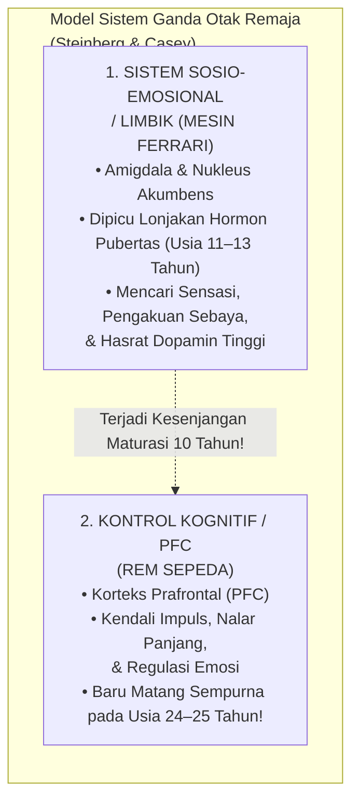
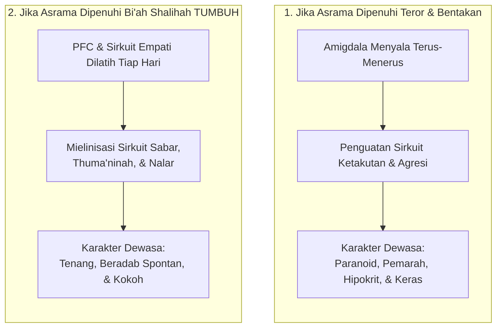

# BAB 5: DINAMIKA PERKEMBANGAN JIWA DAN NEUROSAINS REMAJA
## Memahami Gejolak Maturasi Prefrontal Cortex, Sistem Limbik, dan Plastisitas Adab Santri

> *"Ketahuilah bahwa masa muda (as-syabab) adalah salah satu cabang dari kegilaan (syu'batun min al-junun), karena darah kemudaan yang mendidih mendorong jiwa untuk menerjang hawa nafsu tanpa memedulikan akibatnya, kecuali bagi mereka yang dianugerahi pemeliharaan dan taufik oleh Allah Ta'ala."*  
> — **Al-Imam Ibnu Qayyim al-Jauziyyah**, *Raudhatul Muhibbin wa Nuzhatul Musytaqin*[^1]

---

### 5.1 Paradoks Remaja Asrama: Mesin Balap Ferrari dengan Rem Sepeda

Setiap tahun ajaran baru tiba di pesantren, ribuan anak berusia antara dua belas hingga lima belas tahun melangkahkan kaki melewati pintu gerbang asrama. Di hadapan para asatidz, berdirilah sosok-sosok santri yang secara fisik tampak telah beranjak dewasa: suara mereka mulai memberat, kumis tipis mulai tumbuh di atas bibir mereka, dan tinggi badan mereka bahkan kerap melampaui tinggi tubuh para pembina mereka.

Namun, di balik perawakan fisik yang tampak gagah tersebut, sebuah misteri perilaku harian kerap membuat para musyrif mengurut dada karena kehabisan kesabaran:
* Mengapa seorang santri yang secara fasih mampu menghafal bab *Jinayat* di kelas syariat, pada sore harinya dengan santai melompat dari lantai dua asrama ke atas tumpukan kasur hanya demi membuat kawan-kawannya tertawa?
* Mengapa santri yang begitu sopan saat berbicara berdua dengan guru, seketika berubah menjadi sosok yang bising, nekat, dan melanggar jam malam saat berada di tengah kelompok teman sebayanya?
* Mengapa teguran yang diucapkan berulang kali seolah-olah "masuk telinga kanan dan keluar telinga kiri" tanpa membekas menjadi tindakan nyata?

Kekecewaan para pembina asrama kerap meledak dalam kalimat makian yang menyudutkan: *"Kamu ini badannya saja yang sudah sebesar raksasa, kumis sudah tumbuh, tapi kelakuan dan otakmu masih seperti anak balita!"*

Kemarahan semacam ini lahir dari **kebutaan biologis terhadap hakikat perkembangan saraf remaja (*adolescent brain development*)**.

Para ilmuwan neurosains kognitif terkemuka dunia, seperti Prof. Laurence Steinberg dan Dr. B.J. Casey, merumuskan sebuah analogi yang sangat presisi untuk menggambarkan kondisi biologis otak remaja usia santri: **Remaja adalah sebuah mobil balap berkecepatan tinggi dengan mesin Ferrari bertenaga monster, namun rem yang terpasang pada rodanya hanyalah rem sepeda ontel yang rapuh (*a car with a Ferrari engine but bicycle brakes*)**[^2].

Secara sunnatullah penciptaan biologis:
1. **Mesin Penggerak Emosi (Sistem Limbik)** yang memicu pencarian sensasi (*novelty seeking*), dorongan keberanian mengambil risiko (*risk-taking behavior*), dan kebutuhan mendesak untuk diakui oleh kelompok teman sebaya (*peer approval*) melonjak sangat cepat begitu santri memasuki masa pubertas (usia 11–13 tahun).
2. Sebaliknya, **Sistem Pengereman Moral (Prefrontal Cortex / PFC)** yang bertugas mengendalikan hawa nafsu, menahan amarah, dan memikirkan konsekuensi jangka panjang dari sebuah perbuatan berjalan dengan sangat lambat. PFC adalah organ terakhir dalam tubuh manusia yang mengalami pematangan biologis sempurna, yakni baru tuntas pada usia **dua puluh empat hingga dua puluh lima tahun**[^3].

Kesenjangan biologis (*developmental mismatch*) selama hampir satu dekade inilah yang menjelaskan mengapa santri remaja sangat rentan tergelincir melakukan tindakan ceroboh. Mereka melompat dari balkon bukan karena mereka berwatak kriminal atau berniat jahat; mereka melompat karena amigdala dan nukleus akumbens mereka sedang dibanjiri hormon dopamin yang menuntut sensasi kegembiraan instan, sementara rem PFC mereka belum cukup kuat untuk membisikkan: *"Jangan lakukan itu, tulang kakimu bisa patah!"*

Dalam ekosistem **TUMBUH**, para asatidz dan musyrif disadarkan akan peran sakral mereka: **Para pendidik adalah Prefrontal Cortex Eksternal (*External PFC*) bagi santri-santrinya**. Karena rem biologis di dalam kepala santri belum terpasang sempurna, maka kehadiran musyriflah yang berfungsi sebagai rem pengaman: menuntun dengan ketegasan yang tenang, memasang batas-batas lingkungan yang aman, dan mendampingi proses latihan pengendalian diri santri dengan penuh kesabaran hikmah.

---

### 5.2 Plastisitas Saraf dan Jendela Emas Usia Pesantren: Mengukir di Atas Batu

Rasulullah ﷺ menyampaikan sebuah perumpamaan agung yang telah berusia empat belas abad, namun maknanya semakin berkilau di bawah sorotan mikroskop sains modern:

$$\text{مَثَلُ الَّذِي يَتَعَلَّمُ فِي صِغَرِهِ كَالنَّقْشِ عَلَى الْحَجَرِ، وَمَثَلُ الَّذِي يَتَعَلَّمُ فِي كِبَرِهِ كَالَّذِي يَكْتُبُ عَلَى الْمَاءِ}$$

> *"Perumpamaan orang yang belajar di masa mudanya adalah laksana mengukir di atas batu karang, sedangkan perumpamaan orang yang belajar di masa tuanya adalah laksana menulis di atas air."*  
> (HR. At-Thabarani dalam *Al-Mu'jam al-Kabir* dan Al-Baihaqi dalam *Syu'abul Iman*)[^4]

Mengapa pembelajaran di masa muda santri diibaratkan laksana **mengukir di atas batu (*an-naqsyi 'ala al-hajar*)**?

Jawabannya terletak pada fenomena biologis yang disebut **Neuroplastisitas Remaja (*Adolescent Neuroplasticity*)** dan **Pemangkasan Sinapsis (*Synaptic Pruning*)**.

Di masa pubertas dan remaja, otak santri sedang mengalami rekonstruksi arsitektural terdahsyat kedua sepanjang hidupnya (setelah masa balita). Otak memproduksi miliaran cabang sinapsis baru, lalu melakukan seleksi alamiah berdasarkan hukum biologi saraf:

$$\text{“Neurons that fire together, wire together; neurons that don't, are pruned away.”}$$

> *"Jaringan sel saraf yang menyala bersama-sama secara berulang akan tersambung secara permanen menjadi sirkuit watak; sementara jaringan sel saraf yang tidak pernah diaktifkan akan dipangkas dan dimatikan oleh otak."*[^5]

Masa santri tinggal di asrama (usia 12 hingga 18 tahun) adalah **Jendela Plastisitas Kritis (*Critical Window of Opportunity*)**:
* Apabila selama enam tahun di asrama, sirkuit saraf yang setiap hari diaktifkan oleh pengasuh adalah **sirkuit amigdala (ketakutan, kecurigaan, dendam, dan kemunafikan akibat bentakan dan hukuman fisik)**, maka otak santri akan mempertebal jalur saraf tersebut dengan selubung lemak mielin (*myelination*). Anak itu kelak akan tumbuh dewasa menjadi pribadi yang paranoid, mudah panik, pemarah, dan memperlakukan anak-buahnya dengan kekejaman yang sama saat ia memimpin kelak.
* Sebaliknya, apabila selama enam tahun di asrama, santri dilatih meregulasi emosinya saat marah, dibimbing menyelesaikan konflik dengan dialog restoratif, diajak bangun malam dengan kehangatan cinta, dan dibiasakan memikirkan maslahat umat, maka otak santri sedang **mengukir sirkuit sabar, empati, dan muraqabatullah di atas batu neokorteksnya**. Sirkuit adab itulah yang akan menjadi watak permanen (*malakah*) yang tidak akan pernah luntur hingga akhir hayatnya.

Maka bergetarlah wahai para pendidik! Setiap perkataan yang kita ucapkan dan setiap perlakuan yang kita berikan kepada santri di lorong asrama bukanlah peristiwa yang hilang ditelan angin; setiap perlakuan itu secara fisik sedang **memahat arsitektur biologis otak generasi penerus umat**.

Setelah kita memahami bahwa santri remaja adalah mobil Ferrari bertenaga monster dengan rem sepeda yang rapuh, pertanyaan mendasar segera mengemuka: *Jika ancaman hukuman dan bentakan terbukti merusak otak mereka, metode pendidikan dan ekosistem seperti apa yang mampu memasang 'rem moral' tersebut ke dalam jiwa mereka? Bagaimana falsafah tarbiyah dan ta'dib para nabi melatih karakter tanpa kekerasan?*

Di Bab 6, kita akan menyingkap rahasia keteladanan qudwah dan bi'ah shalihah dalam falsafah tarbiyah dan ta'dib.

---

### Catatan Kaki & Rujukan Akademik

[^1]: Ibnu Qayyim al-Jauziyyah, *Raudhatul Muhibbin wa Nuzhatul Musytaqin*, diedit oleh Sabir al-Kasyf (Kairo: Dar al-Hadits, 2003), hlm. 182–186.
[^2]: Laurence Steinberg, *Age of Opportunity: Lessons from the New Science of Adolescence* (Boston: Mariner Books, 2015), hlm. 45–72; B.J. Casey, "Beyond Simple Models of Self-Control to Circuit-Based Accounts of Adolescent Behavior", *Annual Review of Psychology*, Vol. 66 (2015), hlm. 295–319.
[^3]: Jay N. Giedd dkk., "Brain Development During Childhood and Adolescence: A Longitudinal MRI Study", *Nature Neuroscience*, Vol. 2, No. 10 (1999), hlm. 861–863; Nitin Gogtay dkk., "Dynamic Mapping of Human Cortical Development during Childhood through Early Adulthood", *Proceedings of the National Academy of Sciences (PNAS)*, Vol. 101, No. 21 (2004), hlm. 8174–8179.
[^4]: Sulaiman bin Ahmad Ath-Thabarani, *Al-Mu'jam al-Kabir* (Kairo: Maktabah Ibn Taimiyyah, 1994), hadits no. 8645; Abu Bakr Ahmad bin Husain Al-Baihaqi, *Syu'abul Iman* (Riyadh: Maktabah ar-Rusyd, 2003), hadits no. 1658 dari Abu Hurairah dan Hasan Al-Bashri secara mursal shahih lighairihi.
[^5]: Carla J. Shatz, "Impulse Activity and the Patterning of Connections during CNS Development", *Neuron*, Vol. 5, No. 6 (1990), hlm. 745–756; Donald O. Hebb, *The Organization of Behavior: A Neuropsychological Theory* (New York: John Wiley & Sons, 1949).
[^6]: Abu Dawud Sulaiman bin al-Asy'ats as-Sijistani, *Sunan Abi Dawud*, Kitab ash-Shalah, hadits no. 495; Ahmad bin Hanbal, *Al-Musnad*, hadits no. 6689.
[^7]: Ibnu Hajar Al-Asqalani, *Fath al-Bari Syarh Shahih al-Bukhari* (Beirut: Dar al-Ma'rifah, 1379 H), Jilid IX, hlm. 345–347; Yahya bin Syaraf An-Nawawi, *Al-Majmu' Syarh al-Muhadzdzab* (Kairo: Idarah ath-Thiba'ah al-Muniriyyah), Jilid III, hlm. 11–13.
[^8]: Robert B. Cairns & Beverley D. Cairns, *Lifelines and Risks: Pathways of Youth in Our Time* (Cambridge: Cambridge University Press, 1994), hlm. 88–115; Esther Thelen & Linda B. Smith, *A Dynamic Systems Approach to the Development of Cognition and Action* (Cambridge: MIT Press, 1994).
[^9]: Richard M. Ryan & Edward L. Deci, *Self-Determination Theory: Basic Psychological Needs in Motivation, Development, and Wellness* (New York: The Guilford Press, 2017), hlm. 80–125; Edward L. Deci & Richard M. Ryan, "The 'What' and 'Why' of Goal Pursuits: Human Needs and the Self-Determination of Behavior", *Psychological Inquiry*, Vol. 11, No. 4 (2000), hlm. 227–268.
[^10]: Abu Hamid Muhammad bin Muhammad Al-Ghazali, *Ihya' 'Ulum ad-Din*, Jilid III, *Kitab Riyadhat an-Nafs wa Tahdzib al-Akhlaq* (Kairo: Dar al-Hadits, 2004), hlm. 62–75; Ibnu Jama'ah, *Tadzkirat as-Sami' wa al-Mutakallim fi Adab al-'Alim wa al-Muta'allim* (Beirut: Dar al-Basyair al-Islamiyyah, 2012), hlm. 48–65.
[^11]: Abu Dawud Sulaiman bin al-Asy'ats as-Sijistani, *Sunan Abi Dawud*, Kitab ash-Shalah, Bab Mata Yu'maru al-Ghulam bi ash-Shalah, hadits no. 495; Ahmad bin Hanbal, *Al-Musnad*, hadits no. 6689, disahihkan oleh Al-Albani dalam *Shahih Abi Dawud*.
[^12]: Abu Zakariya Muhyiddin Yahya bin Syaraf An-Nawawi, *Al-Majmu' Syarh al-Muhadzdzab* (Kairo: Idarah ath-Thiba'ah al-Muniriyyah, 1344 H), Jilid III, hlm. 11–14; Syamsuddin Muhammad bin Abi al-Abbas Ar-Ramli, *Nihayat al-Muhtaj ila Syarh al-Minhaj* (Beirut: Dar al-Fikr, 1984), Jilid I, hlm. 385–388.
[^13]: Mary A. Carskadon dkk., "Adolescent Sleep Patterns, Circadian Timing, and Sleepiness at a Transition to Early School Days", *Sleep*, Vol. 21, No. 8 (1998), hlm. 871–881; Matthew Walker, *Why We Sleep: Unlocking the Power of Sleep and Dreams* (New York: Scribner, 2017), hlm. 87–96 mengenai pergeseran fase sirkadian melatonin 2 jam ke depan pada usia remaja.
