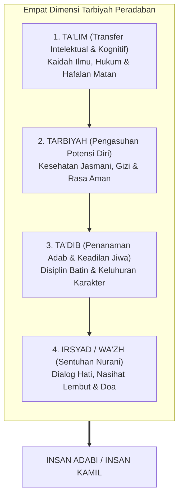
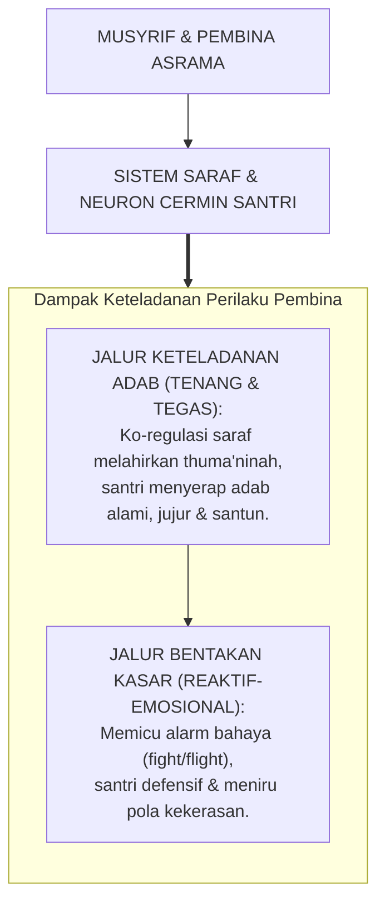
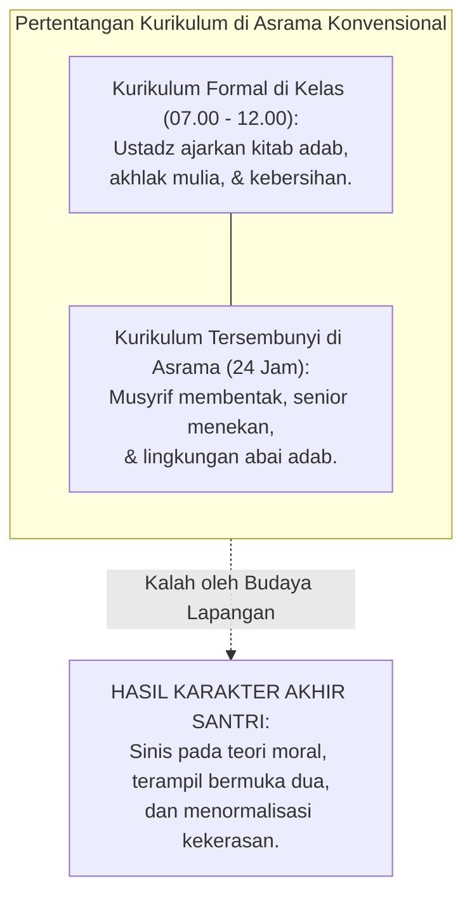
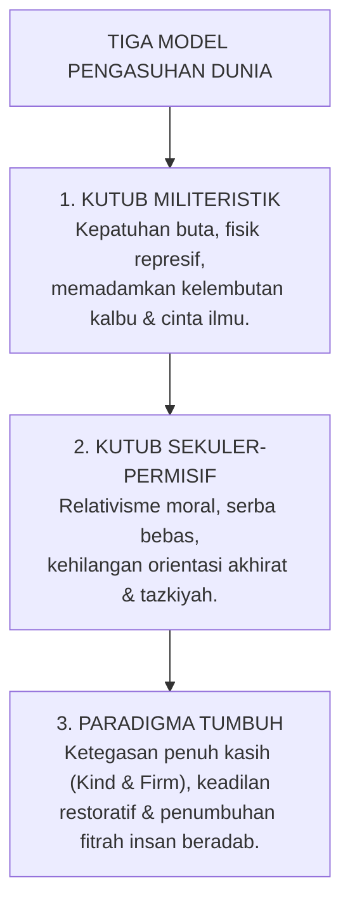

# BAB 6: FALSAFAH TARBIYAH, TA'DIB, DAN EKOSISTEM KETELADANAN
## Menghidupkan Sunnah Qudwah Hasanah dan Mentransformasi Ekologi Pengasuhan Pesantren 24 Jam

> لَقَدْ كَانَ لَكُمْ فِي رَسُولِ اللَّهِ أُسْوَةٌ حَسَنَةٌ لِمَنْ كَانَ يَرْجُو اللَّهَ وَالْيَوْمَ الْآخِرَ وَذَكَرَ اللَّهَ كَثِيرًا
>
> *"Sungguh telah ada pada diri Rasulullah itu suri teladan yang mulia (qudwah hasanah) bagimu, yaitu bagi orang yang mengharap rahmat Allah dan kedatangan hari kiamat serta banyak mengingat Allah."*  
> — **QS. Al-Ahzab [33]: 21**[^1]

---

Al-Hafizh Ibnu Katsir dalam *Tafsir al-Qur'an al-'Azhim* menegaskan bahwa ayat yang mulia ini adalah *ashlun kabir* (fondasi agung yang sangat fundamental) dalam meneladani baginda Rasulullah ﷺ dalam segala ucapan, perbuatan, dan seluruh tingkah laku hidup beliau.[^1] Para pendidik santri tidak berhak menuntut adab dari santri jika pribadi mereka sendiri belum mencerminkan keluhuran teladan nubuwah ini.

### Prolog: Keheningan di Serambi Asrama

Malam telah larut di sebuah pesantren di lereng bukit. Jam dinding di serambi asrama berdentang dua belas kali. Di bilik-bilik asrama yang berderet panjang, dengkur halus anak-anak belia berpadu dengan desau angin pegunungan yang menyusup lewat sela-sela ventilasi kayu. Jika kita melongok ke dalam salah satu bilik tidur, kita akan menyaksikan pemandangan yang menggetarkan nurani: wajah-wajah polos santri usia dua belas dan tiga belas tahun yang terlelap pulas. Sebagian dari mereka memeluk guling erat-erat—mungkin dalam mimpinya mereka sedang memeluk ibunya di kampung halaman yang berjarak ratusan kilometer. Sebagian lainnya tidur dengan kening yang masih tampak berkerut, menanggung keletihan fisik setelah enam belas jam nonstop berjibaku dengan ritme hafalan Al-Qur'an, setoran kaidah nahwu, antrean mandi, dan disiplin yang tak memberi ruang jeda.

Di ujung lorong, seorang musyrif muda berusia dua puluh dua tahun duduk termangu di bawah temaram lampu neon dua puluh watt. Di tangannya tergenggam sebilah rotan tipis yang ujungnya telah menghitam karena sering disabetkan ke pintu tripleks atau paha santri yang terlambat bangun subuh. Sang musyrif menatap rotan itu dengan pandangan hampa. Ada rasa lelah yang luar biasa menghimpit dadanya—bukan semata lelah raga karena kurang tidur, melainkan kelelahan eksistensial batin. Ia bergumam dalam hatinya: 

*"Apakah untuk mencetak seorang insan yang bertakwa kepada Allah, aku harus menjadi monster penakut bagi anak-anak ini? Apakah keluhuran akhlak kenabian yang kuajarkan di siang hari harus kutegakkan dengan ancaman teror dan bentakan di malam hari? Di manakah letak kehangatan dakwah Rasulullah ﷺ yang dahulu mampu memikat hati kaum badui dan melunakkan kekerasan hati para sahabat?"*

Pertanyaan musyrif muda itu adalah jeritan nurani ribuan pendidik di seluruh penjuru negeri. Bab ini hadir untuk menjawab jeritan tersebut: membongkar ilusi bahwa ketertiban lahiriah yang dipaksakan adalah tanda keberhasilan pendidikan, meruntuhkan kebiasaan kekerasan yang dibungkus dalih tradisi, serta menegakkan kembali falsafah agung pendidikan Islam—sebuah ekosistem keteladanan hidup (*qudwah hasanah*), penanaman adab (*ta'dib*), dan cinta kasih yang memerdekakan jiwa manusia dari belenggu kepura-puraan.

---

### 6.1 Menyelami Kedalaman Semantik Pendidikan Islam: Dari Informasi Menuju Keadilan Jiwa

Krisis pendidikan modern—termasuk yang merayap masuk ke dalam pesantren—kerap berakar pada kekacauan pemahaman terhadap istilah-istilah paling mendasar. Ketika sebuah institusi keliru memahami apa yang dimaksud dengan "mendidik", maka seluruh rancangan program, kebijakan asrama, dan interaksi hariannya akan tersesat ke arah yang mekanistis dan dehumanis.

Dalam khazanah intelektual peradaban Islam, proses pembentukan manusia dirumuskan melalui peristilahan yang sangat presisi, kaya, dan bertingkat. Para ulama dan begawan pemikiran Islam, khususnya Prof. Dr. Syed Muhammad Naquib al-Attas, membedah empat pilar semantik utama yang selama ini kerap dicampuradukkan secara serampangan: **Ta'lim**, **Tarbiyah**, **Ta'dib**, dan **Irsyad**[^2].



#### 1. At-Ta'lim (Pengajaran Intelektual-Kognitif)
Berasal dari akar kata *'a-li-ma* (علم) yang bermakna mengetahui hakikat sesuatu. *Ta'lim* adalah proses transfer informasi intelektual, data keilmuan, dan metodologi bernalar dari seorang guru kepada muridnya. Di pesantren, wilayah *ta'lim* berdenyut di ruang-ruang kelas madrasah: santri mempelajari kaidah *i'rab*, menghafal bait-bait *Matan al-Ajurrumiyyah*, memahami syarat sah salat dalam kitab *Fathul Qarib*, serta menghafal teks-teks hadits.

Namun, *ta'lim* semata-mata baru menyentuh wilayah kepala (*kognitif*). Informasi yang menumpuk di otak tidak dengan sendirinya bermutasi menjadi keluhuran perilaku. Betapa banyak manusia yang keluasan ilmunya mengagumkan, lisannya fasih mengutip dalil adab, namun perangainya angkuh, lidahnya tajam merendahkan kawan, dan hatinya haus pujian makhluk. Ketika sebuah pesantren mengukur keberhasilan pendidikannya semata-mata dari kelancaran hafalan teks atau tingginya angka nilai ujian santri, lembaga tersebut sesungguhnya baru menjalankan fungsi *ta'lim* dasar. Kognisi yang terlepas dari penyucian jiwa hanyalah kecerdasan iblis yang congkak: tahu kebenaran namun menolak tunduk pada keadilan.

#### 2. At-Tarbiyah (Pengasuhan dan Penumbuhan Potensi Raga)
Kata *tarbiyah* berakar dari dua cabang makna kebahasaan: *raba-yarbu* (ربا - يربو) yang berarti bertambah dan berkembang, serta *rabba-yarubbu* (ربّ - يربّ) yang bermakna merawat, mengasuh, dan memelihara. Secara fitrah, tarbiyah adalah tugas biologis dan ekologis: memastikan anak mendapatkan asupan makanan yang halal dan bergizi, menjaga waktu tidur yang cukup agar sel-sel tubuhnya beregenerasi, menyediakan lingkungan asrama yang bersih berventilasi, serta melindungi tubuh mereka dari penyakit fisik dan ancaman cuaca.

Tarbiyah adalah perancah pendukung kehidupan jasmani. Namun, jika orientasi pengasuhan asrama hanya berkutat pada urusan logistik—apakah nasi dapur sudah matang, apakah pakaian cucian sudah terlipat, dan apakah kamar mandi sudah disikat—tanpa pernah menyentuh hakikat spiritual anak, maka proses itu tidak ubahnya seperti manajemen peternakan. Tubuh santri membesar, ototnya menguat, namun batinnya kerdil dan miskin makna.

#### 3. At-Ta'dib: Inti Sejati dan Mahkota Pendidikan Islam
Inilah konsep mendasar yang ditegaskan kembali oleh Prof. Syed Muhammad Naquib al-Attas sebagai **definisi paling hakiki dan paripurna bagi pendidikan Islam**. Kata *Ta'dib* (تأديب) berakar langsung dari kata **Adab** (أدب). 

Sebagaimana disabdakan oleh junjungan kita, Nabi Muhammad ﷺ:

> أَدَّبَنِي رَبِّي فَأَحْسَنَ تَأْدِيبِي
>
> *"Rabb-ku telah mendidik adab kepadaku (addabanī), maka Dia telah memperbagus pendidikanku."*  
> (HR. As-Sam'ani dan Ibnu Sam'un; maknanya shahih dan diakui oleh para muhaqqiq)[^3]

Apakah sesungguhnya hakikat adab? Dalam pandangan alam Islam, adab bukanlah sekadar etiket formalitas lahiriah, bukan senyum palsu diplomasi sosial, dan bukan pula tata krama feodal yang menuntut orang kecil membungkuk di depan orang berkedudukan.

Al-Attas mendefinisikan adab secara sangat mendalam: **Adab adalah pengenalan dan pengakuan atas tempat yang tepat, benar, dan wajar bagi segala sesuatu dalam tatanan penciptaan Allah, yang melahirkan tindakan yang adil dan selaras.**

```text
                        STRUKTUR HIERARKI ADAB PARIPURNA
                                       │
         ┌─────────────────────────────┼─────────────────────────────┐
         ↓                             ↓                             ↓
  ADAB KEPADA ALLAH             ADAB KEPADA ILMU            ADAB KEPADA SESAMA
  Menempatkan Khaliq            Mendudukkan wahyu di        Memuliakan karamah insan,
  sebagai satu-satunya poros    atas nalar, menuntutnya     menolak kezaliman, &
  tauhid, ibadah & niat ikhlas. dengan kerendahan kalbu.    menjaga ukhuwah imaniyah.
```

- **Beradab kepada Allah** bermakna menempatkan Dzat Yang Maha Pencipta pada kedudukan tertinggi: mentauhidkan-Nya, menyembah-Nya dengan keikhlasan mutlak, bersyukur atas nikmat-Nya, dan tunduk pada syariat-Nya tanpa tawar-menawar.
- **Beradab kepada Rasulullah ﷺ** bermakna mencintai beliau melebihi cinta pada diri sendiri, memuliakan sunnah beliau, dan menjadikan akhlak beliau sebagai satu-satunya rujukan hidup.
- **Beradab kepada Ilmu** bermakna memuliakan sumber-sumber kebenaran, menuntut ilmu dengan kerendahan hati (*tawadhu'*), tidak memperalat ayat suci demi ambisi duniawi yang fana, serta mengamalkan setiap tetes pengetahuan yang didapat.
- **Beradab kepada Sesama Insan** bermakna memperlakukan setiap manusia sesuai martabat kemuliaan fitrah yang dianugerahkan Allah (*karamah insaniyyah*): menyayangi yang lebih muda, menghormati yang lebih tua, melindungi yang lemah, dan menjauhi segala bentuk kezaliman, fitnah, perundungan, maupun perampasan hak.
- **Beradab kepada Diri Sendiri** bermakna tidak membiarkan jiwa terjerumus ke dalam kubangan dosa, menjaga kesucian pandangan, menahan amarah, dan mendidik hawa nafsu agar tunduk pada kendali akal budi.
- **Beradab kepada Alam Semesta** bermakna memperlakukan bumi, pepohonan, air, dan hewan bukan sebagai objek eksploitasi yang serakah, melainkan sebagai amanah pelestarian (*'imaratul ardh*).

Ketika adab ini telah terpatri di dalam jiwa, ia melahirkan keadilan batiniah (*'adl*). Orang yang beradab adalah orang yang adil: ia tidak akan pernah menzalimi orang lain karena ia tahu di mana posisi orang tersebut di mata Allah, dan ia tahu di mana posisi dirinya sebagai seorang hamba. Tujuan tertinggi ekosistem TUMBUH adalah **Mencetak Insan Adabi**—manusia yang utuh kepribadiannya, kokoh imannya, tajam akalnya, dan anggun budi pekertinya.

#### 4. Al-Irsyad dan Al-Wa'zh (Bimbingan Ruhani dan Sentuhan Kalbu)
Akar kata *rasyada* (رشد) mencerminkan kematangan akal budi dan ketepatan arah hidup, sementara *wa'azha* (وعظ) adalah nasihat tulus yang menyusup ke relung hati hingga melahirkan kelembutan air mata kesadaran. Irsyad adalah seni membimbing santri secara personal: duduk bersila di hadapannya di serambi masjid yang sunyi, menatap matanya dengan tatapan kebapakan yang tulus, mendengarkan getaran luka dan kecemasan hatinya tanpa memotong, lalu meniupkan kalimat-kalimat hikmah kenabian yang menyalakan kembali lentera imannya yang sempat redup. Irsyad adalah jembatan ruhani yang menyatukan hati musyrif dan santri dalam dekapan doa di sepertiga malam terakhir.

---

### 6.2 Kepemimpinan Qudwah Hasanah: Resonansi Seluler dan Ko-Regulasi Emosi

Tragedi terbesar dalam dunia pendidikan adalah apa yang disebut para pakar integritas sebagai **Disparitas Antara Kata dan Tindakan (*Say-Do Incongruence*)**:
- Seorang pembina berkhutbah selama satu jam tentang bahaya ghibah dan pentingnya menjaga lisan, namun di ruang pengasuhan santri mendengar sang pembina tertawa terbahak-bahak menggunjing kekurangan santri lain.
- Seorang musyrif menghukum santri yang terlambat salat subuh dengan menyuruhnya berlari keliling lapangan, padahal santri melihat musyrif itu sendiri sering masbuk dan terburu-buru merapikan sarungnya saat iqamah telah berkumandang.
- Seorang pengasuh mengajarkan bab keikhlasan dan kerendahan hati, namun ia murka luar biasa jika ada santri yang tidak sengaja melintas tanpa membungkukkan badan hingga mencium lututnya.

Anak remaja, dengan sistem biologis otaknya yang sedang berkembang pesat, adalah instrumen penguji integritas paling peka di muka bumi. Mereka tidak mendengarkan apa yang kita **khotbahkan** dari mimbar; mereka merekam dengan sangat teliti apa yang kita **lakukan** ketika kita sedang lelah, marah, kecewa, dan lapar.

#### 1. Neurosains Keteladanan: Menyelami Cara Kerja Sistem Neuron Cermin
Mengapa keteladanan visual (*qudwah hasanah*) memiliki daya ubah jutaan kali lebih dahsyat dibanding ribuan bait nasihat lisan? Neurosains kontemporer memberikan jawaban biologis yang memukau melalui penemuan **Sistem Neuron Cermin (*Mirror Neuron System*)** oleh tim peneliti Giacomo Rizzolatti di University of Parma[^4].



Neuron cermin adalah sel-sel saraf khusus di korteks premotor dan lobus parietal inferior yang menyala (*fire*) tidak hanya saat seseorang melakukan suatu tindakan, tetapi juga **saat ia mengamati orang lain melakukan tindakan tersebut**. 

Ketika seorang santri melihat musyrifnya membungkuk dengan tenang memungut remah-remah sampah di lantai masjid tanpa menggerutu, neuron cermin di otak santri seketika mensimulasikan gerakan tersebut di dalam peta sarafnya. Otak santri secara harfiah "mengalami" perbuatan mulia itu secara internal. 

Sebaliknya, ketika seorang santri menyaksikan pembinanya melotot, berteriak mencaci dengan urat leher menegang, neuron cermin santri menyerap frekuensi agresi tersebut. Otak bawah sadar anak memetakan bahwa: *"Oh, cara menghadapi orang yang bersalah di dunia ini adalah dengan meluapkan amarah, membentak, dan mempermalukannya!"*. 

Secara biologis murni, kekerasan verbal dan emosional yang diperagakan oleh pendidik menular bagaikan virus saraf ke dalam benak santri, melahirkan generasi penerus yang kelak akan memperlakukan adik-adik kelasnya dengan pola kekejaman yang persis sama.

#### 2. Teori Polivagal dan Prinsip Ko-Regulasi Saraf (Co-Regulation)
Dalam kerangka *Polyvagal Theory* yang dirumuskan oleh Dr. Stephen Porges, sistem saraf manusia pada dasarnya adalah sistem sosial yang dirancang untuk saling berkoordinasi (*co-regulating organism*)[^5]. Seorang anak remaja tidak bisa menenangkan amigdala dan sistem limbiknya yang sedang meledak sendirian; ia membutuhkan kehadiran sistem saraf orang dewasa yang matang dan stabil untuk membimbingnya kembali ke zona aman (*Ventral Vagal Social Engagement State*).

Perhatikan bagaimana penegasan Ibnu Jama'ah dalam *Tadzkirat as-Sami'* menyelaraskan prinsip ini:

> أَنْ يَتَمَثَّلَ الْعَالِمُ بِمَا يَدْعُو إِلَيْهِ، فَإِنَّ النَّاسَ يَقْتَدُونَ بِأَفْعَالِهِ أَكْثَرَ مِمَّا يَقْتَدُونَ بِأَقْوَالِهِ
>
> *"Hendaklah seorang alim pendidik menjadi personifikasi nyata dari apa yang ia serukan kepada murid-muridnya; karena sesungguhnya manusia itu meneladani perbuatan lahiriahnya jauh lebih banyak dan lebih membekas daripada mereka meneladani untaian kata-katanya!"*[^6]

Ketika seorang musyrif masuk ke kamar asrama yang sedang gaduh dengan wajah yang teduh, tatapan mata yang sejuk, senyum yang mengembang, dan hembusan napas yang panjang dan teratur, sistem saraf musyrif tersebut memancarkan sinyal keselamatan fisiologis (*neuroception of safety*) ke sekeliling ruangan. Detak jantung santri yang semula gelisah melambat, otot-otot yang tegang mengendur, dan suasana gaduh mencair bukan karena ancaman cambuk, melainkan karena kewibawaan ruhani yang menenteramkan. Itulah mukjizat keteladanan yang hidup (*qudwah hayyah*).

---

### 6.3 Dekonstruksi Feodalisme Asrama: Menghidupkan Paradigma Kepemimpinan Pelayan

Salah satu penyakit historis yang paling merusak ekosistem pesantren di era modern adalah merembesnya nilai-nilai **Feodalisme Tradisional dan Budaya Kolonial** ke dalam struktur pengasuhan. Nilai-nilai feodal ini melembagakan anggapan keliru bahwa senioritas usia atau tingkatan kelas memberikan hak istimewa (*privilege*) untuk berleha-leha dan menindas juniornya.

Kamar-kamar asrama kerap menjadi saksi bisu kezaliman kultural ini:
- Santri junior kelas tujuh dipaksa mencuci baju dan menyetrika seragam santri senior kelas dua belas hingga larut malam.
- Santri junior dipaksa mengantrekan makanan di dapur umum, sementara para senior duduk santai menunggu di kamar bagaikan bangsawan.
- Santri junior dipanggil dengan julukan-julukan yang merendahkan, diperintah memijat tubuh senior, dan jika menolak sedikit saja, mereka akan diancam dengan intimidasi sosial, dijauhi, atau dihajar di sudut-sudut jemuran gelap pada dini hari.

Tragedi ini kerap dibiarkan oleh para pengasuh pondok dengan alasan klise: *"Itu tradisi melatih mental anak baru agar tahan banting"*. 

Model TUMBUH mengutuk keras pembiaran ini sebagai **penghianatan terhadap risalah kenabian**. Membiarkan senioritas feodal tumbuh subur di asrama sama dengan memelihara sarang tirani kecil yang mencabik-cabik kehormatan fitrah santri.

#### 1. Revolusi Doktrin Kenabian: Sayyidul Qaumi Khadimuhum
TUMBUH mengembalikan tata hubungan kekuasaan di asrama kepada fondasi revolusioner yang dicanangkan oleh Rasulullah ﷺ lebih dari empat belas abad silam:

> سَيِّدُ الْقَوْمِ خَادِمُهُمْ
>
> *"Pemimpin sejati suatu kaum adalah pelayan bagi kaum tersebut!"*  
> (HR. Al-Baihaqi dalam *Syu'abul Iman* dan Abu Nu'aim dalam *Hilyatul Auliya'*)[^7]

Hadits ini bukanlah ungkapan metafora puitis tanpa makna operasional. Hadits ini adalah **cetak biru kelembagaan** yang merombak piramida kekuasaan di pesantren:

```text
       DEKONSTRUKSI PIRAMIDA KEPEMIMPINAN PESANTREN
┌─────────────────────────────────┬─────────────────────────────────┐
│ PIRAMIDA FEODAL TRADISIONAL     │ PIRAMIDA KHADIMUL UMMAH TUMBUH  │
│ (Hierarki Menindas)             │ (Hierarki Melayani)             │
├─────────────────────────────────┼─────────────────────────────────┤
│              ▲ Senior           │              ▲ Santri Junior    │
│             / \ (Minta          │             / \ (Dilayani &     │
│            /   \ Dilayani)      │            /   \ Dilindungi)    │
│           /     \               │           /     \               │
│          /───────\              │          /───────\              │
│         / Junior  \             │         / Senior  \             │
│        / (Tertindas)\           │        / (Melayani)\            │
│       └─────────────┘           │       └─────────────┘           │
│                                 │              ▼ Musyrif & Mudir  │
│                                 │                (Pilar Penopang) │
└─────────────────────────────────┴─────────────────────────────────┘
```

Dalam sistem TUMBUH:
- **Tolak Ukur Kemuliaan adalah Volume Pelayanan:** Semakin tinggi jenjang kemandirian seorang santri (J3 dan J4), bukan berarti ia semakin berhak duduk santai, melainkan semakin banyak amanah pelayanan yang wajib ia pikul. 
- **Senior Sebagai Pelindung Utama:** Ketika ada santri baru Jenjang J1 yang menangis di sudut ranjang karena rindu rumah (*homesick*), santri senior J4 tidak mengejeknya sebagai anak cengeng. Santri senior mendekatinya, membawakannya segelas air hangat, menepuk pundaknya dengan lembut, menceritakan kisah adaptasi masa lalunya, dan menemaninya belajar hingga hatinya tenang.
- **Mengambil Porsi Tugas Paling Berat:** Dalam kegiatan kerja bakti asrama, santri senior J4 dan para musyrif adalah orang-orang pertama yang turun ke dalam saluran pembuangan air, membersihkan kotoran yang paling pekat, dan mengangkat tumpukan sampah terberat. Adik-adik kelas menyaksikan pemandangan itu dengan mata berkaca-kaca: mereka melihat teladan hidup seorang ksatria yang tidak segan mengotori tangannya demi kemaslahatan bersama.
- **Pemberantasan Perbudakan Pribadi (*Zero Personal Servitude*):** Santri senior dilarang keras secara mutlak menyuruh adik kelas melayani urusan pribadinya. Setiap santri wajib mencuci bajunya sendiri, menyetrika pakaiannya sendiri, dan merapikan tempat tidurnya sendiri. Kemandirian sejati berpijak pada kemandirian raga dan ketawadhuan kalbu.

---

### 6.4 Budaya Dialogis dan Keamanan Psikologis (Psychological Safety) di Asrama

Salah satu kekeliruan fatal dalam manajemen asrama konvensional adalah keyakinan bahwa kepatuhan santri hanya bisa dibangun melalui rasa takut (*fear-based compliance*). Suasana asrama diciptakan laksana penjara interogasi: santri tidak boleh menatap mata pembina, tidak boleh bertanya, tidak boleh mengemukakan argumen, dan wajib menjawab *"Siap Ustadz!"* untuk setiap instruksi yang dilontarkan, sekalipun instruksi itu tidak masuk akal.

Akibatnya, suasana asrama diliputi oleh kecemasan kronis. Santri hidup dalam ketegangan batin terus-menerus. Dan sejarah telah berulang kali membuktikan: **kepatuhan yang lahir dari rasa takut adalah kepatuhan palsu yang rapuh**. Begitu ancaman pengawas hilang, kepatuhan itu akan meledak menjadi pemberontakan liar.

#### 1. Keamanan Psikologis Sebagai Syarat Mutlak Pertumbuhan Karakter
Prof. Amy C. Edmondson dari Harvard Business School membuktikan melalui penelitian empiris puluhan tahun bahwa fondasi utama bagi lahirnya pembelajaran sejati, keberanian berinovasi, dan integritas moral adalah **Keamanan Psikologis (*Psychological Safety*)**[^8].

Keamanan psikologis adalah keyakinan bersama bahwa lingkungan asrama atau kelas adalah ruang yang aman bagi individu untuk:
- Mengakui kesalahan tanpa takut dipermalukan di depan umum.
- Mengajukan pertanyaan kritis dan keraguan batin tanpa dicap bodoh atau sesat.
- Mengungkapkan pergulatan emosi, luka batin, dan kelemahan diri tanpa takut dijadikan bahan ejekan oleh pembina maupun teman.

Jika sebuah pesantren tidak memiliki keamanan psikologis:
- Santri yang mengalami keraguan akidah atau pergulatan syahwat remaja akan mengunci mulutnya rapat-rapat, membiarkan racun syubhat menggerogoti imannya dari dalam hingga kelak ia murtad di bangku kuliah.
- Santri yang menjadi korban perundungan atau pelecehan seksual akan menyembunyikan penderitaannya karena takut disalahkan (*victim blaming*) atau dicap sebagai pengacau nama baik pondok.
- Santri yang melakukan kekeliruan kecil akan terpaksa menyusun kebohongan-kebohongan baru demi menyelamatkan fisiknya dari amukan sanksi pembina.

#### 2. Meneladani Dialog Sokratik-Profetik Rasulullah ﷺ
Bagaimanakah Sang Pendidik Agung Kemanusiaan, baginda Nabi Muhammad ﷺ, membangun keamanan psikologis di tengah komunitas para sahabatnya? Beliau tidak pernah mematikan nalar mereka dengan bentakan otoriter. Beliau mendidik melalui **Dialog Reflektif-Empatik**.

Renungkanlah kembali peristiwa monumental ketika seorang pemuda belia mendatangi majelis Rasulullah ﷺ dengan membawa pergulatan syahwat yang paling tabu. Di hadapan para sahabat yang mulia, pemuda itu berkata tanpa basa-basi:
> *"Wahai Rasulullah, izinkanlah aku untuk berzina!"*
Mendengar ucapan yang sangat lancang dan menodai kesucian majelis tersebut, para sahabat sontak marah besar. Mereka berdiri menghardiknya: *"Diam kamu! Lancang sekali mulutmu di hadapan Rasulullah!"*. Amigdala para sahabat terpicu untuk menghukum sang pemuda seketika.

Namun perhatikan bagaimana keagungan akhlak Nabi ﷺ memancarkan keamanan psikologis:
Beliau tidak melotot, tidak menghantam meja, tidak menyuruh sahabat mengikat pemuda itu. Beliau dengan penuh kasih sayang bersabda:
> *"Mendekatlah kemari, wahai anak muda."*
Pemuda itu melangkah maju hingga duduk berlutut tepat di hadapan lutut Nabi ﷺ. Rasulullah ﷺ kemudian memulai **Dialog Nalar Empatik**:
- *"Apakah engkau rela perbuatan zina itu menimpa ibumu?"*  
  Pemuda itu terperanjat, nuraninya tersentak: *"Demi Allah, tidak wahai Rasulullah! Semoga Allah menjadikanku tebusan bagimu!"*  
  Nabi tersenyum lembut seraya bersabda: *"Begitu pula orang lain, mereka tidak akan rela perbuatan itu menimpa ibu-ibu mereka."*
- *"Apakah engkau rela perbuatan itu menimpa anak perempuanmu?"*  
  *"Tidak, demi Allah, wahai Rasulullah!"*  
  *"Begitu pula orang lain, mereka tidak rela perbuatan itu menimpa anak-anak perempuan mereka."*
- *"Apakah engkau rela perbuatan itu menimpa saudara perempuanmu? Bibimu dari jalur ayah? Bibimu dari jalur ibumu?"*

Setiap kali pertanyaan itu dilontarkan dengan nada kebapakan yang tulus, dinding pertahanan hawa nafsu pemuda itu runtuh lapis demi lapis. Otak luhurnya (PFC) diaktifkan, empati kemanusiaannya dinyalakan, dan nurani fitrahnya disadarkan secara tuntas.

Setelah nalar pemuda itu terbuka sempurna, Rasulullah ﷺ meletakkan telapak tangan beliau yang mulia dan penuh berkah ke atas dada pemuda itu, menyalurkan kehangatan ko-regulasi spiritual, seraya berdoa ke hadirat Allah:

> اللَّهُمَّ اغْفِرْ ذَنْبَهُ، وَطَهِّرْ قَلْبَهُ، وَحَصِّنْ فَرْجَهُ
>
> *"Ya Allah! Ampunilah dosanya, sucikanlah kalbunya, dan bentengilah kemaluannya!"*  
> (HR. Ahmad no. 22211, sanad shahih sesuai syarat Al-Bukhari)[^9]

Perawi hadits mencatat bahwa setelah peristiwa dialog yang mengharukan tersebut, tidak ada satu pun kemaksiatan di muka bumi yang lebih dibenci oleh pemuda itu selain perbuatan zina!

Inilah keajaiban pedagogi profetik: **beliau tidak mematikan pertanyaan anak muda dengan bentakan, melainkan menyalakan lentera nuraninya dengan dialog yang penuh kasih sayang dan penghormatan martabat.**

---

### 6.5 Ekologi Bi'ah Shalihah dan Kekuatan Kurikulum Tersembunyi (The Hidden Curriculum)

Dalam disiplin sosiologi pendidikan, Philip W. Jackson dan para perancang kurikulum mengingatkan kita bahwa di setiap lembaga pendidikan senantiasa beroperasi dua lapisan kurikulum yang saling bertarung:
1. **Kurikulum Formal (*The Overt Curriculum*)**: Apa yang tertulis secara resmi di atas silabus pelajaran, daftar hafalan matan, jam masuk kelas madrasah, dan angka-angka nilai di atas kertas rapor.
2. **Kurikulum Tersembunyi (*The Hidden Curriculum*)**: Nilai-nilai tak tertulis, pesan-pesan tersirat, dan norma perilaku nyata yang diserap santri setiap detik dari **lingkungan fisik, atmosfer sosial, dan interaksi nyata di asrama selama 24 jam**[^10].

Penelitian pendidikan sosiologis membuktikan sebuah aksioma yang tak terbantahkan: **Dalam pertarungan jangka panjang, Kurikulum Tersembunyi SELALU MENANG dan melindas Kurikulum Formal!**



Perhatikan kontradiksi tragis yang selama ini menghancurkan efektivitas pendidikan asrama:
- Pada pukul 08.00 pagi di kelas madrasah, seorang ustadz membacakan hadits: *"Kebersihan itu adalah sebagian dari iman"* dan *"Seorang muslim adalah orang yang saudaranya selamat dari kejahatan lisan dan tangannya"*. Santri mendengarkan dengan khusyuk dan mencatatnya di buku tulis.
- Namun pada pukul 17.00 sore di asrama, santri yang sama mengantre mandi di lorong yang lantainya licin berlumut dan bau pesing, menyaksikan sandal barunya raib dighashab teman sekamar, dan pada pukul 21.00 malam ia melihat musyrifnya menampar pipi seorang santri yang mengantuk di halaqah malam.

Pesan apa yang sesungguhnya tertanam di dalam relung jiwa santri tersebut?  
Otak santri menarik kesimpulan yang sangat dingin dan sinis:  
*"Ajaran kitab adab di kelas itu hanyalah dongeng hafalan untuk mendapatkan nilai sepuluh di kertas ujian! Di dunia nyata, kebersihan itu tidak penting, ukhuwah itu omong kosong, dan siapa yang memegang tongkat, dialah yang berkuasa!"*

Inilah sebabnya mengapa jutaan kalimat nasihat yang disemburkan setiap hari di pesantren sering kali mental tanpa bekas. Kurikulum formalnya mengajarkan surga, namun kurikulum tersembunyi asramanya mempraktikkan rimba kekerasan.

#### Rekayasa Menyeluruh Ekosistem Bi'ah Shalihah TUMBUH
Ekosistem TUMBUH melakukan revolusi struktural untuk menyelaraskan kurikulum formal dan kurikulum tersembunyi ke dalam satu kesatuan ekologi yang harmonis:

1. **Rekayasa Tata Ruang Fisik Bebas Titik Buta (*CPTED & Environmental Engineering*)**:  
   Menata arsitektur asrama dengan prinsip pencahayaan terang alami, ventilasi udara yang sejuk menenteramkan sistem saraf, serta menghilangkan sudut-sudut gelap (*blind spots*) yang kerap menjadi sarang perundungan antarsantri. Sanitasi air kamar mandi dirawat dengan standar kebersihan hotel berbintang, karena air wudhu yang bersih dan wangi memancarkan kesucian batin.
2. **Harmonisasi Irama Kehidupan 24 Jam**:  
   Menghapuskan jadwal maraton yang melelahkan otak biologis santri secara tidak manusiawi. TUMBUH mengunci hak tidur biologis santri minimal 7 jam setiap malam secara mutlak, karena tidur nyenyak adalah waktu di mana otak mengonsolidasikan hafalan Al-Qur'an ke dalam memori jangka panjang dan meredakan ketegangan kortisol.
3. **Penyelarasan Nilai Seluruh Warga Pesantren**:  
   Satpam di gerbang depan, ibu dapur yang menyendokkan nasi, petugas kebersihan taman, musyrif asrama, guru kelas, hingga pengasuh pondok mengikrarkan piagam adab yang seragam: **dilarang membentak, dilarang mempermalukan, dilarang memukul, dan senantiasa menyapa setiap santri dengan senyuman dan sapaan salam yang memuliakan fitrah**.

Ketika seorang santri hidup di dalam ekosistem yang seluruh sudutnya memancarkan keadilan, kebersihan, kehangatan, dan keteladanan nyata, maka adab tidak lagi perlu dipaksakan lewat cambuk. Adab akan meresap secara alami ke dalam pori-pori jiwanya laksana air hujan yang menghidupkan tanah yang tandus.

---

### 6.6 Menegakkan Identitas Luhur: Miniatur Madinah Nabawiyyah 24 Jam

Dalam merancang arah pembinaannya, banyak lembaga pesantren kontemporer mengalami disorientasi filosofis yang parah, terombang-ambing di antara dua kutub ekstrem yang sama-sama merusak:



#### 1. Kutub Ekstrem Militeristik (*The Military Boot Camp Trap*)
Sebagian pondok pesantren mengundang pelatih militer untuk mendisiplinkan santri dengan pendekatan komando tempur: lari siang bolong di atas aspal panas, push-up ratusan kali hingga muntah, dibentak dengan suara menggelegar beberapa sentimeter di depan telinga, dan pemotongan rambut botak plonco.

Pendekatan ini adalah kekeliruan epistemologis yang fatal! Militerisme dirancang untuk mematahkan kehendak bebas prajurit dewasa agar mereka siap menjadi mesin pembunuh musuh di medan perang tanpa banyak bertanya. 

Sementara santri adalah anak-anak belia yang sedang belajar mencintai firman Allah Yang Maha Pengasih! Memasukkan doktrin komando kaku dan kekerasan militer ke dalam asrama pesantren hanya akan membekukan kelembutan kalbu (*riqqatul qalb*), membunuh daya nalar kritis, serta melahirkan generasi yang hatinya keras bagaikan batu cadas.

#### 2. Kutub Ekstrem Sekuler-Permisif (*The Liberal Boarding School Trap*)
Di sisi ekstrem lain, sebagian pesantren modern terperosok ke dalam gaya sekolah asrama sekuler Barat yang serba permisif: santri diperlakukan laksana konsumen hotel mewah, segala keinginannya dituruti, tidak ada penempaan kesederhanaan, dan aturan syariat dilonggarkan demi memuaskan komplain orang tua yang borjuis.

Pendekatan ini mencabut ruh jihad pesantren: santri tumbuh menjadi generasi yang rapuh (*fragile generation*), mudah mengeluh, bermental stroberi, egois, dan kehilangan kepekaan sosial terhadap penderitaan umat.

#### 3. Paradigma TUMBUH: Miniatur Madinah Nabawiyyah 24 Jam
TUMBUH menolak kedua kutub sesat tersebut dan mengembalikan pesantren ke khitah aslinya yang paling murni: **Miniatur Madinah Nabawiyyah**.
- Kita menegakkan **Ketegasan Syariat (*Firmness*)** yang tidak pernah berkompromi terhadap pelanggaran halal-haram, namun kita menyampaikannya dengan **Kelembutan Welas Asih (*Kindness*)** yang merangkul kelemahan manusiawi santri.
- Kita mendidik santri mandiri mencuci bajunya sendiri bukan sebagai siksaan perbudakan, melainkan sebagai maqam penempaan jiwa agar ia tidak menjadi manusia yang sombong dan bergantung pada orang lain.
- Kita membangun budaya disiplin bukan berlandaskan ketakutan pada rotan manusia yang fana, melainkan berlandaskan kerinduan nurani untuk meraih keridhaan Allah Yang Maha Esa.

Di dalam Miniatur Madinah Nabawiyyah inilah, setiap santri dihargai fitrahnya, dijaga kehormatannya, disiram potensi akalnya dengan ilmu yang berkah, dan dibimbing tangannya dengan keteladanan cinta seorang murabbi sejati. Dari rahim pesantren yang demikianlah, kelak akan lahir para pembawa panji peradaban Islam yang menerangi dunia dengan keadilan, ilmu, dan rahmat bagi seluruh alam (*rahmatan lil-'alamin*).

---

### Rangkuman Intisari Bab 6

1. **Empat Dimensi Pendidikan Islam:** Membedah batas semantik antara *Ta'lim* (pengajaran intelektual kognitif), *Tarbiyah* (pemeliharaan potensi jasmani dan lingkungan), *Ta'dib* (penanaman adab dan keadilan jiwa sebagai mahkota pendidikan sejati), serta *Irsyad/Wa'zh* (sentuhan batin dan doa pengasuhan personal).
2. **Neurosains Keteladanan (Qudwah Hasanah):** Sistem neuron cermin (*mirror neuron system*) membuktikan bahwa otak santri merekam dan meniru perilaku nyata pendidik secara otomatis. Keteladanan tenang musyrif memicu ko-regulasi sistem saraf otonom (*Ventral Vagal*), sementara bentakan memicu pembajakan amigdala dan kelumpuhan nalar moral.
3. **Dekonstruksi Feodalisme Asrama:** Menghancurkan kultur penindasan senior-junior dan menegakkan doktrin kenabian *Sayyidul Qaumi Khadimuhum* (Pemimpin suatu kaum adalah pelayan bagi mereka). Menghapus seluruh privilese feodal dan mewajibkan santri senior menjadi pelindung penuh kasih bagi adik kelasnya.
4. **Keamanan Psikologis (Psychological Safety):** Menghidupkan sunnah dialog sokratik-profetik Rasulullah ﷺ sebagaimana beliau membimbing pemuda yang dilanda pergulatan syahwat secara rasional, empatik, dan penuh sentuhan kasih sayang tanpa bentakan.
5. **Kemenangan Kurikulum Tersembunyi:** Memastikan lingkungan fisik asrama, irama jadwal tidur 7 jam, kebersihan sanitasi, dan keramahan seluruh warga pondok mencerminkan nilai-nilai adab yang diajarkan di kelas, sehingga tidak terjadi disparitas moral (*say-do incongruence*).
6. **Identitas Miniatur Madinah Nabawiyyah:** Menolak model barak militer yang bengis dan model asrama sekuler yang permisif; menegakkan pesantren sebagai ekosistem ketegasan penuh cinta kasih (*Firm & Kind*) demi mencetak insan adabi sejati.

Keteladanan qudwah dan atmosfer bi'ah shalihah telah kita bentangkan. Namun, bagaimana sesungguhnya proses perubahan perilaku itu berlangsung di dalam diri seorang santri dari waktu ke waktu? Mengapa perubahan karakter santri kerap mengalami pasang-surut dan tidak pernah berjalan linier?

Di Bab 7, kita akan membedah Teori Perubahan Perilaku Berkelanjutan (*Theory of Change*) yang menjadi peta jalan transformasi santri menuju istiqamah.

---

### Catatan Kaki & Rujukan Akademik

[^1]: Al-Qur'an al-Karim, Surah Al-Ahzab [33]: 21.
[^2]: Syed Muhammad Naquib al-Attas, *The Concept of Education in Islam: A Framework for an Islamic Philosophy of Education* (Kuala Lumpur: International Institute of Islamic Thought and Civilization [ISTAC], 1980), hlm. 21–36; Wan Mohd Nor Wan Daud, *The Educational Philosophy and Practice of Syed Muhammad Naquib al-Attas* (Kuala Lumpur: ISTAC, 1998), hlm. 135–172.
[^3]: Diriwayatkan oleh As-Sam'ani dalam *Adab al-Imla' wa al-Istimla'*, hlm. 1; Ibnu Sam'un dalam *Al-Amali*; dishahihkan maknanya oleh Al-Munawi dalam *Faidh al-Qadir* dan Syaikhul Islam Ibnu Taimiyyah dalam *Majmu' al-Fatawa*, Jilid XVIII, hlm. 375 bahwa maknanya shahih sekalipun sanadnya mursal secara periwayatan hadits formal.
[^4]: Giacomo Rizzolatti & Laila Craighero, "The Mirror-Neuron System", *Annual Review of Neuroscience*, Vol. 27 (2004), hlm. 169–192; Marco Iacoboni, *Mirroring People: The Science of Empathy and How We Connect with Others* (New York: Farrar, Straus and Giroux, 2008).
[^5]: Stephen W. Porges, *The Polyvagal Theory: Neurophysiological Foundations of Emotions, Attachment, Communication, and Self-regulation* (New York: W. W. Norton & Company, 2011), hlm. 53–88 mengenai prinsip *co-regulation* dan *neuroception of safety*.
[^6]: Badruddin Muhammad bin Ibrahim Ibnu Jama'ah, *Tadzkirat as-Sami' wa al-Mutakallim fi Adab al-'Alim wa al-Muta'allim*, Tahqiq: Dr. Muhammad bin Mahdi al-Ajmi (Beirut: Dar al-Basyair al-Islamiyyah, 2012), hlm. 45–52.
[^7]: Diriwayatkan oleh Al-Baihaqi dalam *Syu'abul Iman*, no. 8624; Abu Nu'aim Al-Ashbahani dalam *Hilyatul Auliya' wa Thabaqat al-Ashfiya'*, Jilid II, hlm. 55; hadits ini memiliki syawahid penguat yang menjadikannya hasan lighairihi.
[^8]: Amy C. Edmondson, *The Fearless Organization: Creating Psychological Safety in the Workplace for Learning, Innovation, and Growth* (Hoboken: John Wiley & Sons, 2018), hlm. 15–42; Amy C. Edmondson, "Psychological Safety and Learning Behavior in Work Teams", *Administrative Science Quarterly*, Vol. 44, No. 2 (1999), hlm. 350–383.
[^9]: Ahmad bin Muhammad bin Hanbal, *Al-Musnad*, Tahqiq: Syu'aib al-Arna'uth dkk. (Beirut: Mu'assasah ar-Risalah, 2001), Jilid XXXVI, hlm. 545–546, hadits no. 22211, sanadnya dinilai shahih sesuai syarat Al-Bukhari dan Muslim.
[^10]: Philip W. Jackson, *Life in Classrooms* (New York: Holt, Rinehart & Winston, 1968), hlm. 33–55 mengenai konsep orisinil *The Hidden Curriculum*; Michael W. Apple, *Ideology and Curriculum* (New York: Routledge, 2004).
