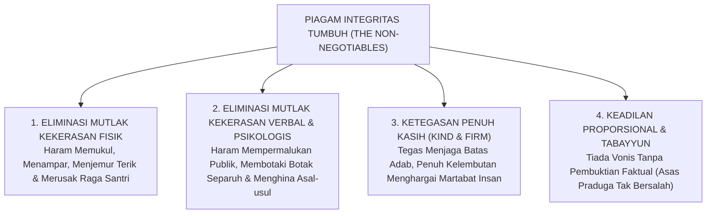
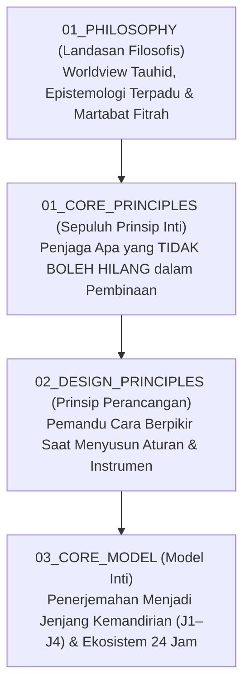
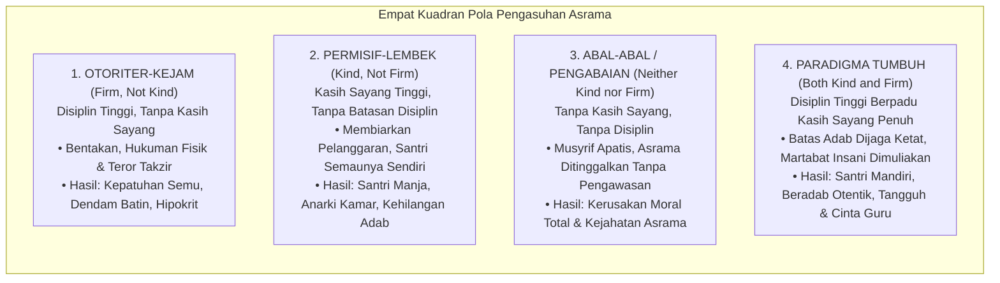
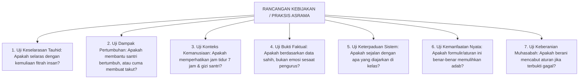
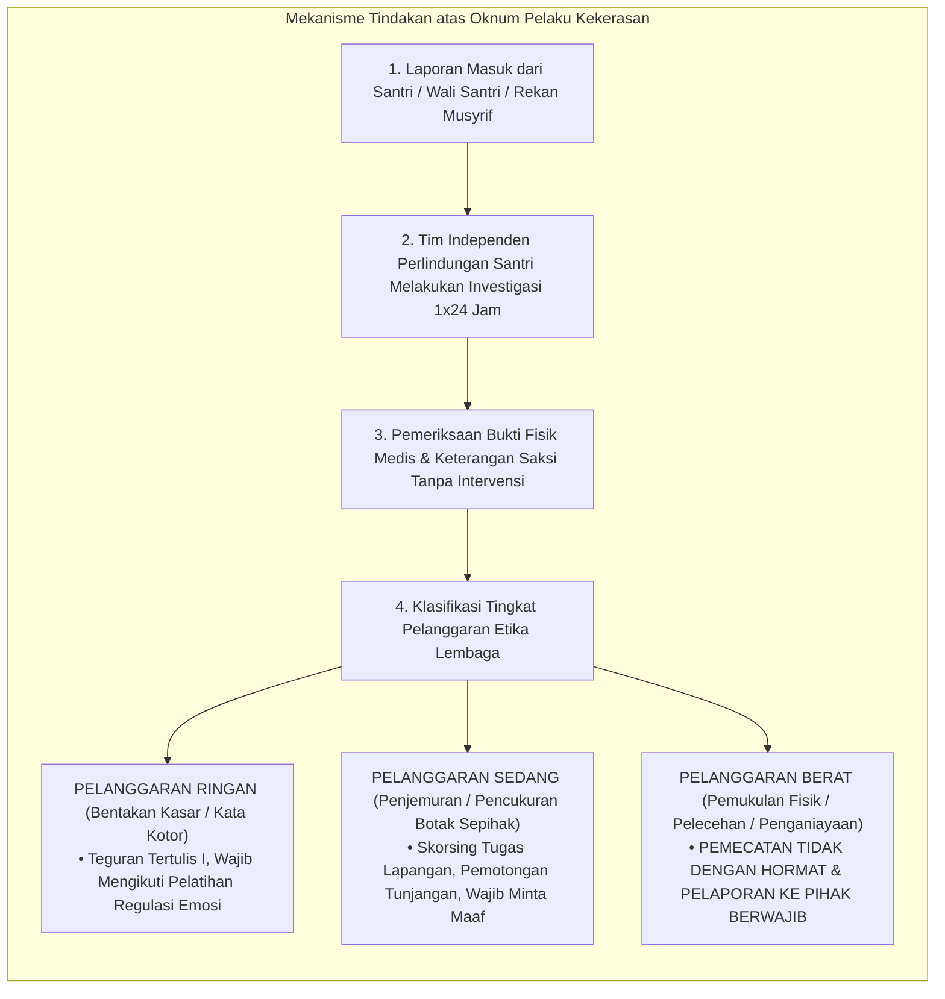

# BAB 8: SUMPAH INTEGRITAS PENDIDIKAN TUMBUH
## Garis Merah Mutlak (*The Non-Negotiables*) dan Sepuluh Prinsip Inti Pengasuhan Pesantren

> يَا أَيُّهَا الَّذِينَ آمَنُوا لَا تَخُونُوا اللَّهَ وَالرَّسُولَ وَتَخُونُوا أَمَانَاتِكُمْ وَأَنْتُمْ تَعْلَمُونَ
>
> *"Wahai orang-orang yang beriman! Janganlah kamu mengkhianati Allah dan Rasul-Nya, dan janganlah kamu mengkhianati amanah-amanah yang dipercayakan kepadamu, sedang kamu mengetahui."*  
> — **Al-Qur'an al-Karim**, Surah Al-Anfal [8]: 27[^1]

---

Al-Hafizh Ibnu Katsir dalam *Tafsir al-Qur'an al-'Azhim* meriwayatkan penafsiran dari sahabat Abdullah bin Abbas رضي الله عنهما mengenai ayat ini: bahwa amanat mencakup seluruh perkara syariat yang dipercayakan Allah kepada hamba-Nya, baik amanat ibadah kepada Allah maupun amanat pemeliharaan hak sesama manusia. Khianat terhadap anak-anak kaum muslimin yang dititipkan di pesantren—dengan memperlakukan mereka secara zalim, meremukkan mentalnya dengan kekerasan, atau membiarkan hak-hak keselamatannya terancam—adalah sebesar-besar pengkhianatan kepada Allah dan Rasul-Nya.[^1]

### 8.1 Piagam Gerbang Pesantren: Mengapa Sistem Membutuhkan Batas Mutlak?

Sumpah Integritas TUMBUH bukanlah sekadar klausul kepatuhan hukum (*legal compliance*) atau kode etik administratif yang dingin. Sumpah ini adalah **Mīthāq Ghalīzh (Perjanjian yang Amat Berat)** di hadapan Allah ﷻ. Setiap kali seorang santri melangkah melewati gerbang pondok, orang tuanya menyerahkan buah hatinya dengan tetesan air mata doa dan tawakal. Amanah tersebut mengguncang langit; bagaimana mungkin amanah suci itu disambut dengan rotan pemukul, bentakan yang menghina nama orang tua, atau pengabaian keselamatan raga? Sepuluh prinsip inti non-negotiable ini adalah dinding benteng yang menjaga agar lembaga pendidikan tidak berubah menjadi ladang kezaliman yang dimurkai Allah.

Di masa lalu, ketika seorang wali santri mengantarkan putra-putrinya ke pondok pesantren, kerap terlontar sebuah kalimat pasrah yang dianggap sebagai puncak ketakziman: *"Pak Kyai, anak ini saya serahkan sepenuhnya. Mau dipukul, mau dibotaki, mau disuruh apa saja silakan, yang penting pulangnya jadi orang shalih."* 

Di era itu, kalimat tersebut dimaknai sebagai wujud ketulusan orang tua dalam menitipkan buah hatinya untuk ditempa. Namun di era modern, kalimat pasrah semacam ini sering kali disalahartikan oleh sebagian oknum pengasuh sebagai **surat izin terbuka untuk melakukan kekerasan (*blank check for abuse*)**. 

Atas nama penempaan mental, batas-batas syariat dilanggar:
* Pukulan kayu balok yang memar dan mematahkan tulang dibenarkan sebagai "berkah rotan kyai";
* Caci maki kasar yang meremukkan harga diri anak dinormalisasi sebagai "latihan tahan banting";
* Pembiaran sanitasi asrama yang kumuh dan penyakit kulit massal dianggap sebagai "tirakat prihatin".

Ketika terjadi tragedi fatal—santri cedera permanen, mengalami gangguan jiwa, atau bahkan meregang nyawa akibat perpeloncoan fisik di asrama—pihak lembaga sering kali bersembunyi di balik dalih takdir atau menyebutnya sebagai "oknum sesaat di luar kendali manajemen".

Ekosistem **TUMBUH** menolak keras segala bentuk pembenaran palsu tersebut. 

Pendidikan Islam bukanlah arena gladiator tanpa hukum! Pesantren adalah tanah suci tempat anak-anak kaum muslimin menitipkan masa depan akidah dan akhlak mereka. Oleh karena itu, arsitektur TUMBUH menetapkan: **Sebelum kita menyusun modul kurikulum, sebelum kita merancang jadwal asrama, dan sebelum kita membagikan rubrik penilaian, lembaga pesantren wajib memancangkan SUMPAH INTEGRITAS KELEMBAGAAN (*The Non-Negotiables*)**.

Sumpah ini adalah **Garis Merah Mutlak (*The Red Line*)** yang mengikat seluruh civitas: mulai dari kyai pimpinan yayasan, kepala pengasuhan, musyrif asrama, guru kelas, petugas keamanan, hingga santri senior. Garis merah ini tidak boleh dilanggar, tidak boleh dikompromikan, dan tidak boleh ditawar dengan alasan biaya, kepraktisan teknis, ataupun kebiasaan masa lalu.

---

### 8.2 Sepuluh Prinsip Inti TUMBUH (*The Ten Core Principles*)

Prinsip Inti (*Core Principles*) adalah kompas abadi yang menjaga agar seluruh kebijakan, instrumen asesmen, dan intervensi perilaku di asrama tidak pernah melenceng dari pandangan tauhid dan fitrah kemanusiaan.

Perhatikan kedudukan strategis Prinsip Inti dalam hierarki sistem TUMBUH:

Sepuluh Prinsip Inti TUMBUH dijabarkan secara rinci sebagai berikut:

#### 1. Pertumbuhan Jiwa Melampaui Kepatuhan Semu (*Development over Mere Compliance*)
* **Hakikat Filosofis**: Sasaran utama tarbiyah adalah menumbuhkan kesadaran batin (*muraqabatullah*) dan tanggung jawab moral otonom, bukan sekadar memproduksi kepatuhan mekanis di hadapan musyrif. Kepatuhan yang lahir dari ancaman rotan hanya membiakkan kemunafikan (*nifaq*). Santri harus dibimbing untuk memilih berbuat kebajikan atas dasar cinta kepada Allah dan penghayatan akal sehat akan manfaatnya bagi sesama.
* **Batas Pengaman (*Guardrail*)**: Dilarang keras menggunakan metode intimidasi dan hukuman fisik yang hanya mengejar ketertiban semu sesaat.

#### 2. Perkembangan Manusia Seutuhnya (*Whole-Person Development*)
* **Hakikat Filosofis**: Santri adalah manusia seutuhnya yang memiliki keterpaduan jasad fisik, nalar akal, kalbu ruhaniyah, kehendak agensi, dan relasi sosial. Keberhasilan santri tidak boleh diukur hanya dari angka rapor madrasah atau kecepatan menambah juz hafalan Al-Qur'an. Hafalan yang banyak tidak ada artinya jika santri bertutur kata kasar, gemar merundung kawan sekamar, atau mengabaikan kebersihan diri.
* **Batas Pengaman (*Guardrail*)**: Sistem pembinaan dilarang mereduksi keberhasilan santri menjadi sekadar angka-angka kuantitatif kaku (*anti-reductionism*).

#### 3. Pertumbuhan Berlangsung Bertahap Melalui Proses (*Growth is Developmental*)
* **Hakikat Filosofis**: Karakter luhur tidak pernah tercipta dalam semalam. Santri bertumbuh melalui sunnatullah proses: latihan, pembiasaan bertahap (*at-tadarruj*), keberhasilan kecil, dan kekhilafan yang diperbaiki. Menuntut santri baru usia dua belas tahun untuk langsung memiliki kematangan santri senior adalah kezaliman pedagogis.
* **Batas Pengaman (*Guardrail*)**: Menolak sistem vonis biner hitam-putih ("anak baik vs anak gagal/anak nakal").

#### 4. Lingkungan dan Konteks Sangat Menentukan (*Context Matters*)
* **Hakikat Filosofis**: Perilaku santri sangat dipengaruhi oleh atmosfer fisik asrama, kepadatan jadwal harian, sanitasi kamar mandi, kecukupan waktu tidur, dan perlakuan para pembina. Masalah pelanggaran santri tidak boleh dipandang semata-mata sebagai "dosa moral individu". Sering kali santri terlambat subuh bukan karena hatinya kotor, melainkan karena jadwal muthala'ah malam terlalu larut atau aliran air tempat wudhu mati sejak dini hari.
* **Batas Pengaman (*Guardrail*)**: Dilarang menghakimi watak pribadi santri sebelum melakukan audit kelayakan sistem dan lingkungan di sekitarnya.

#### 5. Relasi Kasih Sayang adalah Media Utama Tarbiyah (*Relationship is Part of Development*)
* **Hakikat Filosofis**: Pembinaan santri berhasil bukan karena tebalnya buku tata tertib atau ketatnya pos penjagaan, melainkan karena hadirnya ikatan hati (*mahabbah*) yang tulus antara pendidik dan santri. Santri hanya akan membuka pintu jiwanya menerima nasihat kebaikan dari guru yang mereka rasakan ketulusan kasih sayangnya.
* **Batas Pengaman (*Guardrail*)**: Dilarang memperlakukan hubungan musyrif-santri secara dingin, kaku, dan transaksional ala sipir penjara.

#### 6. Berpijak pada Bukti yang Sahih (*Grounded in Evidence and Reasoning*)
* **Hakikat Filosofis**: Seluruh kebijakan pengasuhan, vonis disiplin, dan evaluasi santri wajib bersandar pada nalar yang masuk akal dan fakta catatan lapangan yang terverifikasi secara sahih (*tabayyun*). Keputusan pembinaan tidak boleh diambil berdasarkan emosi sesaat, desas-desus asrama, atau praduga tak terbukti (*zhann*).
* **Batas Pengaman (*Guardrail*)**: Dilarang menjatuhkan sanksi tanpa bukti faktual yang memenuhi standar verifikasi epistemik minimal *Strongly Supported*.

#### 7. Keterpaduan Sistem yang Utuh (*Systemic Integration*)
* **Hakikat Filosofis**: Pesantren adalah sebuah organisme yang menyatu. Apa yang diajarkan oleh ustadz di ruang kelas madrasah wajib sejalan dengan apa yang dipraktikkan oleh musyrif di lorong asrama, apa yang diawasi oleh tim keamanan di pos gerbang, dan apa yang disajikan oleh petugas dapur di ruang makan. Pertentangan antar-bagian akan membingungkan jiwa santri.
* **Batas Pengaman (*Guardrail*)**: Dilarang adanya sekat ego sektoral antara bagian kepengasuhan asrama, bagian kurikulum madrasah, dan bagian bimbingan konseling.

#### 8. Asesmen Berorientasi Membimbing (*Assessment for Growth*)
* **Hakikat Filosofis**: Evaluasi dan penilaian perilaku santri dilakukan untuk **membimbing pertumbuhan (*assessment for learning*)**, bukan untuk melabeli, memberi cap hitam, atau mencari-cari kesalahan anak (*assessment for punishment*). Data asesmen digunakan untuk merancang pendampingan yang tepat, bukan untuk dipamerkan atau dipermalukan di hadapan umum.
* **Batas Pengaman (*Guardrail*)**: Dilarang menggunakan instrumen penilaian sebagai alat ancaman atau pembalasan dendam pembina.

#### 9. Intervensi Bersifat Memulihkan (*Restorative Intervention*)
* **Hakikat Filosofis**: Ketika terjadi pelanggaran adab, tujuan utama penanganannya adalah **memulihkan kerusakan (*Ishlah al-Bain*)**, menyadarkan nurani pelaku, menyembuhkan rasa sakit korban, dan memulihkan keharmonisan ukhuwah kamar. Sanksi bukanlah pembalasan penderitaan (*retribution*), melainkan **Konsekuensi Logis** yang relevan dan mendidik tanggung jawab nyata.
* **Batas Pengaman (*Guardrail*)**: Dilarang memberikan hukuman yang tidak ada hubungannya dengan pelanggaran (seperti push-up untuk santri yang lupa menyetor hafalan).

#### 10. Perbaikan Berkelanjutan (*Continuous Improvement / Muhasabah Kelembagaan*)
* **Hakikat Filosofis**: Tidak ada sistem buatan manusia yang sempurna. Dewan pimpinan pesantren wajib secara berkala melakukan muhasabah sistemik: mengevaluasi efektivitas aturan asrama, mendengarkan suara santri, dan berani mencabut aturan yang terbukti gagal di lapangan.
* **Batas Pengaman (*Guardrail*)**: Dilarang mempertahankan aturan yang terbukti membuat musyrif mengalami *burnout* atau membuat santri trauma semata-mata demi gengsi pengurus.

---

### 8.3 Ketegasan Penuh Kasih (*Kind and Firm*): Menepis Mitos Lembek

Banyak pendidik dan pembina asrama konvensional salah memahami seruan anti-kekerasan ini. Mereka berujar dengan nada sinis: *"Kalau santri tidak boleh dipukul, tidak boleh dibentak, dan tidak boleh dibotaki, nanti pesantren ini jadi lembek! Santri jadi manja, semaunya sendiri, dan tidak punya rasa takut pada guru!"*

Ini adalah kesalahpahaman yang sangat fatal! Paradigma TUMBUH menolak kekerasan **bukan untuk menjadi lembek (*permissive/indulgent*)**. 

Dalam psikologi pengasuhan modern (*Positive Discipline* oleh Dr. Jane Nelsen) dan tradisi kepemimpinan profetik Rasulullah ﷺ, pendekatan TUMBUH dirumuskan dalam satu prinsip agung: **Kind and Firm (Tegas Berwibawa Sekaligus Penuh Kasih Sayang)**[^2]:

Perhatikan bagaimana memadukan dua kutub ini secara harmonis di lantai asrama:

#### Makna Kindness (Kasih Sayang):
Kasih sayang bermakna **menghormati kemanusiaan santri**.
* Kita mendengarkan penjelasannya dengan tenang sebelum mengambil keputusan.
* Kita memvalidasi rasa lelah dan emosinya: *"Ustadz tahu antum sedang sangat lelah hari ini..."*
* Kita menjaga keselamatannya, menolak memukul wajahnya, menolak mencaci-maki fisiknya, dan menjaga aibnya di depan teman-temannya.

#### Makna Firmness (Ketegasan Berwibawa):
Ketegasan bermakna **menghormati kebutuhan aturan dan keselamatan bersama**.
* Kita memegang teguh batasan adab: *"Meskipun antum lelah, aturan asrama menetapkan bahwa salat berjamaah di masjid adalah kewajiban yang tidak bisa ditawar."*
* Kita konsisten menegakkan konsekuensi logis: jika santri merusak fasilitas, ia wajib menggantinya; jika santri menumpahkan makanan, ia wajib membersihkannya.
* Kita tidak plin-plan dan tidak terbujuk oleh rengekan yang merusak prinsip.

Perpaduan *Kind and Firm* terdengar dalam nada suara seorang musyrif yang tenang, rendah, berwibawa, namun tatapan matanya memancarkan ketegasan yang tak tergoyahkan. Musyrif tidak perlu berteriak laksana orang kesurupan untuk menegakkan wibawanya. Wibawa sejati lahir dari ketenangan jiwa (*thuma'ninah*) dan keadilan sikap.

---

### 8.4 Pagar Pengaman Sistem (*Guardrails*) dan Sepuluh Tanda Bahaya (*Red Flags*)

Agar para pimpinan pondok dan dewan pengarah pesantren dapat mengaudit tata kelola pengasuhan secara mandiri, arsitektur TUMBUH menetapkan **Tujuh Pertanyaan Uji Integritas Sistem (*The Seven Integrity Tests*)**[^3]:

#### Sepuluh Tanda Bahaya Lampu Merah (*The Ten Red Flags*)
Apabila di lingkungan pesantren terdeteksi salah satu dari **Sepuluh Tanda Bahaya** di bawah ini, maka dewan pimpinan wajib **segera menghentikan praktik tersebut dan melakukan audit darurat**:

| No | Tanda Peringatan Bahaya (*Red Flags*) | Mengapa Berbahaya bagi Tarbiyah Pesantren? |
| :---: | :--- | :--- |
| **1** | **Kepatuhan semu dianggap sebagai satu-satunya ukuran sukses.** | Santri hanya belajar menjadi munafik: tertib di depan mata musyrif, namun liar melanggar di belakang. |
| **2** | **Santri direduksi menjadi sekadar angka poin minus atau label buruk.** | Menghancurkan harga diri santri dan membunuh harapan untuk bertaubat dan bertumbuh (*learned helplessness*). |
| **3** | **Masalah pelanggaran selalu ditimpakan kepada santri tanpa memeriksa lingkungan.** | Menutupi kelemahan manajemen (seperti kamar mandi kumuh, jadwal tidur terlalu larut, atau rasio musyrif timpang). |
| **4** | **Data perilaku dikumpulkan sekadar untuk laporan birokrasi di atas kertas.** | Menghabiskan tenaga musyrif tanpa pernah menghasilkan bimbingan empati nyata bagi jiwa santri. |
| **5** | **Sanksi pelanggaran berupa hukuman fisik atau mempermalukan santri di depan umum.** | Menanamkan racun trauma batin, dendam kesumat, dan mencontohkan kultur premanisme kepada santri. |
| **6** | **Musyrif asrama dipaksa bertugas 24 jam nonstop tanpa jaminan istirahat dan libur.** | Memicu kelelahan saraf kronis (*burnout*) yang berujung pada ledakan amarah kasar kepada santri. |
| **7** | **Musyrif dan santri dilarang bertanya atau mengklarifikasi aturan yang dibuat pengelola.** | Memelihara kesombongan kelembagaan feodalistik yang menjauhkan pesantren dari kebenaran syariat. |
| **8** | **Mengadopsi aplikasi digital baru hanya karena gengsi atau tren viral.** | Membebani biaya dan waktu santri tanpa memberikan nilai tambah bagi pembentukan adab hakiki. |
| **9** | **Menghakimi santri lambat belajar sebagai santri yang tidak ikhlas atau tidak beriman.** | Mengingkari sunnatullah keragaman potensi kecerdasan (*fitrah tanawwu'*) yang diciptakan Allah. |
| **10** | **Menolak mencabut aturan yang sudah terbukti gagal hanya karena gengsi pengurus.** | Mempertahankan kezaliman sistemik demi menjaga gengsi kekuasaan manusiawi. |

---

### 8.5 Mekanisme Penegakan Akuntabilitas Lembaga: Sanksi bagi Oknum Pendidik Pelaku Kekerasan

Sumpah integritas bukanlah pajangan dinding yang berhenti sebagai retorika moral; sumpah ini memiliki kekuatan hukum dan administratif kelembagaan yang mengikat (*legally and administratively binding*).

Pesantren yang benar-benar berkomitmen melindungi santri wajib memiliki **Prosedur Operasional Standar Penanganan Pelanggaran Etika Pendidik**:

Prinsip keadilan TUMBUH menegaskan: **Tidak ada kekebalan hukum bagi siapa pun di pesantren**. Sekalipun oknum pelaku kekerasan adalah putra kyai (gus), musyrif paling senior, atau pengajar kitab kuning terkemuka, jika ia terbukti memukul atau menganiaya santri, ia wajib menerima sanksi tegas sesuai hukum syariat dan aturan lembaga. Menutupi kejahatan kekerasan atas nama "menjaga nama baik pondok" adalah dosa khianat terbesar di hadapan Allah ﷻ.

---

### 8.6 Saluran Pengaduan Aman Santri (*Safe Reporting Channels*)

Salah satu alasan mengapa kekerasan dan perundungan dapat bertahan selama puluhan tahun di asrama adalah karena **santri tidak memiliki saluran aman untuk melapor tanpa takut diintimidasi atau dibalas dendam**. Santri junior yang berani mengadu kepada musyrif kerap dicap sebagai "anak cepu/pengkhianat" oleh seniornya, lalu dipukuli beramai-ramai pada malam harinya.

TUMBUH memutus rantai intimidasi ini dengan **Tiga Saluran Pengaduan Aman (*The Three Safe Harbor Channels*)**:

1. **Kotak Amanah Rahasia (*The Sealed Confidential Box*)**:  
   Kotak fisik yang terkunci rapat diletakkan di area-area netral (perpustakaan, lorong klinik, dekat pos satpam) yang tidak disorot kamera pengawas secara intimidatif. Kunci kotak ini hanya dipegang oleh Tim Khusus Perlindungan Santri (bukan musyrif kamar harian). Santri dapat memasukkan surat pengaduan tulisan tangan tanpa nama (*anonymous report*).
2. **Akses Langsung Konselor BK Independen**:  
   Santri memiliki hak mutlak untuk meminta sesi konseling tertutup bersama guru BK kapan saja tanpa perlu meminta izin atau persetujuan dari musyrif kamarnya. Ruang BK adalah zona suci kerahasiaan (*sanctuary of confidentiality*).
3. **Pemberian Sanksi Ekstrem bagi Pelaku Pembalasan Dendam (*Anti-Retaliation Clause*)**:  
   Lembaga menetapkan aturan besi: barang siapa santri senior atau musyrif yang terbukti melakukan intimidasi, pengancaman, atau perundungan balasan terhadap santri yang melapor, maka pelaku akan **dikenakan sanksi ganda pelanggaran berat dan dikeluarkan dari kepengurusan**.

---

### 8.7 Piagam Perlindungan Santri: Ikrar Suci Pengasuh TUMBUH

Sebagai penutup bab ini, seluruh pendidik, asatidz, dan musyrif dalam ekosistem TUMBUH mengikrarkan **Piagam Perlindungan Santri**:

1. **Kami bersumpah demi Allah untuk menjaga keselamatan fisik setiap santri**: Kami mengharamkan tangan kami dari memukul wajah, menampar, menendang, mencambuk dengan rotan, ataupun menyiksa fisik anak-anak kaum muslimin yang diamanahkan kepada kami.
2. **Kami bersumpah demi Allah untuk menjaga kemuliaan martabat jiwa setiap santri**: Kami mengharamkan lisan kami dari mencaci-maki dengan sebutan binatang, mempermalukan santri di depan khalayak umum, mencukur botak separuh untuk menghinanya, atau mengalungkan papan aib di lehernya.
3. **Kami bersumpah demi Allah untuk menegakkan ketegasan yang berkeadilan**: Kami memegang teguh batasan adab dan konsekuensi logis yang mendidik, membimbing santri memulihkan kesalahannya dengan penuh tanggung jawab (*restitusi*), dan merangkul mereka kembali dalam dekapan ukhuwah tanpa menyematkan stigma kekal.

Inilah sumpah suci yang menjaga benteng pesantren kita dari kemurkaan Allah ﷻ.

Dengan dipancangkannya Sumpah Integritas ini, kita kini memiliki garis batas yang tak tergoyahkan. Langkah selanjutnya adalah memastikan: *Bagaimanakah tata kelola pengambilan keputusan dan etika penanganan kasus santri dijalankan sehari-hari agar terbebas dari bias personal, fitnah, dan kesewenang-wenangan?*

Inilah yang akan kita bedah secara tuntas dalam **Bab 9: Tata Kelola Epistemik dan Etika Pengambilan Keputusan**.

Sumpah integritas telah kita ikrarkan di hadapan Allah. Namun, bagaimana jika seorang pembina yang berniat baik dan tulus, justru tergelincir menzalimi santri hanya karena ia menggunakan data yang keliru, mempercayai kabar burung, atau tidak sengaja membocorkan aib santri saat rapat pengasuhan?

Di Bab 9, kita akan membedah Tata Kelola Epistemik dan Etika Pengambilan Keputusan—menjaga agar lisan, pena, dan vonis para pendidik tetap suci dari kezaliman yang tak disadari.

---

### Catatan Kaki & Rujukan Akademik

[^1]: Al-Qur'an al-Karim, Surah Al-Anfal [8]: 27.
[^2]: Jane Nelsen, *Positive Discipline* (New York: Ballantine Books, 2006), hlm. 15–42; Jane Nelsen & Lynn Lott, *Positive Discipline for Teenagers* (New York: Three Rivers Press, 2012).
[^3]: Repositori TUMBUH v2.0.0, Dokumen Fundamental: `01_FUNDAMENTAL/02_PRINCIPLES/01_CORE_PRINCIPLES/04-Guardrails.md` dan `01-Core-Principles.md`.
