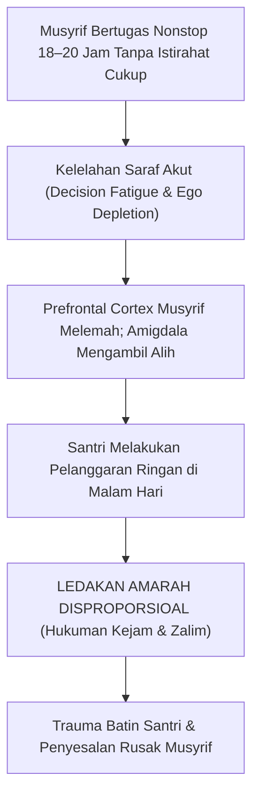
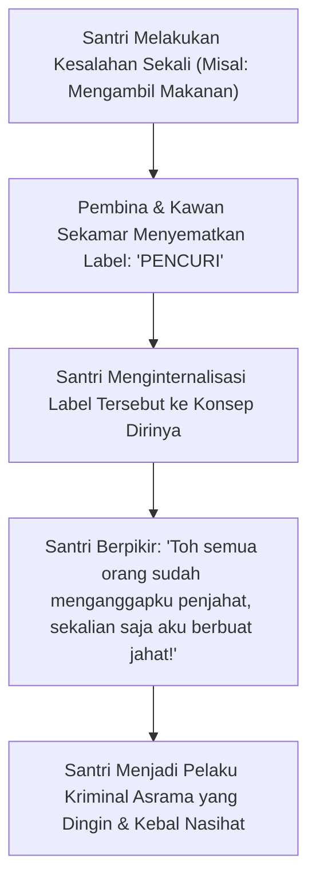
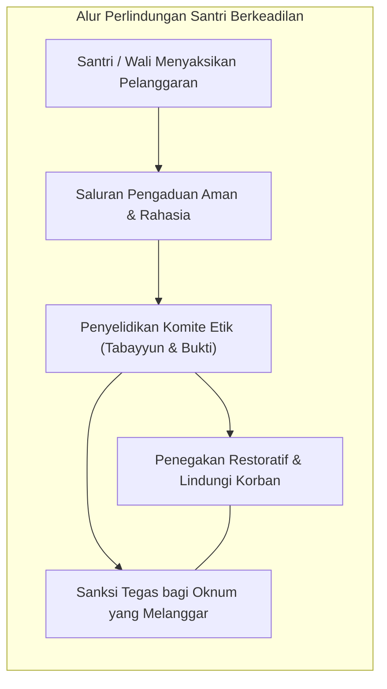
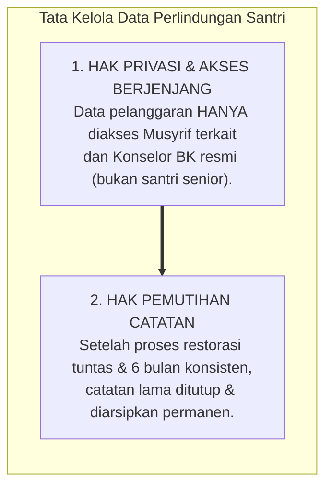

# BAB 9: TATA KELOLA EPISTEMIK DAN ETIKA PENGAMBILAN KEPUTUSAN
## Mencegah Stigmatisasi, Menjaga Kerahasiaan Aib, dan Menegakkan Akuntabilitas Pembina Asrama

> مَنْ سَتَرَ مُسْلِمًا سَتَرَهُ اللَّهُ فِي الدُّنْيَا وَالْآخِرَةِ، وَاللَّهُ فِي عَوْنِ الْعَبْدِ مَا كَانَ الْعَبْدُ فِي عَوْنِ أَخِيهِ
>
> *"Barangsiapa yang menutup aib seorang muslim, niscaya Allah akan menutup aibnya di dunia dan akhirat. Dan Allah senantiasa menolong seorang hamba selama hamba tersebut menolong saudaranya."*  
> — **Rasulullah ﷺ**, riwayat Abu Hurairah رضي الله عنه[^1]

---

### 9.1 Anatomi Kezaliman Tak Sengaja: Mengapa Musyrif yang Lelah Sangat Rentan Berbuat Zalim?

Pukul 23.30 tengah malam di lorong asrama santri. Seorang musyrif berusia dua puluh dua tahun berjalan dengan langkah gontai. Tubuhnya telah beraktivitas sejak pukul 03.30 dini hari: mengajar kelas nahwu di madrasah, mengawasi antrean makan siang, mendampingi halaqah tahfizh sore, memeriksa kebersihan kamar mandi, dan memantau muthala'ah malam. Cadangan energi fisiknya telah terkuras habis, dan otaknya mengalami apa yang dalam neuropsikologi disebut sebagai **Kelelahan Keputusan (*Decision Fatigue*)** dan **Pengurasan Ego (*Ego Depletion*)**[^2].

Di ujung lorong yang temaram, sang musyrif mendapati dua orang santri kelas tujuh masih bergurau dan saling melempar bantal, padahal lampu kamar semestinya telah padam sejak tiga puluh menit yang lalu.

Dalam kondisi otak yang segar di pagi hari, sang musyrif mungkin akan tersenyum, menyapa mereka dengan hangat, dan membimbing mereka membaca doa tidur. Namun malam ini, dalam kondisi kelelahan saraf yang akut, **ambang batas kesabarannya runtuh**. 

Sang musyrif seketika meledak: ia menendang pintu kamar hingga terbuka membentur tembok, menyambar bantal santri dan melemparkannya ke lantai, lalu berteriak dengan suara serak: *"Kalian berdua ini setan apa manusia?! Tidak tahu aturan! Keluar kalian! Berdiri di tengah lorong sampai subuh!"*

Ketika fajar menyingsing dan emosinya mereda, sang musyrif menatap kedua anak yang meringkuk kedinginan di lantai lorong dengan perasaan bersalah yang menusuk dada: *"Ya Allah, apa yang telah kulakukan? Mengapa aku memperlakukan mereka sekejam ini hanya karena mereka terlambat tidur?"*

Peristiwa memilukan ini menyadarkan kita akan sebuah aksioma penting: **Kezaliman di pesantren sering kali tidak lahir dari niat jahat; kezaliman paling sering lahir dari kombinasi antara KELELAHAN SISTEMIK MUSYRIF dan KETIADAAN PROTOKOL TATA KELOLA KEPUTUSAN YANG KETAT**.

Secara biologis murni, seorang manusia yang mengalami kelelahan kronis akan kehilangan kapasitas korteks prafrontal (PFC)-nya untuk berpikir jernih, menahan impuls amarah, dan mempertimbangkan keadilan proporsional. Otak purbanya (amigdala) mengambil alih kendali, memperlakukan pelanggaran kecil santri laksana ancaman eksistensial yang harus dihancurkan dengan kekerasan.

Oleh karena itu, arsitektur **TUMBUH** menetapkan protokol perlindungan sistemik:
1. **Regulasi Beban Kerja Musyrif**: Musyrif asrama adalah manusia biologis, bukan robot besi. Pesantren wajib menjamin waktu tidur malam musyrif minimal 7 jam dan menetapkan hari libur berkala (*off-duty rotation*). Membiarkan musyrif kelelahan kronis adalah kelalaian manajemen yang membahayakan keselamatan santri.
2. **Pemisahan Kewenangan Eksekusi Disiplin (*Separation of Powers*)**: Seorang musyrif yang sedang berada dalam keadaan marah atau kelelahan di malam hari **DIHARAMKAN SECARA MUTLAK menjatuhkan sanksi berat seketika**. Tindakan yang diizinkan pada malam hari hanyalah de-eskalasi penenangan (menghentikan pertengkaran dan memerintahkan tidur). Keputusan mengenai konsekuensi disiplin hanya boleh diambil keesokan harinya di ruang pengasuhan setelah emosi mereda dan melalui musyawarah objektif.

---

### 9.2 Bahaya Pelabelan: Memisahkan Identitas Insan dari Perilaku yang Muncul

Salah satu racun psikologis yang paling mematikan bagi masa depan seorang santri adalah **Stigmatisasi dan Pelabelan Identitas (*Identity Labeling*)**.

Perhatikan perbedaan mendasar antara dua kalimat yang diucapkan oleh seorang pembina kepada santri yang berbuat salah:

> **Kalimat A (Pelabelan Identitas - Merusak Jiwa):**  
> *"Kamu ini memang anak nakal, dasar pencuri sandal, pembohong tidak tahu malu!"*

> **Kalimat B (Pemisahan Identitas dan Perilaku - Menumbuhkan Taubat):**  
> *"Kamu adalah hamba Allah yang mulia dan santri yang berharga di pondok ini; namun perbuatan mengambil sandal kemarin sore adalah tindakan salah yang melanggar adab dan wajib kamu perbaiki."*

Secara sosiologi dan psikologi kognitif, Kalimat A memicu fenomena yang disebut **Ramalan yang Mewujud Sendiri (*The Self-Fulfilling Prophecy / Labeling Theory*)** sebagaimana dirumuskan oleh sosiolog Howard Becker[^3a]: Ibnu Katsir, *Tafsir al-Qur'an al-'Azhim*, Jilid VII, hlm. 377–380.
[^3]:

Ketika seorang santri berkali-kali dicap sebagai "anak nakal", "pemalas", atau "pembangkang", otaknya secara bertahap menyerah. Ia berhenti berusaha menjadi anak baik. Ia berkata di dalam hatinya: *"Percuma aku salat di saf pertama, ustadz tetap memandangku sebagai anak nakal. Percuma aku belajar giat, kawan-kawan tetap memanggilku pencuri."* Label tersebut berubah menjadi vonis mati bagi masa depan karakternya.

Dalam ajaran Islam yang luhur, **dosa tidak pernah melekat kekal pada zat kemanusiaan seseorang**. Seorang mukmin yang melakukan dosa besar sekalipun tetap memiliki pintu taubat yang terbuka lebar. Allah ﷻ menyebut orang-orang yang bertaubat bukan sebagai mantan penjahat yang hina, melainkan sebagai kekasih-Nya yang mulia:

$$\text{إِنَّ اللَّهَ يُحِبُّ التَّوَّابِينَ وَيُحِبُّ الْمُتَطَهِّرِينَ}$$

> *"Sesungguhnya Allah menyukai orang-orang yang bertaubat dan menyukai orang-orang yang menyucikan diri."*  
> (QS. Al-Baqarah [2]: 222)[^3]

Oleh karena itu, ekosistem TUMBUH mengharamkan seluruh bentuk penyematan label permanen kepada santri:
* Dilarang mencatat nama santri di papan pengumuman dengan judul *"Daftar Santri Bermasalah / Santri Nakal"*.
* Dilarang memanggil santri dengan julukan kesalahan masa lalunya.
* Kita membenci dan memerangi **perilaku buruknya**, namun kita tetap memuliakan dan mencintai **jiwa kemanusiaan santri tersebut** sebagai saudara seiman yang sedang berproses belajar.

---

### 9.3 Asas Praduga Tak Bersalah dan Larangan Interogasi Paksa

Tradisi hukum Islam yang adil meletakkan sebuah kaidah ushul fiqh universal yang mendahului seluruh sistem hukum modern:

$$\text{الْيَقِينُ لَا يَزُولُ بِالشَّكِّ}$$

> *"Keyakinan yang pasti tidak dapat digugurkan oleh keragu-raguan (praduga)."*[^4]

Dan kaidah fiqih yang kokoh:

$$\text{الْأَصْلُ بَرَاءَةُ الذِّمَّةِ}$$

> *"Hukum asal pada diri setiap manusia adalah bebas dari kesalahan dan tanggungan (Praduga Tak Bersalah / Presumption of Innocence)."*[^5]

Artinya: **Seorang santri wajib dianggap bersih dan tidak bersalah hingga ada bukti faktual yang sah, nyata, dan meyakinkan yang membuktikan kesalahannya.**

Tragedi yang kerap terjadi di asrama adalah **Metode Interogasi Inkuisisi**:
Ketika ada barang yang hilang, santri yang dicurigai disudutkan di ruang gelap, dikelilingi oleh lima orang musyrif, dibentak dengan suara lantang, ditakut-takuti akan diusir, atau dipukul hingga menangis agar ia mengaku.

Secara neurobiologis dan psikologi forensik, metode interogasi represif semacam ini terbukti menghasilkan **Pengakuan Palsu (*Coerced-Compliant False Confession*)**[^6]. Anak yang sedang berada di bawah ancaman teror fisik akan rela mengakui kejahatan apa pun yang dituduhkan kepadanya—bahkan kejahatan yang tidak pernah ia lakukan—semata-mata agar siksaan dan bentakan tersebut segera berhenti!

TUMBUH memberlakukan protokol penyelidikan adab:
1. **Hak Didampingi Guru BK / Wali Asrama**: Santri yang sedang dimintai keterangan berhak didampingi oleh wali kelas atau guru BK yang bersikap netral dan mengayomi.
2. **Ketiadaan Ancaman Fisik dan Teror**: Pemeriksaan dilakukan di ruangan yang terang, dalam posisi duduk sejajar, dengan nada suara tenang, dan santri diberi air minum.
3. **Standar Pembuktian Triangulasi**: Tuduhan tidak boleh diputuskan hanya berdasarkan kabar burung atau pengakuan sepihak dari santri lain yang memiliki konflik pribadi. Harus ada bukti fisik yang nyata (rekaman, saksi mata terpercaya lebih dari satu, atau barang bukti yang terverifikasi).
4. **Lebih Baik Keliru Membebaskan daripada Keliru Menghukum**: Rasulullah ﷺ menggariskan prinsip peradilan Islam yang sangat berhati-hati:

$$\text{ادْرَءُوا الْحُدُودَ عَنِ الْمُسْلِمِينَ مَا اسْتَطَعْتُمْ، فَإِنْ كَانَ لَهُ مَخْرَجٌ فَخَلُّوا سَبِيلَهُ، فَإِنَّ الْإِمَامَ أَنْ يُخْطِئَ فِي الْعَفْوِ خَيْرٌ مِنْ أَنْ يُخْطِئَ فِي الْعُقُوبَةِ}$$

> *"Tolaklah (hindarilah) hukuman dari kaum muslimin semampu kalian. Jika ada celah baginya untuk bebas dari keraguan, maka lepaskanlah dia. Karena sesungguhnya seorang pemimpin yang keliru dalam memaafkan jauh lebih baik daripada ia keliru dalam menjatuhkan hukuman!"*  
> (HR. At-Tirmidzi no. 1424 dan Al-Hakim dalam *Al-Mustadrak*, sanad shahih lighairihi)[^7]

---

### 9.4 Etika Sitr al-Muslim: Menjaga Kerahasiaan Aib Santri

Salah satu pelanggaran adab yang paling sering dilakukan oleh para pendidik tanpa disadari adalah **mengumbar aib kesalahan santri (*if-sya'ul aib*)**.

Perhatikan bagaimana aib seorang santri kerap menyebar di lingkungan pesantren:
* Seorang santri ketahuan merokok di belakang kamar mandi. Musyrif yang memergokinya segera menceritakan detail kejadian tersebut di ruang guru sambil tertawa mengejek: *"Tuh, santri si Fulan ternyata perokok berat, sok alim di kelas!"*
* Kejadian tersebut kemudian dibagikan ke dalam grup percakapan WhatsApp pengurus lengkap dengan foto santri yang bersangkutan.
* Dalam hitungan jam, kabar tersebut bocor ke telinga santri-santri lain, dan anak tersebut menjadi bahan olokan massal di seluruh penjuru pondok.

Ini adalah perbuatan dosa besar yang diharamkan syariat! Mengumbar aib sesama muslim adalah perbuatan ghibah yang diibaratkan Al-Qur'an laksana memakan bangkai saudaranya sendiri (QS. Al-Hujurat: 12).

Rasulullah ﷺ memberikan peringatan keras kepada orang-orang yang gemar membongkar aib orang lain:

$$\text{يَا مَعْشَرَ مَنْ أَسْلَمَ بِلِسَانِهِ وَلَمْ يُفْضِ الْإِيمَانُ إِلَى قَلْبِهِ، لَا تَغْتَابُوا الْمُسْلِمِينَ، وَلَا تَتَّبِعُوا عَوْرَاتِهِمْ، فَإِنَّهُ مَنْ تَتَبَّعَ عَوْرَةَ أَخِيهِ الْمُسْلِمِ تَتَبَّعَ اللَّهُ عَوْرَتَهُ، وَمَنْ تَتَبَّعَ اللَّهُ عَوْرَتَهُ يَفْضَحْهُ وَلَوْ فِي جَوْفِ بَيْتِهِ}$$

> *"Wahai orang-orang yang menyatakan Islam dengan lisannya namun keimanan belum meresap ke dalam kalbunya! Janganlah kalian menggunjing kaum muslimin dan janganlah kalian mencari-cari aib rahasia mereka! Karena barangsiapa yang mencari-cari aib saudaranya sesama muslim, niscaya Allah akan membongkar aibnya; dan barangsiapa yang aibnya dibongkar oleh Allah, niscaya Dia akan mempermalukannya sekalipun ia berada di dalam bilik rumahnya sendiri!"*  
> (HR. Abu Dawud no. 4880 dan At-Tirmidzi no. 2032, sanad shahih)[^8]

Dalam ekosistem TUMBUH, diberlakukan **Doktrin Kerahasiaan Konseling (*Counseling Confidentiality & Sitr al-Muslim*)**:
1. Catatan pelanggaran, riwayat psikologis, dan penanganan kasus santri berstatus **Dokumen Sangat Rahasia (Confidential)** yang hanya boleh diakses oleh Tim BK resmi, kepala kepengasuhan, dan wali santri yang bersangkutan.
2. Dilarang keras menceritakan aib santri di ruang umum, ruang makan guru, apalagi menjadikannya bahan lelucon forum santri.
3. Musyrif yang membocorkan aib santri kepada pihak yang tidak berhak dikenai sanksi etika kelembagaan yang berat.

Ketika santri merasa bahwa aib dan masa lalunya dijaga rapat oleh gurunya, di dalam dadanya akan tumbuh rasa hormat, cinta, dan kepercayaan yang tak tergoyahkan kepada para pembimbingnya.

---

### 9.5 Akuntabilitas Kelembagaan dan Saluran Pengaduan Aman (Safe Reporting Mechanism)

Sebuah institusi pendidikan yang sehat tidak boleh bergantung hanya pada kebaikan hati individu pengasuhnya; institusi yang sehat wajib memiliki **Mekanisme Akuntabilitas yang Transparan (*Accountability and Safe Reporting Systems*)**.

Di sebagian pesantren tradisional, berkembang mitos yang keliru bahwa: *"Santri yang melaporkan kekerasan atau penindasan oleh ustadz/senior dianggap sebagai anak cengeng dan pengkhianat pondok."* Santri yang berani mengadu kepada orang tuanya kerap diintimidasi oleh pengurus: *"Jangan buka aib pondok ke orang luar!"*

Akibatnya, kasus-kasus kekerasan seksual, perundungan berat, dan pemerasan uang saku terkubur rapat selama bertahun-tahun hingga meledak menjadi skandal hukum yang mencoreng nama baik seluruh dunia pesantren di mata masyarakat.

Ekosistem TUMBUH menegakkan pilar perlindungan modern berbasis syariat:
1. **Saluran Pengaduan Aman dan Anonim (*Safe & Anonymous Reporting Channel*)**:  
   Pesantren menyediakan kotak aduan fisik yang terkunci rapat (hanya dibuka oleh Tim Perlindungan Santri independen) serta nomor layanan aduan digital terenkripsi tempat santri dan wali santri dapat melaporkan tindakan perundungan, pemerasan, atau kekerasan tanpa rasa takut akan pembalasan dendam (*anti-retaliation policy*).
2. **Komite Etik dan Perlindungan Santri Independen**:  
   Membentuk badan pengawas yang beranggotakan perwakilan dewan kyai, psikolog profesional, dan perwakilan wali santri yang bertugas memeriksa setiap laporan pelanggaran etika yang dilakukan oleh pembina atau santri senior secara adil, objektif, dan transparan.
3. **Kultur Akuntabilitas Terbuka**:  
   Pimpinan pesantren berani meminta maaf secara terbuka kepada korban dan wali santri jika terbukti terjadi kelalaian sistemik di lingkungan asrama, serta menindak tegas oknum yang bersalah sesuai koridor hukum syariat dan hukum positif yang berlaku.

---

### 9.6 Etika Tata Kelola Data Digital: Privasi Santri dan Hak Pemutihan Rekam Jejak (*Right to be Forgotten*)

Di era digital kontemporer, sebagian pesantren mulai mengadopsi aplikasi manajemen asrama untuk mencatat kehadiran salat, pelanggaran santri, dan evaluasi kepengasuhan. Namun adopsi teknologi ini kerap melahirkan **Kezaliman Digital (*Digital Injustice*)**: data kenakalan santri disimpan tanpa enkripsi, disebarkan secara sembarangan di grup pengurus, atau tersimpan abadi di server hingga bertahun-tahun setelah santri lulus.

TUMBUH memberlakukan standar etika tata kelola data santri yang sangat ketat:

#### Hak Pemutihan Rekam Jejak Pasca-Restitusi
Dalam Islam, seorang hamba yang telah bertaubat dari dosanya diibaratkan laksana orang yang tidak memiliki dosa sama sekali (*at-ta'ibu minadz-dzanbi kaman la dzanba lahu*). Maka secara moral institusional, **haram bagi pesantren menyimpan riwayat hitam santri sebagai berkas terbuka yang dapat diungkit-ungkit di masa depan**.

Jika seorang santri pernah melakukan pelanggaran adab di kelas tujuh (misalnya merokok), lalu ia telah menjalani proses bimbingan FBA, menuntaskan restitusi perbaikan lingkungan, dan menunjukkan istiqamah adab selama enam bulan berikutnya, maka:
* Sistem logbook kepengasuhan memberikan **status pemulihan penuh (*fully restored status*)**.
* Catatan detail insiden masa lalu dikunci ke dalam brankas arsip tertutup (*sealed record*) dan tidak boleh dimunculkan kembali dalam rapat pengasuhan mana pun.
* Santri berhak mencalonkan diri dalam struktur kepemimpinan santri (J4) tanpa ada diskriminasi masa lalu.

---

### 9.7 Protokol Darurat Penanganan Kasus Moral Ekstrem dan Kejahatan Berat

Apabila di lingkungan asrama terjadi insiden luar biasa—seperti dugaan pelecehan seksual, kekerasan fisik yang menimbulkan cedera medis, atau perundungan brutal—para musyrif dilarang keras bertindak sendiri atau berusaha menyelesaikan secara kekeluargaan sempit di pojok asrama.

Manajemen krisis TUMBUH menetapkan **Lima Langkah Darurat (*The Five Immediate Crisis Protocols*)**:

1. **Pengamanan dan Perlindungan Korban Utama (*Victim Protection First*)**:  
   Tindakan pertama dalam hitungan detik adalah memisahkan korban ke ruang aman (klinik atau rumah pendamping ramah anak). Korban didampingi oleh tenaga medis dan konselor perempuan (jika santriwati) atau konselor laki-laki (jika santriwan) yang berempati. Fokus utama adalah keselamatan raga dan stabilitas emosional korban.
2. **Pengamanan Saksi dan Tempat Kejadian (*Evidence Preservation*)**:  
   Mengamankan lokasi kejadian tanpa merusak bukti fisik. Saksi-saksi dimintai keterangan terpisah secara tertutup tanpa saling mempengaruhi.
3. **Pelaporan Segera ke Satgas Safeguarding Independen Pesantren**:  
   Dalam tempo maksimal 1 x 24 jam, kasus wajib dilaporkan kepada Komite Etik & Perlindungan Santri independen. Pihak manajemen dilarang mengaburkan fakta demi menjaga nama baik yayasan.
4. **Pemberitahuan Transparan dan Pendampingan Orang Tua Kandung**:  
   Orang tua korban dihubungi secara hormat, diundang ke pesantren dalam pertemuan tertutup penuh empati, dan diberikan penjelasan jujur mengenai langkah-langkah medis dan psikologis yang sedang diambil oleh lembaga.
5. **Kepatuhan pada Koridor Hukum Positif dan Rujukan Medis Profesional**:  
   Jika kasus terindikasi memuat unsur tindak pidana kejahatan berat (kekerasan seksual atau penganiayaan fisik parah), pesantren **wajib memfasilitasi pelaporan resmi kepada pihak penegak hukum yang berwenang** serta bekerja sama dengan lembaga perlindungan anak negara, tanpa menutup-nutupi kesalahan pelaku demi tegaknya keadilan syariat yang mutlak.

---

Dengan menegakkan tata kelola epistemik yang bersih, menjaga kehormatan aib santri, dan memancangkan akuntabilitas kelembagaan yang kokoh, pesantren telah menegakkan benteng integritasnya secara sempurna.

Kini, seluruh fondasi filosofis (Bagian I), epistemologis (Bagian II), pedagogis (Bagian III), dan integritas etika (Bagian IV) telah berdiri tegak dan kokoh. 

Saatnya kita melangkah memasuki jantung arsitektur sistem: **Bagaimanakah seluruh nilai luhur ini diterjemahkan ke dalam Bangunan Model Inti (Core Model) TUMBUH? Bagaimanakah rekayasa ekosistem asrama 24 jam ditata secara terpadu?**

Inilah telaah konseptual yang akan kita masuki bersama dalam **BAGIAN V: ARSITEKTUR MODEL INTI (CORE MODEL) TUMBUH**.

Benteng etika dan ketelitian data telah kita tegakkan. Namun, seluruh prinsip moral dan kehati-hatian ini masih membutuhkan sebuah 'cetak biru manusia utuh': *Sosok santri seperti apa sesungguhnya yang ingin kita lahirkan? Kapasitas-kapasitas apa saja yang harus kita latihkan ke dalam akal, hati, dan raganya selama 24 jam sehari?*

Di Bab 10, kita melangkah ke Bagian V untuk membedah Kerangka Struktur Model Inti TUMBUH (*The Core Model*).

---

### Catatan Kaki & Rujukan Akademik

[^1]: Muslim bin al-Hajjaj an-Naisaburi, *Shahih Muslim*, Kitab al-Birr wa ash-Shilah wa al-Adab, Bab Tahrim azh-Zhulm, hadits no. 2580.
[^2]: Roy F. Baumeister, Ellen Bratslavsky, Mark Muraven, & Dianne M. Tice, "Ego Depletion: Is the Active Self a Limited Resource?", *Journal of Personality and Social Psychology*, Vol. 74, No. 5 (1998), hlm. 1252–1265; Danziger, Shai, Jonathan Levav, & Liora Avnaim-Pesso, "Extraneous Factors in Judicial Decisions", *Proceedings of the National Academy of Sciences (PNAS)*, Vol. 108, No. 17 (2011), hlm. 6889–6892.
[^3]: Al-Qur'an al-Karim, Surah Al-Baqarah [2]: 222.
[^4]: Jalaluddin Abdurrahman As-Suyuthi, *Al-Asybah wa an-Nazha'ir fi Qawa'id wa Furu' Fiqh asy-Syafi'iyyah* (Kairo: Dar al-Hadits, 2005), hlm. 120–135; Zainuddin bin Ibrahim Ibnu Nujaim, *Al-Asybah wa an-Nazha'ir* (Beirut: Dar al-Kutub al-'Ilmiyyah, 1999), hlm. 56–72.
[^5]: Tajuddin Abdul Wahhab As-Subki, *Al-Asybah wa an-Nazha'ir*, Tahqiq: Adil Ahmad Abdul Maujud (Beirut: Dar al-Kutub al-'Ilmiyyah, 1991), Jilid I, hlm. 142–150.
[^6]: Saul M. Kassin & Gisli H. Gudjonsson, "The Psychology of Confessions: A Review of the Literature and Issues", *Psychological Science in the Public Interest*, Vol. 5, No. 2 (2004), hlm. 33–67; Richard A. Leo, *Police Interrogation and American Justice* (Cambridge: Harvard University Press, 2008).
[^7]: Abu Isa Muhammad bin Isa At-Tirmidzi, *Jami' at-Tirmidzi*, Kitab al-Hudud, Bab Ma Jaa'a fi Dar'il Hudud, hadits no. 1424; Abu Abdillah Muhammad bin Abdillah Al-Hakim An-Naisaburi, *Al-Mustadrak 'ala ash-Shahihain* (Beirut: Dar al-Kutub al-'Ilmiyyah, 1990), Jilid IV, hlm. 426, disepakati oleh Adz-Dzahabi.
[^8]: Abu Dawud Sulaiman bin al-Asy'ats as-Sijistani, *Sunan Abi Dawud*, Kitab al-Adab, Bab fi al-Ghibah, hadits no. 4880; Abu Isa At-Tirmidzi, *Jami' at-Tirmidzi*, hadits no. 2032, dinilai hasan-shahih.
[^9]: Ibnu Katsir, *Tafsir al-Qur'an al-'Azhim*, Jilid VII, hlm. 377–380.
[^10]: Howard S. Becker, *Outsiders: Studies in the Sociology of Deviance* (New York: Free Press, 1963), hlm. 1–39; Robert K. Merton, "The Self-Fulfilling Prophecy", *The Antioch Review*, Vol. 8, No. 2 (1948), hlm. 193–210.
