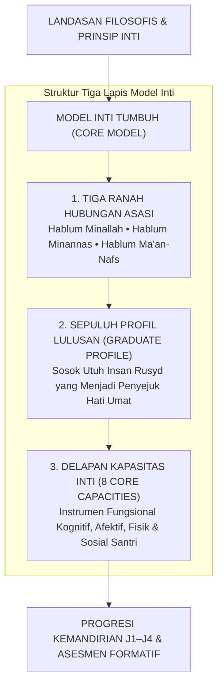
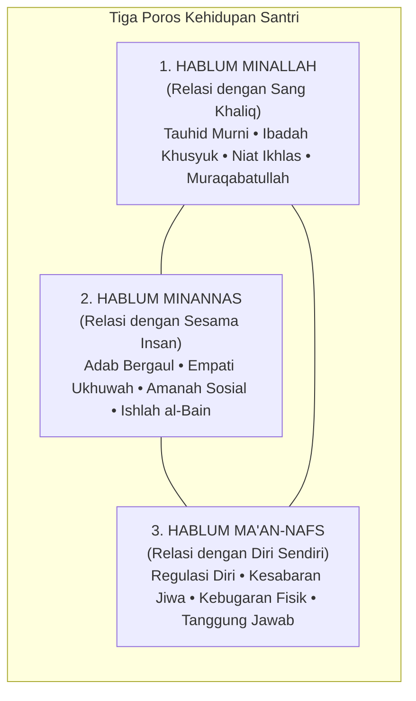
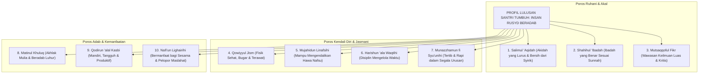
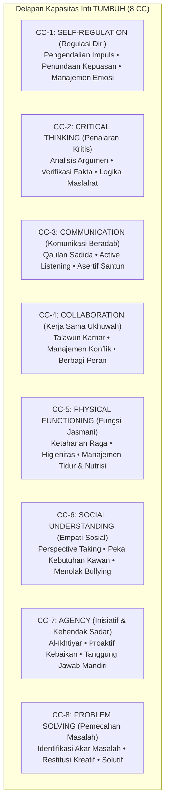
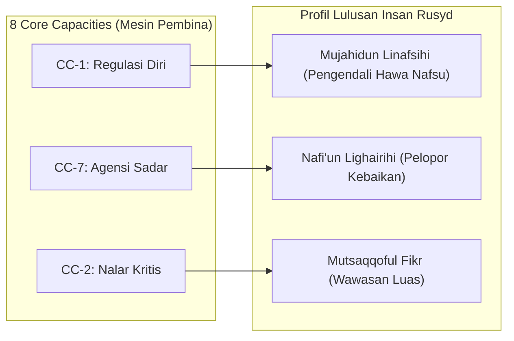

# BAB 10: KERANGKA STRUKTUR MODEL INTI TUMBUH
## Arsitektur Tiga Ranah Karakter, Sepuluh Profil Lulusan, dan Delapan Kapasitas Inti

> وَالَّذِينَ يَقُولُونَ رَبَّنَا هَبْ لَنَا مِنْ أَزْوَاجِنَا وَذُرِّيَّاتِنَا قُرَّةَ أَعْيُنٍ وَاجْعَلْنَا لِلْمُتَّقِينَ إِمَامًا
>
> *"Dan orang-orang yang berkata: 'Wahai Rabb kami! Anugerahkanlah kepada kami pasangan-pasangan kami dan keturunan kami sebagai penyejuk pandangan hati (qurrata a'yun), dan jadikanlah kami sebagai pemimpin bagi orang-orang yang bertakwa.'"*  
> — **Al-Qur'an al-Karim**, Surah Al-Furqan [25]: 74[^1]

---

### 10.1 Dari Filsafat Menuju Cetak Biru: Mengapa Pesantren Memerlukan Model Inti?

Pada empat bagian terdahulu, kita telah meletakkan pilar-pilar fondasi yang kokoh: Pandangan Alam Tauhid (Bagian I), Epistemologi Terpadu dan Antropologi Jiwa (Bagian II), Falsafah Tarbiyah dan Neurosains Remaja (Bagian III), serta Sumpah Integritas Non-Negotiables (Bagian IV). Seluruh fondasi tersebut menjawab pertanyaan: *Mengapa kita mendidik? Siapa yang kita didik? Dan batasan moral apa yang wajib kita jaga?*

Kini, kita tiba pada persimpangan krusial yang menentukan apakah seluruh nilai luhur tersebut akan mewujud menjadi kenyataan di lapangan, ataukah hanya akan terkubur sebagai teori indah di rak perpustakaan. Pertanyaan praktisnya adalah:

> **"Sosok santri seperti apa yang sesungguhnya ingin kita lahirkan saat ia melangkah keluar dari gerbang pondok? Dan kapasitas-kapasitas kunci apa saja yang harus kita latihkan ke dalam jiwa dan raganya selama dua puluh empat jam sehari?"**

Di sinilah **Model Inti (*The Core Model*)** mengambil peran sentralnya. 

Banyak pesantren mengalami kegagalan pembinaan bukan karena kekurangan dalil ayat dan hadits, melainkan karena **ketiadaan cetak biru kurikulum karakter (*curricular blueprint*) yang jelas dan terpadu**. Di sebagian pesantren, target pembinaan hanya dinyatakan dalam slogan-slogan abstrak yang mengawang-awang: *"Mencetak santri yang shalih, bertakwa, dan berakhlak mulia."* 

Ketika ditanya kepada para musyrif lapangan: *Apa tanda nyata santri yang shalih di kamar mandi? Apa indikator santri yang bertakwa saat antre makan siang? Dan bagaimana mengukur apakah seorang santri telah memiliki adab saat menghadapi perbedaan pendapat?* Para pembina kebingungan dan kembali menggunakan standar selera subjektif masing-masing.

Model Inti TUMBUH hadir untuk mengakhiri kerancuan tersebut. Model Inti adalah **jantung operasional arsitektur TUMBUH** yang menerjemahkan pandangan alam tauhid ke dalam **Peta Kapasitas Terukur (*Operational Competency Framework*)** tanpa mereduksi keluhuran jiwa manusia menjadi sekadar angka-angka mati.



---

### 10.2 Tiga Ranah Relasi Asasi: Kosmologi Hubungan Manusia

Seluruh gerak kehidupan santri selama dua puluh empat jam di asrama berporos pada **Tiga Ranah Hubungan Asasi (*The Triadic Domains of Relation*)**:



#### 1. Hablum Minallah (Relasi Vertikal Tauhid)
Merupakan poros transenden tertinggi yang mendasari keberadaan santri. Seluruh aktivitas asrama diarahkan untuk membangun kesadaran penghambaan (*'ubudiyyah*) yang murni kepada Allah ﷻ:
* Membersihkan hati dari riya', sum'ah, dan kesombongan spiritual.
* Menjadikan salat, tilawah Al-Qur'an, dan dzikir harian sebagai sumber ketenangan batin (*thuma'ninah*), bukan beban paksaan.
* Menumbuhkan rasa pengawasan batin (**Muraqabatullah**) yang menjaga santri saat ia berada sendirian di kegelapan kamar.

#### 2. Hablum Minannas (Relasi Horisontal Ukhuwah dan Maslahat)
Merupakan panggung pembuktian nyata dari kesalehan spiritual santri. Islam menolak kesalehan egoistik yang hanya asyik beribadah di pojok masjid namun mengabaikan penderitaan kawan sekamarnya.
* Mengamalkan adab bertetangga di kamar asrama: menghormati hak istirahat kawan, berbagi makanan, dan menjaga lisan dari ghibah.
* Mengembangkan empati sosial dan kesiapan melayani sesama (*khidmah*).
* Menjaga perdamaian asrama dan aktif melakukan rekonsiliasi (*Ishlah*) saat terjadi gesekan antarsantri.

#### 3. Hablum Ma'an-Nafs (Relasi Pengendalian Diri dan Amanah Raga)
Sering kali dilupakan dalam kurikulum konvensional: bagaimana seorang santri berinteraksi dengan tubuh, emosi, dan nafsunya sendiri.
* Menjaga hak raga (*haqqun-nafs*): mencukupi kebutuhan tidur, menjaga nutrisi gizi halal dan sehat, serta merawat kebersihan tubuh.
* Melatih pengendalian dorongan nafsu impulsif (*mujahadatun nafs*).
* Membangun konsep diri yang positif, penuh optimisme, dan merdeka dari rasa rendah diri atau keputusasaan (*self-worth based on fitrah*).

Ketiga ranah ini tidak boleh dipisah-pisahkan; seorang santri yang menyakiti temannya sesungguhnya sedang merusak hubungannya dengan Allah dan sedang menzalimi jiwanya sendiri.

---

### 10.3 Sepuluh Karakter Profil Lulusan: Insan Rusyd yang Menjadi Teladan

Merujuk pada tradisi pembinaan kader Islam yang diwariskan para ulama dan disintesiskan dengan kebutuhan peradaban kontemporer, ekosistem TUMBUH menetapkan **Sepuluh Karakter Profil Lulusan (*The Ten Graduate Profiles*)** yang menjadi gambaran kepribadian santri saat menyelesaikan masa tarbiyahnya[^2]:



Mari kita terjemahkan kesepuluh profil ini ke dalam indikator perilaku nyata di lingkungan asrama pesantren 24 jam:

1. **Salimul 'Aqidah (Akidah yang Lurus)**:  
   Santri memiliki keimanan tauhid yang kokoh, tidak menggantungkan nasib pada jimat atau ramalan, memahami hakikat takdir secara adil, dan senantiasa menggantungkan rasa takut serta harapannya hanya kepada Allah ﷻ.
2. **Shahihul 'Ibadah (Ibadah yang Benar)**:  
   Santri menguasai fikih thaharah dan salat sesuai dalil sunnah yang shahih, menjalankan ibadah dengan penuh kekhusyukan dan penghayatan makna, serta menjauhi bid'ah dan formalisme mekanis.
3. **Matinul Khuluq (Akhlak yang Kokoh Mulia)**:  
   Santri memiliki perisai adab yang luhur: jujur dalam perkataan, menepati janji, menundukkan pandangan dari hal-hal yang diharamkan, santun kepada guru, dan menghormati hak teman sekamar.
4. **Qowiyyul Jism (Fisik yang Sehat dan Tangguh)**:  
   Santri menjaga kebugaran raganya melalui olahraga teratur, memiliki daya tahan fisik yang prima, menjaga higienitas diri dan pakaian, serta menjaga ritme tidur biologis 7 jam demi kesehatan otaknya.
5. **Mutsaqqoful Fikr (Wawasan yang Luas dan Cerdas)**:  
   Santri haus akan ilmu pengetahuan, menguasai literatur turats klasik sekaligus melek terhadap dinamika sains modern, berpikir kritis membedakan kebenaran dari hoaks, dan gemar membaca.
6. **Mujahidun Linafsihi (Pejuang Pengendali Hawa Nafsu)**:  
   Santri memiliki regulasi diri yang kuat: mampu menahan amarah saat diprovokasi, mampu menunda kesenangan sesaat demi tujuan luhur, dan gigih melawan kemalasan bangun subuh.
7. **Harishun 'ala Waqtihi (Disiplin Mengelola Waktu)**:  
   Santri memandang waktu laksana pedang dan amanah umur yang berharga. Ia tidak membuang waktu dengan mengobrol sia-sia di lorong asrama, hadir tepat waktu sebelum bel berbunyi, dan memiliki jadwal harian yang tertata.
8. **Munazzhamun fi Syu'unihi (Tertib dalam Segala Urusan)**:  
   Santri memiliki keterampilan manajemen hidup: lemarinya tertata rapi, ranjangnya terpasang kencang, buku-bukunya tersusun menurut kategori, dan keuangannya tercatat dengan teliti.
9. **Qodirun 'alal Kasbi (Mandiri dan Terampil Produktif)**:  
   Santri tidak memiliki mentalitas parasit atau pengemis bantuan. Ia terampil mencuci pakaiannya sendiri, merawat fasilitasnya, memiliki etos kerja keras, dan terlatih memecahkan masalah praktis.
10. **Nafi'un Lighairihi (Bermanfaat bagi Sesama)**:  
    Puncak kemuliaan seorang muslim: santri menjadi pembawa rahmat bagi lingkungannya. Ia berinisiatif menolong kawan yang sakit, menjadi mentor belajar bagi adik kelasnya, dan aktif memelopori gerakan kebersihan asrama.

---

### 10.4 Arsitektur Delapan Kapasitas Inti (*The Eight Core Capacities - 8 CC*)

Untuk merealisasikan Sepuluh Karakter Profil Lulusan di atas, arsitektur TUMBUH menyusun mesin fungsional yang dinamakan **Delapan Kapasitas Inti (*The Eight Core Capacities / 8 CC*)**[^3]. 

Kapasitas Inti adalah serangkaian keterampilan eksekutif kognitif, emosional, fisik, dan sosial yang **dapat dilatih, diobservasi, dan diukur perkembangannya secara formatif**:



Mari kita bedah hakikat dan indikator operasional dari masing-masing Kapasitas Inti ini di asrama:

#### 1. CC-1: Regulasi Diri (*Self-Regulation / Mujahadatun Nafs*)
* **Definisi Fungsional**: Kemampuan santri mengendalikan respons emosi, pikiran, dan dorongan perilaku biologis sesaat demi mencapai tujuan kebaikan jangka panjang yang diridai Allah.
* **Indikator Asrama**: Mampu menarik napas dan menahan tangan saat emosi marah tersulut; mampu bangun saat alarm pertama berbunyi tanpa perlu digedor musyrif; mampu menahan diri dari menyentuh makanan kawan sekamar.

#### 2. CC-2: Penalaran Kritis (*Critical Thinking / Fikr Salih*)
* **Definisi Fungsional**: Kemampuan menelaah informasi secara objektif, membedakan antara dalil qath'i dengan ijtihad zhanni, menguji kebenaran berita sebelum menyebarkannya (*tabayyun*), dan menimbang maslahat-mudarat.
* **Indikator Asrama**: Tidak mudah termakan rumor dan gosip antarkamar; mampu menjelaskan alasan dan hikmah di balik aturan pondok; berani bertanya secara santun saat menemukan kebingungan konsep.

#### 3. CC-3: Komunikasi Beradab (*Communication / Qaulan Sadida*)
* **Definisi Fungsional**: Kemampuan mengekspresikan pikiran, perasaan, dan kebutuhan diri secara asertif, jujur, dan beradab, serta kemampuan mendengarkan orang lain dengan empati penuh (*active listening*).
* **Indikator Asrama**: Menggunakan bahasa yang santun dan menjauhi caci maki kasar; mampu menyampaikan keberatan kepada teman sekamar tanpa membentak; mendengarkan saat musyrif atau kawan sedang berbicara tanpa memotong pembicaraan.

#### 4. CC-4: Kerja Sama Ukhuwah (*Collaboration / At-Ta'awun*)
* **Definisi Fungsional**: Kemampuan bekerja bersama orang lain dalam mencapai maslahat kolektif, menghargai perbedaan peran, membagi beban kerja secara adil, dan mengutamakan kepentingan bersama di atas ego pribadi.
* **Indikator Asrama**: Menjalankan jadwal piket kebersihan kamar secara bertanggung jawab tanpa perlu disuruh; kompak merawat kebersihan fasilitas bersama; saling membantu merapikan ranjang kawan yang sedang sakit di klinik.

#### 5. CC-5: Keberfungsian Fisik dan Higienitas (*Physical Functioning / Qowiyyul Jism*)
* **Definisi Fungsional**: Kemampuan menjaga stamina biologis raga, merawat kebersihan tubuh dan pakaian, memelihara pola hidrasi dan gizi halal, serta menjaga ritme sirkadian tidur sehat 7 jam per malam.
* **Indikator Asrama**: Mandi teratur dan menjaga pakaian bersih dari najis; tidak bergadang melampaui batas jam malam; aktif mengikuti sesi riadah olahraga pagi asrama.

#### 6. CC-6: Kepekaan Sosial dan Empati (*Social Understanding / Al-Fahm al-Ijtima'i*)
* **Definisi Fungsional**: Kemampuan membaca dinamika lingkungan sosial, memahami sudut pandang dan perasaan orang lain (*perspective taking*), serta bersikap peka terhadap kebutuhan kawan yang sedang tertekan.
* **Indikator Asrama**: Menyadari ketika teman sekamar sedang murung atau menangis rindu keluarga lalu mendekatinya dengan hangat; menghentikan gurauan yang mulai melukai perasaan kawan; membela adik kelas yang mulai diintimidasi.

#### 7. CC-7: Inisiatif dan Agensi Sadar (*Agency / Al-Ikhtiyar*)
* **Definisi Fungsional**: Kemampuan bertindak secara proaktif atas dorongan kehendak batin sendiri, memandang diri sebagai subjek yang bertanggung jawab atas hidupnya, dan tidak menunggu perintah eksternal untuk berbuat kebajikan.
* **Indikator Asrama**: Memungut sampah yang tercecer di lantai masjid tanpa menunggu disuruh musyrif; berinisiatif mematikan kran air yang meluap; menyusun target muthala'ah mandiri sebelum ujian.

#### 8. CC-8: Pemecahan Masalah Mandiri (*Problem Solving / Hillul Musykilat*)
* **Definisi Fungsional**: Kemampuan mengidentifikasi akar persoalan secara objektif, merumuskan alternatif solusi kreatif yang adil, serta kesiapan menanggung konsekuensi dan memperbaiki kerusakan (*restitusi*) saat terjadi kesalahan.
* **Indikator Asrama**: Mampu mendamaikan perselisihan antarteman sekamar melalui musyawarah; jika tidak sengaja merusak barang kawan, segera melapor jujur dan mengganti kerugian; mencari jalan keluar cerdas saat menghadapi kendala hafalan.

---

### 10.5 Integrasi Sistemik: Bagaimana 8 CC Menggerakkan Profil Lulusan?

Perhatikan bagaimana Delapan Kapasitas Inti ini bekerja bukan sebagai kotak-kotak terpisah, melainkan sebagai **sistem jaringan yang saling menguatkan (*synergistic matrix*)**:



Ketika seorang musyrif melatih santri dalam **CC-1 (Regulasi Diri)** dan **CC-7 (Agensi Sadar)**, pada hakikatnya musyrif tersebut sedang menumbuhkan profil **Mujahidun Linafsihi** dan **Nafi'un Lighairihi**. Ketika musyrif melatih santri dalam **CC-3 (Komunikasi Beradab)** dan **CC-4 (Kerja Sama Ukhuwah)**, musyrif tersebut sedang mengukir profil **Matinul Khuluq** ke dalam kalbunya.

---

### 10.6 Matriks Pemetaan Silang: 10 Profil Lulusan vs 8 Core Capacities

Agar para pendidik dan perancang kurikulum pesantren dapat menelusuri korelasi fungsional antara profil lulusan ideal dan kapasitas perilaku harian, perhatikan matriks keterkaitan silang (*cross-mapping matrix*) berikut:

| No | 10 Profil Lulusan Insan Rusyd | Kapasitas Inti Primer (*Primary CC*) | Kapasitas Inti Pendukung (*Supporting CC*) | Bukti Konkret di Lantai Asrama 24 Jam |
| :---: | :--- | :--- | :--- | :--- |
| **1** | **Salimul 'Aqidah** (Akidah Lurus) | **CC-2** (Penalaran Kritis) | **CC-1** (Regulasi Diri) | Menolak takhayul, mistisisme syirik, dan hanya takut serta berharap kepada Allah. |
| **2** | **Shahihul 'Ibadah** (Ibadah Benar) | **CC-1** (Regulasi Diri) | **CC-5** (Keberfungsian Fisik) | Thaharah sempurna dari najis; salat khusyuk tepat waktu di saf awal. |
| **3** | **Matinul Khuluq** (Akhlak Kokoh) | **CC-3** (Komunikasi Beradab) | **CC-6** (Empati Sosial) | Tutur kata santun (*qaulan karima*), jujur, menepati janji, dan anti-ghashab. |
| **4** | **Qowiyyul Jism** (Fisik Bugar) | **CC-5** (Keberfungsian Fisik) | **CC-1** (Regulasi Diri) | Disiplin tidur 7 jam, olahraga teratur, menjaga kebersihan diri dan kamar. |
| **5** | **Mutsaqqoful Fikr** (Wawasan Luas) | **CC-2** (Penalaran Kritis) | **CC-8** (Pemecahan Masalah) | Menguasai kaidah ilmu turats dan sains modern; memverifikasi kebenaran informasi. |
| **6** | **Mujahidun Linafsihi** (Kuat Menahan Nafsu)| **CC-1** (Regulasi Diri) | **CC-7** (Agensi Sadar) | Mampu menahan amarah, sabar saat lapar/lelah, dan bangkit melawan rasa malas. |
| **7** | **Harishun 'ala Waqtihi** (Disiplin Waktu) | **CC-7** (Agensi Sadar) | **CC-1** (Regulasi Diri) | Hadir sebelum bel berbunyi; memanfaatkan waktu luang untuk membaca/berzikir. |
| **8** | **Munazzhamun fi Syu'unihi** (Tertib Urusan) | **CC-8** (Pemecahan Masalah) | **CC-4** (Kerja Sama Ukhuwah) | Lemari dan ranjang rapi simetris; buku tersusun teratur; amanah mengelola uang. |
| **9** | **Qodirun 'alal Kasbi** (Mandiri Terampil) | **CC-8** (Pemecahan Masalah) | **CC-5** (Keberfungsian Fisik) | Mandiri mencuci baju, merawat fasilitas, dan terampil mencari solusi praktis hidup. |
| **10**| **Nafi'un Lighairihi** (Bermanfaat bagi Umat) | **CC-4** (Kerja Sama Ukhuwah) | **CC-6** (Empati Sosial) | Aktif berkhidmah menolong kawan, memimpin gotong-royong, dan peduli sesama. |

---

### 10.7 Rubrik Perkembangan Empat Tingkat Kemandirian 8 CC (J1–J4)

Bagaimanakah seorang musyrif mengetahui bahwa seorang santri sedang bertumbuh kapasitas intinya? Sistem TUMBUH menyusun rubrik progresi empat tingkat kemandirian:

```text
               KONTINUUM PROGRESI KEMANDIRIAN 8 CC TUMBUH
┌────────────────────────────────────────────────────────────────────────┐
│ LEVEL 1 (J1): DIBIMBING INTENSIF (Perancah Penuh / High Scaffolding)   │
│ Santri memerlukan instruksi langsung, teladan nyata & pengawasan ketat.│
├────────────────────────────────────────────────────────────────────────┤
│ LEVEL 2 (J2): BERLATIH DENGAN PENDAMPINGAN (Coached & Supported)       │
│ Santri mulai memahami aturan, namun masih sering goyah saat emosi naik.│
├────────────────────────────────────────────────────────────────────────┤
│ LEVEL 3 (J3): MANDIRI BERKESADARAN (Internal Locus of Control)         │
│ Santri mempraktikkan adab secara konsisten atas dorongan batin sendiri.│
├────────────────────────────────────────────────────────────────────────┤
│ LEVEL 4 (J4): TELADAN PENGGERAK (Servant Leader & Culture Builder)     │
│ Santri mampu menginspirasi, membimbing adik kelas & merawat ekosistem. │
└────────────────────────────────────────────────────────────────────────┘
```

*Contoh Aplikasi pada CC-1 (Regulasi Diri / Pengendalian Amarah):*
* **J1 (Pemula)**: Saat marah, santri masih cenderung membanting pintu atau menangis kencang; membutuhkan musyrif untuk menenangkan fisiknya dan membimbing wudhu.
* **J2 (Berlatih)**: Santri mulai mengenali tanda amarahnya, namun terkadang masih melontarkan kata ketus sebelum akhirnya sadar dan beristighfar setelah diingatkan teman.
* **J3 (Mandiri)**: Saat tersulut emosi, santri secara otonom menarik napas dalam, diam menahan lisan, dan segera mengambil air wudhu tanpa perlu disuruh siapa pun.
* **J4 (Penggerak)**: Santri tidak hanya mampu mengendalikan dirinya sendiri, tetapi mampu menjadi penengah damai (*mushlih*) yang meredakan pertengkaran dua temannya di kamar dengan kalimat yang menyejukkan.

---

Dengan adanya Model Inti ini, kurikulum karakter pesantren tidak lagi bersifat abstrak. Para pembina asrama kini memiliki kompas operasional yang sangat jernih: setiap teguran, setiap sesi halaqah, dan setiap dinamika kamar mandi memiliki sasaran kapasitas yang jelas untuk ditumbuhkan.

Lalu, di manakah laboratorium tempat seluruh kapasitas ini diuji dan ditempa? Jawabannya adalah di dalam **ekosistem kehidupan asrama 24 jam**.

Bagaimanakah tata ruang asrama, titik rawan perundungan (*hotspots*), serta sinergi antara musyrif, guru madrasah, dan tim BK direkayasa secara ilmiah demi mengawal pertumbuhan kapasitas ini?

Inilah yang akan kita jelajahi secara mendalam dalam **Bab 11: Rekayasa Lingkungan Asrama & Ekosistem Terpadu 24 Jam**.

---

### Catatan Kaki & Rujukan Akademik

[^1]: Al-Qur'an al-Karim, Surah Al-Furqan [25]: 74.
[^2]: Hasan Al-Banna, *Risalatut Ta'alim*, Kairo: Dar at-Tauzi' wa an-Nasyr al-Islamiyyah, 1992, hlm. 12–18 mengenai sepuluh karakter muwashafat tarbiyah islamiyah; diselaraskan dengan Repositori TUMBUH v2.0.0, Dokumen Fundamental: `01_FUNDAMENTAL/03_CORE_MODEL/01_GRADUATE_PROFILE/README.md`.
[^3]: Repositori TUMBUH v2.0.0, Dokumen Fundamental: `01_FUNDAMENTAL/03_CORE_MODEL/04_CORE_CAPACITY_ARCHITECTURE/01_ARCHITECTURE_PURPOSE_AND_LOGIC.md` dan `01_CORE_CAPACITIES/README.md`.
